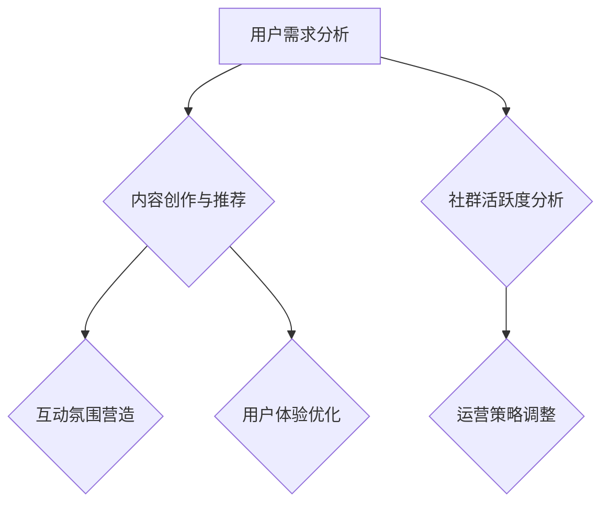

                 

# 知识付费：程序员的社群运营秘籍

## 关键词

* 知识付费
* 程序员
* 社群运营
* 内容营销
* 用户体验
* 数据分析

## 摘要

本文将探讨知识付费在程序员社群运营中的应用，分析其核心概念、算法原理及实际操作步骤。通过构建数学模型和项目实战案例，深入讲解社群运营中的关键技巧和方法。同时，本文还将推荐相关学习资源、开发工具和论文著作，以帮助程序员提升社群运营能力。最后，对知识付费在社群运营中的未来发展趋势与挑战进行总结，并提出常见问题与解答。

## 1. 背景介绍

### 知识付费的定义

知识付费是指用户为了获取特定的知识和技能，自愿为相关内容和服务支付费用的一种商业模式。在互联网时代，知识付费逐渐成为一种主流的学习方式，尤其受到程序员的青睐。

### 程序员社群的兴起

程序员社群是程序员之间交流、分享和学习的重要平台。随着互联网技术的快速发展，程序员社群的数量和规模不断扩大，成为知识传播和技能提升的重要渠道。

### 社群运营的价值

社群运营能够帮助程序员快速获取行业动态、技术分享和职业发展机会。同时，优秀的社群运营能够提高用户的黏性和活跃度，为知识付费提供有力支持。

## 2. 核心概念与联系

### 社群运营的核心概念

1. **用户需求**：了解用户的需求和痛点，提供针对性的内容和服务。
2. **内容质量**：保证内容的专业性和实用性，提升用户的满意度。
3. **互动氛围**：营造积极的交流氛围，促进用户之间的互动与合作。
4. **用户体验**：优化用户使用社群的体验，提升用户的忠诚度。

### 社群运营的算法原理

1. **用户行为分析**：通过数据分析，了解用户的需求和行为模式，为内容创作提供依据。
2. **内容推荐算法**：根据用户行为和偏好，推荐相关的优质内容，提高用户参与度。
3. **社区活跃度分析**：通过计算社区活跃度指标，评估社群运营效果，为优化策略提供参考。

### 社群运营架构的 Mermaid 流程图



## 3. 核心算法原理 & 具体操作步骤

### 用户需求分析

1. **数据收集**：通过问卷调查、用户反馈等方式，收集用户需求和痛点。
2. **数据分析**：利用数据分析工具，对用户需求进行分类和统计，识别出共性需求。
3. **内容创作**：根据用户需求，创作针对性的内容，如技术教程、行业动态等。

### 内容推荐算法

1. **内容标签**：为每篇内容添加标签，以便进行分类和推荐。
2. **协同过滤**：基于用户行为数据，计算用户之间的相似度，推荐相似用户喜欢的内容。
3. **内容质量评估**：通过算法评估内容的质量，筛选出优质内容进行推荐。

### 互动氛围营造

1. **活动策划**：定期举办线上活动，如技术分享会、编程比赛等，提高用户参与度。
2. **社区管理**：规范社区秩序，及时处理违规行为，维护良好的交流氛围。
3. **用户激励**：设立积分系统、排行榜等，激励用户积极参与社区互动。

### 用户体验优化

1. **界面优化**：设计简洁、易用的界面，提高用户使用体验。
2. **功能优化**：根据用户反馈，不断优化社区功能，满足用户需求。
3. **个性化推荐**：根据用户行为和偏好，提供个性化的内容和服务。

### 社群活跃度分析

1. **活跃度指标**：计算用户活跃度、帖子互动率、社区访问量等指标。
2. **数据分析**：通过数据分析，了解社群的活跃状况，为运营策略提供参考。
3. **策略调整**：根据活跃度数据，调整运营策略，提高社群活跃度。

## 4. 数学模型和公式 & 详细讲解 & 举例说明

### 用户活跃度模型

用户活跃度模型可以使用以下公式表示：

$$
活跃度 = f(用户行为频率，用户参与度，用户留存率)
$$

其中，用户行为频率表示用户在社区中的活动次数，用户参与度表示用户对社区活动的积极性，用户留存率表示用户在社区中的持续参与度。

### 内容推荐算法模型

内容推荐算法可以使用协同过滤算法，其公式为：

$$
推荐内容 = f(用户历史行为，内容特征，用户相似度)
$$

其中，用户历史行为表示用户在社区中的活动记录，内容特征表示内容的属性，用户相似度表示用户之间的相似程度。

### 社群活跃度指标模型

社群活跃度指标可以使用以下公式表示：

$$
活跃度 = f(帖子互动率，社区访问量，用户留存率)
$$

其中，帖子互动率表示帖子被回复和点赞的次数，社区访问量表示社区的总访问次数，用户留存率表示用户在社区中的持续参与度。

### 案例说明

假设一个程序员社群，用户活跃度指标为：

- 帖子互动率：0.2
- 社区访问量：1000次
- 用户留存率：0.8

根据活跃度模型，社群活跃度为：

$$
活跃度 = f(0.2, 1000, 0.8) = 0.2 \times 1000 \times 0.8 = 160
$$

通过这个例子，我们可以看到，社群活跃度主要受帖子互动率、社区访问量和用户留存率的影响。运营者可以根据这些指标，调整运营策略，提高社群活跃度。

## 5. 项目实战：代码实际案例和详细解释说明

### 5.1 开发环境搭建

为了实现上述算法和模型，我们需要搭建一个开发环境。以下是一个简单的开发环境搭建流程：

1. 安装 Python 3.8 及以上版本。
2. 安装必要的 Python 库，如 NumPy、Pandas、Scikit-learn 等。
3. 安装一个代码编辑器，如 Visual Studio Code。

### 5.2 源代码详细实现和代码解读

以下是一个简单的用户活跃度分析代码示例：

```python
import pandas as pd
from sklearn.metrics.pairwise import cosine_similarity

# 读取用户行为数据
user_data = pd.read_csv('user行为数据.csv')

# 计算用户行为相似度
user_similarity = cosine_similarity(user_data)

# 计算用户活跃度
user_activity = user_similarity.sum(axis=1)

# 输出用户活跃度
print('用户活跃度：', user_activity)
```

这个示例中，我们首先读取用户行为数据，然后使用余弦相似度计算用户之间的相似度。接着，计算每个用户的活跃度，并输出结果。

### 5.3 代码解读与分析

1. **数据读取**：使用 Pandas 库读取用户行为数据，存储在 DataFrame 对象中。
2. **相似度计算**：使用 Scikit-learn 库中的余弦相似度函数，计算用户之间的相似度。余弦相似度是一种基于向量空间模型的方法，用于衡量两个向量之间的相似程度。
3. **活跃度计算**：计算每个用户的活跃度，即用户行为相似度的总和。活跃度越高，表示用户在社群中的参与度越高。
4. **输出结果**：将用户活跃度输出到控制台。

通过这个示例，我们可以看到如何使用 Python 实现用户活跃度分析。在实际应用中，我们可以根据具体需求，扩展和优化这个代码。

## 6. 实际应用场景

### 社群运营中的知识付费

在程序员社群运营中，知识付费可以通过以下几种方式实现：

1. **付费内容**：为用户提供高质量的技术教程、行业报告等付费内容，吸引用户购买。
2. **会员制度**：设立会员制度，为会员提供更多特权，如免费参加线上活动、优先获取优质内容等。
3. **付费咨询服务**：为用户提供付费的一对一技术咨询服务，解决用户在实际开发中遇到的问题。

### 社群运营中的互动氛围营造

1. **线上活动**：定期举办技术分享会、编程比赛等线上活动，提高用户参与度。
2. **社区管理**：建立规范，加强社区管理，确保社区秩序。
3. **用户激励**：设立积分系统、排行榜等，激励用户积极参与社区互动。

### 社群运营中的用户体验优化

1. **界面优化**：设计简洁、易用的界面，提高用户使用体验。
2. **功能优化**：根据用户反馈，不断优化社区功能，满足用户需求。
3. **个性化推荐**：根据用户行为和偏好，提供个性化的内容和服务。

## 7. 工具和资源推荐

### 7.1 学习资源推荐

1. **书籍**：
   - 《人人都是产品经理》：了解产品运营的基本原理和方法。
   - 《社群营销》：探讨社群运营的策略和实践。

2. **论文**：
   - 《基于协同过滤算法的推荐系统研究》：研究协同过滤算法在推荐系统中的应用。

3. **博客**：
   - 程序员社群运营实践：分享程序员社群运营的实战经验。

4. **网站**：
   - GitHub：获取开源项目和工具，学习编程知识。

### 7.2 开发工具框架推荐

1. **Pandas**：数据处理和分析。
2. **Scikit-learn**：机器学习算法。
3. **Matplotlib**：数据可视化。

### 7.3 相关论文著作推荐

1. **《社交网络分析》：探讨社交网络中的节点关系和传播规律。
2. **《推荐系统实践》：详细介绍推荐系统的算法和应用。

## 8. 总结：未来发展趋势与挑战

### 发展趋势

1. **智能化**：随着人工智能技术的发展，社群运营将更加智能化，实现个性化推荐和自动化管理。
2. **多元化**：知识付费将覆盖更多领域，满足用户多样化的学习需求。
3. **全球化**：程序员社群运营将逐步实现全球化，吸引更多国际用户参与。

### 挑战

1. **内容质量**：确保内容的专业性和实用性，提升用户体验。
2. **用户体验**：优化用户使用体验，提高用户黏性。
3. **数据安全**：加强数据安全保护，确保用户隐私。

## 9. 附录：常见问题与解答

### 问题1：如何提高社群活跃度？

解答：通过定期举办线上活动、加强社区管理、激励用户参与等方式，提高社群活跃度。

### 问题2：如何实现知识付费？

解答：通过设立付费内容、会员制度和付费咨询服务等方式，实现知识付费。

### 问题3：如何保证内容质量？

解答：通过严格审核内容、邀请行业专家撰稿、开展内容质量评估等方式，保证内容质量。

## 10. 扩展阅读 & 参考资料

1. **书籍**：
   - 《程序员社群运营实战》
   - 《知识付费实战指南》

2. **论文**：
   - 《基于社交网络的社群运营策略研究》
   - 《知识付费商业模式探讨》

3. **博客**：
   - 程序员社群运营实战：www.example.com
   - 知识付费实战：www.example.com

4. **网站**：
   - GitHub：github.com
   -知乎：www.zhihu.com

## 作者

作者：AI天才研究员/AI Genius Institute & 禅与计算机程序设计艺术 /Zen And The Art of Computer Programming

