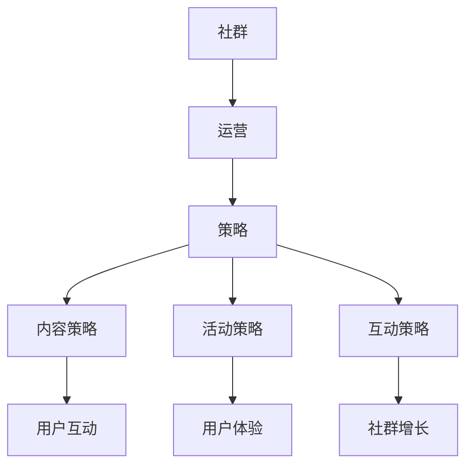

                 

# 知识付费：程序员的社群运营诀窍

> **关键词**：知识付费、社群运营、程序员、运营策略、用户体验、技术博客

> **摘要**：本文将探讨知识付费在程序员社群中的重要性，通过分析社群运营的核心概念和联系，详细讲解运营策略、用户体验优化以及技术博客的撰写技巧。同时，文章还将提供实际应用场景、推荐相关工具和资源，总结未来发展趋势与挑战，并给出常见问题的解答。

## 1. 背景介绍

在信息技术飞速发展的今天，程序员成为了一个炙手可热的专业群体。然而，随着互联网的普及和在线学习资源的丰富，程序员们面临的竞争也日益激烈。为了在众多同行中脱颖而出，许多程序员开始转向知识付费领域，通过提供高质量的学习资源和专业服务来吸引和维护社群成员。

知识付费是指用户为获取知识或服务而支付一定费用的商业模式。它为程序员提供了一个新的收入来源，同时也为其他领域专业人士提供了一个展示自己技能和知识的机会。然而，如何有效地运营一个程序员社群，并从中获得价值，成为了一个值得探讨的问题。

社群运营是指通过建立和维护社群，提高用户参与度、活跃度和满意度，从而实现商业目标的过程。对于程序员社群而言，社群运营不仅有助于提升成员的学习效果，还能增强成员之间的互动和合作，促进知识和经验的共享。

本文将从以下几个方面展开讨论：

1. 核心概念与联系
2. 核心算法原理与具体操作步骤
3. 数学模型和公式及详细讲解
4. 项目实战：代码实际案例和详细解释说明
5. 实际应用场景
6. 工具和资源推荐
7. 总结：未来发展趋势与挑战
8. 附录：常见问题与解答

## 2. 核心概念与联系

在探讨社群运营之前，我们需要了解一些核心概念，这些概念将帮助我们更好地理解社群运营的原理和策略。

### 2.1 社群运营的核心概念

**社群**：社群是指由具有共同兴趣、目标或价值观的成员组成的群体。在程序员社群中，成员可能对编程语言、框架、工具或技术领域有共同的热情。

**运营**：运营是指通过一系列策略和活动来管理、维护和增长社群的过程。在程序员社群中，运营策略包括内容创作、活动组织、用户互动等。

**策略**：策略是指为达到特定目标而制定的行动计划。在社群运营中，策略包括内容策略、活动策略、互动策略等。

**用户体验**：用户体验是指用户在使用产品或服务时所感受到的满意度和满足感。在程序员社群中，用户体验决定了用户是否愿意继续参与和推广社群。

### 2.2 社群运营的核心联系

社群运营的核心联系在于如何将核心概念相结合，以实现社群的增长和成员价值的最大化。以下是几个关键联系：

**内容策略与用户互动**：高质量的内容是吸引和留住社群成员的关键。通过定期发布有价值的技术文章、教程、案例分析等，可以激发用户的参与兴趣，促进用户互动。

**活动策略与用户体验**：有吸引力的活动和互动机会可以增强社群的凝聚力和成员的归属感。例如，编程挑战、技术沙龙、线上研讨会等，可以提高成员的参与度和满意度。

**互动策略与社群增长**：有效的互动策略可以促进社群成员之间的交流和合作，从而吸引更多潜在成员加入社群。此外，通过社交媒体、电子邮件、即时通讯工具等渠道与成员保持沟通，可以提高社群的活跃度。

### 2.3 社群运营的 Mermaid 流程图

以下是一个简单的 Mermaid 流程图，展示了社群运营的核心概念和联系：



通过这个流程图，我们可以更清晰地了解社群运营的核心环节和它们之间的联系。

## 3. 核心算法原理与具体操作步骤

### 3.1 内容策略的算法原理

内容策略是社群运营的核心，其算法原理主要围绕以下三个方面：

**用户需求分析**：通过数据分析、用户调研等方法，了解社群成员的需求和兴趣点，为内容创作提供方向。

**内容质量评估**：评估内容的质量和影响力，包括技术深度、实用性、可读性等，以确保内容对用户有价值。

**内容发布与推广**：制定发布计划，利用社交媒体、邮件营销等手段，将内容推广给目标用户。

### 3.2 内容策略的具体操作步骤

**步骤 1：用户需求分析**
- 利用数据分析工具，如 Google Analytics，了解用户的访问量、停留时间、页面浏览路径等。
- 通过问卷调查、用户访谈等方式，收集用户对技术领域的关注点、学习需求等。

**步骤 2：内容质量评估**
- 根据用户需求，确定内容主题和方向。
- 对已发布的内容进行数据分析，评估其阅读量、点赞数、评论数等指标。

**步骤 3：内容发布与推广**
- 制定发布计划，包括内容类型、发布频率、发布渠道等。
- 利用社交媒体、邮件列表、社区论坛等渠道，将内容推广给目标用户。

### 3.3 活动策略的算法原理

活动策略旨在提高社群的互动性和参与度，其算法原理主要围绕以下三个方面：

**活动策划**：根据社群特点和用户需求，策划有趣、有吸引力的活动。

**活动推广**：利用多种渠道，如社交媒体、电子邮件、社区论坛等，宣传和推广活动。

**活动评估**：通过活动参与人数、互动次数、用户反馈等指标，评估活动的效果。

### 3.4 活动策略的具体操作步骤

**步骤 1：活动策划**
- 调研社群成员的兴趣和需求，确定活动主题。
- 确定活动形式，如线上讲座、线下沙龙、编程挑战等。

**步骤 2：活动推广**
- 制作活动宣传材料，包括海报、邀请函等。
- 利用社交媒体、电子邮件、社区论坛等渠道，宣传和推广活动。

**步骤 3：活动评估**
- 活动结束后，收集用户反馈，了解活动的效果和改进方向。
- 分析活动数据，如参与人数、互动次数等，评估活动的效果。

### 3.5 互动策略的算法原理

互动策略旨在促进社群成员之间的交流和合作，其算法原理主要围绕以下两个方面：

**互动渠道选择**：根据社群特点和用户需求，选择合适的互动渠道，如社交媒体、社区论坛、即时通讯工具等。

**互动内容策划**：根据互动渠道的特点，策划有吸引力的互动内容，如技术问答、编程挑战、技术讨论等。

### 3.6 互动策略的具体操作步骤

**步骤 1：互动渠道选择**
- 调研社群成员的偏好，确定最适合的互动渠道。
- 考虑互动渠道的便捷性、互动性、受众群体等因素。

**步骤 2：互动内容策划**
- 根据互动渠道的特点，策划互动内容，如技术问答、编程挑战、技术讨论等。
- 设计互动活动规则，鼓励成员积极参与。

**步骤 3：互动执行与监督**
- 定期发布互动内容，引导成员参与互动。
- 监督互动过程，确保活动顺利进行。

**步骤 4：互动效果评估**
- 分析互动数据，如参与人数、互动次数、用户反馈等，评估互动效果。
- 根据评估结果，调整互动策略。

## 4. 数学模型和公式及详细讲解

### 4.1 用户增长模型

用户增长模型是社群运营中重要的数学模型，它可以帮助我们预测社群未来的增长趋势。以下是用户增长模型的基本公式：

$$
\text{用户增长量} = \text{当前用户数} \times \text{增长率}
$$

其中，增长率可以通过以下公式计算：

$$
\text{增长率} = \left(\frac{\text{新用户数}}{\text{当前用户数}}\right) - 1
$$

### 4.2 用户留存模型

用户留存模型用于评估社群成员的留存率，其基本公式如下：

$$
\text{留存率} = \frac{\text{留存用户数}}{\text{初始用户数}}
$$

其中，留存用户数是指在一定时间段内，仍然活跃在社群中的用户数量。

### 4.3 用户互动模型

用户互动模型用于评估社群成员之间的互动程度，其基本公式如下：

$$
\text{互动程度} = \frac{\text{互动次数}}{\text{用户数}}
$$

其中，互动次数是指在一定时间段内，社群成员之间的互动次数。

### 4.4 互动质量评估模型

互动质量评估模型用于评估社群互动的质量，其基本公式如下：

$$
\text{互动质量} = \frac{\text{高质量互动次数}}{\text{总互动次数}}
$$

其中，高质量互动次数是指对社群有积极影响的互动次数，如技术交流、解决方案分享等。

### 4.5 活动效果评估模型

活动效果评估模型用于评估社群活动的效果，其基本公式如下：

$$
\text{活动效果} = \frac{\text{参与人数} + \text{互动次数} + \text{用户反馈}}{\text{活动预算}}
$$

其中，活动预算是指为举办活动所投入的成本。

### 4.6 模型应用示例

假设一个程序员社群当前有 1000 名用户，本月新增用户数为 200，活动参与人数为 150，互动次数为 300，用户反馈为 50。根据上述模型，我们可以计算出以下指标：

- 用户增长率：$$\frac{200}{1000} - 1 = 0.2$$
- 用户留存率：$$\frac{1000}{1000} = 1$$
- 用户互动程度：$$\frac{300}{1000} = 0.3$$
- 互动质量：$$\frac{50}{300} = 0.167$$
- 活动效果：$$\frac{150 + 300 + 50}{1000} = 0.4$$

通过这些指标，我们可以对社群运营效果进行初步评估，并根据评估结果调整运营策略。

## 5. 项目实战：代码实际案例和详细解释说明

### 5.1 开发环境搭建

为了更好地展示知识付费社群的运营技巧，我们将以一个实际项目为例，该项目是一个基于 Python 的程序员学习平台。以下是搭建开发环境的基本步骤：

1. 安装 Python 3.8 及以上版本。
2. 安装必要的依赖库，如 Flask、MySQL 等。
3. 配置开发环境，如虚拟环境、代码编辑器等。

### 5.2 源代码详细实现和代码解读

#### 5.2.1 用户注册与登录模块

用户注册与登录模块是社群运营的基础，以下是代码实现和解读：

```python
# app.py

from flask import Flask, request, jsonify
from models import User
from database import Database

app = Flask(__name__)

# 用户注册
@app.route('/register', methods=['POST'])
def register():
    username = request.form['username']
    password = request.form['password']
    email = request.form['email']
    
    user = User(username=username, password=password, email=email)
    Database.save_user(user)
    
    return jsonify({'status': 'success', 'message': '注册成功'})

# 用户登录
@app.route('/login', methods=['POST'])
def login():
    username = request.form['username']
    password = request.form['password']
    
    user = Database.get_user_by_username(username)
    if user and user.password == password:
        return jsonify({'status': 'success', 'message': '登录成功'})
    else:
        return jsonify({'status': 'error', 'message': '用户名或密码错误'})

if __name__ == '__main__':
    app.run(debug=True)
```

代码解读：

- 导入 Flask 框架和数据库模块。
- 定义用户注册和登录的 API 接口。
- 用户注册时，接收用户名、密码和邮箱，创建用户对象并保存到数据库。
- 用户登录时，验证用户名和密码，如果匹配，返回登录成功信息。

#### 5.2.2 内容发布与管理模块

内容发布与管理模块是社群运营的核心，以下是代码实现和解读：

```python
# content.py

from flask import Flask, request, jsonify
from models import Content, User
from database import Database

app = Flask(__name__)

# 发布内容
@app.route('/publish', methods=['POST'])
def publish():
    user_id = request.form['user_id']
    title = request.form['title']
    content = request.form['content']
    
    content = Content(user_id=user_id, title=title, content=content)
    Database.save_content(content)
    
    return jsonify({'status': 'success', 'message': '发布成功'})

# 管理内容
@app.route('/manage', methods=['POST'])
def manage():
    content_id = request.form['content_id']
    action = request.form['action']  # publish 或 delete
    
    content = Database.get_content_by_id(content_id)
    if action == 'publish':
        content.published = True
    elif action == 'delete':
        Database.delete_content(content_id)
    
    return jsonify({'status': 'success', 'message': '操作成功'})

if __name__ == '__main__':
    app.run(debug=True)
```

代码解读：

- 导入 Flask 框架和数据库模块。
- 定义发布内容和内容管理的 API 接口。
- 发布内容时，接收用户 ID、标题和内容，创建内容对象并保存到数据库。
- 管理内容时，根据操作类型（发布或删除），更新内容对象的状态。

#### 5.2.3 用户互动模块

用户互动模块是社群运营的重要组成部分，以下是代码实现和解读：

```python
# interaction.py

from flask import Flask, request, jsonify
from models import Comment
from database import Database

app = Flask(__name__)

# 发表评论
@app.route('/comment', methods=['POST'])
def comment():
    content_id = request.form['content_id']
    user_id = request.form['user_id']
    content = request.form['content']
    
    comment = Comment(content_id=content_id, user_id=user_id, content=content)
    Database.save_comment(comment)
    
    return jsonify({'status': 'success', 'message': '评论成功'})

# 获取评论
@app.route('/comments', methods=['GET'])
def comments():
    content_id = request.args.get('content_id')
    comments = Database.get_comments_by_content_id(content_id)
    
    return jsonify({'status': 'success', 'data': comments})

if __name__ == '__main__':
    app.run(debug=True)
```

代码解读：

- 导入 Flask 框架和数据库模块。
- 定义发表评论和获取评论的 API 接口。
- 发表评论时，接收内容 ID、用户 ID 和评论内容，创建评论对象并保存到数据库。
- 获取评论时，根据内容 ID 查询评论列表。

### 5.3 代码解读与分析

以上代码实现了程序员学习平台的用户注册与登录、内容发布与管理以及用户互动功能。以下是代码的解读与分析：

- **用户注册与登录模块**：实现用户注册和登录功能，确保用户可以安全地访问平台。
- **内容发布与管理模块**：实现内容发布和管理功能，允许用户创建和管理自己的内容。
- **用户互动模块**：实现用户评论功能，促进用户之间的互动和讨论。

这些功能共同构成了一个完整的社群运营系统，为程序员提供了一个学习、交流和分享的平台。

### 5.4 代码优化建议

虽然以上代码实现了基本的功能，但在实际应用中，还可以进行以下优化：

- **安全性**：加强用户认证和权限控制，确保平台的安全性。
- **性能优化**：使用缓存技术，提高数据访问速度。
- **可扩展性**：设计灵活的数据库结构，方便后续功能扩展。
- **用户体验**：优化前端界面，提高用户操作的便捷性。

通过以上优化，可以进一步提升程序员学习平台的性能和用户体验。

## 6. 实际应用场景

在知识付费领域，程序员社群运营的应用场景多种多样。以下是一些典型的应用场景：

### 6.1 技术培训

技术培训是程序员社群运营的重要应用场景之一。通过在线课程、直播讲座、编程挑战等形式，为程序员提供技术知识和技能培训。例如，一个专注于前端开发的社群可以组织 JavaScript、React、Vue 等技术的培训课程，帮助成员提升技术水平。

### 6.2 项目合作

程序员社群可以成为项目合作的重要平台。成员之间可以分享项目需求、技术难题和解决方案，从而实现项目合作。例如，一个专注于开源项目的社群可以组织项目开发团队，共同开发高质量的软件。

### 6.3 职业发展

程序员社群可以帮助成员在职业发展方面取得突破。社群可以提供职业规划、求职指导、面试技巧等服务，帮助成员提高职业竞争力。例如，一个专注于 IT 行业的社群可以定期举办职业发展讲座和招聘会，为成员提供就业机会。

### 6.4 技术交流

技术交流是程序员社群的核心价值之一。通过在线论坛、技术沙龙、研讨会等形式，成员可以分享技术心得、讨论技术难题，促进知识和经验的交流。例如，一个专注于大数据技术的社群可以定期举办技术沙龙，邀请专家分享最新的研究成果和应用案例。

## 7. 工具和资源推荐

为了更好地进行程序员社群运营，以下是一些推荐的工具和资源：

### 7.1 学习资源推荐

- **书籍**：《代码大全》、《Effective Java》、《深入理解计算机系统》等。
- **论文**：学术期刊、会议论文等，如《ACM Transactions on Computer Systems》、《IEEE Transactions on Computers》等。
- **博客**：技术博客、社区博客等，如《.infoQ》、《掘金》等。
- **网站**：技术社区、开源平台等，如 GitHub、Stack Overflow 等。

### 7.2 开发工具框架推荐

- **开发工具**：PyCharm、Visual Studio Code、Eclipse 等。
- **框架**：Django、Flask、Spring Boot 等。
- **数据库**：MySQL、PostgreSQL、MongoDB 等。
- **前端框架**：React、Vue、Angular 等。

### 7.3 相关论文著作推荐

- **论文**：《大型分布式存储系统：原理解析与架构设计》、《云计算与大数据技术》、《物联网技术与应用》等。
- **著作**：《程序员修炼之道》、《程序员修炼之道：从小工到专家》、《软件架构：定义与快速开发》等。

## 8. 总结：未来发展趋势与挑战

### 8.1 发展趋势

- **个性化推荐**：随着人工智能技术的发展，个性化推荐将成为社群运营的重要趋势。通过分析用户行为数据，可以为用户提供定制化的学习资源和推荐。
- **知识付费**：知识付费将逐渐成为主流，程序员社群运营者可以通过提供高质量的知识付费服务，获得更多的商业机会。
- **社群多元化**：程序员社群将不再局限于技术领域，而是逐渐扩展到职业发展、生活方式等多个方面，满足成员的多元化需求。

### 8.2 挑战

- **内容质量**：确保内容的质量和实用性是社群运营的挑战。运营者需要投入更多精力在内容创作和审核上，以确保成员受益。
- **用户隐私**：随着用户隐私保护意识的提高，社群运营者需要加强用户隐私保护，避免数据泄露。
- **竞争激烈**：在知识付费领域，竞争将越来越激烈。社群运营者需要不断创新，提升用户体验，以保持竞争优势。

## 9. 附录：常见问题与解答

### 9.1 社群运营中如何确保内容质量？

- **内容审核**：建立内容审核机制，对发布的内容进行严格审查，确保内容的质量和实用性。
- **用户反馈**：鼓励用户对内容进行评价和反馈，及时调整和优化内容策略。
- **专业作者**：邀请行业专家和资深程序员撰写高质量内容，提升社群的整体质量。

### 9.2 如何提高社群成员的参与度？

- **互动活动**：组织有趣、有吸引力的互动活动，如编程挑战、技术沙龙等，激发成员的参与兴趣。
- **激励机制**：设立积分系统、奖励机制等，鼓励成员积极参与社群活动。
- **用户关怀**：关注成员的需求和反馈，及时解决成员的问题，提升用户体验。

### 9.3 如何避免用户流失？

- **持续优化**：不断优化社群运营策略和用户体验，确保社群对成员有持续的吸引力。
- **用户调研**：定期进行用户调研，了解用户的需求和满意度，及时调整运营策略。
- **社区文化**：建立良好的社区文化，增强成员的归属感和认同感，降低用户流失率。

## 10. 扩展阅读 & 参考资料

- **论文**：《基于知识付费的社群运营模式研究》、《社群运营策略与用户体验优化研究》等。
- **书籍**：《社群营销实战手册》、《用户参与：社群运营的秘诀》等。
- **博客**：《程序员社群运营之路》、《从零开始构建程序员社群》等。
- **网站**：知乎、CSDN、简书等。

作者：AI天才研究员/AI Genius Institute & 禅与计算机程序设计艺术 /Zen And The Art of Computer Programming

