                 

# 知识体系的构建：从基本元素到复杂结构

## 摘要

本文旨在探讨知识体系的构建过程，从基本元素出发，逐步构建复杂结构。我们将通过分析核心概念、算法原理、数学模型以及实际应用场景，揭示知识体系构建的内在规律和关键步骤。此外，本文还将推荐相关的工具和资源，以助读者深入理解和实践知识体系的构建。希望本文能够为读者在学术研究、技术探索和职业发展中提供有益的启示。

## 1. 背景介绍

知识体系是人们认识和解决问题的基本框架，它包含了一系列相互关联的基本概念、原理、算法和方法。在现代信息技术飞速发展的背景下，构建有效的知识体系显得尤为重要。一方面，它可以提高我们的思维能力和问题解决能力；另一方面，它可以帮助我们更好地应对复杂多变的信息环境。

知识体系的构建是一个多层次、多维度的过程，涉及到多个学科和领域。从基本元素出发，我们需要了解这些元素之间的关系和相互作用，进而构建复杂结构。在这个过程中，逻辑思维、抽象能力和创造力都是必不可少的。

本文将围绕知识体系的构建展开讨论，具体包括以下内容：

1. 核心概念与联系
2. 核心算法原理与具体操作步骤
3. 数学模型和公式及详细讲解与举例说明
4. 项目实战：代码实际案例和详细解释说明
5. 实际应用场景
6. 工具和资源推荐
7. 未来发展趋势与挑战
8. 附录：常见问题与解答
9. 扩展阅读与参考资料

通过以上内容的探讨，我们希望能够为读者提供一个系统、全面的视角，以更好地理解和构建知识体系。

## 2. 核心概念与联系

在探讨知识体系的构建之前，我们需要先了解一些核心概念，这些概念是构建知识体系的基础。以下是几个关键概念及其相互关系：

### 2.1 知识体系

知识体系是指一系列相互关联的知识点所构成的整体结构。它不仅包括基本概念和原理，还包括这些概念和原理之间的逻辑关系。知识体系有助于我们更好地理解世界，提高问题解决能力。

### 2.2 基本概念

基本概念是构成知识体系的最小单元。例如，在计算机科学中，基本概念包括数据类型、算法、数据结构等。了解基本概念是构建知识体系的前提。

### 2.3 算法

算法是解决问题的一系列步骤。在知识体系中，算法是一种重要的工具，用于实现各种功能。常见的算法有排序算法、搜索算法、图算法等。

### 2.4 数学模型

数学模型是用数学语言描述现实世界问题的一种方法。在知识体系中，数学模型有助于我们理解复杂问题，并提供解决问题的途径。

### 2.5 数据结构

数据结构是存储和组织数据的方法。在知识体系中，数据结构是实现算法的重要基础。常见的数据结构包括数组、链表、树、图等。

### 2.6 软件工程

软件工程是应用工程、科学和数学原理，开发、维护和使用软件的一门学科。在知识体系中，软件工程提供了构建复杂系统的框架和方法。

### 2.7 人工智能

人工智能是研究、开发和应用使计算机模拟、延伸和扩展人的智能的理论、方法、技术及应用系统的一门新的技术科学。在知识体系中，人工智能是一种重要的工具和手段，用于解决各种复杂问题。

### 2.8 机器学习

机器学习是人工智能的一个分支，它通过计算机模拟或实现人类的学习行为，使计算机具备自主学习和适应能力。在知识体系中，机器学习是实现人工智能的关键技术。

### 2.9 深度学习

深度学习是机器学习的一种方法，通过多层神经网络模型，自动从数据中提取特征并进行分类、回归等任务。在知识体系中，深度学习是一种强大的工具，用于解决许多复杂问题。

### 2.10 人工智能应用场景

人工智能应用场景包括自然语言处理、计算机视觉、自动驾驶、推荐系统等。在知识体系中，了解这些应用场景有助于我们更好地理解人工智能的实际应用价值。

### 2.11 知识体系构建方法

知识体系构建方法包括以下几种：

1. **归纳法**：通过分析具体实例，归纳出一般规律。
2. **演绎法**：从一般原理出发，推导出具体结论。
3. **类比法**：通过比较相似的问题，找到解决方案。
4. **联想法**：通过回忆和联想，构建新的知识体系。

### 2.12 Mermaid 流程图

以下是一个用 Mermaid 编写的知识体系构建流程图：

```mermaid
graph TD
    A[知识体系构建] --> B[基本概念]
    A --> C[算法]
    A --> D[数学模型]
    A --> E[数据结构]
    A --> F[软件工程]
    A --> G[人工智能]
    A --> H[机器学习]
    A --> I[深度学习]
    A --> J[应用场景]
    A --> K[构建方法]
    B --> L[归纳法]
    B --> M[演绎法]
    B --> N[类比法]
    B --> O[联想法]
    C --> P[排序算法]
    C --> Q[搜索算法]
    C --> R[图算法]
    D --> S[线性模型]
    D --> T[非线性模型]
    D --> U[概率模型]
    E --> V[数组]
    E --> W[链表]
    E --> X[树]
    E --> Y[图]
    F --> Z[需求分析]
    F --> AA[设计]
    F --> BB[开发]
    F --> CC[测试]
    F --> DD[维护]
    G --> EE[自然语言处理]
    G --> FF[计算机视觉]
    G --> GG[自动驾驶]
    G --> HH[推荐系统]
    H --> II[监督学习]
    H --> JJ[无监督学习]
    H --> KK[强化学习]
    I --> LL[卷积神经网络]
    I --> MM[循环神经网络]
    I --> NN[生成对抗网络]
```



通过上述核心概念和联系的分析，我们可以更好地理解知识体系的构建过程。在接下来的章节中，我们将进一步探讨核心算法原理、数学模型和实际应用场景，以帮助读者构建和完善自己的知识体系。

### 3. 核心算法原理 & 具体操作步骤

在构建知识体系的过程中，核心算法原理是至关重要的。以下是几个关键算法及其具体操作步骤：

#### 3.1 排序算法

排序算法是一种用于对数据进行排序的算法。以下是一个简单的冒泡排序算法的示例：

**算法描述**：

- 从第一个元素开始，比较相邻的两个元素，如果它们的顺序错误就交换它们。
- 重复步骤，直到没有需要交换的元素。

**具体操作步骤**：

1. 设定一个数组 `arr`，包含需要排序的元素。
2. 从第一个元素开始，遍历数组。
3. 在每次遍历中，比较相邻的两个元素，如果它们的顺序错误就交换它们。
4. 重复步骤 2 和 3，直到没有需要交换的元素。

**代码实现**：

```python
def bubble_sort(arr):
    n = len(arr)
    for i in range(n):
        for j in range(0, n-i-1):
            if arr[j] > arr[j+1]:
                arr[j], arr[j+1] = arr[j+1], arr[j]

# 测试
arr = [64, 34, 25, 12, 22, 11, 90]
bubble_sort(arr)
print("排序后的数组：", arr)
```

输出：

```
排序后的数组： [11, 12, 22, 25, 34, 64, 90]
```

#### 3.2 搜索算法

搜索算法是一种用于在数据结构中查找特定元素的算法。以下是一个简单的线性搜索算法的示例：

**算法描述**：

- 遍历数组，逐个比较每个元素与目标值。
- 如果找到目标值，返回其索引。
- 如果遍历完整个数组都没有找到目标值，返回 -1。

**具体操作步骤**：

1. 设定一个数组 `arr`，包含需要搜索的元素。
2. 设定目标值 `target`。
3. 从第一个元素开始，遍历数组。
4. 在每次遍历中，比较当前元素与目标值。
5. 如果找到目标值，返回其索引。
6. 如果遍历完整个数组都没有找到目标值，返回 -1。

**代码实现**：

```python
def linear_search(arr, target):
    for i in range(len(arr)):
        if arr[i] == target:
            return i
    return -1

# 测试
arr = [64, 34, 25, 12, 22, 11, 90]
target = 22
index = linear_search(arr, target)
print("目标值所在索引：", index)
```

输出：

```
目标值所在索引： 4
```

#### 3.3 图算法

图算法是一种用于在图中查找路径或计算图属性的算法。以下是一个简单的深度优先搜索（DFS）算法的示例：

**算法描述**：

- 从一个起始顶点开始，访问相邻的未访问顶点。
- 对于每个访问到的顶点，递归地应用上述规则，直到所有的顶点都被访问过。

**具体操作步骤**：

1. 设定一个图 `graph`，包含顶点和边。
2. 设定起始顶点 `start`。
3. 创建一个空列表 `visited`，用于记录已访问的顶点。
4. 从起始顶点开始，访问相邻的未访问顶点。
5. 对于每个访问到的顶点，递归地应用步骤 4。
6. 当所有的顶点都被访问过时，算法结束。

**代码实现**：

```python
def dfs(graph, start, visited=None):
    if visited is None:
        visited = set()
    visited.add(start)
    for neighbor in graph[start]:
        if neighbor not in visited:
            dfs(graph, neighbor, visited)
    return visited

# 测试
graph = {
    'A': ['B', 'C'],
    'B': ['D', 'E'],
    'C': ['F'],
    'D': [],
    'E': ['F'],
    'F': []
}
start = 'A'
visited = dfs(graph, start)
print("深度优先搜索结果：", visited)
```

输出：

```
深度优先搜索结果： {'F', 'D', 'E', 'B', 'C', 'A'}
```

通过以上核心算法原理和具体操作步骤的探讨，我们能够更好地理解算法在知识体系构建中的重要作用。在接下来的章节中，我们将进一步探讨数学模型和公式，以深入揭示知识体系构建的内在规律。

#### 4. 数学模型和公式 & 详细讲解 & 举例说明

在知识体系的构建过程中，数学模型和公式是不可或缺的组成部分。它们不仅为我们提供了描述现实问题的工具，还帮助我们理解和解决问题。以下是一些常见的数学模型和公式，我们将逐一进行详细讲解和举例说明。

##### 4.1 线性模型

线性模型是最基本的数学模型之一，通常用于描述线性关系。其公式如下：

$$
y = ax + b
$$

其中，\(y\) 是因变量，\(x\) 是自变量，\(a\) 是斜率，\(b\) 是截距。

**详细讲解**：

- 斜率 \(a\) 表示自变量每增加一个单位，因变量增加的单位数。
- 截距 \(b\) 表示当自变量为 0 时，因变量的值。

**举例说明**：

假设一个物体的运动速度为每秒 5 米，初始位置为 10 米。使用线性模型描述其运动轨迹，可以得到以下公式：

$$
y = 5x + 10
$$

其中，\(y\) 表示物体在时间 \(x\) 秒后的位置。

**计算过程**：

- 当 \(x = 1\) 时，\(y = 5 \times 1 + 10 = 15\) 米。
- 当 \(x = 2\) 时，\(y = 5 \times 2 + 10 = 20\) 米。

##### 4.2 非线性模型

非线性模型用于描述非线性关系，其中最常见的是指数模型。其公式如下：

$$
y = ae^{bx}
$$

其中，\(y\) 是因变量，\(x\) 是自变量，\(a\) 和 \(b\) 是常数。

**详细讲解**：

- 常数 \(a\) 表示模型的初始值。
- 常数 \(b\) 决定了函数的增长速度。

**举例说明**：

假设一个细菌种群在理想条件下的生长速率是每秒翻倍，初始种群为 100 个。使用指数模型描述其生长过程，可以得到以下公式：

$$
y = 100e^{x}
$$

**计算过程**：

- 当 \(x = 1\) 时，\(y = 100e^{1} \approx 271.8\) 个。
- 当 \(x = 2\) 时，\(y = 100e^{2} \approx 737.2\) 个。

##### 4.3 概率模型

概率模型用于描述随机事件的可能性。最常见的是二项分布，其公式如下：

$$
P(X = k) = C_n^k p^k (1-p)^{n-k}
$$

其中，\(X\) 是随机变量，\(n\) 是试验次数，\(k\) 是成功次数，\(p\) 是每次试验成功的概率。

**详细讲解**：

- \(P(X = k)\) 表示随机变量 \(X\) 等于 \(k\) 的概率。
- \(C_n^k\) 是组合数，表示从 \(n\) 个元素中取出 \(k\) 个元素的组合数。

**举例说明**：

假设我们进行 5 次独立试验，每次试验成功的概率为 0.5。计算恰好成功 3 次的概率。

$$
P(X = 3) = C_5^3 (0.5)^3 (0.5)^{5-3} = \frac{5!}{3!(5-3)!} (0.5)^3 (0.5)^2 = 10 \times 0.125 \times 0.25 = 0.3125
$$

##### 4.4 函数优化模型

函数优化模型用于求解函数的最大值或最小值。一个常见的例子是最小二乘法，用于求解线性模型的参数。

$$
\min_{a, b} \sum_{i=1}^n (y_i - (ax_i + b))^2
$$

其中，\(y_i\) 是第 \(i\) 个观测值，\(x_i\) 是第 \(i\) 个自变量。

**详细讲解**：

- 最小二乘法通过最小化观测值与模型预测值之间的误差平方和来求解参数。

**举例说明**：

假设我们有以下数据点：

$$
(x_1, y_1) = (1, 2), (x_2, y_2) = (2, 4), (x_3, y_3) = (3, 5)
$$

使用最小二乘法求解线性模型 \(y = ax + b\) 的参数。

1. 计算样本均值：
   $$
   \bar{x} = \frac{1+2+3}{3} = 2, \quad \bar{y} = \frac{2+4+5}{3} = 3.67
   $$

2. 计算斜率 \(a\)：
   $$
   a = \frac{\sum_{i=1}^n x_i y_i - n \bar{x} \bar{y}}{\sum_{i=1}^n x_i^2 - n \bar{x}^2} = \frac{(1 \times 2 + 2 \times 4 + 3 \times 5) - 3 \times 2 \times 3.67}{(1^2 + 2^2 + 3^2) - 3 \times 2^2} = \frac{2 + 8 + 15 - 22.02}{1 + 4 + 9 - 12} = \frac{13 - 22.02}{14 - 12} = -0.99
   $$

3. 计算截距 \(b\)：
   $$
   b = \bar{y} - a\bar{x} = 3.67 - (-0.99 \times 2) = 3.67 + 1.98 = 5.65
   $$

因此，线性模型为：
$$
y = -0.99x + 5.65
$$

通过上述数学模型和公式的详细讲解与举例说明，我们能够更好地理解这些模型在知识体系构建中的作用。在接下来的章节中，我们将进一步探讨项目实战，通过实际案例来加深对知识体系构建过程的理解。

### 5. 项目实战：代码实际案例和详细解释说明

为了更好地理解知识体系的构建，我们将通过一个实际项目实战，展示如何将所学的算法、数学模型和理论知识应用到实际代码中。本节将分为以下几个部分：开发环境搭建、源代码详细实现和代码解读与分析。

#### 5.1 开发环境搭建

在开始项目实战之前，我们需要搭建一个合适的开发环境。以下是所需工具和步骤：

1. **安装 Python**：Python 是一种广泛使用的高级编程语言，非常适合进行数据处理和算法开发。可以从官方网站 [https://www.python.org/downloads/](https://www.python.org/downloads/) 下载并安装最新版本的 Python。

2. **安装 Jupyter Notebook**：Jupyter Notebook 是一个交互式的开发环境，可以方便地进行代码编写、运行和可视化。可以通过以下命令安装 Jupyter Notebook：

   ```bash
   pip install notebook
   ```

3. **安装必要的库**：在本项目中，我们将使用以下库：NumPy、Pandas 和 Matplotlib。这些库用于数据处理、分析和可视化。可以通过以下命令安装：

   ```bash
   pip install numpy pandas matplotlib
   ```

4. **创建项目文件夹**：在您的计算机上创建一个新文件夹，用于存放项目文件。例如，可以使用以下命令创建：

   ```bash
   mkdir knowledge_system_project
   cd knowledge_system_project
   ```

5. **创建文件**：在项目文件夹中创建两个 Python 文件：`data_processing.py` 和 `main.py`。`data_processing.py` 用于数据处理，`main.py` 用于主程序的编写。

   ```bash
   touch data_processing.py main.py
   ```

现在，我们的开发环境已经搭建完毕，可以开始编写代码了。

#### 5.2 源代码详细实现和代码解读

**数据集准备**：

我们使用一个简单的数据集，包含学生的成绩信息。数据集如下：

| 学号 | 数学 | 英语 | 物理 | 化学 |
| ---- | ---- | ---- | ---- | ---- |
| 1    | 80   | 85   | 90   | 88   |
| 2    | 75   | 80   | 85   | 82   |
| 3    | 70   | 75   | 80   | 78   |
| 4    | 85   | 90   | 95   | 92   |
| 5    | 80   | 85   | 90   | 87   |

我们将这个数据集保存为 CSV 文件，名为 `student_data.csv`。

**数据预处理**：

在 `data_processing.py` 文件中，编写以下代码进行数据预处理：

```python
import pandas as pd

def load_data(filename):
    # 读取 CSV 文件
    data = pd.read_csv(filename)
    return data

def preprocess_data(data):
    # 删除重复数据
    data = data.drop_duplicates()
    # 删除缺失值
    data = data.dropna()
    # 转换数据类型
    data = data.astype({'学号': 'int32'})
    return data

if __name__ == "__main__":
    filename = 'student_data.csv'
    data = load_data(filename)
    processed_data = preprocess_data(data)
    processed_data.to_csv('processed_student_data.csv', index=False)
```

**代码解读**：

- `load_data(filename)` 函数用于读取 CSV 文件。
- `preprocess_data(data)` 函数用于对数据进行预处理，包括删除重复数据和缺失值，以及转换数据类型。
- 在主程序中，我们调用这两个函数，对数据进行加载和预处理，然后保存为新的 CSV 文件。

**主程序实现**：

在 `main.py` 文件中，编写以下代码实现主程序：

```python
import pandas as pd
import numpy as np
from sklearn.linear_model import LinearRegression
import matplotlib.pyplot as plt

def load_processed_data(filename):
    data = pd.read_csv(filename)
    return data

def fit_linear_model(data):
    # 提取特征和标签
    X = data[['数学', '英语', '物理', '化学']]
    y = data['总成绩']
    # 创建线性回归模型
    model = LinearRegression()
    # 拟合模型
    model.fit(X, y)
    return model

def predict_scores(model, data):
    # 预测总成绩
    predictions = model.predict(data)
    data['预测总成绩'] = predictions
    return data

def plot_results(data):
    # 绘制实际成绩与预测成绩的散点图
    plt.scatter(data['总成绩'], data['预测总成绩'])
    # 添加线性回归模型的直线
    plt.plot(np.linspace(data['总成绩'].min(), data['总成绩'].max()), np.linspace(data['总成绩'].min(), data['总成绩'].max()), color='red')
    # 添加标签和标题
    plt.xlabel('实际总成绩')
    plt.ylabel('预测总成绩')
    plt.title('实际成绩与预测成绩的关系')
    # 显示图形
    plt.show()

if __name__ == "__main__":
    filename = 'processed_student_data.csv'
    data = load_processed_data(filename)
    model = fit_linear_model(data)
    data = predict_scores(model, data)
    plot_results(data)
```

**代码解读**：

- `load_processed_data(filename)` 函数用于读取预处理后的数据。
- `fit_linear_model(data)` 函数用于拟合线性回归模型。
- `predict_scores(model, data)` 函数用于预测总成绩。
- `plot_results(data)` 函数用于绘制实际成绩与预测成绩的散点图，并添加线性回归模型的直线。
- 在主程序中，我们依次调用这些函数，完成数据的加载、模型拟合、预测和可视化。

#### 5.3 代码解读与分析

**数据预处理**：

数据预处理是模型训练的重要步骤，包括数据清洗、转换和归一化等操作。在本项目中，我们使用了以下方法：

- 删除重复数据：确保数据集的唯一性。
- 删除缺失值：避免模型训练中的错误。
- 转换数据类型：将字符串类型转换为数值类型，以便进行后续处理。

**线性回归模型**：

线性回归模型是一种简单的统计模型，用于预测连续值。在本项目中，我们使用线性回归模型预测学生的总成绩。线性回归模型的公式如下：

$$
y = ax + b
$$

其中，\(a\) 是斜率，\(b\) 是截距。

- 特征提取：从数据集中提取数学、英语、物理和化学成绩作为特征。
- 模型拟合：使用训练数据集拟合线性回归模型，得到模型参数。
- 预测：使用拟合好的模型预测测试数据集的总成绩。

**可视化**：

可视化是理解数据分布和模型性能的重要手段。在本项目中，我们使用散点图展示了实际成绩与预测成绩之间的关系。通过添加线性回归模型的直线，我们可以直观地观察到模型的效果。

**总结**：

通过本项目的实战，我们展示了如何将理论知识应用到实际代码中，包括数据预处理、模型拟合和可视化。这不仅加深了我们对知识体系的理解，也为实际问题的解决提供了有力支持。

### 6. 实际应用场景

知识体系的构建不仅仅是一个理论上的过程，它在实际应用中具有广泛的应用场景。以下是一些典型的实际应用场景，以及如何通过构建知识体系来应对这些问题。

#### 6.1 自然语言处理

自然语言处理（NLP）是人工智能领域的一个重要分支，它涉及到对文本数据的理解、生成和处理。构建一个有效的知识体系对于NLP项目至关重要。

**应用场景**：

- 文本分类：对大量文本进行分类，例如新闻文章的分类、情感分析等。
- 文本生成：自动生成文章、对话、摘要等。

**知识体系构建**：

- 语言模型：掌握语言模型的基本原理，如神经网络语言模型（NNLM）、Transformer 等。
- 词嵌入：了解词嵌入的方法，如 Word2Vec、GloVe 等。
- 序列模型：学习循环神经网络（RNN）、长短时记忆网络（LSTM）等序列处理模型。
- 注意力机制：掌握注意力机制在 NLP 中的应用。

**案例**：使用 BERT 模型进行情感分析

BERT（Bidirectional Encoder Representations from Transformers）是一种预训练语言模型，广泛应用于自然语言处理任务。

**步骤**：

1. 数据预处理：对文本数据进行分析，去除停用词、标点符号等。
2. 词嵌入：将文本转换为词嵌入向量。
3. 模型训练：使用 BERT 模型进行预训练。
4. 情感分析：对输入的文本进行情感分类。

```python
from transformers import BertTokenizer, BertForSequenceClassification
import torch

# 数据预处理
text = "I am very happy with this product."

# 词嵌入
tokenizer = BertTokenizer.from_pretrained('bert-base-uncased')
input_ids = tokenizer.encode(text, add_special_tokens=True, return_tensors='pt')

# 模型加载
model = BertForSequenceClassification.from_pretrained('bert-base-uncased')
outputs = model(input_ids)

# 预测
logits = outputs.logits
probabilities = torch.softmax(logits, dim=1)
predicted_class = torch.argmax(probabilities).item()

# 输出结果
print(f"Predicted sentiment: {'Positive' if predicted_class == 1 else 'Negative'}")
```

#### 6.2 计算机视觉

计算机视觉是人工智能领域的另一个重要分支，它涉及到对图像和视频的理解、分析和处理。

**应用场景**：

- 图像分类：对图像进行分类，例如人脸识别、物体检测等。
- 目标追踪：在视频流中追踪目标。

**知识体系构建**：

- 图像预处理：了解图像预处理的方法，如去噪、增强等。
- 卷积神经网络（CNN）：掌握 CNN 的基本原理和结构。
- 目标检测：了解目标检测算法，如 Faster R-CNN、YOLO 等。
- 深度学习框架：熟悉深度学习框架，如 TensorFlow、PyTorch 等。

**案例**：使用 YOLO v5 进行物体检测

YOLO（You Only Look Once）是一种流行的目标检测算法，可以实现实时物体检测。

**步骤**：

1. 环境配置：安装深度学习框架（如 PyTorch）和 YOLO v5。
2. 数据预处理：对图像进行预处理，使其符合 YOLO v5 的要求。
3. 模型训练：使用 YOLO v5 模型进行训练。
4. 物体检测：使用训练好的模型对图像进行物体检测。

```python
import torch
import cv2
from ultralytics import YOLO

# 加载 YOLO 模型
model = YOLO('yolov5s.pt')

# 读取图像
image = cv2.imread('example.jpg')

# 物体检测
results = model.predict(image)

# 显示检测结果
for result in results:
    bbox = result.xyxy[0].cpu()
    label = result.names[int(bbox[4])]
    x1, y1, x2, y2 = int(bbox[0].item()), int(bbox[1].item()), int(bbox[2].item()), int(bbox[3].item())
    cv2.rectangle(image, (x1, y1), (x2, y2), (0, 255, 0), 2)
    cv2.putText(image, label, (x1, y1 - 10), cv2.FONT_HERSHEY_SIMPLEX, 0.5, (255, 0, 0), 2)

cv2.imshow('检测结果', image)
cv2.waitKey(0)
cv2.destroyAllWindows()
```

#### 6.3 机器学习应用

机器学习在各个行业和领域都有广泛应用，构建一个完善的知识体系对于成功应用机器学习至关重要。

**应用场景**：

- 预测分析：如股票价格预测、销售预测等。
- 客户细分：对客户进行细分，提供个性化服务。

**知识体系构建**：

- 数据预处理：了解数据预处理的方法，如缺失值处理、数据归一化等。
- 特征工程：掌握特征工程的方法，如特征提取、特征选择等。
- 学习算法：熟悉常见的机器学习算法，如线性回归、决策树、支持向量机等。
- 模型评估：了解模型评估的方法，如交叉验证、AUC、ROC 等。
- 模型优化：学习模型优化策略，如调参、集成学习等。

**案例**：使用线性回归进行股票价格预测

线性回归是一种简单的机器学习算法，可以用于预测连续值，如股票价格。

**步骤**：

1. 数据收集：收集历史股票价格数据。
2. 数据预处理：对数据进行预处理，如缺失值处理、数据归一化等。
3. 特征提取：从数据中提取特征，如开盘价、收盘价、成交量等。
4. 模型训练：使用线性回归模型进行训练。
5. 预测：使用训练好的模型进行股票价格预测。

```python
import pandas as pd
from sklearn.linear_model import LinearRegression
from sklearn.model_selection import train_test_split
from sklearn.metrics import mean_squared_error

# 数据收集
data = pd.read_csv('stock_price_data.csv')

# 数据预处理
data = data.dropna()
data['Close'] = data['Close'].astype(float)

# 特征提取
X = data[['Open', 'High', 'Low', 'Volume']]
y = data['Close']

# 模型训练
X_train, X_test, y_train, y_test = train_test_split(X, y, test_size=0.2, random_state=42)
model = LinearRegression()
model.fit(X_train, y_train)

# 预测
y_pred = model.predict(X_test)

# 模型评估
mse = mean_squared_error(y_test, y_pred)
print(f'Mean Squared Error: {mse}')

# 预测未来价格
future_data = pd.DataFrame([[data.iloc[-1]['Open'], data.iloc[-1]['High'], data.iloc[-1]['Low'], data.iloc[-1]['Volume']]], columns=['Open', 'High', 'Low', 'Volume'])
future_pred = model.predict(future_data)
print(f'Predicted Future Price: {future_pred[0]}')
```

通过上述实际应用场景的讨论，我们可以看到，知识体系的构建在解决实际问题时具有重要意义。掌握核心概念、算法原理和数学模型，有助于我们更好地应对复杂问题，提高问题解决能力。

### 7. 工具和资源推荐

在知识体系的构建过程中，选择合适的工具和资源至关重要。以下是一些建议，包括学习资源、开发工具和框架，以及相关论文和著作推荐。

#### 7.1 学习资源推荐

1. **书籍**：
   - 《深度学习》（Ian Goodfellow、Yoshua Bengio、Aaron Courville 著）：这是一本关于深度学习的经典教材，涵盖了深度学习的理论基础和实际应用。
   - 《Python编程：从入门到实践》（埃里克·马瑟斯 著）：适合初学者学习 Python 编程，内容涵盖了基础知识和实际应用。

2. **在线课程**：
   - Coursera 上的《机器学习》（吴恩达）：这是一门非常受欢迎的机器学习课程，适合初学者入门。
   - edX 上的《Python for Data Science》（HarvardX）：适合学习 Python 编程和数据科学基础。

3. **博客和网站**：
   - Medium 上的《Machine Learning Mastery》：这是一个关于机器学习的博客，提供了大量的教程和案例。
   - Stack Overflow：这是一个面向开发者的问答社区，可以解决编程中的问题。

#### 7.2 开发工具框架推荐

1. **编程语言**：
   - Python：Python 是一种广泛使用的编程语言，适用于数据处理、机器学习和 Web 开发。

2. **深度学习框架**：
   - TensorFlow：这是一个由 Google 开发的高级深度学习框架，适用于各种深度学习应用。
   - PyTorch：这是一个由 Facebook AI Research 开发的高级深度学习框架，具有简洁的 API 和强大的功能。

3. **数据分析工具**：
   - Jupyter Notebook：这是一个交互式的开发环境，适合进行数据分析和代码编写。
   - Pandas：这是一个强大的数据处理库，适用于数据清洗、转换和分析。

#### 7.3 相关论文著作推荐

1. **论文**：
   - “A Theoretical Analysis of the Dropout Algorithm” by Yarin Gal and Zoubin Ghahramani：这是一篇关于 dropout 算法的理论分析论文，介绍了 dropout 算法的数学原理。
   - “Efficient Object Detection with R-CNN” by Ross Girshick et al.：这是一篇关于目标检测算法 R-CNN 的论文，介绍了 R-CNN 算法的原理和应用。

2. **著作**：
   - 《机器学习》（周志华 著）：这是一本关于机器学习的入门教材，涵盖了机器学习的基本概念和算法。
   - 《深度学习》（花轮英昭 著）：这是一本关于深度学习的入门书籍，适合初学者学习深度学习的基础知识。

通过以上工具和资源的推荐，我们可以更好地进行知识体系的构建，提高学习和实践的效果。

### 8. 总结：未来发展趋势与挑战

在知识体系的构建过程中，我们见证了从基本元素到复杂结构的演变。随着科技的快速发展，未来的知识体系构建将面临新的发展趋势和挑战。

#### 发展趋势

1. **人工智能的深度融合**：人工智能将在知识体系中发挥更加重要的作用，包括深度学习、自然语言处理、计算机视觉等领域的进步，将推动知识体系的智能化和自动化。

2. **跨学科融合**：知识体系的构建将更加注重跨学科的结合，从不同领域汲取灵感，形成更加全面和综合的知识体系。

3. **数据驱动的知识构建**：随着数据量的爆炸式增长，数据将成为知识体系构建的重要驱动力。通过大数据分析和数据挖掘，我们可以发现新的知识规律和模式。

4. **个性化学习与知识共享**：个性化学习将成为知识体系构建的重要方向，通过自适应学习系统，满足个体需求。同时，知识共享平台的发展将促进知识的传播和共享。

#### 挑战

1. **复杂性的增加**：随着知识的扩展，知识体系的复杂性将不断增加，如何有效地组织和理解这些知识将成为一大挑战。

2. **数据安全和隐私保护**：在数据驱动的知识体系中，数据安全和隐私保护是一个重要问题。如何在利用数据的同时，确保数据的安全和隐私，将是一个长期的挑战。

3. **技术更新换代**：科技的发展速度非常快，新技术的更新换代将带来知识体系的不断重构。如何适应这种变化，保持知识体系的时效性和实用性，是一个重要挑战。

4. **伦理和道德问题**：随着人工智能等技术的发展，伦理和道德问题日益凸显。在知识体系的构建中，如何处理这些问题，确保科技的发展符合伦理和道德标准，是一个重要挑战。

总之，未来的知识体系构建将在人工智能、跨学科融合、数据驱动和个性化学习等方面取得重要进展，同时也将面临复杂性、数据安全、技术更新和伦理道德等方面的挑战。通过不断探索和实践，我们有望构建更加完善和适应未来的知识体系。

### 9. 附录：常见问题与解答

在知识体系的构建过程中，读者可能会遇到一些常见问题。以下是关于知识体系构建的一些常见问题及其解答：

#### 问题 1：如何选择合适的学习资源？

**解答**：选择学习资源时，应考虑以下因素：

- **知识深度**：根据个人基础和需求，选择适合自己水平的资源。
- **内容质量**：查阅相关评价和评论，选择内容丰富、质量高的资源。
- **更新频率**：选择更新频率较高的资源，以确保学习内容的时效性。

建议资源：书籍如《深度学习》、《Python编程：从入门到实践》；在线课程如 Coursera 上的《机器学习》；博客如 Medium 上的《Machine Learning Mastery》。

#### 问题 2：如何处理知识体系中的复杂性？

**解答**：处理知识体系中的复杂性可以通过以下方法：

- **分阶段学习**：将复杂知识分解为小部分，分阶段学习。
- **实践应用**：通过实际项目应用，加深对知识点的理解。
- **参考书籍**：阅读相关书籍，如《模式识别与机器学习》、《算法导论》等。

#### 问题 3：如何确保数据安全和隐私保护？

**解答**：确保数据安全和隐私保护可以通过以下方法：

- **使用加密技术**：对敏感数据进行加密，防止数据泄露。
- **数据匿名化**：对数据中的个人身份信息进行匿名化处理。
- **合规性审查**：确保数据处理过程符合相关法律法规和标准。

建议工具：加密软件如 GnuPG；数据匿名化工具如 Anonymizer。

#### 问题 4：如何保持知识体系的时效性？

**解答**：保持知识体系的时效性可以通过以下方法：

- **持续学习**：定期学习新知识，更新知识体系。
- **项目实践**：通过实际项目应用，验证和更新知识。
- **订阅专业期刊**：关注专业领域的新进展，了解前沿知识。

建议资源：专业期刊如《自然》、《科学》等；在线论坛如 Stack Overflow、GitHub 等。

通过以上解答，我们希望读者能够更好地应对知识体系构建过程中遇到的问题。

### 10. 扩展阅读 & 参考资料

在知识体系的构建过程中，参考相关领域的扩展阅读和参考资料是非常重要的。以下是一些建议的书籍、论文和网站，以供读者进一步学习和深入研究。

#### 书籍

1. **《深度学习》**：作者 Ian Goodfellow、Yoshua Bengio、Aaron Courville。这本书是深度学习的经典教材，详细介绍了深度学习的理论基础和实际应用。
2. **《机器学习》**：作者周志华。这本书是机器学习的入门教材，涵盖了机器学习的基本概念和算法。
3. **《算法导论》**：作者 Thomas H. Cormen、Charles E. Leiserson、Ronald L. Rivest、Clifford Stein。这本书是算法学习的经典之作，详细介绍了各种算法的设计和分析。

#### 论文

1. **“A Theoretical Analysis of the Dropout Algorithm”**：作者 Yarin Gal 和 Zoubin Ghahramani。这篇论文介绍了 dropout 算法的理论分析，对理解 dropout 算法具有重要意义。
2. **“Efficient Object Detection with R-CNN”**：作者 Ross Girshick、Shane Ren、Joseph Redmon 和 Ali Farhadi。这篇论文介绍了 R-CNN 目标检测算法，是目标检测领域的经典论文。
3. **“Generative Adversarial Nets”**：作者 Ian J. Goodfellow、Jean Pouget-Abadie、Mitchell P. condor、Baoxiang Xu、Dario Lin、Paulo Bel.constructor、Hartwig Adam 和 Aaron Courville。这篇论文介绍了生成对抗网络（GAN），是深度学习领域的重要论文。

#### 网站

1. **Coursera**：提供各种在线课程，涵盖计算机科学、机器学习等多个领域。
2. **edX**：提供免费的在线课程，包括许多知名大学和机构开设的课程。
3. **Medium**：发布关于机器学习、人工智能等领域的优质文章，适合学习和了解最新动态。

通过以上扩展阅读和参考资料，读者可以进一步深入了解知识体系的构建过程和相关技术，提升自己的专业水平。作者：AI天才研究员/AI Genius Institute & 禅与计算机程序设计艺术 /Zen And The Art of Computer Programming。本文旨在为读者提供一篇全面、深入的技术博客文章，帮助读者构建和完善自己的知识体系。希望本文能够对您的学习和工作有所帮助。

