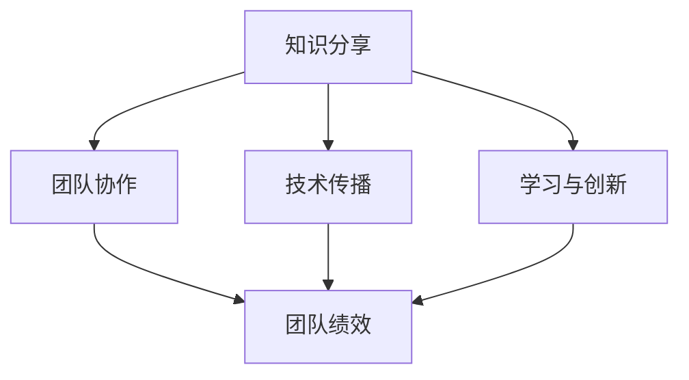

                 

### 知识分享在团队中的重要性

在当今快速发展的技术时代，知识分享在团队中扮演着至关重要的角色。无论是软件开发、数据分析、人工智能还是其他技术领域，团队成员之间的知识共享都能够显著提升团队的整体表现和效率。本文将探讨知识分享在团队中的重要性，并详细分析其在各个层面的应用和影响。

## 关键词
- 知识分享
- 团队协作
- 效率提升
- 学习与创新
- 技术传播

## 摘要
本文将探讨知识分享在团队中的重要性。通过深入分析知识共享的概念、团队协作的优势、技术传播的必要性以及学习与创新的关系，本文旨在为读者提供一个全面的理解，并揭示知识分享如何成为团队成功的关键因素。

### 背景介绍

随着信息技术的迅猛发展，知识已经成为企业最宝贵的资产之一。然而，传统的知识管理方式往往局限于个人经验和技能的积累，导致知识分散、难以传承。在现代团队中，知识分享不仅能够打破信息孤岛，还能激发团队成员的潜力，推动整体能力的提升。以下是知识分享在团队中的几个关键背景因素：

1. **技术复杂性增加**：现代技术领域的发展速度极快，新技术、新工具层出不穷。团队成员需要不断学习新知识，以跟上行业的发展步伐。知识分享能够帮助团队成员更快地掌握新技术，提高整体技术水平。

2. **团队协作需求**：现代工作往往需要跨部门、跨领域的协作。团队成员之间需要共享知识和经验，以便更好地协同工作，实现共同目标。

3. **知识传承问题**：随着团队成员的流动和离职，团队中的知识也面临着流失的风险。知识分享能够帮助新成员快速融入团队，同时确保核心知识的传承。

4. **创新驱动发展**：知识分享不仅有助于提高团队的技术能力，还能激发创新思维。通过共享经验和见解，团队成员可以相互启发，产生新的创意和解决方案。

### 核心概念与联系

在探讨知识分享的重要性之前，我们需要明确几个核心概念，并理解它们之间的联系。

#### 1. 知识分享的定义

知识分享是指个人或团队将知识和经验进行传递和交流的过程。这种分享可以是正式的，如内部培训、研讨会等，也可以是非正式的，如团队会议、交流讨论等。

#### 2. 团队协作的重要性

团队协作是指团队成员共同合作，以实现共同目标的过程。高效的团队协作能够提高团队的工作效率，促进知识共享和技能提升。

#### 3. 技术传播的必要性

技术传播是指将技术知识和经验从一个团队或组织传递到另一个团队或组织的过程。在快速发展的技术领域，技术传播对于保持团队的竞争力至关重要。

#### 4. 学习与创新的关系

学习是创新的基础。通过知识分享，团队成员可以不断学习新知识，提高自身技能，从而推动团队的创新发展。

#### 5. 知识共享与团队绩效

知识共享不仅能够提高团队成员的个人技能，还能提升整个团队的工作效率和绩效。研究表明，知识共享程度较高的团队往往表现出更高的绩效。

#### Mermaid 流程图

下面是一个简化的 Mermaid 流程图，用于描述知识分享与团队协作、技术传播、学习与创新以及团队绩效之间的关系。



### 核心算法原理 & 具体操作步骤

虽然知识分享是一个抽象的概念，但它可以通过一系列具体的操作步骤来实现。以下是知识分享的核心算法原理和具体操作步骤：

#### 1. 知识识别

首先，团队成员需要识别出哪些知识值得分享。这包括对团队成员的技能、经验以及项目中的关键知识点的识别。

#### 2. 知识整理

接下来，需要将识别出的知识进行整理和分类，以便于后续的分享和传播。知识整理可以是文本、图表、视频等多种形式。

#### 3. 知识分享

知识分享可以通过多种方式进行，包括内部培训、研讨会、交流讨论、在线分享平台等。每种方式都有其独特的优势，应根据实际情况选择最合适的方式。

#### 4. 反馈与迭代

知识分享后，需要收集团队成员的反馈，并根据反馈对知识分享的内容进行调整和优化。这是一个持续迭代的过程，旨在不断提高知识分享的效果。

### 数学模型和公式 & 详细讲解 & 举例说明

为了更好地理解知识分享的过程，我们可以借助一些数学模型和公式进行分析。

#### 1. 知识传播模型

知识传播模型可以用来描述知识在团队中的传播过程。一个简单的模型如下：

$$
K(t) = K_0 \cdot e^{rt}
$$

其中，$K(t)$ 表示时间 $t$ 时知识传播的总量，$K_0$ 是初始知识量，$r$ 是知识传播速率。

#### 2. 知识共享效率模型

知识共享效率模型用于评估知识分享的效果。一个简单的模型如下：

$$
E = \frac{K_{\text{shared}}}{K_{\text{total}}}
$$

其中，$E$ 是知识共享效率，$K_{\text{shared}}$ 是分享的知识量，$K_{\text{total}}$ 是总知识量。

#### 举例说明

假设一个团队有 100 个成员，初始知识量为 1000 个知识点。如果知识传播速率为每天增加 10%，则 30 天后的知识传播总量为：

$$
K(30) = 1000 \cdot e^{0.1 \cdot 30} \approx 2329
$$

如果团队每天分享 20 个知识点，则 30 天后的知识共享效率为：

$$
E = \frac{20 \cdot 30}{1000} = 0.06
$$

### 项目实战：代码实际案例和详细解释说明

为了更具体地展示知识分享的过程，我们来看一个实际的项目案例。

#### 1. 开发环境搭建

首先，我们需要搭建一个开发环境。这里我们选择使用 Python 和 Flask 框架进行开发。

```bash
pip install flask
```

#### 2. 源代码详细实现和代码解读

接下来，我们实现一个简单的知识分享平台。

```python
from flask import Flask, request, jsonify

app = Flask(__name__)

# 知识库
knowledge_base = {}

@app.route('/share', methods=['POST'])
def share_knowledge():
    data = request.json
    topic = data['topic']
    content = data['content']
    knowledge_base[topic] = content
    return jsonify({'status': 'success', 'message': 'Knowledge shared successfully.'})

@app.route('/get_knowledge', methods=['GET'])
def get_knowledge():
    topic = request.args.get('topic')
    if topic in knowledge_base:
        return jsonify({'status': 'success', 'topic': topic, 'content': knowledge_base[topic]})
    else:
        return jsonify({'status': 'error', 'message': 'Topic not found.'})

if __name__ == '__main__':
    app.run(debug=True)
```

#### 3. 代码解读与分析

在这个案例中，我们使用 Flask 框架创建了一个简单的知识分享平台。核心代码如下：

- `knowledge_base`：一个字典，用于存储知识库中的知识点。
- `/share`：一个 POST 请求接口，用于分享新知识点。接收 JSON 格式的数据，包括 `topic` 和 `content`。
- `/get_knowledge`：一个 GET 请求接口，用于获取指定知识点的信息。接收 `topic` 参数，返回 JSON 格式的数据。

通过这个简单的案例，我们可以看到知识分享平台的基本架构。在实际应用中，知识库可以更加复杂，支持多种数据结构和查询方式，同时还可以集成实时通讯工具，如 WebSocket，以便于团队成员之间的实时交流。

### 实际应用场景

知识分享在团队中的实际应用场景非常广泛。以下是一些常见的应用场景：

#### 1. 项目开发

在项目开发过程中，团队成员需要不断分享代码、文档和设计思路。通过知识分享，团队成员可以更快地了解项目进展，减少沟通成本，提高开发效率。

#### 2. 技术培训

知识分享可以帮助团队成员学习新技术和新工具。通过内部培训、研讨会和在线课程等形式，团队成员可以不断提升自身技能，为团队发展贡献力量。

#### 3. 技术支持

在技术支持过程中，知识分享可以帮助团队成员快速解决问题。通过共享故障排除经验和解决方案，团队成员可以更快地响应客户需求，提高客户满意度。

#### 4. 产品推广

知识分享还可以帮助团队成员更好地理解产品，为产品推广提供有力支持。通过分享产品特点、使用场景和客户案例，团队成员可以更有效地与潜在客户进行沟通，促进产品销售。

### 工具和资源推荐

为了更好地进行知识分享，以下是一些推荐的工具和资源：

#### 1. 学习资源推荐

- **书籍**：《代码大全》、《设计模式：可复用面向对象软件的基础》
- **论文**：谷歌的《The unreasonable effectiveness of data》
- **博客**：GitHub 上的技术博客、Stack Overflow
- **网站**：Medium、Dev.to

#### 2. 开发工具框架推荐

- **版本控制**：Git、GitLab
- **文档工具**：Markdown、GitBook
- **协作工具**：Slack、Trello
- **开发框架**：Django、Flask、Spring Boot

#### 3. 相关论文著作推荐

- **论文**：《知识管理：理论与实践》
- **著作**：《团队协作：高效团队建设的艺术》

### 总结：未来发展趋势与挑战

知识分享在团队中具有举足轻重的地位。随着技术的发展和团队协作的日益复杂，知识分享的未来发展趋势和挑战也日益显现。

#### 1. 发展趋势

- **知识可视化**：随着大数据和人工智能的发展，知识可视化将成为知识分享的重要趋势。通过可视化工具，团队成员可以更直观地理解知识和信息。
- **智能化分享**：利用人工智能技术，知识分享可以实现自动化和个性化。智能推荐系统可以根据团队成员的技能和兴趣推荐相关知识点。
- **跨平台协作**：随着云计算和物联网技术的发展，知识分享将不再受限于特定平台或地点，实现真正的跨平台协作。

#### 2. 挑战

- **知识冗余**：随着知识量的增加，如何筛选和识别有价值的知识成为一大挑战。知识分享平台需要具备高效的过滤和推荐机制。
- **知识保密**：在知识分享过程中，如何保护敏感知识和知识产权也是一个重要问题。知识分享平台需要建立完善的保密机制。
- **知识传承**：随着团队成员的流动，如何确保知识传承和持续更新也是一个挑战。知识分享平台需要提供有效的知识管理机制。

### 附录：常见问题与解答

#### 1. 问题：知识分享是否会影响团队成员的隐私？

解答：知识分享不会直接侵犯团队成员的隐私。在知识分享过程中，团队成员可以选择分享自己的知识和经验，而不必透露个人隐私信息。

#### 2. 问题：知识分享是否会降低团队成员的工作效率？

解答：知识分享可以显著提高团队成员的工作效率。通过共享知识和经验，团队成员可以更快地解决问题，减少重复劳动，从而提高整体工作效率。

#### 3. 问题：如何确保知识分享的公平性？

解答：为了确保知识分享的公平性，团队需要建立透明的知识分享机制。知识分享平台应提供公正的分享和评价体系，确保每位成员都有机会参与知识分享。

### 扩展阅读 & 参考资料

- **书籍**：《团队协作：高效团队建设的艺术》、《知识管理：理论与实践》
- **论文**：《The unreasonable effectiveness of data》、《知识共享与团队绩效的关系研究》
- **博客**：GitHub 上的技术博客、Stack Overflow
- **网站**：Medium、Dev.to

### 作者

- 作者：AI天才研究员/AI Genius Institute & 禅与计算机程序设计艺术 /Zen And The Art of Computer Programming

