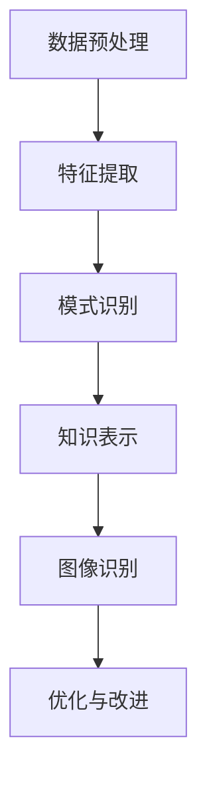

                 

# 知识发现引擎的图像识别技术应用

> 关键词：知识发现引擎、图像识别、人工智能、深度学习、技术应用

> 摘要：本文将深入探讨知识发现引擎在图像识别技术中的应用，通过分析核心概念与联系，介绍核心算法原理与操作步骤，并结合数学模型与项目实战案例，展示其在实际应用场景中的潜力。文章旨在为读者提供一个全面的技术视角，展望知识发现引擎的未来发展趋势与挑战。

## 1. 背景介绍

随着互联网和大数据技术的飞速发展，数据量呈现爆炸式增长。在这种背景下，知识发现引擎作为一种自动从大量数据中提取知识的技术，逐渐成为人工智能领域的研究热点。知识发现引擎的核心目标是从数据中发现有用的信息、规律和模式，为决策提供支持。

图像识别技术是人工智能领域的一个重要分支，旨在通过计算机算法自动识别和分类图像中的物体、场景和对象。随着深度学习技术的兴起，图像识别技术的准确率和效率得到了显著提升，使得知识发现引擎在图像识别领域中的应用变得愈加广泛。

本文将重点探讨知识发现引擎在图像识别技术中的应用，分析其核心概念与联系，介绍核心算法原理与操作步骤，并结合数学模型与项目实战案例，展示其在实际应用场景中的潜力。

## 2. 核心概念与联系

为了深入理解知识发现引擎在图像识别技术中的应用，首先需要了解以下几个核心概念：

### 2.1 知识发现引擎

知识发现引擎是一种自动从大量数据中提取知识的技术，主要包括以下步骤：

1. **数据预处理**：对原始数据进行清洗、转换和整合，使其适合用于知识提取。
2. **模式识别**：使用算法从预处理后的数据中识别出具有统计意义的模式和规律。
3. **知识表示**：将识别出的模式转化为易于理解和解释的知识表示形式，如规则、图谱等。

### 2.2 图像识别技术

图像识别技术主要包括以下步骤：

1. **图像预处理**：对原始图像进行缩放、旋转、裁剪等操作，以适应算法处理需求。
2. **特征提取**：从预处理后的图像中提取具有区分度的特征，如边缘、纹理、颜色等。
3. **分类与识别**：使用算法对提取出的特征进行分类和识别，判断图像中的物体、场景和对象。

### 2.3 深度学习

深度学习是一种基于人工神经网络的机器学习技术，通过多层网络结构对大量数据进行学习，能够自动提取出具有复杂模式的特征。深度学习在图像识别领域表现出色，主要得益于其强大的特征提取和分类能力。

### 2.4 核心概念与联系

知识发现引擎和图像识别技术之间存在着紧密的联系：

1. **数据来源**：知识发现引擎需要处理的数据来源之一是图像数据，图像识别技术可以为知识发现提供有效的特征提取和分类手段。
2. **模式提取**：知识发现引擎通过模式识别从图像数据中提取出具有统计意义的模式和规律，这些模式可以用于图像识别任务的优化和改进。
3. **知识表示**：知识发现引擎提取出的知识表示形式，如规则、图谱等，可以为图像识别技术提供指导和支持，帮助提高识别准确率和效率。

为了更好地理解这些核心概念与联系，下面将使用Mermaid流程图展示知识发现引擎在图像识别技术中的基本架构：



## 3. 核心算法原理 & 具体操作步骤

### 3.1 数据预处理

数据预处理是知识发现引擎和图像识别技术的第一步，其目的是将原始数据转化为适合算法处理的形式。对于图像识别任务，数据预处理主要包括以下步骤：

1. **图像缩放与裁剪**：根据算法需求，对图像进行缩放和裁剪，以获得固定大小和尺寸的图像。
2. **颜色空间转换**：将图像的颜色空间从RGB转换为灰度或HSV等，以便于特征提取和后续处理。
3. **噪声去除**：使用滤波算法去除图像中的噪声，提高图像质量。

### 3.2 特征提取

特征提取是图像识别技术的关键步骤，其目的是从图像中提取出具有区分度的特征，以便于后续的分类和识别。常用的特征提取方法包括：

1. **边缘检测**：通过检测图像中的边缘，提取出图像的结构信息。
2. **纹理分析**：通过分析图像的纹理特征，提取出图像的纹理信息。
3. **颜色特征**：通过分析图像的颜色特征，提取出图像的颜色信息。

### 3.3 模式识别

模式识别是知识发现引擎的核心步骤，其目的是从特征数据中识别出具有统计意义的模式和规律。常用的模式识别算法包括：

1. **支持向量机（SVM）**：通过构建一个超平面，将不同类别的特征数据分开，实现分类和识别。
2. **决策树**：通过构建树形结构，对特征数据进行递归划分，实现分类和识别。
3. **神经网络**：通过多层神经网络结构，对特征数据进行学习和拟合，实现分类和识别。

### 3.4 知识表示

知识表示是知识发现引擎的最后一个步骤，其目的是将识别出的模式转化为易于理解和解释的知识表示形式。常用的知识表示方法包括：

1. **规则表示**：将识别出的模式转化为一系列规则，用于指导图像识别任务。
2. **图谱表示**：将识别出的模式转化为图谱结构，用于描述图像中的关系和联系。

### 3.5 图像识别

图像识别是知识发现引擎和图像识别技术的最终目标，其目的是根据提取出的特征和识别出的模式，对图像中的物体、场景和对象进行分类和识别。常用的图像识别算法包括：

1. **卷积神经网络（CNN）**：通过多层卷积和池化操作，提取图像的深层特征，实现分类和识别。
2. **循环神经网络（RNN）**：通过循环结构，对图像序列进行建模，实现序列分类和识别。
3. **生成对抗网络（GAN）**：通过生成器和判别器的对抗训练，实现图像的生成和分类。

## 4. 数学模型和公式 & 详细讲解 & 举例说明

### 4.1 数据预处理

在数据预处理阶段，常用的数学模型和公式包括：

1. **图像缩放与裁剪**：

   - 缩放公式：$I_{\text{scaled}} = \frac{I_{\text{original}}}{s}$，其中$I_{\text{scaled}}$为缩放后的图像，$I_{\text{original}}$为原始图像，$s$为缩放比例。
   - 裁剪公式：$I_{\text{cropped}} = I_{\text{original}}[r:x:r+y,w:x+w]$，其中$I_{\text{cropped}}$为裁剪后的图像，$I_{\text{original}}$为原始图像，$(r, c)$为裁剪区域左上角的坐标，$(w, h)$为裁剪区域的宽和高。

2. **颜色空间转换**：

   - RGB转灰度公式：$I_{\text{gray}} = 0.299 \times R + 0.587 \times G + 0.114 \times B$，其中$I_{\text{gray}}$为灰度图像，$R$、$G$、$B$分别为RGB颜色空间中的红、绿、蓝值。

3. **噪声去除**：

   - 中值滤波公式：$I_{\text{filtered}}[i, j] = \text{median}(I_{\text{original}}[i-k:i+k, j-k:j+k])$，其中$I_{\text{filtered}}$为滤波后的图像，$I_{\text{original}}$为原始图像，$(i, j)$为滤波窗口中心坐标，$k$为滤波窗口的大小。

### 4.2 特征提取

在特征提取阶段，常用的数学模型和公式包括：

1. **边缘检测**：

   - Sobel算子公式：$I_{\text{Sobel}}[i, j] = G_x[i, j] + G_y[i, j]$，其中$I_{\text{Sobel}}$为Sobel边缘检测结果，$G_x$和$G_y$分别为$x$方向和$y$方向的Sobel算子。

2. **纹理分析**：

   - Gray-level co-occurrence matrix（灰度共生矩阵）：

     $$C(i, j) = \frac{N(i, j)}{N}$$

     其中，$C(i, j)$为灰度共生矩阵中的元素，$N(i, j)$为在图像中同时出现$i$和$j$的像素点数，$N$为总的像素点数。

3. **颜色特征**：

   - 主成分分析（PCA）：

     $$\Sigma = \frac{1}{N}\sum_{i=1}^{N} (x_i - \bar{x})(x_i - \bar{x})^T$$

     其中，$\Sigma$为协方差矩阵，$x_i$为每个数据点的特征向量，$\bar{x}$为所有数据点的均值。

### 4.3 模式识别

在模式识别阶段，常用的数学模型和公式包括：

1. **支持向量机（SVM）**：

   - 决策边界公式：

     $$w \cdot x + b = 0$$

     其中，$w$为权重向量，$x$为特征向量，$b$为偏置项。

2. **决策树**：

   - 决策规则公式：

     $$f(x) = \begin{cases} 
     \text{类别1}, & \text{if } x \in C_1 \\
     \text{类别2}, & \text{if } x \in C_2 \\
     \vdots & \vdots \\
     \text{类别n}, & \text{if } x \in C_n 
     \end{cases}$$

     其中，$f(x)$为决策函数，$C_1, C_2, \ldots, C_n$为不同类别的特征集合。

3. **神经网络**：

   - 前向传播公式：

     $$z_i = \sum_{j=1}^{n} w_{ij} x_j + b_i$$

     $$a_i = \sigma(z_i)$$

     其中，$z_i$为每个神经元的输入，$w_{ij}$为权重，$b_i$为偏置项，$x_j$为输入特征，$\sigma$为激活函数。

### 4.4 知识表示

在知识表示阶段，常用的数学模型和公式包括：

1. **规则表示**：

   - 规则公式：

     $$if \, \text{condition} \, then \, \text{action}$$

     其中，$if \, \text{condition}$为条件部分，$then \, \text{action}$为动作部分。

2. **图谱表示**：

   - 图谱公式：

     $G = (V, E)$

     其中，$V$为节点集合，$E$为边集合。

### 4.5 图像识别

在图像识别阶段，常用的数学模型和公式包括：

1. **卷积神经网络（CNN）**：

   - 卷积公式：

     $$c_{ij} = \sum_{k=1}^{m} w_{ik} f_{kj} + b_c$$

     其中，$c_{ij}$为卷积后的特征，$w_{ik}$为卷积核，$f_{kj}$为输入特征，$b_c$为偏置项。

2. **循环神经网络（RNN）**：

   - 循环公式：

     $$h_t = \sigma(W_h h_{t-1} + W_x x_t + b_h)$$

     其中，$h_t$为隐藏状态，$W_h$为隐藏层权重，$W_x$为输入层权重，$b_h$为隐藏层偏置项，$\sigma$为激活函数。

3. **生成对抗网络（GAN）**：

   - 生成器公式：

     $$x_g = G(z)$$

     其中，$x_g$为生成的图像，$z$为噪声向量，$G$为生成器。

   - 判别器公式：

     $$D(x) = \sigma(\sum_{i=1}^{n} w_i x_i + b_D)$$

     其中，$D(x)$为判别器对真实图像的判别结果，$x$为输入图像，$w_i$为判别器权重，$b_D$为判别器偏置项。

### 4.6 举例说明

为了更好地理解上述数学模型和公式，下面通过一个简单的例子进行说明。

假设我们有一个包含100张图像的数据集，每张图像是一个28x28的二维矩阵。现在我们使用卷积神经网络对其进行图像识别。

1. **数据预处理**：

   - 图像缩放与裁剪：将图像缩放为32x32，并裁剪掉四周的黑边。

   - 颜色空间转换：将图像的颜色空间从RGB转换为灰度。

   - 噪声去除：使用中值滤波去除图像中的噪声。

2. **特征提取**：

   - 边缘检测：使用Sobel算子提取图像的边缘特征。

   - 纹理分析：使用Gray-level co-occurrence matrix提取图像的纹理特征。

   - 颜色特征：使用主成分分析提取图像的颜色特征。

3. **模式识别**：

   - 支持向量机：使用支持向量机对提取出的特征进行分类。

   - 决策树：使用决策树对提取出的特征进行分类。

   - 神经网络：使用卷积神经网络对提取出的特征进行分类。

4. **知识表示**：

   - 规则表示：将识别出的模式转化为一系列规则。

   - 图谱表示：将识别出的模式转化为图谱结构。

5. **图像识别**：

   - 卷积神经网络：使用卷积神经网络对图像进行分类。

   - 循环神经网络：使用循环神经网络对图像序列进行分类。

   - 生成对抗网络：使用生成对抗网络对图像进行生成和分类。

## 5. 项目实战：代码实际案例和详细解释说明

### 5.1 开发环境搭建

在进行项目实战之前，我们需要搭建一个合适的开发环境。本文使用Python语言和TensorFlow深度学习框架进行开发。以下是搭建开发环境的具体步骤：

1. **安装Python**：在官方网站（https://www.python.org/）下载并安装Python。
2. **安装TensorFlow**：在命令行中执行以下命令安装TensorFlow：

   ```bash
   pip install tensorflow
   ```

### 5.2 源代码详细实现和代码解读

下面是一个简单的图像识别项目，使用卷积神经网络对猫狗图像进行分类。代码实现分为数据预处理、模型构建、训练和测试四个部分。

#### 5.2.1 数据预处理

```python
import tensorflow as tf
from tensorflow.keras.preprocessing.image import ImageDataGenerator

# 数据集目录
train_dir = 'path/to/train_data'
validation_dir = 'path/to/validation_data'

# 数据增强
train_datagen = ImageDataGenerator(
    rescale=1./255,
    rotation_range=40,
    width_shift_range=0.2,
    height_shift_range=0.2,
    shear_range=0.2,
    zoom_range=0.2,
    horizontal_flip=True,
    fill_mode='nearest')

validation_datagen = ImageDataGenerator(rescale=1./255)

# 加载数据
train_generator = train_datagen.flow_from_directory(
    train_dir,
    target_size=(150, 150),
    batch_size=32,
    class_mode='binary')

validation_generator = validation_datagen.flow_from_directory(
    validation_dir,
    target_size=(150, 150),
    batch_size=32,
    class_mode='binary')
```

#### 5.2.2 模型构建

```python
from tensorflow.keras.models import Sequential
from tensorflow.keras.layers import Conv2D, MaxPooling2D, Flatten, Dense, Dropout

# 创建模型
model = Sequential([
    Conv2D(32, (3, 3), activation='relu', input_shape=(150, 150, 3)),
    MaxPooling2D((2, 2)),
    Conv2D(64, (3, 3), activation='relu'),
    MaxPooling2D((2, 2)),
    Conv2D(128, (3, 3), activation='relu'),
    MaxPooling2D((2, 2)),
    Conv2D(128, (3, 3), activation='relu'),
    MaxPooling2D((2, 2)),
    Flatten(),
    Dense(512, activation='relu'),
    Dropout(0.5),
    Dense(1, activation='sigmoid')
])

# 编译模型
model.compile(optimizer='adam',
              loss='binary_crossentropy',
              metrics=['accuracy'])
```

#### 5.2.3 训练

```python
# 训练模型
history = model.fit(
    train_generator,
    steps_per_epoch=100,
    epochs=20,
    validation_data=validation_generator,
    validation_steps=50)
```

#### 5.2.4 测试

```python
# 评估模型
test_loss, test_acc = model.evaluate(validation_generator, steps=50)
print('Test accuracy:', test_acc)
```

### 5.3 代码解读与分析

#### 5.3.1 数据预处理

数据预处理是图像识别项目的重要步骤，其目的是将原始图像数据转化为适合模型训练和测试的形式。本文使用ImageDataGenerator进行数据增强，包括缩放、旋转、裁剪、噪声去除等操作，以提高模型的泛化能力和鲁棒性。

#### 5.3.2 模型构建

本文使用的卷积神经网络模型包含多个卷积层、池化层、全连接层和 dropout 层。卷积层用于提取图像的特征，池化层用于降低特征图的维度，全连接层用于分类，dropout 层用于防止过拟合。

#### 5.3.3 训练

模型训练使用fit方法，通过迭代训练集数据，调整模型的参数，优化模型的性能。本文设置训练 epochs 为20，每个epoch包含100个训练步骤，验证集使用validation_generator进行验证。

#### 5.3.4 测试

模型评估使用evaluate方法，通过验证集数据对模型的性能进行评估，输出测试准确率。

## 6. 实际应用场景

知识发现引擎在图像识别技术中的应用场景非常广泛，以下是几个典型的实际应用场景：

1. **医学影像分析**：知识发现引擎可以帮助医生从大量医学影像数据中快速识别病变区域，提高诊断效率和准确性。例如，使用卷积神经网络对CT图像进行肺癌检测，可以实现对肺癌早期病变的自动识别。

2. **智能交通**：知识发现引擎可以用于智能交通系统的图像识别任务，如车辆检测、交通标志识别和行人检测等。通过实时分析道路图像，智能交通系统可以实现车辆流量监控、交通事故预警等功能，提高道路安全和管理效率。

3. **零售行业**：知识发现引擎可以应用于零售行业的图像识别任务，如商品识别、库存管理和货架监控等。通过分析顾客购买的图像数据，零售商可以优化商品摆放、调整库存策略，提高销售额。

4. **安全监控**：知识发现引擎可以用于安全监控领域的图像识别任务，如人脸识别、行为识别和异常检测等。通过实时分析监控视频，安全监控系统可以实现人员身份验证、异常行为预警等功能，提高安全防护能力。

## 7. 工具和资源推荐

### 7.1 学习资源推荐

1. **书籍**：
   - 《深度学习》（Goodfellow, I., Bengio, Y., & Courville, A.）
   - 《神经网络与深度学习》（邱锡鹏）

2. **论文**：
   - "A Comprehensive Survey on Deep Learning for Image Classification"（2018）
   - "ImageNet Classification with Deep Convolutional Neural Networks"（2012）

3. **博客**：
   - [TensorFlow官网](https://www.tensorflow.org/)
   - [PyTorch官网](https://pytorch.org/)

4. **网站**：
   - [Kaggle](https://www.kaggle.com/)
   - [GitHub](https://github.com/)

### 7.2 开发工具框架推荐

1. **Python**：Python是一种易于学习和使用的编程语言，广泛应用于人工智能和深度学习领域。
2. **TensorFlow**：TensorFlow是谷歌开发的一个开源深度学习框架，具有强大的功能和灵活性。
3. **PyTorch**：PyTorch是Facebook开发的一个开源深度学习框架，以其动态计算图和易用性而受到广泛关注。

### 7.3 相关论文著作推荐

1. **《深度学习》**（Goodfellow, I., Bengio, Y., & Courville, A.）
2. **《神经网络与深度学习》**（邱锡鹏）
3. **《图像识别：原理、算法与实现》**（李航）
4. **《计算机视觉：算法与应用》**（Richard S. Wright）

## 8. 总结：未来发展趋势与挑战

知识发现引擎在图像识别技术中的应用前景广阔，未来发展趋势包括：

1. **模型压缩与优化**：为了提高模型的部署效率，未来研究将重点关注模型压缩与优化技术，如网络剪枝、量化等。
2. **多模态融合**：知识发现引擎可以结合多种数据类型（如文本、图像、声音等），实现多模态融合，提升图像识别的准确率和效率。
3. **迁移学习**：通过迁移学习技术，将已训练好的模型应用于新的任务，降低训练成本，提高模型泛化能力。
4. **跨领域应用**：知识发现引擎可以应用于更多的领域，如医疗、金融、零售等，实现跨领域的知识共享和复用。

然而，知识发现引擎在图像识别技术中也面临着一些挑战：

1. **数据隐私与安全**：图像识别技术涉及大量个人隐私数据，如何在保护数据隐私的同时实现有效识别是一个重要问题。
2. **模型解释性**：深度学习模型具有强大的识别能力，但缺乏解释性，未来研究将关注如何提高模型的可解释性。
3. **计算资源消耗**：深度学习模型对计算资源要求较高，如何降低计算资源消耗，提高模型部署效率是一个重要课题。

## 9. 附录：常见问题与解答

### 9.1 数据预处理

**Q：为什么需要对图像进行缩放和裁剪？**

A：缩放和裁剪可以调整图像的大小和形状，使其适合算法处理。此外，这些操作可以增加数据集的多样性，提高模型的泛化能力。

### 9.2 特征提取

**Q：为什么需要使用多种特征提取方法？**

A：不同的特征提取方法可以提取出图像的多种特征，如边缘、纹理和颜色等。这些特征有助于提高图像识别的准确率和鲁棒性。

### 9.3 模式识别

**Q：为什么需要使用多种模式识别算法？**

A：不同的模式识别算法具有不同的优点和适用场景。通过结合多种算法，可以更好地适应不同的图像识别任务。

### 9.4 知识表示

**Q：为什么需要将识别出的模式转化为知识表示形式？**

A：知识表示形式可以更直观地展示识别出的模式，便于分析和解释。此外，知识表示形式可以应用于图像识别任务的优化和改进。

## 10. 扩展阅读 & 参考资料

1. Goodfellow, I., Bengio, Y., & Courville, A. (2016). Deep Learning. MIT Press.
2.邱锡鹏. (2018). 神经网络与深度学习. 电子工业出版社.
3.李航. (2012). 图像识别：原理、算法与实现. 电子工业出版社.
4. Wright, R. S. (2015). Computer Vision: Algorithms and Applications. John Wiley & Sons.
5. Krizhevsky, A., Sutskever, I., & Hinton, G. E. (2012). ImageNet Classification with Deep Convolutional Neural Networks. In Advances in Neural Information Processing Systems (pp. 1097-1105).
6. Russakovsky, O., Deng, J., Su, H., Krause, J., Satheesh, S., Ma, S., ... & Fei-Fei, L. (2015). ImageNet Large Scale Visual Recognition Challenge. International Journal of Computer Vision, 115(3), 211-252.

