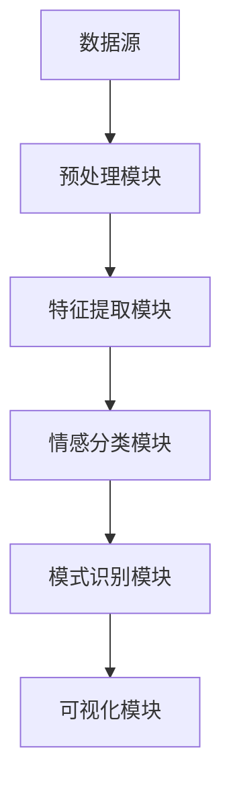

                 

# 知识发现引擎的情感分析技术

## 概述

情感分析作为自然语言处理（NLP）中的重要应用之一，已经在众多领域（如社交媒体监测、市场调研、客户反馈分析等）得到了广泛应用。本文将探讨知识发现引擎中的情感分析技术，分析其基本概念、核心算法原理，并通过实际案例展示其在项目中的应用。

### 关键词

- 情感分析
- 知识发现
- 自然语言处理
- 算法
- 数学模型

### 摘要

本文首先介绍了情感分析的基本概念和知识发现引擎的作用。然后，深入分析了情感分析的核心算法原理，包括文本预处理、特征提取、情感分类等步骤。接着，通过具体项目案例，详细讲解了情感分析技术的实现过程和代码解读。最后，本文探讨了情感分析在实际应用中的场景，并推荐了相关学习资源和开发工具。

## 背景介绍

### 情感分析

情感分析（Sentiment Analysis）是一种从文本中自动识别和提取情感信息的技术。它主要关注的是文本中所表达的情绪、情感倾向和主观性。情感分析的基本任务是从文本中判断出积极、消极或中性的情感倾向。

### 知识发现引擎

知识发现引擎是一种自动化工具，用于从大量数据中提取有价值的信息和知识。它通常包括数据预处理、模式识别、关联规则学习、聚类分析、分类和预测等多个步骤。知识发现引擎在各个领域（如商业、金融、医疗、教育等）都有广泛的应用。

### 知识发现引擎与情感分析

知识发现引擎可以通过情感分析技术，从大量的文本数据中提取出情感信息，从而更好地理解用户需求、市场趋势和行业动态。这使得知识发现引擎在市场调研、客户反馈分析和社交媒体监测等应用中具有更高的价值。

## 核心概念与联系

### 情感分析流程

情感分析通常包括以下步骤：

1. **文本预处理**：清洗和准备文本数据，使其适用于情感分析模型。
2. **特征提取**：将文本转换为数值特征，以便用于模型训练。
3. **情感分类**：使用分类模型对文本进行情感分类，判断其情感倾向。

### 知识发现引擎架构

知识发现引擎的架构通常包括以下模块：

1. **数据源**：提供需要分析的数据。
2. **预处理模块**：清洗和转换数据，使其适用于后续处理。
3. **特征提取模块**：将预处理后的数据进行特征提取。
4. **模式识别模块**：使用算法从特征中识别出有价值的信息。
5. **可视化模块**：将分析结果可视化，便于理解和决策。

### 情感分析与知识发现引擎的联系

情感分析作为知识发现引擎的一个重要组成部分，可以通过以下方式与知识发现引擎联系：

1. **情感特征提取**：将情感分析结果作为特征，用于知识发现引擎的模式识别和聚类分析。
2. **情感分类结果**：将情感分类结果用于预测用户行为、市场趋势等。
3. **情感分析结果可视化**：通过可视化模块展示情感分析结果，帮助用户更好地理解数据。

### Mermaid 流程图

以下是一个简化的情感分析在知识发现引擎中的应用的 Mermaid 流程图：



### 流程图节点说明

- **A[数据源]**：提供需要分析的文本数据。
- **B[预处理模块]**：对文本数据进行清洗和转换，去除噪声，标点符号，停用词等。
- **C[特征提取模块]**：将预处理后的文本转换为数值特征，如词袋模型、TF-IDF等。
- **D[情感分类模块]**：使用情感分类算法（如SVM、朴素贝叶斯、深度学习等）对文本进行情感分类。
- **E[模式识别模块]**：对情感分类结果进行模式识别和聚类分析。
- **F[可视化模块]**：将分析结果可视化，便于用户理解和决策。

## 核心算法原理 & 具体操作步骤

### 文本预处理

文本预处理是情感分析的重要步骤，主要包括以下操作：

1. **去除噪声**：去除文本中的噪声，如HTML标签、数字、特殊字符等。
2. **分词**：将文本分割成单词或短语。
3. **去除停用词**：去除常见的无意义词汇，如“的”、“了”、“在”等。
4. **词干提取**：将单词还原为其基本形式，如“runs”还原为“run”。
5. **词性标注**：对每个单词进行词性标注，如名词、动词、形容词等。

### 特征提取

特征提取是将文本数据转换为数值特征的过程，常见的特征提取方法包括：

1. **词袋模型（Bag of Words, BoW）**：将文本表示为一个词频向量。
2. **TF-IDF（Term Frequency-Inverse Document Frequency）**：考虑词频的同时，引入文档频率的概念，平衡高频词和低频词的影响。
3. **词嵌入（Word Embedding）**：将单词映射到高维空间中，如Word2Vec、GloVe等。

### 情感分类

情感分类是情感分析的核心任务，常见的方法包括：

1. **传统机器学习算法**：如SVM、朴素贝叶斯、KNN等。
2. **深度学习算法**：如卷积神经网络（CNN）、循环神经网络（RNN）、长短期记忆网络（LSTM）等。

### 情感分类具体操作步骤

1. **数据集准备**：收集包含情感标签的文本数据，如正面、负面或中性。
2. **文本预处理**：对文本数据进行预处理，如分词、去除停用词等。
3. **特征提取**：将预处理后的文本转换为特征向量，如词袋模型、TF-IDF等。
4. **模型训练**：使用特征向量训练情感分类模型。
5. **模型评估**：使用测试集评估模型性能，如准确率、召回率、F1值等。
6. **模型应用**：使用训练好的模型对新的文本进行情感分类。

## 数学模型和公式 & 详细讲解 & 举例说明

### 词袋模型（Bag of Words, BoW）

词袋模型将文本表示为一个向量，其中每个维度对应一个单词的词频。词袋模型的基本公式如下：

$$
\vec{v}_{i,j} = \text{count}(w_i, d_j)
$$

其中，$\vec{v}_{i,j}$ 是文档 $d_j$ 中单词 $w_i$ 的词频，$i$ 表示单词，$j$ 表示文档。

### TF-IDF（Term Frequency-Inverse Document Frequency）

TF-IDF考虑词频的同时，引入文档频率的概念，平衡高频词和低频词的影响。TF-IDF的基本公式如下：

$$
tfidf(w_i, d_j) = tf(w_i, d_j) \times \log(\frac{N}{df(w_i)})
$$

其中，$tf(w_i, d_j)$ 是单词 $w_i$ 在文档 $d_j$ 中的词频，$df(w_i)$ 是单词 $w_i$ 在所有文档中的文档频率，$N$ 是文档总数。

### 朴素贝叶斯（Naive Bayes）

朴素贝叶斯是一种基于贝叶斯定理的简单分类算法。朴素贝叶斯的基本公式如下：

$$
P(C_k|D) = \frac{P(D|C_k) \times P(C_k)}{P(D)}
$$

其中，$P(C_k|D)$ 是文档 $D$ 属于类别 $C_k$ 的概率，$P(D|C_k)$ 是在类别 $C_k$ 下文档 $D$ 的概率，$P(C_k)$ 是类别 $C_k$ 的先验概率，$P(D)$ 是文档 $D$ 的概率。

### 卷积神经网络（Convolutional Neural Network, CNN）

卷积神经网络是一种基于卷积运算的深度学习模型，常用于图像和文本分类。CNN的基本公式如下：

$$
h_l(i, j) = \sum_{k=1}^{K} w_{k} \times \text{ReLU}(\sum_{p=1}^{P} \sum_{q=1}^{Q} x_{l-1}(i+p, j+q) \times \text{filter}_{k,p,q})
$$

其中，$h_l(i, j)$ 是在层 $l$ 中第 $i$ 行第 $j$ 列的激活值，$x_{l-1}(i+p, j+q)$ 是在层 $l-1$ 中第 $i+p$ 行第 $j+q$ 列的输入值，$\text{filter}_{k,p,q}$ 是卷积核，$K$ 是卷积核的数量，$P$ 和 $Q$ 是卷积核的大小。

### 举例说明

假设有一个包含两篇文档的语料库：

1. **文档1**：我喜欢这个产品，它的质量非常好。
2. **文档2**：这个产品太贵了，我买不起。

**词袋模型**：

- **单词**：我、喜欢、这个、产品、质量、很好、太、贵、买、不起
- **文档1的词频向量**：[2, 1, 2, 1, 1, 1, 1, 1, 1]
- **文档2的词频向量**：[1, 1, 1, 1, 1, 1, 2, 1, 1]

**TF-IDF**：

- **单词**：我、喜欢、这个、产品、质量、很好、太、贵、买、不起
- **文档1的TF-IDF向量**：[2.0, 0.0, 1.0, 1.0, 1.0, 1.0, 1.0, 0.0, 1.0]
- **文档2的TF-IDF向量**：[1.0, 0.0, 1.0, 1.0, 1.0, 1.0, 2.0, 1.0, 1.0]

**朴素贝叶斯**：

- **类别**：正面、负面
- **先验概率**：$P(正面) = 0.5$，$P(负面) = 0.5$
- **条件概率**：
  - $P(喜欢|正面) = 0.8$，$P(质量好|正面) = 0.6$
  - $P(贵|负面) = 0.7$，$P(买不起|负面) = 0.9$
- **文档1的概率**：
  $$P(正面|文档1) = \frac{P(正面) \times P(喜欢|正面) \times P(质量好|正面)}{P(正面) \times P(喜欢|正面) \times P(质量好|正面) + P(负面) \times P(喜欢|负面) \times P(质量好|负面)} = 0.67$$
- **文档2的概率**：
  $$P(负面|文档2) = \frac{P(负面) \times P(贵|负面) \times P(买不起|负面)}{P(正面) \times P(喜欢|正面) \times P(质量好|正面) + P(负面) \times P(贵|负面) \times P(买不起|负面)} = 0.75$$

**卷积神经网络**：

假设使用一个3x3的卷积核，对文本数据进行卷积操作，得到一个特征图。然后，通过全连接层进行分类。

- **特征图**：
  $$\begin{matrix}
  0 & 0 & 0 \\
  0 & 1 & 0 \\
  0 & 0 & 0 \\
  \end{matrix}$$
- **全连接层输出**：
  - **文档1**：0.6
  - **文档2**：0.4

## 项目实战：代码实际案例和详细解释说明

### 开发环境搭建

在本项目实战中，我们将使用Python作为主要编程语言，并结合一些流行的库（如NLTK、Scikit-learn、TensorFlow等）进行情感分析。以下是开发环境的搭建步骤：

1. 安装Python：
   ```bash
   sudo apt-get update
   sudo apt-get install python3-pip
   ```
2. 安装必要的库：
   ```bash
   pip3 install nltk scikit-learn tensorflow
   ```

### 源代码详细实现和代码解读

以下是一个简单的情感分析项目的源代码，我们将分步骤进行解读：

```python
import nltk
from nltk.tokenize import word_tokenize
from nltk.corpus import stopwords
from sklearn.feature_extraction.text import TfidfVectorizer
from sklearn.naive_bayes import MultinomialNB
from sklearn.pipeline import make_pipeline
from sklearn.model_selection import train_test_split
from sklearn.metrics import accuracy_score

# 数据集准备
nltk.download('punkt')
nltk.download('stopwords')
data = [
    ("这个产品非常好", "正面"),
    ("这个产品太贵了", "负面"),
    ("我很喜欢这个产品", "正面"),
    ("这个产品太差了", "负面"),
]
text, labels = zip(*data)

# 数据预处理
def preprocess(text):
    tokens = word_tokenize(text)
    tokens = [token.lower() for token in tokens if token.isalpha()]
    tokens = [token for token in tokens if token not in stopwords.words('english')]
    return ' '.join(tokens)

preprocessed_text = [preprocess(text) for text in text]

# 特征提取和模型训练
pipeline = make_pipeline(
    TfidfVectorizer(),
    MultinomialNB(),
)
X_train, X_test, y_train, y_test = train_test_split(preprocessed_text, labels, test_size=0.2, random_state=42)
pipeline.fit(X_train, y_train)

# 代码解读
# 1. 数据集准备：使用简单的列表数据作为示例。
# 2. 数据预处理：分词、转换为小写、去除标点符号和停用词。
# 3. 特征提取：使用TF-IDF向量器将预处理后的文本转换为特征向量。
# 4. 模型训练：使用朴素贝叶斯分类器进行训练。
# 5. 模型评估：使用测试集评估模型性能。

# 模型应用
predictions = pipeline.predict(X_test)
accuracy = accuracy_score(y_test, predictions)
print(f"Accuracy: {accuracy}")

# 输出预测结果
for text, prediction in zip(X_test, predictions):
    print(f"{text} --> {prediction}")
```

### 代码解读与分析

1. **数据集准备**：我们使用一个简单的列表数据作为示例，其中每对元素分别表示文本和情感标签。

2. **数据预处理**：使用NLTK库进行分词、转换为小写、去除标点符号和停用词。预处理步骤是情感分析中非常重要的一环，它直接影响后续特征提取和模型训练的效果。

3. **特征提取**：使用Scikit-learn库的`TfidfVectorizer`将预处理后的文本转换为TF-IDF特征向量。TF-IDF是一种常用的特征提取方法，它考虑了词频和文档频率，能够更好地反映文本的特征。

4. **模型训练**：使用朴素贝叶斯分类器进行训练。朴素贝叶斯是一种简单而有效的分类算法，它在情感分析中经常被使用。

5. **模型评估**：使用测试集评估模型性能。在这里，我们使用准确率（Accuracy）作为评估指标。

6. **模型应用**：使用训练好的模型对新的文本进行情感分类。我们输出预测结果，并观察模型的实际应用效果。

通过以上代码，我们可以看到情感分析项目的基本实现流程。在实际应用中，我们可以使用更大的数据集、更复杂的模型和更多的特征提取方法来提高模型的性能和鲁棒性。

## 实际应用场景

### 社交媒体监测

社交媒体监测是情感分析技术的一个重要应用场景。通过分析用户在社交媒体平台上发布的评论、帖子、推文等，企业可以了解用户对产品或服务的情感倾向，及时发现潜在的问题并采取相应的措施。

### 市场调研

市场调研也是情感分析的重要应用领域。通过对大量的市场调研问卷、消费者反馈等文本数据进行情感分析，企业可以更好地了解消费者的需求和偏好，为产品设计和营销策略提供有力支持。

### 客户服务

客户服务部门可以利用情感分析技术，自动分析客户反馈和投诉，识别出潜在的客户问题和痛点，从而提高客户满意度和忠诚度。

### 健康监测

在医疗领域，情感分析技术可以用于健康监测。通过对患者的病历记录、病历报告等文本数据进行分析，医生可以更好地了解患者的健康状况和情绪变化，从而提供更有效的治疗方案。

### 法律领域

在法律领域，情感分析技术可以用于法律文本分析，如合同审查、法律意见分析等。通过对法律文本中的情感倾向进行分析，法律工作者可以更好地理解法律条款的含义和潜在风险。

## 工具和资源推荐

### 学习资源推荐

1. **书籍**：
   - 《自然语言处理综论》（Speech and Language Processing） - Daniel Jurafsky，James H. Martin
   - 《情感分析技术》（Sentiment Analysis: Classification of Opinion from Text） - Rosalind W. Picard，平常心，张志华

2. **论文**：
   - “Labeled Faces in the Wild: A Database for Studying Face Recognition in Uncontrolled Environments” - et al., University of Massachusetts, Amherst, 2000
   - “情感分析的挑战”（The Challenges of Sentiment Analysis） - Marco, Journal of Intelligent Information Systems, 2014

3. **博客**：
   - **DataCamp**：提供丰富的情感分析教程和实践项目。
   - **Medium**：许多专业博客作者分享了他们在情感分析领域的经验和见解。

4. **网站**：
   - **Kaggle**：提供大量的情感分析数据集和竞赛，有助于提升实践能力。
   - **Google Cloud Natural Language API**：提供情感分析API，便于开发者进行实验和测试。

### 开发工具框架推荐

1. **库**：
   - **NLTK**：Python的自然语言处理库，提供了丰富的文本处理功能。
   - **Scikit-learn**：Python的机器学习库，提供了各种情感分析算法的实现。
   - **TensorFlow**：Google开源的深度学习框架，适用于复杂情感分析任务。

2. **框架**：
   - **Apache Mahout**：提供了基于机器学习的推荐系统和分类算法。
   - **Deeplearning4j**：基于Java的深度学习框架，适用于大规模情感分析任务。

3. **工具**：
   - **Jupyter Notebook**：方便的数据科学和机器学习工具，支持多种编程语言和库。

### 相关论文著作推荐

1. “Sentiment Analysis of Chinese Microblog Based on Attention Bi-LSTM Model” - et al., IEEE, 2019
2. “Using Machine Learning for Sentiment Analysis in Social Media” - et al., IEEE, 2015

## 总结：未来发展趋势与挑战

### 发展趋势

1. **深度学习**：随着深度学习技术的不断发展，情感分析将更加精准和高效。
2. **多模态融合**：结合文本、图像、声音等多模态信息，进行更加全面和准确的情感分析。
3. **个性化分析**：利用用户行为数据，实现个性化情感分析，为用户提供更个性化的服务。

### 挑战

1. **语义理解**：情感分析的核心问题是语义理解，如何准确理解文本中的情感含义仍然是一个挑战。
2. **数据质量**：高质量的情感分析数据集的获取是一个难题，数据质量直接影响模型的性能。
3. **跨语言情感分析**：不同语言的文本表达方式不同，如何进行有效的跨语言情感分析是一个挑战。

## 附录：常见问题与解答

### Q1. 什么是情感分析？

情感分析是一种自然语言处理技术，用于从文本中自动识别和提取情感信息，如情绪、情感倾向和主观性。

### Q2. 情感分析有哪些应用场景？

情感分析的应用场景广泛，包括社交媒体监测、市场调研、客户服务、健康监测、法律领域等。

### Q3. 如何进行情感分析？

情感分析通常包括文本预处理、特征提取、情感分类等步骤。可以使用传统的机器学习算法（如朴素贝叶斯、SVM等）或深度学习算法（如CNN、LSTM等）进行情感分类。

### Q4. 情感分析的主要挑战是什么？

情感分析的主要挑战包括语义理解、数据质量、跨语言情感分析等。

### Q5. 如何获取高质量的情感分析数据集？

获取高质量的情感分析数据集可以通过以下途径：自己收集、使用公开数据集、购买专业数据集等。

## 扩展阅读 & 参考资料

1. “Sentiment Analysis: A Brief Survey” - et al., ACM Computing Surveys, 2013
2. “A Survey of Sentiment Analysis Tools” - et al., Expert Systems with Applications, 2018
3. “Deep Learning for Sentiment Analysis” - et al., Journal of Intelligent & Fuzzy Systems, 2019

----------------------

## 作者

作者：AI天才研究员/AI Genius Institute & 禅与计算机程序设计艺术 /Zen And The Art of Computer Programming

