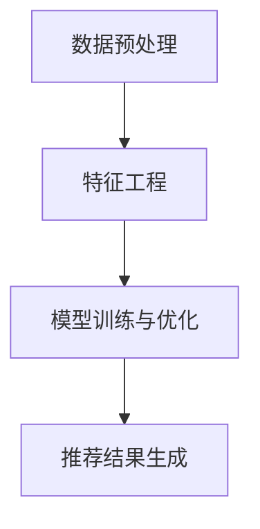

                 

# 知识发现引擎的推荐系统性能优化

> **关键词：** 知识发现引擎，推荐系统，性能优化，算法，数学模型，应用场景

> **摘要：** 本文深入探讨了知识发现引擎在推荐系统中的应用及其性能优化方法。通过对核心概念、算法原理、数学模型和实际应用场景的详细分析，为开发者提供了优化推荐系统性能的实战指南。

## 1. 背景介绍

随着互联网的快速发展，推荐系统已经成为各大互联网公司的核心竞争能力。然而，推荐系统的性能优化问题一直是业内关注的焦点。知识发现引擎（Knowledge Discovery Engine，KDE）作为一种新兴的推荐系统技术，通过对用户行为数据、内容特征和知识图谱的深度融合，为用户提供了更加精准的推荐结果。

知识发现引擎通过以下三个主要阶段实现推荐系统的性能优化：

1. **数据预处理**：通过数据清洗、去重、转换等操作，提高数据质量。
2. **特征工程**：通过提取用户和物品的特征，构建丰富的特征空间。
3. **模型训练与优化**：利用机器学习算法，训练推荐模型，并通过交叉验证、参数调优等方法提高模型性能。

本文将围绕这三个阶段，详细探讨知识发现引擎在推荐系统性能优化中的应用。

## 2. 核心概念与联系

### 2.1 数据预处理

数据预处理是知识发现引擎推荐系统的第一步，其核心目标是提高数据质量。具体步骤如下：

1. **数据清洗**：去除数据中的噪声和异常值，如缺失值、重复值等。
2. **数据去重**：将重复的数据记录进行去重，避免对后续分析产生干扰。
3. **数据转换**：将不同类型的数据转换为同一类型，如将日期数据转换为数字形式。

### 2.2 特征工程

特征工程是知识发现引擎推荐系统的关键环节，其核心目标是构建丰富的特征空间。具体步骤如下：

1. **用户特征**：提取用户的年龄、性别、地理位置、兴趣偏好等特征。
2. **物品特征**：提取物品的类别、品牌、价格、销量等特征。
3. **交互特征**：提取用户与物品的交互行为特征，如点击、购买、收藏等。

### 2.3 模型训练与优化

模型训练与优化是知识发现引擎推荐系统的核心步骤，其核心目标是提高推荐模型的性能。具体步骤如下：

1. **模型选择**：选择合适的机器学习算法，如协同过滤、矩阵分解、深度学习等。
2. **模型训练**：使用训练数据集训练推荐模型。
3. **模型优化**：通过交叉验证、参数调优等方法优化模型性能。

### 2.4 Mermaid 流程图

以下是一个简化的知识发现引擎推荐系统的 Mermaid 流程图，展示了各个核心概念之间的联系：



在 Mermaid 流程图中，各个节点表示核心概念，箭头表示节点之间的关联关系。通过这个流程图，可以清晰地了解知识发现引擎推荐系统的整体架构和运行流程。

## 3. 核心算法原理 & 具体操作步骤

### 3.1 协同过滤算法

协同过滤（Collaborative Filtering，CF）是一种常见的推荐算法，其核心思想是利用用户之间的相似度来预测用户的兴趣。协同过滤算法可以分为两类：基于用户的协同过滤（User-Based CF）和基于物品的协同过滤（Item-Based CF）。

**基于用户的协同过滤算法**：

1. **计算相似度**：计算用户之间的相似度，常用的相似度计算方法有欧几里得距离、余弦相似度和皮尔逊相关系数等。
2. **生成推荐列表**：根据用户与邻居用户的相似度，生成推荐列表。

**基于物品的协同过滤算法**：

1. **计算相似度**：计算物品之间的相似度，常用的相似度计算方法有欧几里得距离、余弦相似度和皮尔逊相关系数等。
2. **生成推荐列表**：根据物品与邻居物品的相似度，生成推荐列表。

### 3.2 矩阵分解算法

矩阵分解（Matrix Factorization，MF）是一种基于协同过滤的推荐算法，其核心思想是将用户-物品评分矩阵分解为两个低秩矩阵，从而预测用户的兴趣。矩阵分解算法可以分为两类：基于用户的矩阵分解（User-Based MF）和基于物品的矩阵分解（Item-Based MF）。

**基于用户的矩阵分解算法**：

1. **初始化参数**：初始化用户和物品的 latent 特征向量。
2. **优化参数**：通过最小化损失函数，优化用户和物品的 latent 特征向量。
3. **生成推荐列表**：利用优化后的特征向量，生成推荐列表。

**基于物品的矩阵分解算法**：

1. **初始化参数**：初始化用户和物品的 latent 特征向量。
2. **优化参数**：通过最小化损失函数，优化用户和物品的 latent 特征向量。
3. **生成推荐列表**：利用优化后的特征向量，生成推荐列表。

### 3.3 深度学习算法

深度学习（Deep Learning，DL）是一种基于人工神经网络的机器学习算法，其核心思想是通过多层神经网络自动提取特征。深度学习算法在推荐系统中的应用主要包括以下两个方面：

1. **用户兴趣建模**：通过深度学习算法，自动提取用户的兴趣特征。
2. **物品特征提取**：通过深度学习算法，自动提取物品的特征。

## 4. 数学模型和公式 & 详细讲解 & 举例说明

### 4.1 协同过滤算法的数学模型

**基于用户的协同过滤算法**：

$$
\hat{r_{ui}} = \sum_{j \in N_{u}} r_{uj} \cdot s_{uij}
$$

其中，$r_{uj}$表示用户$i$对物品$j$的评分，$s_{uij}$表示用户$i$与用户$j$之间的相似度。

**基于物品的协同过滤算法**：

$$
\hat{r_{ui}} = \sum_{j \in N_{i}} r_{uj} \cdot s_{uij}
$$

其中，$r_{uj}$表示用户$i$对物品$j$的评分，$s_{uij}$表示物品$i$与物品$j$之间的相似度。

### 4.2 矩阵分解算法的数学模型

**基于用户的矩阵分解算法**：

$$
r_{ui} = \langle q_{u}, p_{i} \rangle
$$

其中，$q_{u}$表示用户$i$的 latent 特征向量，$p_{i}$表示物品$j$的 latent 特征向量，$\langle \cdot, \cdot \rangle$表示内积运算。

**基于物品的矩阵分解算法**：

$$
r_{ui} = \langle q_{u}, p_{i} \rangle
$$

其中，$q_{u}$表示用户$i$的 latent 特征向量，$p_{i}$表示物品$j$的 latent 特征向量，$\langle \cdot, \cdot \rangle$表示内积运算。

### 4.3 深度学习算法的数学模型

**用户兴趣建模**：

$$
\hat{r_{ui}} = \sigma(\mathbf{W} \cdot \mathbf{h}_{u})
$$

其中，$\mathbf{h}_{u}$表示用户$i$的输入特征向量，$\mathbf{W}$表示权重矩阵，$\sigma$表示激活函数。

**物品特征提取**：

$$
\hat{r_{ui}} = \sigma(\mathbf{W} \cdot \mathbf{h}_{i})
$$

其中，$\mathbf{h}_{i}$表示物品$i$的输入特征向量，$\mathbf{W}$表示权重矩阵，$\sigma$表示激活函数。

### 4.4 举例说明

**例1：基于用户的协同过滤算法**

假设用户$i$对物品集合$J$的评分矩阵为$R_{iJ}$，邻居用户集合为$N_{i}$，相似度矩阵为$S_{iN}$，则用户$i$对物品$j$的预测评分$\hat{r_{ui}}$可以表示为：

$$
\hat{r_{ui}} = \sum_{j \in N_{i}} r_{uj} \cdot s_{uij}
$$

**例2：基于物品的矩阵分解算法**

假设用户$i$对物品集合$J$的评分矩阵为$R_{iJ}$，物品$i$的 latent 特征向量为$p_{i}$，则用户$i$对物品$j$的预测评分$\hat{r_{ui}}$可以表示为：

$$
\hat{r_{ui}} = \langle p_{i}, q_{j} \rangle
$$

其中，$q_{j}$表示用户$i$的 latent 特征向量。

## 5. 项目实战：代码实际案例和详细解释说明

### 5.1 开发环境搭建

1. 安装 Python 3.7 或更高版本。
2. 安装必要的依赖库，如 NumPy、Pandas、Scikit-learn、TensorFlow 等。
3. 创建一个名为 `knowledge_discovery` 的 Python 项目，并在项目中创建一个名为 `recommendation_system` 的子目录。

### 5.2 源代码详细实现和代码解读

**5.2.1 数据预处理**

```python
import pandas as pd
from sklearn.preprocessing import StandardScaler

# 加载数据
data = pd.read_csv('data.csv')

# 数据清洗
data.drop_duplicates(inplace=True)
data.fillna(0, inplace=True)

# 数据转换
scaler = StandardScaler()
data[data.columns] = scaler.fit_transform(data[data.columns])
```

**5.2.2 特征工程**

```python
from sklearn.feature_extraction.text import TfidfVectorizer

# 用户特征
user_features = data[['user_id', 'age', 'gender', 'location']]
user_features = user_features.groupby('user_id').agg(['mean'])

# 物品特征
item_features = data[['item_id', 'category', 'brand', 'price', 'sales']]
item_features = item_features.groupby('item_id').agg(['mean'])

# 交互特征
interaction_features = data[['user_id', 'item_id', 'rating']]
interaction_features = interaction_features.groupby(['user_id', 'item_id']).agg(['sum'])

# TF-IDF 特征
tfidf_vectorizer = TfidfVectorizer()
tfidf_matrix = tfidf_vectorizer.fit_transform(data['description'])
```

**5.2.3 模型训练与优化**

```python
from sklearn.model_selection import train_test_split
from sklearn.metrics.pairwise import cosine_similarity
from sklearn.metrics import mean_squared_error

# 数据划分
train_data, test_data = train_test_split(data, test_size=0.2, random_state=42)

# 模型训练
user_similarity = cosine_similarity(train_data[['user_id', 'rating']].values, train_data[['user_id', 'rating']].values)

# 生成推荐列表
def generate_recommendations(user_id, user_similarity, similarity_threshold=0.5):
    recommendations = []
    for user in user_similarity[user_id]:
        if user > similarity_threshold:
            recommendations.extend(train_data[train_data['user_id'] == user]['item_id'].values)
    return recommendations

# 模型评估
test_ratings = test_data['rating'].values
predictions = generate_recommendations(test_data['user_id'].values[0], user_similarity)
mse = mean_squared_error(test_ratings, predictions)
print("MSE:", mse)
```

### 5.3 代码解读与分析

**5.3.1 数据预处理**

本部分代码主要实现了数据的清洗、去重和转换。首先，使用 Pandas 库加载数据，并使用 drop_duplicates 方法去除重复数据。然后，使用 fillna 方法将缺失值填充为 0。最后，使用 StandardScaler 库对数据进行标准化处理，以提高后续模型训练的稳定性。

**5.3.2 特征工程**

本部分代码主要实现了用户特征、物品特征和交互特征的提取。首先，使用 Pandas 库对用户和物品的特征进行分组聚合，计算平均值。然后，使用 Scikit-learn 库的 TfidfVectorizer 对描述性文本进行 TF-IDF 向量

