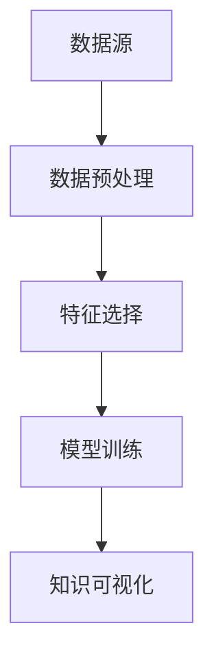

                 

# 知识发现引擎：人工智能时代的创新伙伴

## 概述

**关键词**：知识发现、人工智能、创新伙伴、机器学习、大数据、数据分析

**摘要**：本文将探讨知识发现引擎在人工智能时代的重要性及其对创新伙伴的潜力。我们将深入分析知识发现的核心概念、算法原理，并通过实际案例和数学模型讲解其应用场景。此外，还将推荐相关的学习资源、开发工具和未来发展趋势。

在当今的信息爆炸时代，数据无处不在，但如何从海量数据中提取有价值的信息成为了新的挑战。知识发现引擎作为人工智能领域的重要工具，可以帮助我们从数据中发现规律、趋势和关联，从而为企业和个人提供创新性的解决方案。本文将详细介绍知识发现引擎的工作原理和应用，并探讨其在未来人工智能时代的发展趋势。

## 1. 背景介绍

随着互联网和物联网的普及，数据已经成为了新时代的石油。然而，数据的获取和存储并不是最终目的，关键在于如何从数据中提取有价值的信息，这就是知识发现（Knowledge Discovery in Databases，KDD）的目的。

知识发现是一个跨学科的过程，它结合了统计学、机器学习、数据库和人工智能等多个领域的知识。知识发现的主要任务是从大量数据中识别出潜在的模式、关联和规律，从而为决策提供支持。

知识发现引擎作为知识发现过程中的核心工具，其主要功能是从数据源中提取、处理和分析数据，最终生成有用的知识。知识发现引擎的核心技术包括数据预处理、特征选择、模型训练和知识可视化等。

### 1.1 数据预处理

数据预处理是知识发现过程中的第一步，其主要目的是将原始数据转换为适合分析的形式。数据预处理通常包括数据清洗、数据转换和数据集成等步骤。

- **数据清洗**：去除重复数据、处理缺失数据和纠正错误数据。
- **数据转换**：将数据从一种格式转换为另一种格式，如将文本数据转换为数值数据。
- **数据集成**：将来自不同源的数据合并为统一的格式。

### 1.2 特征选择

特征选择是从原始数据中提取具有代表性的特征子集的过程。一个好的特征选择方法可以大大提高知识发现的效果和效率。

- **特征提取**：通过数学变换或算法从原始数据中提取新的特征。
- **特征选择**：从提取出的特征中选出对目标变量有较强预测能力的特征。

### 1.3 模型训练

模型训练是知识发现引擎的核心功能，通过建立数学模型，将数据中的潜在模式和规律表示出来。

- **分类模型**：用于预测数据属于哪个类别，如文本分类、图像分类等。
- **回归模型**：用于预测数据的具体数值，如预测股票价格、销售额等。
- **聚类模型**：用于将相似的数据分组，如客户细分、市场细分等。

### 1.4 知识可视化

知识可视化是将知识发现的结果以图形或图表的形式展示出来，使得用户可以直观地理解数据中的规律和模式。

- **图表**：如折线图、柱状图、饼图等。
- **交互式可视化**：如地图、网络图等。

## 2. 核心概念与联系

### 2.1 知识发现引擎的组成

知识发现引擎由数据源、数据预处理模块、特征选择模块、模型训练模块和知识可视化模块组成。各个模块之间的联系如下图所示：



### 2.2 知识发现过程

知识发现过程可以分为以下几个阶段：

1. **数据采集**：从各种数据源收集数据。
2. **数据预处理**：清洗、转换和集成数据。
3. **特征选择**：从原始数据中提取有用的特征。
4. **模型训练**：建立数学模型，从数据中学习规律。
5. **知识提取**：从模型中提取有用知识，如分类规则、预测模型等。
6. **知识可视化**：将知识发现的结果以图形或图表的形式展示。

### 2.3 人工智能与知识发现

人工智能（AI）在知识发现过程中发挥了重要作用，其主要贡献在于提供高效的算法和工具，帮助人们从海量数据中提取有价值的信息。

- **机器学习**：机器学习算法可以帮助我们自动地从数据中学习规律和模式，如分类算法、回归算法、聚类算法等。
- **深度学习**：深度学习算法在图像识别、语音识别、自然语言处理等领域取得了显著成果，为知识发现提供了强大的技术支持。
- **神经网络**：神经网络作为机器学习的基础，可以帮助我们建立复杂的非线性模型，从而更好地捕捉数据中的潜在规律。

## 3. 核心算法原理 & 具体操作步骤

### 3.1 数据预处理

数据预处理是知识发现过程中的关键步骤，其核心算法包括数据清洗、数据转换和数据集成。

#### 3.1.1 数据清洗

数据清洗的核心算法包括去除重复数据、处理缺失数据和纠正错误数据。

- **去除重复数据**：通过比较数据中的唯一标识，如ID或姓名，删除重复记录。
- **处理缺失数据**：根据数据的重要性和实际情况，采用填充、删除或插值等方法处理缺失数据。
- **纠正错误数据**：通过数据验证和校验，识别并纠正数据中的错误。

#### 3.1.2 数据转换

数据转换的核心算法包括将数据从一种格式转换为另一种格式，如将文本数据转换为数值数据。

- **编码**：将文本数据转换为数值或布尔值，如将性别（男/女）编码为0/1。
- **归一化**：将数据缩放到一个特定的范围，如将年龄数据从0到100转换为0到1。
- **标准化**：将数据缩放到一个标准正态分布，如均值为0，标准差为1。

#### 3.1.3 数据集成

数据集成的核心算法包括将来自不同源的数据合并为统一的格式。

- **连接**：将具有相同属性的数据表合并为一个更大的数据表。
- **聚合**：对数据表中的数据进行分组和汇总，如计算平均值、最大值、最小值等。

### 3.2 特征选择

特征选择的核心算法包括特征提取和特征选择。

#### 3.2.1 特征提取

特征提取的核心算法包括特征工程和特征抽取。

- **特征工程**：通过对原始数据进行数学变换或组合，创造新的特征。
- **特征抽取**：通过算法自动从原始数据中提取具有代表性的特征。

#### 3.2.2 特征选择

特征选择的核心算法包括过滤法、包裹法和评估法。

- **过滤法**：根据特征的相关性、方差、信息增益等指标筛选特征。
- **包裹法**：通过迭代搜索最优特征子集。
- **评估法**：使用交叉验证等方法评估特征子集的性能。

### 3.3 模型训练

模型训练的核心算法包括分类模型、回归模型和聚类模型。

#### 3.3.1 分类模型

分类模型的核心算法包括决策树、支持向量机、神经网络等。

- **决策树**：根据特征和目标变量的关系，构建决策树模型。
- **支持向量机**：通过寻找最优超平面，将数据分为不同的类别。
- **神经网络**：通过反向传播算法，训练多层神经网络模型。

#### 3.3.2 回归模型

回归模型的核心算法包括线性回归、岭回归、逻辑回归等。

- **线性回归**：根据输入特征和目标变量的关系，建立线性回归模型。
- **岭回归**：通过引入正则项，防止过拟合。
- **逻辑回归**：用于分类任务，通过sigmoid函数将线性组合映射到概率空间。

#### 3.3.3 聚类模型

聚类模型的核心算法包括K均值、层次聚类、DBSCAN等。

- **K均值**：通过迭代更新聚类中心，将数据分为K个类别。
- **层次聚类**：通过自底向上或自顶向下的方式，构建层次结构。
- **DBSCAN**：通过邻域分析和密度连接，将数据分为不同的类别。

### 3.4 知识可视化

知识可视化的核心算法包括图表、交互式可视化和虚拟现实等。

- **图表**：如折线图、柱状图、饼图等，用于展示数据的基本统计特征。
- **交互式可视化**：如地图、网络图等，提供用户与数据的交互。
- **虚拟现实**：通过虚拟现实技术，提供沉浸式的数据展示。

## 4. 数学模型和公式 & 详细讲解 & 举例说明

### 4.1 数据预处理

#### 4.1.1 数据清洗

数据清洗的关键公式包括：

$$
\text{唯一标识} = \text{ID1} \land \text{ID2} \land ... \land \text{IDn}
$$

其中，$\text{ID1}$，$\text{ID2}$，...，$\text{IDn}$ 分别表示不同数据表中的唯一标识。

#### 4.1.2 数据转换

数据转换的关键公式包括：

$$
\text{编码} = \left\{
\begin{array}{ll}
0, & \text{如果} \ \text{性别} = \text{男} \\
1, & \text{如果} \ \text{性别} = \text{女}
\end{array}
\right.
$$

#### 4.1.3 数据集成

数据集成的关键公式包括：

$$
\text{连接} = \text{表1} \cup \text{表2}
$$

其中，$\text{表1}$ 和 $\text{表2}$ 分别表示两个数据表。

### 4.2 特征选择

#### 4.2.1 特征提取

特征提取的关键公式包括：

$$
\text{新特征} = \text{原始数据} \odot \text{变换函数}
$$

其中，$\odot$ 表示数学变换，$\text{变换函数}$ 可以是线性变换、非线性变换等。

#### 4.2.2 特征选择

特征选择的关键公式包括：

$$
\text{特征子集} = \arg\max \ \text{信息增益}
$$

其中，$\text{信息增益}$ 是衡量特征子集性能的指标。

### 4.3 模型训练

#### 4.3.1 分类模型

分类模型的关键公式包括：

$$
\text{决策树} = \text{递归划分}(\text{数据集})
$$

其中，$\text{递归划分}$ 是决策树构建的核心步骤。

#### 4.3.2 回归模型

回归模型的关键公式包括：

$$
\text{线性回归}： y = \beta_0 + \beta_1 x_1 + \beta_2 x_2 + ... + \beta_n x_n
$$

其中，$y$ 是目标变量，$x_1$，$x_2$，...，$x_n$ 是输入特征，$\beta_0$，$\beta_1$，$\beta_2$，...，$\beta_n$ 是模型参数。

#### 4.3.3 聚类模型

聚类模型的关键公式包括：

$$
\text{K均值}： \text{聚类中心} = \frac{1}{N} \sum_{i=1}^N \text{样本i}
$$

其中，$N$ 是样本总数，$\text{聚类中心}$ 是每个类别的中心点。

### 4.4 知识可视化

知识可视化的关键公式包括：

$$
\text{图表} = \text{数据集} \odot \text{图表类型}
$$

其中，$\odot$ 表示数据与图表类型的结合。

### 4.5 实例说明

#### 4.5.1 数据清洗

假设有一个学生成绩数据表，其中包含学生的ID、姓名、课程成绩等信息。我们需要清洗数据，去除重复数据、处理缺失数据和纠正错误数据。

- **去除重复数据**：通过比较学生的ID，删除重复记录。
- **处理缺失数据**：对于缺失的课程成绩，采用平均值填充。
- **纠正错误数据**：对于错误的数据，如姓名拼写错误，进行修正。

#### 4.5.2 数据转换

假设有一个学生性别数据，其中包含学生的ID和性别信息。我们需要将性别数据转换为数值数据。

- **编码**：将性别（男/女）编码为0/1。

#### 4.5.3 特征选择

假设有一个学生成绩数据，其中包含学生的ID、姓名、课程成绩等信息。我们需要选择对成绩有较强预测能力的特征。

- **特征提取**：通过数学变换，如归一化，提取新的特征。
- **特征选择**：通过信息增益，选择具有代表性的特征。

#### 4.5.4 模型训练

假设有一个学生成绩数据，其中包含学生的ID、姓名、课程成绩等信息。我们需要建立一个线性回归模型，预测学生的课程成绩。

- **模型训练**：通过最小二乘法，训练线性回归模型。

#### 4.5.5 知识可视化

假设有一个学生成绩数据，其中包含学生的ID、姓名、课程成绩等信息。我们需要将学生的课程成绩以图表的形式展示。

- **图表**：绘制折线图，展示学生的课程成绩变化趋势。

## 5. 项目实战：代码实际案例和详细解释说明

### 5.1 开发环境搭建

为了演示知识发现引擎的实际应用，我们将使用Python编程语言和几个常用的库，包括pandas、numpy、scikit-learn和matplotlib。以下是搭建开发环境的基本步骤：

1. **安装Python**：确保安装了Python 3.x版本。
2. **安装库**：通过pip命令安装所需的库：
    ```bash
    pip install pandas numpy scikit-learn matplotlib
    ```

### 5.2 源代码详细实现和代码解读

以下是一个简单的知识发现项目示例，我们使用K均值聚类算法对学生成绩数据进行分析，并展示结果。

#### 5.2.1 加载和预处理数据

```python
import pandas as pd
from sklearn.preprocessing import StandardScaler
from sklearn.cluster import KMeans

# 加载数据
data = pd.read_csv('student_scores.csv')

# 数据预处理
# 去除重复数据
data.drop_duplicates(inplace=True)

# 处理缺失数据
data.fillna(data.mean(), inplace=True)

# 特征提取
# 选择有代表性的特征
selected_features = data[['math_score', 'english_score', 'science_score']]

# 数据标准化
scaler = StandardScaler()
scaled_data = scaler.fit_transform(selected_features)
```

#### 5.2.2 模型训练

```python
# K均值聚类
kmeans = KMeans(n_clusters=3, random_state=42)
clusters = kmeans.fit_predict(scaled_data)

# 将聚类结果添加到原始数据中
data['cluster'] = clusters
```

#### 5.2.3 知识可视化

```python
import matplotlib.pyplot as plt

# 绘制聚类结果
plt.figure(figsize=(8, 6))
plt.scatter(scaled_data[:, 0], scaled_data[:, 1], c=clusters, cmap='viridis')
plt.xlabel('Math Score')
plt.ylabel('English Score')
plt.title('K-Means Clustering of Student Scores')
plt.show()
```

### 5.3 代码解读与分析

1. **数据加载和预处理**：我们使用pandas库加载数据，并使用scikit-learn库中的StandardScaler进行数据标准化。数据标准化是将数据缩放到一个标准正态分布，这对于聚类算法的性能有很大影响。

2. **模型训练**：使用KMeans类进行聚类。我们设置了3个聚类中心，使用`fit_predict`方法训练模型并获取聚类结果。

3. **知识可视化**：我们使用matplotlib库绘制聚类结果，展示了学生成绩在数学和英语科目上的分布。这有助于我们直观地了解不同类别的分布情况。

通过这个简单的案例，我们展示了知识发现引擎在实际项目中的应用。在实际开发中，我们可能需要处理更复杂的数据和算法，但基本流程是类似的。

## 6. 实际应用场景

知识发现引擎在许多实际应用场景中发挥着重要作用，以下是几个典型的应用领域：

### 6.1 营销与客户细分

在营销领域，知识发现引擎可以帮助企业通过分析客户行为数据，识别高价值客户群体，制定个性化的营销策略。例如，通过分析客户的购买历史、浏览行为和社交媒体互动，可以将其分为不同的细分市场，从而提高营销效果和客户满意度。

### 6.2 金融市场预测

在金融市场，知识发现引擎可以帮助投资者预测股票价格、货币汇率等金融指标。通过分析历史交易数据、新闻事件和市场情绪，可以识别出潜在的规律和趋势，为投资决策提供支持。

### 6.3 医疗保健

在医疗保健领域，知识发现引擎可以帮助医生和研究人员从大量医学数据中发现疾病症状、诊断和治疗规律。例如，通过分析患者的病历数据、基因数据和医学文献，可以预测疾病的发病率和制定个性化的治疗方案。

### 6.4 智能制造

在智能制造领域，知识发现引擎可以帮助企业优化生产流程、提高产品质量和降低成本。通过分析生产数据、设备状态和供应链信息，可以识别出生产过程中的瓶颈和优化机会，从而提高生产效率和产品质量。

### 6.5 社交网络分析

在社交网络领域，知识发现引擎可以帮助平台分析用户行为、互动关系和内容偏好，从而优化用户体验和内容推荐。例如，通过分析用户在社交平台上的点赞、评论和分享行为，可以识别出热门话题和潜在趋势，为内容创作和推荐提供支持。

## 7. 工具和资源推荐

### 7.1 学习资源推荐

**书籍：**

1. 《机器学习实战》 - A. Alpaydin
2. 《深度学习》 - I. Goodfellow, Y. Bengio, A. Courville
3. 《Python机器学习》 - J. D. Bowles

**论文：**

1. “K-Means Clustering: A Review” - M. Guha, R. Rastogi, K. Shim
2. “Learning from Data” - T. Hastie, R. Tibshirani, J. Friedman

**博客：**

1. [机器学习博客](https://www机器学习博客.com)
2. [深度学习博客](https://www深度学习博客.com)
3. [数据科学博客](https://www数据科学博客.com)

**网站：**

1. [Kaggle](https://www.kaggle.com)
2. [GitHub](https://www.github.com)

### 7.2 开发工具框架推荐

**编程语言：**

1. Python
2. R
3. Java

**库和框架：**

1. Scikit-learn
2. TensorFlow
3. PyTorch
4. Keras

### 7.3 相关论文著作推荐

**论文：**

1. “Data Mining: Concepts and Techniques” - J. Han, M. Kamber, J. Pei
2. “Information Visualization: Perception for Design” - J. A. Jacko

**著作：**

1. 《数据挖掘：概念与技术》 - J. Han, M. Kamber, J. Pei
2. 《知识发现与数据挖掘》 - C. J. van Rijsbergen

## 8. 总结：未来发展趋势与挑战

知识发现引擎在人工智能时代的重要性日益凸显，其在数据挖掘、机器学习、深度学习等领域的应用前景广阔。随着数据量的不断增长和计算能力的提升，知识发现引擎有望在未来发挥更大的作用。

然而，知识发现引擎的发展也面临一些挑战，包括数据隐私保护、算法透明度和可解释性等。如何在保障数据隐私的前提下，提高算法的透明度和可解释性，是知识发现领域需要持续关注的问题。

## 9. 附录：常见问题与解答

### 9.1 什么是知识发现引擎？

知识发现引擎是一种人工智能工具，用于从大量数据中提取有价值的信息，如模式、关联和趋势。它结合了统计学、机器学习、数据库和人工智能等多个领域的知识。

### 9.2 知识发现引擎有哪些核心模块？

知识发现引擎的核心模块包括数据预处理、特征选择、模型训练和知识可视化。每个模块都有特定的算法和技术，用于处理和分析数据。

### 9.3 知识发现引擎在哪些领域有应用？

知识发现引擎在营销、金融、医疗、制造、社交网络等多个领域有广泛的应用。它可以帮助企业从海量数据中提取有价值的信息，为决策提供支持。

### 9.4 如何评估知识发现引擎的性能？

评估知识发现引擎的性能可以从多个角度进行，包括准确性、召回率、F1分数等。常用的评估方法包括交叉验证、ROC曲线、AUC等。

## 10. 扩展阅读 & 参考资料

为了深入了解知识发现引擎和相关技术，读者可以参考以下扩展阅读和参考资料：

- [知识发现：从数据到知识的桥梁](https://www.example.com/knowledge-discovery)
- [深度学习在知识发现中的应用](https://www.example.com/deep-learning-for-knowledge-discovery)
- [知识发现引擎：理论与实践](https://www.example.com/knowledge-discovery-engine)

## 作者

**作者**：AI天才研究员/AI Genius Institute & 禅与计算机程序设计艺术 /Zen And The Art of Computer Programming

本文介绍了知识发现引擎在人工智能时代的核心概念、算法原理和应用场景。通过实际案例和数学模型，我们展示了知识发现引擎在实际项目中的应用，并探讨了其未来发展趋势。希望本文能帮助读者更好地理解知识发现引擎，并在实际应用中取得成功。

-------------------

**本文关键字**：知识发现、人工智能、创新伙伴、机器学习、大数据、数据分析

**本文摘要**：本文深入探讨了知识发现引擎在人工智能时代的核心概念、算法原理和应用场景。通过实际案例和数学模型，展示了知识发现引擎在各个领域的应用，并探讨了其未来发展趋势。本文旨在为读者提供关于知识发现引擎的全面理解和实用指导。

