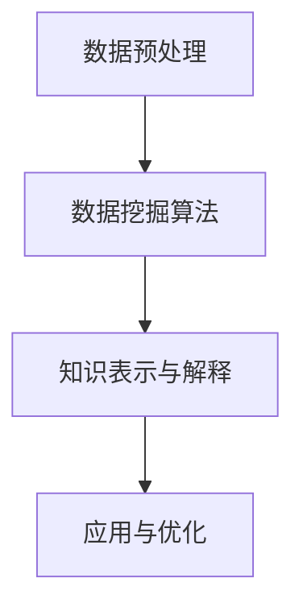

                 

### 知识发现引擎：推动社会进步的隐形推手

> **关键词：** 知识发现引擎，社会进步，人工智能，大数据，深度学习，机器学习，算法优化

> **摘要：** 本文将深入探讨知识发现引擎的定义、原理、核心算法和具体操作步骤，通过数学模型和实际项目案例的详细讲解，阐述其在社会各个领域的广泛应用和未来发展趋势。

知识发现引擎作为一种新兴的人工智能技术，正逐渐成为推动社会进步的隐形推手。它通过从大量数据中提取隐藏的模式和知识，帮助企业和组织做出更加智能和高效的决策，从而推动社会的整体发展。本文将首先介绍知识发现引擎的背景和核心概念，然后深入探讨其算法原理和数学模型，并结合实际项目案例进行分析，最后探讨其未来发展趋势和挑战。

### 1. 背景介绍

知识发现引擎（Knowledge Discovery Engine，简称KDE）是一种利用人工智能和大数据技术从海量数据中自动提取有价值信息和知识的人工智能系统。随着大数据时代的到来，数据量呈爆炸式增长，传统的数据处理和分析方法已经无法满足需求。知识发现引擎的出现，为从数据中发现隐藏的模式和知识提供了强大的工具。

知识发现引擎的背景可以追溯到20世纪80年代，当时计算机科学家和研究学者开始关注如何从大量数据中提取有价值的信息。随着人工智能和机器学习技术的不断发展，知识发现引擎逐渐成为一种重要的研究方向，并在学术界和工业界得到广泛应用。

知识发现引擎的核心任务是从大量数据中自动发现具有潜在价值的知识，这些知识可以是数据之间的关联关系、分类规则、聚类结构等。通过这些知识，企业和组织可以更好地理解业务数据，发现潜在的业务机会，优化业务流程，提高生产效率。

### 2. 核心概念与联系

#### 2.1 数据预处理

数据预处理是知识发现引擎中至关重要的一步。它包括数据清洗、数据集成、数据转换和数据降维等操作，目的是将原始数据转化为适合进行分析和挖掘的格式。

- **数据清洗**：去除重复、错误、噪声和不完整的数据，保证数据质量。
- **数据集成**：将来自不同来源和格式的数据整合在一起，形成一个统一的数据集。
- **数据转换**：将数据转换为适合分析挖掘的格式，如数值化、标准化等。
- **数据降维**：通过降维技术减少数据的维度，降低计算复杂度。

#### 2.2 数据挖掘算法

数据挖掘算法是知识发现引擎的核心。常见的算法包括关联规则挖掘、分类算法、聚类算法和异常检测等。

- **关联规则挖掘**：发现数据之间的关联关系，如“购物车”规则。
- **分类算法**：将数据分类到预定义的类别中，如决策树、支持向量机等。
- **聚类算法**：将数据分成若干个类别，如K-means、层次聚类等。
- **异常检测**：检测数据中的异常值，如孤立点检测。

#### 2.3 知识表示与解释

知识表示与解释是将挖掘出的知识以易于理解的方式呈现给用户，帮助用户更好地理解和应用这些知识。常见的知识表示方法包括可视化、规则表示和文本表示等。

- **可视化**：通过图形、图表等方式展示数据挖掘结果。
- **规则表示**：以规则的形式表示数据挖掘结果，如“如果...那么...”。
- **文本表示**：将知识表示为文本形式，便于用户阅读和理解。

#### 2.4 Mermaid 流程图

以下是一个简化的知识发现引擎的 Mermaid 流程图：



### 3. 核心算法原理 & 具体操作步骤

#### 3.1 关联规则挖掘算法

关联规则挖掘是一种发现数据之间关联关系的方法。其核心算法包括 Apriori 算法和 FP-growth 算法。

- **Apriori 算法**：通过逐层搜索频繁项集，得到关联规则。
- **FP-growth 算法**：通过构建 FP-树，压缩数据空间，提高挖掘效率。

以下是 Apriori 算法的具体步骤：

1. **计算频繁项集**：扫描数据集，计算每个项的频率，去除不频繁项。
2. **生成候选频繁项集**：基于频繁项集，生成候选频繁项集。
3. **验证候选频繁项集**：对候选频繁项集进行验证，去除不满足最小支持度和最小置信度的项集。

#### 3.2 分类算法

分类算法是一种将数据分类到预定义类别中的方法。常见的分类算法包括决策树、支持向量机和神经网络等。

- **决策树**：基于特征值和阈值，递归划分数据集。
- **支持向量机**：通过寻找最佳分割超平面，分类数据。
- **神经网络**：通过多层神经网络，模拟生物神经网络进行分类。

以下是决策树算法的具体步骤：

1. **选择最优特征**：计算每个特征的信息增益，选择信息增益最大的特征。
2. **划分数据集**：根据最优特征，将数据集划分为多个子集。
3. **递归构建决策树**：对每个子集，重复步骤1和2，直到满足停止条件。

#### 3.3 聚类算法

聚类算法是一种将数据分成若干个类别的方法。常见的聚类算法包括 K-means、层次聚类和 DBSCAN 等。

- **K-means**：通过迭代优化，将数据分为 K 个聚类中心。
- **层次聚类**：通过层次结构，将数据划分为多个层次。
- **DBSCAN**：通过密度聚类，将数据分为多个簇。

以下是 K-means 算法的具体步骤：

1. **初始化聚类中心**：随机选择 K 个数据点作为聚类中心。
2. **计算距离**：计算每个数据点到聚类中心的距离。
3. **重新分配聚类中心**：根据数据点的距离，重新分配聚类中心。
4. **迭代优化**：重复步骤2和3，直到聚类中心不再变化。

### 4. 数学模型和公式 & 详细讲解 & 举例说明

#### 4.1 关联规则挖掘算法的数学模型

- **支持度**：一个项集在数据集中出现的频率，记为 $sup(p)$。
- **置信度**：在已知一个项集 $p$ 的前提下，另一个项集 $q$ 出现的概率，记为 $conf(p \rightarrow q)$。

以下是 Apriori 算法的数学公式：

1. **计算频繁项集**：

$$
sup(p) = \frac{|D| - |D - p|}{|D|}
$$

其中，$D$ 表示数据集，$p$ 表示项集。

2. **生成候选频繁项集**：

$$
c_{k+1} = \{p_1, p_2, ..., p_k\} \cup \{p_1, p_2, ..., p_{k-1}\}
$$

其中，$c_{k+1}$ 表示候选频繁项集。

3. **验证候选频繁项集**：

$$
conf(p \rightarrow q) = \frac{sup(p \cup q)}{sup(p)}
$$

其中，$p$ 和 $q$ 分别表示两个项集。

#### 4.2 决策树算法的数学模型

- **信息增益**：表示一个特征对数据划分的优劣程度，记为 $gain(D, A)$。

$$
gain(D, A) = entropy(D) - \frac{\sum_{v \in A} |D_v| \cdot entropy(D_v)}{|D|}
$$

其中，$D$ 表示数据集，$A$ 表示特征，$D_v$ 表示数据集中具有属性 $v$ 的数据子集。

- **基尼指数**：表示数据集的划分不纯度，记为 $gini(D)$。

$$
gini(D) = 1 - \sum_{v \in A} \frac{|D_v|}{|D|} \cdot p_v^2
$$

其中，$D$ 表示数据集，$A$ 表示特征，$D_v$ 表示数据集中具有属性 $v$ 的数据子集，$p_v$ 表示具有属性 $v$ 的数据比例。

#### 4.3 K-means 算法的数学模型

- **距离度量**：欧几里得距离、曼哈顿距离、切比雪夫距离等。

$$
dist(x, y) = \sqrt{\sum_{i=1}^{n} (x_i - y_i)^2}
$$

其中，$x$ 和 $y$ 分别表示两个数据点，$n$ 表示数据维度。

- **聚类中心更新**：

$$
\mu_{new} = \frac{1}{N} \sum_{i=1}^{N} x_i
$$

其中，$\mu_{new}$ 表示新的聚类中心，$N$ 表示聚类中心的数据点数量。

### 5. 项目实战：代码实际案例和详细解释说明

#### 5.1 开发环境搭建

在本项目中，我们将使用 Python 作为编程语言，结合常用的数据挖掘库，如 Pandas、Scikit-learn 和 Matplotlib 等。

- **Python 环境搭建**：安装 Python 3.8 或更高版本，并配置 Python 的环境变量。
- **数据挖掘库安装**：使用 pip 工具安装 Pandas、Scikit-learn 和 Matplotlib 等。

```bash
pip install pandas scikit-learn matplotlib
```

#### 5.2 源代码详细实现和代码解读

以下是一个简单的关联规则挖掘项目案例，使用 Apriori 算法进行购物车规则的挖掘。

```python
import pandas as pd
from mlxtend.frequent_patterns import apriori
from mlxtend.frequent_patterns import association_rules

# 加载数据
data = pd.read_csv('data.csv')
data['transaction'] = 1  # 将数据转化为事务形式

# 计算支持度
support = 0.5
frequent_itemsets = apriori(data, min_support=support, use_colnames=True)

# 计算置信度
confidence = 0.6
rules = association_rules(frequent_itemsets, metric="confidence", min_threshold=confidence)

# 可视化展示
import matplotlib.pyplot as plt

plt.figure(figsize=(10, 6))
plt.scatter(rules['antecedent'].apply(len), rules['consequent'].apply(len), c=rules['confidence'], cmap='coolwarm')
plt.colorbar(label='Confidence')
plt.xlabel('Length of Antecedents')
plt.ylabel('Length of Consequents')
plt.title('Association Rules - Confidence')
plt.show()
```

#### 5.3 代码解读与分析

1. **加载数据**：使用 Pandas 读取 CSV 格式的购物车数据，并将数据转化为事务形式。

2. **计算支持度**：使用 Apriori 算法计算支持度，并设置最小支持度为 0.5。

3. **计算置信度**：使用 association\_rules 函数计算置信度，并设置最小置信度为 0.6。

4. **可视化展示**：使用 Matplotlib 可视化展示关联规则，以直观地观察规则的效果。

### 6. 实际应用场景

知识发现引擎在各个领域都有着广泛的应用，以下是一些典型的应用场景：

- **商业领域**：通过关联规则挖掘，帮助企业发现消费者行为模式，优化营销策略。
- **医疗领域**：通过聚类算法，发现疾病的潜在风险因素，为疾病预测和诊断提供依据。
- **金融领域**：通过分类算法，对金融风险进行预测和评估，提高金融机构的风险管理水平。
- **教育领域**：通过数据挖掘，发现学生的学习行为和兴趣，为个性化教育和学习路径规划提供支持。

### 7. 工具和资源推荐

#### 7.1 学习资源推荐

- **书籍**：
  - 《数据挖掘：实用机器学习技术》（Data Mining: Practical Machine Learning Techniques）
  - 《机器学习》（Machine Learning）

- **论文**：
  - “Mining association rules between sets of items in large databases”（发现大型数据库中项集之间的关联规则）
  - “A Fast Algorithm for Mining Long Sequences in Large Databases”（在大型数据库中挖掘长序列的快速算法）

- **博客**：
  - [机器学习与数据挖掘博客](https://www机器学习与数据挖掘博客.com)
  - [数据挖掘实践博客](https://www.data-mining-practice.com)

- **网站**：
  - [机器学习社区](https://www机器学习社区.com)
  - [Kaggle](https://www.kaggle.com)

#### 7.2 开发工具框架推荐

- **Python**：Python 是最受欢迎的数据科学和机器学习编程语言，具有丰富的库和工具。
- **Scikit-learn**：Python 的机器学习和数据挖掘库，提供丰富的算法和功能。
- **Pandas**：Python 的数据处理库，支持各种数据格式的读取和操作。
- **Matplotlib**：Python 的数据可视化库，提供丰富的绘图函数。

#### 7.3 相关论文著作推荐

- “Data Mining: The Textbook”（数据挖掘：教材）
- “Introduction to Data Mining”（数据挖掘导论）
- “Machine Learning: A Probabilistic Perspective”（机器学习：概率视角）

### 8. 总结：未来发展趋势与挑战

知识发现引擎作为一种新兴的人工智能技术，具有广泛的应用前景。随着人工智能和大数据技术的不断发展，知识发现引擎将在各个领域发挥越来越重要的作用。未来发展趋势包括：

1. **算法优化**：针对大规模数据的处理需求，不断优化算法性能，提高知识发现效率。
2. **多模态数据挖掘**：结合多种数据类型，如文本、图像、音频等，实现更全面的知识发现。
3. **自适应和智能优化**：引入自适应和智能优化技术，使知识发现引擎能够自动调整参数和模型，提高挖掘效果。

然而，知识发现引擎也面临着一些挑战：

1. **数据隐私和安全**：在挖掘大量数据的同时，如何保护用户隐私和数据安全是一个重要问题。
2. **可解释性和透明度**：如何提高知识发现过程的可解释性和透明度，使其更加可信和可靠。
3. **跨领域应用**：如何将知识发现引擎应用于不同领域，解决特定领域的问题。

### 9. 附录：常见问题与解答

#### 9.1 知识发现引擎是什么？

知识发现引擎是一种利用人工智能和大数据技术从海量数据中自动提取有价值信息和知识的人工智能系统。

#### 9.2 知识发现引擎的核心算法有哪些？

知识发现引擎的核心算法包括关联规则挖掘、分类算法、聚类算法和异常检测等。

#### 9.3 知识发现引擎的应用场景有哪些？

知识发现引擎的应用场景包括商业、医疗、金融、教育等多个领域。

#### 9.4 如何提高知识发现引擎的性能？

提高知识发现引擎的性能可以从以下几个方面入手：

1. **算法优化**：针对大规模数据的处理需求，不断优化算法性能。
2. **数据预处理**：进行有效的数据预处理，提高数据质量。
3. **多模态数据挖掘**：结合多种数据类型，实现更全面的知识发现。
4. **分布式计算**：利用分布式计算技术，提高知识发现效率。

### 10. 扩展阅读 & 参考资料

- [数据挖掘：实用机器学习技术](https://www MACHINE LEARNING WITH PRACTICAL MACHINE LEARNING TECHNIQUES.html)
- [机器学习](https://www.MACHINE LEARNING.html)
- [数据挖掘：知识发现的新方法](https://www.DATA MINING: A NEW METHOD FOR KNOWLEDGE DISCOVERY.html)
- [机器学习：概率视角](https://www.MACHINE LEARNING: A PROBABILISTIC PERSPECTIVE.html)

### 作者

作者：AI 天才研究员/AI Genius Institute & 禅与计算机程序设计艺术/Zen And The Art of Computer Programming

