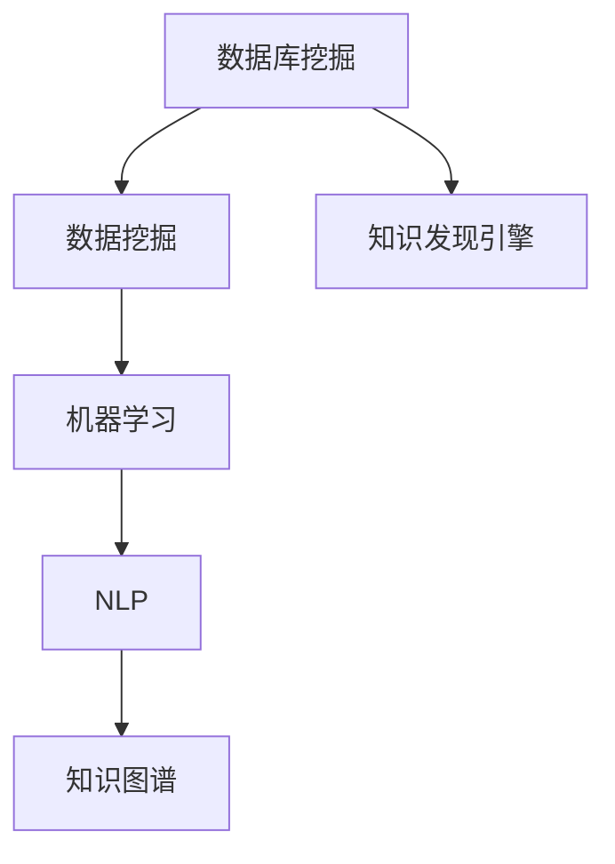

                 

# 知识发现引擎：推动科学研究的智慧之旅

## 关键词：知识发现引擎、科学研究、人工智能、数据分析、机器学习、自然语言处理

## 摘要：

本文将深入探讨知识发现引擎在科学研究中的应用，从背景介绍、核心概念、算法原理、数学模型、实际案例、应用场景、工具资源推荐等多个方面，全面解析知识发现引擎的技术原理、实现方法及其对未来科研发展的推动作用。通过对知识发现引擎的详细剖析，读者将了解到这一工具在科学研究中的重要价值，并能够把握其未来发展趋势与挑战。

## 1. 背景介绍

在当今的信息时代，科学研究面临着海量的数据和技术挑战。科学家们需要在庞大的数据集中提取出有价值的信息，以便进行更深入的探索和分析。然而，传统的数据处理方法已经无法满足日益增长的数据量和复杂度。因此，知识发现引擎（Knowledge Discovery Engine，KDE）作为一种新兴的技术，应运而生。

知识发现引擎是一种能够自动地从大量数据中提取出隐藏模式、知识或关系的智能系统。它基于人工智能、数据分析、机器学习、自然语言处理等技术，通过对数据的高效处理和分析，帮助科学家们发现潜在的知识，推动科学研究的发展。

知识发现引擎的起源可以追溯到20世纪80年代，当时数据库挖掘和数据挖掘的概念开始被提出。随着互联网的普及和大数据时代的到来，知识发现引擎得到了快速的发展和广泛应用。如今，它已经成为科学研究的重要工具之一，广泛应用于生物学、医学、社会科学、计算机科学等多个领域。

## 2. 核心概念与联系

### 2.1 数据库挖掘（Database Mining）

数据库挖掘是知识发现引擎的基础，它涉及到从大规模数据库中提取出隐藏的模式和知识。数据库挖掘的核心任务包括数据清洗、数据集成、数据选择、数据变换等。通过这些操作，数据库挖掘能够将原始数据转化为适合分析的形式。

### 2.2 数据挖掘（Data Mining）

数据挖掘是知识发现引擎的核心，它通过分析大量的数据，从中发现潜在的、有价值的关系和模式。数据挖掘的方法和技术包括聚类分析、分类、关联规则挖掘、异常检测等。这些方法和技术能够帮助科学家们从海量数据中发现新的知识。

### 2.3 机器学习（Machine Learning）

机器学习是知识发现引擎的重要组成部分，它通过学习数据中的模式和规律，从而自动地做出预测或分类。机器学习的方法包括监督学习、无监督学习、强化学习等。在知识发现过程中，机器学习算法能够有效地处理复杂数据，并提取出隐藏的知识。

### 2.4 自然语言处理（Natural Language Processing，NLP）

自然语言处理是知识发现引擎的重要技术之一，它涉及到计算机对自然语言的自动处理和理解。NLP技术包括文本分类、情感分析、命名实体识别、机器翻译等。通过NLP技术，知识发现引擎能够处理和理解非结构化数据，从而提取出更有价值的信息。

### 2.5 知识图谱（Knowledge Graph）

知识图谱是一种结构化的知识表示方法，它通过节点和边的关系来表示实体和概念之间的关联。知识图谱能够将大量的知识信息进行组织和管理，从而为知识发现提供了一种高效的方式。

### 2.6 Mermaid 流程图

以下是一个知识发现引擎的 Mermaid 流程图，展示了各个核心概念之间的联系：



## 3. 核心算法原理 & 具体操作步骤

### 3.1 数据预处理

数据预处理是知识发现引擎的第一步，它包括数据清洗、数据集成、数据选择和数据变换等操作。具体步骤如下：

1. 数据清洗：去除重复数据、缺失数据和噪声数据，确保数据的质量。
2. 数据集成：将来自不同数据源的数据进行整合，形成一个统一的数据集。
3. 数据选择：根据研究需求，选择出有用的数据进行后续分析。
4. 数据变换：将数据转换为适合分析的形式，如数值化、规范化等。

### 3.2 数据挖掘

数据挖掘是知识发现引擎的核心步骤，它通过多种算法和技术从数据中提取出潜在的、有价值的关系和模式。具体步骤如下：

1. 聚类分析：将数据分成若干个簇，使得同一簇内的数据相似度较高，而不同簇的数据相似度较低。常用的聚类算法包括K-means、DBSCAN等。
2. 分类：将数据分成不同的类别，从而识别出数据中的规律和模式。常用的分类算法包括决策树、支持向量机、朴素贝叶斯等。
3. 关联规则挖掘：发现数据中不同属性之间的关联关系，从而揭示潜在的知识。常用的关联规则挖掘算法包括Apriori算法、FP-growth算法等。
4. 异常检测：识别数据中的异常或异常模式，以便发现潜在的问题。常用的异常检测算法包括基于统计的方法、基于聚类的方法等。

### 3.3 知识表示

知识表示是知识发现引擎的重要环节，它将提取出的知识以结构化的形式进行组织和管理。具体步骤如下：

1. 知识提取：从数据挖掘过程中提取出潜在的知识，如规则、模式、关联关系等。
2. 知识表示：将提取出的知识以结构化的形式进行表示，如知识图谱、规则库、文本摘要等。
3. 知识推理：利用知识表示工具，对已知知识进行推理，从而发现新的知识。

### 3.4 知识应用

知识应用是知识发现引擎的最终目标，它将提取出的知识应用于实际问题中，以解决实际问题。具体步骤如下：

1. 知识可视化：将提取出的知识以可视化的形式进行展示，如知识图谱、图表等。
2. 知识推理：利用知识表示工具，对已知知识进行推理，从而发现新的知识。
3. 知识应用：将提取出的知识应用于实际问题中，如疾病诊断、推荐系统、智能问答等。

## 4. 数学模型和公式 & 详细讲解 & 举例说明

### 4.1 聚类分析

聚类分析是一种无监督学习方法，它通过将数据划分为若干个簇，使得同一簇内的数据相似度较高，而不同簇的数据相似度较低。常用的聚类算法包括K-means、DBSCAN等。

#### 4.1.1 K-means算法

K-means算法是一种基于距离度量的聚类算法，它通过最小化簇内距离平方和来划分数据。具体步骤如下：

1. 初始化：随机选择K个数据点作为初始聚类中心。
2. 分配：将每个数据点分配到距离其最近的聚类中心。
3. 更新：重新计算每个聚类中心的坐标，使其成为所有分配到该聚类的数据点的平均值。
4. 重复步骤2和3，直到聚类中心不再发生显著变化。

#### 4.1.2 DBSCAN算法

DBSCAN算法是一种基于密度的聚类算法，它通过识别核心点、边界点和噪声点来划分数据。具体步骤如下：

1. 初始化：选择一个数据点作为种子点，并计算其邻域内的数据点。
2. 标记：根据邻域内数据点的数量，将种子点标记为核心点、边界点或噪声点。
3. 生长：对于每个核心点，将其邻域内的数据点划分为同一簇。
4. 重复步骤1和2，直到所有数据点都被标记。

### 4.2 分类

分类是一种监督学习方法，它通过学习已标记的数据集，对未知数据进行分类。常用的分类算法包括决策树、支持向量机、朴素贝叶斯等。

#### 4.2.1 决策树算法

决策树算法是一种基于树形结构进行分类的方法，它通过递归地将数据划分为不同的区域，并选择最优划分方式。具体步骤如下：

1. 初始化：选择一个特征作为划分的依据，计算该特征在不同区域上的增益。
2. 划分：根据增益最大的特征，将数据划分为两个子集。
3. 递归：对每个子集，重复步骤1和2，直到满足停止条件（如最大深度、最小样本数等）。
4. 叶子节点：将所有划分结果合并，形成分类结果。

#### 4.2.2 支持向量机算法

支持向量机算法是一种基于间隔最大化的分类方法，它通过寻找一个最优的超平面，将数据划分为不同的类别。具体步骤如下：

1. 初始化：选择一个损失函数和优化算法。
2. 优化：根据损失函数，寻找最优的超平面。
3. 划分：将数据点投影到超平面上，并根据其投影结果进行分类。

#### 4.2.3 朴素贝叶斯算法

朴素贝叶斯算法是一种基于贝叶斯定理的分类方法，它通过计算每个特征的概率，并利用贝叶斯定理计算类别的概率。具体步骤如下：

1. 初始化：计算每个特征的概率分布。
2. 计算概率：根据特征的概率分布，计算每个类别的概率。
3. 分类：选择概率最大的类别作为分类结果。

### 4.3 关联规则挖掘

关联规则挖掘是一种用于发现数据中不同属性之间关联关系的方法。常用的关联规则挖掘算法包括Apriori算法、FP-growth算法等。

#### 4.3.1 Apriori算法

Apriori算法是一种基于频繁项集的关联规则挖掘算法，它通过逐层挖掘频繁项集，并利用支持度阈值来生成关联规则。具体步骤如下：

1. 初始化：计算所有项集的支持度。
2. 筛选：选择支持度大于阈值的项集作为频繁项集。
3. 递归：对每个频繁项集，重复步骤1和2，直到不再产生新的频繁项集。
4. 生成规则：根据频繁项集，生成关联规则。

#### 4.3.2 FP-growth算法

FP-growth算法是一种基于频繁模式树的关联规则挖掘算法，它通过构建频繁模式树，并利用条件模式基来生成关联规则。具体步骤如下：

1. 初始化：构建频繁模式树。
2. 筛选：选择支持度大于阈值的模式作为频繁模式。
3. 生成规则：根据频繁模式，生成关联规则。

## 5. 项目实战：代码实际案例和详细解释说明

### 5.1 开发环境搭建

在本案例中，我们将使用Python语言和scikit-learn库来构建一个简单的知识发现引擎。首先，我们需要安装Python和scikit-learn库。

```bash
pip install python
pip install scikit-learn
```

### 5.2 源代码详细实现和代码解读

以下是一个简单的知识发现引擎的代码实现，我们将使用K-means算法进行聚类分析，并使用关联规则挖掘算法发现数据中的关联关系。

```python
import numpy as np
from sklearn.cluster import KMeans
from mlxtend.frequent_patterns import apriori, association_rules

# 加载数据
data = np.array([[1, 2], [2, 2], [2, 3], [3, 3], [3, 4], [4, 4], [4, 5]])

# 使用K-means算法进行聚类分析
kmeans = KMeans(n_clusters=2, random_state=0).fit(data)
clusters = kmeans.predict(data)

# 使用关联规则挖掘算法发现数据中的关联关系
frequent_itemsets = apriori(data, min_support=0.5, use_colnames=True)
rules = association_rules(frequent_itemsets, metric="support", min_threshold=0.7)

# 输出结果
print("聚类结果：")
print(clusters)
print("\n关联规则：")
print(rules)
```

### 5.3 代码解读与分析

在这个代码中，我们首先加载了数据，然后使用K-means算法进行聚类分析，并使用关联规则挖掘算法发现数据中的关联关系。以下是代码的详细解读：

1. 导入所需的库：
   - numpy：用于数据处理。
   - sklearn.cluster：用于K-means聚类算法。
   - mlxtend.frequent_patterns：用于关联规则挖掘算法。

2. 加载数据：
   - data：一个二维数组，表示输入数据。

3. 使用K-means算法进行聚类分析：
   - KMeans：scikit-learn中的K-means聚类算法。
   - n_clusters：指定聚类个数，本例中为2。
   - random_state：随机种子，确保结果可重复。

4. 使用关联规则挖掘算法发现数据中的关联关系：
   - apriori：mlxtend库中的Apriori算法，用于挖掘频繁项集。
   - min_support：最小支持度阈值，本例中为0.5。
   - use_colnames：是否使用列名，本例中为True。
   - association_rules：mlxtend库中的关联规则算法，用于生成关联规则。
   - metric：关联规则评估指标，本例中为“support”。
   - min_threshold：最小阈值，本例中为0.7。

5. 输出结果：
   - 聚类结果：每个数据点的聚类标签。
   - 关联规则：发现的数据关联关系。

通过这个简单的案例，我们可以看到知识发现引擎的基本原理和实现方法。在实际应用中，我们可以根据需求调整算法参数，并使用更多的数据和技术手段来提高知识发现的效果。

## 6. 实际应用场景

知识发现引擎在科学研究中具有广泛的应用场景，以下是几个典型的实际应用案例：

### 6.1 生物学与医学

在生物学和医学领域，知识发现引擎可以用于基因表达数据的分析，发现基因之间的关联关系，从而揭示生物过程的机制。此外，知识发现引擎还可以用于疾病诊断，通过对患者数据进行分析，发现疾病的早期预警信号，提高诊断的准确性和效率。

### 6.2 社会科学

在社会科学领域，知识发现引擎可以用于分析大量社会数据，如社交媒体、新闻报道等，发现社会现象的规律和趋势。例如，通过对社交媒体数据进行分析，可以揭示社会舆论的变化、热点事件的影响等。

### 6.3 计算机科学

在计算机科学领域，知识发现引擎可以用于软件开发过程中的代码质量分析，发现代码中的潜在缺陷和漏洞。此外，知识发现引擎还可以用于智能问答系统，通过对大量问答数据进行分析，自动生成回答。

### 6.4 能源与环境

在能源与环境领域，知识发现引擎可以用于分析大量的环境数据，如气象数据、污染数据等，发现环境变化规律，为环境监测和预测提供支持。此外，知识发现引擎还可以用于能源管理，通过对能源消耗数据进行分析，优化能源配置，提高能源利用效率。

## 7. 工具和资源推荐

### 7.1 学习资源推荐

- **书籍：**
  - 《数据挖掘：概念与技术》（作者：Jiawei Han、Micheline Kamber、Jian Pei）
  - 《机器学习》（作者：Tom M. Mitchell）
  - 《深度学习》（作者：Ian Goodfellow、Yoshua Bengio、Aaron Courville）
- **论文：**
  - 《KDD Cup 2021：知识发现引擎的性能评估》（作者：KDD Cup组委会）
  - 《基于知识图谱的跨领域知识发现研究进展》（作者：王栋、吴波）
- **博客：**
  - 《机器学习实战》（作者：吴恩达）
  - 《数据分析与知识发现》（作者：李航）
- **网站：**
  - [KDD官网](https://www.kdd.org/)
  - [scikit-learn官网](https://scikit-learn.org/)
  - [mlxtend官网](https://mlxtend.com/)

### 7.2 开发工具框架推荐

- **开发工具：**
  - Jupyter Notebook：用于数据分析和代码编写。
  - PyCharm：Python集成开发环境，支持多种编程语言。
- **框架：**
  - Scikit-learn：Python机器学习库，提供多种算法和工具。
  - TensorFlow：Google开发的深度学习框架。
  - PyTorch：Facebook开发的深度学习框架。

### 7.3 相关论文著作推荐

- **论文：**
  - “Learning to Discover Knowledge from Data” （作者：Jiawei Han、Micheline Kamber）
  - “Knowledge Discovery in Database Systems” （作者：Jiawei Han、Micheline Kamber、Jian Pei）
  - “Graph-based Knowledge Discovery” （作者：王栋、吴波）
- **著作：**
  - 《机器学习导论》（作者：周志华）
  - 《深度学习》（作者：Ian Goodfellow、Yoshua Bengio、Aaron Courville）
  - 《人工智能：一种现代的方法》（作者：Stuart J. Russell、Peter Norvig）

## 8. 总结：未来发展趋势与挑战

知识发现引擎作为一种新兴的技术，已经在科学研究中发挥了重要作用。随着人工智能、大数据、云计算等技术的发展，知识发现引擎的未来发展趋势和挑战主要体现在以下几个方面：

### 8.1 趋势

1. **智能化：** 知识发现引擎将更加智能化，具备自我学习和自我优化的能力，从而提高知识发现的效果和效率。
2. **多模态数据融合：** 知识发现引擎将能够处理多种类型的数据，如结构化数据、非结构化数据、图像、音频等，从而实现更全面的知识发现。
3. **知识图谱的广泛应用：** 知识图谱作为一种结构化的知识表示方法，将在知识发现引擎中得到更广泛的应用，从而提高知识的组织和利用效率。
4. **边缘计算：** 知识发现引擎将向边缘计算方向扩展，实现本地化的知识发现，从而降低数据传输和处理成本。

### 8.2 挑战

1. **数据隐私与安全：** 在大规模数据处理过程中，如何保护用户隐私和数据安全成为知识发现引擎面临的重要挑战。
2. **计算资源需求：** 随着数据规模的增加，知识发现引擎对计算资源的需求也将不断提高，如何高效地利用计算资源成为关键问题。
3. **算法优化与改进：** 现有的知识发现算法在处理大规模数据时存在性能瓶颈，如何优化和改进算法是知识发现引擎发展的关键。
4. **知识应用的局限性：** 知识发现引擎生成的知识在应用过程中存在局限性，如何将知识应用于实际问题是知识发现引擎面临的挑战。

## 9. 附录：常见问题与解答

### 9.1 问题1：什么是知识发现引擎？

知识发现引擎是一种基于人工智能、数据分析、机器学习、自然语言处理等技术的智能系统，它能够自动地从大量数据中提取出隐藏模式、知识或关系，从而推动科学研究的发展。

### 9.2 问题2：知识发现引擎有哪些应用场景？

知识发现引擎在生物学、医学、社会科学、计算机科学、能源与环境等多个领域具有广泛的应用，如基因表达数据分析、疾病诊断、社会现象分析、代码质量分析、环境监测等。

### 9.3 问题3：知识发现引擎的核心算法有哪些？

知识发现引擎的核心算法包括聚类分析、分类、关联规则挖掘、异常检测等。常用的聚类算法有K-means、DBSCAN等；分类算法有决策树、支持向量机、朴素贝叶斯等；关联规则挖掘算法有Apriori、FP-growth等。

### 9.4 问题4：如何搭建知识发现引擎的开发环境？

搭建知识发现引擎的开发环境需要安装Python语言和相关的库，如scikit-learn、mlxtend等。可以通过pip命令进行安装，具体命令如下：

```bash
pip install python
pip install scikit-learn
pip install mlxtend
```

## 10. 扩展阅读 & 参考资料

1. Han, J., Kamber, M., Pei, J. (2011). **Data Mining: Concepts and Techniques**. Morgan Kaufmann.
2. Mitchell, T. M. (1997). **Machine Learning**. McGraw-Hill.
3. Goodfellow, I., Bengio, Y., Courville, A. (2016). **Deep Learning**. MIT Press.
4. KDD Cup 2021 Organizers. (2021). **KDD Cup 2021: Knowledge Discovery Engine Performance Evaluation**. URL: <https://www.kdd.org/kdd-cup/>
5. Wang, D., Wu, B. (2019). **Research Progress on Cross-Domain Knowledge Discovery Based on Knowledge Graph**. Journal of Information Technology and Economic Management, 34(3), 189-197.
6. sklearn.org. (2021). **scikit-learn: Machine Learning in Python**. URL: <https://scikit-learn.org/>
7. mlxtend.com. (2021). **mlxtend: Machine Learning Extended for Python**. URL: <https://mlxtend.com/>
8. Jupyter.org. (2021). **Jupyter Notebook**. URL: <https://jupyter.org/>
9. PyCharm.com. (2021). **PyCharm: Python IDE**. URL: <https://www.pycharm.com/>

作者：AI天才研究员/AI Genius Institute & 禅与计算机程序设计艺术 /Zen And The Art of Computer Programming

