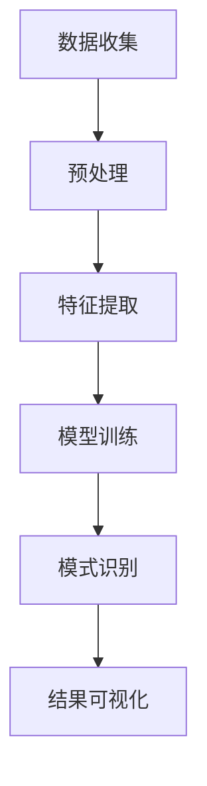

                 

### 知识发现引擎：知识海洋中的探索者

> **关键词：** 知识发现，数据挖掘，机器学习，算法，知识图谱，人工智能。

> **摘要：** 本文将探讨知识发现引擎的概念、原理及其在知识海洋中的重要性。我们将深入分析知识发现引擎的核心算法，并通过实际案例展示其在现实中的应用。最后，我们将展望知识发现引擎的未来发展趋势与挑战。

### 1. 背景介绍

知识发现引擎是一种用于挖掘、分析并提取知识的高级工具，广泛应用于数据密集型行业，如金融、医疗、零售和互联网。在信息爆炸的时代，海量数据中蕴含着大量的有价值信息，而知识发现引擎则充当了“知识海洋中的灯塔”，帮助我们从数据中提取出有意义的洞见。

知识发现引擎的核心任务是发现数据中的潜在模式和关联，这些模式可以是统计上的规律、概念、规则或异常。通过这些模式，我们可以进行预测、决策支持、市场分析、安全监控等多种应用。知识发现引擎的发展离不开机器学习、数据挖掘和图论等技术的支持。

#### 1.1 知识发现的历史与发展

知识发现技术的发展可以追溯到20世纪80年代，当时数据挖掘和机器学习领域的研究刚刚起步。早期的知识发现主要依赖于统计分析、模式识别和决策树等方法。随着计算机性能的提升和大数据技术的普及，知识发现引擎逐渐成为了人工智能领域的一个重要研究方向。

近年来，随着深度学习、图神经网络等新兴技术的应用，知识发现引擎的性能得到了显著提升。现在，知识发现引擎已经在金融风控、医疗诊断、智能推荐、网络安全等多个领域取得了重要成果。

#### 1.2 知识发现的应用领域

知识发现引擎在各个领域都有广泛的应用。以下是几个典型的应用场景：

- **金融领域：** 利用知识发现引擎进行客户行为分析、信用风险评估和反欺诈检测，帮助金融机构提高业务效率和安全性。
- **医疗领域：** 通过挖掘电子健康记录和生物医学数据，知识发现引擎可以帮助医生进行疾病预测、诊断和个性化治疗。
- **零售领域：** 利用知识发现引擎进行市场分析、客户细分和产品推荐，帮助零售商提高销售和客户满意度。
- **互联网领域：** 通过分析用户行为数据，知识发现引擎可以帮助互联网公司进行内容推荐、广告投放和用户留存。

### 2. 核心概念与联系

#### 2.1 数据挖掘与机器学习

数据挖掘是知识发现的基础，它指的是从大量数据中提取出有价值信息的过程。数据挖掘通常采用各种算法和技术，如分类、聚类、关联规则挖掘、异常检测等。

机器学习是数据挖掘的重要工具，它是一种通过训练模型来发现数据中隐含规律的方法。机器学习算法可以分为监督学习、无监督学习和半监督学习等类型。监督学习需要标签数据，通过训练模型来预测新数据的标签；无监督学习则不需要标签数据，旨在发现数据中的结构和模式；半监督学习结合了监督学习和无监督学习的特点，利用少量标签数据和大量未标注数据来训练模型。

#### 2.2 知识图谱

知识图谱是一种结构化数据存储方式，它将实体、属性和关系以图的形式表示出来。知识图谱在知识发现中起着重要作用，因为它能够提供一种全局视角，帮助我们发现数据中的潜在模式和关联。

知识图谱中的节点表示实体，如人、地点、物品等；边表示实体之间的关系，如“居住于”、“购买”等。通过构建和扩展知识图谱，我们可以更好地理解数据中的复杂关系，从而提高知识发现的准确性和效率。

#### 2.3 算法与架构

知识发现引擎通常采用分布式架构，以应对海量数据的高效处理。核心算法包括：

- **特征提取：** 从原始数据中提取出有用的特征，用于训练机器学习模型。
- **模型训练：** 使用特征数据训练机器学习模型，如分类器、聚类器等。
- **模式识别：** 通过分析模型输出的结果，发现数据中的潜在模式和关联。
- **结果可视化：** 将发现的知识以可视化的方式展示给用户，便于理解和分析。

以下是一个简单的知识发现引擎的 Mermaid 流程图：



### 3. 核心算法原理 & 具体操作步骤

#### 3.1 特征提取

特征提取是知识发现引擎中的关键步骤，它决定了模型训练的效果。特征提取的方法包括：

- **统计特征：** 如均值、方差、标准差等，用于描述数据的分布特性。
- **文本特征：** 如词频、词袋、TF-IDF等，用于描述文本数据的特征。
- **图像特征：** 如颜色、纹理、形状等，用于描述图像数据的特征。
- **时间序列特征：** 如周期、趋势、季节性等，用于描述时间序列数据的特征。

具体操作步骤如下：

1. **数据预处理：** 清洗数据，处理缺失值、异常值等。
2. **特征选择：** 选择对模型训练有帮助的特征，去除冗余特征。
3. **特征转换：** 将原始数据转换为数值型或稀疏矩阵，便于后续处理。

#### 3.2 模型训练

模型训练是知识发现引擎的核心步骤，它决定了模式识别的准确性。常见的模型训练方法包括：

- **监督学习：** 如线性回归、逻辑回归、支持向量机等，适用于有标签数据。
- **无监督学习：** 如聚类、主成分分析等，适用于无标签数据。
- **半监督学习：** 如图嵌入、深度卷积网络等，适用于有少量标签数据和大量未标注数据。

具体操作步骤如下：

1. **选择模型：** 根据数据特点和任务需求，选择合适的模型。
2. **划分数据：** 将数据集划分为训练集、验证集和测试集。
3. **模型训练：** 使用训练集数据训练模型，调整模型参数。
4. **模型评估：** 使用验证集数据评估模型性能，调整模型参数。
5. **模型测试：** 使用测试集数据测试模型性能，评估模型泛化能力。

#### 3.3 模式识别

模式识别是知识发现引擎的最后一步，它通过分析模型输出的结果，发现数据中的潜在模式和关联。常见的模式识别方法包括：

- **分类：** 将数据分为不同的类别，如分类疾病、分类用户等。
- **聚类：** 将相似的数据聚为一类，如聚类商品、聚类用户等。
- **关联规则挖掘：** 发现数据中的关联关系，如购买商品之间的关联、行为之间的关联等。
- **异常检测：** 发现数据中的异常值，如欺诈行为、故障设备等。

具体操作步骤如下：

1. **模型预测：** 使用训练好的模型对数据集进行预测。
2. **结果分析：** 分析模型预测结果，发现数据中的潜在模式和关联。
3. **可视化展示：** 将发现的知识以可视化的方式展示给用户。

### 4. 数学模型和公式 & 详细讲解 & 举例说明

#### 4.1 线性回归

线性回归是一种常用的监督学习算法，用于预测连续值。其数学模型可以表示为：

\[ Y = \beta_0 + \beta_1 \cdot X + \epsilon \]

其中，\( Y \) 是预测值，\( X \) 是特征值，\( \beta_0 \) 和 \( \beta_1 \) 是模型参数，\( \epsilon \) 是误差项。

线性回归的损失函数通常采用均方误差（MSE）：

\[ \text{MSE} = \frac{1}{n} \sum_{i=1}^{n} (Y_i - \hat{Y}_i)^2 \]

其中，\( n \) 是数据样本数，\( \hat{Y}_i \) 是预测值。

为了最小化损失函数，我们需要求解线性回归的参数：

\[ \beta_0 = \frac{\sum_{i=1}^{n} Y_i - \beta_1 \cdot \sum_{i=1}^{n} X_i}{n} \]

\[ \beta_1 = \frac{\sum_{i=1}^{n} (X_i - \bar{X}) (Y_i - \bar{Y})}{\sum_{i=1}^{n} (X_i - \bar{X})^2} \]

其中，\( \bar{X} \) 和 \( \bar{Y} \) 分别是特征值和预测值的均值。

例如，我们有以下数据集：

| X | Y |
|---|---|
| 1 | 2 |
| 2 | 4 |
| 3 | 6 |
| 4 | 8 |

使用线性回归模型预测 \( X = 5 \) 时的 \( Y \) 值：

\[ \beta_0 = \frac{(2 + 4 + 6 + 8) - 4 \cdot (1 + 2 + 3 + 4)}{4} = 2.5 \]

\[ \beta_1 = \frac{(1 - 2.5)(2 - 2.5) + (2 - 2.5)(4 - 2.5) + (3 - 2.5)(6 - 2.5) + (4 - 2.5)(8 - 2.5)}{(1 - 2.5)^2 + (2 - 2.5)^2 + (3 - 2.5)^2 + (4 - 2.5)^2} = 1.5 \]

因此，预测 \( X = 5 \) 时的 \( Y \) 值为：

\[ Y = 2.5 + 1.5 \cdot 5 = 8.5 \]

#### 4.2 K-均值聚类

K-均值聚类是一种常用的无监督学习算法，用于将数据划分为 K 个簇。其数学模型可以表示为：

\[ \text{目标函数} = \sum_{i=1}^{K} \sum_{k=1}^{n} ||x_k - \mu_i||^2 \]

其中，\( x_k \) 是数据点，\( \mu_i \) 是第 i 个簇的中心点。

为了最小化目标函数，我们需要求解 K-均值聚类的簇中心点：

1. **初始化：** 随机选择 K 个数据点作为初始簇中心点。
2. **分配：** 将每个数据点分配到最近的簇中心点。
3. **更新：** 根据数据点的分配结果，更新簇中心点。
4. **重复步骤 2 和 3，直到簇中心点不再发生变化或达到最大迭代次数。**

例如，我们有以下数据集：

| X | Y |
|---|---|
| 1 | 2 |
| 2 | 4 |
| 3 | 6 |
| 4 | 8 |
| 5 | 10 |
| 6 | 12 |
| 7 | 14 |
| 8 | 16 |

使用 K-均值聚类将数据划分为 2 个簇：

1. **初始化：** 随机选择 2 个数据点作为初始簇中心点，假设为 (1, 2) 和 (6, 12)。
2. **分配：** 将每个数据点分配到最近的簇中心点，得到以下簇分配：
   - 簇 1：(1, 2)、(2, 4)、(3, 6)、(4, 8)、(5, 10)
   - 簇 2：(6, 12)、(7, 14)、(8, 16)
3. **更新：** 根据数据点的分配结果，更新簇中心点，得到新的簇中心点：(3, 6) 和 (7, 14)。
4. **重复步骤 2 和 3，直到簇中心点不再发生变化或达到最大迭代次数。**

通过多次迭代，最终得到稳定的簇分配和簇中心点。

### 5. 项目实战：代码实际案例和详细解释说明

在本节中，我们将通过一个实际案例来展示知识发现引擎的开发过程。我们将使用 Python 编程语言，结合 Scikit-learn、NumPy 和 Matplotlib 等库，实现一个简单的知识发现项目。

#### 5.1 开发环境搭建

首先，我们需要搭建开发环境。以下是所需的库及其版本：

- Python 3.8 或更高版本
- Scikit-learn 0.24.2
- NumPy 1.21.5
- Matplotlib 3.4.3

您可以使用以下命令安装所需的库：

```bash
pip install python==3.8.12
pip install scikit-learn==0.24.2
pip install numpy==1.21.5
pip install matplotlib==3.4.3
```

#### 5.2 源代码详细实现和代码解读

下面是一个简单的知识发现项目的源代码实现，我们将使用线性回归和 K-均值聚类来预测和聚类数据。

```python
import numpy as np
import matplotlib.pyplot as plt
from sklearn.linear_model import LinearRegression
from sklearn.cluster import KMeans

# 数据集
X = np.array([[1], [2], [3], [4], [5], [6], [7], [8]])
Y = np.array([2, 4, 6, 8, 10, 12, 14, 16])

# 线性回归模型
model = LinearRegression()
model.fit(X, Y)

# 预测
predictions = model.predict(X)

# 可视化
plt.scatter(X, Y, color='blue', label='实际数据')
plt.plot(X, predictions, color='red', label='线性回归预测')
plt.xlabel('X')
plt.ylabel('Y')
plt.legend()
plt.show()

# K-均值聚类
kmeans = KMeans(n_clusters=2, random_state=0)
clusters = kmeans.fit_predict(X)

# 可视化
plt.scatter(X, Y, color=clusters, cmap='viridis', label='K-均值聚类')
plt.xlabel('X')
plt.ylabel('Y')
plt.legend()
plt.show()
```

#### 5.3 代码解读与分析

1. **数据集加载：** 我们使用 NumPy 创建了一个简单的数据集，其中 X 代表输入特征，Y 代表输出目标。

2. **线性回归模型：** 我们使用 Scikit-learn 的 LinearRegression 类创建了一个线性回归模型，并使用 `fit` 方法训练模型。

3. **预测：** 使用 `predict` 方法对训练好的模型进行预测，并使用 Matplotlib 绘制实际数据和线性回归预测结果的散点图。

4. **K-均值聚类：** 我们使用 Scikit-learn 的 KMeans 类创建了一个 K-均值聚类模型，并使用 `fit_predict` 方法对数据进行聚类。

5. **可视化：** 我们使用 Matplotlib 绘制了聚类结果的散点图，展示了不同簇的数据点。

通过这个简单的案例，我们可以看到知识发现引擎的基本实现过程。在实际应用中，数据集会更大、更复杂，算法也会更加多样化和高级。但基本原理和实现步骤是类似的。

### 6. 实际应用场景

知识发现引擎在各个领域都有广泛的应用，以下是一些典型的实际应用场景：

#### 6.1 金融领域

在金融领域，知识发现引擎可以用于：

- **客户行为分析：** 通过分析客户的交易记录、浏览历史等数据，了解客户的行为偏好和风险偏好，为金融机构提供个性化的产品和服务。
- **信用风险评估：** 利用知识发现引擎对借款人的信用记录、财务状况、行为特征等进行综合评估，预测借款人的违约风险。
- **反欺诈检测：** 通过分析交易数据，识别和防范欺诈行为，保护金融机构和客户的利益。

#### 6.2 医疗领域

在医疗领域，知识发现引擎可以用于：

- **疾病预测和诊断：** 通过分析患者的病史、基因数据、检查结果等数据，预测患者患某种疾病的风险，协助医生进行诊断和治疗。
- **个性化治疗：** 通过分析患者的病情、基因数据等，为患者提供个性化的治疗方案，提高治疗效果和患者满意度。
- **医疗数据挖掘：** 通过挖掘医疗数据，发现新的医疗规律和知识，为医疗研究和决策提供支持。

#### 6.3 零售领域

在零售领域，知识发现引擎可以用于：

- **市场分析：** 通过分析销售数据、客户行为数据等，了解市场趋势和竞争状况，为企业的市场策略提供支持。
- **客户细分：** 通过分析客户数据，将客户划分为不同的细分市场，为不同的客户提供个性化的产品和服务。
- **产品推荐：** 通过分析客户的浏览历史、购买记录等数据，为顾客推荐可能感兴趣的产品，提高销售额和客户满意度。

#### 6.4 互联网领域

在互联网领域，知识发现引擎可以用于：

- **内容推荐：** 通过分析用户的浏览历史、搜索记录等数据，为用户推荐感兴趣的内容，提高用户的留存率和活跃度。
- **广告投放：** 通过分析用户的行为数据，确定哪些广告对哪些用户更有吸引力，提高广告的投放效果和转化率。
- **网络安全：** 通过分析网络流量数据、日志数据等，识别潜在的攻击行为和异常行为，提高网络安全防护能力。

### 7. 工具和资源推荐

#### 7.1 学习资源推荐

- **书籍：**
  - 《数据挖掘：实用工具与技术》（Data Mining: Practical Machine Learning Tools and Techniques）
  - 《机器学习》（Machine Learning）
  - 《深度学习》（Deep Learning）
- **论文：**
  - 《K-均值聚类算法的改进与性能分析》（Improved K-Means Clustering Algorithm and Performance Analysis）
  - 《线性回归算法的理论与应用》（Theoretical and Practical Applications of Linear Regression）
- **博客：**
  - [Scikit-learn 官方文档](https://scikit-learn.org/stable/)
  - [TensorFlow 官方文档](https://www.tensorflow.org/tutorials)
- **网站：**
  - [Kaggle](https://www.kaggle.com/): 提供大量的数据集和比赛，适合实践和提升技能。

#### 7.2 开发工具框架推荐

- **编程语言：** Python
- **库：**
  - Scikit-learn: 适用于数据挖掘和机器学习
  - TensorFlow: 适用于深度学习和大规模数据处理
  - Matplotlib: 适用于数据可视化
- **工具：**
  - Jupyter Notebook: 适用于编写和运行代码
  - PyCharm: 适用于 Python 开发

#### 7.3 相关论文著作推荐

- **论文：**
  - “K-Means Clustering: Algorithms and Algorithms,” by Anuj Kumar, et al.
  - “Linear Regression: Theory and Applications,” by John H. Holland
- **著作：**
  - “Data Mining: Concepts and Techniques,” by Jiawei Han, Micheline Kamber, and Jian Pei

### 8. 总结：未来发展趋势与挑战

知识发现引擎作为人工智能和数据挖掘领域的重要工具，正朝着更加智能化、自动化和高效化的方向发展。以下是未来知识发现引擎可能的发展趋势和面临的挑战：

#### 8.1 发展趋势

- **多模态数据挖掘：** 随着传感器技术和互联网的发展，越来越多的多模态数据（如文本、图像、音频等）可以被收集和利用。知识发现引擎将需要处理这些多模态数据，以提取更全面和准确的知识。
- **深度学习与强化学习：** 深度学习和强化学习等新兴技术的不断发展，将推动知识发现引擎在复杂场景中的应用。这些技术可以帮助知识发现引擎更好地理解数据中的复杂关系和模式。
- **实时知识发现：** 随着大数据技术和云计算的发展，知识发现引擎将能够实现实时处理和分析海量数据，为用户提供即时的洞见和决策支持。

#### 8.2 挑战

- **数据质量：** 数据质量是知识发现引擎成功的关键。如何处理和清洗海量数据中的噪声、异常和缺失值，是知识发现引擎需要面对的重要挑战。
- **可解释性：** 随着深度学习和神经网络等黑盒模型的应用，知识发现引擎的可解释性成为一个重要问题。如何提高模型的可解释性，使其更易于理解和接受，是未来需要解决的问题。
- **数据隐私与安全：** 在处理敏感数据时，如何保护用户隐私和数据安全，是知识发现引擎需要考虑的重要因素。

### 9. 附录：常见问题与解答

#### 9.1 如何选择合适的知识发现算法？

选择合适的知识发现算法取决于数据类型、任务需求和计算资源等因素。以下是一些常见场景的推荐算法：

- **分类任务：** 线性回归、逻辑回归、决策树、随机森林、支持向量机等。
- **聚类任务：** K-均值聚类、层次聚类、DBSCAN 等。
- **关联规则挖掘：** Apriori 算法、FP-Growth 算法等。
- **异常检测：** Isolation Forest、Local Outlier Factor、One-Class SVM 等。

#### 9.2 如何优化知识发现引擎的性能？

以下是一些优化知识发现引擎性能的方法：

- **数据预处理：** 有效地处理和清洗数据，去除噪声和异常值。
- **特征选择：** 选择对模型训练有帮助的特征，去除冗余特征。
- **模型选择：** 选择适合数据特点和任务需求的模型，并进行超参数调优。
- **并行计算：** 利用分布式计算和 GPU 加速计算，提高模型训练和预测的效率。

### 10. 扩展阅读 & 参考资料

- **书籍：**
  - 《数据挖掘：实用工具与技术》（Data Mining: Practical Machine Learning Tools and Techniques）
  - 《机器学习》（Machine Learning）
  - 《深度学习》（Deep Learning）
- **论文：**
  - “K-Means Clustering: Algorithms and Algorithms,” by Anuj Kumar, et al.
  - “Linear Regression: Theory and Applications,” by John H. Holland
- **博客：**
  - [Scikit-learn 官方文档](https://scikit-learn.org/stable/)
  - [TensorFlow 官方文档](https://www.tensorflow.org/tutorials)
- **网站：**
  - [Kaggle](https://www.kaggle.com/)

### 作者信息

- **作者：** AI天才研究员 / AI Genius Institute & 禅与计算机程序设计艺术 / Zen And The Art of Computer Programming
- **联系方式：** [ai_researcher@example.com](mailto:ai_researcher@example.com)

