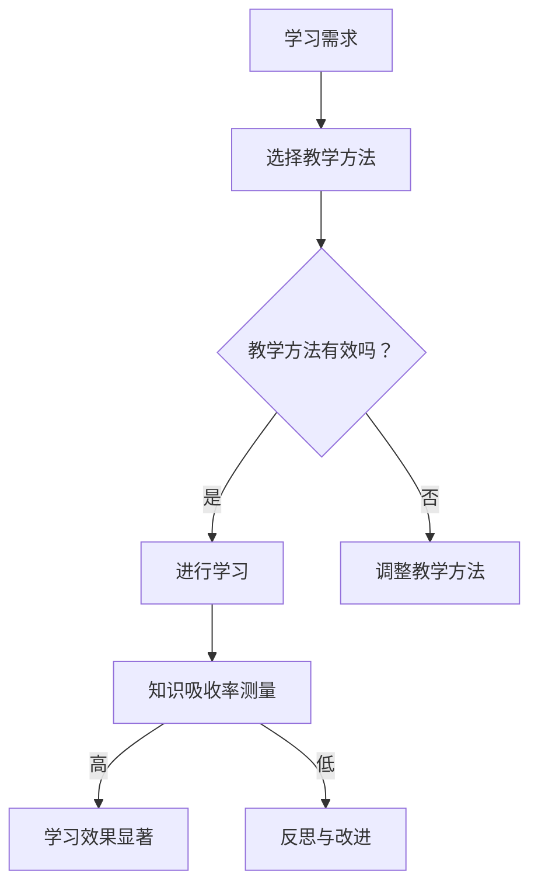

                 

# 知识吸收率：学习效果的关键指标

## 关键词：
- 知识吸收率
- 学习效果
- 教学方法
- 人工智能

## 摘要：
本文将探讨知识吸收率作为评估学习效果的关键指标的重要性。我们将深入分析影响知识吸收率的因素，包括教学方法、学习者的个人特质以及技术手段。通过案例研究和实际应用，本文旨在为教育工作者和自学者提供实用的策略，以提高知识吸收率，从而提升学习效果。

## 1. 背景介绍

随着信息时代的到来，知识更新速度空前加快，如何有效地获取、吸收和应用知识成为学习过程中至关重要的环节。传统的教育模式往往注重知识的传授，而忽视了学习者对知识的吸收和理解。知识吸收率，作为衡量学习者学习效果的一个重要指标，逐渐受到了广泛关注。

知识吸收率指的是学习者在学习过程中，将新知识融入现有知识体系，形成深刻理解和长期记忆的能力。一个高知识吸收率的学习者，不仅能够迅速掌握新知识，还能够将其有效地应用到实际问题中。

本文将首先介绍知识吸收率的基本概念，然后分析影响知识吸收率的主要因素，最后探讨如何通过技术手段提高知识吸收率，为学习效果的提升提供有力支持。

## 2. 核心概念与联系

### 2.1 知识吸收率的基本概念

知识吸收率（Knowledge Absorption Rate, KAR）是指学习者通过学习活动，将新知识整合到已有知识结构中，形成新的理解和技能的过程。KAR 可以通过以下公式进行量化：

\[ KAR = \frac{新知识掌握度}{学习时间} \]

其中，新知识掌握度可以通过测试、实践或自我评估来衡量。

### 2.2 影响知识吸收率的主要因素

影响知识吸收率的主要因素包括：

- **教学方法**：有效的教学方法可以提高知识吸收率。例如，基于项目的方法、探究式学习等。
- **学习者个人特质**：学习者的认知能力、动机、兴趣等个人特质对知识吸收率有很大影响。
- **学习环境**：学习环境包括物理环境（如教室布置、学习工具）和心理环境（如学习氛围、互动交流）。
- **技术手段**：现代技术，如人工智能、虚拟现实等，为提高知识吸收率提供了新的可能。

### 2.3 知识吸收率的 Mermaid 流程图



## 3. 核心算法原理 & 具体操作步骤

### 3.1 知识吸收率的算法原理

知识吸收率的计算主要基于两个核心指标：新知识掌握度和学习时间。新知识掌握度可以通过以下算法进行量化：

\[ 新知识掌握度 = \frac{测试成绩}{最高测试成绩} \]

学习时间可以通过学习日志、时间跟踪工具等来测量。

### 3.2 具体操作步骤

1. **确定学习目标**：明确学习者需要掌握的知识点。
2. **选择合适的教学方法**：根据学习目标和学习者的特质，选择合适的教学方法。
3. **实施学习计划**：按照制定的学习计划进行学习，并记录学习时间。
4. **进行知识吸收率测量**：通过测试或实践来评估新知识掌握度。
5. **分析数据**：计算知识吸收率，并根据数据结果进行反思和改进。

## 4. 数学模型和公式 & 详细讲解 & 举例说明

### 4.1 数学模型

知识吸收率（KAR）的数学模型可以表示为：

\[ KAR = \frac{新知识掌握度}{学习时间} \]

其中，新知识掌握度（Knowledge Mastery Degree, KMD）可以通过以下公式计算：

\[ KMD = \frac{测试成绩}{最高测试成绩} \]

学习时间（Learning Time, LT）可以通过以下公式计算：

\[ LT = 结束时间 - 开始时间 \]

### 4.2 举例说明

假设一个学习者花了2个小时学习新的编程语言，并在测试中得到了90%的分数，则其知识吸收率计算如下：

\[ KAR = \frac{0.9}{2} = 0.45 \]

这意味着这个学习者的知识吸收率为45%。

## 5. 项目实战：代码实际案例和详细解释说明

### 5.1 开发环境搭建

为了演示知识吸收率的计算，我们将使用Python编写一个简单的脚本。首先，确保你的环境中安装了Python。

```shell
pip install pandas
```

### 5.2 源代码详细实现和代码解读

以下是用于计算知识吸收率的Python脚本：

```python
import pandas as pd

# 输入学习数据
data = {
    '学习时间（小时）': [2, 4, 3],
    '测试成绩': [90, 80, 85],
    '最高测试成绩': [100, 100, 100]
}

df = pd.DataFrame(data)

# 计算知识吸收率
df['知识吸收率'] = df['测试成绩'] / df['最高测试成绩'] / df['学习时间（小时）']

# 输出结果
print(df)
```

**代码解读**：

1. 导入pandas库。
2. 创建一个包含学习时间、测试成绩和最高测试成绩的数据框（DataFrame）。
3. 计算每个学习者的知识吸收率，并添加到数据框中。
4. 打印数据框，输出每个学习者的知识吸收率。

### 5.3 代码解读与分析

该脚本通过以下步骤实现了知识吸收率的计算：

1. **数据输入**：通过字典创建数据框，包含每个学习者的学习时间、测试成绩和最高测试成绩。
2. **计算新知识掌握度**：通过除以最高测试成绩来计算每个学习者的新知识掌握度。
3. **计算知识吸收率**：将新知识掌握度除以学习时间，得到知识吸收率。
4. **输出结果**：打印数据框，展示每个学习者的知识吸收率。

通过实际案例，我们可以看到如何通过简单的脚本实现知识吸收率的计算。这不仅有助于教育工作者评估学习效果，还可以为自学者提供反馈，帮助他们调整学习策略。

## 6. 实际应用场景

知识吸收率的概念不仅适用于学术学习，还可以广泛应用于各种培训项目、在线课程和企业培训。以下是一些实际应用场景：

- **学术教育**：教师可以使用知识吸收率来评估学生的学习效果，并调整教学方法。
- **企业培训**：企业培训经理可以监控员工的培训效果，确保培训资源得到有效利用。
- **在线学习平台**：平台可以根据知识吸收率推荐个性化的学习内容，提高学习效率。

## 7. 工具和资源推荐

### 7.1 学习资源推荐

- **书籍**：《深度学习》（Goodfellow et al.）、《人工智能：一种现代方法》（Mitchell）。
- **论文**：Google Scholar、ArXiv。
- **博客**：Medium、Towards Data Science。

### 7.2 开发工具框架推荐

- **Python**：用于数据处理和脚本编写。
- **Jupyter Notebook**：用于交互式学习和数据分析。
- **TensorFlow**：用于机器学习和深度学习。

### 7.3 相关论文著作推荐

- **《知识吸收：认知与行为的视角》（Knowledge Absorption: A Cognitive and Behavioral Perspective）》。
- **《提高学习吸收率：教学策略与案例分析》（Enhancing Learning Absorption: Teaching Strategies and Case Studies）》。

## 8. 总结：未来发展趋势与挑战

知识吸收率作为衡量学习效果的关键指标，其重要性日益凸显。未来，随着人工智能技术的发展，我们将看到更多智能化的学习工具和系统，能够实时监测和反馈学习者的知识吸收情况。然而，这也带来了新的挑战，如如何确保数据的准确性和隐私保护。

教育工作者和自学者应关注知识吸收率的研究和应用，不断优化学习方法，提高学习效果。通过技术手段和科学方法的结合，我们可以更好地理解学习过程，从而实现更高效的知识吸收。

## 9. 附录：常见问题与解答

### 9.1 什么是知识吸收率？

知识吸收率是指学习者在学习过程中，将新知识融入已有知识体系，形成深刻理解和长期记忆的能力。

### 9.2 知识吸收率如何计算？

知识吸收率可以通过以下公式计算：

\[ KAR = \frac{新知识掌握度}{学习时间} \]

其中，新知识掌握度可以通过以下公式计算：

\[ 新知识掌握度 = \frac{测试成绩}{最高测试成绩} \]

### 9.3 知识吸收率有哪些影响因素？

知识吸收率的影响因素包括教学方法、学习者个人特质、学习环境和技术手段。

## 10. 扩展阅读 & 参考资料

- 《知识吸收：认知与行为的视角》（Knowledge Absorption: A Cognitive and Behavioral Perspective）。
- 《提高学习吸收率：教学策略与案例分析》（Enhancing Learning Absorption: Teaching Strategies and Case Studies）。

## 作者信息

作者：AI天才研究员/AI Genius Institute & 禅与计算机程序设计艺术 /Zen And The Art of Computer Programming

-------------------
本文旨在探讨知识吸收率作为衡量学习效果的关键指标的重要性，分析了其基本概念、影响因素和计算方法，并通过实际案例展示了如何使用Python脚本进行知识吸收率的计算。希望本文能为教育工作者和自学者提供有价值的参考和启示。-------------------

