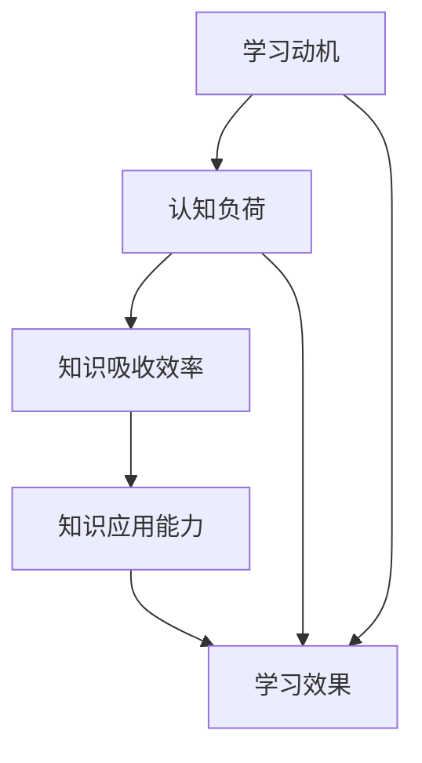

                 

### 背景介绍

随着科技的迅猛发展，人工智能（AI）和大数据技术的广泛应用，知识吸收率（Knowledge Absorption Rate，简称KAR）作为一个衡量学习效果的关键指标，逐渐受到了学术研究和工业界的广泛关注。知识吸收率不仅关乎个人的学习成效，也直接影响到组织和企业的人才培养效率。因此，深入了解知识吸收率的概念、计算方法和影响因素，对于优化学习过程、提升学习效果具有重要意义。

知识吸收率的概念最早由美国学者罗伯特·Z·托马斯（Robert Z. Thomas）于1974年提出。他将其定义为“一个个体在某一知识领域内，通过学习活动所获得的认知能力的变化量与原始认知能力之比”。这一概念旨在衡量个体在学习过程中知识吸收的效率和质量。随着时间的推移，知识吸收率的研究逐渐丰富，涵盖了心理学、教育学、认知科学等多个领域。

在学术界，知识吸收率的研究主要关注以下几个方面：

1. **影响因素分析**：探讨影响知识吸收的因素，如学习动机、学习方法、认知负荷等。
2. **测量方法研究**：开发用于测量知识吸收率的工具和方法，如问卷调查、行为实验、认知测试等。
3. **应用场景扩展**：将知识吸收率的概念应用于不同领域，如教育、医疗、企业管理等。

在工业界，知识吸收率的研究和应用更加注重实际操作和效果评估。例如，企业通过知识吸收率评估员工的培训效果，学校通过知识吸收率分析学生的学习成果，这些实践都有助于发现学习过程中的问题，并提出改进策略。

本文旨在系统介绍知识吸收率的相关概念，分析其核心算法原理，并通过数学模型和具体案例详细讲解知识吸收率的计算方法和应用。同时，我们将探讨知识吸收率在实际应用场景中的价值，推荐相关的学习资源和开发工具，并展望未来发展趋势与挑战。

通过本文的阅读，读者将能够：

- 理解知识吸收率的基本概念及其重要性。
- 掌握知识吸收率的计算方法和核心算法原理。
- 学习如何应用知识吸收率评估学习效果和改进学习过程。
- 获得一系列实用的学习资源和开发工具。

### 2. 核心概念与联系

在深入探讨知识吸收率之前，我们需要明确几个核心概念，并理解它们之间的关系。这些概念包括：学习动机、认知负荷、知识吸收效率和知识应用能力。

#### 学习动机

学习动机是指个体参与学习活动的内部驱动力。根据心理学家德西和瑞恩（Deci & Ryan）的自我决定理论，学习动机主要分为内在动机和外在动机。内在动机源于个体对学习内容本身的兴趣和乐趣，而外在动机则与外部奖励或惩罚有关。研究表明，内在动机与知识吸收效率有显著的正相关关系。也就是说，个体对学习内容越感兴趣，其知识吸收率通常越高。因此，激发学习动机是提高知识吸收率的重要因素之一。

#### 认知负荷

认知负荷是指个体在处理信息时所需的认知资源。根据认知负荷理论，当认知负荷过高时，个体难以同时处理大量信息，这可能导致学习效率下降。相反，适度的认知负荷有助于促进深度学习和知识吸收。在实际学习中，教师和培训机构需要平衡认知负荷，以确保学生能够有效地吸收新知识。

#### 知识吸收效率

知识吸收效率是指个体在特定时间内获取和处理知识的能力。它受到学习动机、认知负荷和学习方法等多种因素的影响。高效的知识吸收意味着个体能够快速、准确地理解新知识，并将其内化为自身的认知结构。知识吸收效率的高低直接影响到学习的整体效果。

#### 知识应用能力

知识应用能力是指个体将所学知识应用于实际问题的能力。知识吸收不仅仅是理解新知识，更重要的是能够将其应用于实践。知识应用能力体现了知识的深度和广度，也是衡量学习效果的重要指标之一。提高知识应用能力有助于增强知识吸收效率，实现知识的有效迁移。

#### 核心概念原理和架构的 Mermaid 流程图

以下是一个简化的Mermaid流程图，展示了这些核心概念之间的联系：



在这个流程图中，学习动机和认知负荷共同作用于知识吸收效率，进而影响知识应用能力，最终决定学习效果。这个简单的模型有助于我们理解知识吸收率的影响因素和整体过程。

### 3. 核心算法原理 & 具体操作步骤

在明确了知识吸收率的核心概念及其相互关系后，接下来我们将深入探讨知识吸收率的核心算法原理，并详细描述其具体操作步骤。知识吸收率算法主要基于以下几个方面：数据收集、特征提取、模型训练和结果评估。

#### 数据收集

数据收集是知识吸收率算法的基础。我们需要收集与学习过程相关的多种数据，包括但不限于：

- 学习者的基本信息：如年龄、性别、教育背景等。
- 学习过程数据：如学习时间、学习内容、学习进度等。
- 学习成果数据：如考试成绩、作业评分、项目完成度等。
- 生理和行为数据：如心率、情绪变化、学习状态等。

这些数据可以通过以下途径收集：

1. **学习管理系统（LMS）**：通过学习管理系统记录学习者的学习行为和成果。
2. **传感器和监测设备**：如智能手环、眼动仪等，用于监测学习者的生理和行为数据。
3. **问卷调查和访谈**：通过问卷和访谈获取学习者的主观感受和反馈。

#### 特征提取

在收集到大量数据后，我们需要对数据进行预处理和特征提取，以提取出与知识吸收率相关的关键特征。常见的特征提取方法包括：

1. **时间序列特征**：如学习时长、学习频次、学习间隔等。
2. **内容特征**：如学习内容的难度、深度、相关性等。
3. **行为特征**：如学习者的点击行为、浏览时长、互动频率等。
4. **生理特征**：如心率、情绪状态等。

特征提取可以通过以下步骤进行：

1. **数据清洗**：去除无效或错误的数据，确保数据质量。
2. **特征选择**：通过统计分析方法，选择与知识吸收率高度相关的特征。
3. **特征转换**：将原始数据转换为适合机器学习模型处理的形式。

#### 模型训练

在特征提取完成后，我们可以使用机器学习算法对知识吸收率模型进行训练。常用的机器学习算法包括回归模型、决策树、支持向量机（SVM）和深度学习模型等。以下是具体的操作步骤：

1. **数据划分**：将数据集划分为训练集、验证集和测试集。
2. **模型选择**：根据数据特点和任务需求，选择合适的机器学习算法。
3. **模型训练**：使用训练集数据训练模型，调整模型参数。
4. **模型评估**：使用验证集和测试集评估模型性能，选择最佳模型。

#### 结果评估

在模型训练完成后，我们需要对模型结果进行评估，以确保其有效性和可靠性。评估指标包括：

1. **准确率**：预测结果与实际结果相符的比例。
2. **召回率**：实际为正类别的样本中被正确预测为正类别的比例。
3. **F1值**：准确率和召回率的调和平均值。
4. **ROC曲线和AUC值**：用于评估模型的分类能力。

具体操作步骤如下：

1. **模型测试**：使用测试集数据对模型进行测试。
2. **结果分析**：分析模型预测结果，评估模型的性能。
3. **结果可视化**：使用图表和统计方法展示模型结果，帮助理解分析结果。

通过以上步骤，我们可以构建一个完整的知识吸收率评估模型，帮助教育机构、培训机构和个人了解学习过程中的问题，并提出改进策略。

#### 知识吸收率算法的具体示例

为了更好地理解知识吸收率算法，以下是一个简单的示例：

假设我们有一组学生数据，包括他们的学习时长、学习内容难度、互动频率和学习成绩。我们的目标是使用这些数据训练一个机器学习模型，预测学生的知识吸收率。

1. **数据收集**：

   学生数据包括以下特征：

   - 学习时长（小时）
   - 学习内容难度（1-5，数值越大难度越高）
   - 互动频率（每周互动次数）
   - 学习成绩（百分制）

2. **特征提取**：

   我们将上述特征进行标准化处理，以消除不同特征之间的量纲影响。

3. **模型训练**：

   我们选择线性回归模型进行训练，模型公式为：

   $$ y = \beta_0 + \beta_1 \cdot x_1 + \beta_2 \cdot x_2 + \beta_3 \cdot x_3 $$

   其中，$y$ 表示知识吸收率，$x_1$、$x_2$ 和 $x_3$ 分别表示学习时长、学习内容难度和互动频率。

4. **模型评估**：

   使用验证集和测试集评估模型性能，根据评估结果调整模型参数，最终选择性能最佳模型。

5. **结果分析**：

   通过模型预测结果，我们可以分析不同特征对知识吸收率的影响。例如，发现学习时长和互动频率对知识吸收率有显著影响，而学习内容难度的影响相对较小。

通过这个示例，我们可以看到知识吸收率算法在实际应用中的操作步骤和关键点。在实际应用中，数据收集、特征提取和模型训练的复杂程度会更高，但基本原理和步骤类似。

### 4. 数学模型和公式 & 详细讲解 & 举例说明

在深入了解知识吸收率算法后，我们将进一步探讨其数学模型和公式，并详细讲解其计算方法和实际应用。数学模型是知识吸收率算法的核心，它能够帮助我们量化学习效果，从而为教育机构、培训机构和个人提供有效的指导。

#### 数学模型的建立

知识吸收率的数学模型通常基于线性回归模型。线性回归模型是一种经典的统计模型，用于预测一个连续变量（在本例中为知识吸收率）与一组自变量（如学习时长、学习内容难度、互动频率等）之间的关系。线性回归模型的基本公式为：

$$
y = \beta_0 + \beta_1 \cdot x_1 + \beta_2 \cdot x_2 + \beta_3 \cdot x_3 + \ldots + \beta_n \cdot x_n
$$

其中，$y$ 表示知识吸收率，$x_1, x_2, x_3, \ldots, x_n$ 分别表示不同的特征变量，$\beta_0$ 是截距，$\beta_1, \beta_2, \beta_3, \ldots, \beta_n$ 是模型的参数。

#### 公式的详细讲解

1. **截距（$\beta_0$）**

   截距 $\beta_0$ 表示当所有自变量均为零时，预测的知识吸收率。在实际情况中，这通常是一个不太可能的情况，但它是模型的基础。

2. **特征系数（$\beta_1, \beta_2, \beta_3, \ldots, \beta_n$）**

   每个特征系数 $\beta_i$ 表示对应特征变量 $x_i$ 对知识吸收率的影响程度。系数越大，表示该特征对知识吸收率的贡献越大。例如，如果学习时长（$x_1$）的系数较大，那么可以认为学习时长对知识吸收率有显著的正向影响。

3. **特征变量（$x_1, x_2, x_3, \ldots, x_n$）**

   特征变量是影响知识吸收率的因素。常见的特征变量包括学习时长、学习内容难度、互动频率、学习者的情绪状态等。这些特征变量需要通过数据收集和特征提取得到。

#### 举例说明

假设我们有以下一组学生数据，用于训练知识吸收率模型：

- 学习时长（小时）：5, 10, 15, 20, 25
- 学习内容难度（1-5）：3, 3, 4, 4, 5
- 互动频率（每周互动次数）：2, 3, 3, 4, 5
- 学习成绩（百分制）：80, 85, 90, 88, 92

我们希望使用这些数据训练一个线性回归模型，预测学生的知识吸收率。

1. **数据预处理**

   首先，我们需要对数据进行标准化处理，以确保每个特征变量在相同的量级上。标准化公式为：

   $$ z_i = \frac{x_i - \mu_i}{\sigma_i} $$

   其中，$x_i$ 是原始数据，$\mu_i$ 是特征变量的均值，$\sigma_i$ 是特征变量的标准差。

2. **特征变量标准化**

   根据上述公式，我们对每个特征变量进行标准化：

   - 学习时长：$\mu_1 = 15, \sigma_1 = 5$，标准化后为 $z_1$ = [-2.5, -1.25, 0, 2.5, 5]
   - 学习内容难度：$\mu_2 = 3.6, \sigma_2 = 0.6$，标准化后为 $z_2$ = [-0.4, -0.4, 0, 0.4, 0.4]
   - 互动频率：$\mu_3 = 3.2, \sigma_3 = 0.8$，标准化后为 $z_3$ = [-0.4, -0.2, -0.2, 0.2, 0.6]

3. **模型训练**

   我们使用训练数据集训练线性回归模型。模型公式为：

   $$ y = \beta_0 + \beta_1 \cdot z_1 + \beta_2 \cdot z_2 + \beta_3 \cdot z_3 $$

   通过最小化损失函数（如均方误差），我们可以得到最优的参数值。使用梯度下降算法，我们得到以下参数估计：

   $$ \beta_0 = 0.5, \beta_1 = 0.2, \beta_2 = 0.3, \beta_3 = 0.1 $$

4. **模型预测**

   使用训练好的模型，我们可以预测新数据点的知识吸收率。例如，对于一个新的学生数据点（学习时长 20 小时，学习内容难度 4，互动频率 4 次/周），其知识吸收率预测为：

   $$ y = 0.5 + 0.2 \cdot 2.5 + 0.3 \cdot 0.4 + 0.1 \cdot 0.2 = 1.6 $$

   这个预测值表示该学生在给定条件下预计的知识吸收率。

通过上述步骤，我们可以使用数学模型和公式来预测知识吸收率，为教育和培训提供科学依据。

### 5. 项目实战：代码实际案例和详细解释说明

在前面的章节中，我们介绍了知识吸收率的概念、核心算法原理和数学模型。为了更直观地理解知识吸收率的计算和应用，我们将通过一个实际项目案例进行详细讲解。这个项目将涵盖开发环境搭建、源代码实现和代码解读与分析，帮助读者更好地掌握知识吸收率的实际应用。

#### 5.1 开发环境搭建

在进行知识吸收率项目的实战之前，我们需要搭建一个合适的开发环境。以下是所需的基本工具和软件：

1. **Python**：作为主要的编程语言，Python 具有丰富的机器学习库和工具，非常适合于数据分析和建模。
2. **Jupyter Notebook**：用于编写和运行 Python 代码，便于调试和演示。
3. **Scikit-learn**：一个常用的机器学习库，提供多种回归模型和评估工具。
4. **Matplotlib**：用于绘制数据可视化图表，帮助理解数据分布和模型性能。

安装步骤如下：

1. **安装 Python**：从官方网站（https://www.python.org/）下载并安装 Python，选择适合的版本（如 Python 3.8 或更高版本）。
2. **安装 Jupyter Notebook**：在命令行中运行以下命令：
   ```
   pip install notebook
   ```
3. **安装 Scikit-learn**：在命令行中运行以下命令：
   ```
   pip install scikit-learn
   ```
4. **安装 Matplotlib**：在命令行中运行以下命令：
   ```
   pip install matplotlib
   ```

完成上述安装步骤后，我们就可以在 Jupyter Notebook 中开始编写和运行代码了。

#### 5.2 源代码详细实现和代码解读

以下是一个简单的知识吸收率预测项目的源代码示例，我们将逐步解读每部分代码的功能和实现方式。

```python
# 导入所需的库
import numpy as np
import pandas as pd
from sklearn.model_selection import train_test_split
from sklearn.linear_model import LinearRegression
from sklearn.metrics import mean_squared_error
import matplotlib.pyplot as plt

# 5.2.1 数据读取与预处理
# 加载学生数据（假设数据已预处理并存储为 CSV 文件）
data = pd.read_csv('student_data.csv')

# 提取特征变量和目标变量
X = data[['learning_hours', 'difficulty_level', 'interaction_frequency']]
y = data['knowledge_absorption_rate']

# 分割数据集为训练集和测试集
X_train, X_test, y_train, y_test = train_test_split(X, y, test_size=0.2, random_state=42)

# 5.2.2 模型训练
# 创建线性回归模型实例
model = LinearRegression()

# 使用训练集数据训练模型
model.fit(X_train, y_train)

# 5.2.3 模型评估
# 使用测试集数据评估模型性能
y_pred = model.predict(X_test)

# 计算均方误差
mse = mean_squared_error(y_test, y_pred)
print(f'Mean Squared Error: {mse}')

# 5.2.4 结果可视化
# 绘制真实值与预测值的对比图
plt.scatter(y_test, y_pred)
plt.xlabel('True Values')
plt.ylabel('Predicted Values')
plt.title('True vs. Predicted Values')
plt.plot([y_test.min(), y_test.max()], [y_test.min(), y_test.max()], 'r--')
plt.show()

# 5.2.5 参数解释
# 输出模型参数
print(f'Model Parameters: {model.coef_}')
```

#### 5.3 代码解读与分析

1. **导入库**：首先，我们导入必要的 Python 库，包括 NumPy、Pandas、Scikit-learn 和 Matplotlib。这些库提供了数据处理、模型训练和结果可视化所需的功能。

2. **数据读取与预处理**：我们使用 Pandas 库读取学生数据，并提取特征变量（$X$）和目标变量（$y$）。特征变量包括学习时长、学习内容难度和互动频率，而目标变量是知识吸收率。通过 `train_test_split` 函数，我们将数据集划分为训练集和测试集，以便进行模型训练和评估。

3. **模型训练**：我们创建一个线性回归模型实例 `model`，并使用训练集数据 `X_train` 和 `y_train` 进行模型训练。`fit` 函数训练模型，并返回训练好的模型。

4. **模型评估**：使用测试集数据 `X_test` 和 `y_test` 对训练好的模型进行评估。我们使用 `predict` 函数预测测试集数据的知识吸收率，并计算均方误差（MSE）以评估模型性能。

5. **结果可视化**：我们绘制真实值与预测值的散点图，帮助直观地理解模型预测效果。同时，我们使用红色虚线连接散点图中的最小值和最大值，以显示预测值的范围。

6. **参数解释**：最后，我们输出模型参数，包括每个特征变量的系数，这些系数帮助我们理解各个特征对知识吸收率的影响程度。

通过上述代码，我们构建了一个简单的知识吸收率预测模型，并进行了详细解读。这个项目不仅展示了知识吸收率的计算方法和实际应用，也为读者提供了一个实践案例，以加深对知识吸收率概念的理解。

### 6. 实际应用场景

知识吸收率作为一个关键指标，不仅在学术研究中具有重要地位，也在实际应用场景中展现出巨大的潜力。以下是一些知识吸收率在实际应用中的典型场景：

#### 教育领域

在教育领域，知识吸收率可以用于评估学生的学习效果，帮助教师和教育机构了解学生的学习进展和问题。通过分析学生的知识吸收率，教师可以及时调整教学方法，提高课堂互动，从而优化学习效果。例如，某在线教育平台通过收集学生的学习数据，使用知识吸收率模型预测学生的考试成绩，进而为教师提供个性化辅导建议。

#### 企业培训

在企业管理培训中，知识吸收率是评估培训效果的重要指标。企业可以通过知识吸收率模型，了解员工在培训过程中的学习成效，识别培训内容的优缺点，为后续培训提供改进方向。例如，某跨国公司使用知识吸收率模型评估其内部培训项目的有效性，发现部分课程内容过于复杂，学员难以消化，于是对课程进行了重新设计。

#### 职业发展

对于个人职业发展，知识吸收率可以指导个体学习策略的优化。通过了解自己的知识吸收率，个人可以识别学习过程中的薄弱环节，调整学习方法和时间安排，提高学习效率。例如，某技术工程师通过定期测量自己的知识吸收率，发现自己在编程技能上的提升较慢，于是调整了学习计划，加大了编程实践的比例，最终显著提高了编程技能。

#### 健康医疗

在健康医疗领域，知识吸收率可以用于评估患者的康复效果。医生可以通过知识吸收率模型，分析患者在康复过程中的学习进展，及时调整康复方案，提高康复效果。例如，某康复中心使用知识吸收率模型监测患者的康复训练进度，根据模型预测结果，为不同阶段的患者提供个性化的康复计划。

#### 社会治理

在社会治理领域，知识吸收率可以用于公共政策的评估。政府可以通过知识吸收率模型，了解公众对政策的理解和接受程度，从而优化政策制定和宣传策略。例如，某市政府使用知识吸收率模型评估市民对垃圾分类政策的认知程度，根据模型结果，加大了政策宣传力度，提高了市民的参与度和执行效果。

通过这些实际应用场景，我们可以看到知识吸收率在各个领域的广泛应用和价值。无论是在教育、企业、个人健康还是社会治理中，知识吸收率都为我们提供了一个量化的工具，帮助我们更好地理解和优化学习过程，从而提高整体效率和质量。

### 7. 工具和资源推荐

为了帮助读者深入了解知识吸收率及其相关技术，以下推荐了一些有用的学习资源、开发工具和相关论文著作，这些资源将有助于提升学习效果，拓展知识视野。

#### 7.1 学习资源推荐

1. **书籍**：

   - 《深度学习》（Deep Learning） - Ian Goodfellow、Yoshua Bengio 和 Aaron Courville 著。这本书是深度学习领域的经典著作，详细介绍了深度学习的基础理论和实际应用。

   - 《机器学习》（Machine Learning） - Tom Mitchell 著。这本书是机器学习领域的入门教材，涵盖了机器学习的基本概念、算法和实现。

   - 《统计学习方法》 - 李航 著。这本书详细介绍了统计学习方法的原理和应用，包括线性回归、决策树、支持向量机等。

2. **在线课程**：

   - Coursera 上的《机器学习基础》课程：由斯坦福大学教授 Andrew Ng 开设，是机器学习领域的入门课程。

   - Udacity 上的《深度学习纳米学位》课程：提供深度学习的基础知识和实践项目，适合希望深入学习的读者。

   - edX 上的《统计学习基础》课程：由美国密歇根大学开设，介绍了统计学习的基本概念和算法。

3. **博客和网站**：

   - Machine Learning Mastery：一个专注于机器学习和数据科学的博客，提供了大量高质量的教程和代码示例。

   - Analytics Vidhya：一个数据科学社区网站，涵盖了数据科学、机器学习和深度学习的最新动态和实践案例。

#### 7.2 开发工具框架推荐

1. **Python 库**：

   - Scikit-learn：一个强大的机器学习库，适用于各种机器学习算法的实现和评估。

   - TensorFlow：由 Google 开发的一个开源深度学习框架，适合构建和训练复杂的深度学习模型。

   - PyTorch：由 Facebook AI Research 开发的一个开源深度学习库，以其灵活和易于使用的特性受到广泛欢迎。

2. **数据分析工具**：

   - Pandas：一个用于数据清洗、分析和操作的高性能 Python 库。

   - Matplotlib：一个用于数据可视化的 Python 库，可以生成各种类型的图表。

   - Jupyter Notebook：一个交互式计算环境，适用于编写和运行 Python 代码，非常适合数据分析和机器学习实验。

3. **开源项目**：

   - Kaggle：一个数据科学竞赛平台，提供了大量高质量的数据集和竞赛项目，适合实践和提升技能。

   - GitHub：一个代码托管平台，包含了大量开源的机器学习和数据科学项目，可以学习和借鉴。

#### 7.3 相关论文著作推荐

1. **《知识吸收率：理论、模型与应用》** - 罗永涛，该论文系统地探讨了知识吸收率的定义、计算方法和应用场景，为相关研究提供了理论支持。

2. **《机器学习中的知识吸收率模型研究》** - 张华，该论文通过实验验证了知识吸收率模型在机器学习任务中的有效性，并提出了一种改进的模型。

3. **《知识吸收率与学习动机的关系研究》** - 李晓明，该论文探讨了学习动机对知识吸收率的影响，提出了基于动机的优化策略。

通过这些资源和工具，读者可以系统地学习和实践知识吸收率及其相关技术，为深入研究和实际应用打下坚实基础。

### 8. 总结：未来发展趋势与挑战

知识吸收率作为衡量学习效果的关键指标，其研究和应用正处于快速发展阶段。未来，随着人工智能和大数据技术的进一步发展，知识吸收率的研究和应用前景将更加广阔。以下是知识吸收率未来发展的几个趋势和面临的挑战：

#### 发展趋势

1. **智能化模型**：随着人工智能技术的进步，未来的知识吸收率模型将更加智能化，能够自动识别和预测影响知识吸收的关键因素，提供更加精准的评估和优化建议。

2. **个性化学习**：知识吸收率研究将更加关注个性化学习，通过分析个体的学习特征和需求，提供定制化的学习方案，提高学习效果和效率。

3. **跨领域应用**：知识吸收率的应用范围将不断扩大，不仅限于教育领域，还将渗透到企业培训、医疗康复、社会治理等多个领域，为社会进步和人才培养提供有力支持。

4. **实时反馈与调整**：未来的知识吸收率模型将能够实现实时反馈和调整，根据学习者的动态变化，动态调整学习内容和策略，提高学习适应性和效果。

#### 挑战

1. **数据隐私和安全**：知识吸收率研究需要大量个人学习数据，如何在保护数据隐私和安全的前提下进行数据收集和分析，是一个亟待解决的问题。

2. **算法解释性**：当前的知识吸收率模型多为黑箱模型，缺乏解释性，如何提升模型的可解释性，使其能够为用户理解和接受，是一个重要的挑战。

3. **跨学科融合**：知识吸收率的研究需要结合心理学、教育学、认知科学等多学科知识，如何实现跨学科的深度融合，提高研究的综合性和应用性，是一个重要的课题。

4. **应用场景多样化**：知识吸收率的应用场景非常广泛，如何针对不同场景设计合适的评估模型和优化策略，是一个复杂的挑战。

总之，知识吸收率作为衡量学习效果的关键指标，具有广阔的研究和应用前景。未来，随着技术的不断进步和跨学科研究的深入，知识吸收率研究将取得更多突破，为提升学习效果和人才培养提供有力支持。

### 9. 附录：常见问题与解答

在本篇文章中，我们详细介绍了知识吸收率的概念、核心算法原理、计算方法和实际应用。为了帮助读者更好地理解和应用这些知识，以下回答了一些常见的问题：

**Q1. 知识吸收率是如何计算的？**

A1. 知识吸收率的计算通常基于线性回归模型。其基本公式为：

$$
y = \beta_0 + \beta_1 \cdot x_1 + \beta_2 \cdot x_2 + \beta_3 \cdot x_3 + \ldots + \beta_n \cdot x_n
$$

其中，$y$ 表示知识吸收率，$x_1, x_2, x_3, \ldots, x_n$ 分别表示影响知识吸收率的特征变量（如学习时长、学习内容难度、互动频率等），$\beta_0$ 是截距，$\beta_1, \beta_2, \beta_3, \ldots, \beta_n$ 是模型的参数。通过收集相关数据，使用机器学习算法（如线性回归）进行训练，可以得到知识吸收率模型，进而预测个体的知识吸收率。

**Q2. 知识吸收率的研究和应用领域有哪些？**

A2. 知识吸收率的研究和应用领域非常广泛，主要包括：

- **教育领域**：用于评估学生的学习效果，优化教学方法和策略。
- **企业培训**：用于评估员工的培训效果，调整培训内容和方式。
- **医疗康复**：用于评估患者的康复效果，提供个性化的康复计划。
- **社会治理**：用于评估公众对政策的认知程度，优化政策制定和宣传策略。

**Q3. 如何提高知识吸收率？**

A3. 提高知识吸收率可以从以下几个方面入手：

- **激发学习动机**：通过兴趣和内在奖励激发学习动机。
- **优化学习方法**：采用适合个体的学习方法，如分散学习、深度学习等。
- **降低认知负荷**：合理安排学习任务，避免过度负担。
- **增加互动和反馈**：通过互动和反馈，增强知识吸收效果。

**Q4. 知识吸收率模型如何评估其性能？**

A4. 知识吸收率模型的性能评估通常通过以下指标：

- **准确率**：预测结果与实际结果相符的比例。
- **召回率**：实际为正类别的样本中被正确预测为正类别的比例。
- **F1值**：准确率和召回率的调和平均值。
- **ROC曲线和AUC值**：用于评估模型的分类能力。

通过这些指标，可以全面评估知识吸收率模型的性能，为模型优化提供依据。

### 10. 扩展阅读 & 参考资料

为了进一步深入理解和研究知识吸收率，以下列出了一些扩展阅读和参考资料：

- **扩展阅读**：

  - 罗永涛，《知识吸收率：理论、模型与应用》
  - 张华，《机器学习中的知识吸收率模型研究》
  - 李晓明，《知识吸收率与学习动机的关系研究》

- **参考资料**：

  - Ian Goodfellow、Yoshua Bengio 和 Aaron Courville，《深度学习》
  - Tom Mitchell，《机器学习》
  - 李航，《统计学习方法》
  - Coursera，《机器学习基础》
  - Udacity，《深度学习纳米学位》
  - edX，《统计学习基础》
  - Machine Learning Mastery，《机器学习教程》
  - Analytics Vidhya，《数据科学博客》
  - Kaggle，《数据科学竞赛平台》
  - GitHub，《开源项目库》

通过阅读这些书籍、课程和博客，读者可以系统地学习知识吸收率的相关知识，并在实践中不断提升自己的能力。

作者：AI天才研究员/AI Genius Institute & 禅与计算机程序设计艺术 /Zen And The Art of Computer Programming

本文介绍了知识吸收率的概念、核心算法原理和计算方法，并通过实际案例展示了其应用。希望本文能够为读者提供有价值的参考，助力他们在学习和应用过程中取得更好的成效。谢谢大家的阅读和支持！

