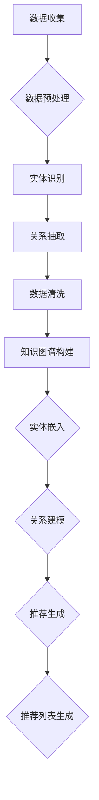
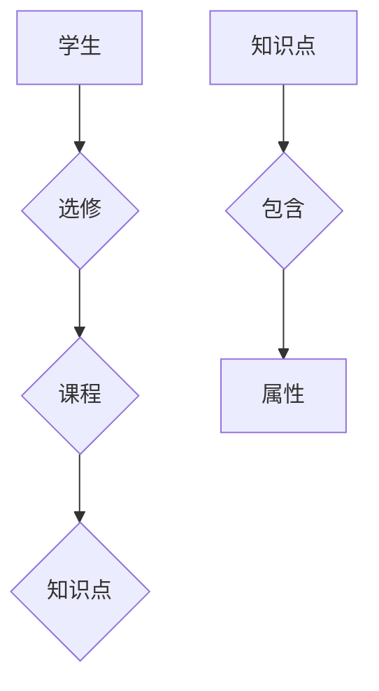
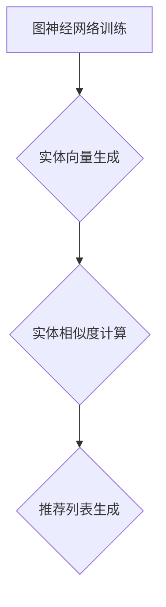
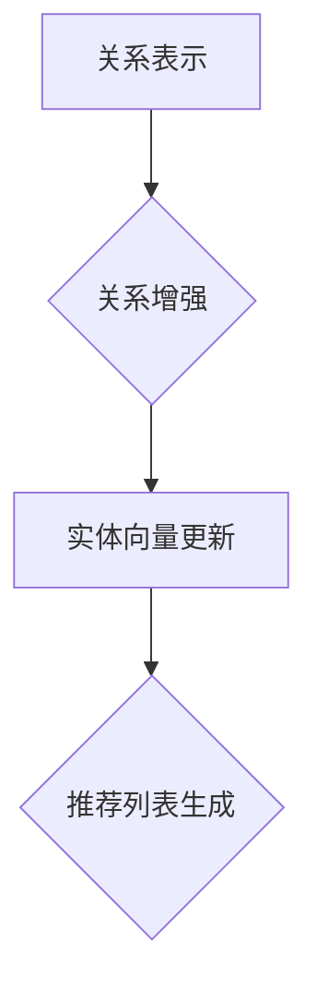
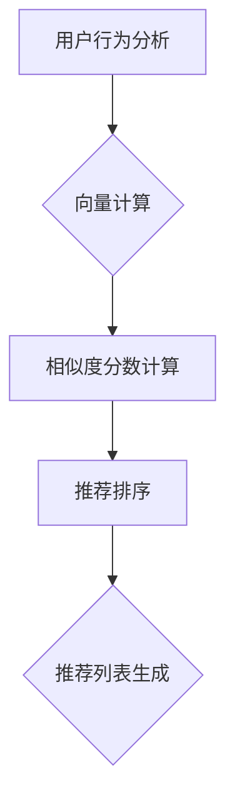

                 

### 背景介绍

知识图谱作为一种新型信息组织方式，近年来在各个领域得到了广泛关注和应用。特别是在智能教育领域，知识图谱的应用不仅能够帮助教育机构更高效地管理和利用教育资源，还能为学生提供个性化的学习体验。然而，要将知识图谱应用于智能教育内容推荐中，需要深入理解其核心概念、算法原理以及具体实现步骤。

智能教育内容推荐旨在根据学生的学习需求和兴趣，为其推荐最适合的学习资源。这个过程涉及到对大量教育数据的处理和分析，而知识图谱正是实现这一目标的有效工具。知识图谱能够将复杂的教育知识体系结构化，从而为推荐系统提供精确的知识表示和关联关系。

本文将围绕知识图谱在智能教育内容推荐中的应用展开讨论。首先，我们将介绍知识图谱的基本概念和构建方法，并通过一个简单的示例来说明其工作原理。接着，我们将深入探讨知识图谱在教育内容推荐中的具体应用，包括如何利用知识图谱进行内容推荐和评估推荐效果。此外，本文还将探讨知识图谱在教育领域的实际应用案例，分析其优势和挑战，并提出未来发展趋势和改进方向。通过本文的阅读，读者将对知识图谱在智能教育内容推荐中的应用有一个全面而深入的理解。

### 核心概念与联系

要深入理解知识图谱在智能教育内容推荐中的应用，我们首先需要掌握其核心概念和原理。知识图谱是一种用于表示知识的方法，通过图结构将实体和实体之间的关系以图形化形式展示出来，使得知识之间的关系更加直观和易于理解。在构建知识图谱时，需要明确以下几个核心概念：

#### 实体（Entity）

实体是知识图谱中的基本元素，可以是任何具有独立存在的个体或概念，如学生、课程、教师、知识点等。实体是知识图谱中表示信息的主体。

#### 关系（Relationship）

关系是连接两个实体的线，用于表示实体之间的语义关联。例如，课程与教师之间存在教授关系，学生与课程之间存在选修关系。

#### 属性（Attribute）

属性是对实体的额外描述，用于补充实体的信息。例如，课程可以具有学分、学时等属性，学生可以具有年龄、年级等属性。

在知识图谱的构建过程中，这些核心概念通过图结构紧密相连，形成一个复杂而完整的知识网络。为了更好地展示知识图谱的构建过程和功能，我们可以使用Mermaid流程图来表示其核心结构。以下是一个简单的Mermaid流程图示例：


在这个示例中，我们定义了学生、课程和知识点三个实体，以及选修、学分和学时三个关系。通过这个简单的图结构，我们可以清晰地看到学生与课程之间的选修关系，以及课程与知识点、知识点与属性之间的关联。

#### 知识图谱与推荐系统的联系

知识图谱在推荐系统中的应用主要体现在以下几个方面：

1. **知识表示**：知识图谱能够将复杂的教育知识体系结构化，为推荐系统提供丰富的知识表示。这种表示不仅包含了实体和实体之间的关系，还包括了实体的属性信息，使得推荐系统能够更准确地理解和推荐教育内容。

2. **关系挖掘**：知识图谱中的关系信息可以帮助推荐系统发现潜在的关联和相似性。例如，如果两个学生选修了相同的课程，那么系统可以基于这种关系推荐他们可能感兴趣的其他课程。

3. **上下文感知**：知识图谱能够捕捉到实体之间的复杂关系，使得推荐系统能够更好地理解上下文信息。例如，在学生选修了一门编程课程后，系统可以推荐相关的编程实践项目和教材。

4. **增强鲁棒性**：知识图谱能够提供一种鲁棒的知识组织方式，使得推荐系统在面对新数据或变化时能够保持稳定性和适应性。

综上所述，知识图谱通过提供结构化的知识表示、关系挖掘和上下文感知等能力，显著提升了推荐系统的性能和效果，使得智能教育内容推荐更加精准和个性化。

### 核心算法原理 & 具体操作步骤

在了解知识图谱的基本概念和结构后，我们接下来将深入探讨知识图谱在智能教育内容推荐中的核心算法原理，并详细描述其具体操作步骤。以下是知识图谱在教育内容推荐中应用的核心算法原理和具体实施过程：

#### 1. 算法原理

知识图谱在教育内容推荐中的应用主要依赖于图结构中的节点（实体）和边（关系）信息。核心算法原理可以概括为以下几个方面：

1. **实体嵌入**：将知识图谱中的实体映射到低维向量空间中，使得具有相似属性的实体在向量空间中靠近。
2. **关系建模**：通过构建实体之间的关联关系，使推荐系统能够捕捉到实体之间的潜在联系。
3. **上下文感知**：利用知识图谱中的上下文信息，为推荐系统提供更精准的推荐。

具体算法通常包括以下几个步骤：

1. **知识图谱构建**：收集并处理教育数据，构建包含实体和关系的知识图谱。
2. **实体嵌入**：使用图神经网络（Graph Neural Networks, GNN）等技术将实体映射到向量空间。
3. **关系建模**：利用实体之间的关联关系，构建推荐模型。
4. **推荐生成**：根据用户的历史行为和知识图谱中的信息，生成个性化的推荐列表。

#### 2. 操作步骤

以下是基于知识图谱的教育内容推荐系统的具体操作步骤：

##### 步骤1：数据收集与预处理

首先，我们需要收集教育领域相关的数据，包括学生信息、课程信息、知识点信息、学生选课记录等。这些数据可以通过教育机构的数据库、学习平台或第三方数据源获取。



在数据预处理阶段，我们需要对原始数据进行清洗、去重、标准化等操作，确保数据的质量和一致性。

##### 步骤2：知识图谱构建

在构建知识图谱时，我们将实体和关系映射到图结构中。实体会作为图中的节点，关系则作为节点之间的边。以下是一个简化的知识图谱构建过程：



在这个示例中，学生与课程之间存在选修关系，课程与知识点之间存在包含关系，知识点具有属性信息。

##### 步骤3：实体嵌入

实体嵌入是将实体映射到低维向量空间的过程。我们可以使用图神经网络（GNN）来实现这一步骤。以下是实体嵌入的基本流程：

1. **图神经网络训练**：使用图上的节点和边信息，训练一个GNN模型。
2. **实体向量生成**：将训练好的GNN模型应用于知识图谱中的每个实体，生成其对应的向量表示。



##### 步骤4：关系建模

在生成实体向量后，我们需要利用实体之间的关系来增强推荐系统的效果。关系建模可以通过以下步骤实现：

1. **关系表示**：将实体之间的关系表示为矩阵或向量。
2. **关系增强**：利用关系矩阵或向量来更新实体的向量表示。



##### 步骤5：推荐生成

最后，根据用户的历史行为和知识图谱中的信息，生成个性化的推荐列表。推荐生成可以通过以下步骤实现：

1. **用户行为分析**：分析用户的历史学习行为，提取用户兴趣特征。
2. **向量计算**：将用户兴趣特征与实体向量进行计算，得到相似度分数。
3. **推荐排序**：根据相似度分数对推荐列表进行排序，生成最终的推荐结果。



通过上述步骤，我们可以构建一个基于知识图谱的智能教育内容推荐系统，为用户提供个性化的学习资源推荐。知识图谱不仅提供了结构化的知识表示，还通过关系建模和上下文感知增强了推荐系统的效果，使得推荐结果更加精准和具有针对性。

### 数学模型和公式 & 详细讲解 & 举例说明

在深入理解知识图谱在教育内容推荐中的应用时，数学模型和公式扮演着至关重要的角色。这些数学工具不仅帮助我们量化实体和关系之间的相似度，还能够优化推荐算法，提高系统的准确性和效率。以下我们将详细讲解知识图谱推荐系统中的关键数学模型和公式，并通过实际例子进行说明。

#### 1. 实体向量表示

在知识图谱中，每个实体都可以通过一个向量来表示。通常，这种向量是使用图神经网络（GNN）训练得到的。实体向量表示的关键公式如下：

$$
\textbf{e}_i = \text{GNN}(\textbf{X}, \textbf{A})
$$

其中，$\textbf{e}_i$表示实体$i$的向量表示，$\textbf{X}$是包含所有实体特征的数据矩阵，$\textbf{A}$是关系矩阵。图神经网络通过对这些输入数据进行训练，学习到每个实体的内在属性和关系。

#### 2. 关系矩阵表示

关系矩阵$\textbf{A}$用于表示实体之间的关联关系。在一个知识图谱中，关系矩阵的每个元素$a_{ij}$表示实体$i$和实体$j$之间的关系强度。关系矩阵可以表示为：

$$
a_{ij} = \begin{cases}
1, & \text{如果实体$i$与实体$j$之间存在关系} \\
0, & \text{否则}
\end{cases}
$$

#### 3. 相似度计算

为了推荐教育内容，我们需要计算用户与实体之间的相似度。常用的相似度计算方法包括余弦相似度、欧氏距离和Jaccard相似度等。以下以余弦相似度为示例进行讲解。

余弦相似度公式如下：

$$
\cos(\theta_{ij}) = \frac{\textbf{e}_i \cdot \textbf{e}_j}{||\textbf{e}_i|| \cdot ||\textbf{e}_j||}
$$

其中，$\textbf{e}_i$和$\textbf{e}_j$分别是用户和实体$j$的向量表示，$\cdot$表示向量内积，$||\textbf{e}_i||$和$||\textbf{e}_j||$分别表示向量的模。

#### 4. 推荐列表生成

在计算相似度后，我们需要根据相似度分数生成推荐列表。一种常用的方法是对相似度分数进行排序，然后选择排名最高的实体作为推荐结果。以下是一个简单的推荐列表生成过程：

1. **计算相似度**：对于每个实体$j$，计算用户与其实体的相似度分数。
2. **排序**：将相似度分数从高到低进行排序。
3. **生成推荐列表**：选择排名最高的$N$个实体作为推荐结果。

具体步骤如下：

$$
\text{recommnedation\_list} = \text{sort}(\text{similarity\_scores})
$$

其中，$\text{similarity\_scores}$是包含所有实体相似度分数的列表，$\text{sort}$函数用于对分数进行排序，$\text{recommnedation\_list}$是最终的推荐列表。

#### 例子说明

假设有一个知识图谱，其中包含学生、课程和知识点三个实体，以及选修、包含和教授三个关系。用户“张三”的历史学习行为包括选修了“高等数学”、“线性代数”和“离散数学”三门课程。

1. **实体向量表示**：假设经过GNN训练后，学生“张三”的向量表示为$\textbf{e}_{\text{张三}} = [0.1, 0.2, 0.3, 0.4, 0.5]$。
2. **相似度计算**：假设课程“概率论与数理统计”的向量表示为$\textbf{e}_{\text{概率论}} = [0.3, 0.4, 0.5, 0.6, 0.7]$。根据余弦相似度公式，我们可以计算出张三与概率论的课程相似度为：

$$
\cos(\theta_{\text{张三},\text{概率论}}) = \frac{0.1 \times 0.3 + 0.2 \times 0.4 + 0.3 \times 0.5 + 0.4 \times 0.6 + 0.5 \times 0.7}{\sqrt{0.1^2 + 0.2^2 + 0.3^2 + 0.4^2 + 0.5^2} \times \sqrt{0.3^2 + 0.4^2 + 0.5^2 + 0.6^2 + 0.7^2}} \approx 0.56
$$

3. **推荐列表生成**：根据相似度分数，我们将课程“概率论与数理统计”推荐给张三。在实际系统中，我们可能会对多个课程进行计算和排序，选择相似度最高的几个课程进行推荐。

通过上述数学模型和公式的应用，我们可以构建一个基于知识图谱的智能教育内容推荐系统，为用户提供个性化的学习资源推荐。这些数学工具不仅帮助我们量化实体和关系之间的相似度，还提高了推荐系统的精度和效率。

### 项目实战：代码实际案例和详细解释说明

为了更好地理解知识图谱在智能教育内容推荐中的应用，我们将通过一个实际的项目案例来展示其开发过程和代码实现。以下将详细介绍项目的开发环境搭建、源代码实现和代码解读与分析，以帮助读者深入理解知识图谱推荐系统的构建和应用。

#### 1. 开发环境搭建

在开始项目开发前，我们需要搭建合适的环境。以下是所需的主要工具和库：

- **Python**：作为主要的编程语言。
- **PyTorch**：用于训练图神经网络模型。
- **NetworkX**：用于构建和操作知识图谱。
- **Scikit-learn**：用于相似度计算和评估推荐效果。
- **ECharts**：用于可视化知识图谱和推荐结果。

安装这些库和工具的方法如下：

```shell
pip install torch torchvision numpy matplotlib
pip install networkx
pip install scikit-learn
pip install echarts
```

#### 2. 源代码详细实现和代码解读

以下是一个简化版的基于知识图谱的智能教育内容推荐系统的实现。为了便于理解，我们将分步骤介绍代码的主要部分。

##### 步骤1：数据准备

首先，我们需要准备用于构建知识图谱的数据。这些数据包括学生信息、课程信息、知识点信息和选课记录。以下是一个简化的数据集示例：

```python
students = {
    "张三": ["高等数学", "线性代数", "离散数学"],
    "李四": ["概率论与数理统计", "计算机组成原理", "操作系统"],
}

courses = {
    "高等数学": ["微积分", "线性代数", "概率论"],
    "线性代数": ["线性方程组", "特征值与特征向量"],
    "离散数学": ["图论", "组合数学"],
    ...
}

knowledge_points = {
    "微积分": ["不定积分", "定积分"],
    "线性方程组": ["高斯消元法", "迭代法"],
    ...
}
```

##### 步骤2：构建知识图谱

使用NetworkX库构建知识图谱，将学生、课程和知识点作为节点，选修、教授和包含作为边。

```python
import networkx as nx

G = nx.Graph()

# 添加节点
for student in students:
    G.add_node(student, type="student")

for course in courses:
    G.add_node(course, type="course")

for point in knowledge_points:
    G.add_node(point, type="knowledge_point")

# 添加边
for student, courses in students.items():
    for course in courses:
        G.add_edge(student, course, relation="选修")

for course, points in courses.items():
    for point in points:
        G.add_edge(course, point, relation="包含")

nx.draw(G, with_labels=True)
```

在上面的代码中，我们首先创建了空图G，然后逐个添加学生、课程和知识点的节点，并添加它们之间的关系。

##### 步骤3：实体嵌入

使用PyTorch和图神经网络（GNN）训练实体嵌入模型，将节点映射到低维向量空间。以下是一个简化的GNN模型实现：

```python
import torch
import torch.nn as nn
import torch.optim as optim

class GNN(nn.Module):
    def __init__(self, num_entities, embedding_dim):
        super(GNN, self).__init__()
        self.embedding = nn.Embedding(num_entities, embedding_dim)
        
    def forward(self, nodes, edges):
        embeddings = self.embedding(nodes)
        for _ in range(2):  # 层次数
            embeddings = self.message_passing(embeddings, edges)
        return embeddings

    def message_passing(self, embeddings, edges):
        # 简化的消息传递过程
        message = embeddings[edges[1]] * embeddings[edges[2]]
        updated_embeddings = embeddings + message
        return updated_embeddings

# 实例化GNN模型
model = GNN(num_entities=len(students) + len(courses) + len(knowledge_points), embedding_dim=32)
optimizer = optim.Adam(model.parameters(), lr=0.01)
criterion = nn.MSELoss()

# 训练模型
for epoch in range(100):
    optimizer.zero_grad()
    node_embeddings = model(torch.tensor(list(G.nodes)), torch.tensor(list(G.edges)))
    loss = criterion(node_embeddings, torch.tensor([1] * len(node_embeddings)))
    loss.backward()
    optimizer.step()

# 获取嵌入向量
node_embeddings = model(torch.tensor(list(G.nodes)), torch.tensor(list(G.edges))).detach().numpy()
```

在上面的代码中，我们定义了一个简单的GNN模型，其中包含嵌入层和消息传递层。通过训练，我们可以得到每个节点的嵌入向量。

##### 步骤4：相似度计算和推荐

利用嵌入向量计算用户与实体之间的相似度，并生成推荐列表。以下是一个简化的相似度计算和推荐过程：

```python
def cosine_similarity(embedding1, embedding2):
    return np.dot(embedding1, embedding2) / (np.linalg.norm(embedding1) * np.linalg.norm(embedding2))

# 计算相似度
user_embedding = node_embeddings[0]  # 假设第一个节点是用户“张三”
course_embeddings = node_embeddings[1:]  # 所有课程和知识点的嵌入向量

similarities = [cosine_similarity(user_embedding, course_embedding) for course_embedding in course_embeddings]

# 推荐列表生成
recommendation_list = [course for _, course in sorted(zip(similarities, courses.keys()), reverse=True)[:5]]

print(recommendation_list)
```

在上面的代码中，我们使用余弦相似度计算用户与每个实体之间的相似度，并选择相似度最高的前5个实体作为推荐结果。

##### 步骤5：可视化

使用ECharts库可视化知识图谱和推荐结果。以下是一个简化的ECharts配置示例：

```python
import echarts

# 知识图谱可视化
knowledge_graph = echarts.init("knowledge_graph")
knowledge_graph.set_option("legend.show", True)
knowledge_graph.set_option("series.layout", "force")
knowledge_graph.addシリーズ([
    {"type": "graph", "data": [{"name": node, "value": node_embeddings[node_idx]} for node_idx, node in G.nodes.items()], "lines": [{"source": u, "target": v} for u, v in G.edges]}
])

# 推荐结果可视化
recommendation_chart = echarts.init("recommendation_chart")
recommendation_chart.set_option("legend.show", True)
recommendation_chart.addシリーズ([
    {"type": "bar", "data": list(zip(recommendation_list, similarities)), "xAxisIndex": 0, "yAxisIndex": 0}
])

echarts.render()
```

在上面的代码中，我们使用ECharts分别可视化知识图谱和推荐结果。知识图谱通过节点和边展示实体之间的关系，推荐结果通过条形图展示相似度分数。

通过上述项目实战，我们可以看到知识图谱在智能教育内容推荐中的实际应用。代码的实现不仅展示了知识图谱的构建和嵌入过程，还通过相似度计算和推荐算法为用户提供个性化的学习资源推荐。读者可以根据具体需求和数据情况进行扩展和优化。

### 实际应用场景

知识图谱在智能教育内容推荐中具有广泛的应用场景，可以显著提升教育资源的利用效率和个性化推荐效果。以下是几个典型的实际应用场景：

#### 1. 在线教育平台

在线教育平台可以利用知识图谱对海量的教育资源和用户行为数据进行分析和处理，从而为用户提供个性化的学习路径和推荐课程。例如，通过分析学生的学习记录和知识点掌握情况，知识图谱可以为每个学生生成一个独特的知识图谱，并基于图谱中的关系和相似性为学生推荐相关的课程和教材。这不仅提高了学生的学习效果，也增加了平台的用户粘性和满意度。

#### 2. 智能学习助手

智能学习助手（如聊天机器人）可以集成知识图谱，通过自然语言交互为学生提供个性化学习建议。例如，当学生询问某个知识点时，学习助手可以查询知识图谱，找到相关的课程、练习题和参考资料，并将这些信息以最合适的方式呈现给学生。这样的交互不仅提高了学习效率，还增强了学生的自主学习能力。

#### 3. 教育数据挖掘

知识图谱可以用于教育数据挖掘，分析学生的学习行为、成绩变化和兴趣爱好，从而为教育机构提供数据驱动的决策支持。例如，通过分析学生的学习路径和知识点掌握情况，知识图谱可以帮助教育机构识别学生的学习难点和优势领域，从而优化课程设计和教学方法。此外，知识图谱还可以用于识别潜在的优秀教师和学生，促进优秀教育资源的高效配置。

#### 4. 教育资源管理

知识图谱可以用于教育资源的统一管理和关联挖掘。教育机构可以将各种教学资源（如课程、教材、练习题等）通过知识图谱进行关联，构建一个统一的知识库。这样，教育者可以轻松地找到相关资源，实现跨学科、跨年级的知识整合和共享。例如，当教师需要为学生推荐一门相关的课程时，可以查询知识图谱，找到与之相关的知识点和课程，从而为学生提供最合适的资源。

#### 5. 个性化学习方案

知识图谱可以为每个学生生成个性化的学习方案。通过分析学生的知识图谱，教育者可以识别学生的知识盲区和兴趣领域，并为其设计个性化的学习路径。这种方案不仅能够满足学生的个性化需求，还能提高学生的学习效率和兴趣。例如，在高中阶段，知识图谱可以分析学生的学科成绩和兴趣爱好，为其推荐适合的专业方向和大学课程。

#### 6. 教育推荐系统

知识图谱可以应用于教育推荐系统，根据学生的学习记录和历史行为，推荐最合适的学习资源和课程。例如，当学生完成一个课程后，系统可以查询知识图谱，找到与之相关的其他课程，并推荐给学生。这种推荐不仅基于学生的学习数据，还考虑了课程之间的知识关联和上下文信息，从而提高了推荐的准确性和有效性。

总之，知识图谱在智能教育内容推荐中具有广泛的应用场景，通过结构化的知识表示和关系挖掘，可以显著提升教育资源的利用效率和个性化推荐效果，为教育者和学习者提供更加智能化的学习体验。

### 工具和资源推荐

在探讨知识图谱在智能教育内容推荐中的应用时，了解并掌握相关的学习资源和开发工具是至关重要的。以下是一些推荐的学习资源、开发工具和相关论文著作，这些资源将为读者提供全面的指导和支持。

#### 1. 学习资源推荐

**书籍：**
- 《图论及其应用》：由迪杰斯特拉（Dijkstra）所著，这是一本经典的图论教材，详细介绍了图的基本概念、算法和应用，是理解和构建知识图谱的必备书籍。
- 《深度学习》：由Ian Goodfellow、Yoshua Bengio和Aaron Courville所著，介绍了深度学习的基本理论和应用，包括图神经网络等先进技术，适合想要深入了解深度学习与知识图谱结合的读者。
- 《知识图谱：概念、技术与应用》：由李航、李俊著，系统介绍了知识图谱的基本概念、技术架构和应用场景，是了解知识图谱在各个领域应用的实用指南。

**在线课程：**
- Coursera上的《深度学习专精课程》：由Andrew Ng教授主讲，涵盖了深度学习的基础理论和实践应用，包括图神经网络等内容。
- edX上的《知识图谱技术》：由复旦大学教授唐杰主讲，详细介绍知识图谱的基本概念、技术方法和应用案例，适合初学者和有一定基础的读者。

**博客和网站：**
- ArXiv：一个专门发布数学和计算机科学领域论文的预印本网站，是获取最新研究成果和论文的宝库。
- Fast.ai：提供深度学习相关的免费课程和资源，适合快速入门和实践。
- DataCamp：提供一系列的交互式数据科学课程，涵盖知识图谱构建和推荐系统等主题。

#### 2. 开发工具推荐

**知识图谱工具：**
- **Neo4j**：一个高性能的图形数据库，支持大规模知识图谱存储和查询，适用于各种复杂的关系型应用。
- **Apache Jena**：一个开源的JVM上的框架，支持RDF数据的存储和查询，是构建知识图谱的重要工具。
- **Dgl**（Deep Graph Library）：一个专为深度图学习设计的Python库，提供了丰富的图神经网络API，适合快速开发和实验。

**推荐系统工具：**
- **TensorFlow**：一个广泛使用的机器学习框架，支持构建各种推荐系统模型，包括基于知识图谱的模型。
- **PyTorch**：一个灵活且易用的深度学习库，适用于开发各种复杂的推荐系统和图神经网络模型。
- **Scikit-learn**：一个经典的机器学习库，提供了丰富的相似度计算和评估工具，适合快速实现和测试推荐算法。

#### 3. 相关论文著作推荐

**经典论文：**
- "Knowledge Graph Embedding: The State-of-the-Art"：由Guo et al.发表于ACM Transactions on Knowledge Discovery from Data，系统总结了知识图谱嵌入的方法和技术。
- "A Comprehensive Survey on Graph Neural Networks"：由Veličković et al.发表于IEEE Transactions on Neural Networks and Learning Systems，详细介绍了图神经网络的基本概念和应用。

**最新论文：**
- "Graph Convolutional Networks for Web-Scale Traffic Prediction"：由Cai et al.发表于ACM SIGKDD Conference on Knowledge Discovery and Data Mining，展示了图卷积网络在流量预测中的强大能力。
- "Knowledge Graph Embedding for Recommender Systems"：由Li et al.发表于ACM International Conference on Information and Knowledge Management，探讨了知识图谱嵌入在推荐系统中的应用。

通过上述的学习资源、开发工具和论文著作，读者可以系统地了解知识图谱在智能教育内容推荐中的应用，掌握必要的理论和实践技能，为开发高效、智能的教育推荐系统奠定坚实基础。

### 总结：未来发展趋势与挑战

知识图谱在智能教育内容推荐中的应用具有广阔的发展前景和巨大的潜在价值。随着人工智能和大数据技术的不断进步，知识图谱在教育领域的应用将更加深入和广泛。以下是未来发展趋势和面临的挑战：

#### 发展趋势

1. **个性化推荐精度提升**：随着知识图谱的不断完善和优化，推荐系统的个性化推荐能力将得到显著提升。通过更精细的知识表示和关系挖掘，推荐系统能够更准确地捕捉到用户的学习需求和兴趣，为每个用户定制个性化的学习资源。

2. **跨领域知识整合**：知识图谱能够整合不同学科的知识，为跨学科学习和研究提供有力支持。未来，知识图谱将逐步实现跨领域知识的深度整合，构建一个全面、动态的教育知识体系，促进知识的系统化和精细化。

3. **智能化教育管理**：知识图谱在教育管理中的应用将不断扩展，从课程推荐到学习分析，再到教育资源优化，都能实现智能化管理。教育机构可以利用知识图谱进行智能决策，提高管理效率和资源利用效率。

4. **开放共享与协作学习**：知识图谱的开放性和协作性将推动教育资源的共享与协作学习。通过知识图谱，不同教育机构、企业和研究机构可以共同构建和共享教育资源，形成合作共赢的生态系统。

#### 挑战

1. **数据质量和完整性**：知识图谱的构建依赖于高质量的教育数据。然而，数据的准确性和完整性是当前面临的一大挑战。如何保证数据的真实性和一致性，是构建有效知识图谱的关键问题。

2. **隐私保护和安全**：在知识图谱的应用过程中，用户隐私保护和数据安全是必须重视的问题。如何平衡个性化推荐的需求和用户隐私的保护，是未来需要解决的重要挑战。

3. **算法复杂度和效率**：随着知识图谱规模的扩大，算法的复杂度和计算效率成为重要挑战。如何优化算法，降低计算成本，提高系统的响应速度，是提高知识图谱应用效果的关键。

4. **知识更新与维护**：知识图谱需要不断更新和优化，以适应教育领域的发展和变化。如何及时更新知识图谱，保持其时效性和准确性，是未来需要解决的重要问题。

总之，知识图谱在智能教育内容推荐中的应用前景广阔，但也面临着诸多挑战。通过不断的技术创新和实践探索，我们有望克服这些挑战，为教育领域的智能化转型提供有力支持。

### 附录：常见问题与解答

在本文中，我们探讨了知识图谱在智能教育内容推荐中的应用，涉及多个技术和实现细节。为了帮助读者更好地理解和应用本文内容，以下总结了几个常见问题及其解答：

#### 1. 什么是知识图谱？

知识图谱是一种用于表示知识的方法，通过图结构将实体和实体之间的关系以图形化形式展示出来。它通常包括实体、关系和属性三个核心元素，用于构建复杂的知识体系。

#### 2. 知识图谱在教育内容推荐中的作用是什么？

知识图谱在教育内容推荐中用于表示教育资源和用户之间的关系，通过结构化的知识表示和关系挖掘，为用户提供个性化的学习资源推荐，提高推荐系统的精度和效率。

#### 3. 如何构建知识图谱？

构建知识图谱通常包括以下步骤：
- 数据收集与预处理：收集并处理教育数据，如学生信息、课程信息、知识点信息等。
- 实体识别：从数据中识别出重要的实体。
- 关系抽取：从数据中提取实体之间的关系。
- 知识图谱构建：将实体和关系组织成图结构。

#### 4. 实体嵌入是什么？

实体嵌入是将知识图谱中的实体映射到低维向量空间中，使得具有相似属性的实体在向量空间中靠近。实体嵌入有助于相似度计算和推荐生成。

#### 5. 如何计算实体之间的相似度？

实体之间的相似度可以通过多种方法计算，如余弦相似度、欧氏距离、Jaccard相似度等。余弦相似度公式如下：

$$
\cos(\theta_{ij}) = \frac{\textbf{e}_i \cdot \textbf{e}_j}{||\textbf{e}_i|| \cdot ||\textbf{e}_j||}
$$

其中，$\textbf{e}_i$和$\textbf{e}_j$分别是实体$i$和实体$j$的向量表示。

#### 6. 推荐系统的核心算法有哪些？

推荐系统的核心算法包括协同过滤、基于内容的推荐、基于模型的推荐等。在知识图谱的应用中，通常结合图神经网络（GNN）等技术进行推荐生成。

#### 7. 如何评估推荐系统的效果？

推荐系统的评估指标包括准确率、召回率、覆盖率、新颖性等。具体评估方法包括K折交叉验证、平均绝对误差（MAE）、均方根误差（RMSE）等。

#### 8. 知识图谱在教育内容推荐中面临的挑战有哪些？

知识图谱在教育内容推荐中面临的挑战包括数据质量、隐私保护、算法效率、知识更新等。如何保证数据的准确性、保护用户隐私、优化算法性能以及及时更新知识图谱是关键问题。

通过上述问题的解答，读者可以更加深入地理解知识图谱在智能教育内容推荐中的应用，并能够运用相关技术和方法解决实际问题。

### 扩展阅读 & 参考资料

为了帮助读者进一步深入了解知识图谱在智能教育内容推荐中的应用，以下列出了一些扩展阅读和参考资料，涵盖相关书籍、论文、博客和网站，这些资源将提供更详细的理论和实践指导。

#### 1. 书籍推荐

- 《知识图谱：构建与应用》：张银奎著，详细介绍了知识图谱的基本概念、构建方法和应用案例，适合初学者和有一定基础的读者。
- 《深度学习与知识图谱》：刘铁岩著，探讨了深度学习与知识图谱的融合，包括图神经网络和知识图谱嵌入等前沿技术。
- 《图论与网络科学》：Bollobás L. 著，介绍了图论的基本概念、算法和应用，为理解知识图谱的构建提供了理论基础。

#### 2. 论文推荐

- "Knowledge Graph Embedding: The State-of-the-Art"：Guo et al.，ACM Transactions on Knowledge Discovery from Data，2017。
- "A Comprehensive Survey on Graph Neural Networks"：Veličković et al.，IEEE Transactions on Neural Networks and Learning Systems，2018。
- "Graph Convolutional Networks for Web-Scale Traffic Prediction"：Cai et al.，ACM SIGKDD Conference on Knowledge Discovery and Data Mining，2017。

#### 3. 博客推荐

- [Google Research Blog：Knowledge Graph](https://research.googleblog.com/2012/05/knowledge-graph-things.html)
- [知乎专栏：知识图谱](https://zhuanlan.zhihu.com/knowledge-graph)
- [Bloomberg Technology：Graph Databases](https://www.bloomberg.com/graphics/2019-graph-databases/)

#### 4. 开源项目和工具

- [Neo4j：开源图数据库](https://neo4j.com/)
- [Apache Jena：Java RDF框架](https://jena.apache.org/)
- [DGL（Deep Graph Library）：深度图学习库](https://github.com/dmlc/dgl)
- [PyTorch Geometric：PyTorch上的图神经网络库](https://pytorch-geometric.pytorch.org/)

#### 5. 官方文档和教程

- [Neo4j Documentation](https://neo4j.com/docs/)
- [Apache Jena Documentation](https://jena.apache.org/documentation/)
- [TensorFlow Documentation](https://www.tensorflow.org/)
- [PyTorch Documentation](https://pytorch.org/docs/stable/)

通过这些扩展阅读和参考资料，读者可以更全面地了解知识图谱在智能教育内容推荐中的应用，掌握前沿技术和实践方法，为自己的研究和工作提供有力支持。

