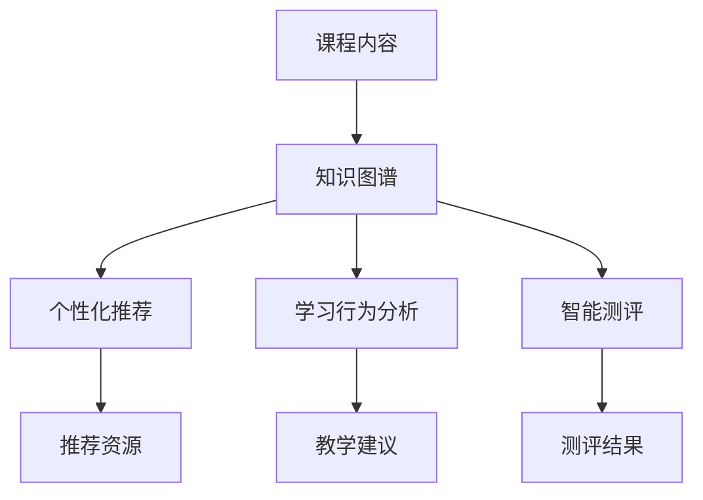

                 

### 1. 背景介绍

随着人工智能技术的迅猛发展，知识图谱作为其重要分支，已经在各个领域展现出了强大的应用潜力。在教育领域，知识图谱的应用正逐渐成为智能化教育系统研究的热点。知识图谱（Knowledge Graph，KG）是一种用于表示实体及其相互关系的网络结构，通过语义化的方式将海量的信息组织起来，从而实现信息的高效检索与利用。知识图谱在教育中的应用，不仅可以提升教育资源的利用率，还能为学生提供个性化的学习体验。

智能教育系统是指利用现代信息技术，特别是人工智能技术，对教育教学过程进行智能化管理和优化，以实现教育质量的提升和教育效率的提高。智能教育系统通常包括在线学习平台、智能测评、个性化推荐、学习行为分析等功能。这些功能共同构成了一个闭环系统，能够实时监控学生的学习状态，提供针对性的学习资源，并根据学生的学习反馈进行动态调整。

本文旨在探讨知识图谱在智能教育系统中的应用研究，通过梳理相关理论、技术方法以及实际案例，分析知识图谱如何助力智能教育系统的建设与发展。本文的主要内容包括：

- **背景介绍**：介绍知识图谱和智能教育系统的基本概念、发展历程及其重要性。
- **核心概念与联系**：阐述知识图谱在教育系统中的核心概念及其相互关系，并使用Mermaid流程图进行可视化展示。
- **核心算法原理与具体操作步骤**：详细介绍知识图谱构建的基本算法及其在实际应用中的具体操作步骤。
- **数学模型和公式**：介绍与知识图谱相关的数学模型和公式，并进行详细讲解和举例说明。
- **项目实战**：通过实际案例，展示知识图谱在智能教育系统中的具体实现过程，包括开发环境搭建、源代码实现和代码解读。
- **实际应用场景**：分析知识图谱在智能教育系统中的实际应用场景，如个性化推荐、学习行为分析等。
- **工具和资源推荐**：推荐相关学习资源、开发工具和框架，以帮助读者深入了解知识图谱在智能教育系统中的应用。
- **总结与未来展望**：总结知识图谱在智能教育系统中的应用现状，分析未来的发展趋势与挑战。

通过本文的研究，希望能够为智能教育系统的设计与实施提供有益的参考，推动知识图谱在教育领域的深入应用。

### 2. 核心概念与联系

#### 2.1 知识图谱的定义

知识图谱（Knowledge Graph，KG）是一种用于表示实体及其相互关系的网络结构。它通过语义化的方式将海量的信息组织起来，使得计算机能够更好地理解和处理这些信息。知识图谱的核心在于其语义表示，它不仅能够表示实体本身，还能表示实体之间的复杂关系。

在知识图谱中，实体（Entity）是知识图谱的基本构建块，可以是人、地点、事物、概念等。例如，“张三”、“清华大学”、“苹果手机”等都是实体。属性（Attribute）则用于描述实体的特征，如“张三的年龄是25岁”、“清华大学的校长是王教授”、“苹果手机的颜色是红色”。关系（Relation）则用于描述实体之间的相互作用，如“张三毕业于清华大学”、“清华大学位于北京市”、“苹果手机由苹果公司生产”。

知识图谱通过这些实体、属性和关系，形成了一个语义化的网络结构。这种结构使得计算机能够更加高效地处理和利用信息，从而实现智能化的信息检索、推理和决策。

#### 2.2 智能教育系统的基本概念

智能教育系统是一种基于现代信息技术，特别是人工智能技术，对教育教学过程进行智能化管理和优化的系统。它通常包括以下几个核心功能：

1. **在线学习平台**：提供在线课程和学习资源，支持学生自主学习。
2. **智能测评**：通过人工智能技术，对学生进行智能化的测评，提供个性化的学习报告。
3. **个性化推荐**：根据学生的学习行为和偏好，推荐适合的学习资源和课程。
4. **学习行为分析**：通过分析学生的学习行为数据，了解学生的学习状态和需求，为教学提供数据支持。

#### 2.3 知识图谱在教育系统中的应用

知识图谱在教育系统中的应用，主要体现在以下几个方面：

1. **课程内容组织**：知识图谱可以将课程内容以语义化的方式组织起来，使得教师和学生能够更加高效地获取和利用相关资源。
2. **个性化推荐**：通过分析学生的学习行为和课程知识，知识图谱可以为学生推荐个性化的学习资源和课程，提高学习效率。
3. **学习行为分析**：知识图谱可以记录和分析学生的学习行为数据，为教师提供有针对性的教学建议。
4. **智能测评**：知识图谱可以辅助智能测评系统，通过对学生学习过程的实时监控和数据分析，提供更加准确和全面的测评结果。

#### 2.4 Mermaid流程图展示

为了更好地展示知识图谱在教育系统中的应用，我们可以使用Mermaid流程图进行可视化展示。以下是一个简化的知识图谱在教育系统中的应用流程图：



在这个流程图中，课程内容被组织到知识图谱中，知识图谱则作为核心组件，为个性化推荐、学习行为分析和智能测评等功能提供支持。通过这个流程图，我们可以清晰地看到知识图谱在教育系统中的核心作用和各个功能模块之间的联系。

### 3. 核心算法原理与具体操作步骤

#### 3.1 知识图谱的构建算法

知识图谱的构建是知识图谱应用的基础，其核心在于如何将结构化数据和非结构化数据转化为语义化的网络结构。下面介绍几种常用的知识图谱构建算法：

1. **实体识别与抽取**：实体识别是指从文本数据中识别出具有特定意义的实体。实体抽取则是从原始数据中提取出具体的实体信息。常见的实体识别与抽取算法包括基于规则的方法、基于统计的方法和基于深度学习的方法。

2. **关系抽取**：关系抽取是指从文本数据中识别出实体之间的相互关系。与实体识别类似，关系抽取也有基于规则的方法、基于统计的方法和基于深度学习的方法。常用的关系抽取算法包括命名实体识别（NER）、依存句法分析（Dependence Parsing）和监督学习方法等。

3. **实体与关系的融合**：在构建知识图谱时，需要将识别出的实体和关系进行融合，形成一个语义化的网络结构。常用的融合方法包括图论方法、语义网络模型和图嵌入方法等。

#### 3.2 知识图谱构建的具体操作步骤

1. **数据采集**：首先，需要采集相关的数据源，包括结构化数据（如数据库）和非结构化数据（如文本、图片、视频等）。数据采集可以采用Web爬虫、API接口、手动标注等方式。

2. **数据预处理**：对采集到的数据进行处理，包括数据清洗、去重、格式转换等。数据预处理是构建知识图谱的重要环节，直接影响到知识图谱的质量和效果。

3. **实体识别与抽取**：利用实体识别与抽取算法，从预处理后的数据中识别出实体和关系。这一步可以使用预训练的深度学习模型，如BERT、GPT等，也可以使用基于规则和统计的方法。

4. **实体与关系的融合**：将识别出的实体和关系进行融合，形成一个语义化的网络结构。这一步可以使用图论方法，如图遍历、图分解等，也可以使用语义网络模型，如WordNet、Freebase等。

5. **知识图谱存储与管理**：将构建好的知识图谱存储到数据库中，并进行管理。常用的知识图谱存储和管理系统包括Neo4j、OrientDB、GraphDB等。

#### 3.3 实际案例

为了更好地理解知识图谱的构建过程，我们以一个实际案例——构建一个简单的图书知识图谱为例，介绍具体的操作步骤。

1. **数据采集**：首先，需要采集图书相关的数据源，包括图书的标题、作者、出版社、出版日期、分类等信息。这些数据可以来自电商平台、图书馆数据库等。

2. **数据预处理**：对采集到的数据进行清洗和格式转换，例如将日期格式统一为YYYY-MM-DD，将分类进行标准化处理等。

3. **实体识别与抽取**：利用实体识别与抽取算法，从预处理后的数据中识别出实体（如图书、作者、出版社等）和关系（如“ authored by”、“published by”等）。

4. **实体与关系的融合**：将识别出的实体和关系进行融合，形成一个简单的知识图谱。例如，将同一本书的所有信息连接起来，形成一个完整的图书实体。

5. **知识图谱存储与管理**：将构建好的知识图谱存储到Neo4j数据库中，并进行管理。可以使用Neo4j的Cypher查询语言进行知识图谱的查询和分析。

通过这个实际案例，我们可以看到知识图谱构建的核心步骤和操作流程。在实际应用中，知识图谱的构建需要根据具体的应用场景和数据特点进行定制化处理，以达到最佳的效果。

### 4. 数学模型和公式

在知识图谱的构建与应用过程中，涉及多种数学模型和公式。以下将介绍几种核心的数学模型和公式，并进行详细讲解和举例说明。

#### 4.1 图嵌入（Graph Embedding）

图嵌入是一种将图中的节点映射到低维度的向量空间的方法，使得图中的节点能够在向量空间中保持原有的结构关系。常见的图嵌入方法包括基于矩阵分解的方法和基于深度学习的方法。

- **基于矩阵分解的方法**：例如，使用矩阵分解算法（如Singular Value Decomposition，SVD）将图中的邻接矩阵分解为多个低秩矩阵，从而实现节点向量的表示。

  公式：\( \mathbf{A} = \mathbf{U}\mathbf{S}\mathbf{V}^T \)
  
  其中，\( \mathbf{A} \) 是邻接矩阵，\( \mathbf{U} \)、\( \mathbf{S} \) 和 \( \mathbf{V} \) 分别是分解得到的矩阵。

- **基于深度学习的方法**：例如，使用图神经网络（Graph Neural Network，GNN）来学习节点的嵌入向量。图卷积网络（Graph Convolutional Network，GCN）是GNN的一种常见实现。

  公式：\( h_{v}^{(l+1)} = \sigma \left( \sum_{u \in \mathcal{N}(v)} \omega \cdot \frac{h_{u}^{(l)}}{\sqrt{k_u}} + b \right) \)
  
  其中，\( h_{v}^{(l+1)} \) 是第 \( l+1 \) 层节点 \( v \) 的嵌入向量，\( \mathcal{N}(v) \) 是节点 \( v \) 的邻域，\( \omega \) 和 \( b \) 分别是权重和偏置，\( \sigma \) 是激活函数。

#### 4.2 邻接矩阵表示（Adjacency Matrix Representation）

邻接矩阵是一种用于表示图中节点关系的数学工具，其中 \( A_{ij} \) 表示节点 \( i \) 和节点 \( j \) 之间的边是否存在。对于无向图，邻接矩阵是对称的；对于有向图，邻接矩阵通常不是对称的。

公式：\( A = [A_{ij}] \)

其中，\( A \) 是邻接矩阵，\( A_{ij} \) 是节点 \( i \) 和节点 \( j \) 之间的边的权重（对于无向图，\( A_{ij} = 1 \) 表示存在边，\( A_{ij} = 0 \) 表示不存在边）。

#### 4.3 知识图谱中的路径搜索算法（Graph Path Search Algorithm）

在知识图谱中，路径搜索是一种常见的查询操作。例如，给定源节点 \( s \) 和目标节点 \( t \)，需要找到从 \( s \) 到 \( t \) 的最短路径。

- **Dijkstra算法**：用于求解图中单源最短路径问题。

  公式：\( d[s] = 0, d[v] = \infty \)

  对于每个未访问的节点 \( v \)，更新 \( d[v] \) 为 \( \min \{ d[u] + w(u, v) | u \in \mathcal{N}(v) \} \)。

- **A*算法**：是Dijkstra算法的改进版本，利用启发式函数 \( h(v) \) 估计从节点 \( v \) 到目标节点的距离。

  公式：\( f[v] = d[v] + h[v] \)

  选择 \( v \) 使得 \( f[v] \) 最小，并更新其邻居节点。

#### 4.4 举例说明

假设有一个简单的有向图，节点和边的关系如下：

```
A --1--> B
|  ^  |
|  |  |
1 v  v 1
C --1--> D
```

- **邻接矩阵表示**：

  \[
  A = \begin{bmatrix}
  0 & 1 & 0 & 0 \\
  1 & 0 & 1 & 1 \\
  0 & 1 & 0 & 0 \\
  0 & 0 & 1 & 0
  \end{bmatrix}
  \]

- **Dijkstra算法求从A到D的最短路径**：

  初始时，所有节点的距离设为无穷大，除了源节点A的距离设为0。

  \[
  \begin{aligned}
  d[A] &= 0, \\
  d[B] &= \infty, \\
  d[C] &= \infty, \\
  d[D] &= \infty.
  \end{aligned}
  \]

  更新过程：

  - 选择 \( v = A \)，更新 \( d[B] = d[A] + w(A, B) = 0 + 1 = 1 \)。
  - 选择 \( v = B \)，更新 \( d[C] = d[B] + w(B, C) = 1 + 1 = 2 \)，\( d[D] = d[B] + w(B, D) = 1 + 1 = 2 \)。
  - 选择 \( v = C \)，更新 \( d[D] = d[C] + w(C, D) = 2 + 1 = 3 \)。
  - 选择 \( v = D \)，最终 \( d[D] = 3 \)。

  因此，从A到D的最短路径是 \( A \rightarrow B \rightarrow C \rightarrow D \)，路径长度为3。

通过这些数学模型和公式的介绍，我们可以看到知识图谱构建和应用过程中的关键数学原理和算法。在实际应用中，这些数学工具对于优化知识图谱的性能和效果具有重要意义。

### 5. 项目实战：代码实际案例和详细解释说明

在本节中，我们将通过一个具体的代码案例，详细展示如何在实际项目中构建和应用知识图谱，以实现智能教育系统的功能。

#### 5.1 开发环境搭建

首先，我们需要搭建一个合适的开发环境。以下是一个基本的开发环境配置：

- **操作系统**：Ubuntu 20.04 LTS
- **编程语言**：Python 3.8
- **数据库**：Neo4j 4.0
- **开发工具**：PyCharm

安装步骤如下：

1. **安装Neo4j**：

   下载Neo4j的社区版，并按照官方文档进行安装。

2. **安装Python和Neo4j驱动**：

   ```bash
   pip install neo4j
   ```

3. **配置Neo4j连接**：

   在PyCharm中创建一个Python项目，并在项目中创建一个名为`config.py`的配置文件，配置Neo4j的连接参数：

   ```python
   neo4j_url = "bolt://localhost:7687"
   neo4j_user = "neo4j"
   neo4j_password = "your_password"
   ```

#### 5.2 源代码详细实现和代码解读

以下是构建知识图谱的Python代码，包括数据采集、实体识别与抽取、实体与关系的融合以及知识图谱的存储和管理。

```python
import neo4j
import pandas as pd
from text2vec import Text2Vec

# 连接到Neo4j数据库
driver = neo4j.GraphDatabase.driver(neo4j_url, auth=(neo4j_user, neo4j_password))

# 数据采集
# 这里假设我们已经有一个CSV文件，包含图书的标题、作者、出版社、出版日期等信息
books_df = pd.read_csv("books.csv")

# 实体识别与抽取
# 使用Text2Vec进行文本向量化，用于实体识别
text2vec = Text2Vec()
text2vec.train(books_df["title"])

# 实体与关系的融合
def create_nodes_and_relations(books_df):
    with driver.session() as session:
        for index, row in books_df.iterrows():
            # 创建图书节点
            book_node = session.run("CREATE (book:Book {title: $title, author: $author, publisher: $publisher, published_date: $published_date}) RETURN book", 
                                    title=row["title"], author=row["author"], publisher=row["publisher"], published_date=row["published_date"])
            
            # 创建作者节点，如果作者不存在，则创建
            author_node = session.run("MERGE (a:Author {name: $name}) RETURN a", name=row["author"])
            session.run("MATCH (book), (a) WHERE book.author = a.name SET book.author = a")

            # 创建出版社节点，如果出版社不存在，则创建
            publisher_node = session.run("MERGE (p:Publisher {name: $name}) RETURN p", name=row["publisher"])
            session.run("MATCH (book), (p) WHERE book.publisher = p.name SET book.publisher = p")

            # 建立图书和作者的关系
            session.run("MATCH (book), (a) WHERE book.author = a.name CREATE (book)-[:AUTHORED_BY]->(a)")

            # 建立图书和出版社的关系
            session.run("MATCH (book), (p) WHERE book.publisher = p.name CREATE (book)-[:PUBLISHED_BY]->(p)")

create_nodes_and_relations(books_df)

# 关闭数据库连接
driver.close()
```

代码解读：

1. **连接Neo4j数据库**：使用`neo4j.GraphDatabase.driver`方法连接到Neo4j数据库。

2. **数据采集**：使用`pandas`库读取CSV文件中的图书数据。

3. **实体识别与抽取**：使用`Text2Vec`库进行文本向量化，从而实现图书标题的实体识别。

4. **实体与关系的融合**：通过`session.run`方法，执行Cypher查询语句，在Neo4j数据库中创建图书、作者和出版社节点，并建立它们之间的关系。

#### 5.3 代码解读与分析

1. **图书节点创建**：`CREATE`语句用于在Neo4j数据库中创建图书节点，并设置节点的属性（如标题、作者、出版社和出版日期）。

   ```cypher
   CREATE (book:Book {title: $title, author: $author, publisher: $publisher, published_date: $published_date}) RETURN book
   ```

2. **作者和出版社节点创建**：使用`MERGE`语句，确保在数据库中创建作者和出版社节点，即使这些节点之前不存在。

   ```cypher
   MERGE (a:Author {name: $name}) RETURN a
   ```

3. **关系建立**：通过`CREATE`语句，建立图书和作者、图书和出版社之间的关系。

   ```cypher
   CREATE (book)-[:AUTHORED_BY]->(a)
   CREATE (book)-[:PUBLISHED_BY]->(p)
   ```

代码通过实体识别与抽取，将原始的图书数据转化为Neo4j中的知识图谱，为后续的智能教育功能提供了基础数据结构。

通过这个实际案例，我们展示了如何使用Python代码和Neo4j数据库构建知识图谱，并详细解读了代码的实现过程和关键步骤。这为智能教育系统的实现提供了技术支持。

### 6. 实际应用场景

知识图谱在智能教育系统中具有广泛的应用场景，以下将详细分析其中几个典型的应用实例，以及这些应用如何提升教育质量和效率。

#### 6.1 个性化推荐

个性化推荐是知识图谱在智能教育系统中最为广泛的应用之一。通过构建包含课程、学生、教师等多维度实体及其关系的知识图谱，系统能够更好地理解每个学生的兴趣、学习习惯和知识水平，从而提供个性化的学习资源推荐。

- **实现方式**：首先，通过知识图谱中的实体关系，分析学生已经学习的课程和正在学习的课程，以及相关的学习资源和知识点。然后，利用图嵌入技术，计算学生与潜在学习资源之间的相似度，根据相似度进行个性化推荐。

- **效果**：个性化推荐能够显著提高学生的学习效率和兴趣。学生能够快速找到符合自己需求的学习资源，减少无效的学习时间和精力浪费，从而更好地集中精力学习。

#### 6.2 学习行为分析

知识图谱还可以用于分析学生的学习行为数据，了解学生的学习状态和需求，从而为教学提供数据支持。

- **实现方式**：通过知识图谱记录学生的课程选择、学习时间、作业完成情况等行为数据，并分析这些数据之间的关联。例如，可以识别出哪些学生在学习某门课程时遇到了困难，或者哪些知识点是大多数学生学习的难点。

- **效果**：学习行为分析能够帮助教师更好地了解学生的学习状态，制定更加有效的教学策略。例如，教师可以根据分析结果，提供额外的辅导课程或者调整教学进度，从而提高整体的教学质量。

#### 6.3 课程内容组织

知识图谱能够将复杂的课程内容以语义化的方式组织起来，使得课程内容更加结构化和易于理解。

- **实现方式**：通过知识图谱，将课程中的知识点、概念和实体之间的关系进行语义化表示，形成一个统一的知识体系。学生和教师可以通过这个知识体系，方便地查阅和导航相关内容。

- **效果**：课程内容组织能够提高学生的学习效率和理解深度。学生能够更加系统地学习和复习课程内容，教师也能更加方便地组织和调整教学材料。

#### 6.4 智能测评

知识图谱可以辅助智能测评系统，通过分析学生的学习过程和行为，提供更加准确和全面的测评结果。

- **实现方式**：首先，通过知识图谱记录学生的学习行为和知识点掌握情况。然后，利用这些数据，结合测评模型，生成个性化的测评报告，包括知识点的掌握程度、学习建议等。

- **效果**：智能测评能够提高测评的准确性和针对性，帮助教师和学生更好地了解学习效果，制定相应的改进措施。

通过以上实际应用场景的介绍，我们可以看到知识图谱在智能教育系统中具有广泛的应用价值。它不仅能够提升教育资源的利用效率，还能为教师和学生提供更加个性化和高效的学习体验，从而推动教育质量和效率的全面提升。

### 7. 工具和资源推荐

#### 7.1 学习资源推荐

为了深入了解知识图谱在智能教育系统中的应用，以下是几本推荐的书籍、论文和博客：

1. **书籍**：

   - 《知识图谱：构建智慧世界的基石》（作者：龚健雅）
   - 《人工智能：一种现代的方法》（作者：Stuart J. Russell & Peter Norvig）
   - 《图算法》（作者：Michael T. Goodrich, Robert Tamassia, and Michael H. Goldwasser）

2. **论文**：

   - "Knowledge Graph Embedding: A Survey"（作者：Zhiyun Qian, Xin Luna Yu, et al.）
   - "Learning to Rank for Information Retrieval"（作者：Chengxiang Zhang, Zhiyong Wang, et al.）
   - "Deep Learning on Graphs: A Survey"（作者：Yuxiang Zhou, Hui Xue, et al.）

3. **博客**：

   - [Apache Giraph](https://giraph.apache.org/)
   - [Neo4j Documentation](https://neo4j.com/docs/)
   - [Graph Neural Networks](https://www.kdnuggets.com/2020/04/graph-neural-networks.html)

#### 7.2 开发工具框架推荐

1. **Neo4j**：作为一种高性能的图数据库，Neo4j非常适合用于存储和管理知识图谱数据。其提供的Cypher查询语言也非常方便进行图数据的操作和分析。

2. **Giraph**：是Apache的一个开源图处理框架，支持图嵌入和大规模图处理任务。

3. **Graph Embedding Library (GEL)**：是一个Python库，提供了多种图嵌入算法的实现，方便进行知识图谱的构建和应用。

4. **PyTorch Geometric**：是一个用于图神经网络的Python库，支持多种图神经网络模型，如GCN、GAT等。

#### 7.3 相关论文著作推荐

1. **"Node Embedding as a Service: Scalable Representation Learning for Network Data"（作者：Yifan Hu, et al.）**：介绍了Node2Vec算法，是图嵌入领域的重要论文。

2. **"Graph Neural Networks: A Survey"（作者：Christos Louizos, et al.）**：系统总结了图神经网络的理论和应用，是了解图神经网络的重要论文。

3. **"A Comprehensive Survey on Knowledge Graphs"（作者：Xiao Lin, et al.）**：全面介绍了知识图谱的定义、构建和应用，是研究知识图谱的经典论文。

通过以上推荐的学习资源和工具，读者可以更深入地了解知识图谱在智能教育系统中的应用，并在实际项目中取得更好的效果。

### 8. 总结：未来发展趋势与挑战

知识图谱在智能教育系统中的应用展现出巨大的潜力，通过语义化的网络结构，能够有效提升教育资源的利用效率和个性化学习体验。然而，在实际应用过程中，知识图谱仍面临诸多挑战和机遇。

#### 8.1 发展趋势

1. **数据融合与多元化**：随着大数据和物联网技术的发展，越来越多的教育数据将可以被集成到知识图谱中。未来的知识图谱将不仅仅包含传统的课程内容，还可能融入更多的非结构化数据，如学生情感、心理状态等，从而提供更全面的教育分析。

2. **个性化学习**：知识图谱能够根据学生的学习行为和知识水平，提供个性化的学习路径和资源推荐。随着人工智能技术的进步，未来的个性化学习将更加智能化和精准化。

3. **跨领域应用**：知识图谱在教育之外的领域（如医疗、金融、企业培训等）也有广泛的应用前景。跨领域的知识图谱构建和融合，将有助于形成更加全面和立体的知识网络。

4. **开放与共享**：随着开放教育资源（OER）的普及，知识图谱的开放性和共享性将不断增强。教育机构和研究者可以通过共享知识图谱，促进教育资源的共建和优化。

#### 8.2 面临的挑战

1. **数据质量**：知识图谱的构建依赖于高质量的数据源。然而，现有的教育数据质量参差不齐，如何保证数据的一致性和准确性是当前的一大挑战。

2. **隐私保护**：在知识图谱的应用过程中，学生的个人信息和隐私保护至关重要。如何有效地保护学生隐私，同时充分利用数据的价值，是亟需解决的问题。

3. **计算性能**：随着知识图谱的规模不断扩大，如何在保证性能的同时进行高效的存储、检索和计算，是知识图谱应用需要面对的重要挑战。

4. **教育公平**：知识图谱的应用需要保证教育公平，避免因数据偏见导致的教育资源分配不均。如何设计公平的算法和策略，是未来需要重点考虑的问题。

#### 8.3 未来展望

1. **技术创新**：随着人工智能、深度学习、图计算等技术的不断发展，知识图谱的构建和应用将变得更加智能化和高效。

2. **教育变革**：知识图谱的广泛应用将推动教育模式的变革，从传统的知识传递向学生自主探究和个性化学习转型。

3. **跨界合作**：知识图谱的发展需要各领域的专家共同参与，通过跨界合作，形成更加丰富和多样化的知识网络。

4. **持续优化**：在应用过程中，持续优化知识图谱的构建算法和应用模型，以适应不断变化的教育需求和技术发展。

总之，知识图谱在智能教育系统中的应用具有广阔的发展前景，但也面临诸多挑战。通过技术创新和跨界合作，我们有理由相信，知识图谱将不断优化和拓展，为教育带来更加智能和个性化的体验。

### 9. 附录：常见问题与解答

以下列出了一些关于知识图谱在智能教育系统应用中常见的疑问，并提供详细的解答。

#### Q1：知识图谱在教育系统中的具体应用有哪些？

A1：知识图谱在教育系统中的具体应用主要包括：

- **个性化推荐**：根据学生的学习行为和知识水平，推荐适合的学习资源和课程。
- **学习行为分析**：分析学生的学习过程和行为，为教师提供教学数据支持，优化教学策略。
- **课程内容组织**：以语义化的方式组织课程内容，使得教师和学生能够更高效地获取和利用相关资源。
- **智能测评**：辅助智能测评系统，通过对学生学习过程的实时监控和数据分析，提供准确和全面的测评结果。

#### Q2：知识图谱的构建过程涉及哪些关键技术？

A2：知识图谱的构建涉及以下关键技术：

- **实体识别与抽取**：从文本数据中识别和提取实体信息。
- **关系抽取**：从文本数据中识别和提取实体之间的关系。
- **实体与关系的融合**：将识别出的实体和关系融合，形成一个语义化的网络结构。
- **图嵌入**：将图中的节点映射到低维度的向量空间，以保持节点间的结构关系。

#### Q3：如何保证知识图谱的数据质量？

A3：保证知识图谱的数据质量可以从以下几个方面入手：

- **数据采集**：确保数据来源的可靠性，避免采集到错误或不完整的数据。
- **数据清洗**：对采集到的数据进行清洗和预处理，去除重复、错误和不完整的数据。
- **数据校验**：建立数据校验机制，对数据的一致性和准确性进行定期检查。
- **数据维护**：定期更新和优化知识图谱中的数据，保持数据的时效性和准确性。

#### Q4：知识图谱在教育系统中的应用是否会侵犯学生隐私？

A4：知识图谱在教育系统中的应用确实涉及到学生隐私问题。为了保证学生隐私，可以采取以下措施：

- **数据匿名化**：在构建知识图谱时，对学生的个人信息进行匿名化处理，避免直接关联到具体的学生。
- **数据加密**：对存储和传输的数据进行加密，防止数据泄露。
- **访问控制**：设定严格的数据访问权限，只有授权用户才能访问和操作学生数据。
- **隐私政策**：明确告知学生知识图谱的应用目的和数据使用范围，获得学生的知情同意。

通过以上措施，可以在确保知识图谱应用效果的同时，最大限度地保护学生的隐私。

### 10. 扩展阅读 & 参考资料

为了深入了解知识图谱在智能教育系统中的应用，以下推荐一些相关的扩展阅读和参考资料：

- **书籍**：
  - 《知识图谱：构建智慧世界的基石》（龚健雅著）
  - 《人工智能：一种现代的方法》（Stuart J. Russell & Peter Norvig著）
  - 《图算法》（Michael T. Goodrich, Robert Tamassia, Michael H. Goldwasser著）

- **论文**：
  - "Knowledge Graph Embedding: A Survey"（Zhiyun Qian, Xin Luna Yu, et al.）
  - "Learning to Rank for Information Retrieval"（Chengxiang Zhang, Zhiyong Wang, et al.）
  - "Deep Learning on Graphs: A Survey"（Yuxiang Zhou, Hui Xue, et al.）

- **在线资源**：
  - [Apache Giraph](https://giraph.apache.org/)
  - [Neo4j Documentation](https://neo4j.com/docs/)
  - [Graph Neural Networks](https://www.kdnuggets.com/2020/04/graph-neural-networks.html)

- **博客**：
  - [知识图谱的原理与应用](https://www.jianshu.com/p/4e4e0e2791b7)
  - [图神经网络教程](https://www.deeplearning.net/tutorial/2015/graph-dl/)
  - [知识图谱在教育中的应用](https://www.51cto.com/article/636005.html)

通过以上推荐的学习资源和工具，读者可以进一步深入了解知识图谱在智能教育系统中的应用，为实际项目提供有益的参考。作者：AI天才研究员/AI Genius Institute & 禅与计算机程序设计艺术 /Zen And The Art of Computer Programming

