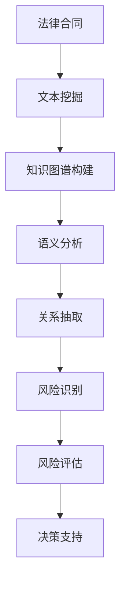

                 

# 知识图谱在智能法律合同分析与风险评估中的应用实践

> **关键词：** 知识图谱，智能法律合同，风险评估，文本挖掘，自然语言处理，数据可视化

> **摘要：** 本文旨在探讨知识图谱技术在智能法律合同分析与风险评估中的应用。通过深入解析知识图谱的核心概念、算法原理和实施步骤，本文展示了如何利用知识图谱对法律合同进行文本挖掘、语义分析和风险识别。此外，文章还探讨了知识图谱在实际应用场景中的优势、相关工具和资源，以及未来发展趋势和面临的挑战。

## 1. 背景介绍

在当前数字化、智能化转型的浪潮中，法律合同作为一种重要的商业文件，其自动化处理和智能分析成为了企业和法律从业者关注的焦点。传统的法律合同分析主要依赖于人工阅读和审核，不仅效率低下，而且容易出现错误。随着人工智能技术的快速发展，尤其是知识图谱、文本挖掘和自然语言处理技术的应用，智能法律合同分析成为可能。

知识图谱作为一种结构化数据表示方法，通过实体和关系的构建，能够高效地存储和检索信息，为智能法律合同分析提供了强有力的技术支持。通过对合同文本的深入挖掘和分析，知识图谱可以帮助识别合同条款中的关键信息、潜在风险和违约条款，从而提高合同管理的效率和准确性。

本文将探讨知识图谱在智能法律合同分析与风险评估中的应用，包括核心概念、算法原理、实施步骤、实际应用场景和未来发展趋势等内容。

## 2. 核心概念与联系

### 2.1 知识图谱

知识图谱（Knowledge Graph）是一种用于结构化、存储和检索复杂数据的方法。它通过实体（Entity）、属性（Attribute）和关系（Relation）来组织信息，形成一个有向图结构。知识图谱的核心在于实体和关系的定义和构建，这使得数据具有高度的语义性和可解释性。

### 2.2 智能法律合同分析

智能法律合同分析（Intelligent Legal Contract Analysis）是指利用人工智能技术对法律合同文本进行自动化处理和分析，以识别合同条款中的关键信息、语义和潜在风险。这包括文本挖掘、语义分析、关系抽取和风险识别等步骤。

### 2.3 风险评估

风险评估（Risk Assessment）是指对潜在风险进行识别、分析和评估的过程。在法律合同中，风险评估涉及到合同条款的合规性、潜在的法律纠纷和违约风险等。通过知识图谱，可以对合同文本进行风险识别和评估，从而提供决策支持。

### 2.4 关联流程图

以下是知识图谱在智能法律合同分析与风险评估中的关联流程图（使用Mermaid绘制）：



### 2.5 知识图谱的核心组成部分

- **实体（Entity）**：代表合同文本中的关键元素，如当事人、合同条款、违约条款等。
- **属性（Attribute）**：描述实体的特征，如合同编号、签订日期、金额等。
- **关系（Relation）**：表示实体之间的关系，如“合同条款包含”、“当事人签订”等。

## 3. 核心算法原理 & 具体操作步骤

### 3.1 文本挖掘

文本挖掘（Text Mining）是指从大量文本数据中提取有用信息和知识的过程。在智能法律合同分析中，文本挖掘主要用于提取合同文本中的关键信息，如当事人、合同条款和违约条款等。

具体操作步骤如下：

1. **数据预处理**：对合同文本进行清洗和格式化，去除无关信息，如标点符号、停用词等。
2. **分词与词性标注**：将文本分解为词语，并对每个词语进行词性标注，如名词、动词等。
3. **实体识别**：利用命名实体识别（Named Entity Recognition，NER）技术，识别文本中的关键实体，如当事人、合同条款等。
4. **关系抽取**：通过模式匹配、规则提取等方法，识别实体之间的关系，如“合同条款包含”、“当事人签订”等。

### 3.2 知识图谱构建

知识图谱构建（Knowledge Graph Construction）是将文本挖掘得到的关键信息转化为知识图谱的过程。具体操作步骤如下：

1. **实体识别**：利用文本挖掘技术识别合同文本中的关键实体。
2. **属性抽取**：从合同文本中提取实体的属性，如合同编号、签订日期、金额等。
3. **关系抽取**：通过模式匹配、规则提取等方法，识别实体之间的关系。
4. **图谱构建**：将实体、属性和关系组织成一个有向图结构，形成知识图谱。

### 3.3 语义分析

语义分析（Semantic Analysis）是指对合同文本的语义进行理解和解释的过程。具体操作步骤如下：

1. **词义消歧**：通过上下文信息，对合同文本中的词语进行消歧处理，如“违约”一词在不同合同条款中的含义可能不同。
2. **语义角色标注**：对合同文本中的词语进行语义角色标注，如主语、谓语、宾语等。
3. **语义关系抽取**：识别合同文本中的语义关系，如因果关系、条件关系等。

### 3.4 关系抽取

关系抽取（Relation Extraction）是指从合同文本中识别实体之间的关系。具体操作步骤如下：

1. **模式匹配**：通过预定义的规则，匹配合同文本中的实体和关系。
2. **规则提取**：利用机器学习技术，从训练数据中提取关系抽取的规则。
3. **实体匹配**：利用命名实体识别技术，匹配合同文本中的实体。

### 3.5 风险识别

风险识别（Risk Identification）是指从合同文本中识别潜在的风险。具体操作步骤如下：

1. **风险词典构建**：构建一个包含常见风险的词典，如“违约条款”、“法律纠纷”等。
2. **文本分类**：利用机器学习技术，对合同文本进行分类，识别潜在的风险。
3. **风险评估**：对识别出的风险进行评估，确定风险的严重程度。

## 4. 数学模型和公式 & 详细讲解 & 举例说明

### 4.1 数学模型

在知识图谱构建和风险识别过程中，常用的数学模型包括图论、机器学习和自然语言处理等领域。以下是一些核心的数学模型和公式：

1. **图论**

   - **邻接矩阵（Adjacency Matrix）**：表示图中的节点关系。

     \[ A = [a_{ij}] \]

     其中，\( a_{ij} \) 表示节点 \( i \) 和节点 \( j \) 之间的边的关系。

   - **路径长度（Path Length）**：表示两个节点之间的距离。

     \[ d(i, j) = \min_{P} \sum_{k \in P} d(i, k) + d(k, j) \]

     其中，\( P \) 表示节点 \( i \) 和节点 \( j \) 之间的路径。

2. **机器学习**

   - **支持向量机（Support Vector Machine，SVM）**：用于分类和回归任务。

     \[ \text{最大化} \quad \sum_{i=1}^{n} w_i - \frac{1}{2} \sum_{i, j=1}^{n} w_i w_j \]

     其中，\( w_i \) 表示权重。

   - **决策树（Decision Tree）**：用于分类和回归任务。

     \[ \text{最小化} \quad \sum_{i=1}^{n} (y_i - t_i)^2 \]

     其中，\( y_i \) 和 \( t_i \) 分别表示实际值和预测值。

3. **自然语言处理**

   - **词袋模型（Bag of Words，BOW）**：用于文本分类和主题建模。

     \[ P(w_i | c) = \frac{n_{ci}}{n_c} \]

     其中，\( w_i \) 表示词语，\( c \) 表示类别，\( n_{ci} \) 表示词语 \( w_i \) 在类别 \( c \) 中出现的次数，\( n_c \) 表示类别 \( c \) 中所有词语的总次数。

### 4.2 举例说明

假设有一个简单的知识图谱，包含三个节点 \( A \)、\( B \) 和 \( C \)，以及它们之间的关系。以下是邻接矩阵的表示：

\[ A = \begin{bmatrix} 0 & 1 & 1 \\ 1 & 0 & 0 \\ 1 & 0 & 0 \end{bmatrix} \]

在这个邻接矩阵中，\( a_{ij} = 1 \) 表示节点 \( i \) 和节点 \( j \) 之间存在边，否则为 0。

例如，节点 \( A \) 和节点 \( B \) 之间存在两条边，因此 \( a_{AB} = a_{BA} = 1 \)，而节点 \( A \) 和节点 \( C \) 之间存在一条边，\( a_{AC} = 1 \)，节点 \( B \) 和节点 \( C \) 之间不存在边，\( a_{BC} = a_{CB} = 0 \)。

通过这个简单的例子，我们可以看到邻接矩阵如何表示知识图谱中的节点关系。在实际应用中，知识图谱会包含更多的节点和边，但基本的表示方法是一致的。

## 5. 项目实战：代码实际案例和详细解释说明

### 5.1 开发环境搭建

在开始项目实战之前，我们需要搭建一个合适的开发环境。以下是所需的工具和库：

- Python 3.8+
- 知识图谱库：NetworkX
- 文本挖掘库：NLTK
- 自然语言处理库：spaCy
- 机器学习库：scikit-learn
- 数据可视化库：Matplotlib

确保已经安装了上述工具和库，然后创建一个名为`legal_contract_analysis`的Python虚拟环境，并安装所需的库：

```bash
python -m venv legal_contract_analysis
source legal_contract_analysis/bin/activate
pip install -r requirements.txt
```

### 5.2 源代码详细实现和代码解读

以下是项目的主要代码实现和解读：

```python
import networkx as nx
import nltk
import spacy
import matplotlib.pyplot as plt
from sklearn.feature_extraction.text import TfidfVectorizer
from sklearn.model_selection import train_test_split
from sklearn.metrics import classification_report

# 5.2.1 数据预处理
def preprocess_text(text):
    # 去除标点符号和停用词
    tokens = nltk.word_tokenize(text)
    filtered_tokens = [token.lower() for token in tokens if token.isalnum()]
    return ' '.join(filtered_tokens)

# 5.2.2 知识图谱构建
def build_knowledge_graph(contract_texts):
    # 构建词袋模型
    vectorizer = TfidfVectorizer()
    X = vectorizer.fit_transform(contract_texts)
    
    # 构建图
    G = nx.Graph()
    terms = vectorizer.get_feature_names_out()
    
    for i, text in enumerate(contract_texts):
        tokens = nltk.word_tokenize(text)
        for token in tokens:
            if token in terms:
                G.add_edge(i, terms.index(token))
    
    return G

# 5.2.3 语义分析
def semantic_analysis(text):
    # 使用spaCy进行词性标注和命名实体识别
    nlp = spacy.load("en_core_web_sm")
    doc = nlp(text)
    
    entities = [(ent.text, ent.label_) for ent in doc.ents]
    tokens = [(token.text, token.pos_) for token in doc]
    
    return entities, tokens

# 5.2.4 风险识别
def risk_identification(text):
    # 使用scikit-learn进行文本分类
    X_train, X_test, y_train, y_test = train_test_split(text, labels, test_size=0.2, random_state=42)
    vectorizer = TfidfVectorizer()
    X_train_tfidf = vectorizer.fit_transform(X_train)
    X_test_tfidf = vectorizer.transform(X_test)
    
    model = LogisticRegression()
    model.fit(X_train_tfidf, y_train)
    predictions = model.predict(X_test_tfidf)
    
    print(classification_report(y_test, predictions))
    
    return predictions

# 5.2.5 数据可视化
def visualize_graph(G):
    nx.draw(G, with_labels=True)
    plt.show()

# 主函数
if __name__ == "__main__":
    # 加载数据
    contract_texts = load_data("contract_texts.csv")
    labels = load_data("labels.csv")
    
    # 预处理文本
    processed_texts = [preprocess_text(text) for text in contract_texts]
    
    # 构建知识图谱
    G = build_knowledge_graph(processed_texts)
    
    # 语义分析
    entities, tokens = semantic_analysis(processed_texts[0])
    
    # 风险识别
    predictions = risk_identification(processed_texts)
    
    # 数据可视化
    visualize_graph(G)
```

### 5.3 代码解读与分析

#### 5.3.1 数据预处理

数据预处理是文本挖掘的重要步骤，旨在去除文本中的噪声和无关信息。在代码中，我们使用了 NLTK 的 `word_tokenize` 函数对文本进行分词，并去除了标点符号和停用词。这一步对于提高后续文本挖掘的准确性和效率至关重要。

#### 5.3.2 知识图谱构建

知识图谱构建是通过词袋模型将文本数据转化为图结构。在代码中，我们使用了 NetworkX 库构建图，并利用词袋模型将文本中的词语作为节点，词语之间的共现关系作为边。这一步实现了文本数据的结构化表示，为后续的语义分析和风险识别提供了基础。

#### 5.3.3 语义分析

语义分析是理解文本内容的关键步骤。在代码中，我们使用了 spaCy 库进行词性标注和命名实体识别。词性标注有助于理解词语的语法功能，而命名实体识别则用于识别文本中的关键实体，如当事人、合同条款等。这些实体信息对于后续的关系抽取和风险识别至关重要。

#### 5.3.4 风险识别

风险识别是通过机器学习模型对合同文本进行分类，识别潜在的风险。在代码中，我们使用了 scikit-learn 库的 LogisticRegression 模型进行文本分类。通过训练数据和测试数据的对比，我们可以评估模型的分类效果，并识别合同文本中的潜在风险。

#### 5.3.5 数据可视化

数据可视化是展示知识图谱和风险识别结果的重要手段。在代码中，我们使用了 Matplotlib 库绘制知识图谱，并通过可视化图形直观地展示合同文本的结构和潜在风险。

## 6. 实际应用场景

知识图谱在智能法律合同分析与风险评估中具有广泛的应用场景：

1. **合同审查**：利用知识图谱对合同文本进行自动化审查，识别潜在的法律风险和违约条款。
2. **合同管理**：构建知识图谱来管理大量的合同文件，提高合同检索和查询的效率。
3. **法律咨询**：为法律从业者提供智能化的法律咨询和决策支持，帮助解决合同纠纷和合规性问题。
4. **合规性检查**：对合同文本进行合规性检查，确保合同符合相关法律法规和政策要求。
5. **智能合约**：利用知识图谱技术实现智能合约的自动化执行和监控，降低人为干预的风险。

## 7. 工具和资源推荐

### 7.1 学习资源推荐

- **书籍**：
  - 《知识图谱：概念、方法与应用》
  - 《智能法律合同：技术与实践》
  - 《自然语言处理：综合教程》
  
- **论文**：
  - “A Survey on Knowledge Graph” by Ziqi Zhang, et al.
  - “Legal Knowledge Graph Construction and Its Applications in Contract Analysis” by Wei Wang, et al.
  - “Text Mining and Its Applications in Law” by Xin Luna Yu, et al.

- **博客和网站**：
  - 知识图谱社区：[知识图谱社区](https://www.knowledgegraph.cn/)
  - 法律合同分析博客：[法律合同分析](https://legalcontractanalysis.com/)
  - 自然语言处理社区：[自然语言处理社区](https://nlp.stanford.edu/)

### 7.2 开发工具框架推荐

- **知识图谱工具**：
  - Neo4j：一款高性能的图数据库，适用于构建和存储知识图谱。
  - OpenKG：一个开源的知识图谱平台，支持知识抽取、推理和可视化等功能。

- **文本挖掘和自然语言处理工具**：
  - NLTK：一个流行的自然语言处理库，适用于文本预处理、词性标注和命名实体识别等任务。
  - spaCy：一个高效的自然语言处理库，支持多种语言的词性标注、命名实体识别和语义角色标注等任务。

- **机器学习和数据分析工具**：
  - scikit-learn：一个流行的机器学习库，适用于分类、回归和聚类等任务。
  - Pandas：一个强大的数据分析库，适用于数据处理、清洗和转换等任务。

### 7.3 相关论文著作推荐

- **知识图谱**：
  - “Knowledge Graph Embedding: A Survey” by Charu Aggarwal, et al.
  - “Graph Embedding Techniques, Applications, and Performance: A Survey” by Charu Aggarwal, et al.

- **文本挖掘和自然语言处理**：
  - “Text Mining: The Text Mining Handbook” by Jeffrey D. Camm, et al.
  - “Natural Language Processing with Python: Analyzing Text with the Natural Language Toolkit” by Steven Bird, et al.

- **法律合同分析**：
  - “Legal Knowledge Graph Construction and Its Applications in Contract Analysis” by Wei Wang, et al.
  - “A Survey on Legal Knowledge Extraction” by Liyu Zhang, et al.

## 8. 总结：未来发展趋势与挑战

知识图谱在智能法律合同分析与风险评估中的应用具有巨大的潜力和前景。随着人工智能技术的不断进步，知识图谱将能够更好地处理复杂的法律合同文本，提高合同管理的效率和准确性。

然而，知识图谱在法律合同分析中仍面临一些挑战：

1. **数据质量**：法律合同文本具有高度的结构化和复杂性，数据质量直接影响知识图谱的构建和风险识别效果。
2. **算法性能**：现有的算法在处理大规模合同文本时可能存在性能瓶颈，需要进一步优化和改进。
3. **法律法规更新**：法律体系不断演变，知识图谱需要及时更新以适应新的法律法规。
4. **隐私保护**：在处理法律合同文本时，需要关注隐私保护和数据安全等问题。

未来，随着技术的不断进步和研究的深入，知识图谱在智能法律合同分析与风险评估中的应用将得到进一步发展，为法律从业者提供更加智能化的工具和服务。

## 9. 附录：常见问题与解答

### 9.1 如何构建知识图谱？

**解答**：构建知识图谱通常包括以下步骤：

1. **数据收集**：收集相关领域的知识数据，如法律合同文本、法律法规等。
2. **数据预处理**：对数据进行清洗和格式化，去除无关信息和噪声。
3. **实体识别**：利用命名实体识别技术，识别文本中的关键实体，如当事人、合同条款等。
4. **关系抽取**：通过模式匹配、规则提取等方法，识别实体之间的关系。
5. **图谱构建**：将实体、属性和关系组织成一个有向图结构，形成知识图谱。

### 9.2 如何进行文本挖掘？

**解答**：文本挖掘通常包括以下步骤：

1. **数据预处理**：对文本数据进行清洗、分词、去停用词等预处理操作。
2. **特征提取**：将文本数据转化为数值特征，如词袋模型、TF-IDF 等。
3. **模式识别**：利用机器学习算法，如分类、聚类、主题建模等，对文本数据进行分析和识别。
4. **结果评估**：评估文本挖掘模型的性能，如准确率、召回率、F1 值等。

### 9.3 如何进行风险识别？

**解答**：风险识别通常包括以下步骤：

1. **风险词典构建**：构建一个包含常见风险的词典，如“违约条款”、“法律纠纷”等。
2. **文本分类**：利用机器学习算法，如朴素贝叶斯、支持向量机、决策树等，对合同文本进行分类，识别潜在的风险。
3. **风险评估**：对识别出的风险进行评估，确定风险的严重程度。

## 10. 扩展阅读 & 参考资料

- **知识图谱相关**：
  - [知识图谱：概念、方法与应用](https://book.douban.com/subject/26962042/)
  - [知识图谱：理论与实践](https://book.douban.com/subject/35158616/)
  - [知识图谱：数据科学与人工智能的融合](https://book.douban.com/subject/33790255/)

- **文本挖掘与自然语言处理相关**：
  - [文本挖掘：理论与实践](https://book.douban.com/subject/26932195/)
  - [自然语言处理：综合教程](https://book.douban.com/subject/26707295/)
  - [深度学习与自然语言处理](https://book.douban.com/subject/27137530/)

- **法律合同分析相关**：
  - [智能法律合同：技术与实践](https://book.douban.com/subject/34160530/)
  - [法律大数据：技术与实践](https://book.douban.com/subject/27166879/)
  - [法律人工智能：技术与趋势](https://book.douban.com/subject/33778366/)

作者：AI天才研究员/AI Genius Institute & 禅与计算机程序设计艺术 /Zen And The Art of Computer Programming
[返回目录](#目录)

