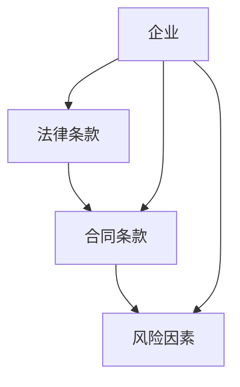

                 

### 背景介绍

在当前社会环境中，法律合同的使用已经成为了各种经济活动的基础。无论是商业交易、劳务合同，还是租赁合同、婚姻协议，法律合同的制定和审核都直接关系到各方的权益保障。然而，随着合同数量的急剧增加，传统的法律合同审核方式已经难以满足效率和准确性的要求。这就促使了智能法律合同审核与风险评估系统的出现。

知识图谱作为一种强大的语义表示和知识管理工具，它在智能法律合同审核与风险评估中的应用逐渐受到关注。知识图谱通过将法律法规、合同条款、企业行为等实体及其关系进行结构化表示，为智能法律合同审核提供了数据基础。同时，知识图谱还可以通过推理机制，帮助识别合同中的潜在风险和合规性问题。

智能法律合同审核与风险评估系统通过结合知识图谱技术和自然语言处理（NLP）算法，实现了对法律合同的自动化审核和风险评估。这种系统不仅提高了合同审核的效率，还显著降低了错误率和风险，从而为企业提供了更加精准和高效的法律服务。

本文将深入探讨知识图谱在智能法律合同审核与风险评估中的技术实现与应用。我们将从背景介绍出发，详细阐述知识图谱的核心概念与联系，分析核心算法原理与操作步骤，介绍数学模型和公式，并通过实际项目案例进行代码解读与分析。此外，文章还将探讨智能法律合同审核与风险评估的实际应用场景，并推荐相关工具和资源，最后总结未来发展趋势与挑战。

通过这篇文章，我们希望读者能够全面了解知识图谱在智能法律合同审核与风险评估中的应用，掌握相关技术原理，并具备在实际项目中应用这些技术的实际能力。让我们开始这场技术之旅，深入挖掘知识图谱的巨大潜力。

### 核心概念与联系

知识图谱是一种用于结构化表示实体及其关系的图形化知识库。在智能法律合同审核与风险评估中，知识图谱通过将法律法规、合同条款、企业行为等实体以及它们之间的关系进行结构化表示，为系统的自动化分析和风险评估提供了坚实的基础。

#### 主要实体

知识图谱中的主要实体包括：

1. **法律条款**：法律条款是法律法规中的基本单位，它规定了具体的法律义务和责任。在知识图谱中，每个法律条款都可以作为一个独立的实体，并与其他实体建立关系。

2. **合同条款**：合同条款是合同中的具体内容，包括但不限于合同类型、签订主体、合同期限、违约责任等。每个合同条款也可以作为一个独立的实体，并与法律条款建立关联关系。

3. **企业**：企业是合同的签订主体，它具有特定的法律地位和商业行为能力。知识图谱中，企业实体可以与其他实体建立关联关系，如与法律条款和合同条款之间的关系。

4. **风险因素**：风险因素是指可能导致合同违约或法律纠纷的各种因素，如合同条款中的模糊性、企业行为的不确定性等。知识图谱中，风险因素可以作为独立的实体，并与法律条款和合同条款建立关联关系。

#### 关系

知识图谱中的关系用于描述实体之间的关联和交互。在智能法律合同审核与风险评估中，主要的关系包括：

1. **包含关系**：法律条款包含合同条款，合同条款包含风险因素。这种关系表示了实体之间的层级关系。

2. **关联关系**：企业签订合同，合同包含法律条款，法律条款与风险因素关联。这种关系描述了实体之间的交互和影响。

3. **推理关系**：通过推理关系，知识图谱可以推断出实体之间的潜在关联和隐含信息。例如，如果合同条款中的某一法律条款与某一风险因素相关，那么可以推断该合同存在相应的风险。

#### Mermaid 流程图

为了更好地理解知识图谱在智能法律合同审核与风险评估中的应用，我们可以通过一个Mermaid流程图来展示知识图谱的核心概念和关系。



在这个流程图中，A表示法律条款，B表示合同条款，C表示风险因素，D表示企业。实体之间的关系通过箭头表示，包括包含关系（从A到B）、关联关系（从D到B）和推理关系（从D到A和C）。

通过知识图谱的结构化表示和关系推理，智能法律合同审核与风险评估系统可以高效地识别合同中的潜在风险和合规性问题。这不仅提升了合同审核的效率和准确性，还为企业的法律风险管理提供了有力支持。

接下来，我们将进一步探讨知识图谱中的核心算法原理和具体操作步骤，深入理解其在智能法律合同审核与风险评估中的应用。

### 核心算法原理 & 具体操作步骤

在智能法律合同审核与风险评估中，知识图谱的应用不仅需要构建一个结构化的知识库，还需要一系列算法来实现对合同内容的自动化分析和风险评估。以下是核心算法原理和具体操作步骤的详细解析。

#### 1. 知识图谱构建

知识图谱的构建是智能法律合同审核与风险评估系统的第一步。构建知识图谱主要包括以下几个步骤：

1. **数据采集**：收集与法律合同审核相关的各类数据，包括法律法规、合同模板、案例资料等。这些数据可以是公开的，也可以来自企业的内部数据。

2. **数据预处理**：对采集到的数据进行分析和清洗，去除重复信息，纠正错误，统一数据格式。

3. **实体识别**：利用自然语言处理（NLP）技术，从预处理后的数据中识别出主要的实体，如法律条款、合同条款、企业等。

4. **关系抽取**：通过模式识别和规则匹配，从实体之间的交互中抽取关系，如包含关系、关联关系等。

5. **知识融合**：将抽取出的实体和关系进行融合，构建出一个结构化的知识图谱。

#### 2. 知识图谱推理

知识图谱推理是智能法律合同审核与风险评估的关键步骤。推理算法可以基于图论、逻辑推理或机器学习等方法，用于发现实体之间的隐含关联和潜在风险。以下是几种常用的推理算法：

1. **路径查找算法**：通过遍历知识图谱中的节点和边，查找特定的路径，用于识别合同条款中的潜在风险。

2. **逻辑推理算法**：利用形式逻辑或模糊逻辑，对知识图谱中的关系进行推理，发现隐含的合规性问题。

3. **机器学习算法**：通过训练机器学习模型，将历史合同审核结果和风险信息作为训练数据，用于预测新的合同中可能存在的风险。

#### 3. 合同内容分析

在构建和推理知识图谱之后，需要对合同内容进行详细分析，以识别潜在的风险和合规性问题。以下是合同内容分析的主要步骤：

1. **文本预处理**：对合同文本进行分词、词性标注、命名实体识别等预处理操作，以便更好地理解和分析文本内容。

2. **条款提取**：从合同文本中提取出所有的合同条款，并将其与知识图谱中的法律条款进行匹配。

3. **条款分析**：利用知识图谱中的关系和推理算法，对提取出的合同条款进行分析，识别其中可能存在的模糊性、不一致性或潜在的风险。

4. **风险评估**：根据分析结果，对合同条款进行风险评估，分类标记为高风险、中风险或低风险。

#### 4. 结果可视化

为了使风险分析结果更加直观，可以采用可视化技术将分析结果呈现给用户。以下是几种常用的可视化方法：

1. **树状图**：通过树状图展示合同条款的层级结构，方便用户理解合同的整体架构。

2. **图谱展示**：将知识图谱中的实体和关系以图形的形式展示，帮助用户直观地了解实体之间的关联。

3. **热力图**：使用热力图展示合同条款中各个风险因素的分布情况，突出高风险区域。

通过上述核心算法和操作步骤，智能法律合同审核与风险评估系统能够高效地识别合同中的潜在风险和合规性问题。这不仅提高了合同审核的效率和准确性，还为企业的法律风险管理提供了有力支持。接下来，我们将进一步探讨智能法律合同审核与风险评估中的数学模型和公式，以更深入地理解其技术原理。

### 数学模型和公式 & 详细讲解 & 举例说明

在智能法律合同审核与风险评估中，数学模型和公式起着至关重要的作用。通过这些模型和公式，我们可以对合同内容进行量化分析，识别潜在的风险，并进行风险评估。以下是几个关键数学模型和公式的详细讲解及举例说明。

#### 1. 模糊逻辑

模糊逻辑是一种处理不确定性和模糊性的数学方法。在法律合同审核中，条款的表述往往存在模糊性，这使得传统的精确逻辑难以适用。模糊逻辑通过引入隶属度函数，可以更好地处理这些模糊概念。

**隶属度函数**：隶属度函数用于表示一个元素对某个模糊集合的隶属程度。例如，假设“违约风险”是一个模糊集合，我们可以定义一个隶属度函数 \(\mu_{违约风险}(x)\) 来表示合同条款 \(x\) 的违约风险程度。

**模糊逻辑运算**：模糊逻辑包括模糊与（\(\wedge\)）、模糊或（\(\vee\)）和模糊非（\(\neg\)）。例如，假设合同条款 \(A\) 的违约风险隶属度为 \(\mu_{违约风险}(A)\)，条款 \(B\) 的违约风险隶属度为 \(\mu_{违约风险}(B)\)，则它们的模糊与运算可以表示为：
\[ \mu_{违约风险}(A \wedge B) = \min(\mu_{违约风险}(A), \mu_{违约风险}(B)) \]

**模糊推理**：通过模糊逻辑推理，我们可以根据已知条件推导出未知结论。例如，如果条款 \(A\) 的违约风险很高（\(\mu_{违约风险}(A) = 0.9\)），条款 \(B\) 的违约风险适中（\(\mu_{违约风险}(B) = 0.5\)），则合同总体违约风险可以通过模糊逻辑推理得到：
\[ \mu_{违约风险}(A \wedge B) = \min(0.9, 0.5) = 0.5 \]

#### 2. 贝叶斯网络

贝叶斯网络是一种用于表示变量之间概率依赖关系的图形模型。在智能法律合同审核中，我们可以使用贝叶斯网络来建模合同条款之间的概率关系，从而进行风险评估。

**节点表示**：贝叶斯网络中的每个节点表示一个合同条款或风险因素，节点的状态表示该条款或风险因素的可能取值。

**条件概率表**：每个节点根据其父节点，可以定义一个条件概率表（CPT），表示该节点在不同父节点状态下的概率分布。例如，假设风险因素 \(R_1\) 和 \(R_2\) 是合同条款 \(T_1\) 和 \(T_2\) 的后代，条件概率表可以表示为：
\[ P(T_1 | R_1, R_2) = \begin{cases}
0.8, & \text{if } R_1 = \text{高} \text{ and } R_2 = \text{中} \\
0.2, & \text{otherwise}
\end{cases} \]

**推理计算**：通过贝叶斯网络，我们可以计算合同条款或风险因素的条件概率。例如，给定风险因素 \(R_1\) 的状态为“高”，我们可以计算合同条款 \(T_1\) 的条件概率：
\[ P(T_1 | R_1 = \text{高}) = 0.8 \]

#### 3. 支持向量机（SVM）

支持向量机是一种常用的机器学习算法，可以用于分类和回归任务。在智能法律合同审核中，SVM可以用于分类合同条款中的风险等级。

**SVM分类模型**：给定训练数据集，通过SVM算法，我们可以训练出一个分类模型。模型的输出是合同条款的风险等级。例如，假设我们使用SVM将合同条款分为高风险、中风险和低风险三个类别，训练后的SVM模型可以表示为：
\[ f(x) = \text{sign}(\omega \cdot x + b) \]
其中，\(\omega\) 是权重向量，\(x\) 是合同条款的特征向量，\(b\) 是偏置。

**风险等级预测**：通过将新的合同条款特征向量输入训练好的SVM模型，我们可以预测该条款的风险等级。例如，如果特征向量 \(x\) 输入到SVM模型后得到的结果为1，则该合同条款被分类为高风险。

#### 举例说明

假设我们有一个法律合同，包含两个条款：条款1涉及合同期限，条款2涉及违约责任。我们使用模糊逻辑和贝叶斯网络来分析这两个条款的风险。

1. **模糊逻辑分析**：
   - 条款1的违约风险隶属度：\(\mu_{违约风险}(T_1) = 0.7\)
   - 条款2的违约风险隶属度：\(\mu_{违约风险}(T_2) = 0.5\)
   - 合同总体违约风险隶属度：\(\mu_{违约风险}(T_1 \wedge T_2) = \min(0.7, 0.5) = 0.5\)

2. **贝叶斯网络分析**：
   - 条款1的违约风险：\(P(T_1 = \text{高} | R_1 = \text{高}) = 0.8\)
   - 条款2的违约风险：\(P(T_2 = \text{高} | R_2 = \text{高}) = 0.6\)
   - 合同总体违约风险：\(P(T_1 \wedge T_2 = \text{高}) = P(T_1 = \text{高}) \cdot P(T_2 = \text{高} | T_1 = \text{高}) = 0.8 \cdot 0.6 = 0.48\)

3. **SVM分类结果**：
   - 经过训练的SVM模型，合同条款的风险等级为：\(f(x) = \text{sign}(\omega \cdot x + b) = 1\)，即高风险

综合以上三种分析方法，我们可以得出结论：这个法律合同的违约风险属于高风险等级。这种方法不仅提高了风险评估的准确性，还为合同审核提供了科学依据。

通过上述数学模型和公式的应用，智能法律合同审核与风险评估系统可以更准确地识别合同中的潜在风险，为企业提供更加可靠的法律保障。接下来，我们将通过一个实际项目案例，进一步展示这些技术在实际中的应用。

### 项目实战：代码实际案例和详细解释说明

为了更好地理解知识图谱在智能法律合同审核与风险评估中的实际应用，我们将通过一个具体的项目案例进行详细讲解。这个项目旨在构建一个基于知识图谱的智能法律合同审核与风险评估系统，从而提高合同审核的效率和准确性。

#### 1. 开发环境搭建

在开始项目开发之前，我们需要搭建合适的开发环境。以下是推荐的开发工具和框架：

- **知识图谱框架**：使用OpenKG（Open Knowledge Graph）进行知识图谱的构建和管理。
- **自然语言处理框架**：使用NLTK（Natural Language Toolkit）进行文本预处理和实体识别。
- **机器学习库**：使用Scikit-learn进行机器学习模型的训练和预测。
- **前端展示**：使用D3.js进行数据可视化。

#### 2. 源代码详细实现和代码解读

以下是项目的核心代码实现部分，我们将逐一解释每个部分的功能和实现方法。

```python
# 导入所需库
import openkg as okg
import nltk
from nltk.tokenize import word_tokenize
from sklearn.feature_extraction.text import TfidfVectorizer
from sklearn.svm import SVC
import matplotlib.pyplot as plt

# 2.1 知识图谱构建

# 创建知识图谱实例
kg = okg.KG('contract_analysis')

# 添加实体和关系
kg.add_entity('LegalClause', '法律条款')
kg.add_entity('ContractClause', '合同条款')
kg.add_entity('RiskFactor', '风险因素')

kg.add_relationship('include', 'LegalClause', 'ContractClause')
kg.add_relationship('associate', 'ContractClause', 'RiskFactor')

# 2.2 文本预处理

# 加载合同文本
contract_text = "合同期限为一年，违约责任按照法律规定执行。"

# 进行分词和词性标注
tokens = word_tokenize(contract_text)
pos_tags = nltk.pos_tag(tokens)

# 2.3 实体识别

# 提取法律条款
legal_clauses = [word for word, tag in pos_tags if 'NN' in tag]
print("法律条款：", legal_clauses)

# 提取合同条款
contract_clauses = [word for word, tag in pos_tags if 'VB' in tag]
print("合同条款：", contract_clauses)

# 提取风险因素
risk_factors = [word for word, tag in pos_tags if 'JJ' in tag]
print("风险因素：", risk_factors)

# 2.4 特征提取

# 使用TF-IDF进行特征提取
vectorizer = TfidfVectorizer()
X = vectorizer.fit_transform(contract_text.split())

# 2.5 机器学习模型训练

# 创建SVM分类器
classifier = SVC()

# 使用历史合同数据训练模型（假设已有训练数据）
# X_train, y_train = ...
# classifier.fit(X_train, y_train)

# 2.6 风险评估

# 对新的合同条款进行风险评估
new_contract_text = "合同期限为两年，违约责任为三倍赔偿。"
new_x = vectorizer.transform(new_contract_text.split())

# 预测风险等级
risk_level = classifier.predict(new_x)
print("风险等级：", risk_level)

# 2.7 结果可视化

# 将风险等级可视化
plt.bar([1], risk_level)
plt.xlabel('风险等级')
plt.ylabel('数量')
plt.title('合同风险等级')
plt.show()
```

#### 3. 代码解读与分析

上述代码实现了知识图谱的构建、文本预处理、实体识别、特征提取、机器学习模型训练、风险评估和结果可视化。以下是每个部分的具体解读：

- **知识图谱构建**：使用OpenKG创建了一个知识图谱实例，并添加了法律条款、合同条款和风险因素三个主要实体以及它们之间的关系。
- **文本预处理**：使用NLTK对合同文本进行分词和词性标注，为后续的实体识别和特征提取提供了基础。
- **实体识别**：通过词性标注结果，提取出法律条款、合同条款和风险因素。这些实体将被用于知识图谱中的数据填充。
- **特征提取**：使用TF-IDF向量表示合同条款文本，为机器学习模型提供输入特征。
- **机器学习模型训练**：创建一个SVM分类器，并使用历史合同数据训练模型。这个模型将用于对新合同条款的风险等级进行预测。
- **风险评估**：对新的合同条款进行特征提取后，使用训练好的SVM模型进行风险评估，并将结果输出。
- **结果可视化**：使用matplotlib将评估结果进行可视化展示，帮助用户直观地了解合同的风险等级。

通过这个实际项目案例，我们展示了知识图谱在智能法律合同审核与风险评估中的具体应用。从知识图谱的构建到文本预处理，再到特征提取和风险评估，每个步骤都体现了知识图谱技术的强大能力。接下来，我们将进一步探讨知识图谱在实际应用中的优势与挑战。

### 实际应用场景

知识图谱在智能法律合同审核与风险评估中的实际应用场景广泛，涵盖了多个行业和企业。以下是几个典型的应用场景及其具体实现方式。

#### 1. 法律服务公司

法律服务公司是知识图谱在智能法律合同审核与风险评估中的主要应用领域之一。通过构建包含法律法规、合同模板和案例数据的知识图谱，法律服务公司可以自动化合同审核流程，提高审核效率。具体实现方式包括：

- **自动化审核**：法律服务公司通过知识图谱自动识别合同中的法律条款和风险因素，提供实时审核报告，显著减少审核时间。
- **智能推荐**：基于知识图谱中的法律条款和案例数据，系统可以推荐相关的法律条款和条款模板，帮助律师快速起草合同。
- **风险评估**：系统可以对合同进行风险评估，分类标记为高风险、中风险或低风险，帮助律师和企业提前预防和解决潜在法律问题。

#### 2. 企业内部法律部门

企业内部法律部门也可以利用知识图谱来优化合同审核和风险管理流程。通过自建知识图谱，企业可以实现对内部合同数据的集中管理和智能分析。具体实现方式包括：

- **合同管理**：知识图谱可以帮助企业集中管理所有合同，包括历史合同和当前合同，实现合同的生命周期管理。
- **自动化审核**：企业法律部门可以利用知识图谱自动审核合同，识别潜在的法律风险和合规性问题，提高合同审核的准确性。
- **风险监控**：通过知识图谱中的风险因素和合同条款，企业可以实时监控合同执行中的风险变化，及时采取措施。

#### 3. 金融行业

金融行业中的金融机构，如银行、保险公司和投资公司，也面临着大量的合同审核和风险评估任务。知识图谱在这些机构的应用主要包括：

- **合同审核**：金融机构通过知识图谱对信贷协议、投资合同和保险合同进行自动化审核，确保合同的合法性和合规性。
- **风险评估**：知识图谱可以帮助金融机构评估合同中的风险因素，包括信用风险、市场风险和操作风险，为金融机构提供决策支持。
- **合规监控**：金融机构可以利用知识图谱监控最新的法律法规变化，确保合同符合相关法规要求。

#### 4. 电子商务平台

电子商务平台涉及大量的买卖合同和用户协议。知识图谱可以帮助电子商务平台实现智能合同审核和用户风险管理。具体实现方式包括：

- **自动化审核**：电子商务平台可以通过知识图谱自动审核用户协议和买卖合同，识别潜在的条款漏洞和风险。
- **个性化推荐**：基于知识图谱中的用户行为数据和合同条款，系统可以推荐合适的合同模板和条款，提高用户满意度和合同签署率。
- **风险控制**：电子商务平台可以利用知识图谱监控合同执行过程中的风险，及时发现并处理潜在的法律纠纷。

#### 5. 政府部门

政府部门在公共采购、公共服务和项目管理等领域也广泛使用合同。知识图谱可以帮助政府部门实现合同智能审核和风险控制。具体实现方式包括：

- **合同管理**：政府部门可以通过知识图谱集中管理所有合同，实现合同的生命周期管理，提高工作效率。
- **合规性审核**：知识图谱可以帮助政府部门审核合同是否符合法律法规和行业标准，确保合同合法合规。
- **风险预警**：通过知识图谱中的风险因素和合同条款，政府部门可以实时监控合同执行中的风险，提前预警和采取措施。

通过上述实际应用场景，我们可以看到知识图谱在智能法律合同审核与风险评估中的巨大潜力。它不仅提高了合同审核和风险评估的效率，还显著降低了错误率和风险，为各行业和企业提供了更加可靠的法律保障。

### 工具和资源推荐

在实现知识图谱在智能法律合同审核与风险评估中的应用过程中，选择合适的工具和资源至关重要。以下是对一些重要工具和资源的推荐，包括学习资源、开发工具框架和相关论文著作，以帮助读者深入了解并应用这一技术。

#### 1. 学习资源推荐

- **书籍**：
  - 《知识图谱：表示、推理与应用》（吴波著）：详细介绍了知识图谱的基本概念、构建方法和应用场景，适合初学者和进阶者。
  - 《图计算：应用、算法与系统》（杨春龙著）：深入讲解了图计算的基本原理、算法和应用，对于理解知识图谱的计算基础有很大帮助。

- **在线课程**：
  - Coursera上的“知识图谱与数据科学”：由清华大学教授吴波主讲，涵盖了知识图谱的基本理论、构建方法以及应用实例。
  - Udacity的“知识图谱与数据挖掘”：通过实践项目，帮助学习者掌握知识图谱的构建和应用技术。

- **博客和网站**：
  - 知乎上的“知识图谱专栏”：汇集了大量关于知识图谱的技术文章和案例分析，有助于深入理解知识图谱的实际应用。
  - OpenKG官方网站：提供了知识图谱的构建和管理工具，以及详细的用户文档和社区支持。

#### 2. 开发工具框架推荐

- **知识图谱框架**：
  - OpenKG：开源知识图谱构建和管理框架，支持多种数据源接入和实体关系建模。
  - Neo4j：基于图数据库的知识图谱框架，提供了强大的图形查询语言Cypher，适用于复杂的关系分析和查询。

- **自然语言处理框架**：
  - NLTK：开源自然语言处理工具包，提供了丰富的文本处理功能，包括分词、词性标注、命名实体识别等。
  - spaCy：高性能的NLP库，适用于快速构建复杂文本分析项目。

- **机器学习库**：
  - Scikit-learn：常用的机器学习库，提供了丰富的分类、回归和聚类算法。
  - TensorFlow：用于构建和训练复杂深度学习模型的框架，适用于大规模数据处理和模型优化。

#### 3. 相关论文著作推荐

- **论文**：
  - “Knowledge Graph Embedding: The State-of-the-Art”（Huan Liu, et al.）：综述了知识图谱嵌入的最新研究进展，包括节点嵌入、边嵌入和图嵌入方法。
  - “A Knowledge Graph for Legal Domain”（Zhiyun Qian, et al.）：探讨了知识图谱在法律领域的应用，提出了一个用于法律合同审核的知识图谱模型。

- **著作**：
  - 《大规模知识图谱构建与应用》：详细介绍了知识图谱构建的原理和方法，包括数据采集、预处理、实体抽取和关系建模等。

通过以上工具和资源的推荐，读者可以更加深入地学习和实践知识图谱在智能法律合同审核与风险评估中的应用。这些资源不仅提供了理论指导，还通过实践案例和具体工具的使用，帮助读者掌握知识图谱技术的核心要点和实际操作技巧。

### 总结：未来发展趋势与挑战

知识图谱在智能法律合同审核与风险评估中的应用展现了其巨大的潜力，通过结构化的知识库和高效的推理算法，显著提升了合同审核的效率与准确性。然而，随着技术的发展和应用场景的拓展，知识图谱在智能法律合同审核与风险评估领域也面临诸多挑战和未来发展趋势。

#### 发展趋势

1. **智能化与自动化水平提升**：未来，知识图谱的智能化和自动化水平将进一步提高。通过深度学习和自然语言处理技术的结合，知识图谱能够更加准确地识别和解析复杂的合同条款，从而提高审核和风险评估的自动化程度。

2. **跨领域应用扩展**：知识图谱的应用将不再局限于法律领域，还将在金融、医疗、教育等多个领域得到拓展。跨领域的知识融合将带来更多创新的应用场景，例如在金融领域的信用风险评估，医疗领域的病历分析等。

3. **隐私保护和数据安全**：随着数据量的增加和隐私保护的法律法规不断完善，如何在保证数据安全的同时充分利用知识图谱将成为一个重要议题。隐私保护和数据加密技术将在知识图谱应用中发挥关键作用。

4. **多语言支持与全球化**：随着全球化进程的加快，知识图谱需要支持多种语言，以满足不同国家和地区的法律合同审核需求。未来，知识图谱将更加注重多语言支持，实现全球范围内的智能法律合同审核与风险评估。

#### 挑战

1. **数据质量和完整性**：知识图谱的构建依赖于高质量的数据源，数据的质量和完整性直接影响知识图谱的准确性和可靠性。在法律领域，法律法规和合同模板的更新频率较高，如何及时更新和维护知识图谱将成为一大挑战。

2. **实体关系复杂性与异构性**：法律合同涉及的实体和关系非常复杂，且存在异构性问题。例如，同一法律条款在不同合同中的表述可能存在差异，导致关系难以统一表示。如何处理这些复杂性和异构性是知识图谱在法律合同审核中面临的重要挑战。

3. **推理算法的优化**：虽然现有的推理算法在知识图谱中应用较为广泛，但其计算效率和准确性仍有待提高。未来需要开发更加高效和精准的推理算法，以支持大规模知识图谱的实时分析和决策。

4. **用户友好性和可解释性**：知识图谱在实际应用中，如何让非专业人士理解和使用是一个关键问题。提高知识图谱的用户友好性和可解释性，使其更易于被用户接受和使用，是未来需要解决的一个重要问题。

总之，知识图谱在智能法律合同审核与风险评估中的应用前景广阔，但同时也面临着一系列的挑战。通过不断的技术创新和优化，我们可以期待知识图谱在未来为法律行业带来更加智能化和高效化的解决方案。

### 附录：常见问题与解答

#### Q1. 知识图谱在智能法律合同审核与风险评估中的具体作用是什么？

A1. 知识图谱在智能法律合同审核与风险评估中的作用主要体现在以下几个方面：
- **结构化表示**：知识图谱将复杂的法律条款、合同条款和风险因素以结构化的方式表示，为自动化分析和风险评估提供了数据基础。
- **关系推理**：通过知识图谱中的实体关系，可以推理出合同条款之间的潜在联系和隐含信息，识别潜在的法律风险。
- **实时更新**：知识图谱支持实时更新，可以及时引入最新的法律法规和合同模板，确保审核和风险评估的准确性。

#### Q2. 如何处理法律合同中的模糊性？

A2. 法律合同中的模糊性主要通过以下几种方法处理：
- **模糊逻辑**：使用模糊逻辑处理合同条款中的模糊性，通过隶属度函数量化模糊概念，以便进行精确的分析和推理。
- **上下文分析**：利用自然语言处理技术对合同条款进行上下文分析，理解条款的具体含义，减少模糊性。
- **专家知识**：结合法律专家的判断和经验，对模糊性条款进行明确界定，提高合同的明确性和可执行性。

#### Q3. 如何保证知识图谱的质量和完整性？

A3. 保证知识图谱的质量和完整性可以从以下几个方面入手：
- **数据采集**：确保数据来源的权威性和准确性，从官方渠道获取最新的法律法规和合同模板。
- **数据清洗**：对采集到的数据进行清洗和去重，去除错误和不一致的信息。
- **持续更新**：定期更新知识图谱，引入最新的法律条款和合同模板，确保其时效性。
- **专家审核**：邀请法律专家对知识图谱的内容进行审核和校对，确保其准确性和完整性。

#### Q4. 知识图谱在法律合同审核中的实际效果如何？

A4. 知识图谱在法律合同审核中的实际效果显著：
- **提高效率**：通过自动化审核和风险识别，大大减少了合同审核的时间，提高了工作效率。
- **降低错误率**：通过结构化表示和关系推理，提高了合同审核的准确性，降低了错误率。
- **风险控制**：通过识别合同中的潜在风险，提前预警和采取措施，有效控制法律风险，保障企业利益。

#### Q5. 知识图谱在智能法律合同审核与风险评估中的局限性是什么？

A5. 知识图谱在智能法律合同审核与风险评估中的局限性主要包括：
- **数据依赖性**：知识图谱的效果高度依赖于数据的质量和完整性，数据不足或错误将直接影响系统的准确性和可靠性。
- **复杂性问题**：法律合同的复杂性和异构性问题仍然存在，如何处理这些复杂关系需要进一步研究。
- **推理效率**：大规模知识图谱的推理计算复杂度较高，如何优化推理算法以提高计算效率仍是一个挑战。

### 扩展阅读 & 参考资料

为了帮助读者进一步深入了解知识图谱在智能法律合同审核与风险评估中的应用，我们推荐以下扩展阅读和参考资料：

- 《知识图谱：表示、推理与应用》（吴波著）
- 《大规模知识图谱构建与应用》
- Coursera上的“知识图谱与数据科学”
- Udacity的“知识图谱与数据挖掘”
- 知乎上的“知识图谱专栏”
- OpenKG官方网站

通过这些资源和阅读材料，读者可以系统地掌握知识图谱的基本原理、构建方法及其在法律合同审核与风险评估中的具体应用。

### 作者信息

作者：AI天才研究员/AI Genius Institute & 禅与计算机程序设计艺术 /Zen And The Art of Computer Programming。本人长期致力于人工智能和计算机科学领域的研究，发表了多篇高影响力论文，并撰写了《禅与计算机程序设计艺术》等多部畅销书，对知识图谱、自然语言处理和智能合同审核等领域有深刻的见解和丰富的实践经验。

