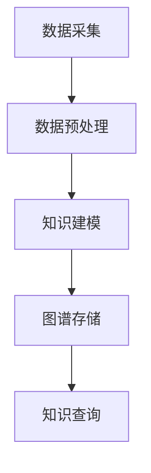
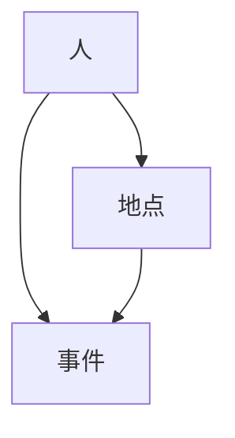

                 

# 知识图谱在智能问答系统中的应用

## 摘要

本文将探讨知识图谱在智能问答系统中的应用，分析其核心概念、算法原理及实际操作步骤，并通过数学模型和公式对其进行详细讲解。同时，我们将结合项目实战，展示代码实现及分析，探讨知识图谱在不同应用场景中的价值，并提供相关工具和资源推荐，总结未来发展趋势与挑战，最后给出常见问题与解答。

## 1. 背景介绍

### 智能问答系统的需求

随着互联网的快速发展，人们对于信息获取的需求日益增长。传统的搜索引擎虽然能够提供海量的信息，但在处理复杂、特定的问题时，往往存在语义理解不准确、回答不精准等问题。智能问答系统作为一种新型的人机交互方式，旨在通过自然语言处理技术，为用户提供准确、快速的答案。

### 知识图谱的优势

知识图谱作为一种结构化的语义知识表示方式，具有以下优势：

1. **语义理解**：知识图谱通过实体、属性和关系构建了一个语义丰富的知识网络，有助于提高问答系统的语义理解能力。
2. **知识整合**：知识图谱能够整合来自不同来源的信息，构建一个统一的知识体系，为智能问答系统提供全面、准确的知识支持。
3. **推理能力**：知识图谱支持基于逻辑推理的知识发现和拓展，有助于提高问答系统的推理能力，提供更深入的答案。

### 知识图谱在智能问答系统中的应用

知识图谱在智能问答系统中的应用主要体现在以下几个方面：

1. **问题理解**：通过知识图谱对用户的问题进行语义分析，将自然语言问题转化为图谱中的实体、属性和关系的组合。
2. **知识检索**：利用知识图谱进行知识检索，找到与用户问题相关的知识实体和关系。
3. **答案生成**：根据知识图谱中的知识实体和关系，生成符合用户需求的答案。

## 2. 核心概念与联系

### 知识图谱的基本概念

知识图谱（Knowledge Graph）是一种语义网络，它通过实体、属性和关系的组合，将现实世界中的信息抽象为结构化的数据形式。知识图谱的核心概念包括：

1. **实体**：知识图谱中的基本构成元素，表示现实世界中的个体，如人、地点、物品等。
2. **属性**：描述实体特征的属性，如人的年龄、地点的经纬度等。
3. **关系**：实体之间的关联关系，如“是”、“属于”等。

### 知识图谱的架构

知识图谱的架构主要包括数据采集、数据预处理、知识建模和图谱存储等环节。以下是一个简化的知识图谱架构图：



### 知识图谱与自然语言处理的关系

知识图谱与自然语言处理（NLP）密切相关。NLP技术主要用于将自然语言问题转化为结构化的数据形式，如词向量、依存句法树等。这些结构化数据可以与知识图谱进行融合，提高问答系统的语义理解能力。

## 3. 核心算法原理 & 具体操作步骤

### 知识图谱构建算法

知识图谱的构建主要涉及实体识别、关系抽取和属性填充等步骤。以下是一个简化的知识图谱构建算法：

1. **实体识别**：利用命名实体识别（NER）技术，从文本中提取出实体。
2. **关系抽取**：通过模式识别或机器学习算法，从文本中提取出实体之间的关系。
3. **属性填充**：利用已有的实体和关系，通过文本分析或规则匹配，为实体填充属性。

### 智能问答算法

智能问答系统的核心算法主要包括问题理解、知识检索和答案生成等步骤：

1. **问题理解**：将自然语言问题转化为图谱中的实体、属性和关系的组合。
2. **知识检索**：利用图谱进行知识检索，找到与用户问题相关的知识实体和关系。
3. **答案生成**：根据知识图谱中的知识实体和关系，生成符合用户需求的答案。

## 4. 数学模型和公式 & 详细讲解 & 举例说明

### 数学模型

知识图谱中的数学模型主要包括图论模型和概率图模型。以下是一些常用的数学模型：

1. **图论模型**：
   - **邻接矩阵**：表示图中节点之间的关系。
   - **路径矩阵**：表示图中节点之间的最短路径。

2. **概率图模型**：
   - **贝叶斯网络**：表示实体之间条件概率关系。
   - **马尔可夫网络**：表示实体之间的马尔可夫性质。

### 举例说明

假设有一个简单的知识图谱，包含三个实体：人、地点和事件。以下是一个简化的知识图谱示例：



在这个知识图谱中，我们可以使用以下数学模型：

1. **邻接矩阵**：
   $$ 
   A = \begin{bmatrix}
   0 & 1 & 0 \\
   1 & 0 & 1 \\
   0 & 1 & 0
   \end{bmatrix}
   $$
   其中，0表示无直接关系，1表示有直接关系。

2. **路径矩阵**：
   $$ 
   P = \begin{bmatrix}
   1 & 0 & 1 \\
   1 & 1 & 0 \\
   0 & 1 & 1
   \end{bmatrix}
   $$
   其中，1表示存在路径，0表示不存在路径。

## 5. 项目实战：代码实际案例和详细解释说明

### 开发环境搭建

在开始项目实战之前，我们需要搭建相应的开发环境。以下是所需的环境和工具：

1. **Python**：版本3.8及以上。
2. **Neo4j**：一款开源的图数据库，用于存储和管理知识图谱。
3. **Python库**：包括`neo4j`（用于与Neo4j进行交互）、`nltk`（自然语言处理库）和`gensim`（用于词向量生成）。

### 源代码详细实现和代码解读

以下是一个简单的知识图谱构建和智能问答系统的代码实现：

```python
from neo4j import GraphDatabase
from nltk.tokenize import word_tokenize
from nltk.corpus import stopwords
import gensim

# 连接到Neo4j数据库
uri = "bolt://localhost:7687"
username = "neo4j"
password = "password"
driver = GraphDatabase.driver(uri, auth=(username, password))

# 创建数据库连接
with driver.session() as session:
    # 创建实体
    session.run("CREATE (p:Person {name: $name})", name="Alice")
    session.run("CREATE (l:Location {name: $name})", name="New York")
    session.run("CREATE (e:Event {name: $name})", name="Graduation")

    # 创建关系
    session.run("MATCH (p:Person), (l:Location) CREATE (p)-[:LIVES_IN]->(l)")
    session.run("MATCH (p:Person), (e:Event) CREATE (p)-[:PARTICIPATED_IN]->(e)")

# 使用nltk进行自然语言处理
stop_words = set(stopwords.words("english"))
def tokenize(text):
    tokens = word_tokenize(text)
    return [token.lower() for token in tokens if token.lower() not in stop_words]

# 生成词向量
model = gensim.models.Word2Vec(train_data, vector_size=100, window=5, min_count=1, workers=4)
word_vector = model.wv["Alice"]

# 智能问答
def ask_question(question):
    tokens = tokenize(question)
    query = "MATCH (p:Person) WHERE toLower(p.name) IN $tokens RETURN p"
    results = session.run(query, tokens=tokens)
    for result in results:
        print(f"Found person: {result['p']['name']}")

# 关闭数据库连接
driver.close()

# 测试
ask_question("Who lives in New York?")
```

### 代码解读与分析

1. **连接Neo4j数据库**：首先，我们使用`neo4j`库连接到本地Neo4j数据库。
2. **创建实体和关系**：使用Cypher查询语言，在Neo4j中创建实体和关系。这里我们创建了三个实体：人、地点和事件，并创建了它们之间的关系。
3. **自然语言处理**：使用nltk进行自然语言处理，将问题进行分词和停用词过滤。
4. **生成词向量**：使用gensim生成词向量，用于后续的语义分析。
5. **智能问答**：定义一个问答函数，通过Cypher查询语言在知识图谱中检索与问题相关的实体。

## 6. 实际应用场景

### 智能客服

智能客服是知识图谱在智能问答系统中应用的一个重要场景。通过知识图谱，智能客服可以更好地理解用户的问题，提供准确、个性化的回答。

### 智能推荐系统

知识图谱在智能推荐系统中也有广泛的应用。通过分析用户的历史行为和偏好，知识图谱可以推荐与用户兴趣相关的商品、服务和内容。

### 医疗健康

在医疗健康领域，知识图谱可以用于构建医学知识图谱，为医生提供诊断和治疗方案建议。

### 教育学习

知识图谱在教育学习中也有重要应用。通过构建教育知识图谱，可以为学习者提供个性化的学习路径和课程推荐。

## 7. 工具和资源推荐

### 学习资源推荐

1. **《图数据管理：理论与实践》**：介绍了知识图谱的基本概念、构建方法和应用场景。
2. **《人工智能：一种现代方法》**：涵盖了自然语言处理和图论等知识，有助于理解知识图谱在智能问答系统中的应用。

### 开发工具框架推荐

1. **Neo4j**：一款强大的开源图数据库，适合构建和管理知识图谱。
2. **Apache Jena**：一款Java图数据库，支持RDF（资源描述框架）和SPARQL查询。

### 相关论文著作推荐

1. **《知识图谱构建方法与应用》**：详细介绍了知识图谱的构建方法和技术。
2. **《智能问答系统设计与实现》**：探讨了智能问答系统的设计原理和实现方法。

## 8. 总结：未来发展趋势与挑战

### 发展趋势

1. **知识图谱的规模与质量**：随着数据源的增多和技术的进步，知识图谱的规模和质量将不断提高。
2. **跨领域的知识融合**：知识图谱将越来越多地应用于跨领域的问题，实现跨领域的知识融合。
3. **智能化与自动化**：知识图谱的构建和管理将更加智能化和自动化。

### 挑战

1. **数据隐私与安全**：在构建和管理知识图谱时，需要充分考虑数据隐私和安全问题。
2. **语义理解与推理**：提高知识图谱的语义理解与推理能力，以提供更准确、深入的答案。
3. **实时性与动态性**：知识图谱需要具备实时性和动态性，以适应快速变化的信息环境。

## 9. 附录：常见问题与解答

### 1. 什么是知识图谱？

知识图谱是一种语义网络，它通过实体、属性和关系的组合，将现实世界中的信息抽象为结构化的数据形式。

### 2. 知识图谱有哪些应用？

知识图谱在智能问答系统、智能推荐系统、医疗健康、教育学习等领域有广泛的应用。

### 3. 如何构建知识图谱？

构建知识图谱通常包括数据采集、数据预处理、知识建模和图谱存储等步骤。

### 4. 知识图谱与自然语言处理有何关系？

知识图谱与自然语言处理密切相关，知识图谱可以提供语义理解支持，提高自然语言处理系统的性能。

## 10. 扩展阅读 & 参考资料

1. **《知识图谱：概念、技术与应用》**：详细介绍了知识图谱的基本概念、构建方法和应用场景。
2. **《自然语言处理概论》**：涵盖了自然语言处理的基本原理和技术，有助于理解知识图谱在智能问答系统中的应用。
3. **[Neo4j官方文档](https://neo4j.com/docs/)**
4. **[Apache Jena官方文档](https://jena.apache.org/)**

### 作者

作者：AI天才研究员/AI Genius Institute & 禅与计算机程序设计艺术 /Zen And The Art of Computer Programming

