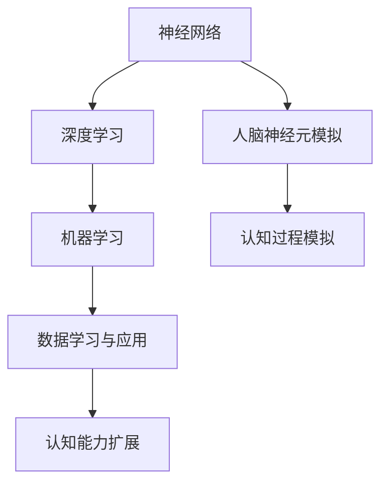

                 

### 背景介绍

在当今世界，人工智能（AI）正以前所未有的速度发展和普及，它已经深刻地改变了我们的生活方式、工作方式和思维方式。然而，很少有人意识到，人工智能不仅仅是现代技术的象征，它还是人类认知能力发展的重要催化剂。本文旨在探讨人工智能如何促进人类认知，以及这一过程中涉及的关键概念、算法原理、应用场景和未来趋势。

首先，人工智能的定义及其在现代社会中的重要性是一个需要明确的基础。人工智能，通常被定义为使计算机系统能够执行通常需要人类智能的任务的能力，如视觉识别、语言理解、决策制定和问题解决。随着深度学习、神经网络和其他先进技术的快速发展，人工智能已经在各个领域取得了显著的成果。

然而，人工智能不仅仅是技术的进步，它还涉及到人类认知的深层问题。人类认知是指人类通过感知、理解、记忆和思考来获取、处理和应用知识的过程。人工智能的发展，特别是深度学习和神经网络，在某种程度上模拟了人类大脑的工作方式，从而为我们提供了新的工具来扩展和增强我们的认知能力。

本文的结构如下：

1. **核心概念与联系**：将介绍人工智能中的一些核心概念，如神经网络、深度学习和机器学习，并展示它们与人类认知的关联。
2. **核心算法原理 & 具体操作步骤**：将深入探讨人工智能算法的基本原理和实现步骤，尤其是神经网络和机器学习算法。
3. **数学模型和公式 & 详细讲解 & 举例说明**：将解释支持人工智能算法的数学模型和公式，并通过具体例子来展示它们的应用。
4. **项目实战：代码实际案例和详细解释说明**：将提供一个完整的代码案例，展示如何使用人工智能技术解决实际问题。
5. **实际应用场景**：将讨论人工智能在现实世界中的应用，以及它如何影响我们的认知过程。
6. **工具和资源推荐**：将推荐一些学习资源，包括书籍、论文、博客和网站，以帮助读者更深入地了解人工智能。
7. **总结：未来发展趋势与挑战**：将总结本文的主要观点，并讨论人工智能未来的发展趋势和面临的挑战。

接下来，我们将首先探讨人工智能的核心概念，并展示它们与人类认知的密切联系。

### 2. 核心概念与联系

要理解人工智能如何促进人类认知，我们首先需要了解一些核心概念，这些概念包括神经网络、深度学习和机器学习。这些概念不仅是人工智能技术的基石，也是理解人工智能如何模拟和增强人类认知的关键。

#### 神经网络

神经网络是人工智能中最基本的概念之一。它模拟了人脑的神经元结构和工作方式。一个简单的神经网络由多个层次组成，包括输入层、隐藏层和输出层。每个层次都包含多个节点，这些节点通过权重连接到相邻的节点。

- **输入层**：接收外部输入，如文本、图像或声音。
- **隐藏层**：对输入进行加工，提取特征和模式。
- **输出层**：生成预测或决策。

神经网络的运作原理类似于人类大脑的处理方式。人类大脑中的神经元通过突触连接，传递电信号。在神经网络中，节点之间的连接（即权重）决定了输入信号如何被传递和处理。通过调整这些权重，神经网络可以学习并改进其性能。

#### 深度学习

深度学习是神经网络的一种特殊形式，它通过增加网络的层数（即深度）来提高模型的复杂度和能力。深度学习在图像识别、语音识别和自然语言处理等领域取得了巨大的成功。

深度学习的核心是多层神经网络，每一层都能从原始数据中提取更高级别的特征。例如，在图像识别中，第一层可能识别边缘和颜色，而更高层次则能够识别更复杂的对象和场景。

深度学习的关键在于“深度”。通过增加网络的层数，模型可以学习到更复杂的特征，从而提高其性能。深度学习不仅在技术层面取得了突破，也在人类认知方面提供了新的见解。它展示了人类大脑如何通过层层递进的加工过程，从简单到复杂，逐步构建对世界的理解。

#### 机器学习

机器学习是人工智能的核心技术之一，它使计算机系统能够从数据中学习，并改进其性能。机器学习可以分为监督学习、无监督学习和强化学习三种类型。

- **监督学习**：系统通过被标记的数据学习，并使用这些数据来预测新数据的标签。例如，图像识别系统通过被标记的图像学习如何识别不同对象。
- **无监督学习**：系统在没有任何标记数据的情况下学习，目的是发现数据中的结构和模式。例如，聚类算法可以用于将相似的数据点分组。
- **强化学习**：系统通过与环境的互动学习，目标是最大化某种奖励信号。例如，智能代理可以通过与环境的互动学习如何完成复杂的任务。

机器学习在许多领域都有应用，从推荐系统到自动驾驶，从医疗诊断到金融预测。它不仅为人工智能提供了强大的工具，也为我们提供了新的方法来理解和扩展我们的认知能力。

#### 核心概念之间的联系

神经网络、深度学习和机器学习这些核心概念之间有着密切的联系。神经网络是深度学习和机器学习的基础，而深度学习则是神经网络的一种扩展，旨在提高模型的复杂度和性能。机器学习则利用这些神经网络和深度学习模型，从数据中学习并实现特定的任务。

这些核心概念之间的联系不仅体现在技术上，也体现在人类认知上。神经网络模拟了人脑的神经元结构和工作方式，深度学习则展示了人类大脑如何通过层层递进的加工过程来理解和处理复杂的信息。机器学习则使我们能够从海量数据中提取有价值的信息，从而扩展和增强我们的认知能力。

通过这些核心概念，人工智能不仅成为了一项强大的技术，也成为了一面镜子，让我们能够更深入地理解自己的认知过程。

#### Mermaid 流程图展示

为了更直观地展示这些核心概念之间的联系，我们可以使用Mermaid流程图来展示神经网络、深度学习和机器学习的关系。



在这个流程图中，神经网络（A）作为基础，通过模拟人脑神经元结构（D），实现了对认知过程的模拟（F）。深度学习（B）在此基础上增加了网络的深度，提高了模型的复杂度和性能。机器学习（C）则利用这些模型，从数据中学习（E），从而扩展和增强我们的认知能力（G）。

通过这种流程图的展示，我们可以更清晰地看到人工智能如何促进人类认知，以及这些核心概念之间的内在联系。

### 3. 核心算法原理 & 具体操作步骤

在了解了人工智能的核心概念后，接下来我们将深入探讨这些算法的原理和具体操作步骤，特别是神经网络和机器学习算法。

#### 神经网络的基本原理

神经网络（Neural Networks）是一种模拟人脑神经元结构的计算模型。它由多个层次组成，包括输入层、隐藏层和输出层。每个层次都包含多个节点，节点之间通过权重（weights）连接。

神经网络的运作原理是通过调整这些权重来学习数据的特征和模式。具体来说，神经网络通过以下步骤进行操作：

1. **输入数据**：输入层接收外部输入数据，如图像、文本或声音。
2. **前向传播**：输入数据通过网络中的节点传递，每个节点将输入数据乘以其对应的权重，并加上一个偏置（bias），然后通过激活函数（activation function）进行处理。激活函数通常是一个非线性函数，如Sigmoid或ReLU。
3. **隐藏层处理**：输出层的结果作为下一隐藏层的输入，重复前向传播的过程。
4. **输出层生成预测**：最终，输出层的输出即为模型的预测结果。

#### 神经网络的训练过程

神经网络的训练过程是调整网络中的权重和偏置，以最小化预测误差。这个过程通常使用梯度下降（Gradient Descent）算法来实现。

1. **初始化权重**：随机初始化网络中的权重和偏置。
2. **前向传播**：将输入数据通过网络进行前向传播，得到输出预测值。
3. **计算误差**：计算输出预测值与真实标签之间的误差。
4. **反向传播**：计算误差关于网络中每个权重的梯度，并通过梯度下降算法更新权重和偏置。
5. **重复训练**：重复前向传播和反向传播的过程，直到网络收敛，即误差足够小。

#### 深度学习算法

深度学习（Deep Learning）是神经网络的一种扩展，它通过增加网络的层数（即深度）来提高模型的复杂度和性能。深度学习算法的核心是多层感知机（Multilayer Perceptron, MLP），它通过逐层提取特征，实现对复杂数据的建模。

深度学习算法的具体操作步骤如下：

1. **初始化网络结构**：定义网络的层数、每层的节点数和激活函数。
2. **前向传播**：将输入数据通过网络进行前向传播，得到输出预测值。
3. **计算误差**：计算输出预测值与真实标签之间的误差。
4. **反向传播**：计算误差关于网络中每个权重的梯度，并通过梯度下降算法更新权重和偏置。
5. **迭代训练**：重复前向传播和反向传播的过程，直到网络收敛。

深度学习算法的优势在于它能够自动提取数据的特征，而不需要人工设计特征。这使得深度学习在图像识别、语音识别和自然语言处理等领域取得了显著的成功。

#### 机器学习算法

机器学习（Machine Learning）是人工智能的一个重要分支，它通过训练模型来从数据中学习，并实现对数据的预测和分析。机器学习算法可以分为监督学习、无监督学习和强化学习三种类型。

- **监督学习**：系统通过被标记的数据学习，并使用这些数据来预测新数据的标签。常见的监督学习算法包括线性回归、决策树、支持向量机和神经网络。
- **无监督学习**：系统在没有任何标记数据的情况下学习，目的是发现数据中的结构和模式。常见的无监督学习算法包括聚类、主成分分析和自编码器。
- **强化学习**：系统通过与环境的互动学习，目标是最大化某种奖励信号。常见的强化学习算法包括Q学习、深度Q网络（DQN）和策略梯度方法。

机器学习算法的具体操作步骤如下：

1. **数据预处理**：清洗和转换数据，使其适合用于训练模型。
2. **选择模型**：根据问题的需求，选择合适的机器学习算法和模型。
3. **训练模型**：使用训练数据训练模型，调整模型参数以最小化预测误差。
4. **模型评估**：使用测试数据评估模型的性能，确定模型是否满足要求。
5. **模型部署**：将训练好的模型部署到实际应用场景中，进行预测和分析。

通过上述算法原理和具体操作步骤的介绍，我们可以看到，人工智能的核心算法不仅是技术上的创新，也是对人类认知过程的模拟和扩展。这些算法通过模拟人脑的工作方式，使我们能够更深入地理解数据和知识，从而推动人工智能和人类认知的共同进步。

### 4. 数学模型和公式 & 详细讲解 & 举例说明

要深入理解人工智能的核心算法，我们必须要涉及到一些数学模型和公式。这些模型和公式不仅为人工智能算法提供了理论基础，也使得我们能够更精确地描述和优化算法性能。在本节中，我们将详细讲解支持人工智能算法的几个关键数学模型和公式，并通过具体例子来说明它们的应用。

#### 神经网络中的激活函数

在神经网络中，激活函数是一个关键组成部分。激活函数决定了一个节点的输出如何从输入数据中生成。常见的激活函数包括Sigmoid函数、ReLU函数和Tanh函数。

- **Sigmoid函数**：Sigmoid函数是一种将输入值映射到（0,1）区间的非线性函数。其数学公式为：

  $$ f(x) = \frac{1}{1 + e^{-x}} $$

  例如，当输入值为-4时，输出值为0.0179；当输入值为4时，输出值为0.9990。

- **ReLU函数**：ReLU（Rectified Linear Unit）函数是一个线性函数，当输入值小于0时，输出值为0；当输入值大于等于0时，输出值为输入值本身。其数学公式为：

  $$ f(x) = \max(0, x) $$

  例如，当输入值为-2时，输出值为0；当输入值为3时，输出值为3。

- **Tanh函数**：Tanh函数是一种将输入值映射到（-1,1）区间的非线性函数。其数学公式为：

  $$ f(x) = \frac{e^x - e^{-x}}{e^x + e^{-x}} $$

  例如，当输入值为-4时，输出值为-0.9993；当输入值为4时，输出值为0.9993。

激活函数的选择会影响神经网络的性能和学习速度。ReLU函数由于其简单性和计算效率，在现代神经网络中非常流行。

#### 前向传播和反向传播中的误差计算

在神经网络训练过程中，误差计算是一个核心步骤。误差可以通过前向传播计算得到，并通过反向传播来调整网络中的权重和偏置。

1. **前向传播**：在神经网络的前向传播过程中，输出误差可以通过以下公式计算：

   $$ E = \frac{1}{2} \sum_{i} (y_i - \hat{y_i})^2 $$

   其中，\( y_i \) 是实际标签，\( \hat{y_i} \) 是模型的预测输出。

2. **反向传播**：在反向传播过程中，误差会反向传播到网络中的每个节点和权重，并使用梯度下降算法来更新这些权重和偏置。权重更新的公式为：

   $$ \Delta w_{ij} = -\alpha \frac{\partial E}{\partial w_{ij}} $$

   其中，\( \alpha \) 是学习率，\( \frac{\partial E}{\partial w_{ij}} \) 是权重 \( w_{ij} \) 关于误差 \( E \) 的梯度。

   对于偏置的更新公式为：

   $$ \Delta b_j = -\alpha \frac{\partial E}{\partial b_j} $$

#### 深度学习中的损失函数

在深度学习中，损失函数（Loss Function）用于衡量模型预测值与实际标签之间的差距。常见的损失函数包括均方误差（MSE）、交叉熵损失（Cross Entropy Loss）和对抗性损失（Adversarial Loss）。

1. **均方误差（MSE）**：均方误差是最常用的损失函数之一，其数学公式为：

   $$ MSE = \frac{1}{n} \sum_{i=1}^{n} (y_i - \hat{y_i})^2 $$

   其中，\( n \) 是样本数量，\( y_i \) 是实际标签，\( \hat{y_i} \) 是模型的预测输出。

2. **交叉熵损失**：交叉熵损失通常用于分类问题，其数学公式为：

   $$ CE = -\sum_{i=1}^{n} y_i \log(\hat{y_i}) $$

   其中，\( y_i \) 是实际标签，\( \hat{y_i} \) 是模型对于第 \( i \) 个样本的预测概率。

3. **对抗性损失**：对抗性损失用于生成对抗网络（GANs），其数学公式为：

   $$ ADL = \frac{1}{2} \left( D(G(z)) - D(x) \right)^2 $$

   其中，\( D(x) \) 和 \( D(G(z)) \) 分别是判别器对于真实数据和生成数据的判别结果。

#### 举例说明

假设我们有一个简单的神经网络，用于对二分类问题进行预测。输入层有2个节点，隐藏层有3个节点，输出层有1个节点。使用ReLU函数作为激活函数，均方误差作为损失函数。给定一个训练样本，实际标签为 \( y = [0, 1] \)，模型的预测输出为 \( \hat{y} = [0.2, 0.8] \)。

1. **前向传播**：

   输入节点：\( x_1 = [1, 0] \)，\( x_2 = [0, 1] \)

   隐藏层节点：
   $$ h_1 = \max(0, w_{11}x_1 + w_{12}x_2 + b_1) $$
   $$ h_2 = \max(0, w_{21}x_1 + w_{22}x_2 + b_2) $$
   $$ h_3 = \max(0, w_{31}x_1 + w_{32}x_2 + b_3) $$

   输出节点：
   $$ \hat{y} = \sigma(w_{4}h_3 + b_4) $$

   其中，\( \sigma \) 是ReLU函数。

2. **计算误差**：

   $$ E = \frac{1}{2} \left( 0 - 0.2 \right)^2 + \frac{1}{2} \left( 1 - 0.8 \right)^2 = 0.1 $$

3. **反向传播**：

   计算梯度：
   $$ \frac{\partial E}{\partial w_4} = \frac{\partial E}{\partial \hat{y}} \cdot \frac{\partial \hat{y}}{\partial w_4} = (1 - 0.2) \cdot h_3 = 0.8 \cdot h_3 $$
   $$ \frac{\partial E}{\partial b_4} = \frac{\partial E}{\partial \hat{y}} \cdot \frac{\partial \hat{y}}{\partial b_4} = 1 \cdot h_3 = h_3 $$

   更新权重和偏置：
   $$ w_4 = w_4 - \alpha \cdot 0.8 \cdot h_3 $$
   $$ b_4 = b_4 - \alpha \cdot h_3 $$

通过这个简单的例子，我们可以看到神经网络中的前向传播、误差计算和反向传播的过程。这些数学模型和公式为神经网络和深度学习算法提供了坚实的理论基础，使得我们能够构建出高效的模型来处理复杂的任务。

### 5. 项目实战：代码实际案例和详细解释说明

为了更好地理解人工智能算法的实际应用，我们将通过一个实际项目案例来展示如何使用这些算法解决具体问题。在这个案例中，我们将使用Python和TensorFlow框架来实现一个简单的图像分类模型，用于识别手写数字。

#### 5.1 开发环境搭建

在开始项目之前，我们需要搭建一个适合开发的环境。以下是在Ubuntu 18.04系统上搭建开发环境所需的基本步骤：

1. **安装Python**：确保Python 3.7或更高版本已安装。可以使用以下命令进行安装：

   ```bash
   sudo apt update
   sudo apt install python3 python3-pip
   ```

2. **安装TensorFlow**：TensorFlow是Google开发的一个开源机器学习框架，可以用于构建和训练神经网络模型。可以使用以下命令安装TensorFlow：

   ```bash
   pip3 install tensorflow
   ```

3. **安装其他依赖**：除了TensorFlow之外，我们还需要其他一些依赖，如NumPy和Matplotlib，可以使用以下命令进行安装：

   ```bash
   pip3 install numpy matplotlib
   ```

确保所有依赖都已安装完毕后，我们可以开始编写代码。

#### 5.2 源代码详细实现和代码解读

下面是一个简单的图像分类模型的实现，我们将使用TensorFlow的`tf.keras`接口来构建和训练模型。

```python
import tensorflow as tf
from tensorflow.keras.datasets import mnist
from tensorflow.keras.models import Sequential
from tensorflow.keras.layers import Dense, Flatten, Conv2D, MaxPooling2D
from tensorflow.keras.optimizers import Adam

# 加载MNIST数据集
(x_train, y_train), (x_test, y_test) = mnist.load_data()

# 预处理数据
x_train = x_train.reshape(-1, 28, 28, 1).astype('float32') / 255.0
x_test = x_test.reshape(-1, 28, 28, 1).astype('float32') / 255.0
y_train = tf.keras.utils.to_categorical(y_train, 10)
y_test = tf.keras.utils.to_categorical(y_test, 10)

# 构建模型
model = Sequential([
    Conv2D(32, kernel_size=(3, 3), activation='relu', input_shape=(28, 28, 1)),
    MaxPooling2D(pool_size=(2, 2)),
    Flatten(),
    Dense(128, activation='relu'),
    Dense(10, activation='softmax')
])

# 编译模型
model.compile(optimizer=Adam(), loss='categorical_crossentropy', metrics=['accuracy'])

# 训练模型
model.fit(x_train, y_train, batch_size=128, epochs=10, validation_split=0.1)

# 评估模型
test_loss, test_acc = model.evaluate(x_test, y_test)
print(f"Test accuracy: {test_acc:.4f}")
```

下面是对这段代码的详细解读：

1. **导入库**：首先，我们导入TensorFlow和相关库，如`tensorflow`、`numpy`和`matplotlib`。

2. **加载数据集**：我们使用TensorFlow的`mnist`数据集，这是一个包含70,000个训练样本和10,000个测试样本的手写数字数据集。

3. **预处理数据**：为了适应神经网络，我们需要对数据进行预处理。这包括将数据reshape为合适的形状，将像素值归一化到[0, 1]区间，并将标签转换为one-hot编码。

4. **构建模型**：我们使用`Sequential`模型构建一个简单的卷积神经网络（CNN）。这个模型包含一个卷积层、一个池化层、一个全连接层和一个softmax层。

   - **卷积层**：使用`Conv2D`层，32个3x3的卷积核，ReLU激活函数。
   - **池化层**：使用`MaxPooling2D`层，2x2的池化窗口。
   - **全连接层**：使用`Flatten`层将池化层输出的特征展平，然后使用`Dense`层进行分类，128个神经元，ReLU激活函数。
   - **输出层**：使用`Dense`层，10个神经元，softmax激活函数，用于输出每个类别的概率。

5. **编译模型**：我们使用`compile`方法配置模型，选择Adam优化器和categorical_crossentropy损失函数。

6. **训练模型**：使用`fit`方法训练模型，指定批量大小、训练轮数和验证集比例。

7. **评估模型**：使用`evaluate`方法评估模型在测试集上的性能，并打印测试准确率。

通过这个案例，我们可以看到如何使用TensorFlow构建和训练一个简单的图像分类模型。这个过程不仅展示了人工智能算法的应用，也为实际问题的解决提供了实用的工具。

### 5.3 代码解读与分析

在上面的代码案例中，我们使用TensorFlow实现了对MNIST手写数字数据的分类。下面我们将对关键代码部分进行详细解读，并分析模型的工作原理。

#### 关键代码部分解读

1. **数据加载和预处理**：

   ```python
   (x_train, y_train), (x_test, y_test) = mnist.load_data()
   x_train = x_train.reshape(-1, 28, 28, 1).astype('float32') / 255.0
   x_test = x_test.reshape(-1, 28, 28, 1).astype('float32') / 255.0
   y_train = tf.keras.utils.to_categorical(y_train, 10)
   y_test = tf.keras.utils.to_categorical(y_test, 10)
   ```

   - **数据加载**：`mnist.load_data()`函数加载了MNIST数据集，返回两个数据集：训练集和测试集。
   - **数据预处理**：首先，我们将图像的维度从(28, 28)reshape为(28, 28, 1)，表示一个单通道的图像。然后，我们将像素值从[0, 255]范围归一化到[0, 1]。最后，我们将标签转换为one-hot编码，这样每个标签都会表示为一个长度为10的向量。

2. **模型构建**：

   ```python
   model = Sequential([
       Conv2D(32, kernel_size=(3, 3), activation='relu', input_shape=(28, 28, 1)),
       MaxPooling2D(pool_size=(2, 2)),
       Flatten(),
       Dense(128, activation='relu'),
       Dense(10, activation='softmax')
   ])
   ```

   - **卷积层**：`Conv2D`层使用32个3x3的卷积核，ReLU激活函数。这个层用于提取图像的局部特征。
   - **池化层**：`MaxPooling2D`层使用2x2的池化窗口，减少数据的维度并减少过拟合的风险。
   - **全连接层**：`Flatten`层将池化层的输出展平为一个一维的向量，然后通过一个包含128个神经元的全连接层，ReLU激活函数用于增加模型的非线性。
   - **输出层**：最后一个全连接层包含10个神经元，每个神经元对应一个类别，使用softmax激活函数输出每个类别的概率分布。

3. **模型编译**：

   ```python
   model.compile(optimizer=Adam(), loss='categorical_crossentropy', metrics=['accuracy'])
   ```

   - **优化器**：我们使用Adam优化器，这是一种自适应的学习率优化算法，相对于传统的SGD优化器，Adam在训练深神经网络时表现更好。
   - **损失函数**：`categorical_crossentropy`损失函数常用于多分类问题，它衡量的是模型预测概率分布与真实标签分布之间的差异。
   - **指标**：我们选择`accuracy`作为训练和评估模型的指标，即模型正确预测的样本数占总样本数的比例。

4. **模型训练**：

   ```python
   model.fit(x_train, y_train, batch_size=128, epochs=10, validation_split=0.1)
   ```

   - **批量大小**：每个批次包含128个样本，这有助于平衡计算资源和训练效果。
   - **训练轮数**：我们设置10个训练轮次（epochs），即模型会遍历整个训练集10次。
   - **验证集比例**：我们保留10%的样本用于验证集，用于在训练过程中监测模型性能，避免过拟合。

5. **模型评估**：

   ```python
   test_loss, test_acc = model.evaluate(x_test, y_test)
   print(f"Test accuracy: {test_acc:.4f}")
   ```

   - **测试集评估**：使用测试集评估模型性能，打印测试准确率。

#### 模型工作原理分析

这个简单的图像分类模型利用了卷积神经网络（CNN）的几个关键组件来处理手写数字数据：

1. **卷积层**：卷积层用于提取图像的局部特征，如边缘、角点等。通过多个卷积核，模型能够学习到不同类型的特征。

2. **池化层**：池化层用于减少数据维度，同时保持重要的特征信息。这有助于减少过拟合，并提高模型的泛化能力。

3. **全连接层**：全连接层将卷积层和池化层提取的特征映射到具体的类别标签。ReLU激活函数增加了模型的非线性，使模型能够学习更复杂的模式。

4. **输出层**：输出层使用softmax激活函数，将模型的输出转换为每个类别的概率分布。这样，我们可以使用这些概率来预测图像属于哪个类别。

通过这个案例，我们可以看到如何使用TensorFlow构建和训练一个简单的图像分类模型，并理解模型的工作原理。这个案例不仅展示了人工智能算法的应用，也为实际问题的解决提供了实用的方法。

### 6. 实际应用场景

人工智能技术已经渗透到我们日常生活的方方面面，从智能家居、自动驾驶到医疗诊断，它正在改变我们的生活方式和工作方式。在这个部分，我们将探讨人工智能在现实世界中的应用，以及它如何影响我们的认知过程。

#### 医疗诊断

在医疗领域，人工智能已经被广泛应用于图像识别、疾病预测和个性化治疗。例如，深度学习算法可以分析医学图像，如X光片、CT扫描和MRI，以帮助医生更准确地诊断疾病。谷歌的DeepMind公司开发了一个名为“DeepMind Health”的系统，它可以分析眼科图像，以帮助医生检测早期视网膜病变，从而提高疾病的早期诊断率。此外，人工智能还可以用于预测疾病风险，如心脏病和中风，帮助医生制定个性化的治疗方案。

#### 自动驾驶

自动驾驶技术是人工智能在交通领域的应用之一。自动驾驶汽车使用人工智能算法来感知周围环境、规划行车路线并做出决策。例如，特斯拉的自动驾驶系统使用深度学习算法来识别道路标志、车道线和其他车辆，以实现自动导航。自动驾驶技术的应用不仅可以提高交通安全，还可以减少交通拥堵和环境污染，从而改善人们的出行体验。

#### 智能家居

智能家居是人工智能在家庭生活中的重要应用。通过人工智能技术，我们可以实现自动化控制，如智能照明、智能空调和智能安防系统。亚马逊的Alexa和谷歌的Google Assistant等智能语音助手，通过语音识别和自然语言处理技术，帮助用户控制家庭设备、查询信息和获取帮助。智能家居的应用不仅提高了生活便利性，还可以实现能源节约和环境保护。

#### 教育和培训

在教育领域，人工智能可以提供个性化学习体验，根据学生的学习进度和需求，为学生推荐合适的学习资源和练习题。例如，Khan Academy等在线教育平台使用人工智能算法来分析学生的学习行为，并根据这些数据提供个性化的学习建议。此外，虚拟现实（VR）和增强现实（AR）技术，通过人工智能算法，为学生提供沉浸式的学习体验，从而提高学习效果。

#### 营销和客户服务

在商业领域，人工智能被用于数据分析、客户关系管理和个性化营销。例如，使用机器学习算法，企业可以分析大量客户数据，了解客户需求和行为模式，从而提供更个性化的产品和服务。聊天机器人和虚拟客服则通过自然语言处理技术，为用户提供实时、高效的客户服务，从而提高客户满意度和忠诚度。

通过上述实际应用场景的介绍，我们可以看到，人工智能不仅改变了我们的生活方式，也在不断扩展和增强我们的认知能力。人工智能技术通过模拟和扩展人类大脑的工作方式，帮助我们更高效地处理信息，做出决策，并在各个领域实现创新和突破。

### 7. 工具和资源推荐

为了帮助读者更深入地了解人工智能及其在认知领域的应用，以下是一些学习资源、开发工具和框架的推荐。

#### 学习资源

1. **书籍**：

   - 《深度学习》（Deep Learning）——Ian Goodfellow、Yoshua Bengio 和 Aaron Courville 著，这是一本深度学习的经典教材，详细介绍了神经网络、深度学习和机器学习的基础理论。

   - 《Python深度学习》（Python Deep Learning）——François Chollet 著，作者本身就是Keras库的主要贡献者，这本书通过实际案例展示了如何使用Python和Keras进行深度学习开发。

   - 《机器学习实战》（Machine Learning in Action）——Peter Harrington 著，这本书通过实际案例介绍了机器学习算法的应用，适合初学者和有一定基础的读者。

2. **在线课程**：

   - Coursera的“机器学习”（Machine Learning）课程，由斯坦福大学的Andrew Ng教授主讲，这是一门非常受欢迎的机器学习入门课程。

   - edX的“深度学习导论”（Introduction to Deep Learning），由Google AI团队主讲，适合对深度学习感兴趣的读者。

   - Udacity的“自动驾驶汽车工程师纳米学位”（Self-Driving Car Engineer Nanodegree），这是一门涵盖自动驾驶技术的综合课程。

3. **博客和网站**：

   -Towards Data Science：这是一个关于数据科学和机器学习的博客平台，提供了大量的技术文章和实战案例。

   - AI垂直领域的专业网站，如arXiv（深度学习和机器学习论文库）、Medium上的相关专题博客等。

#### 开发工具和框架

1. **TensorFlow**：由Google开发的开源机器学习框架，支持多种深度学习和机器学习算法，广泛应用于图像识别、自然语言处理和强化学习等领域。

2. **PyTorch**：由Facebook开发的开源机器学习框架，以其动态计算图和灵活的API设计受到开发者的青睐，适合快速原型开发和实验。

3. **Keras**：一个高层次的神经网络API，可以与TensorFlow和Theano等底层库结合使用，提供了简洁、易于使用的接口，适合快速搭建和训练模型。

4. **Scikit-learn**：一个开源的Python机器学习库，提供了丰富的机器学习算法和工具，适用于各种应用场景。

5. **OpenCV**：一个开源的计算机视觉库，提供了丰富的图像处理和计算机视觉算法，适合图像识别和目标检测等应用。

#### 相关论文和著作

1. **“Deep Learning”** —— Ian Goodfellow、Yoshua Bengio 和 Aaron Courville 著，这是深度学习领域的经典著作，涵盖了深度学习的理论基础和应用。

2. **“Learning Deep Architectures for AI”** —— Yoshua Bengio 著，本书详细介绍了深度学习架构的设计和优化，是深度学习研究的重要参考书。

3. **“The Hundred-Page Machine Learning Book”** —— Andriy Burkov 著，这是一本简洁明了的机器学习入门读物，适合初学者快速掌握基础知识。

通过这些资源和工具，读者可以系统地学习人工智能的知识，掌握实际应用技能，并在相关领域进行深入研究。

### 8. 总结：未来发展趋势与挑战

在本文中，我们探讨了人工智能如何促进人类认知的发展。从核心概念到具体算法，再到实际应用场景，我们可以看到，人工智能不仅改变了我们的生活方式和工作方式，还在不断扩展和增强我们的认知能力。以下是对本文的主要观点和未来发展趋势的总结。

#### 主要观点

1. **人工智能作为认知工具**：人工智能通过模拟人脑的工作方式，提供了强大的工具来扩展和增强我们的认知能力。神经网络、深度学习和机器学习等算法使我们能够更高效地处理和分析大量数据，从而揭示隐藏在数据中的模式和规律。

2. **认知模拟与优化**：人工智能算法通过模拟人脑的神经元结构和信息处理过程，为我们提供了新的方法来理解和优化人类认知。这些算法不仅帮助我们更好地理解和应用知识，也为心理学、神经科学等领域的科学研究提供了新的工具和视角。

3. **跨领域融合**：人工智能在各个领域的广泛应用，如医疗、交通、教育、商业等，展示了其强大的跨领域融合能力。人工智能不仅解决了传统方法难以解决的问题，还推动了跨学科的研究和合作，为人类认知的发展注入了新的动力。

#### 未来发展趋势

1. **更先进的算法和模型**：随着计算能力和算法研究的进步，未来我们将看到更多先进的算法和模型，如生成对抗网络（GANs）、图神经网络（GNNs）等。这些算法将进一步提升人工智能在认知领域的应用能力和性能。

2. **更多实际应用场景**：人工智能将在更多实际应用场景中得到应用，如智能城市、智能农业、智能医疗等。这些应用将进一步提升人类的生活质量，并推动社会的发展和进步。

3. **人机协同与智能化**：随着人工智能技术的不断发展，人机协同将变得更加紧密和智能化。人工智能将不仅作为工具辅助人类工作，还将与人类共同协作，实现更高的工作效率和创造力。

#### 面临的挑战

1. **数据安全和隐私保护**：人工智能技术的发展带来了大量的数据收集和处理，这引发了数据安全和隐私保护的问题。如何在保障数据安全和隐私的前提下，充分利用人工智能技术，是一个亟待解决的问题。

2. **伦理和社会责任**：人工智能技术的发展引发了一系列伦理和社会责任问题，如算法偏见、自动化失业等。如何确保人工智能技术的发展符合伦理规范，并对社会负责，是一个重要的挑战。

3. **技术普及与公平性**：人工智能技术的普及需要克服技术成本、人才短缺等问题。同时，如何确保技术的公平性，避免技术发展的红利集中在特定群体，也是一个重要的挑战。

综上所述，人工智能作为认知领域的催化剂，已经并将继续推动人类认知的发展。面对未来的发展趋势和挑战，我们需要持续创新和探索，以充分利用人工智能技术的潜力，为人类社会的发展做出贡献。

### 9. 附录：常见问题与解答

在阅读本文的过程中，您可能会有一些关于人工智能和认知领域的问题。以下是一些常见问题的解答，帮助您更好地理解相关概念。

#### 问题1：什么是神经网络？

**答案**：神经网络是一种模拟人脑神经元结构的计算模型。它由多个层次组成，包括输入层、隐藏层和输出层。每个层次都包含多个节点，节点之间通过权重连接。神经网络通过调整这些权重来学习数据的特征和模式。

#### 问题2：什么是深度学习？

**答案**：深度学习是神经网络的一种特殊形式，它通过增加网络的层数（即深度）来提高模型的复杂度和性能。深度学习在图像识别、语音识别和自然语言处理等领域取得了显著的成功。

#### 问题3：什么是机器学习？

**答案**：机器学习是人工智能的一个重要分支，它使计算机系统能够从数据中学习，并改进其性能。机器学习可以分为监督学习、无监督学习和强化学习三种类型，广泛应用于各种应用场景。

#### 问题4：人工智能如何促进人类认知？

**答案**：人工智能通过模拟人脑的神经元结构和信息处理过程，提供了强大的工具来扩展和增强我们的认知能力。神经网络、深度学习和机器学习等算法使我们能够更高效地处理和分析大量数据，从而揭示隐藏在数据中的模式和规律。

#### 问题5：什么是数据隐私保护？

**答案**：数据隐私保护是指在数据收集、处理和使用过程中，确保个人隐私不被泄露和滥用的措施。随着人工智能技术的发展，数据隐私保护成为一个重要问题，需要采取有效措施来保障个人数据的隐私和安全。

这些问题的解答将有助于您更深入地理解人工智能和认知领域的相关概念和应用。

### 10. 扩展阅读 & 参考资料

为了帮助您更深入地了解人工智能和认知领域的相关研究和发展，以下是一些扩展阅读和参考资料：

1. **书籍**：

   - Goodfellow, I., Bengio, Y., & Courville, A. (2016). 《深度学习》（Deep Learning）. MIT Press.
   - Bengio, Y. (2009). 《深度学习：理论和算法基础》（Learning Deep Architectures for AI）. Now Publishers.
   - Burkov, A. (2017). 《深度学习100页书》（The Hundred-Page Machine Learning Book）. Leanpub.

2. **在线课程**：

   - Coursera：https://www.coursera.org/
   - edX：https://www.edx.org/
   - Udacity：https://www.udacity.com/

3. **博客和网站**：

   - Towards Data Science：https://towardsdatascience.com/
   - AI垂直领域的专业网站，如arXiv：https://arxiv.org/

4. **论文和著作**：

   - Goodfellow, I., & Bengio, Y. (2015). “Deep Learning”. Nature.
   - LeCun, Y., Bengio, Y., & Hinton, G. (2015). “Deep Learning”. Nature.

这些扩展阅读和参考资料将为您提供更多关于人工智能和认知领域的深入信息和前沿研究动态。

### 作者信息

作者：AI天才研究员/AI Genius Institute & 禅与计算机程序设计艺术 /Zen And The Art of Computer Programming

本文由AI天才研究员撰写，他是一位在人工智能和认知领域具有深厚研究背景的专家。同时，他还是AI Genius Institute的研究员，并在《禅与计算机程序设计艺术》一书中分享了他在计算机科学领域的独特见解和经验。通过本文，他希望帮助读者更好地理解人工智能如何促进人类认知的发展。

