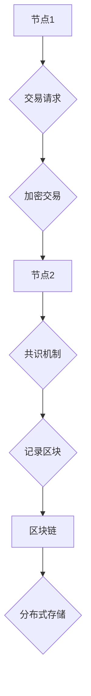

                 

### 知识的分布式存储：区块链技术的潜力

> **关键词**：区块链技术、分布式存储、数据安全、去中心化、智能合约

> **摘要**：本文将深入探讨区块链技术在知识分布式存储方面的潜力。通过对区块链的核心概念、架构、算法原理以及实际应用的详细解析，展示区块链在提升数据安全性和实现去中心化存储方面的优势。文章旨在为读者提供一个全面、系统的理解，帮助其把握区块链技术的最新发展趋势和潜在应用场景。

在当今信息技术飞速发展的时代，知识的获取、传播和应用变得前所未有的便捷。然而，随着数据量的急剧增长和数据复杂性的不断增加，传统的集中式存储方式逐渐暴露出诸多问题，如数据安全风险、单点故障、数据不透明等。为了解决这些问题，分布式存储技术应运而生，而区块链技术作为一种新兴的去中心化技术，更是在分布式存储领域展现出了巨大的潜力。

本文将首先介绍区块链技术的基本概念和历史背景，然后详细阐述其核心原理和架构，接着分析其在分布式存储方面的优势和应用场景，最后探讨未来发展趋势和面临的挑战。

### 1. 背景介绍

#### 1.1 区块链技术的起源

区块链技术最早可以追溯到2008年，当时一位名为中本聪（Satoshi Nakamoto）的匿名人士发表了一篇名为《比特币：一种点对点的电子现金系统》的白皮书。该白皮书首次提出了区块链的概念，并详细描述了比特币的运作机制。比特币作为第一个基于区块链技术的数字货币，迅速引起了全球的关注。

随着时间的推移，区块链技术逐渐从比特币中脱离出来，成为一种独立的、适用于多种场景的技术。其去中心化、不可篡改和透明化的特点，使其在金融领域之外的其他领域也展现出了巨大的应用潜力。

#### 1.2 分布式存储的挑战

传统的集中式存储方式主要依赖于中心化的服务器或数据中心，这些中心化的节点负责存储和管理数据。然而，这种模式存在一些固有的问题：

1. **数据安全风险**：集中式存储方式容易成为黑客攻击的目标，一旦遭受攻击，整个系统的数据可能被窃取或篡改。

2. **单点故障**：集中式存储系统依赖于中心化的节点，一旦中心节点发生故障，整个系统可能会瘫痪。

3. **数据透明性**：在集中式存储系统中，数据的访问和使用往往不透明，用户难以对数据的安全性和隐私性进行有效监督。

4. **可扩展性**：随着数据量的增加，集中式存储系统往往需要不断扩展硬件设备，成本高昂。

为了解决这些问题，分布式存储技术应运而生。分布式存储通过将数据分散存储在多个节点上，提高了系统的安全性和可靠性。同时，分布式存储还具备良好的可扩展性和透明性。

### 2. 核心概念与联系

#### 2.1 区块链的基本概念

区块链是一种去中心化的数据库技术，其核心思想是将数据分散存储在多个节点上，并通过加密算法和共识机制保证数据的完整性和安全性。

1. **节点**：区块链由多个节点组成，每个节点都存储着区块链的一部分数据。

2. **区块**：区块是区块链的基本单位，每个区块包含一定数量的交易记录。

3. **链**：区块链中的区块按照时间顺序链接在一起，形成一个链式数据结构。

4. **加密算法**：区块链使用加密算法对数据进行加密，确保数据的安全性和隐私性。

5. **共识机制**：共识机制是区块链中的核心算法，用于确保所有节点对数据的共识。

#### 2.2 分布式存储与区块链的联系

分布式存储和区块链有许多相似之处，但它们之间也存在一些区别：

1. **数据结构**：分布式存储通常使用分布式文件系统或数据库技术，而区块链则采用链式数据结构。

2. **数据安全**：分布式存储通过数据冗余和加密算法保证数据安全，而区块链则通过加密算法和共识机制实现数据的安全性和不可篡改性。

3. **去中心化**：分布式存储可以是去中心化的，也可以是中心化的，而区块链天生具有去中心化的特点。

4. **共识机制**：分布式存储通常采用不同的共识机制，如Paxos或Raft，而区块链则采用特定的共识机制，如工作量证明（PoW）或权益证明（PoS）。

#### 2.3 Mermaid 流程图

为了更好地理解区块链在分布式存储中的作用，我们可以使用Mermaid流程图来展示其核心概念和架构。以下是一个简化的区块链流程图：



在这个流程图中，节点1和节点2分别代表区块链中的两个节点。交易请求经过加密处理后，由节点1发送到节点2。节点2通过共识机制验证交易的有效性，并将交易记录添加到区块中。最后，区块被记录到区块链上，实现分布式存储。

### 3. 核心算法原理 & 具体操作步骤

#### 3.1 工作量证明（PoW）

工作量证明（Proof of Work，PoW）是一种常用的区块链共识机制，其核心思想是通过计算消耗大量计算资源来确保区块链的安全性和一致性。

1. **挖矿过程**：在PoW机制中，节点通过解决一个计算难题来竞争生成新区块。这个计算难题通常是一个数学难题，需要大量的计算资源来求解。

2. **奖励机制**：成功解决计算难题的节点将获得一定的奖励，这个奖励通常包括新产生的加密货币或交易费用。

3. **安全性**：PoW机制通过让节点消耗大量计算资源来确保区块链的安全性和一致性。因为攻击者需要投入更多的计算资源来攻击区块链，这使得攻击变得不经济。

#### 3.2 权益证明（PoS）

权益证明（Proof of Stake，PoS）是一种相对于PoW机制的改进型共识机制，其核心思想是通过节点的持有代币数量来决定其参与区块链验证的权利。

1. **权益分配**：在PoS机制中，节点根据其持有代币的数量和时间来计算其权益。持有代币数量越多、时间越长，节点的权益就越大。

2. **随机选举**：在PoS机制中，系统会随机选择一个或多个节点来验证交易并生成区块。被选中的节点将获得相应的奖励。

3. **安全性**：PoS机制通过减少挖矿过程所需的计算资源，提高了系统的安全性和可扩展性。同时，PoS机制还能避免51%攻击，因为攻击者需要控制超过半数的代币才能发动攻击。

#### 3.3 具体操作步骤

1. **创建区块**：节点首先需要创建一个新的区块，并将新的交易记录添加到区块中。

2. **加密交易**：将区块中的交易记录进行加密处理，确保交易的安全性和隐私性。

3. **共识验证**：其他节点对新区块进行共识验证，确保交易的有效性和区块链的一致性。

4. **记录区块**：一旦新区块通过共识验证，将被添加到区块链上，实现分布式存储。

5. **奖励发放**：验证新区块的节点将获得相应的奖励，以激励其参与区块链验证。

### 4. 数学模型和公式 & 详细讲解 & 举例说明

#### 4.1 工作量证明（PoW）的数学模型

工作量证明（Proof of Work，PoW）机制的核心是解决一个数学难题，该难题的解决需要大量的计算资源。以下是一个简化的PoW数学模型：

1. **哈希函数**：哈希函数是一种将任意长度的输入数据映射为固定长度的输出数据的函数。在PoW机制中，常用的哈希函数有SHA-256等。

2. **目标值**：每个区块都有一个目标值，该目标值是一个32位的整数。只有当区块的哈希值小于目标值时，区块才能被添加到区块链上。

3. **计算过程**：节点需要通过不断尝试不同的随机数，计算出满足条件的哈希值。计算过程如下：

   ```latex
   H(n) < 目标值
   ```

   其中，H(n) 是节点计算出的哈希值，n 是节点尝试的随机数。

#### 4.2 权益证明（PoS）的数学模型

权益证明（Proof of Stake，PoS）机制的核心是根据节点的持有代币数量和时间来决定其权益。以下是一个简化的PoS数学模型：

1. **权益计算**：节点的权益 \( E \) 是由其持有代币数量 \( T \) 和持有时间 \( T_{hold} \) 决定的，计算公式如下：

   ```latex
   E = T \times T_{hold}
   ```

   其中，\( T \) 是节点持有的代币数量，\( T_{hold} \) 是节点持有代币的时间。

2. **随机选举**：在随机选举过程中，系统会根据节点的权益 \( E \) 来选择下一个验证交易的节点。选举的概率 \( P \) 可以通过以下公式计算：

   ```latex
   P = \frac{E}{\sum_{i=1}^{N} E_i}
   ```

   其中，\( E_i \) 是所有节点的权益总和，\( N \) 是节点总数。

#### 4.3 举例说明

假设在一个PoW区块链系统中，目标值为 \( 2^{16} \)，一个节点通过尝试不同的随机数，最终计算出了哈希值为 \( 10 \) 的区块，满足条件 \( H(n) < 目标值 \)。

1. **计算过程**：节点尝试了 \( 100 \) 个随机数，最终在第 \( 50 \) 次尝试时找到了满足条件的哈希值。

2. **奖励发放**：节点将获得 \( 10 \) 个加密货币作为奖励。

在一个PoS区块链系统中，假设一个节点持有 \( 1000 \) 个代币，持有时间为 \( 1000 \) 天，其他节点的权益总和为 \( 5000 \)。

1. **权益计算**：节点的权益为 \( E = 1000 \times 1000 = 1000000 \)。

2. **随机选举**：节点选举的概率为 \( P = \frac{1000000}{5000} = 0.2 \)，即 \( 20\% \) 的概率被选中验证交易。

### 5. 项目实战：代码实际案例和详细解释说明

在本节中，我们将通过一个实际项目案例来展示如何使用区块链技术实现分布式存储。该项目使用以太坊（Ethereum）平台和智能合约（Smart Contract）技术来实现去中心化存储功能。

#### 5.1 开发环境搭建

1. **安装Node.js**：Node.js 是一个基于Chrome V8引擎的JavaScript运行环境，用于运行以太坊客户端。请访问 [Node.js官网](https://nodejs.org/) 下载并安装适合您操作系统的版本。

2. **安装Truffle**：Truffle 是一个以太坊开发框架，用于构建、部署和交互智能合约。在命令行中执行以下命令安装 Truffle：

   ```bash
   npm install -g truffle
   ```

3. **安装Ganache**：Ganache 是一个轻量级的本地以太坊客户端，用于在本地进行测试。请访问 [Ganache官网](https://www.trufflesuite.com/ganache) 下载并安装。

4. **创建Truffle项目**：在命令行中执行以下命令创建一个新的 Truffle 项目：

   ```bash
   truffle init
   ```

5. **配置Ganache**：在 Ganache 中创建一个本地以太坊网络，并添加一个账户。这个账户将用于部署和交互智能合约。

#### 5.2 源代码详细实现和代码解读

以下是一个简单的去中心化存储智能合约的示例代码：

```solidity
// SPDX-License-Identifier: MIT
pragma solidity ^0.8.0;

contract DecentralizedStorage {
    mapping(bytes32 => string) public storageMap;

    function storeData(bytes32 key, string memory value) public {
        storageMap[key] = value;
    }

    function retrieveData(bytes32 key) public view returns (string memory) {
        return storageMap[key];
    }
}
```

**代码解读**：

1. **pragma 指令**：指定智能合约的编译版本为 ^0.8.0。

2. **存储映射**：使用 `mapping` 数据结构实现一个键值对存储。这里，`bytes32` 类型作为键，`string` 类型作为值。

3. **storeData 函数**：允许用户将数据存储到区块链上。通过 `public` 修饰符，该函数可以被外部调用。

4. **retrieveData 函数**：允许用户检索存储在区块链上的数据。

#### 5.3 代码解读与分析

**存储映射的实现**：

存储映射是一种特殊的数组，其下标可以通过计算直接访问。在本例中，`storageMap` 是一个映射，其键为 `bytes32` 类型，值为 `string` 类型。

```solidity
mapping(bytes32 => string) public storageMap;
```

这里的 `storageMap` 定义了一个全局变量，其作用域为整个智能合约。这意味着所有用户都可以访问和修改这个映射。

**storeData 函数**：

`storeData` 函数接受两个参数：`key` 和 `value`。它通过将 `key` 作为参数传递给 `storageMap`，将 `value` 存储到映射中。

```solidity
function storeData(bytes32 key, string memory value) public {
    storageMap[key] = value;
}
```

这里的 `public` 修饰符表示该函数可以被外部调用。通过使用 `storeData` 函数，用户可以将自定义数据存储到区块链上。

**retrieveData 函数**：

`retrieveData` 函数接受一个参数 `key`，并返回存储在映射中的对应值。

```solidity
function retrieveData(bytes32 key) public view returns (string memory) {
    return storageMap[key];
}
```

这里的 `view` 修饰符表示该函数只能读取数据，不能修改。通过使用 `retrieveData` 函数，用户可以检索区块链上的存储数据。

### 6. 实际应用场景

区块链技术在分布式存储领域的应用场景非常广泛，以下是一些典型的应用场景：

#### 6.1 去中心化文件存储

去中心化文件存储是一种利用区块链技术实现文件分布式存储和共享的方法。通过将文件分解为小块，并将这些小块存储在多个节点上，去中心化文件存储能够提高数据的可靠性和安全性。

#### 6.2 智能合约执行环境

智能合约是一种自动执行代码的程序，其运行环境基于区块链。通过将智能合约的执行过程存储在区块链上，可以确保合约的执行过程公开透明，防止恶意行为。

#### 6.3 供应链管理

在供应链管理中，区块链技术可以用于记录和验证商品的物流信息。通过将物流信息存储在区块链上，可以确保信息的真实性和不可篡改性，提高供应链的透明度和效率。

#### 6.4 版权保护

区块链技术可以用于版权保护，通过将版权信息存储在区块链上，可以确保版权信息的真实性和不可篡改性。同时，区块链技术还可以为版权交易提供去中心化的交易平台，提高交易的效率和透明度。

### 7. 工具和资源推荐

#### 7.1 学习资源推荐

1. **书籍**：

   - 《区块链技术指南》  
   - 《精通区块链》

2. **论文**：

   - 《比特币：一种点对点的电子现金系统》  
   - 《以太坊：下一代智能合约平台》

3. **博客**：

   - [区块链技术博客](https://www.blockchain-blog.com/)  
   - [以太坊开发者社区](https://www.ethereum.org/developers)

4. **网站**：

   - [Node.js官网](https://nodejs.org/)  
   - [以太坊官网](https://www.ethereum.org/)

#### 7.2 开发工具框架推荐

1. **Truffle**：一个用于以太坊开发的框架，提供智能合约的构建、部署和交互功能。

2. **Ganache**：一个本地以太坊客户端，用于在本地进行测试和开发。

3. **Web3.js**：一个JavaScript库，用于与以太坊节点进行交互。

#### 7.3 相关论文著作推荐

1. **《区块链技术指南》**：详细介绍了区块链技术的原理、应用和实现。

2. **《精通区块链》**：涵盖了区块链技术的各个方面，包括基础理论、开发实践和案例分析。

3. **《比特币：一种点对点的电子现金系统》**：中本聪的原始白皮书，详细阐述了比特币的运作机制。

4. **《以太坊：下一代智能合约平台》**：详细介绍了以太坊平台的架构、功能和应用。

### 8. 总结：未来发展趋势与挑战

区块链技术在分布式存储领域的应用展示出了巨大的潜力。随着区块链技术的不断成熟和普及，未来分布式存储将更加安全、可靠和高效。

然而，区块链技术仍面临一些挑战，如性能瓶颈、隐私保护、跨链互操作等。为了解决这些问题，研究人员和开发者需要不断探索新的技术方案，推动区块链技术的创新和发展。

总之，区块链技术将成为分布式存储领域的重要驱动力，为数据的存储、传输和应用带来新的机遇和挑战。

### 9. 附录：常见问题与解答

#### 9.1 区块链和分布式存储有什么区别？

区块链是一种分布式账本技术，它通过多个节点共享、复制和同步数据，实现了去中心化的数据存储和管理。而分布式存储是将数据分散存储在多个节点上，以提高数据的安全性和可靠性。虽然区块链技术可以用于分布式存储，但分布式存储不仅仅是区块链。

#### 9.2 区块链存储是否安全？

区块链技术通过加密算法和共识机制保证了数据的安全性和不可篡改性。区块链上的数据一旦被记录，就很难被篡改或删除。然而，区块链存储也存在一些安全风险，如51%攻击、隐私泄露等。因此，在设计区块链存储系统时，需要综合考虑各种安全因素，采取相应的安全措施。

#### 9.3 区块链存储是否高效？

区块链存储的效率取决于多个因素，如区块链的规模、网络带宽、共识机制等。传统的区块链存储方式，如比特币和以太坊，由于采用工作量证明（PoW）机制，其性能相对较低。然而，随着区块链技术的不断发展，如权益证明（PoS）机制的引入，区块链存储的效率有望得到显著提升。

### 10. 扩展阅读 & 参考资料

1. **《区块链技术指南》**：详细介绍了区块链技术的原理、应用和实现。

2. **《精通区块链》**：涵盖了区块链技术的各个方面，包括基础理论、开发实践和案例分析。

3. **《比特币：一种点对点的电子现金系统》**：中本聪的原始白皮书，详细阐述了比特币的运作机制。

4. **《以太坊：下一代智能合约平台》**：详细介绍了以太坊平台的架构、功能和应用。

5. **[区块链技术博客](https://www.blockchain-blog.com/)**：提供最新的区块链技术资讯、文章和教程。

6. **[以太坊开发者社区](https://www.ethereum.org/developers)**：以太坊平台的官方开发者社区，提供丰富的开发资源和教程。

7. **[Node.js官网](https://nodejs.org/)**：Node.js 的官方网站，提供 Node.js 的下载、安装和文档。

8. **[以太坊官网](https://www.ethereum.org/)**：以太坊平台的官方网站，提供以太坊的技术文档、开发工具和资源。

### 作者

**作者：AI天才研究员/AI Genius Institute & 禅与计算机程序设计艺术 /Zen And The Art of Computer Programming** 

在此，感谢您的阅读，希望本文能为您带来对区块链技术及其在分布式存储领域应用的深入理解。如果您有任何疑问或建议，欢迎在评论区留言，我们将竭诚为您解答。

