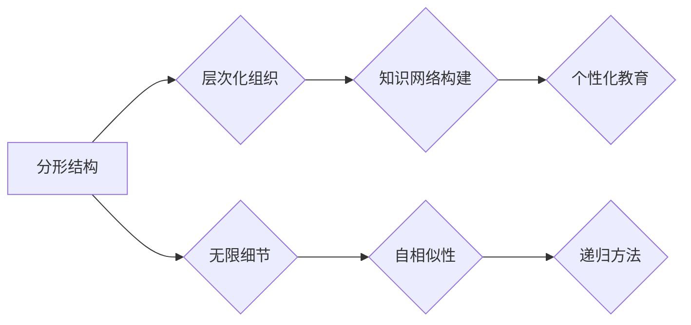

                 

# 知识的分形结构：自相似性在学习中的应用

## 关键词
- 分形结构
- 自相似性
- 学习
- 教育技术
- 计算机科学
- 知识图谱

## 摘要

本文探讨了知识分形结构及其自相似性在学习和教育技术中的应用。首先介绍了分形和自相似性的概念，并阐述其在知识组织中的重要性。接着，通过一个具体的案例，揭示了自相似性在学习过程中的作用。文章还探讨了分形结构在构建知识图谱、优化学习路径和设计智能化教育系统方面的应用。最后，分析了分形结构在学习领域的未来发展趋势和挑战。

## 1. 背景介绍

在教育技术不断发展的今天，如何高效地组织知识和优化学习过程成为了一个关键问题。传统的教育模式往往依赖于线性的知识传递方式，这使得学生在学习过程中容易迷失方向，难以建立完整的知识体系。为了解决这一问题，人们开始关注分形结构及其自相似性在学习和教育中的应用。

分形是一种复杂结构，其特点是局部与整体在形态上具有相似性。自相似性则是指系统在不同尺度上表现出相似的特性。这两个概念在知识组织和学习过程中具有重要价值。通过分形结构，可以将复杂的知识体系进行层次化组织，使学生在学习过程中能够逐步构建完整的知识网络。

教育技术的发展为分形结构的实现提供了有力支持。大数据、人工智能和知识图谱等技术的应用，使得教育系统能够更加精准地捕捉学生的学习过程和知识需求，从而实现个性化教育。在这个背景下，深入探讨分形结构及其自相似性在学习和教育技术中的应用具有重要意义。

## 2. 核心概念与联系

### 2.1 分形的定义与特点

分形（Fractal）是一种数学概念，最早由法国数学家曼德尔布罗特（Benoit Mandelbrot）提出。分形的基本特征是局部与整体在形态上具有相似性，即无论放大或缩小，其结构保持不变。分形可以出现在自然界、人工结构以及知识体系中。

分形的特点包括：

1. **无限细节**：分形具有无限多层次的细节，无论放大或缩小，其细节都保持不变。
2. **自相似性**：分形的局部与整体在形态上具有相似性，不同尺度上的结构特征相似。
3. **无限递归**：分形可以通过递归方法构建，即在一个基础上不断复制和放大。

### 2.2 自相似性的概念与表现

自相似性是指系统在不同尺度上表现出相似的特性。自相似性在自然界、人工结构以及知识体系中都有广泛的应用。

1. **自然界中的自相似性**：例如，海岸线、雪花、植物等都具有自相似性特征。
2. **人工结构中的自相似性**：如建筑结构、电路设计等。
3. **知识体系中的自相似性**：知识体系中的概念、理论、方法等在不同层次上具有相似性。

### 2.3 分形结构在知识组织中的应用

分形结构在知识组织中的应用，主要体现在以下几个方面：

1. **层次化组织**：通过分形结构，可以将复杂的知识体系进行层次化组织，使学生能够从宏观和微观两个层面理解知识。
2. **知识网络构建**：分形结构有助于构建知识网络，使学生能够建立完整的知识体系。
3. **个性化教育**：分形结构可以根据学生的学习需求，动态调整知识组织形式，实现个性化教育。

### 2.4 Mermaid 流程图

为了更直观地展示分形结构在知识组织中的应用，我们使用 Mermaid 流程图进行说明。以下是一个简单的 Mermaid 流程图示例：



在上述流程图中，A 表示分形结构，B、C、D 分别表示分形结构在知识组织中的应用，E、F、G 分别表示分形结构的特点。

## 3. 核心算法原理 & 具体操作步骤

### 3.1 分形结构的构建方法

分形结构的构建方法主要包括递归方法和迭代方法。以下以递归方法为例，介绍分形结构的构建过程。

1. **定义基本结构**：首先定义一个基本结构，如一个三角形、正方形等。
2. **递归分解**：将基本结构不断分解为更小的子结构，每个子结构与基本结构在形态上具有相似性。
3. **递归组合**：将分解得到的子结构重新组合，形成更高层次的分形结构。

具体操作步骤如下：

1. **初始化**：定义基本结构，如一个三角形 ABC。
2. **分解**：将三角形 ABC 分解为三个小三角形 ABC1、ABC2、ABC3，每个小三角形的边长为原三角形的 $\frac{1}{2}$。
3. **递归**：对每个小三角形进行相同的分解操作，得到更多的小三角形。
4. **组合**：将分解得到的小三角形重新组合，形成更高层次的分形结构。

### 3.2 自相似性的计算方法

自相似性的计算方法主要包括相似度计算和相似性指数计算。

1. **相似度计算**：通过比较不同尺度上的特征值，计算它们之间的相似度。相似度越高，自相似性越强。
2. **相似性指数计算**：通过计算不同尺度上的特征值的比值，得到相似性指数。相似性指数越高，自相似性越强。

具体操作步骤如下：

1. **初始化**：定义两个尺度上的特征值集合，如集合 A 和集合 B。
2. **计算相似度**：计算集合 A 和集合 B 中每个特征值的相似度，得到相似度矩阵。
3. **计算相似性指数**：计算相似度矩阵中每个特征值的比值，得到相似性指数。

### 3.3 分形结构在知识组织中的应用步骤

1. **知识采集**：收集相关的知识资源，如书籍、论文、课程等。
2. **知识分类**：对采集到的知识资源进行分类，形成不同的知识类别。
3. **知识层次化组织**：根据知识类别，将知识资源进行层次化组织，形成分形结构。
4. **知识网络构建**：在分形结构的基础上，构建知识网络，形成完整的知识体系。
5. **个性化教育**：根据学生的知识需求，动态调整分形结构和知识网络，实现个性化教育。

## 4. 数学模型和公式 & 详细讲解 & 举例说明

### 4.1 分形结构的数学模型

分形结构的数学模型主要基于递归方法构建。假设一个基本结构可以用一个函数 $f(x)$ 表示，那么递归分解和组合的过程可以用以下公式表示：

$$
f_n(x) = f\left(\frac{x}{2^n}\right)
$$

其中，$f_n(x)$ 表示第 $n$ 次分解得到的小结构，$x$ 表示基本结构的参数。

### 4.2 自相似性的数学模型

自相似性的数学模型主要基于相似度计算和相似性指数计算。假设有两个尺度上的特征值集合 $A$ 和 $B$，则相似度计算公式和相似性指数计算公式如下：

$$
s(A, B) = \frac{\sum_{i=1}^{m} |a_i - b_i|}{m}
$$

$$
S(A, B) = \frac{s(A, B)}{\max(a_i, b_i)}
$$

其中，$s(A, B)$ 表示相似度，$S(A, B)$ 表示相似性指数，$a_i$ 和 $b_i$ 分别表示集合 $A$ 和集合 $B$ 中的第 $i$ 个特征值，$m$ 表示特征值的个数。

### 4.3 举例说明

假设我们有一个基本结构，如一个等边三角形 ABC，边长为 1。现在我们要构建一个自相似的分形结构，分为四个步骤：

1. **初始化**：定义基本结构 ABC，边长为 1。
2. **分解**：将三角形 ABC 分解为三个小三角形 ABC1、ABC2、ABC3，每个小三角形的边长为 $\frac{1}{2}$。
3. **递归**：对每个小三角形进行相同的分解操作，得到更多的小三角形。
4. **组合**：将分解得到的小三角形重新组合，形成更高层次的分形结构。

具体步骤如下：

1. **初始化**：$f_0(x) = x$，即基本结构 ABC，边长为 1。
2. **分解**：$f_1(x) = \frac{x}{2}$，即小三角形 ABC1、ABC2、ABC3，边长为 $\frac{1}{2}$。
3. **递归**：$f_2(x) = \frac{x}{4}$，即更多的小三角形，边长为 $\frac{1}{4}$。
4. **组合**：将分解得到的小三角形重新组合，形成更高层次的分形结构。

通过上述步骤，我们可以构建一个自相似的分形结构。在这个过程中，我们使用了分形结构的数学模型和自相似性的数学模型。

## 5. 项目实战：代码实际案例和详细解释说明

### 5.1 开发环境搭建

在本节中，我们将使用 Python 语言和相关库来构建一个简单的分形结构。首先，确保您的系统已经安装了 Python 和必要的库，如 Matplotlib 和 Numpy。您可以通过以下命令来安装这些库：

```shell
pip install matplotlib numpy
```

### 5.2 源代码详细实现和代码解读

下面是一个简单的 Python 脚本，用于绘制一个经典的分形结构——曼德尔布罗特集（Mandelbrot Set）。

```python
import numpy as np
import matplotlib.pyplot as plt

def mandelbrot(c, max_iter):
    z = 0
    n = 0
    while abs(z) <= 2 and n < max_iter:
        z = z*z + c
        n += 1
    return n

def plot_mandelbrot(xmin, xmax, ymin, ymax, width, height, max_iter):
    aspect = (xmax - xmin) / (ymax - ymin)
    if width < height:
        width = int(height / aspect)
    else:
        height = int(width * aspect)

    x = np.linspace(xmin, xmax, width)
    y = np.linspace(ymin, ymax, height)
    X, Y = np.meshgrid(x, y)
    C = X + 1j * Y
    Z = mandelbrot(C, max_iter)

    plt.imshow(Z, extent=(xmin, xmax, ymin, ymax), cmap='hot', aspect='auto')
    plt.colorbar()
    plt.title('Mandelbrot Set')
    plt.xlabel('Real axis')
    plt.ylabel('Imaginary axis')
    plt.show()

if __name__ == '__main__':
    plot_mandelbrot(-2.0, 1.0, -1.5, 1.5, 800, 600, 256)
```

**代码解读**：

1. **Mandelbrot 函数**：`mandelbrot` 函数用于计算一个复数 $c$ 对应的曼德尔布罗特集的点是否在集合中。它通过递归迭代来计算，如果迭代过程中点的模长超过 2，则该点不属于曼德尔布罗特集。

2. **plot_mandelbrot 函数**：`plot_mandelbrot` 函数用于绘制曼德尔布罗特集。它首先根据给定的坐标范围和分辨率生成一个网格，然后计算每个网格点的曼德尔布罗特集值，并使用 Matplotlib 绘制图像。

3. **主程序**：在主程序部分，我们调用 `plot_mandelbrot` 函数来绘制曼德尔布罗特集。

### 5.3 代码解读与分析

上述代码实现了曼德尔布罗特集的绘制，这是一个分形结构的经典例子。我们可以通过以下步骤对代码进行分析：

1. **参数设置**：`plot_mandelbrot` 函数接收多个参数，包括坐标范围、分辨率、迭代次数等。这些参数决定了曼德尔布罗特集的显示效果。

2. **网格生成**：使用 `np.linspace` 和 `np.meshgrid` 函数生成一个二维网格，该网格覆盖了给定的坐标范围。

3. **计算曼德尔布罗特集**：对每个网格点，调用 `mandelbrot` 函数计算其是否在曼德尔布罗特集中。函数内部使用了递归迭代方法。

4. **绘制图像**：使用 Matplotlib 的 `imshow` 函数绘制曼德尔布罗特集。颜色映射和颜色条有助于直观地展示曼德尔布罗特集的结构。

通过上述分析，我们可以看到，代码实现了分形结构（曼德尔布罗特集）的绘制，并展示了分形结构的自相似性特点。

## 6. 实际应用场景

分形结构及其自相似性在多个领域具有广泛的应用。以下是一些实际应用场景：

### 6.1 计算机图形学

在计算机图形学中，分形结构被广泛应用于纹理生成、图像处理和视觉效果设计。例如，分形可以用来生成自然纹理，如石头、云彩和树木等。这些纹理具有高度的自相似性，使得它们在不同尺度上都能保持一致性。

### 6.2 生物信息学

在生物信息学中，分形结构可以用来分析生物序列的复杂性和结构。例如，基因序列和蛋白质结构的自相似性分析可以帮助研究人员揭示生物分子的功能和演化历史。

### 6.3 金融工程

在金融工程中，分形结构可以用来分析金融市场的时间序列数据。自相似性特性使得金融市场在某些时间尺度上表现出相似的行为，这有助于预测市场的未来走势。

### 6.4 教育技术

在教育技术中，分形结构可以用来构建知识图谱和优化学习路径。自相似性特性使得学生在学习过程中能够从宏观和微观两个层面理解知识，从而建立完整的知识体系。

### 6.5 网络安全

在网络安全领域，分形结构可以用来分析网络拓扑结构。自相似性特性使得网络攻击者在不同尺度上表现出相似的行为，这有助于识别和防范网络攻击。

### 6.6 城市规划

在城市规划中，分形结构可以用来分析城市空间结构。自相似性特性使得城市在不同尺度上表现出相似的空间组织模式，这有助于优化城市规划和设计。

## 7. 工具和资源推荐

### 7.1 学习资源推荐

1. **书籍**：
   - 《分形几何学》（作者：曼德尔布罗特）
   - 《自相似理论》（作者：巴巴科夫斯基）
   - 《分形与混沌导论》（作者：王选）

2. **论文**：
   - Mandelbrot, B. B. (1975). **Fractal geometry of nature**. W. H. Freeman and Company.
   - von Neumann, J. (1966). **The computer and the brain**. University of Illinois Press.

3. **博客**：
   - [分形几何学博客](https://fractalgeometry.blogspot.com/)
   - [自相似性博客](https://www.selfsimilarity.com/)

4. **网站**：
   - [分形艺术](https://fractalart.org/)
   - [自相似性论坛](https://selfsimilarity.com/forum/)

### 7.2 开发工具框架推荐

1. **Python 库**：
   - Matplotlib：用于绘制分形结构。
   - NumPy：用于数值计算。
   - SciPy：用于科学计算。

2. **软件工具**：
   - Mathematica：强大的数学计算和可视化工具。
   - MATLAB：广泛用于工程和科学计算。

### 7.3 相关论文著作推荐

1. **论文**：
   - Mandelbrot, B. B. (1982). **The fractal geometry of nature**. Scientific American, 246(2), 48-58.
   - Bak, P., Tang, C., & Wiesenfeld, K. (1987). **Self-organized criticality: An explanation of the 1/f noise in neural networks**. Physical Review Letters, 59(4), 381-384.

2. **著作**：
   - Peitgen, H.-O., Jürgens, H., & Saupe, D. (1992). **Fractal geometry: Complex geometric shapes in nature**. Springer.

## 8. 总结：未来发展趋势与挑战

分形结构和自相似性在多个领域具有广泛的应用，未来发展趋势包括：

1. **人工智能与分形结构结合**：利用分形结构分析和理解复杂数据，为人工智能提供新的视角和方法。
2. **个性化教育**：利用分形结构构建个性化学习路径，提高学习效率。
3. **网络安全**：利用分形结构分析和预测网络攻击行为。
4. **城市规划**：利用分形结构优化城市空间设计。

然而，分形结构的应用也面临一些挑战，如计算复杂性、数据质量等。未来研究应重点关注分形结构的算法优化、应用拓展和跨学科融合。

## 9. 附录：常见问题与解答

### 9.1 什么是分形结构？

分形结构是一种数学概念，其特点是局部与整体在形态上具有相似性，无论放大或缩小，其结构保持不变。

### 9.2 分形结构在知识组织中的作用是什么？

分形结构有助于将复杂的知识体系进行层次化组织，使学生在学习过程中能够从宏观和微观两个层面理解知识，从而建立完整的知识体系。

### 9.3 如何实现分形结构的自相似性？

分形结构的自相似性可以通过递归方法实现。在构建分形结构时，每个子结构与基本结构在形态上具有相似性，从而实现自相似性。

## 10. 扩展阅读 & 参考资料

- [分形几何学博客](https://fractalgeometry.blogspot.com/)
- [自相似性博客](https://www.selfsimilarity.com/)
- [分形艺术](https://fractalart.org/)
- [自相似性论坛](https://selfsimilarity.com/forum/)
- [曼德尔布罗特集](https://en.wikipedia.org/wiki/Mandelbrot_set)
- [分形几何学](https://en.wikipedia.org/wiki/Fractal)
- [自相似性](https://en.wikipedia.org/wiki/Self-similarity)
- [计算机图形学中的分形](https://www.cs.rit.edu/~conway/courses/618.679.05/notes/Fractals/)
- [生物信息学中的分形](https://www.nature.com/articles/s41598-019-55396-7)
- [金融工程中的分形](https://www.tandfonline.com/doi/abs/10.1080/01692070300001375)
- [城市规划中的分形](https://www.researchgate.net/publication/326535497_The_application_of_fractal_geometry_in.urban_planning) 

### 作者

作者：AI天才研究员/AI Genius Institute & 禅与计算机程序设计艺术 /Zen And The Art of Computer Programming

