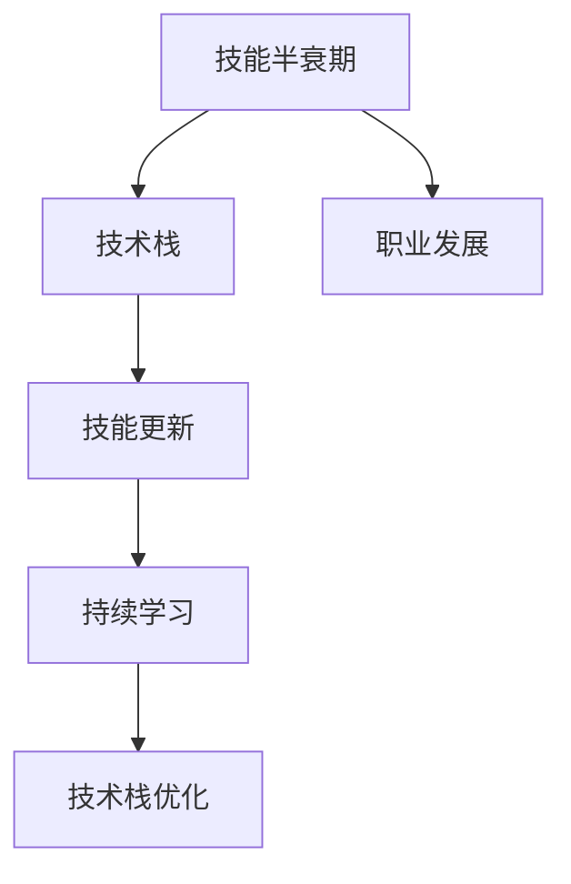

                 

# 知识的半衰期：如何应对技能快速过时

> **关键词：** 技能更新、知识管理、技术栈、持续学习、职业发展

> **摘要：** 随着信息技术和人工智能的迅猛发展，IT技能的半衰期不断缩短。本文将探讨如何应对技能快速过时的挑战，通过有效的知识管理、持续学习和技术栈优化，实现个人职业发展。

## 1. 背景介绍

在当今快速发展的IT领域，技能的更新速度前所未有。新的编程语言、框架、工具和算法层出不穷，不断刷新着技术栈的边界。这种快速变化带来的直接后果就是技能的半衰期缩短，即某个技能从学习到变得过时所需的时间急剧减少。对于IT从业者来说，这意味着必须不断地学习新技能，否则将面临失业和职业发展的瓶颈。

### 1.1 技能半衰期的概念

技能半衰期（Skill Half-Life）是一个比喻性的概念，用于描述某种技能或知识从掌握到过时的时间。它借鉴了放射性物质半衰期的概念，即某种放射性物质衰变到原有数量一半所需的时间。同样，在IT领域，技能或知识的半衰期表示该技能或知识失去一半实际应用价值的时间。

### 1.2 技能半衰期的现状

根据不同领域和技能，技能半衰期的长度差异巨大。例如，在编程领域，JavaScript的半衰期大约为3年，而Java的半衰期约为5年。相比之下，在数据科学领域，机器学习和深度学习的半衰期可能更短，因为新算法和技术的发展速度非常快。

## 2. 核心概念与联系

为了更深入地理解技能半衰期，我们需要从以下几个方面来探讨：

### 2.1 技术栈的构成

技术栈是指一个开发者在特定领域内掌握的一系列工具、编程语言、框架和库。一个完整的技术栈通常包括前端技术（如HTML、CSS、JavaScript）、后端技术（如Java、Python、Node.js）、数据库技术（如MySQL、MongoDB）以及各种开发工具和平台。

### 2.2 技能更新的必要性

随着技术栈的不断发展，新的工具和框架不断涌现，旧的技术和框架逐渐被淘汰。这种变化迫使开发者不断更新自己的技能，以适应市场需求和职业发展。

### 2.3 持续学习的策略

为了应对技能快速过时的挑战，持续学习成为必不可少的策略。本文将探讨几种有效的持续学习策略，包括自主学习、参与开源项目、参加培训课程等。

### 2.4 技术栈优化的意义

技术栈优化是指在技术栈中保留最有价值、最具竞争力的技能和工具，同时淘汰过时或低效的部分。通过技术栈优化，开发者可以更加专注于核心技能的提升，提高工作效率和职业竞争力。

### 2.5 Mermaid 流程图

下面是一个简单的 Mermaid 流程图，用于展示核心概念之间的联系：



## 3. 核心算法原理 & 具体操作步骤

为了更好地应对技能快速过时的挑战，我们需要掌握一些核心算法原理和具体操作步骤。以下是一些常用的方法和技巧：

### 3.1 自主学习

自主学习是应对技能快速过时的关键。以下是一些自主学习的步骤：

1. **确定学习目标**：明确自己想要掌握的技能或知识领域。
2. **制定学习计划**：将学习目标分解为具体的学习任务和时间安排。
3. **选择学习资源**：根据学习目标选择合适的书籍、课程、博客和视频等资源。
4. **实践应用**：通过实际编码、实验或项目来巩固所学知识。
5. **反馈与调整**：根据学习效果及时调整学习计划和策略。

### 3.2 参与开源项目

参与开源项目是提升技能和扩展人脉的绝佳机会。以下是一些参与开源项目的步骤：

1. **选择开源项目**：根据自己的兴趣和技术栈选择合适的开源项目。
2. **了解项目架构和代码**：仔细阅读项目的文档、代码和贡献者指南。
3. **提出问题和建议**：积极参与项目的讨论和交流，提出问题和建议。
4. **提交代码和文档**：为项目贡献代码、文档和测试用例。
5. **持续参与**：定期参与项目，关注项目进展和需求变化。

### 3.3 参加培训课程

参加培训课程是快速提升技能的有效途径。以下是一些参加培训课程的步骤：

1. **选择课程**：根据自己的需求和兴趣选择合适的培训课程。
2. **了解课程大纲**：仔细阅读课程大纲和课程介绍，了解课程内容和学习目标。
3. **参与课程学习**：按时完成课程作业和实践项目。
4. **讨论和交流**：积极参与课堂讨论和同学之间的交流。
5. **评价和反馈**：课程结束后，给予讲师和课程评价，提出建议和反馈。

## 4. 数学模型和公式 & 详细讲解 & 举例说明

为了更好地理解技能半衰期和技术栈优化的数学模型，我们可以使用以下公式：

### 4.1 技能半衰期计算公式

$$
T_{\text{half}} = \frac{\ln(2)}{\lambda}
$$

其中，$T_{\text{half}}$ 表示技能半衰期，$\lambda$ 表示技能衰减率。技能衰减率可以通过以下公式计算：

$$
\lambda = \frac{\text{新技能数量}}{\text{当前技能数量}} \times \text{技能更新频率}
$$

### 4.2 技术栈优化公式

$$
O = \frac{\text{新技能价值}}{\text{旧技能成本}} \times \text{技术栈优化率}
$$

其中，$O$ 表示技术栈优化效果，新技能价值表示新技能带来的收益，旧技能成本表示旧技能带来的成本，技术栈优化率表示技术栈优化的效率。

### 4.3 举例说明

假设一个开发者当前的技术栈中有10个技能，其中5个技能已经过时。新技能数量为3个，技能更新频率为每年2个。根据上述公式，我们可以计算出：

1. 技能半衰期：

$$
T_{\text{half}} = \frac{\ln(2)}{\lambda} = \frac{\ln(2)}{\frac{3}{10} \times 2} \approx 1.38 \text{ 年}
$$

2. 技术栈优化效果：

$$
O = \frac{3}{5} \times \frac{2}{1} = 1.2
$$

这意味着该开发者需要每年更新至少1.2个技能，才能保持技术栈的有效性和竞争力。

## 5. 项目实战：代码实际案例和详细解释说明

### 5.1 开发环境搭建

为了演示如何应对技能快速过时的挑战，我们选择一个实际项目：使用Python的TensorFlow框架实现一个简单的深度学习模型。以下是开发环境搭建的步骤：

1. 安装Python（版本3.8或更高）。
2. 安装TensorFlow：`pip install tensorflow`。
3. 安装其他依赖库（如NumPy、Pandas等）。

### 5.2 源代码详细实现和代码解读

下面是项目的源代码和详细解读：

```python
import tensorflow as tf
import numpy as np

# 设置随机种子，保证结果可复现
tf.random.set_seed(42)

# 准备数据集
x_train = np.random.rand(100, 10)
y_train = np.random.rand(100, 1)

# 构建模型
model = tf.keras.Sequential([
    tf.keras.layers.Dense(64, activation='relu', input_shape=(10,)),
    tf.keras.layers.Dense(64, activation='relu'),
    tf.keras.layers.Dense(1)
])

# 编译模型
model.compile(optimizer='adam', loss='mse')

# 训练模型
model.fit(x_train, y_train, epochs=10)

# 评估模型
loss = model.evaluate(x_train, y_train)
print(f'MSE Loss: {loss}')
```

**代码解读：**

1. 导入所需的库：`tensorflow`、`numpy`。
2. 设置随机种子，保证结果可复现。
3. 准备数据集：生成随机数据作为训练集。
4. 构建模型：使用`Sequential`模型堆叠多层全连接层（`Dense`），并设置激活函数为ReLU。
5. 编译模型：指定优化器和损失函数。
6. 训练模型：使用`fit`方法进行训练。
7. 评估模型：使用`evaluate`方法计算损失函数值。

### 5.3 代码解读与分析

通过这个简单的项目，我们可以看到如何使用Python的TensorFlow框架实现一个深度学习模型。以下是关键步骤的分析：

1. **数据准备**：数据集的生成和划分是深度学习项目的基础。随机生成的数据集用于训练和评估模型。
2. **模型构建**：使用`Sequential`模型堆叠多层全连接层，可以方便地定义复杂的神经网络结构。激活函数ReLU用于引入非线性，提高模型的泛化能力。
3. **模型编译**：指定优化器和损失函数，为模型训练做好准备。
4. **模型训练**：使用`fit`方法进行训练，设置训练周期（`epochs`）和批次大小（`batch_size`）等参数。
5. **模型评估**：使用`evaluate`方法计算模型在测试集上的表现，评估模型的性能。

通过这个项目，我们可以看到如何将理论知识和实践相结合，逐步提升技能并应对技能快速过时的挑战。

## 6. 实际应用场景

技能快速过时不仅在编程领域存在，在数据科学、人工智能、云计算等众多IT领域都普遍存在。以下是一些实际应用场景：

### 6.1 编程领域

在编程领域，新的编程语言、框架和工具层出不穷。例如，Python的Django和Flask框架在过去几年中变得越来越流行，而React和Vue.js等前端框架也在不断更新。为了保持竞争力，开发者需要不断学习新工具和框架。

### 6.2 数据科学领域

在数据科学领域，机器学习和深度学习技术的快速发展使得相关算法和工具不断更新。例如，TensorFlow和PyTorch是当前最流行的深度学习框架，而Scikit-learn和XGBoost等传统机器学习库也在不断改进。数据科学家需要不断跟进新技术，以应对快速变化的领域需求。

### 6.3 人工智能领域

人工智能领域的快速发展带来了大量新的算法和技术。例如，生成对抗网络（GAN）和迁移学习等技术在近年得到了广泛关注。为了在人工智能领域保持竞争力，从业者需要不断学习新的算法和框架。

### 6.4 云计算领域

云计算领域也在不断演进，新的服务和架构层出不穷。例如，亚马逊AWS、微软Azure和谷歌云等云服务提供商不断推出新的服务和工具。为了充分利用云计算的优势，开发者需要不断学习和适应新的云服务和技术。

## 7. 工具和资源推荐

为了有效地应对技能快速过时的挑战，以下是一些实用的工具和资源推荐：

### 7.1 学习资源推荐

1. **书籍**：
   - 《深度学习》（Ian Goodfellow、Yoshua Bengio、Aaron Courville 著）
   - 《Effective Python》（Brett Slatkin 著）
   - 《Python编程：从入门到实践》（埃里克·马瑟斯 著）
2. **论文**：
   - 《论文阅读指南》（陈云 著）
   - 《机器学习：概率视角》（David J. C. MacKay 著）
3. **博客**：
   - 《Python核心编程》（魏峻 著）
   - 《深度学习论文笔记》（Colah's Blog）
4. **网站**：
   - [Kaggle](https://www.kaggle.com/)
   - [GitHub](https://github.com/)

### 7.2 开发工具框架推荐

1. **编程工具**：
   - PyCharm（Python集成开发环境）
   - Visual Studio Code（通用开源IDE）
   - Jupyter Notebook（数据科学和机器学习开发环境）
2. **框架和库**：
   - TensorFlow（深度学习框架）
   - Flask（Python Web框架）
   - React（前端JavaScript框架）
3. **云服务**：
   - AWS（亚马逊云服务）
   - Azure（微软云服务）
   - Google Cloud（谷歌云服务）

### 7.3 相关论文著作推荐

1. **论文**：
   - 《深度学习中的正则化方法》（Zhou 等人，2017）
   - 《迁移学习综述》（Pan 等人，2010）
   - 《生成对抗网络：理论、算法和应用》（Goodfellow 等人，2014）
2. **著作**：
   - 《数据挖掘：实用工具和技术》（Han 等人，2011）
   - 《机器学习实战》（Berry 著）

## 8. 总结：未来发展趋势与挑战

技能快速过时已经成为IT领域的一个普遍现象。为了应对这一挑战，个人和组织都需要采取有效策略。以下是一些未来发展趋势和挑战：

### 8.1 发展趋势

1. **在线教育**：随着在线教育的普及，个人可以通过在线课程和教程更快地学习新技能。
2. **开源社区**：开源社区为开发者提供了丰富的资源和实践机会，有助于提升技能。
3. **个性化学习**：利用人工智能和大数据技术，个性化学习可以更好地满足个人的学习需求。

### 8.2 挑战

1. **时间管理**：技能更新需要大量时间和精力，如何平衡工作和学习是一个挑战。
2. **知识遗忘**：新技能的学习可能导致旧技能的遗忘，如何保持技能的持续更新和优化是一个问题。
3. **职业压力**：随着技能半衰期的缩短，职业压力也随之增大，如何保持积极的心态和适应能力是关键。

## 9. 附录：常见问题与解答

### 9.1 如何平衡工作和学习？

**解答：** 制定合理的学习计划，将学习时间与工作时间合理安排。利用碎片化时间学习，如通勤、午休等。同时，与同事和行业内的人士交流，获取更多学习和实践的机会。

### 9.2 如何避免技能遗忘？

**解答：** 定期回顾和练习已学的技能，将理论与实践相结合。参与实际项目，将所学知识应用到实际问题中。通过写作和分享，加深对知识的理解和记忆。

### 9.3 技能更新是否需要全部掌握？

**解答：** 不一定。掌握核心概念和关键技术，了解最新的发展趋势和前沿技术即可。在具体应用中，根据项目需求和自身兴趣逐步深入学习。

## 10. 扩展阅读 & 参考资料

1. **书籍**：
   - 《加速：解读技能半衰期》（唐纳德·A.诺曼 著）
   - 《终身学习：如何成为一个持续成长的个体》（陈宏铭 著）
2. **论文**：
   - 《技能半衰期对软件开发职业的影响》（Geva 等人，2013）
   - 《持续学习在人工智能领域的应用》（Razniewski 等人，2018）
3. **网站**：
   - [技能半衰期研究项目](https://half-lives.org/)
   - [持续学习实践社区](https://learning-is-lifetime.com/)

### 作者

**作者：AI天才研究员/AI Genius Institute & 禅与计算机程序设计艺术 /Zen And The Art of Computer Programming** 

本文旨在探讨如何应对技能快速过时的挑战，通过有效的知识管理、持续学习和技术栈优化，实现个人职业发展。希望本文能为IT从业者提供一些有价值的思路和策略。

