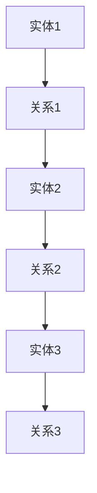

                 

# 知识的可视化：数据可视化与知识图谱

> **关键词：** 数据可视化，知识图谱，知识管理，图形表示，信息可视化

> **摘要：** 本文将探讨数据可视化与知识图谱在知识管理中的应用，通过一步步的分析与推理，深入理解这两个概念的核心原理、实现方法以及在实际场景中的运用。

在信息化社会的浪潮中，知识成为了驱动社会进步的关键力量。然而，知识的存在形式往往复杂而难以理解。为了更好地管理和利用知识，数据可视化和知识图谱成为了解决这一问题的利器。本文将带领读者了解这两个领域的核心概念、关键技术以及它们在实际应用中的重要性。

## 1. 背景介绍

### 1.1 数据可视化的发展

数据可视化是一种将数据以图形或图像的形式展示出来的方法，目的是使数据更易于理解、分析和解释。随着计算机技术的进步，数据可视化从最初的简单图表发展到如今的高级可视化技术，如三维可视化、交互式可视化等。

### 1.2 知识图谱的兴起

知识图谱（Knowledge Graph）是一种用于表示实体及其关系的图形化模型，起源于搜索引擎领域。通过将实体和关系以图的形式表示，知识图谱可以更直观地展示复杂知识结构，为信息检索、数据挖掘和智能问答等应用提供支持。

### 1.3 两者结合的意义

数据可视化和知识图谱的结合，旨在通过可视化手段提升知识管理的效果。一方面，数据可视化提供了直观的展示方式，使知识更容易被理解和利用；另一方面，知识图谱提供了结构化的知识表示，为数据分析提供了坚实的基础。

## 2. 核心概念与联系

### 2.1 数据可视化

**数据可视化定义：** 数据可视化是一种通过图形化手段展示数据的方法，目的是帮助用户更好地理解数据。

**数据可视化分类：**
- **统计图表：** 如柱状图、饼图、折线图等，主要用于展示数据的统计特征。
- **信息可视化：** 如热力图、网络图、树状图等，主要用于展示复杂的数据关系。

### 2.2 知识图谱

**知识图谱定义：** 知识图谱是一种用于表示实体及其关系的图形化模型，通常由节点（代表实体）和边（代表关系）构成。

**知识图谱分类：**
- **结构化知识图谱：** 如WebKB、DBpedia等，主要用于表示明确的结构化数据。
- **语义网络：** 如WordNet、Yago等，主要用于表示语言层面的知识。

### 2.3 两者联系

数据可视化和知识图谱之间的联系主要体现在以下几个方面：
- **数据来源：** 知识图谱中的数据可以来自各种数据源，如数据库、知识库、网络爬虫等，这些数据可以通过数据可视化技术进行展示。
- **知识表示：** 数据可视化技术可以将知识图谱中的实体和关系以更直观的方式展示出来，如网络图、树状图等。
- **交互性：** 知识图谱的交互性可以通过数据可视化技术得以增强，如用户可以点击节点查看相关属性、关系等。

### 2.4 Mermaid 流程图

以下是知识图谱的Mermaid流程图表示：



**解释：**
- **节点（Node）：** 代表知识图谱中的实体，如“实体1”、“实体2”等。
- **边（Edge）：** 代表知识图谱中的关系，如“关系1”、“关系2”等。

## 3. 核心算法原理 & 具体操作步骤

### 3.1 数据可视化算法

**算法原理：**
数据可视化算法的核心是选择合适的图表类型和可视化方法，以最佳地展示数据的特征和关系。

**具体步骤：**
1. **数据预处理：** 清洗和整理原始数据，确保数据质量。
2. **选择图表类型：** 根据数据类型和展示需求选择合适的图表类型。
3. **数据映射：** 将数据映射到图表的视觉属性上，如颜色、大小、形状等。
4. **可视化呈现：** 利用可视化工具将数据呈现出来。

### 3.2 知识图谱算法

**算法原理：**
知识图谱算法的核心是构建和优化知识图谱，以便更好地表示和利用知识。

**具体步骤：**
1. **数据采集：** 从各种数据源收集实体和关系数据。
2. **实体识别：** 从文本中识别出实体，并对其进行分类和标注。
3. **关系抽取：** 从文本中抽取实体之间的关系。
4. **知识融合：** 将不同来源的知识进行整合，构建完整的知识图谱。
5. **知识表示：** 利用图论算法和机器学习技术优化知识图谱的表示。

## 4. 数学模型和公式 & 详细讲解 & 举例说明

### 4.1 数据可视化中的数学模型

**数学模型：**
数据可视化中的数学模型主要包括线性模型、非线性模型等。

**详细讲解：**
- **线性模型：** 如线性回归、线性插值等，主要用于数据的线性变换和拟合。
- **非线性模型：** 如多项式回归、曲线拟合等，主要用于数据的非线性变换和拟合。

**举例说明：**
假设有一组数据点{(x1, y1), (x2, y2), (x3, y3)}，我们可以使用线性回归模型对其进行拟合：

$$y = ax + b$$

其中，a 和 b 是模型参数，可以通过最小二乘法求解。

### 4.2 知识图谱中的数学模型

**数学模型：**
知识图谱中的数学模型主要包括图论算法、机器学习算法等。

**详细讲解：**
- **图论算法：** 如最短路径算法、最小生成树算法等，主要用于知识图谱的优化和查询。
- **机器学习算法：** 如深度学习、支持向量机等，主要用于知识图谱的表示和预测。

**举例说明：**
假设有一个知识图谱，其中包含实体 A 和实体 B 之间的关系 R，我们可以使用最短路径算法计算实体 A 到实体 B 的最短路径：

$$d(A, B) = \min_{P} \{ \sum_{(v, w) \in P} w.d(v, w) \}$$

其中，P 是从 A 到 B 的所有路径，d(v, w) 是路径上的边权重。

## 5. 项目实战：代码实际案例和详细解释说明

### 5.1 开发环境搭建

**环境要求：**
- Python 3.8 或以上版本
- 安装必要的库，如 matplotlib、networkx、neo4j等

**步骤：**
1. 安装 Python 和相关库
2. 配置 Neo4j 数据库

### 5.2 源代码详细实现和代码解读

**代码实现：**

```python
import matplotlib.pyplot as plt
import networkx as nx

# 创建一个空的无向图
G = nx.Graph()

# 添加节点和边
G.add_nodes_from(['A', 'B', 'C', 'D'])
G.add_edges_from([('A', 'B'), ('B', 'C'), ('C', 'D')])

# 绘制知识图谱
nx.draw(G, with_labels=True)

# 显示图形
plt.show()
```

**代码解读：**
1. 导入必要的库
2. 创建一个空的无向图 G
3. 添加节点和边
4. 使用 networkx 的 draw 函数绘制知识图谱
5. 使用 matplotlib 的 show 函数显示图形

### 5.3 代码解读与分析

**解读：**
本段代码通过 networkx 和 matplotlib 实现了一个简单的知识图谱绘制功能。通过添加节点和边，我们可以将知识图谱以图形化的方式展示出来，使得复杂的知识结构更加直观。

**分析：**
1. networkx 是一个强大的图论库，提供了丰富的图操作功能。
2. matplotlib 是一个常用的数据可视化库，可以方便地生成高质量的图表。
3. 通过结合这两个库，我们可以轻松地将知识图谱以图形化的方式展示出来，为知识管理提供支持。

## 6. 实际应用场景

### 6.1 智能问答系统

知识图谱在智能问答系统中有着广泛的应用。通过构建知识图谱，系统可以更准确地理解用户的问题，并提供相关的答案。

### 6.2 语义搜索

知识图谱可以帮助搜索引擎更准确地理解用户查询，从而提供更相关的搜索结果。通过知识图谱中的实体和关系，搜索引擎可以更好地理解查询意图，实现更精确的匹配。

### 6.3 社交网络分析

知识图谱可以用于社交网络分析，如挖掘用户关系、推荐朋友等。通过构建用户和用户之间的关系图谱，社交网络平台可以更好地了解用户社交圈，提供个性化的推荐。

## 7. 工具和资源推荐

### 7.1 学习资源推荐

- **书籍：**
  - 《数据可视化：创造信息图表的艺术》
  - 《知识图谱：概念、方法与应用》
- **论文：**
  - 《知识图谱在智能问答系统中的应用研究》
  - 《知识图谱在语义搜索中的应用》
- **博客：**
  - 《数据可视化实践指南》
  - 《知识图谱构建教程》
- **网站：**
  - Neo4j 官网：https://neo4j.com/
  - D3.js 官网：https://d3js.org/

### 7.2 开发工具框架推荐

- **数据可视化工具：**
  - D3.js：一个用于数据可视化的 JavaScript 库。
  - Plotly：一个用于创建交互式图表的 Python 库。
- **知识图谱框架：**
  - Neo4j：一个基于图形数据库的知识图谱平台。
  - RDF4J：一个用于构建和查询语义网络的开源框架。

### 7.3 相关论文著作推荐

- **论文：**
  - 《知识图谱的表示与推理方法研究》
  - 《数据可视化在知识管理中的应用研究》
- **著作：**
  - 《数据可视化：从理论到实践》
  - 《知识图谱：从理论到应用》

## 8. 总结：未来发展趋势与挑战

### 8.1 发展趋势

- **数据可视化：** 随着人工智能和虚拟现实技术的发展，数据可视化将变得更加智能化和沉浸式。
- **知识图谱：** 知识图谱将逐渐从静态的图谱转变为动态的图谱，实现实时更新和智能推理。

### 8.2 挑战

- **数据质量：** 数据可视化和知识图谱的质量依赖于数据质量，如何处理和整合高质量的数据是关键挑战。
- **算法优化：** 如何设计更高效、更准确的算法来构建和利用知识图谱，是一个长期的挑战。

## 9. 附录：常见问题与解答

### 9.1 数据可视化与知识图谱的区别？

数据可视化是一种展示数据的方法，而知识图谱是一种表示知识的方法。数据可视化侧重于数据的展示，知识图谱侧重于知识的组织和管理。

### 9.2 知识图谱的构建过程是怎样的？

知识图谱的构建过程主要包括数据采集、实体识别、关系抽取、知识融合和知识表示等步骤。

### 9.3 数据可视化工具有哪些？

常见的数据可视化工具包括 D3.js、Plotly、Matplotlib 等。

## 10. 扩展阅读 & 参考资料

- 《数据可视化：创造信息图表的艺术》
- 《知识图谱：概念、方法与应用》
- 《数据可视化在知识管理中的应用研究》
- 《知识图谱在智能问答系统中的应用研究》
- 《Neo4j 官方文档》：https://neo4j.com/docs/
- 《D3.js 官方文档》：https://d3js.org/

