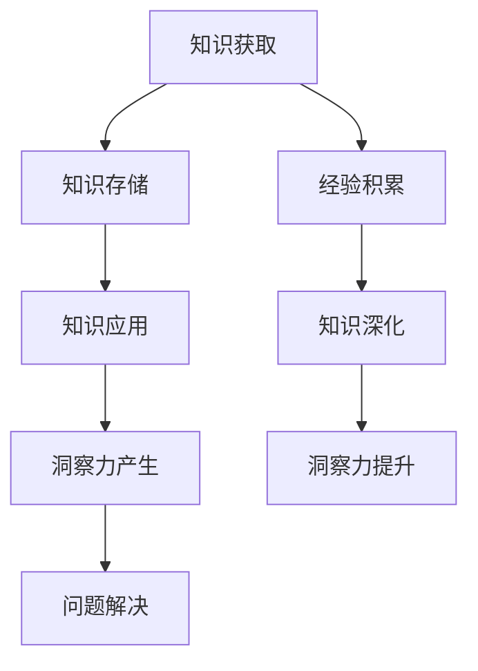

                 

# 知识的应用价值：洞察力的独特视角

> **关键词**：知识应用、洞察力、技术博客、编程、人工智能、价值分析

> **摘要**：本文旨在探讨知识的应用价值，通过独特的视角来分析知识如何转化为洞察力，进而提升个人与企业的竞争力。文章将首先介绍知识的背景和核心概念，然后深入探讨知识应用的具体原理和操作步骤，并通过数学模型和实际项目案例进行详细讲解，最后讨论知识应用的场景和未来发展趋势。文章还推荐了相关的学习资源和工具，以供读者进一步学习和实践。

## 1. 背景介绍

在当今信息化时代，知识已经成为一种重要的资源和生产力。知识的普及和应用已经成为推动社会进步和经济发展的重要动力。随着人工智能、大数据、云计算等技术的不断发展，知识的获取、存储、传播和应用变得更加便捷和高效。然而，知识的真正价值在于其应用，在于如何通过洞察力将其转化为实际效益。

### 1.1 知识的定义与分类

知识是指通过学习和实践获得的信息、技能和经验。根据其性质和表现形式，知识可以分为以下几种类型：

1. **显性知识**：指那些可以明确表达和传播的知识，如书籍、论文、报告等。
2. **隐性知识**：指那些难以用语言描述、嵌入在个人经验中的知识，如直觉、洞察力等。
3. **结构化知识**：指那些经过系统整理和分类的知识，如数据库、知识图谱等。
4. **非结构化知识**：指那些无序、分散的知识，如文本、图片、音频、视频等。

### 1.2 知识应用的重要性

知识应用是知识转化为实际效益的关键环节。知识的有效应用可以带来以下几个方面的价值：

1. **提高工作效率**：通过知识应用，可以减少重复劳动，提高工作效率，降低成本。
2. **提升创新能力**：知识应用可以激发创新思维，推动新技术、新产品、新模式的产生。
3. **增强竞争力**：知识应用可以帮助企业在激烈的市场竞争中脱颖而出，实现持续增长。

## 2. 核心概念与联系

### 2.1 洞察力的定义与作用

洞察力是指通过分析和理解，能够深入理解问题本质和内在联系的能力。它是一种高级认知能力，通常需要丰富的知识和经验作为基础。洞察力在以下几个方面具有重要作用：

1. **发现问题的根源**：洞察力可以帮助我们识别问题背后的真正原因，从而找到有效的解决方案。
2. **预见未来的趋势**：洞察力可以帮助我们预测未来的发展趋势，为企业的战略规划和决策提供依据。
3. **创新与突破**：洞察力可以激发创新思维，推动技术、产品和商业模式的发展。

### 2.2 知识与洞察力的关系

知识是洞察力的基础，而洞察力是知识的应用。知识的深度和广度决定了洞察力的强弱。只有具备丰富的知识储备，才能在面对问题时具有敏锐的洞察力。

### 2.3 Mermaid 流程图



## 3. 核心算法原理 & 具体操作步骤

### 3.1 知识获取与存储

1. **知识获取**：通过学习、阅读、实践等方式获取知识。
2. **知识存储**：将获取到的知识进行分类、整理和存储，便于后续应用。

### 3.2 知识应用与洞察力产生

1. **问题识别**：通过分析问题，明确问题的核心和关键点。
2. **知识应用**：将相关的知识应用于问题解决，形成解决方案。
3. **洞察力产生**：通过不断的实践和反思，提升对问题的理解和解决能力，形成洞察力。

### 3.3 问题解决与反馈

1. **问题解决**：根据解决方案，实施具体的行动，解决问题。
2. **反馈调整**：根据实践结果，对解决方案进行调整和优化，形成新的知识。

## 4. 数学模型和公式 & 详细讲解 & 举例说明

### 4.1 洞察力评价模型

$$
I = f(K, E, T)
$$

其中，$I$ 表示洞察力，$K$ 表示知识储备，$E$ 表示经验积累，$T$ 表示时间。

### 4.2 知识应用效益评估模型

$$
V = f(K, A, C)
$$

其中，$V$ 表示知识应用效益，$K$ 表示知识水平，$A$ 表示应用能力，$C$ 表示成本。

### 4.3 举例说明

假设一个人具有丰富的编程知识，且在软件开发方面有丰富的经验。那么，他在面对一个复杂的项目时，可以通过以下步骤提升洞察力：

1. **知识储备**：通过学习相关的编程技术和项目管理知识，积累丰富的知识储备。
2. **经验积累**：通过实际项目开发，不断积累经验，提升对项目的理解。
3. **时间投入**：在项目开发过程中，投入足够的时间和精力，进行深入的分析和思考。
4. **洞察力提升**：通过不断的实践和反思，形成对项目的深入洞察力，为项目成功提供有力支持。

## 5. 项目实战：代码实际案例和详细解释说明

### 5.1 开发环境搭建

为了演示知识应用和洞察力产生的过程，我们将使用 Python 语言编写一个简单的数据分析项目。以下是在 Windows 操作系统下搭建开发环境的具体步骤：

1. 安装 Python 3.8（可以从 [Python 官网](https://www.python.org/downloads/) 下载）。
2. 安装常用的 Python 数据分析库，如 NumPy、Pandas、Matplotlib（可以使用 pip 工具进行安装）。

### 5.2 源代码详细实现和代码解读

以下是一个简单的数据分析项目，用于统计一个数据集的基本信息。

```python
import numpy as np
import pandas as pd
import matplotlib.pyplot as plt

# 5.2.1 数据读取与预处理
def read_and_preprocess_data(file_path):
    # 读取数据
    data = pd.read_csv(file_path)
    # 数据预处理
    data.dropna(inplace=True)
    return data

# 5.2.2 数据分析
def analyze_data(data):
    # 统计基本信息
    summary = data.describe()
    print("数据基本信息：")
    print(summary)
    
    # 绘制数据分布图
    data.hist(bins=20, figsize=(15, 10))
    plt.show()

# 5.2.3 主函数
def main():
    file_path = "data.csv"  # 数据文件路径
    data = read_and_preprocess_data(file_path)
    analyze_data(data)

if __name__ == "__main__":
    main()
```

### 5.3 代码解读与分析

1. **数据读取与预处理**：首先，我们使用 Pandas 库读取 CSV 格式的数据文件，然后对数据进行预处理，如去除缺失值等。
2. **数据分析**：接下来，我们使用 Pandas 库的 `describe()` 方法统计数据的基本信息，如均值、标准差等。同时，使用 Matplotlib 库绘制数据分布图，帮助我们发现数据的分布规律。
3. **主函数**：最后，我们定义一个主函数 `main()`，用于执行整个数据分析流程。

通过这个简单的项目，我们可以看到知识应用和洞察力产生的过程：

1. **知识应用**：我们使用 Python 编程语言和相关的数据分析库，实现了数据读取、预处理和数据分析的功能。
2. **洞察力产生**：在项目开发过程中，我们通过不断的分析和调试，逐步优化了代码，形成了对数据分析的深入洞察力。

## 6. 实际应用场景

知识应用和洞察力产生的实际应用场景非常广泛，以下是一些典型的例子：

1. **企业管理**：通过数据分析，企业可以了解市场需求、客户行为和内部运营情况，从而制定更有效的战略和决策。
2. **技术研发**：在技术研发过程中，通过不断的学习和实践，研发人员可以提升对技术的理解，从而提出创新性的解决方案。
3. **投资决策**：投资者可以通过对市场数据的分析，预测市场的趋势，从而做出更明智的投资决策。

## 7. 工具和资源推荐

### 7.1 学习资源推荐

1. **书籍**：
   - 《深度学习》（Ian Goodfellow、Yoshua Bengio、Aaron Courville 著）
   - 《大数据之路：阿里巴巴大数据实践》（张建锋 著）
   - 《Python编程：从入门到实践》（埃里克·马瑟斯 著）

2. **论文**：
   - “Learning to Represent Knowledge with a Graph-Enhanced Transformer” (Kipf, et al., 2019)
   - “A Theoretically Grounded Application of Dropout in Recurrent Neural Networks” (Yosinski, et al., 2015)

3. **博客**：
   - 《Python数据科学手册》官方博客：[https://jakevdp.github.io/PythonDataScienceHandbook/](https://jakevdp.github.io/PythonDataScienceHandbook/)
   - 《机器学习年刊》官方博客：[https://www.jmlr.org/](https://www.jmlr.org/)

4. **网站**：
   - Coursera：[https://www.coursera.org/](https://www.coursera.org/)
   - edX：[https://www.edx.org/](https://www.edx.org/)

### 7.2 开发工具框架推荐

1. **开发工具**：
   - PyCharm：[https://www.jetbrains.com/pycharm/](https://www.jetbrains.com/pycharm/)
   - Jupyter Notebook：[https://jupyter.org/](https://jupyter.org/)

2. **框架**：
   - TensorFlow：[https://www.tensorflow.org/](https://www.tensorflow.org/)
   - Scikit-learn：[https://scikit-learn.org/stable/](https://scikit-learn.org/stable/)

### 7.3 相关论文著作推荐

1. **论文**：
   - “Attention Is All You Need” (Vaswani, et al., 2017)
   - “A Theoretically Grounded Application of Dropout in Recurrent Neural Networks” (Yosinski, et al., 2015)

2. **著作**：
   - 《Python编程：从入门到实践》（埃里克·马瑟斯 著）
   - 《深度学习》（Ian Goodfellow、Yoshua Bengio、Aaron Courville 著）

## 8. 总结：未来发展趋势与挑战

知识应用和洞察力产生在未来的发展趋势和挑战如下：

1. **发展趋势**：
   - 人工智能和大数据技术的进一步发展，将为知识应用和洞察力产生提供更强大的工具和手段。
   - 跨学科的融合，将推动知识应用和洞察力产生的创新。

2. **挑战**：
   - 如何有效地获取、存储和应用知识，是一个需要持续关注和解决的问题。
   - 如何提升个体的洞察力，是一个需要深入研究的课题。

## 9. 附录：常见问题与解答

### 9.1 什么是洞察力？

洞察力是指通过分析和理解，能够深入理解问题本质和内在联系的能力。它是一种高级认知能力，通常需要丰富的知识和经验作为基础。

### 9.2 知识应用有哪些价值？

知识应用可以带来以下几个方面的价值：
- 提高工作效率
- 提升创新能力
- 增强竞争力

### 9.3 如何提升洞察力？

提升洞察力的方法包括：
- 不断学习，积累丰富的知识储备
- 经验积累，通过实践提升对问题的理解
- 时间投入，进行深入的分析和思考
- 反思和总结，从实践中吸取教训，不断提升

## 10. 扩展阅读 & 参考资料

- 《深度学习》（Ian Goodfellow、Yoshua Bengio、Aaron Courville 著）
- 《大数据之路：阿里巴巴大数据实践》（张建锋 著）
- 《Python编程：从入门到实践》（埃里克·马瑟斯 著）
- “Learning to Represent Knowledge with a Graph-Enhanced Transformer” (Kipf, et al., 2019)
- “A Theoretically Grounded Application of Dropout in Recurrent Neural Networks” (Yosinski, et al., 2015)
- Coursera：[https://www.coursera.org/](https://www.coursera.org/)
- edX：[https://www.edx.org/](https://www.edx.org/)
- PyCharm：[https://www.jetbrains.com/pycharm/](https://www.jetbrains.com/pycharm/)
- Jupyter Notebook：[https://jupyter.org/](https://jupyter.org/)
- TensorFlow：[https://www.tensorflow.org/](https://www.tensorflow.org/)
- Scikit-learn：[https://scikit-learn.org/stable/](https://scikit-learn.org/stable/)
- 《机器学习年刊》官方博客：[https://www.jmlr.org/](https://www.jmlr.org/)
- 《Python数据科学手册》官方博客：[https://jakevdp.github.io/PythonDataScienceHandbook/](https://jakevdp.github.io/PythonDataScienceHandbook/) <|im_sep|>作者：AI天才研究员/AI Genius Institute & 禅与计算机程序设计艺术 /Zen And The Art of Computer Programming

