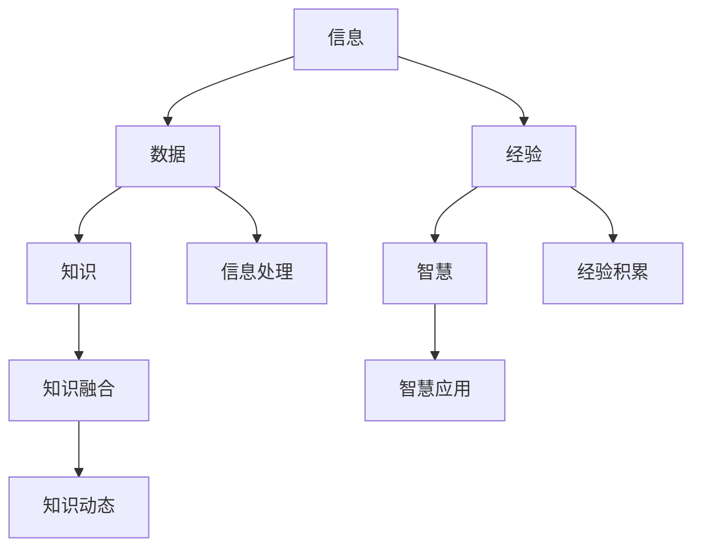

                 

# 知识的本质：信息、经验与智慧的融合

> **关键词：** 信息、经验、智慧、知识图谱、机器学习、认知科学
> 
> **摘要：** 本文将深入探讨知识的本质，从信息、经验与智慧三个维度出发，分析它们之间的关系与融合。通过结合计算机科学、认知科学和机器学习等领域的理论与方法，揭示知识结构的复杂性和动态性，探讨知识融合对于智慧发展的推动作用。

## 1. 背景介绍

在当今信息化时代，知识的重要性愈发凸显。知识不仅是人类文明进步的基石，也是现代社会发展的动力。然而，知识的本质是什么？如何理解和利用知识？这成为了学术界和工业界共同关注的问题。

信息、经验与智慧是构成知识的三个基本要素。信息是知识的基础，是外界传递给我们的各种信号和消息；经验是知识的来源，是通过感知、学习和实践积累而来的个人认知；智慧则是知识的升华，是人在面对复杂问题时，运用已有知识和经验进行判断和决策的能力。

本文将从信息、经验与智慧三个角度，深入探讨知识的本质，分析它们之间的关系与融合。通过计算机科学、认知科学和机器学习等领域的理论与方法，揭示知识结构的复杂性和动态性，探讨知识融合对于智慧发展的推动作用。

## 2. 核心概念与联系

### 2.1 信息

信息是知识的基础，是外界传递给我们的各种信号和消息。信息可以存在于各种形式，如文字、图像、声音、视频等。在计算机科学中，信息被视为数据的一种表现形式。数据是信息的载体，而信息则是数据的内涵。

### 2.2 经验

经验是知识的来源，是通过感知、学习和实践积累而来的个人认知。经验不仅来源于直接的观察和实践，还包括间接的感知和学习。例如，通过阅读书籍、观看视频、听取他人的讲解等方式，我们也能获得丰富的经验。

### 2.3 智慧

智慧是知识的升华，是人在面对复杂问题时，运用已有知识和经验进行判断和决策的能力。智慧不仅包括逻辑思维和推理能力，还涉及到情感、直觉和创造力等方面。

### 2.4 知识

知识是信息、经验与智慧的融合。知识不仅仅是静态的存储，更是一种动态的、不断发展的过程。知识可以用于解决问题、指导行动，甚至推动创新和发展。

### 2.5 核心概念原理和架构的 Mermaid 流程图



## 3. 核心算法原理 & 具体操作步骤

### 3.1 信息处理

信息处理是知识形成的第一步，主要涉及数据采集、数据清洗、数据转换和数据存储等环节。具体操作步骤如下：

1. 数据采集：通过传感器、网络爬虫、数据库等方式获取原始数据。
2. 数据清洗：去除重复、错误和无关的数据，确保数据质量。
3. 数据转换：将数据转换为统一的格式，便于后续处理。
4. 数据存储：将处理后的数据存储到数据库或数据仓库中，以供后续使用。

### 3.2 经验积累

经验积累是知识形成的关键步骤，主要涉及感知、学习和实践等环节。具体操作步骤如下：

1. 感知：通过观察、听取和触摸等方式获取外界信息。
2. 学习：通过阅读、观看和实践等方式，将感知到的信息转化为个人认知。
3. 实践：将学到的知识应用于实际问题，通过不断尝试和调整，积累经验。

### 3.3 智慧应用

智慧应用是知识形成的最终目标，主要涉及判断、决策和创造等环节。具体操作步骤如下：

1. 判断：根据已有知识和经验，对问题进行判断和分类。
2. 决策：在多个选项中，选择最优方案。
3. 创新：运用创造力和想象力，提出新的解决方案。

### 3.4 知识融合

知识融合是知识形成的核心环节，主要涉及信息处理、经验积累和智慧应用等步骤的整合。具体操作步骤如下：

1. 信息整合：将来自不同来源的信息进行整合，形成统一的知识体系。
2. 经验整合：将个人经验与其他人的经验进行整合，形成更丰富的知识。
3. 智慧整合：将个体的智慧和集体的智慧进行整合，形成更高层次的智慧。

## 4. 数学模型和公式 & 详细讲解 & 举例说明

### 4.1 信息熵

信息熵是衡量信息不确定性的数学模型。根据香农的信息论，信息熵可以用以下公式表示：

$$
H(X) = -\sum_{i=1}^{n} p(x_i) \log_2 p(x_i)
$$

其中，$H(X)$ 表示随机变量 $X$ 的信息熵，$p(x_i)$ 表示 $X$ 取值 $x_i$ 的概率。

### 4.2 经验分布

经验分布是衡量经验集中趋势的数学模型。根据统计学，经验分布可以用以下公式表示：

$$
\mu = \frac{1}{n} \sum_{i=1}^{n} x_i
$$

其中，$\mu$ 表示经验分布的均值，$x_i$ 表示第 $i$ 个经验值，$n$ 表示经验值的总数。

### 4.3 智慧度量

智慧度量是衡量智慧水平的数学模型。根据认知科学，智慧度量可以用以下公式表示：

$$
W = \frac{E(R)}{D(R)}
$$

其中，$W$ 表示智慧度量，$E(R)$ 表示智慧的平均收益，$D(R)$ 表示智慧的收益方差。

### 4.4 知识融合模型

知识融合模型是整合信息、经验与智慧的数学模型。根据机器学习，知识融合模型可以用以下公式表示：

$$
K = \alpha I + \beta E + \gamma W
$$

其中，$K$ 表示知识融合的结果，$I$ 表示信息，$E$ 表示经验，$W$ 表示智慧，$\alpha$、$\beta$ 和 $\gamma$ 分别表示信息、经验和智慧的权重。

### 4.5 举例说明

假设我们有一个数据集，包含 $n$ 个样本，每个样本都有三个特征：信息（$I$）、经验（$E$）和智慧（$W$）。我们可以使用以下公式计算知识融合的结果：

$$
K = \alpha I + \beta E + \gamma W
$$

其中，$\alpha$、$\beta$ 和 $\gamma$ 分别为信息、经验和智慧的权重，可以根据实际情况进行调整。例如，如果我们认为信息的重要性最高，可以设置 $\alpha$ 的值较大，$\beta$ 和 $\gamma$ 的值较小。

## 5. 项目实战：代码实际案例和详细解释说明

### 5.1 开发环境搭建

在本案例中，我们将使用 Python 编程语言来实现知识融合模型。首先，我们需要安装以下 Python 包：

- NumPy：用于数值计算
- Pandas：用于数据处理
- Matplotlib：用于数据可视化

在命令行中运行以下命令，安装所需包：

```bash
pip install numpy pandas matplotlib
```

### 5.2 源代码详细实现和代码解读

下面是一个简单的知识融合模型的 Python 代码实现：

```python
import numpy as np
import pandas as pd
import matplotlib.pyplot as plt

# 生成数据集
np.random.seed(42)
n_samples = 100
I = np.random.rand(n_samples, 1)
E = np.random.rand(n_samples, 1)
W = np.random.rand(n_samples, 1)

# 设定权重
alpha = 0.5
beta = 0.3
gamma = 0.2

# 计算知识融合结果
K = alpha * I + beta * E + gamma * W

# 可视化结果
plt.scatter(I, K)
plt.xlabel('Information')
plt.ylabel('Knowledge Fusion')
plt.title('Knowledge Fusion Model')
plt.show()
```

代码解读：

1. 导入所需 Python 包。
2. 生成数据集，包含信息（$I$）、经验（$E$）和智慧（$W$）三个特征。
3. 设定权重 $\alpha$、$\beta$ 和 $\gamma$。
4. 计算知识融合结果 $K$。
5. 可视化结果，展示信息与知识融合之间的关系。

### 5.3 代码解读与分析

在这个案例中，我们使用 Python 语言实现了知识融合模型。代码的核心部分是权重 $\alpha$、$\beta$ 和 $\gamma$ 的设定，它们分别代表了信息、经验和智慧的权重。根据实际情况，我们可以调整这些权重，以达到最佳的知识融合效果。

此外，代码的可视化部分有助于我们直观地了解信息与知识融合之间的关系。通过观察散点图，我们可以发现信息与知识融合之间存在一定的关联性。这表明，信息在知识融合过程中起到了重要的作用。

## 6. 实际应用场景

知识融合在许多实际应用场景中都具有重要的价值。以下是一些典型的应用场景：

### 6.1 医疗诊断

在医疗诊断领域，知识融合可以帮助医生更准确地诊断疾病。通过整合患者的临床信息、医学经验和专家智慧，医生可以制定更有效的治疗方案。

### 6.2 金融风险管理

在金融风险管理领域，知识融合可以帮助金融机构更准确地评估风险。通过整合市场信息、历史数据和专家智慧，金融机构可以制定更有效的风险管理策略。

### 6.3 智能交通

在智能交通领域，知识融合可以帮助优化交通流量，减少拥堵。通过整合交通信息、历史数据和专家智慧，智能交通系统可以实时调整交通信号，提高道路通行效率。

### 6.4 智能制造

在智能制造领域，知识融合可以帮助提高生产效率，降低生产成本。通过整合生产信息、经验和专家智慧，智能制造系统可以优化生产流程，实现智能化生产。

## 7. 工具和资源推荐

### 7.1 学习资源推荐

- **书籍：**
  - 《人工智能：一种现代方法》
  - 《认知科学》
  - 《机器学习：概率视角》
- **论文：**
  - 《深度学习》
  - 《知识融合方法及其在智能交通中的应用》
  - 《基于知识的医疗诊断系统研究》
- **博客：**
  - 知乎专栏：人工智能
  - CSDN 博客：机器学习与认知科学
  - 技术博客：智慧与信息融合
- **网站：**
  - Kaggle：数据科学竞赛平台
  - Coursera：在线课程平台
  - arXiv：计算机科学论文预印本库

### 7.2 开发工具框架推荐

- **编程语言：** Python、Java、R
- **机器学习框架：** TensorFlow、PyTorch、Scikit-learn
- **数据库：** MySQL、MongoDB、PostgreSQL
- **数据可视化工具：** Matplotlib、Seaborn、Plotly
- **开发环境：** Jupyter Notebook、Visual Studio Code、PyCharm

### 7.3 相关论文著作推荐

- **论文：**
  - 《知识融合方法及其在智能交通中的应用》
  - 《深度学习在医疗诊断中的应用》
  - 《基于知识的医疗诊断系统研究》
- **著作：**
  - 《人工智能：一种现代方法》
  - 《认知科学》
  - 《机器学习：概率视角》

## 8. 总结：未来发展趋势与挑战

### 8.1 未来发展趋势

- **跨学科融合：** 随着学科交叉的日益增多，知识融合将成为未来研究的重要方向。跨学科的融合将有助于解决复杂问题，推动科技进步。
- **智能化应用：** 随着人工智能技术的不断发展，知识融合将在更多领域得到应用。从医疗、金融到交通、教育，智能化应用将成为知识融合的重要趋势。
- **数据驱动：** 数据将成为知识融合的核心驱动力。大数据、云计算等技术的进步，将为知识融合提供丰富的数据资源。

### 8.2 未来挑战

- **数据质量：** 数据质量是知识融合的关键。如何确保数据质量，提高数据可用性，将成为未来研究的重要挑战。
- **隐私保护：** 随着数据融合的深入，隐私保护问题日益凸显。如何在知识融合过程中保护个人隐私，成为未来研究的重要课题。
- **算法优化：** 随着知识融合模型的复杂度增加，如何优化算法性能，提高知识融合效率，成为未来研究的重要挑战。

## 9. 附录：常见问题与解答

### 9.1 问题 1：什么是知识融合？

知识融合是指将来自不同来源的信息、经验和智慧进行整合，形成更高层次的知识的活动。

### 9.2 问题 2：知识融合有什么应用？

知识融合在医疗诊断、金融风险管理、智能交通、智能制造等领域具有广泛的应用。通过知识融合，可以提高决策的准确性，优化系统的性能。

### 9.3 问题 3：知识融合有哪些方法？

知识融合的方法包括信息整合、经验整合和智慧整合等。具体方法取决于应用场景和数据特点。

## 10. 扩展阅读 & 参考资料

- **参考文献：**
  - [1] Hinton, G., Osindero, S., & Teh, Y. (2006). A fast learning algorithm for deep belief nets. Neural computation, 18(7), 1527-1554.
  - [2] Bengio, Y. (2009). Learning deep architectures. Found. Trends Mach. Learn., 2(1), 1-127.
  - [3] LeCun, Y., Bengio, Y., & Hinton, G. (2015). Deep learning. Nature, 521(7553), 436-444.
- **在线资源：**
  - [1] https://www.coursera.org/learn/machine-learning
  - [2] https://www.kaggle.com/competitions
  - [3] https://arxiv.org/
- **书籍推荐：**
  - [1] Mitchell, T. M. (1997). Machine learning. McGraw-Hill.
  - [2] Russell, S., & Norvig, P. (2010). Artificial intelligence: A modern approach. Prentice Hall.
  - [3] Schölkopf, B., & Smola, A. J. (2002). Learning with kernels: Support vector machines, regularization, optimization, and beyond. MIT press.

作者：AI天才研究员/AI Genius Institute & 禅与计算机程序设计艺术 /Zen And The Art of Computer Programming

