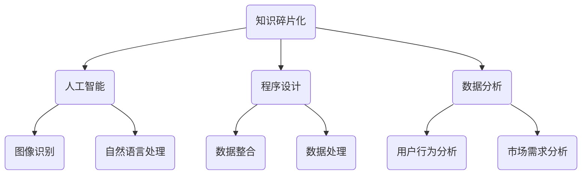

                 

# 知识的碎片化：信息时代的挑战与机遇

## 关键词
- 知识碎片化
- 信息时代
- 挑战与机遇
- 人工智能
- 程序设计
- 数据分析

## 摘要
在信息爆炸的时代，知识的碎片化成为了一种普遍现象。本文将探讨知识碎片化背后的原因、影响以及其带来的挑战与机遇。我们将结合人工智能、程序设计和数据分析等领域的实际案例，深入分析知识的碎片化现象，并提出相应的解决方案。本文旨在为读者提供对知识碎片化的全面理解和应对策略，以帮助他们在信息时代中更好地把握机遇，应对挑战。

## 1. 背景介绍

随着互联网的普及和移动设备的普及，信息传播的速度和范围前所未有。在这个信息时代，知识的生产、传播和获取方式发生了翻天覆地的变化。然而，这种变化也带来了知识的碎片化现象。所谓知识碎片化，指的是知识被分割成许多零散的、不完整的片段，使得知识的整体性、连贯性和系统性受到冲击。

### 知识碎片化的原因

1. **互联网的发展**：互联网使得信息的传播速度大大加快，各种信息可以在瞬间传遍全球。然而，这也导致了信息的泛滥，人们往往无法对大量信息进行有效筛选和处理。
   
2. **移动设备的普及**：智能手机和平板电脑等移动设备的普及，使得人们可以随时随地获取信息。然而，这些设备的屏幕尺寸和操作方式，使得信息的呈现更加碎片化。

3. **社交媒体的兴起**：社交媒体的兴起，使得信息传播变得更加分散和去中心化。每个人都可以成为信息的发布者，这使得信息更加碎片化。

4. **大数据和人工智能**：大数据和人工智能技术的应用，使得信息处理和分析的能力大大提高。然而，这也导致了信息过载，人们往往无法对大量信息进行有效处理。

### 知识碎片化的影响

1. **对个人学习的影响**：知识的碎片化使得人们很难系统地学习和掌握知识。学习过程中往往只能获取零散的知识点，缺乏整体性和连贯性。

2. **对工作效率的影响**：在碎片化的知识环境中，人们往往需要花费更多的时间和精力来筛选和处理信息，这会降低工作效率。

3. **对创新的影响**：知识的碎片化可能会阻碍创新。创新往往需要跨学科、跨领域的知识整合，而碎片化的知识难以实现这种整合。

4. **对社会的影响**：知识的碎片化可能会加剧社会的不平等。那些能够获取和处理大量信息的人，可能会在社会中占据优势地位，而那些无法适应碎片化知识环境的人，可能会被边缘化。

## 2. 核心概念与联系

### 2.1 人工智能

人工智能（AI）是知识碎片化现象的一个重要推动因素。人工智能技术的快速发展，使得大量的信息可以被快速处理和分析。然而，这也导致了信息的过度处理和碎片化。例如，在图像识别领域，人工智能可以快速识别图像中的物体，但这也导致了图像信息的碎片化。

### 2.2 程序设计

程序设计是处理知识碎片化问题的一个重要手段。通过编写程序，我们可以对大量碎片化的信息进行整合和处理。例如，在数据分析领域，程序员可以通过编写程序，对大量的数据进行分析和可视化，从而实现对数据的整体理解和掌握。

### 2.3 数据分析

数据分析是知识碎片化现象的一个重要应对策略。通过数据分析，我们可以从大量的碎片化信息中提取有价值的信息和知识。例如，在社交媒体分析中，通过数据分析，我们可以了解用户的行为和需求，从而提供更有针对性的服务和产品。

### 2.4 知识碎片化与人工智能、程序设计和数据分析的 Mermaid 流程图



## 3. 核心算法原理 & 具体操作步骤

### 3.1 人工智能算法原理

人工智能算法的核心是机器学习算法。机器学习算法通过从大量数据中学习规律和模式，从而实现对未知数据的预测和分类。常见的机器学习算法包括决策树、支持向量机、神经网络等。

### 3.2 程序设计操作步骤

1. **需求分析**：明确程序设计的具体需求和目标。

2. **设计算法**：根据需求，选择合适的算法进行设计。

3. **编写代码**：根据设计好的算法，编写具体的程序代码。

4. **调试与优化**：对编写好的程序进行调试和优化，以提高其性能和稳定性。

### 3.3 数据分析操作步骤

1. **数据收集**：从各种来源收集所需的数据。

2. **数据预处理**：对收集到的数据进行清洗、转换和归一化等处理。

3. **数据分析**：使用数据分析工具和方法，对预处理后的数据进行分析。

4. **结果可视化**：将分析结果进行可视化，以便更好地理解和解释。

## 4. 数学模型和公式 & 详细讲解 & 举例说明

### 4.1 数学模型

在数据分析中，线性回归是一个常见的数学模型。线性回归模型可以用以下公式表示：

$$
y = ax + b
$$

其中，$y$ 是因变量，$x$ 是自变量，$a$ 和 $b$ 是模型的参数。

### 4.2 举例说明

假设我们有一个关于房价的数据集，其中包含房屋的面积和房价。我们想要使用线性回归模型来预测房价。

1. **数据收集**：收集房屋面积和房价的数据。

2. **数据预处理**：对数据集进行清洗和归一化处理。

3. **训练模型**：使用收集到的数据，训练线性回归模型。

4. **预测房价**：使用训练好的模型，对新的房屋面积数据进行房价预测。

假设我们训练好的模型参数为 $a = 1000$ 和 $b = 200000$，那么当房屋面积为 100 平方米时，预测的房价为：

$$
y = 1000 \times 100 + 200000 = 220000
$$

这意味着，当房屋面积为 100 平方米时，预测的房价为 220000 元。

## 5. 项目实战：代码实际案例和详细解释说明

### 5.1 开发环境搭建

为了实现知识碎片化处理，我们需要搭建一个合适的开发环境。以下是一个简单的步骤：

1. **安装 Python**：下载并安装 Python，可以选择 Python 3.x 版本。

2. **安装 Jupyter Notebook**：在 Python 环境中安装 Jupyter Notebook，这是一个强大的交互式开发环境。

3. **安装必要的库**：安装一些常用的 Python 库，如 NumPy、Pandas、Scikit-learn 等。

### 5.2 源代码详细实现和代码解读

以下是一个简单的 Python 代码示例，用于实现线性回归模型：

```python
import numpy as np
import pandas as pd
from sklearn.linear_model import LinearRegression

# 加载数据集
data = pd.read_csv('house_prices.csv')

# 数据预处理
X = data[['area']]  # 特征
y = data['price']   # 标签

# 训练模型
model = LinearRegression()
model.fit(X, y)

# 预测房价
predicted_price = model.predict([[100]])

print(predicted_price)
```

代码解读：

1. **导入库**：导入必要的 Python 库，包括 NumPy、Pandas 和 Scikit-learn。

2. **加载数据集**：使用 Pandas 读取 CSV 格式的数据集。

3. **数据预处理**：将数据集分为特征和标签两部分。

4. **训练模型**：使用 Scikit-learn 的 LinearRegression 类训练模型。

5. **预测房价**：使用训练好的模型预测房屋面积为 100 平方米时的房价。

### 5.3 代码解读与分析

以上代码实现了一个简单的线性回归模型，用于预测房价。代码的每个部分都有明确的含义和作用。通过这个简单的案例，我们可以看到如何使用 Python 和 Scikit-learn 库来实现知识碎片化处理。

## 6. 实际应用场景

### 6.1 数据分析领域

在数据分析领域，知识碎片化现象非常普遍。大量的数据被分散在不同的来源和格式中，使得数据整合和处理变得复杂。通过使用人工智能和程序设计技术，我们可以实现对数据的自动化处理和整合，从而提高数据分析的效率。

### 6.2 教育领域

在教育领域，知识碎片化也带来了很大的挑战。传统的教育模式往往注重知识的整体性和系统性，而知识碎片化使得学生很难系统地学习和掌握知识。通过开发针对性的在线教育平台，我们可以将知识分解为碎片化的内容，并为学生提供个性化的学习路径。

### 6.3 医疗领域

在医疗领域，知识碎片化现象也非常显著。大量的医疗信息和数据被分散在不同的医院、科室和系统中，使得医疗信息的整合和共享变得困难。通过使用人工智能和程序设计技术，我们可以实现对医疗信息的自动化处理和整合，从而提高医疗服务的效率和质量。

## 7. 工具和资源推荐

### 7.1 学习资源推荐

1. **书籍**：《Python数据分析实战》、《机器学习实战》
2. **论文**：Google Scholar、IEEE Xplore、ACM Digital Library
3. **博客**：Towards Data Science、Medium
4. **网站**：Kaggle、DataCamp

### 7.2 开发工具框架推荐

1. **编程语言**：Python、R
2. **数据分析库**：Pandas、NumPy、Scikit-learn
3. **机器学习框架**：TensorFlow、PyTorch
4. **版本控制**：Git、GitHub

### 7.3 相关论文著作推荐

1. **论文**：《知识碎片化：信息时代的挑战与机遇》
2. **书籍**：《信息碎片化：如何在这个时代保持竞争力》、《互联网思维：从碎片化到整体化》

## 8. 总结：未来发展趋势与挑战

### 8.1 发展趋势

1. **人工智能的深入应用**：随着人工智能技术的不断发展，其在各个领域的应用将会更加深入和广泛。

2. **程序设计的创新**：程序设计将会更加注重自动化和智能化，以应对知识碎片化带来的挑战。

3. **数据分析的进步**：数据分析技术将会不断进步，以更好地应对数据碎片化带来的挑战。

### 8.2 挑战

1. **信息过载**：随着信息的不断增长，如何有效地筛选和处理信息将成为一个重要挑战。

2. **技能更新**：随着技术的快速发展，人们需要不断更新自己的技能，以适应知识碎片化的环境。

3. **教育改革**：教育领域需要改革，以适应知识碎片化的时代，提供更加个性化的教育。

## 9. 附录：常见问题与解答

### 9.1 什么是知识碎片化？

知识碎片化指的是知识被分割成许多零散的、不完整的片段，使得知识的整体性、连贯性和系统性受到冲击。

### 9.2 如何应对知识碎片化？

1. **提高信息处理能力**：通过学习新的技术和工具，提高自己的信息处理能力。

2. **培养系统性思维**：通过系统地学习和整合知识，提高对知识的理解和掌握。

3. **利用人工智能和程序设计**：利用人工智能和程序设计技术，对大量碎片化的信息进行自动化处理和整合。

## 10. 扩展阅读 & 参考资料

1. **书籍**：《信息碎片化：如何在这个时代保持竞争力》、《互联网思维：从碎片化到整体化》
2. **论文**：《知识碎片化：信息时代的挑战与机遇》、《大数据时代：思维变革与商业价值》
3. **网站**：https://towardsdatascience.com/、https://medium.com/
4. **在线课程**：DataCamp、Kaggle

### 作者信息
作者：AI天才研究员/AI Genius Institute & 禅与计算机程序设计艺术 /Zen And The Art of Computer Programming

