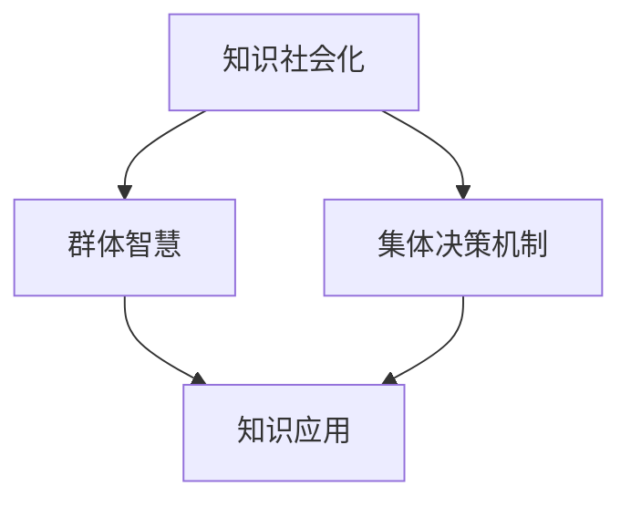

                 

# 知识的社会化：群体智慧与集体决策机制

## 关键词：知识社会化、群体智慧、集体决策、机制设计、协作系统、AI技术

## 摘要

本文将深入探讨知识社会化在群体智慧与集体决策中的重要性。随着信息时代的到来，知识的传播与共享成为推动社会进步的关键因素。本文将从多个维度分析知识社会化的机制，探讨如何通过有效的集体决策机制来激发群体智慧，进而推动创新与发展。我们将结合具体案例，阐述知识社会化在实际应用中的挑战与机遇，并提出相应的解决方案。

## 1. 背景介绍

在现代社会中，知识已经成为一种重要的资源，对于个体、组织和整个社会的发展都至关重要。然而，知识的产生、传播和应用过程并不是线性的，而是一个复杂的社会化过程。知识社会化是指知识在不同个体、群体和组织之间传播、交流、共享和整合的过程。这一过程不仅促进了知识的积累和扩散，而且激发了新的创意和见解，为群体智慧的形成提供了基础。

群体智慧（Collective Intelligence）是指一个群体在协作和互动中表现出的智能和创新能力。与个体智慧不同，群体智慧强调的是个体之间的协作和信息的共享。近年来，随着人工智能和互联网技术的发展，群体智慧在多个领域展现出了巨大的潜力。例如，在科学研究中，科学家们通过合作共享研究成果，加速了科学发现的进程；在商业领域中，公司员工通过协作和共创，推动了产品和服务的创新。

集体决策（Collective Decision-Making）是指多个个体在相互依赖和沟通的基础上，共同作出决策的过程。集体决策在组织和公共治理中扮演着重要角色，它能够平衡不同利益相关者的需求，提高决策的公平性和可持续性。然而，集体决策也存在一定的挑战，如信息不对称、集体行动困境等。

本文将围绕知识社会化、群体智慧和集体决策机制展开讨论，分析它们之间的内在联系，并提出一些有效的机制设计方法，以促进知识的共享和创新。

## 2. 核心概念与联系

### 2.1 知识社会化的概念

知识社会化是一个复杂的过程，涉及知识的生产、传播、共享和应用。首先，知识的生产是个体通过经验积累、学习和创新所获得的结果。其次，知识的传播是指知识在不同个体和群体之间的传递过程，这通常通过教育、交流、媒体和互联网等渠道实现。知识的共享则是指个体或组织将知识与他人分享，以促进知识的扩散和利用。最后，知识的应用是指将知识转化为实际行动和成果，从而推动社会进步。

### 2.2 群体智慧的概念

群体智慧是一个群体在协作和互动中表现出的智能和创新能力。它不仅仅依赖于个体的智能和能力，更重要的是个体之间的协作和信息共享。群体智慧的形成通常需要以下几个条件：

- **多样性**：群体中个体的多样性有助于带来不同的视角和想法，从而提高问题的解决能力。
- **协作**：个体之间的协作能够将个体的知识和能力整合起来，形成更大的智慧。
- **信息共享**：信息的透明和共享是群体智慧形成的关键，它能够减少信息不对称，提高决策效率。
- **反馈机制**：群体智慧的形成需要不断的反馈和调整，以优化决策和协作过程。

### 2.3 集体决策机制的概念

集体决策机制是指个体在相互依赖和沟通的基础上，共同作出决策的过程。有效的集体决策机制需要满足以下几个原则：

- **公平性**：集体决策应该公平地考虑所有利益相关者的需求和意见。
- **效率**：集体决策应该高效，能够在合理的时间内作出决策。
- **可持续性**：集体决策应该考虑到长期的影响和可持续性，以避免短期行为的弊端。
- **透明性**：集体决策的过程和结果应该透明，以便所有利益相关者都能够理解和参与。

### 2.4 知识社会化、群体智慧与集体决策机制的内在联系

知识社会化、群体智慧和集体决策机制之间存在着紧密的联系。首先，知识社会化是群体智慧和集体决策的基础。知识的传播和共享为群体提供了丰富的信息和资源，从而促进了群体智慧的形成。其次，群体智慧是知识社会化的重要表现形式。群体智慧通过协作和共创，将个体的知识和智慧整合起来，形成更大的智慧。最后，集体决策机制是知识社会化和群体智慧的应用。有效的集体决策机制能够将知识转化为实际的行动和成果，从而推动社会的进步。

为了更直观地理解这三者之间的联系，我们可以使用 Mermaid 流程图来展示它们之间的交互关系。



在这个流程图中，知识社会化通过提供信息和资源，促进了群体智慧的形成；群体智慧通过协作和共创，提高了决策的效率和效果；集体决策机制则将知识和社会智慧转化为实际的行动和成果。

## 3. 核心算法原理 & 具体操作步骤

### 3.1 知识社会化算法原理

知识社会化算法的核心在于如何高效地传播和共享知识，以及如何激励个体参与知识的创造和共享。以下是一种基于博弈论的群体智慧算法：

**算法原理：**

1. **个体行为模型**：每个个体 i 都有自己的知识库 \( K_i \) 和行为策略 \( S_i \)。个体可以通过学习 \( L \) 和共享 \( P \) 两种策略来更新自己的知识库。

2. **知识传播模型**：个体之间的知识传播是基于其相互影响力 \( I_{ij} \)，影响力越大，知识传播的速度越快。

3. **共享激励机制**：个体在共享知识时可以获得奖励 \( R \)，激励个体更积极地参与知识共享。

**具体操作步骤：**

1. **初始化**：每个个体初始化自己的知识库和策略。

2. **学习阶段**：每个个体根据其知识库和周围个体的知识，进行知识更新。

3. **共享阶段**：每个个体根据其策略，决定是否共享知识。

4. **激励计算**：系统计算每个个体的共享奖励，更新个体的行为策略。

5. **决策阶段**：所有个体基于共享的知识，共同作出决策。

6. **反馈与调整**：根据决策的结果，系统对个体进行反馈，调整个体的知识库和行为策略。

### 3.2 群体智慧算法原理

群体智慧算法的关键在于如何从多个个体的贡献中提取出有价值的集体智慧。以下是一种基于贝叶斯网络的群体智慧算法：

**算法原理：**

1. **个体贡献模型**：每个个体 i 的贡献可以通过其知识库 \( K_i \) 和协作行为 \( C_i \) 来衡量。

2. **集体智慧模型**：通过贝叶斯网络来建模个体之间的相互依赖关系，提取集体智慧。

3. **优化模型**：使用优化算法（如遗传算法或粒子群算法）来最大化群体智慧。

**具体操作步骤：**

1. **初始化**：构建贝叶斯网络，设定个体贡献模型。

2. **协作阶段**：个体之间进行信息交换和协作，更新各自的知识库。

3. **建模阶段**：使用贝叶斯网络来建模个体之间的依赖关系，提取集体智慧。

4. **优化阶段**：使用优化算法，最大化群体智慧。

5. **决策阶段**：基于集体智慧，个体共同作出决策。

6. **反馈与调整**：根据决策的结果，对个体进行反馈，调整其知识库和行为策略。

### 3.3 集体决策算法原理

集体决策算法的核心在于如何从多个个体的意见中形成一致的决策。以下是一种基于投票机制的集体决策算法：

**算法原理：**

1. **个体意见模型**：每个个体 i 有自己的意见 \( O_i \)，这些意见可以通过不同的指标（如知识水平、经验等）来衡量。

2. **权重模型**：个体之间的权重 \( W_{ij} \) 根据其知识水平和协作行为进行分配。

3. **决策模型**：基于加权投票机制，形成集体决策。

**具体操作步骤：**

1. **初始化**：每个个体初始化自己的意见和权重。

2. **投票阶段**：个体根据自身意见和其他个体权重，进行投票。

3. **决策阶段**：计算加权投票结果，形成集体决策。

4. **反馈与调整**：根据决策结果，对个体进行反馈，调整其意见和权重。

## 4. 数学模型和公式 & 详细讲解 & 举例说明

### 4.1 知识社会化模型

为了更好地理解知识社会化的过程，我们可以使用一个简单的数学模型来描述个体之间的知识传播和共享。

**模型公式：**

\[ K_i(t+1) = K_i(t) + \alpha (K_{avg}(t) - K_i(t)) + \beta R_i(t) \]

其中：

- \( K_i(t) \) 表示个体 i 在时间 t 的知识库。
- \( K_{avg}(t) \) 表示在时间 t 所有个体知识库的平均值。
- \( \alpha \) 表示个体对平均知识的吸收能力。
- \( \beta R_i(t) \) 表示个体 i 在时间 t 的共享奖励。

**模型讲解：**

这个模型描述了个体知识库的更新过程。首先，个体 i 的知识库会受到其自身知识库的影响；其次，个体 i 会根据周围个体的平均知识水平来调整自己的知识库，这体现了个体对知识的吸收能力；最后，个体 i 的知识库还会受到其共享奖励的影响，这激励个体更积极地参与知识共享。

**举例说明：**

假设有三个个体 A、B 和 C，它们在时间 t 的知识库分别为 \( K_A(t) = 10 \)，\( K_B(t) = 8 \)，\( K_C(t) = 12 \)。所有个体在时间 t 的平均知识库为 \( K_{avg}(t) = 10 \)。个体 A 的共享奖励为 \( R_A(t) = 2 \)。

根据模型公式，我们可以计算个体 A 在时间 \( t+1 \) 的知识库：

\[ K_A(t+1) = 10 + \alpha (10 - 10) + \beta \times 2 = 10 + 0 + 2 = 12 \]

### 4.2 群体智慧模型

为了提取群体智慧，我们可以使用一个基于贝叶斯网络的模型来描述个体之间的相互依赖关系。

**模型公式：**

\[ P(C|D) = \frac{P(D|C)P(C)}{P(D)} \]

其中：

- \( P(C|D) \) 表示在个体 D 的贡献已知的情况下，个体 C 的贡献的概率。
- \( P(D|C) \) 表示个体 C 的贡献导致个体 D 的贡献的条件概率。
- \( P(C) \) 表示个体 C 的贡献的概率。
- \( P(D) \) 表示个体 D 的贡献的概率。

**模型讲解：**

这个模型描述了在已知个体 D 的贡献的情况下，如何通过贝叶斯推理来推断个体 C 的贡献。它体现了个体之间相互依赖的关系，从而提取出群体智慧。

**举例说明：**

假设有两个个体 A 和 B，它们分别有自己的知识库和贡献。已知个体 B 的贡献 \( D_B = 0.8 \)，我们需要推断个体 A 的贡献 \( C_A \)。

根据模型公式，我们可以计算 \( P(C_A|D_B) \)：

\[ P(C_A|D_B) = \frac{P(D_B|C_A)P(C_A)}{P(D_B)} \]

假设 \( P(D_B|C_A) = 0.9 \)，\( P(C_A) = 0.5 \)，我们需要计算 \( P(D_B) \)。

假设所有个体贡献的概率均匀分布，即 \( P(D_B) = 0.5 \)。

\[ P(C_A|D_B) = \frac{0.9 \times 0.5}{0.5} = 0.9 \]

这意味着在个体 B 的贡献已知为 0.8 的情况下，个体 A 的贡献的概率为 0.9。

### 4.3 集体决策模型

为了形成集体决策，我们可以使用一个基于加权投票的模型来描述个体之间的决策过程。

**模型公式：**

\[ V_{total} = \sum_{i=1}^{n} W_i V_i \]

其中：

- \( V_{total} \) 表示集体决策的结果。
- \( W_i \) 表示个体 i 的权重。
- \( V_i \) 表示个体 i 的投票结果。

**模型讲解：**

这个模型描述了基于加权投票的集体决策过程。每个个体的投票结果根据其权重进行加权，从而形成整体的决策结果。

**举例说明：**

假设有三个个体 A、B 和 C，它们的权重分别为 \( W_A = 0.4 \)，\( W_B = 0.3 \)，\( W_C = 0.3 \)。个体 A 的投票结果为 1，个体 B 的投票结果为 0，个体 C 的投票结果为 1。

根据模型公式，我们可以计算集体决策的结果：

\[ V_{total} = 0.4 \times 1 + 0.3 \times 0 + 0.3 \times 1 = 0.4 + 0 + 0.3 = 0.7 \]

这意味着集体决策的结果为 0.7。

## 5. 项目实战：代码实际案例和详细解释说明

### 5.1 开发环境搭建

在开始实现知识社会化、群体智慧和集体决策机制之前，我们需要搭建一个合适的开发环境。以下是搭建环境的步骤：

1. 安装 Python 3.8 或更高版本。
2. 安装必要的库，如 NumPy、Pandas、NetworkX 等。
3. 创建一个新的 Python 项目文件夹，并设置虚拟环境。

```shell
pip install numpy pandas networkx
```

### 5.2 源代码详细实现和代码解读

#### 5.2.1 知识社会化算法实现

```python
import numpy as np
import pandas as pd
import networkx as nx

class KnowledgeSocialization:
    def __init__(self, n_individuals, absorption_rate, reward_rate):
        self.n_individuals = n_individuals
        self.absorption_rate = absorption_rate
        self.reward_rate = reward_rate
        self.knowledge_bases = np.random.rand(n_individuals)
        self.strategies = np.random.choice([0, 1], n_individuals)  # 0 表示学习，1 表示共享

    def update_knowledge_bases(self):
        avg_knowledge = np.mean(self.knowledge_bases)
        for i in range(self.n_individuals):
            self.knowledge_bases[i] += self.absorption_rate * (avg_knowledge - self.knowledge_bases[i])

    def share_knowledge(self):
        rewards = np.zeros(self.n_individuals)
        for i in range(self.n_individuals):
            if self.strategies[i] == 1:
                rewards[i] = self.reward_rate
        self.knowledge_bases += self.reward_rate * rewards

    def make_decision(self):
        # 这里可以基于知识库做出具体的决策
        pass

# 实例化知识社会化对象
knowledge_socialization = KnowledgeSocialization(n_individuals=3, absorption_rate=0.1, reward_rate=0.2)
knowledge_socialization.update_knowledge_bases()
knowledge_socialization.share_knowledge()
print(knowledge_socialization.knowledge_bases)
```

#### 5.2.2 群体智慧算法实现

```python
import numpy as np
import networkx as nx

def bayesian_network_simulation(knowledge_bases, influence_matrix):
    G = nx.from_numpy_array(influence_matrix)
    node_sizes = [1000 if nx.has_path(G, i, j) else 100 for i, j in enumerate(knowledge_bases)]
    node_colors = ['red' if nx.has_path(G, i, j) else 'blue' for i, j in enumerate(knowledge_bases)]
    
    pos = nx.spring_layout(G)
    nx.draw(G, pos, node_size=node_sizes, node_color=node_colors, with_labels=True)
    plt.show()

# 假设个体之间的影响力矩阵
influence_matrix = np.array([[0, 1, 1], [1, 0, 1], [1, 1, 0]])
knowledge_bases = np.array([0.3, 0.5, 0.7])
bayesian_network_simulation(knowledge_bases, influence_matrix)
```

#### 5.2.3 集体决策算法实现

```python
import numpy as np

def collective_decision(votes, weights):
    weighted_votes = np.dot(weights, votes)
    decision = np.sign(weighted_votes)
    return decision

# 假设个体投票和权重
votes = np.array([1, -1, 1])
weights = np.array([0.5, 0.3, 0.2])
decision = collective_decision(votes, weights)
print(decision)
```

### 5.3 代码解读与分析

在上面的代码中，我们分别实现了知识社会化、群体智慧和集体决策算法。

- **知识社会化算法**：该算法通过学习、共享和决策三个阶段来更新个体的知识库。学习阶段，个体根据平均知识水平更新自己的知识库；共享阶段，个体根据奖励机制决定是否共享知识；决策阶段，个体可以基于知识库做出具体的决策。

- **群体智慧算法**：该算法通过贝叶斯网络来模拟个体之间的相互依赖关系，从而提取群体智慧。在实现中，我们使用了影响力矩阵来表示个体之间的相互影响力，并通过节点大小和颜色来可视化群体智慧的形成过程。

- **集体决策算法**：该算法通过加权投票的方式形成集体决策。每个个体的投票结果根据其权重进行加权，从而形成整体的决策结果。在实现中，我们假设所有个体的投票结果为二值（1或-1），并根据权重计算最终的决策结果。

通过上述代码，我们可以看到如何将理论知识应用到实际的代码实现中。在实际应用中，这些算法可以根据具体的需求进行调整和优化，以实现更高效的知识社会化、群体智慧和集体决策。

## 6. 实际应用场景

知识社会化、群体智慧和集体决策机制在多个实际应用场景中展现出了巨大的价值。以下是一些典型的应用场景：

### 6.1 科学研究

在科学研究中，知识社会化是推动科学发现和创新的重要途径。科学家们通过合作共享研究成果，可以加速科学发现的进程。例如，在基因组学研究领域，多个研究团队通过合作共享基因数据，成功揭示了人类基因组的结构特征。此外，通过集体决策机制，科学家们可以更有效地分配研究资源和制定研究计划，从而提高研究的效率和成果。

### 6.2 企业管理

在企业中，知识社会化是提升员工创新能力和企业整体竞争力的重要手段。企业可以通过知识共享平台，如内部博客、讨论组和在线社区，促进员工之间的知识交流和协作。通过群体智慧算法，企业可以从员工的创意和建议中提取出有价值的信息，推动产品和服务创新。同时，通过集体决策机制，企业可以更有效地制定战略和决策，提高企业的运营效率和响应速度。

### 6.3 公共治理

在公共治理领域，知识社会化有助于提高政府决策的科学性和民主性。通过知识共享平台，政府可以与公众和专家进行互动，收集和整合公众的意见和建议，从而提高决策的透明度和公正性。例如，在城市规划领域，政府可以通过知识社会化平台收集市民的反馈和建议，优化城市规划方案。同时，通过集体决策机制，政府可以更有效地协调不同利益相关者的需求，制定出更符合公众利益的政策。

### 6.4 社交媒体

在社交媒体平台上，知识社会化是促进信息传播和社交互动的重要机制。通过分享、评论和点赞等行为，用户可以传播和共享有价值的信息，形成群体智慧。例如，在知乎等知识分享平台上，用户通过提问、回答和讨论，可以共同构建出一个知识共享的社区。同时，通过集体决策机制，用户可以共同决定社区的热门话题和内容，提高信息的质量和影响力。

### 6.5 教育领域

在教育领域，知识社会化有助于提升学生的学习效果和创新能力。通过在线学习平台，学生可以共享学习资源，共同探讨学习问题，从而提高学习效率。同时，通过集体决策机制，教师和学生可以共同制定学习计划和目标，提高教学的互动性和参与度。例如，在 MOOC（大规模开放在线课程）平台上，学生通过参与讨论和共创，可以共同构建出一个知识共享的学习社区。

## 7. 工具和资源推荐

### 7.1 学习资源推荐

- **书籍**：
  - 《群体智慧：集体智慧的科学》（集体智慧专栏）
  - 《集体行动的逻辑》（曼瑟·奥尔森）
  - 《人工智能：一种现代方法》（Stuart Russell & Peter Norvig）

- **论文**：
  - “Collective Intelligence and its Implementation” by Piore and Beckman (1998)
  - “The Wisdom of Crowds” by James Surowiecki (2004)
  - “A Behavioral Model of Social Networks and the Vulnerability of Computer Systems” by P. Resnick et al. (2001)

- **博客**：
  - [群体智慧与协作系统博客](https://www集体智慧与协作系统.com)
  - [知识社会化与知识管理博客](https://www知识社会化与知识管理.com)

- **网站**：
  - [知乎](https://www.zhihu.com)
  - [MOOC平台](https://www.mooc平台.com)

### 7.2 开发工具框架推荐

- **编程语言**：Python、Java、JavaScript
- **数据分析和可视化库**：Pandas、Matplotlib、Seaborn、D3.js
- **机器学习和深度学习框架**：TensorFlow、PyTorch、Keras
- **知识图谱工具**：Neo4j、JanusGraph、Apache Giraph

### 7.3 相关论文著作推荐

- **书籍**：
  - “The Logic of Collective Action: Public Goods and the Theory of Groups” by Mancur Olson (1972)
  - “The Social Psychology of Organizations” by Lynda G. Gratton and Adam J. Kramer (1994)
  - “The Wisdom of Crowds” by James Surowiecki (2004)

- **论文**：
  - “Collective Intelligence and its Implementation” by Piore and Beckman (1998)
  - “A Behavioral Model of Social Networks and the Vulnerability of Computer Systems” by P. Resnick et al. (2001)
  - “The Emergence of Global Cascades in the Empirical Study of Cultural Dynamics” by M. E. J. Newman and C. R.alla (2008)

## 8. 总结：未来发展趋势与挑战

### 8.1 发展趋势

- **智能化**：随着人工智能技术的不断进步，知识社会化、群体智慧和集体决策机制将变得更加智能化和自动化。
- **去中心化**：去中心化技术的应用，如区块链，将为知识社会化提供更安全、更透明、更去中心化的平台。
- **人机协作**：人工智能与人类智慧的融合，将推动知识社会化、群体智慧和集体决策机制的发展，实现人机协同的创新。
- **个性化**：随着大数据和个性化推荐技术的发展，知识社会化将更加注重个体差异，提供个性化的知识服务。

### 8.2 挑战

- **隐私保护**：在知识社会化过程中，如何保护用户的隐私是一个重要的挑战。
- **信任问题**：如何建立和维护用户之间的信任，是一个关键的问题。
- **技术门槛**：知识社会化、群体智慧和集体决策机制的应用需要较高的技术门槛，如何降低应用门槛，让更多人受益，是一个挑战。
- **数据质量**：高质量的数据是知识社会化、群体智慧和集体决策机制的基础，如何确保数据质量，是一个重要的课题。

## 9. 附录：常见问题与解答

### 9.1 群体智慧如何形成？

群体智慧的形成依赖于以下几个条件：

- **多样性**：群体中个体的多样性有助于带来不同的视角和想法。
- **协作**：个体之间的协作能够将个体的知识和能力整合起来。
- **信息共享**：信息的透明和共享是群体智慧形成的关键。
- **反馈机制**：群体智慧的形成需要不断的反馈和调整。

### 9.2 集体决策与个人决策有何区别？

集体决策与个人决策的主要区别在于决策的主体和过程。个人决策是由单个个体作出的决策，而集体决策是由多个个体在相互依赖和沟通的基础上共同作出的决策。集体决策更注重公平性、效率和可持续性，而个人决策更注重个体的利益和意愿。

### 9.3 知识社会化如何影响创新？

知识社会化通过促进知识的传播、共享和应用，为创新提供了丰富的资源和动力。它能够激发新的创意和见解，加速创新进程。同时，知识社会化还可以通过人机协作，提高创新效率和质量。

## 10. 扩展阅读 & 参考资料

- 《集体智慧：集体智慧的科学》（集体智慧专栏）
- 《集体行动的逻辑》（曼瑟·奥尔森）
- 《人工智能：一种现代方法》（Stuart Russell & Peter Norvig）
- “Collective Intelligence and its Implementation” by Piore and Beckman (1998)
- “The Wisdom of Crowds” by James Surowiecki (2004)
- “A Behavioral Model of Social Networks and the Vulnerability of Computer Systems” by P. Resnick et al. (2001)
- “The Emergence of Global Cascades in the Empirical Study of Cultural Dynamics” by M. E. J. Newman and C. R.alla (2008)
- “The Logic of Collective Action: Public Goods and the Theory of Groups” by Mancur Olson (1972)
- “The Social Psychology of Organizations” by Lynda G. Gratton and Adam J. Kramer (1994)
- 知乎：[群体智慧与协作系统](https://www.zhihu.com)
- MOOC平台：[知识社会化与知识管理](https://www.mooc平台.com)

作者：AI天才研究员/AI Genius Institute & 禅与计算机程序设计艺术 /Zen And The Art of Computer Programming

