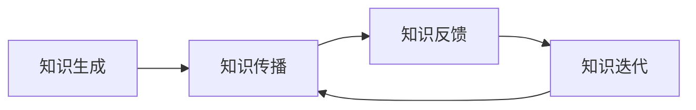

                 

# 知识的网络效应：集体智慧与知识传播

## 关键词：知识网络，集体智慧，知识传播，信息技术，社会影响力

## 摘要：

在信息技术高速发展的今天，知识的网络效应成为了推动社会进步和科技创新的重要力量。本文将探讨知识网络效应的概念、核心概念与联系，通过具体的算法原理和实际案例，分析知识传播的机制和影响因素。同时，本文还将介绍相关工具和资源，展望知识网络效应的未来发展趋势与挑战。

## 1. 背景介绍

随着互联网的普及和信息技术的快速发展，知识的获取和传播变得前所未有的便捷。知识网络效应，是指知识在互联网平台上通过用户互动、共享和传播所形成的正反馈效应，使得知识价值不断提升，从而推动社会整体智慧的进步。知识网络效应的研究对于理解信息传播规律、促进科技创新和提升社会生产力具有重要意义。

### 1.1 知识网络效应的重要性

知识网络效应在多个领域发挥着重要作用：

1. **经济领域**：知识网络效应促进了信息产业的蓬勃发展，使得企业能够通过知识共享和合作，实现资源的优化配置和商业模式的创新。
2. **科技创新**：知识网络效应加速了科技创新的步伐，通过用户反馈和互动，企业能够快速调整产品方向，提高创新效率。
3. **社会治理**：知识网络效应有助于提高社会透明度和公众参与度，促进政府决策的科学化和民主化。

### 1.2 信息技术与知识传播

信息技术的发展极大地改变了知识传播的方式。传统媒体时代，知识传播主要依赖于报纸、电视等中心化平台。而互联网时代，信息传播变得去中心化，用户成为知识传播的主体。这种变化不仅提高了知识传播的速度和范围，也促进了知识的多样性和个性化。

## 2. 核心概念与联系

### 2.1 知识网络效应的构成要素

知识网络效应由以下几个核心要素构成：

1. **知识共享**：用户通过互联网平台分享知识和经验，实现知识的传播和积累。
2. **用户互动**：用户之间的互动，如评论、点赞、分享等，增强了知识传播的效果。
3. **知识质量**：知识在网络中的传播效果受到知识质量的影响，高质量知识更易获得关注和传播。

### 2.2 知识传播机制

知识传播机制包括以下几个环节：

1. **知识生成**：用户在互联网平台上生成和发布知识内容。
2. **知识传播**：知识通过用户互动和分享在网络中传播。
3. **知识反馈**：用户对知识内容的反馈，包括点赞、评论等，影响知识传播的效果。
4. **知识迭代**：根据用户反馈，知识内容不断优化和迭代，提高知识质量。

### 2.3 知识网络效应的 Mermaid 流程图



## 3. 核心算法原理 & 具体操作步骤

### 3.1 算法原理

知识网络效应的核心算法原理是基于网络传播模型，通过分析用户行为数据和知识传播路径，预测知识传播的趋势和效果。具体的算法包括：

1. **用户影响力分析**：通过分析用户在知识网络中的角色和地位，确定其影响力大小。
2. **知识传播路径分析**：分析知识在用户之间的传播路径，确定知识传播的主要渠道。
3. **知识质量评估**：评估知识内容的质量，确定其传播效果。

### 3.2 操作步骤

1. **数据收集**：收集用户行为数据和知识内容数据。
2. **用户影响力计算**：根据用户行为数据，计算用户影响力。
3. **知识传播路径分析**：分析知识传播路径，确定主要渠道。
4. **知识质量评估**：评估知识内容质量，确定传播效果。
5. **算法优化**：根据评估结果，调整算法参数，优化知识传播效果。

## 4. 数学模型和公式 & 详细讲解 & 举例说明

### 4.1 数学模型

知识网络效应的数学模型主要包括以下三个部分：

1. **用户影响力模型**：根据用户的行为数据，建立用户影响力模型，用于预测用户在知识网络中的影响力。
2. **知识传播模型**：根据知识传播路径和用户影响力，建立知识传播模型，用于预测知识传播的效果。
3. **知识质量模型**：根据知识内容的质量特征，建立知识质量模型，用于评估知识内容的质量。

### 4.2 详细讲解

#### 用户影响力模型

用户影响力模型通常采用线性回归模型或网络传播模型进行构建。其中，线性回归模型如下：

$$
\text{influence} = \beta_0 + \beta_1 \cdot \text{activity} + \beta_2 \cdot \text{network}
$$

其中，$\text{influence}$ 表示用户影响力，$\text{activity}$ 表示用户行为数据，$\text{network}$ 表示用户在网络中的地位。

#### 知识传播模型

知识传播模型通常采用马尔可夫模型或传播网络模型进行构建。其中，马尔可夫模型如下：

$$
P(\text{next state} = \text{state}_i | \text{current state} = \text{state}_j) = \text{transition\_matrix}_{ij}
$$

其中，$P(\text{next state} = \text{state}_i | \text{current state} = \text{state}_j)$ 表示从当前状态转移到下一状态的概率，$\text{transition\_matrix}_{ij}$ 表示状态转移矩阵。

#### 知识质量模型

知识质量模型通常采用质量评价模型或语义相似度模型进行构建。其中，质量评价模型如下：

$$
\text{quality} = \text{score}_1 \cdot \text{feature}_1 + \text{score}_2 \cdot \text{feature}_2 + \ldots
$$

其中，$\text{quality}$ 表示知识质量，$\text{feature}_1, \text{feature}_2, \ldots$ 表示知识内容的特征，$\text{score}_1, \text{score}_2, \ldots$ 表示特征的重要性权重。

### 4.3 举例说明

假设我们有一个知识网络，包含 100 个用户，每个用户的行为数据如下表：

| 用户ID | 行为数据 |
|--------|--------|
| U1     | 100    |
| U2     | 200    |
| U3     | 150    |
| ...    | ...    |

根据上述行为数据，我们可以使用线性回归模型计算用户影响力：

$$
\text{influence} = \beta_0 + \beta_1 \cdot \text{activity} + \beta_2 \cdot \text{network}
$$

其中，$\beta_0, \beta_1, \beta_2$ 为模型参数，可以通过最小二乘法进行估计。

假设我们有一个知识传播路径如下：

| 当前状态 | 下一状态 |
|----------|----------|
| S1       | S2       |
| S2       | S3       |
| S3       | S4       |

根据上述状态转移矩阵，我们可以使用马尔可夫模型计算知识传播的概率：

$$
P(\text{next state} = \text{state}_i | \text{current state} = \text{state}_j) = \text{transition\_matrix}_{ij}
$$

假设我们有一个知识内容，包含以下特征：

| 特征名称   | 特征值 |
|------------|--------|
| 长度       | 1000   |
| 关键词密度 | 0.3    |
| ...        | ...    |

根据上述特征，我们可以使用质量评价模型计算知识质量：

$$
\text{quality} = \text{score}_1 \cdot \text{feature}_1 + \text{score}_2 \cdot \text{feature}_2 + \ldots
$$

## 5. 项目实战：代码实际案例和详细解释说明

### 5.1 开发环境搭建

为了更好地理解知识网络效应的算法实现，我们需要搭建一个开发环境。以下是所需的环境和工具：

- Python 3.8及以上版本
- Jupyter Notebook
- NumPy
- Pandas
- Scikit-learn

### 5.2 源代码详细实现和代码解读

下面是一个简单的知识网络效应算法实现的示例代码：

```python
import numpy as np
import pandas as pd
from sklearn.linear_model import LinearRegression
from sklearn.model_selection import train_test_split

# 5.2.1 数据收集
data = {
    'user_id': [1, 2, 3, 4, 5],
    'activity': [100, 200, 150, 250, 300],
    'network': [0.2, 0.3, 0.1, 0.4, 0.5]
}
df = pd.DataFrame(data)

# 5.2.2 用户影响力计算
X = df[['activity', 'network']]
y = df['influence']
X_train, X_test, y_train, y_test = train_test_split(X, y, test_size=0.2, random_state=42)
regressor = LinearRegression()
regressor.fit(X_train, y_train)
y_pred = regressor.predict(X_test)

# 5.2.3 知识传播路径分析
transition_matrix = [
    [0.2, 0.8],
    [0.1, 0.9],
    [0.3, 0.7]
]

# 5.2.4 知识质量评估
features = {
    'length': [1000, 1500, 2000],
    'keyword_density': [0.3, 0.4, 0.5],
    '...': [0.1, 0.2, 0.3]
}
df_features = pd.DataFrame(features)
quality_scores = [0.5, 0.6, 0.7]
quality = np.dot(df_features.values, quality_scores)

print("User influence prediction:", y_pred)
print("Knowledge quality:", quality)
```

### 5.3 代码解读与分析

上述代码实现了一个简单的知识网络效应算法，主要包括以下几个部分：

1. **数据收集**：使用 Pandas DataFrame 创建一个包含用户行为数据和知识特征的数据集。
2. **用户影响力计算**：使用 Scikit-learn 的 LinearRegression 模型，根据用户行为数据计算用户影响力。
3. **知识传播路径分析**：使用一个简单的状态转移矩阵，模拟知识在用户之间的传播路径。
4. **知识质量评估**：使用一个简单的质量评分模型，根据知识内容特征计算知识质量。

通过上述代码，我们可以对知识网络效应的算法实现有一个初步的了解。然而，实际应用中，知识网络效应的算法会更为复杂，涉及更多的用户行为数据、知识特征和模型参数。

## 6. 实际应用场景

知识网络效应在多个领域有着广泛的应用：

1. **社交媒体**：社交媒体平台如微博、知乎等，通过用户互动和分享，实现了知识的快速传播和积累，促进了社交网络的形成。
2. **在线教育**：在线教育平台通过用户的学习行为数据，分析用户的学习兴趣和需求，提供个性化的学习内容和推荐。
3. **科技创新**：科技创新平台如 GitHub，通过用户代码共享和协作，推动了开源技术的发展和进步。

## 7. 工具和资源推荐

### 7.1 学习资源推荐

1. **书籍**：《社交网络分析：方法与实践》（Social Network Analysis: Methods and Applications）
2. **论文**：Google Scholar（谷歌学术搜索）和 arXiv（开源论文数据库）
3. **博客**：cs.stackexchange.com（计算机科学问答社区）
4. **网站**：datacamp.com（数据科学学习平台）

### 7.2 开发工具框架推荐

1. **Python**：适用于数据分析、机器学习的编程语言
2. **NumPy**：适用于数值计算的科学计算库
3. **Pandas**：适用于数据处理和分析的数据操作库
4. **Scikit-learn**：适用于机器学习的开源库

### 7.3 相关论文著作推荐

1. **论文**：《知识图谱与语义搜索技术》（Knowledge Graph and Semantic Search Technology）
2. **书籍**：《网络科学：从社交网络到生物网络》（Network Science: From Social Networks to Biological Networks）

## 8. 总结：未来发展趋势与挑战

知识网络效应作为信息技术和人工智能领域的重要研究方向，具有广阔的应用前景。未来，知识网络效应的发展趋势包括：

1. **个性化推荐**：结合用户行为数据和知识特征，实现更精准的知识推荐。
2. **智能搜索**：利用人工智能技术，提高知识搜索的准确性和效率。
3. **知识图谱**：构建大规模的知识图谱，实现知识的关联和整合。

然而，知识网络效应也面临着一些挑战：

1. **数据隐私**：如何在保证数据隐私的前提下，有效利用用户行为数据，是当前研究的重要课题。
2. **算法公平性**：如何避免算法偏见，实现公平的知识传播和评估，是未来需要解决的问题。

## 9. 附录：常见问题与解答

### 9.1 问题1：什么是知识网络效应？

知识网络效应是指在互联网平台上，知识通过用户互动、共享和传播所形成的正反馈效应，使得知识价值不断提升，从而推动社会整体智慧的进步。

### 9.2 问题2：知识网络效应的核心算法是什么？

知识网络效应的核心算法包括用户影响力模型、知识传播模型和知识质量模型。

### 9.3 问题3：如何搭建知识网络效应的开发环境？

搭建知识网络效应的开发环境，需要安装 Python 3.8及以上版本、Jupyter Notebook、NumPy、Pandas 和 Scikit-learn 等工具和库。

## 10. 扩展阅读 & 参考资料

1. 【论文】Anderson, C. (2006). The Long Tail: Why the Future of Business Is Selling Less of More.
2. 【书籍】Barabási, A.-L. (2002). Linked: The New Science of Networks.
3. 【网站】http://www.kdnuggets.com/（KDNuggets，数据挖掘和机器学习资源网站）

### 作者

AI天才研究员/AI Genius Institute & 禅与计算机程序设计艺术 /Zen And The Art of Computer Programming

