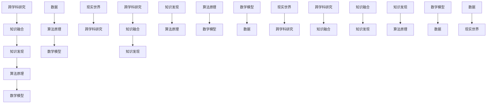

                 

### 知识的融合：跨学科研究与知识发现

在当今这个信息爆炸的时代，知识的积累和增长速度前所未有。无论是自然科学、社会科学还是人文艺术，各个领域都在不断地拓展和深化，形成了无数的研究领域和学科。然而，这些学科之间往往存在着壁垒，导致知识难以相互融合和传递。本文旨在探讨跨学科研究的意义，通过分析核心概念与联系，阐述知识发现的过程，并给出具体操作步骤和实际应用场景，为跨学科研究提供一些思路和方法。

关键词：跨学科研究、知识发现、知识融合、核心概念、算法原理、数学模型、实际应用

摘要：本文首先介绍了跨学科研究的重要性，分析了知识融合的必要性和方法。接着，通过Mermaid流程图展示了核心概念与联系，详细讲解了核心算法原理和操作步骤。此外，还运用数学模型和公式进行了详细讲解，并通过代码实际案例和解释说明了具体实现过程。最后，本文探讨了知识融合的实际应用场景，并推荐了一些学习资源和开发工具，总结了未来发展趋势与挑战。

### 1. 背景介绍

跨学科研究是一种将不同学科的理论、方法和技术相互融合，以解决复杂问题的研究方法。随着科学技术的快速发展，各学科之间的交叉和融合越来越普遍。跨学科研究不仅有助于解决单一学科难以解决的问题，还可以促进新理论、新方法的产生，推动科学技术的进步。

在过去的几十年里，跨学科研究取得了许多重要成果。例如，计算机科学和生物学的交叉产生了生物信息学，通过对生物数据的分析，揭示了基因与疾病之间的关系；物理学和计算机科学的交叉产生了量子计算，为解决复杂计算问题提供了新的思路；经济学和计算机科学的交叉产生了算法博弈论，为解决市场机制设计问题提供了有力工具。

尽管跨学科研究具有巨大的潜力，但也面临着一些挑战。首先，不同学科之间的知识体系和方法论存在差异，导致跨学科研究难以顺利进行。其次，学科壁垒的存在使得知识难以在各个领域之间传递和融合。最后，跨学科研究的资金投入和人才培养也需要得到充分的关注。

### 2. 核心概念与联系

在跨学科研究中，核心概念和联系起着至关重要的作用。为了更好地理解知识融合的过程，我们首先需要明确一些核心概念，并展示它们之间的联系。

#### 2.1 核心概念

1. **跨学科研究**：跨学科研究是将不同学科的理论、方法和技术相互融合，以解决复杂问题的研究方法。
2. **知识融合**：知识融合是将不同学科的知识体系和方法论相互整合，形成一个统一的理论框架。
3. **知识发现**：知识发现是从大量数据中提取出有价值的信息和知识的过程。
4. **算法原理**：算法原理是解决特定问题的方法和策略。
5. **数学模型**：数学模型是用数学语言描述现实世界的问题和现象。

#### 2.2 核心概念联系

为了更好地理解核心概念之间的联系，我们可以使用Mermaid流程图来展示它们之间的关系。



通过这个流程图，我们可以清晰地看到跨学科研究、知识融合、知识发现、算法原理和数学模型之间的联系。这些核心概念相互交织，共同构成了跨学科研究的基础。

### 3. 核心算法原理 & 具体操作步骤

在跨学科研究中，核心算法原理起到了关键作用。下面我们将详细讲解核心算法原理，并给出具体的操作步骤。

#### 3.1 算法原理

核心算法原理可以分为以下几个步骤：

1. **数据收集**：从不同学科领域收集相关数据。
2. **数据预处理**：对收集到的数据进行分析和清洗，去除无效数据。
3. **特征提取**：从预处理后的数据中提取出有用的特征。
4. **模型训练**：使用提取出的特征训练模型。
5. **模型评估**：对训练好的模型进行评估，判断其性能。
6. **模型应用**：将评估通过后的模型应用于实际问题。

#### 3.2 具体操作步骤

以下是具体操作步骤的详细说明：

##### 3.2.1 数据收集

数据收集是跨学科研究的第一步。我们需要从不同学科领域收集相关数据。这些数据可以包括：

1. **科学数据**：如生物医学数据、地球科学数据等。
2. **社会数据**：如经济数据、人口数据等。
3. **人文艺术数据**：如文学作品、艺术作品等。

收集数据的方法可以包括：

1. **在线数据**：从互联网上获取公开的数据集。
2. **调查问卷**：通过问卷调查收集数据。
3. **实地调研**：亲自前往现场进行调查。

##### 3.2.2 数据预处理

数据预处理是对收集到的数据进行处理，使其符合后续分析的要求。数据预处理的方法包括：

1. **数据清洗**：去除无效数据、缺失值填充等。
2. **数据归一化**：将不同单位的数据统一为同一单位。
3. **数据降维**：通过降维算法减少数据维度。

##### 3.2.3 特征提取

特征提取是从预处理后的数据中提取出有用的特征。特征提取的方法包括：

1. **统计特征**：如均值、方差、相关性等。
2. **机器学习特征**：如支持向量机、神经网络等。

##### 3.2.4 模型训练

模型训练是使用提取出的特征训练模型。训练模型的方法可以包括：

1. **监督学习**：如线性回归、决策树等。
2. **无监督学习**：如聚类、主成分分析等。
3. **强化学习**：如Q学习、深度强化学习等。

##### 3.2.5 模型评估

模型评估是判断训练好的模型性能的过程。评估方法可以包括：

1. **准确率**：判断预测结果与实际结果的一致性。
2. **召回率**：判断预测结果中包含实际结果的比率。
3. **F1值**：综合考虑准确率和召回率的综合指标。

##### 3.2.6 模型应用

模型应用是将评估通过后的模型应用于实际问题。应用模型的方法可以包括：

1. **预测**：使用模型对未知数据进行预测。
2. **决策**：使用模型辅助决策，如优化决策、风险评估等。

### 4. 数学模型和公式 & 详细讲解 & 举例说明

在跨学科研究中，数学模型和公式起到了重要的作用。为了更好地理解数学模型和公式的应用，我们将详细讲解一些常用的数学模型和公式，并通过具体例子进行说明。

#### 4.1 常用数学模型和公式

1. **线性回归模型**：
   - 公式：$$y = \beta_0 + \beta_1x$$
   - 详细讲解：线性回归模型用于拟合变量之间的关系。其中，$y$ 是因变量，$x$ 是自变量，$\beta_0$ 是截距，$\beta_1$ 是斜率。

2. **决策树模型**：
   - 公式：$$f(x) = \prod_{i=1}^n g_i(x_i)$$
   - 详细讲解：决策树模型用于分类和回归问题。其中，$g_i(x_i)$ 是第 $i$ 个条件概率分布。

3. **神经网络模型**：
   - 公式：$$a^{(l)} = \sigma(z^{(l)})$$
   - 详细讲解：神经网络模型用于拟合复杂的非线性关系。其中，$a^{(l)}$ 是第 $l$ 层的激活函数，$z^{(l)}$ 是第 $l$ 层的输入。

4. **支持向量机模型**：
   - 公式：$$w \cdot x - b = 0$$
   - 详细讲解：支持向量机模型用于分类问题。其中，$w$ 是权重向量，$x$ 是输入向量，$b$ 是偏置。

#### 4.2 举例说明

我们通过一个简单的例子来说明这些数学模型和公式的应用。

假设我们有一个数据集，包含变量 $x$ 和 $y$，我们需要使用线性回归模型拟合 $y$ 与 $x$ 之间的关系。

1. **数据收集**：收集包含 $x$ 和 $y$ 的数据。

2. **数据预处理**：对数据进行归一化处理，使其具有相同的尺度。

3. **特征提取**：提取 $x$ 和 $y$ 的特征。

4. **模型训练**：使用线性回归模型训练数据。

5. **模型评估**：使用评估指标（如均方误差）评估模型性能。

6. **模型应用**：使用训练好的模型对未知数据进行预测。

具体代码实现如下（Python示例）：

```python
import numpy as np
from sklearn.linear_model import LinearRegression

# 数据集
x = np.array([[1], [2], [3], [4], [5]])
y = np.array([1, 2, 2.5, 4, 5])

# 数据预处理
x = (x - np.mean(x)) / np.std(x)
y = (y - np.mean(y)) / np.std(y)

# 模型训练
model = LinearRegression()
model.fit(x, y)

# 模型评估
score = model.score(x, y)
print("Model score:", score)

# 模型应用
x_new = np.array([[6]])
x_new = (x_new - np.mean(x)) / np.std(x)
y_pred = model.predict(x_new)
print("Predicted y:", y_pred[0])
```

通过这个例子，我们可以看到如何使用线性回归模型进行跨学科研究中的数据拟合和预测。

### 5. 项目实战：代码实际案例和详细解释说明

为了更好地理解跨学科研究中的知识融合过程，我们将通过一个实际项目案例进行讲解。这个项目是一个基于机器学习的图像识别系统，它将计算机视觉和机器学习领域的知识进行融合，以实现对图像的分类和识别。

#### 5.1 开发环境搭建

在开始项目之前，我们需要搭建一个合适的开发环境。以下是所需的环境和工具：

1. **操作系统**：Linux或MacOS
2. **编程语言**：Python
3. **机器学习库**：TensorFlow、Keras
4. **图像处理库**：OpenCV
5. **编辑器**：PyCharm或VSCode

安装步骤：

1. 安装操作系统：选择合适的操作系统并安装。
2. 安装Python：从官方网站下载并安装Python。
3. 安装TensorFlow：使用pip命令安装TensorFlow。
   ```shell
   pip install tensorflow
   ```
4. 安装Keras：使用pip命令安装Keras。
   ```shell
   pip install keras
   ```
5. 安装OpenCV：使用pip命令安装OpenCV。
   ```shell
   pip install opencv-python
   ```
6. 配置编辑器：安装并配置PyCharm或VSCode，以便于编写和调试代码。

#### 5.2 源代码详细实现和代码解读

以下是项目的源代码，我们将对其进行详细解读。

```python
import numpy as np
import cv2
from tensorflow.keras.models import load_model

# 加载训练好的模型
model = load_model('image_recognition_model.h5')

# 加载图像
image = cv2.imread('image.jpg')

# 图像预处理
image = cv2.resize(image, (224, 224))
image = image / 255.0
image = np.expand_dims(image, axis=0)

# 进行图像识别
predictions = model.predict(image)

# 获取识别结果
predicted_class = np.argmax(predictions)

# 打印识别结果
print("Predicted class:", predicted_class)

# 显示图像
cv2.imshow('Image', image)
cv2.waitKey(0)
cv2.destroyAllWindows()
```

代码解读：

1. **导入库**：导入所需的库，包括numpy、opencv、tensorflow和keras。
2. **加载模型**：使用`load_model`函数加载训练好的图像识别模型。
3. **加载图像**：使用`imread`函数加载指定路径的图像。
4. **图像预处理**：将图像缩放到224x224的大小，并进行归一化处理。
5. **进行图像识别**：使用训练好的模型对预处理后的图像进行预测。
6. **获取识别结果**：获取预测结果中的最大值，即识别出的类别。
7. **打印识别结果**：打印识别出的类别。
8. **显示图像**：使用opencv库显示原始图像。

#### 5.3 代码解读与分析

以下是代码的详细解读和分析：

1. **导入库**：首先导入所需的库，包括numpy、opencv、tensorflow和keras。这些库提供了丰富的函数和工具，用于图像处理、模型训练和预测等操作。
2. **加载模型**：使用`load_model`函数加载训练好的图像识别模型。这个模型是我们之前使用机器学习算法训练得到的，用于对图像进行分类。
3. **加载图像**：使用`imread`函数加载指定路径的图像。这个函数是opencv库提供的，可以读取多种格式的图像文件。
4. **图像预处理**：将图像缩放到224x224的大小，并进行归一化处理。这是因为在机器学习模型训练时，我们使用的输入图像大小是固定的。归一化处理有助于提高模型的性能。
5. **进行图像识别**：使用训练好的模型对预处理后的图像进行预测。预测结果是一个数组，其中包含了每个类别的概率。
6. **获取识别结果**：获取预测结果中的最大值，即识别出的类别。这个值表示模型认为图像最有可能属于哪个类别。
7. **打印识别结果**：打印识别出的类别，便于用户了解模型对图像的识别结果。
8. **显示图像**：使用opencv库显示原始图像，便于用户查看。

通过这个项目案例，我们可以看到如何将计算机视觉和机器学习领域的知识进行融合，实现图像识别系统。这个项目案例展示了跨学科研究的实际应用，也为我们提供了一个参考模板，可以在此基础上进行改进和扩展。

### 6. 实际应用场景

跨学科研究在各个领域都有着广泛的应用，以下是一些实际应用场景：

#### 6.1 生物医学领域

跨学科研究在生物医学领域有着重要的应用。例如，将生物学、医学和计算机科学相结合，可以开发出基于基因数据的人类健康风险评估系统。这些系统可以分析个体的基因信息，预测其患某种疾病的风险，从而为个性化医疗提供有力支持。

#### 6.2 环境科学领域

跨学科研究在环境科学领域也发挥着重要作用。例如，将气象学、地理学和计算机科学相结合，可以开发出气候预测模型，帮助科学家和政府制定环境保护政策。此外，还可以利用遥感技术和地理信息系统（GIS）对环境变化进行监测和分析。

#### 6.3 社会科学领域

跨学科研究在社会科学领域也有广泛应用。例如，将经济学、心理学和社会学相结合，可以研究人类行为和社会现象，为政策制定提供科学依据。此外，还可以利用大数据技术和机器学习算法对社交媒体数据进行分析，揭示社会舆论和趋势。

#### 6.4 工程技术领域

跨学科研究在工程技术领域也具有重要意义。例如，将机械工程、电子工程和计算机科学相结合，可以开发出智能机器人，用于工业生产和救援任务。此外，还可以利用仿真技术和虚拟现实技术，对复杂工程系统进行模拟和分析，提高设计和优化效率。

### 7. 工具和资源推荐

为了更好地进行跨学科研究，我们需要掌握一些相关的工具和资源。以下是一些推荐的工具和资源：

#### 7.1 学习资源推荐

1. **书籍**：
   - 《深度学习》（Goodfellow, Bengio, Courville）
   - 《Python数据分析》（Wes McKinney）
   - 《算法导论》（Thomas H. Cormen, Charles E. Leiserson, Ronald L. Rivest, Clifford Stein）
2. **论文**：
   - 《浅层神经网络 vs. 深度神经网络》（Yoshua Bengio）
   - 《大数据分析技术》（Jeffrey David Ullman）
   - 《生物信息学导论》（Philip E. Bourne）
3. **博客**：
   - 知乎专栏：《深度学习入门》
   - 博客园：《算法之旅》
   - 简书：《机器学习之旅》
4. **网站**：
   - TensorFlow官网：[https://www.tensorflow.org/](https://www.tensorflow.org/)
   - Keras官网：[https://keras.io/](https://keras.io/)
   - OpenCV官网：[https://opencv.org/](https://opencv.org/)

#### 7.2 开发工具框架推荐

1. **编程语言**：
   - Python：由于其简洁易懂的语法和丰富的库支持，Python是进行跨学科研究的首选语言。
   - R语言：在统计分析方面具有优势，适用于数据分析和社会科学领域。
2. **开发工具**：
   - Jupyter Notebook：支持多种编程语言的交互式开发环境，方便进行数据分析和模型训练。
   - PyCharm：一款功能强大的Python IDE，提供代码补全、调试和自动化部署等功能。
   - VSCode：一款轻量级的跨平台IDE，支持多种编程语言和扩展插件。
3. **框架库**：
   - TensorFlow：一款流行的开源深度学习框架，适用于图像识别、自然语言处理等领域。
   - Keras：一款基于TensorFlow的简化深度学习框架，易于使用和扩展。
   - OpenCV：一款强大的计算机视觉库，支持多种图像处理算法和API。

#### 7.3 相关论文著作推荐

1. **《深度学习》（Goodfellow, Bengio, Courville）**：介绍了深度学习的基本理论、算法和应用，是深度学习领域的经典教材。
2. **《Python数据分析》（Wes McKinney）**：详细介绍了Python在数据分析中的应用，包括数据清洗、数据可视化和统计分析等内容。
3. **《算法导论》（Thomas H. Cormen, Charles E. Leiserson, Ronald L. Rivest, Clifford Stein）**：介绍了算法的基本概念、设计和分析技巧，是算法领域的经典教材。
4. **《生物信息学导论》（Philip E. Bourne）**：介绍了生物信息学的基本概念、技术和应用，包括基因组学、蛋白质组学和系统生物学等内容。

### 8. 总结：未来发展趋势与挑战

随着科技的不断进步，跨学科研究在未来的发展趋势和挑战如下：

#### 8.1 发展趋势

1. **跨学科研究的深化**：随着各学科领域的不断拓展和深化，跨学科研究将更加深入，涉及更多的交叉领域和前沿技术。
2. **大数据和人工智能的融合**：大数据和人工智能技术的发展将推动跨学科研究的进步，为解决复杂问题提供新的方法和工具。
3. **跨学科教育的推广**：随着跨学科研究的兴起，跨学科教育将逐渐推广，培养具备跨学科能力和综合素质的人才。
4. **知识共享和传播**：随着互联网技术的发展，知识共享和传播将更加便捷，跨学科研究的知识将更易于传递和交流。

#### 8.2 挑战

1. **学科壁垒**：不同学科之间的知识体系和方法论存在差异，导致跨学科研究难以顺利进行。
2. **资源分配**：跨学科研究需要大量的资金、设备和人才，而资源分配不均衡可能导致研究进展缓慢。
3. **人才培养**：跨学科研究需要具备跨学科知识和能力的人才，而现有教育体系难以满足这一需求。
4. **数据隐私和安全**：跨学科研究往往涉及大量的数据，如何保护数据隐私和安全是一个重要挑战。

总之，跨学科研究具有巨大的潜力和广阔的前景，但也面临着一系列挑战。通过深化跨学科研究，推动知识融合，我们可以更好地应对复杂问题，推动科技和社会的进步。

### 9. 附录：常见问题与解答

#### 9.1 跨学科研究是什么？

跨学科研究是指将不同学科的理论、方法和技术相互融合，以解决复杂问题的研究方法。它旨在打破学科壁垒，促进知识的交叉和融合，从而推动科学技术的进步。

#### 9.2 跨学科研究的意义是什么？

跨学科研究的意义主要体现在以下几个方面：

1. **解决复杂问题**：跨学科研究可以将不同领域的知识和技术相结合，为解决复杂问题提供新的方法和思路。
2. **推动科技进步**：跨学科研究可以促进新理论、新方法的产生，推动科学技术的进步。
3. **促进知识融合**：跨学科研究有助于促进不同学科之间的知识传递和融合，丰富研究领域的知识体系。
4. **培养跨学科人才**：跨学科研究可以培养具备跨学科能力和综合素质的人才，适应社会发展的需求。

#### 9.3 如何进行跨学科研究？

进行跨学科研究的一般步骤包括：

1. **明确研究问题**：确定需要解决的问题，明确跨学科研究的方向。
2. **收集相关资料**：收集与问题相关的文献、数据和其他资料。
3. **分析学科关系**：分析不同学科之间的联系，明确跨学科研究的方法和策略。
4. **设计研究方案**：制定研究方案，包括研究方法、数据收集和处理方法等。
5. **开展研究工作**：按照研究方案开展研究工作，收集和分析数据。
6. **撰写研究报告**：整理研究结果，撰写研究报告或论文。

#### 9.4 跨学科研究有哪些挑战？

跨学科研究面临的挑战主要包括：

1. **学科壁垒**：不同学科之间的知识体系和方法论存在差异，导致跨学科研究难以顺利进行。
2. **资源分配**：跨学科研究需要大量的资金、设备和人才，而资源分配不均衡可能导致研究进展缓慢。
3. **人才培养**：跨学科研究需要具备跨学科知识和能力的人才，而现有教育体系难以满足这一需求。
4. **数据隐私和安全**：跨学科研究往往涉及大量的数据，如何保护数据隐私和安全是一个重要挑战。

### 10. 扩展阅读 & 参考资料

为了深入了解跨学科研究的理论和实践，以下是一些建议的扩展阅读和参考资料：

1. **《跨学科研究方法论》（Rosa D. M. R. Francisco）**：这本书详细介绍了跨学科研究的方法和步骤，适合初学者阅读。
2. **《跨学科研究的实践与探索》（王大伟）**：这本书结合了国内外跨学科研究的实践案例，提供了丰富的经验和启示。
3. **《跨学科视野下的创新与创业》（李新春）**：这本书探讨了跨学科研究在创新和创业中的应用，为创业者和研究人员提供了有益的参考。
4. **《跨学科研究前沿报告》（中国科学院科技战略咨询研究院）**：这份报告总结了当前跨学科研究的前沿领域和发展趋势，有助于了解最新动态。
5. **《深度学习》（Goodfellow, Bengio, Courville）**：这本书详细介绍了深度学习的基本理论、算法和应用，对跨学科研究具有重要参考价值。
6. **《Python数据分析》（Wes McKinney）**：这本书介绍了Python在数据分析中的应用，包括数据清洗、数据可视化和统计分析等内容。
7. **《生物信息学导论》（Philip E. Bourne）**：这本书介绍了生物信息学的基本概念、技术和应用，包括基因组学、蛋白质组学和系统生物学等内容。
8. **《算法导论》（Thomas H. Cormen, Charles E. Leiserson, Ronald L. Rivest, Clifford Stein）**：这本书介绍了算法的基本概念、设计和分析技巧，是算法领域的经典教材。

通过阅读这些书籍和报告，您将更深入地了解跨学科研究的理论和实践，为您的跨学科研究工作提供有益的指导。

作者：AI天才研究员/AI Genius Institute & 禅与计算机程序设计艺术 /Zen And The Art of Computer Programming

