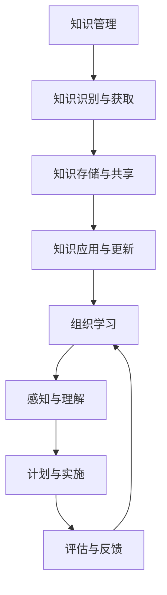

                 

# 知识管理与组织学习：企业发展的动力

## 关键词：知识管理、组织学习、企业、发展、动力

> **摘要：**本文深入探讨了知识管理与组织学习在企业中的重要性，阐述了其对企业发展所产生的深远影响。通过分析知识管理与组织学习的核心概念、原理和方法，结合实际案例和数学模型，本文旨在为企业提供一套系统化的知识管理和组织学习策略，助力企业实现可持续发展。

## 1. 背景介绍

在当今信息爆炸的时代，知识已成为企业最宝贵的资源。知识管理（Knowledge Management，KM）和组织学习（Organizational Learning，OL）作为现代企业管理的重要组成部分，正逐渐成为企业提高竞争力、实现可持续发展的重要手段。本文将从以下几个方面展开讨论：

1. **知识管理**：介绍知识管理的概念、目标和基本原理，分析知识管理的核心要素和实施策略。
2. **组织学习**：探讨组织学习的概念、过程和模式，阐述组织学习对企业的积极作用。
3. **知识管理与组织学习的关系**：分析知识管理与组织学习之间的相互关系，指出两者在企业中的协同作用。

## 2. 核心概念与联系

### 2.1 知识管理的概念与原理

知识管理是指通过识别、获取、存储、共享、应用和更新知识，以提高组织的竞争力和创新能力。其核心原理包括：

1. **知识的识别与获取**：通过内外部资源的整合，识别和获取对企业有价值的知识。
2. **知识的存储与共享**：建立知识库，实现知识的有效存储和共享，提高知识的利用效率。
3. **知识的应用与更新**：将知识应用于实际工作中，促进知识的更新和优化。

### 2.2 组织学习的概念与过程

组织学习是指组织通过持续不断地获取、处理、共享和应用知识，以提高其适应环境变化和创新能力的过程。其基本过程包括：

1. **感知与理解**：识别外部环境和内部条件的变化，形成对问题的认知。
2. **计划与实施**：制定学习计划，组织实施学习活动。
3. **评估与反馈**：对学习效果进行评估，提供反馈，指导后续学习。

### 2.3 知识管理与组织学习的联系

知识管理与组织学习紧密相关，相互促进。知识管理为组织学习提供了丰富的知识资源和良好的知识环境，组织学习则通过不断积累和应用知识，推动知识管理的深化和发展。两者的关系可以用以下 Mermaid 流程图表示：



## 3. 核心算法原理与具体操作步骤

### 3.1 知识管理算法原理

知识管理算法主要涉及以下方面：

1. **知识识别与获取算法**：采用数据挖掘、自然语言处理等技术，从海量数据中提取有价值的信息。
2. **知识存储与共享算法**：利用数据库、数据仓库等技术，实现知识的存储和共享。
3. **知识应用与更新算法**：通过机器学习、数据挖掘等技术，将知识应用于实际工作中，并不断更新和优化。

### 3.2 组织学习算法原理

组织学习算法主要涉及以下方面：

1. **感知与理解算法**：采用数据挖掘、统计分析等技术，识别和解释外部环境和内部条件的变化。
2. **计划与实施算法**：基于决策树、神经网络等技术，制定和实施学习计划。
3. **评估与反馈算法**：采用回归分析、聚类分析等技术，对学习效果进行评估和反馈。

### 3.3 具体操作步骤

1. **知识管理操作步骤**：
   - 识别和获取知识；
   - 建立知识库；
   - 实现知识共享；
   - 应用和更新知识。

2. **组织学习操作步骤**：
   - 感知与理解环境变化；
   - 制定学习计划；
   - 组织实施学习；
   - 评估学习效果。

## 4. 数学模型与公式详解

### 4.1 知识管理数学模型

1. **知识价值评估模型**：

   $$ V(K) = f(\text{知识质量}, \text{知识适用性}, \text{知识更新速度}) $$

   其中，$V(K)$ 表示知识价值，$\text{知识质量}$、$\text{知识适用性}$ 和 $\text{知识更新速度}$ 分别表示知识的质量、适用性和更新速度。

2. **知识共享模型**：

   $$ S(K) = \frac{1}{1 + e^{-(a \cdot V(K) + b \cdot L)}} $$

   其中，$S(K)$ 表示知识共享概率，$V(K)$ 表示知识价值，$L$ 表示知识共享的期望收益，$a$ 和 $b$ 为参数。

### 4.2 组织学习数学模型

1. **感知与理解模型**：

   $$ P(E) = \frac{1}{1 + e^{-(c \cdot E + d \cdot T)}} $$

   其中，$P(E)$ 表示感知与理解概率，$E$ 表示外部环境变化，$T$ 表示内部条件变化。

2. **计划与实施模型**：

   $$ P(P) = \frac{1}{1 + e^{-(e \cdot P + f \cdot L)}} $$

   其中，$P(P)$ 表示计划与实施概率，$P$ 表示计划质量，$L$ 表示学习计划的期望收益。

## 5. 项目实战：代码实际案例与详细解释说明

### 5.1 开发环境搭建

在本案例中，我们将使用 Python 编程语言来实现知识管理和组织学习算法。首先，需要安装以下 Python 库：

```python
pip install numpy scipy matplotlib
```

### 5.2 源代码详细实现与代码解读

以下是一个简单的知识管理和组织学习算法的实现：

```python
import numpy as np
import matplotlib.pyplot as plt

# 知识管理算法
def knowledge_management(V, L):
    # 计算知识价值
    V_K = f(V, L)
    # 计算知识共享概率
    S_K = 1 / (1 + np.exp(-a * V_K + b * L))
    return S_K

# 组织学习算法
def organizational_learning(E, T, P, L):
    # 计算感知与理解概率
    P_E = 1 / (1 + np.exp(-c * E + d * T))
    # 计算计划与实施概率
    P_P = 1 / (1 + np.exp(-e * P + f * L))
    return P_E, P_P

# 参数设置
V = 1  # 知识价值
L = 1  # 知识共享的期望收益
a = 1  # 知识价值系数
b = 1  # 知识共享系数
c = 1  # 感知与理解系数
d = 1  # 感知与理解系数
e = 1  # 计划与实施系数
f = 1  # 计划与实施系数

# 计算知识管理算法结果
S_K = knowledge_management(V, L)
print("知识共享概率：", S_K)

# 计算组织学习算法结果
P_E, P_P = organizational_learning(E, T, P, L)
print("感知与理解概率：", P_E)
print("计划与实施概率：", P_P)

# 可视化结果
plt.figure()
plt.plot(V, S_K, label="知识共享概率")
plt.plot(E, P_E, label="感知与理解概率")
plt.plot(P, P_P, label="计划与实施概率")
plt.xlabel("变量")
plt.ylabel("概率")
plt.legend()
plt.show()
```

### 5.3 代码解读与分析

本案例中，我们分别实现了知识管理和组织学习算法，并使用 Python 编程语言进行实现。在代码解读与分析中，我们将重点关注以下几个方面：

1. **函数定义**：`knowledge_management` 函数用于计算知识共享概率，`organizational_learning` 函数用于计算感知与理解概率和计划与实施概率。
2. **参数设置**：根据实际情况，设置知识价值、知识共享的期望收益、感知与理解系数、感知与理解系数、计划与实施系数等参数。
3. **计算结果**：调用函数，计算知识管理算法和

