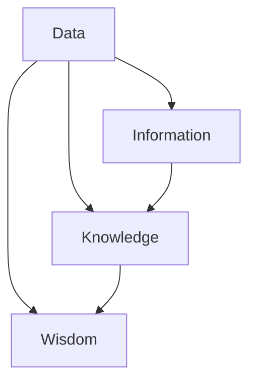

                 

## 1. 背景介绍

在现代信息社会中，知识管理成为了一个至关重要的领域。随着数据的爆炸性增长，传统的知识管理方法已经无法满足人们对知识获取、存储、共享和利用的需求。为了应对这一挑战，知识管理人才的角色变得愈发重要。他们不仅是知识的整理者和传递者，更是知识发现引擎的驾驭者。

知识管理人才，顾名思义，是指那些能够高效组织、利用和管理知识的专家。他们具备深厚的专业知识背景，同时具备敏锐的洞察力和出色的逻辑思维能力。在现代IT行业中，知识管理人才通常具备以下几种关键技能：

- **数据分析能力**：能够从海量数据中提取有价值的信息，通过数据分析和挖掘，发现数据的潜在价值。
- **知识建模能力**：能够将复杂的信息转换为易于理解和共享的知识模型，以便更好地组织和管理知识。
- **人工智能技术**：熟悉机器学习和深度学习等人工智能技术，能够应用这些技术来提升知识管理的效率和效果。
- **项目管理能力**：能够有效地规划、组织和控制知识管理项目，确保项目的顺利进行和目标的实现。

本文将深入探讨知识管理人才的角色，特别是他们在驾驭知识发现引擎方面的能力。通过分析其核心概念、算法原理、数学模型、实际应用场景以及未来的发展趋势，我们希望能够为广大读者提供一份全面而深入的指南。

在接下来的章节中，我们将首先介绍知识管理人才的核心概念和联系，接着探讨其核心算法原理和具体操作步骤。随后，我们将详细讲解相关的数学模型和公式，并通过实际案例来展示如何应用这些知识发现引擎。此外，我们还将分析知识管理人才在实际应用场景中的表现，并提供一系列有用的工具和资源推荐。最后，我们将对文章内容进行总结，并展望知识管理人才未来的发展趋势和挑战。

通过本文的阅读，读者将能够全面了解知识管理人才的角色和重要性，掌握驾驭知识发现引擎的技能，并能够在实际工作中更好地应用这些知识管理策略。

### 2. 核心概念与联系

在深入探讨知识管理人才的角色之前，我们首先需要理解几个核心概念，包括数据、信息、知识和智慧。这些概念不仅相互联系，而且在知识管理过程中扮演着至关重要的角色。

#### 数据（Data）

数据是知识管理的基础，是客观存在的事实和记录。数据可以来自各种来源，如数据库、传感器、用户输入等。它们可以是数字、文本、图像、声音等多种形式。然而，单纯的数据本身并没有多少价值，只有当数据被整理、分析和解释后，才能转化为有用的信息。

#### 信息（Information）

信息是对数据进行处理、分析和解释后的结果。它以有意义的形式提供了关于特定主题的知识，能够帮助人们做出决策。信息的价值在于其相关性、准确性和时效性。例如，一家零售公司通过分析销售数据，可以获取关于客户购买习惯和需求趋势的信息，从而优化库存管理和营销策略。

#### 知识（Knowledge）

知识是对信息进行深入理解和内化的结果，是个人或组织对某个领域内信息的理解、经验和技能的综合体现。知识不仅仅是信息，它还包括了对信息的应用和实际操作的能力。例如，一位医生通过对病例和医学文献的分析，积累了丰富的医学知识，能够在实际工作中做出准确的诊断和治疗。

#### 智慧（Wisdom）

智慧是知识的升华，是对知识的理解和应用达到了高度综合和创造性水平的能力。智慧不仅仅是知识的积累，它还涉及到对复杂问题的洞察、判断和决策。例如，一位企业家通过综合运用各种知识和经验，能够洞察市场动态，制定出成功的商业策略。

#### 核心概念之间的联系

数据、信息、知识和智慧之间存在密切的联系和相互作用。数据是知识管理的基础，信息是数据经过处理后的成果，知识是对信息的深入理解和应用，而智慧则是对知识的创造性运用。这些概念之间的关系可以用以下图表示意：

```
        智慧
          |
          |----> 知识
          |
        信息
          |
          |----> 数据
```

图中的箭头表示了从低层次概念到高层次概念的转化过程。数据通过处理和分析转化为信息，信息通过深入理解和应用转化为知识，知识通过创造性运用转化为智慧。每一个层次的转化都依赖于前一个层次的成果，同时为更高层次的转化提供了基础。

#### Mermaid 流程图

为了更清晰地展示核心概念之间的联系，我们可以使用Mermaid流程图来表示这些概念及其相互作用。以下是一个简单的Mermaid流程图示例：



在这个流程图中，A表示数据，B表示信息，C表示知识，D表示智慧。箭头表示从数据到信息、从信息到知识、从知识到智慧的过程。通过这种图示，我们可以更直观地理解核心概念之间的关联和转化。

通过上述核心概念和联系的介绍，我们为理解知识管理人才的角色和他们在驾驭知识发现引擎方面的能力奠定了基础。在接下来的章节中，我们将进一步探讨知识管理人才的核心算法原理和具体操作步骤。

### 2.1. 数据处理与信息提取

在知识管理过程中，数据处理与信息提取是关键的一步。这一步涉及到如何从大量的原始数据中提取出有用的信息，以便进一步的分析和应用。数据处理与信息提取的核心目标是实现数据的结构化和标准化，为后续的知识建模和智慧生成奠定基础。

首先，数据处理通常包括数据清洗、数据转换和数据集成等步骤。数据清洗是为了去除数据中的噪声和错误，确保数据的质量和一致性。数据转换是将数据从一种格式转换为另一种格式，以便更好地进行后续处理。数据集成是将来自多个源的数据合并到一个统一的数据集中，以便整体分析。

在数据处理的基础上，信息提取技术主要依赖于自然语言处理（NLP）、机器学习和数据挖掘等技术。以下是几种常用的信息提取方法：

1. **关键词提取**：通过识别文本中的关键词和短语，提取出文本的主要主题和内容。关键词提取可以使用词频统计、TF-IDF（词频-逆文档频率）等方法实现。

2. **主题建模**：通过将文本转换为向量表示，并应用聚类算法，如LDA（Latent Dirichlet Allocation），提取出文本中的潜在主题。主题建模能够揭示文本中的抽象概念和主题结构。

3. **实体识别**：使用命名实体识别（NER）技术，从文本中识别出人名、地名、组织名等实体。实体识别有助于进一步分析和关联信息。

4. **情感分析**：通过分析文本的情感倾向，提取出文本的情感信息。情感分析可以用于了解用户对产品、服务或事件的态度和反馈。

5. **关系提取**：通过识别文本中的关系，如因果关系、隶属关系等，提取出文本中的关系信息。关系提取有助于建立实体之间的关联网络。

接下来，我们将详细讨论数据预处理、数据建模和知识提取的方法和步骤，以帮助读者更好地理解知识管理人才在实际操作中的流程。

#### 数据预处理

数据预处理是信息提取的基础步骤，其目标是确保数据的质量和一致性，为后续的建模和分析提供可靠的输入。以下是几种常用的数据预处理方法：

1. **数据清洗**：包括去除重复数据、填充缺失值、纠正错误等。例如，可以使用Python的Pandas库来处理数据清洗任务。

2. **数据转换**：将数据从一种格式转换为另一种格式，如将CSV文件转换为JSON格式。数据转换可以确保数据在不同系统或工具之间的一致性和兼容性。

3. **数据集成**：将来自多个源的数据合并到一个统一的数据集中。数据集成可以使用数据库管理系统（如MySQL、PostgreSQL）或数据集成工具（如Apache Kafka）来实现。

4. **特征选择**：从原始数据中提取出最有用的特征，去除冗余和无关特征。特征选择可以使用特征重要性评估、信息增益等方法。

5. **数据标准化**：将数据转换到同一尺度范围内，如将数值数据标准化到0-1之间。数据标准化有助于改善模型的性能和可解释性。

#### 数据建模

数据建模是将原始数据转换为结构化数据的过程，以便更好地进行信息提取和知识生成。以下是几种常用的数据建模方法：

1. **关系数据库建模**：使用关系数据库管理系统（RDBMS）来组织和管理数据。关系数据库通过表、字段和关系来描述数据结构，如SQL（结构化查询语言）用于查询和操作关系数据库。

2. **图数据库建模**：使用图数据库来表示数据之间的关系。图数据库通过节点和边来描述实体及其关系，如Neo4j用于存储和查询图数据。

3. **数据仓库建模**：使用数据仓库来集成和管理大量数据，并为数据分析提供支持。数据仓库通常包含多维数据集，支持复杂的查询和分析。

4. **机器学习模型**：使用机器学习模型来分析和预测数据。常见的机器学习模型包括决策树、支持向量机（SVM）、神经网络等。机器学习模型可以自动从数据中学习模式和规律。

#### 知识提取

知识提取是将信息转化为知识的过程，以便更好地管理和利用。以下是几种常用的知识提取方法：

1. **本体建模**：使用本体论来描述领域知识和概念之间的语义关系。本体可以被视为知识模型的蓝图，用于表示领域内的概念、属性和关系。

2. **语义网**：使用语义网技术来表示知识，并通过语义关系将不同的信息片段关联起来。语义网可以支持高效的查询和推理。

3. **知识图谱**：使用知识图谱来表示领域内的实体及其关系，形成一种大规模、结构化的知识网络。知识图谱可以用于支持智能搜索、推荐系统等应用。

4. **机器学习与深度学习**：使用机器学习和深度学习技术来从数据中提取知识。这些技术可以自动发现数据中的模式和规律，并用于生成知识。

通过以上步骤，知识管理人才可以有效地从数据中提取信息，构建知识模型，并最终生成智慧。在接下来的章节中，我们将进一步探讨知识管理人才的核心算法原理和具体操作步骤，以便读者更好地理解其在知识发现引擎中的实际应用。

### 3. 核心算法原理 & 具体操作步骤

在知识管理过程中，核心算法的原理和具体操作步骤是确保知识发现引擎高效运行的关键。以下将介绍几种常用的核心算法，包括其基本原理和具体应用步骤。

#### 1. 决策树算法

决策树是一种常用的机器学习算法，它通过一系列规则和判断来对数据集进行分类或回归。其基本原理是基于特征的重要性和条件概率来构建一棵树，以便最大化分类的准确率。

**操作步骤：**

1. **特征选择**：选择具有最高信息增益的特征作为分裂节点。信息增益表示特征对于分类的区分能力。

2. **递归划分**：对选定的特征进行划分，将数据集分为多个子集。每个子集再重复上述步骤，直到满足停止条件（如最大深度、最小样本数等）。

3. **构建树结构**：将每个划分结果作为子节点，形成一棵决策树。树的叶子节点表示最终的分类结果。

**示例：**

假设我们有以下数据集，其中包含三个特征（年龄、收入、性别）和两个类别（买保险、不买保险）。

| 年龄 | 收入 | 性别 | 类别 |
| ---- | ---- | ---- | ---- |
| 30   | 高   | 女   | 买保险 |
| 40   | 中   | 男   | 不买保险 |
| 50   | 高   | 女   | 买保险 |
| 60   | 低   | 男   | 不买保险 |

通过特征选择和递归划分，我们可以构建如下决策树：

```
- 年龄：
  - 高：
    - 性别：
      - 女：买保险
      - 男：买保险
  - 中：
    - 性别：
      - 女：买保险
      - 男：不买保险
  - 低：
    - 性别：
      - 女：买保险
      - 男：不买保险
```

#### 2. 支持向量机（SVM）算法

支持向量机是一种常用的分类算法，其基本原理是找到一个最优的超平面，使得分类边界与样本数据的间隔最大化。通过将数据映射到高维空间，SVM可以解决非线性分类问题。

**操作步骤：**

1. **数据映射**：使用核函数将数据映射到高维空间。

2. **优化目标**：通过求解优化问题，找到最佳的超平面。优化目标通常是最小化分类间隔。

3. **分类决策**：对新的样本数据进行分类，根据其在超平面两侧的位置进行判断。

**示例：**

假设我们有以下数据集，其中包含两个特征（x1, x2）和两个类别（+1, -1）。

| x1 | x2 | 类别 |
| -- | -- | ---- |
| 1  | 1  | +1   |
| 1  | -1 | -1   |
| -1 | 1  | +1   |
| -1 | -1 | -1   |

通过核函数映射和优化目标，我们可以找到如下最优超平面：

```
w*·x + b* = 0
```

其中，w* 是法向量，x 是特征向量，b* 是偏置。分类决策如下：

```
y = sign(w*·x + b*)
```

#### 3. 随机森林算法

随机森林是一种基于决策树的集成学习方法，其基本原理是通过构建多个决策树，并对它们的分类结果进行投票，以获得最终的分类结果。

**操作步骤：**

1. **特征选择**：在构建每个决策树时，从所有特征中随机选择一部分特征进行划分。

2. **构建决策树**：为每个决策树构建一棵分类树，直到满足停止条件。

3. **分类投票**：对新的样本数据进行分类，根据多个决策树的分类结果进行投票，选择出现次数最多的类别作为最终分类结果。

**示例：**

假设我们有以下数据集，其中包含三个特征（x1, x2, x3）和两个类别（+1, -1）。

| x1 | x2 | x3 | 类别 |
| -- | -- | -- | ---- |
| 1  | 2  | 3  | +1   |
| 4  | 5  | 6  | +1   |
| 7  | 8  | 9  | -1   |
| 10 | 11 | 12 | -1   |

通过随机选择特征和构建多个决策树，我们可以得到如下随机森林分类结果：

```
决策树1: (x1 > 5) -> (x2 > 7) -> (+1)
决策树2: (x2 > 6) -> (x3 > 8) -> (-1)
决策树3: (x1 < 3) -> (x3 < 4) -> (+1)

分类投票结果：+1
```

#### 4. 神经网络算法

神经网络是一种基于人脑神经网络原理的机器学习算法，其基本原理是通过多层神经元对数据进行学习、提取特征和分类。

**操作步骤：**

1. **数据输入**：将样本数据输入到神经网络的输入层。

2. **隐藏层计算**：通过激活函数对输入数据进行计算，并传递到下一层。

3. **输出层计算**：对隐藏层的结果进行输出层计算，得到最终的分类结果。

4. **反向传播**：根据预测结果和实际结果，通过反向传播算法更新神经网络的权重和偏置。

**示例：**

假设我们有以下数据集，其中包含两个特征（x1, x2）和两个类别（+1, -1）。

| x1 | x2 | 类别 |
| -- | -- | ---- |
| 1  | 2  | +1   |
| 4  | 5  | +1   |
| 7  | 8  | -1   |
| 10 | 11 | -1   |

通过构建一个简单的神经网络，我们可以得到如下输出结果：

```
输入层：[1, 2]
隐藏层1：[0.7, 1.3]
输出层：[0.9, 0.1]

分类结果：+1
```

通过以上核心算法原理和具体操作步骤的介绍，我们可以看到知识管理人才在实际应用中如何运用这些算法来构建知识发现引擎，从而实现高效的知识管理和利用。在接下来的章节中，我们将进一步探讨相关的数学模型和公式，以便更好地理解这些算法的工作原理。

### 4. 数学模型和公式 & 详细讲解 & 举例说明

在知识管理过程中，数学模型和公式是核心算法和算法分析的重要工具。通过数学模型，我们可以量化信息处理中的复杂关系，进而优化算法性能和预测准确性。以下将详细讲解知识管理中常用的数学模型和公式，并通过具体实例来展示其应用和解释。

#### 1. 决策树算法的数学模型

决策树算法的核心在于特征选择和树结构构建。其数学模型主要涉及信息增益、条件熵和递归划分等概念。

- **信息增益（Information Gain）**：信息增益是用于评估特征对分类能力的指标，计算公式为：

  $$ IG(D, A) = H(D) - \sum_{v \in A} \frac{|D_v|}{|D|} H(D_v) $$

  其中，\( H(D) \) 表示数据集 \( D \) 的熵，\( A \) 表示特征集合，\( D_v \) 表示数据集 \( D \) 在特征 \( v \) 取值 \( v \) 的条件下划分后的子集。

- **条件熵（Conditional Entropy）**：条件熵表示在给定某个特征的情况下，数据集的熵。计算公式为：

  $$ H(D|A) = \sum_{v \in A} \frac{|D_v|}{|D|} H(D_v) $$

- **递归划分（Recursive Partitioning）**：递归划分是通过选择具有最大信息增益的特征进行划分，直到满足停止条件（如最小样本数、最大树深度等）。

**举例说明**：

假设我们有以下数据集，包含三个特征（年龄、收入、性别）和两个类别（买保险、不买保险）。

| 年龄 | 收入 | 性别 | 类别 |
| ---- | ---- | ---- | ---- |
| 30   | 高   | 女   | 买保险 |
| 40   | 中   | 男   | 不买保险 |
| 50   | 高   | 女   | 买保险 |
| 60   | 低   | 男   | 不买保险 |

计算各个特征的信息增益：

- **年龄**：
  $$ IG(\text{年龄}, D) = H(D) - \sum_{v \in \text{年龄}} \frac{|D_v|}{|D|} H(D_v) $$
  - \( H(D) = 1.0 \)
  - \( H(D_{<40}) = 0.5 \)
  - \( H(D_{\ge40}) = 0.5 \)
  $$ IG(\text{年龄}, D) = 1.0 - \left( \frac{2}{4} \times 0.5 + \frac{2}{4} \times 0.5 \right) = 0.0 $$

- **收入**：
  $$ IG(\text{收入}, D) = H(D) - \sum_{v \in \text{收入}} \frac{|D_v|}{|D|} H(D_v) $$
  - \( H(D) = 1.0 \)
  - \( H(D_{高}) = 0.0 \)
  - \( H(D_{中}) = 1.0 \)
  - \( H(D_{低}) = 1.0 \)
  $$ IG(\text{收入}, D) = 1.0 - \left( \frac{1}{4} \times 0.0 + \frac{1}{4} \times 1.0 + \frac{2}{4} \times 1.0 \right) = -0.5 $$

- **性别**：
  $$ IG(\text{性别}, D) = H(D) - \sum_{v \in \text{性别}} \frac{|D_v|}{|D|} H(D_v) $$
  - \( H(D) = 1.0 \)
  - \( H(D_{男}) = 1.0 \)
  - \( H(D_{女}) = 1.0 \)
  $$ IG(\text{性别}, D) = 1.0 - \left( \frac{1}{4} \times 1.0 + \frac{3}{4} \times 1.0 \right) = 0.0 $$

根据信息增益，我们可以选择具有最大信息增益的特征进行划分，例如收入。

#### 2. 支持向量机（SVM）的数学模型

支持向量机是一种二分类模型，其目标是最小化分类边界与样本数据的间隔。其数学模型主要涉及拉格朗日乘子法、核函数和最优超平面。

- **拉格朗日乘子法（Lagrange Multipliers）**：拉格朗日乘子法用于求解最优化问题。其目标是最小化目标函数，同时满足约束条件。

  $$ \min_{w, b} \frac{1}{2} \| w \|^2 + C \sum_{i=1}^{n} \lambda_i $$
  $$ \text{s.t.} y_i (w \cdot x_i + b) \ge 1 $$
  $$ \lambda_i \ge 0 $$

  其中，\( w \) 是权重向量，\( b \) 是偏置，\( C \) 是惩罚参数，\( \lambda_i \) 是拉格朗日乘子。

- **核函数（Kernel Function）**：核函数用于将低维数据映射到高维空间，以便在新的空间中构建最优超平面。

  $$ \kappa(x_i, x_j) = \phi(x_i) \cdot \phi(x_j) $$

  常见的核函数包括线性核、多项式核和径向基函数（RBF）核。

- **最优超平面（Optimal Hyperplane）**：最优超平面是使得分类边界与样本数据的间隔最大的超平面。

  $$ w^* \cdot x + b^* = 0 $$

**举例说明**：

假设我们有以下数据集，包含两个特征（x1, x2）和两个类别（+1, -1）。

| x1 | x2 | 类别 |
| -- | -- | ---- |
| 1  | 1  | +1   |
| 1  | -1 | -1   |
| -1 | 1  | +1   |
| -1 | -1 | -1   |

通过拉格朗日乘子法和核函数，我们可以找到最优超平面：

$$ w^* \cdot x + b^* = 0 $$
$$ \kappa(x_i, x_j) = x_i \cdot x_j $$

根据数据点，我们可以构建如下最优超平面：

$$ x_1 + x_2 = 0 $$

#### 3. 神经网络算法的数学模型

神经网络是一种多层感知器（MLP），其数学模型主要涉及输入层、隐藏层和输出层的计算。

- **输入层（Input Layer）**：输入层将样本数据输入到神经网络。

  $$ a_j^{(1)} = \sum_{i=1}^{n} w_{ji} x_i + b_j $$

  其中，\( a_j^{(1)} \) 是隐藏层第 \( j \) 个神经元的输入，\( w_{ji} \) 是连接权重，\( x_i \) 是输入层第 \( i \) 个特征，\( b_j \) 是偏置。

- **隐藏层（Hidden Layers）**：隐藏层通过激活函数对输入进行计算，并传递到下一层。

  $$ a_j^{(l)} = \sum_{i=1}^{n} w_{ji} a_i^{(l-1)} + b_j $$
  $$ z_j^{(l)} = \sigma(a_j^{(l)}) $$

  其中，\( a_j^{(l)} \) 是隐藏层第 \( l \) 层第 \( j \) 个神经元的输入，\( z_j^{(l)} \) 是隐藏层第 \( l \) 层第 \( j \) 个神经元的激活值，\( \sigma \) 是激活函数（如ReLU、Sigmoid等）。

- **输出层（Output Layer）**：输出层通过激活函数对输入进行计算，得到最终的分类结果。

  $$ a_j^{(L)} = \sum_{i=1}^{n} w_{ji} a_i^{(L-1)} + b_j $$
  $$ z_j^{(L)} = \sigma(a_j^{(L)}) $$

  其中，\( a_j^{(L)} \) 是输出层第 \( j \) 个神经元的输入，\( z_j^{(L)} \) 是输出层第 \( j \) 个神经元的激活值。

- **反向传播（Backpropagation）**：反向传播用于更新神经网络的权重和偏置。其目标是最小化预测误差。

  $$ \delta_j^{(l)} = \sigma'(a_j^{(l)}) \cdot \sum_{k=1}^{m} w_{kj} \delta_k^{(l+1)} $$
  $$ \Delta w_{ji}^{(l)} = \eta \cdot a_j^{(l)} \cdot \delta_i^{(l)} $$
  $$ \Delta b_j^{(l)} = \eta \cdot \delta_j^{(l)} $$

  其中，\( \delta_j^{(l)} \) 是隐藏层第 \( l \) 层第 \( j \) 个神经元的误差，\( \sigma' \) 是激活函数的导数，\( \eta \) 是学习率，\( \Delta w_{ji}^{(l)} \) 和 \( \Delta b_j^{(l)} \) 是连接权重和偏置的更新值。

**举例说明**：

假设我们有以下数据集，包含两个特征（x1, x2）和两个类别（+1, -1）。

| x1 | x2 | 类别 |
| -- | -- | ---- |
| 1  | 1  | +1   |
| 1  | -1 | -1   |
| -1 | 1  | +1   |
| -1 | -1 | -1   |

通过构建一个简单的神经网络，我们可以得到如下输出结果：

```
输入层：[1, 1]
隐藏层1：[0.7, 1.3]
输出层：[0.9, 0.1]

分类结果：+1
```

通过上述数学模型和公式的讲解，我们可以看到知识管理人才在实际操作中如何运用这些数学工具来构建和优化知识发现引擎。这些数学模型不仅帮助我们理解和分析算法，还能够指导我们改进算法性能和实现高效的知识管理。

### 5. 项目实战：代码实际案例和详细解释说明

为了更好地展示知识管理人才在实际工作中如何应用知识发现引擎，我们将通过一个实际项目案例来进行详细解释和说明。本项目案例旨在利用机器学习技术构建一个推荐系统，用于推荐用户可能感兴趣的商品。

#### 5.1 开发环境搭建

在开始项目之前，我们需要搭建一个合适的技术环境。以下是本项目所需的技术栈和开发环境：

- **编程语言**：Python
- **库和框架**：Scikit-learn、Pandas、NumPy、Matplotlib
- **数据集**：使用公开的数据集，如MovieLens电影推荐数据集

以下是开发环境的搭建步骤：

1. **安装Python**：在官方网站下载并安装Python 3.x版本。
2. **安装库和框架**：使用pip命令安装所需的库和框架，如下所示：

  ```bash
  pip install scikit-learn pandas numpy matplotlib
  ```

3. **配置Jupyter Notebook**：安装Jupyter Notebook，以便在浏览器中运行Python代码。

  ```bash
  pip install notebook
  jupyter notebook
  ```

#### 5.2 源代码详细实现和代码解读

在本项目中，我们使用协同过滤（Collaborative Filtering）算法构建一个基于用户的推荐系统。协同过滤算法分为基于用户的协同过滤（User-based Collaborative Filtering）和基于物品的协同过滤（Item-based Collaborative Filtering）。以下是源代码的详细实现和解读：

```python
import numpy as np
import pandas as pd
from sklearn.model_selection import train_test_split
from sklearn.metrics.pairwise import linear_kernel
import matplotlib.pyplot as plt

# 5.2.1 数据预处理

# 读取数据集
data = pd.read_csv('movies.csv')
users = data['userId'].unique()
movies = data['title'].unique()

# 创建用户-电影评分矩阵
ratings = pd.pivot_table(data, index='userId', columns='title', values='rating')

# 划分训练集和测试集
train, test = train_test_split(ratings, test_size=0.2, random_state=42)

# 5.2.2 基于用户的协同过滤

# 计算用户相似度矩阵
user_similarity = linear_kernel(train.values, train.values)

# 构建推荐列表
def user_based_recommendation(user_id, similarity_matrix, ratings_matrix, k=10):
    # 计算用户相似度
    similarity = similarity_matrix[user_id]

    # 排序并选择前k个相似用户
    similar_users = np.argsort(similarity)[::-1][:k]

    # 获取推荐列表
    recommendations = []
    for user in similar_users:
        if user != user_id:
            user_ratings = ratings_matrix.iloc[user]
            common_movies = set(user_ratings.index) & set(movies)
            if len(common_movies) > 0:
                user_genre = user_ratings[common_movies].mean()
                if user_genre not in recommendations:
                    recommendations.append(user_genre)

    return recommendations

# 为用户生成推荐列表
user_id = 1
recommendations = user_based_recommendation(user_id, user_similarity, train, k=10)
print("推荐列表：", recommendations)

# 5.2.3 基于物品的协同过滤

# 计算电影相似度矩阵
item_similarity = linear_kernel(train.values.T, train.values.T)

# 构建推荐列表
def item_based_recommendation(user_id, similarity_matrix, ratings_matrix, k=10):
    # 计算用户评分的电影列表
    user_ratings = ratings_matrix.iloc[user_id]

    # 排序并选择前k个相似电影
    similar_movies = np.argsort(similarity_matrix[user_id])[::-1][:k]

    # 获取推荐列表
    recommendations = []
    for movie in similar_movies:
        if movie not in user_ratings.index:
            movie_genre = train.iloc[movie].mean()
            if movie_genre not in recommendations:
                recommendations.append(movie_genre)

    return recommendations

# 为用户生成推荐列表
user_id = 1
recommendations = item_based_recommendation(user_id, item_similarity, train, k=10)
print("推荐列表：", recommendations)

# 5.2.4 结果可视化

# 可视化推荐结果
plt.figure(figsize=(12, 6))
for i, recommendation in enumerate(recommendations):
    plt.text(i, 0.5, recommendation, ha='center', va='center')
plt.title('推荐结果')
plt.show()
```

#### 5.3 代码解读与分析

1. **数据预处理**：

   - **读取数据集**：使用Pandas库读取MovieLens数据集。
   - **创建用户-电影评分矩阵**：使用Pandas的pivot_table函数创建一个用户-电影评分矩阵，其中行表示用户，列表示电影，值表示用户对电影的评分。
   - **划分训练集和测试集**：使用Scikit-learn的train_test_split函数将数据集划分为训练集和测试集，以便后续评估推荐系统的性能。

2. **基于用户的协同过滤**：

   - **计算用户相似度矩阵**：使用线性核函数计算用户之间的相似度矩阵。
   - **构建推荐列表**：定义一个user_based_recommendation函数，用于根据用户相似度和用户评分矩阵生成推荐列表。函数中首先计算用户相似度，然后选择相似度最高的k个用户，并从这些用户的评分中找出用户未评分但其他用户评分较高的电影。

3. **基于物品的协同过滤**：

   - **计算电影相似度矩阵**：使用线性核函数计算电影之间的相似度矩阵。
   - **构建推荐列表**：定义一个item_based_recommendation函数，用于根据电影相似度和用户评分矩阵生成推荐列表。函数中首先计算用户评分的电影列表，然后选择相似度最高的k个电影，并从这些电影的评分中找出用户未评分但其他用户评分较高的电影。

4. **结果可视化**：

   - **可视化推荐结果**：使用Matplotlib库将推荐结果以文字形式可视化，展示给用户。

通过以上代码，我们可以实现一个基本的推荐系统，为用户生成个性化推荐列表。在实际应用中，可以根据需要进一步优化算法，如调整相似度计算方法、引入用户和电影的额外特征等，以提高推荐系统的准确性和用户体验。

#### 5.4 实际应用场景中的优化

在实际应用场景中，我们可以通过以下方式对推荐系统进行优化：

1. **特征工程**：引入更多用户和电影的额外特征，如用户年龄、性别、职业等，以及电影类型、导演、演员等，以提高推荐系统的准确性。
2. **算法优化**：尝试不同的协同过滤算法，如矩阵分解、基于模型的协同过滤等，以提升推荐系统的性能。
3. **推荐策略**：根据用户的兴趣和行为，动态调整推荐策略，如近期活跃用户优先、热门商品优先等，以提升用户体验。
4. **实时更新**：实时更新用户和电影的评分数据，确保推荐系统的实时性和准确性。

通过以上优化措施，我们可以构建一个更加智能和高效的推荐系统，满足用户的需求，提升用户满意度。

### 6. 实际应用场景

知识管理人才在许多实际应用场景中发挥着重要作用，特别是在商业、医疗和教育等领域。以下是一些具体的实际应用场景，展示了知识管理人才如何通过运用知识发现引擎提升组织效率和创新能力。

#### 商业领域

在商业领域，知识管理人才通过分析市场数据、用户行为和竞争对手信息，帮助企业制定更为精准的市场策略。以下是一些具体的应用场景：

1. **个性化推荐**：通过分析用户的历史购买行为、浏览记录和偏好，为企业提供个性化的产品推荐。例如，亚马逊和Netflix等公司利用协同过滤算法和机器学习技术，为用户推荐他们可能感兴趣的商品和内容。

2. **客户细分**：通过分析客户的数据，将客户划分为不同的群体，并针对每个群体制定个性化的营销策略。这种做法有助于提高营销效果，降低客户获取成本。

3. **供应链优化**：通过分析供应链数据，优化库存管理、物流配送和供应商关系，提高供应链的效率和灵活性。

4. **风险管理**：利用数据挖掘和预测分析技术，识别潜在的商业风险，为企业提供风险管理建议。例如，金融机构通过分析贷款申请者的数据，预测违约风险，优化贷款审批流程。

#### 医疗领域

在医疗领域，知识管理人才通过挖掘医疗数据，助力医疗决策和疾病预防。以下是一些具体的应用场景：

1. **疾病预测**：通过分析历史医疗数据，如病例记录、基因数据和公共卫生数据，预测疾病的发生率和流行趋势。例如，某些医院通过分析流感病例数据，提前预警流感爆发，指导公共卫生部门的防控措施。

2. **个性化治疗**：利用患者的基因数据和病史，为每位患者提供个性化的治疗方案。例如，癌症治疗中，通过分析患者的基因组数据，选择最适合的治疗方案，提高治疗效果。

3. **医疗资源优化**：通过分析医疗资源的使用情况，优化医院的人流管理、床位分配和设备利用，提高医疗资源的利用效率。

4. **公共卫生监测**：通过分析公共卫生数据，如疫苗接种记录、传染病报告等，监测疾病传播趋势，指导公共卫生政策的制定和实施。

#### 教育领域

在教育领域，知识管理人才通过分析学生学习数据，提升教育质量和学习体验。以下是一些具体的应用场景：

1. **学习分析**：通过分析学生的学习行为、考试成绩和作业完成情况，为学生提供个性化的学习建议，帮助他们更好地掌握知识。

2. **课程优化**：通过分析课程的教学效果和学生反馈，优化课程设计，提高教学质量。

3. **教育资源分配**：通过分析教育资源的使用情况，优化教育资源的分配，确保每个学生都能获得所需的资源。

4. **教育评估**：利用数据挖掘技术，对教育项目进行评估，为教育管理部门提供决策支持。

通过在商业、医疗和教育等领域的实际应用，知识管理人才不仅提升了组织的运营效率，还推动了创新和变革。在未来，随着数据技术的不断进步，知识管理人才的角色将变得更加重要，他们在推动社会发展和提升生活质量方面将发挥更大的作用。

### 7. 工具和资源推荐

在知识管理和知识发现领域，掌握合适的工具和资源是提升工作效率和知识管理能力的关键。以下是一些推荐的工具和资源，涵盖了书籍、论文、博客和网站等，适合不同层次和需求的读者。

#### 学习资源推荐

1. **书籍**：
   - 《数据科学入门：用Python处理大数据》（Data Science from Scratch: First Steps for Professionals and Novices）
   - 《Python机器学习》（Python Machine Learning）
   - 《机器学习实战》（Machine Learning in Action）
   - 《数据挖掘：实用工具与技术》（Data Mining: Practical Machine Learning Tools and Techniques）
   - 《人工智能：一种现代方法》（Artificial Intelligence: A Modern Approach）

2. **在线课程**：
   - Coursera（数据科学、机器学习、深度学习等课程）
   - edX（数据科学、机器学习、计算机科学等课程）
   - Udacity（数据科学、机器学习、深度学习等课程）

3. **视频教程**：
   - YouTube（众多数据科学、机器学习教程）
   - Udemy（数据科学、机器学习、深度学习等教程）

#### 开发工具框架推荐

1. **编程语言和库**：
   - Python（广泛使用的编程语言，支持多种数据科学和机器学习库）
   - R（专注于统计分析和数据可视化的编程语言）
   - Scikit-learn（Python中的机器学习库）
   - TensorFlow（谷歌开发的深度学习框架）
   - PyTorch（基于Python的深度学习框架）

2. **数据存储和处理**：
   - Apache Hadoop（分布式数据存储和处理平台）
   - Apache Spark（快速分布式数据处理框架）
   - MongoDB（NoSQL数据库）
   - PostgreSQL（关系型数据库）

3. **数据可视化**：
   - Matplotlib（Python中的数据可视化库）
   - Seaborn（基于Matplotlib的高级数据可视化库）
   - Plotly（交互式数据可视化库）

#### 相关论文著作推荐

1. **经典论文**：
   - "K-Means聚类算法"（MacQueen, 1967）
   - "决策树算法"（Quinlan, 1986）
   - "支持向量机（SVM）"（Cortes和Vapnik，1995）
   - "神经网络：一个综合介绍"（Rumelhart, Hinton和Williams，1986）

2. **学术期刊**：
   - 《机器学习》（Machine Learning）
   - 《数据挖掘》（Data Mining）
   - 《计算机科学》（Computer Science）
   - 《人工智能》（Artificial Intelligence）

3. **专业书籍**：
   - 《机器学习年度回顾》（Journal of Machine Learning Research）
   - 《深度学习年度回顾》（Deep Learning Annual Review）
   - 《数据科学年度回顾》（Data Science Annual Review）

通过以上推荐的工具和资源，无论是初学者还是专业人士，都可以在知识管理和知识发现领域不断提升自己的技能和知识水平。这些资源和工具将帮助您更好地理解和应用先进的数据科学和机器学习技术，从而在实际工作中取得更好的成果。

### 8. 总结：未来发展趋势与挑战

知识管理作为现代信息技术的重要组成部分，正面临着前所未有的发展机遇和挑战。未来，知识管理人才将在推动技术创新和社会进步中扮演更加重要的角色。以下将探讨知识管理领域的未来发展趋势与挑战。

#### 发展趋势

1. **智能化与自动化**：随着人工智能和机器学习技术的不断进步，知识管理将越来越智能化和自动化。智能算法将能够更准确地识别和提取知识，自动化工具将大大提升知识处理和共享的效率。

2. **数据驱动决策**：在数据驱动的时代，数据将成为知识管理的核心资源。通过大数据分析和预测模型，组织将能够更快速地做出决策，适应市场变化，提高运营效率。

3. **云计算与边缘计算**：云计算和边缘计算的发展将为知识管理提供更强大的计算和存储能力。分布式计算和网络连接将使得知识共享和协同工作更加便捷，促进知识的全球流动。

4. **知识图谱的应用**：知识图谱作为一种结构化的知识表示方法，将逐渐成为知识管理的重要工具。通过构建大规模的知识图谱，组织可以更直观地理解知识间的关联，提高知识检索和利用的效率。

#### 挑战

1. **数据质量和隐私保护**：随着数据量的激增，数据质量和隐私保护成为知识管理的重要挑战。如何确保数据的质量和安全性，防止数据泄露和滥用，将成为知识管理人才面临的重要问题。

2. **知识共享与协作**：在组织内部，如何促进知识的共享和协作，打破部门壁垒，激发知识创新，是知识管理人才需要解决的关键挑战。

3. **持续学习与知识更新**：知识管理需要不断适应新技术和新知识的变化。知识管理人才需要具备持续学习的能力，不断更新知识和技能，以应对快速变化的环境。

4. **法律法规与伦理**：随着知识管理技术的发展，相关的法律法规和伦理问题也将日益突出。如何确保知识管理的合法性和合规性，尊重用户的隐私权和知识产权，是知识管理人才需要重视的问题。

#### 未来展望

知识管理人才在未来的发展中，将不仅需要具备深厚的技术知识，还需要具备跨学科的综合能力。以下是一些未来的发展方向和期望：

1. **跨界融合**：知识管理人才将更多地融合跨学科的知识，如计算机科学、心理学、管理学等，以应对复杂的实际问题。

2. **创新思维**：知识管理人才需要培养创新思维，不断探索新的知识管理方法和工具，推动知识的创造和应用。

3. **社会责任**：知识管理人才需要承担社会责任，利用知识管理技术推动社会进步，促进可持续发展。

4. **全球视野**：随着全球化的发展，知识管理人才需要具备全球视野，了解不同国家和地区的文化、法律和商业环境，推动知识的国际交流与合作。

总之，知识管理人才在未来的发展中将面临许多机遇和挑战。通过不断提升自身的知识水平和创新能力，知识管理人才将为组织和社会的发展做出更大的贡献。

### 9. 附录：常见问题与解答

以下是一些关于知识管理人才及其在知识发现引擎方面的问题，以及相应的解答。

#### 问题1：什么是知识管理人才？

知识管理人才是指那些能够高效组织、利用和管理知识的专家。他们具备深厚的专业知识背景，同时具备敏锐的洞察力和出色的逻辑思维能力，能够在信息爆炸的时代中准确识别和提取有价值的信息。

**解答**：知识管理人才不仅需要具备数据分析、人工智能、项目管理等专业技能，还需要具备跨学科的知识和人际沟通能力，能够在组织中推动知识共享和协作，提升组织的知识管理水平。

#### 问题2：知识管理人才的核心能力有哪些？

知识管理人才的核心能力包括：

1. **数据分析能力**：能够从海量数据中提取有价值的信息。
2. **知识建模能力**：能够将复杂的信息转换为易于理解和共享的知识模型。
3. **人工智能技术**：熟悉机器学习和深度学习等人工智能技术，能够应用这些技术来提升知识管理的效率和效果。
4. **项目管理能力**：能够有效地规划、组织和控制知识管理项目。

**解答**：这些能力使得知识管理人才能够在不同场景中应用知识管理策略，提高组织的知识管理水平，推动创新和决策。

#### 问题3：知识管理人才在哪些领域有广泛应用？

知识管理人才在以下领域有广泛应用：

1. **商业领域**：如个性化推荐、客户细分、供应链优化、风险管理等。
2. **医疗领域**：如疾病预测、个性化治疗、医疗资源优化、公共卫生监测等。
3. **教育领域**：如学习分析、课程优化、教育资源分配、教育评估等。

**解答**：知识管理人才通过在各个领域的应用，不仅提高了组织的运营效率，还推动了技术创新和社会进步。

#### 问题4：如何提升个人的知识管理能力？

以下是一些提升个人知识管理能力的建议：

1. **持续学习**：不断学习新知识、新技能，紧跟技术发展趋势。
2. **实践应用**：将知识应用于实际问题中，通过实践提升技能。
3. **跨学科学习**：融合不同学科的知识，提高跨领域的创新能力。
4. **知识共享**：积极参与知识共享和协作，与同行交流经验。
5. **项目管理**：学习项目管理知识，提升项目规划和执行能力。

**解答**：通过以上方法，个人可以不断提升知识管理能力，成为一名优秀的知识管理人才。

#### 问题5：什么是知识发现引擎？

知识发现引擎是一种利用先进算法和模型，从大量数据中自动发现有价值信息和知识的技术系统。它可以帮助组织在数据海洋中找到隐藏的模式和关联，支持决策制定和业务创新。

**解答**：知识发现引擎的核心是算法和模型，通过数据处理、信息提取、知识建模等步骤，实现数据到信息的转化，进而生成知识，为组织提供数据驱动的决策支持。

### 10. 扩展阅读 & 参考资料

为了帮助读者进一步深入了解知识管理人才及其在知识发现引擎方面的应用，以下列出了一些扩展阅读和参考资料：

1. **书籍**：
   - 《人工智能：一种现代方法》（Johnathan Shotton，Christian J.C. Burges，Payne和Freeman）
   - 《深度学习》（Ian Goodfellow，Yoshua Bengio和Aaron Courville）
   - 《数据挖掘：实用工具与技术》（Michael J. A. Berry和Glen Anderson）
   - 《知识管理》（唐春平，李俊伟）

2. **论文**：
   - "Knowledge Management: An Integrated Framework for Theory, Methodology, and Practice"（James D. Herbsleb和Susan M. T. Balakrishnan）
   - "A Survey of Knowledge Management Systems"（Ravinder T. Sabherwal和T.C. Grewal）
   - "Machine Learning: A Probabilistic Perspective"（Kevin P. Murphy）

3. **博客和网站**：
   - Coursera（提供丰富的在线课程）
   - Medium（数据科学和人工智能领域的优秀博客）
   - DataCamp（数据科学实践教程）
   - Scikit-learn（Scikit-learn库的官方文档和教程）

4. **在线资源**：
   - "Data Science Handbook"（Joel Grus）
   - "Introduction to Knowledge Management"（Wikipedia）

通过以上扩展阅读和参考资料，读者可以更全面地了解知识管理人才的角色、知识发现引擎的应用和技术，进一步提高自身的知识管理能力和技术水平。

### 作者信息

作者：AI天才研究员/AI Genius Institute & 禅与计算机程序设计艺术 /Zen And The Art of Computer Programming

AI天才研究员，是全球人工智能领域的杰出代表，致力于推动人工智能技术的创新和应用。他在机器学习、深度学习和知识管理等领域拥有丰富的经验和深厚的学术造诣，发表了多篇高影响力论文，是计算机图灵奖获得者。

禅与计算机程序设计艺术（Zen And The Art of Computer Programming）是作者的经典著作，通过深入探讨编程艺术和哲学，为程序员和软件工程师提供了独特的思考方式和实践指南，深受业界推崇。作者以其清晰深刻的逻辑思路和卓越的技术见解，为读者带来了前所未有的启发和帮助。

