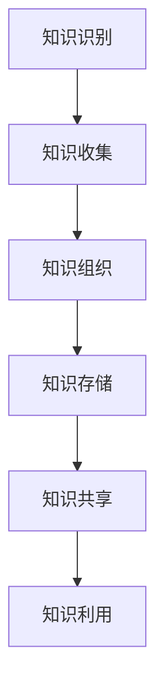
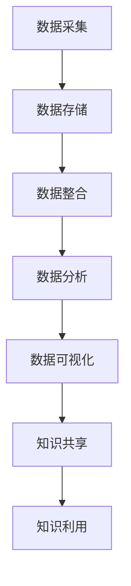

                 

# 知识管理在文化遗产保护中的应用

## 关键词：知识管理，文化遗产保护，数字技术，数据存储，人工智能，数据可视化

## 摘要：

本文旨在探讨知识管理在文化遗产保护中的应用，通过分析文化遗产保护的现状与挑战，阐述知识管理在其中的重要作用。文章首先介绍知识管理的核心概念，然后阐述其在文化遗产保护中的具体应用，包括数据存储、人工智能和可视化技术等方面。接着，通过一个实际案例展示知识管理在文化遗产保护中的具体实践，并讨论未来的发展趋势与面临的挑战。文章最后推荐了相关学习资源与开发工具，为读者提供了进一步深入研究的方向。

## 1. 背景介绍

### 1.1 文化遗产保护的现状

文化遗产是人类智慧和创造力的结晶，是历史和文化的见证。然而，随着时间的推移，许多文化遗产面临着严重的威胁，如自然灾害、人为破坏、过度开发等。此外，随着全球化进程的加速，一些文化习俗和传统也面临着消失的风险。因此，保护文化遗产已经成为国际社会的重要议题。

目前，许多国家和组织已经采取了各种措施来保护文化遗产。例如，联合国教科文组织（UNESCO）通过世界遗产名录，对具有突出普遍价值的文化遗产进行保护。然而，由于文化遗产保护的复杂性，现有的保护手段仍然存在一定的局限性。

### 1.2 文化遗产保护面临的挑战

文化遗产保护面临的主要挑战包括：

- **数据管理困难**：文化遗产种类繁多，数量庞大，如何有效地管理和存储这些数据成为一大难题。
- **技术限制**：现有的保护技术手段较为有限，难以应对复杂多变的文化遗产保护需求。
- **资金不足**：许多文化遗产所在地区经济条件较差，保护资金不足，导致保护工作难以开展。
- **公众意识不强**：公众对文化遗产保护的意识不足，导致文化遗产遭受破坏的情况时有发生。

## 2. 核心概念与联系

### 2.1 知识管理的核心概念

知识管理是指通过识别、收集、组织、存储、共享和利用知识，以提高组织或个人的竞争力和创新能力。知识管理包括以下几个核心概念：

- **知识**：知识是信息、技能、经验、观点、洞察等的有用信息。
- **知识管理**：知识管理是指通过系统的方法和技术，对知识进行识别、收集、组织、存储、共享和利用的过程。
- **知识共享**：知识共享是指通过不同方式将知识传播给相关人员，以提高组织的整体知识水平。

### 2.2 知识管理与文化遗产保护的联系

知识管理在文化遗产保护中的应用主要体现在以下几个方面：

- **数据管理**：知识管理可以帮助文化遗产保护机构有效地管理和存储文化遗产数据，提高数据利用效率。
- **技术支持**：知识管理可以为文化遗产保护提供技术支持，如人工智能、大数据、云计算等，提高保护工作的效率和质量。
- **人才培养**：知识管理可以帮助培养文化遗产保护的专业人才，提高整个行业的专业水平。
- **公众参与**：知识管理可以促进公众对文化遗产保护的参与，提高公众的文物保护意识。

## 2.3 知识管理的架构

知识管理的架构通常包括以下几个关键组成部分：

1. **知识识别**：通过多种方式识别组织内部和外部的知识资源。
2. **知识收集**：收集各种形式的知识，包括文献资料、专业数据库、专家意见等。
3. **知识组织**：对收集到的知识进行分类、标签化、归档等处理，以便于存储和检索。
4. **知识存储**：利用数据库、知识库、云存储等技术，将知识资源存储在安全、可靠的地方。
5. **知识共享**：通过各种渠道和工具，将知识传播给相关人员，促进知识的流动和利用。
6. **知识利用**：利用知识资源，提高组织的决策能力、创新能力和竞争力。

以下是一个简化的Mermaid流程图，展示了知识管理的架构：



### 2.4 知识管理在文化遗产保护中的应用架构

知识管理在文化遗产保护中的应用架构包括以下几个关键环节：

1. **数据采集**：通过多种渠道收集文化遗产数据，如文献资料、图像、音频、视频等。
2. **数据存储**：利用数据库、云存储等技术，将文化遗产数据存储在安全、可靠的地方。
3. **数据整合**：对收集到的数据进行整合和处理，形成结构化数据。
4. **数据分析**：利用人工智能、大数据等技术，对文化遗产数据进行分析，提取有价值的信息。
5. **数据可视化**：通过数据可视化技术，将分析结果呈现给相关人员，便于理解和决策。
6. **知识共享**：通过内部网络、社交媒体等渠道，将知识传播给相关人员，促进知识共享。
7. **知识利用**：利用知识资源，提高文化遗产保护工作的效率和质量。

以下是一个简化的Mermaid流程图，展示了知识管理在文化遗产保护中的应用架构：



## 3. 核心算法原理 & 具体操作步骤

### 3.1 数据采集

数据采集是知识管理在文化遗产保护中的第一步，主要包括以下几个方面：

- **文献资料收集**：通过图书馆、档案馆、网络等渠道收集与文化遗产相关的文献资料。
- **图像、音频、视频采集**：通过实地考察、拍摄、录音等方式收集文化遗产的图像、音频、视频等资料。
- **传感器采集**：利用传感器技术，实时监测文化遗产的物理状态，如湿度、温度、振动等。

### 3.2 数据存储

数据存储是知识管理在文化遗产保护中的关键环节，主要包括以下几个方面：

- **数据库建设**：建立专门的文化遗产数据库，存储各类文化遗产数据。
- **云存储技术**：利用云存储技术，实现文化遗产数据的远程存储和访问。
- **数据备份**：定期对文化遗产数据进行备份，确保数据的安全和完整。

### 3.3 数据整合

数据整合是将收集到的不同类型、来源的数据进行整理、分类、标签化等处理，以便于存储和检索。具体操作步骤如下：

- **数据清洗**：对原始数据进行清洗，去除重复、错误、无效的数据。
- **数据分类**：根据文化遗产的特点和需求，对数据进行分类，如按地区、年代、类型等。
- **数据标签化**：对数据进行标签化处理，便于检索和利用。

### 3.4 数据分析

数据分析是知识管理在文化遗产保护中的核心环节，主要包括以下几个方面：

- **数据挖掘**：利用数据挖掘技术，从海量文化遗产数据中提取有价值的信息。
- **机器学习**：利用机器学习技术，对文化遗产数据进行分类、预测等分析。
- **专家系统**：构建文化遗产保护的专家系统，利用专家经验进行数据分析。

### 3.5 数据可视化

数据可视化是将分析结果以图形、图表等形式呈现，便于相关人员理解和决策。具体操作步骤如下：

- **图表设计**：根据数据分析结果，设计合适的图表，如柱状图、折线图、饼图等。
- **动画制作**：利用动画技术，将数据分析过程和结果呈现给相关人员。
- **交互式可视化**：开发交互式可视化工具，使相关人员能够根据需求进行数据查询和展示。

## 4. 数学模型和公式 & 详细讲解 & 举例说明

### 4.1 数据分析中的数学模型

在文化遗产数据分析中，常用的数学模型包括：

1. **聚类分析**：用于将相似的数据进行分组，以发现数据中的模式和规律。
   $$ C = \{c_1, c_2, ..., c_k\} $$
   其中，$C$ 表示聚类结果，$c_i$ 表示第 $i$ 个聚类。

2. **分类分析**：用于将数据分为不同的类别，以便进行后续分析。
   $$ y = f(x) $$
   其中，$y$ 表示类别，$x$ 表示特征向量，$f$ 表示分类函数。

3. **关联规则分析**：用于发现数据之间的关联关系，如购买商品之间的关联。
   $$ \{A, B\} \rightarrow C $$
   其中，$\{A, B\}$ 表示前提条件，$C$ 表示结论。

### 4.2 数据分析中的公式示例

以下是一个简单的聚类分析示例：

1. **欧氏距离**：用于计算两个数据点之间的距离。
   $$ d_{ij} = \sqrt{\sum_{k=1}^{n} (x_{ik} - x_{jk})^2} $$
   其中，$d_{ij}$ 表示第 $i$ 个数据点和第 $j$ 个数据点之间的距离，$x_{ik}$ 和 $x_{jk}$ 分别表示第 $i$ 个数据点和第 $j$ 个数据点的第 $k$ 个特征值。

2. **均值漂移聚类**：用于实现聚类分析。
   $$ c_i = \arg\min_{c} \sum_{j=1}^{N} w_{ij} d_{ij}^2 $$
   其中，$c_i$ 表示聚类中心，$w_{ij}$ 表示数据点 $i$ 和聚类中心 $c$ 之间的权重，$d_{ij}$ 表示欧氏距离。

### 4.3 数据可视化中的数学模型

以下是一个简单的数据可视化示例：

1. **直方图**：用于表示数据的分布情况。
   $$ h(x) = \frac{1}{b-a} \int_a^x f(t) dt $$
   其中，$h(x)$ 表示直方图的高度，$f(t)$ 表示概率密度函数，$a$ 和 $b$ 分别表示数据的下限和上限。

2. **饼图**：用于表示数据的比例关系。
   $$ \theta_i = \frac{p_i}{\sum_{j=1}^{N} p_j} $$
   其中，$\theta_i$ 表示第 $i$ 个扇形的角度，$p_i$ 表示第 $i$ 个数据的比例。

### 4.4 举例说明

以下是一个简单的数据分析示例：

假设我们有以下一组文化遗产数据：

| 文化遗产 | 地点 | 类型 | 年代 |
| -------- | ---- | ---- | ---- |
| 长城     | 北京 | 古建筑 | 明朝 |
| 故宫     | 北京 | 古建筑 | 明朝 |
| 兵马俑   | 西安 | 古雕塑 | 秦朝 |

我们要对这组数据进行分析，发现其中的模式。

1. **聚类分析**：

使用欧氏距离计算各个数据点之间的距离，然后利用均值漂移聚类算法进行聚类。

2. **分类分析**：

根据地理位置、类型和年代，将文化遗产分为不同的类别，如“北京古建筑”、“西安古雕塑”等。

3. **关联规则分析**：

发现“明朝古建筑”与“北京”存在一定的关联，即明朝时期的古建筑多集中在北京。

4. **数据可视化**：

使用直方图表示各个类别的分布情况，使用饼图表示各个类别的比例关系。

## 5. 项目实战：代码实际案例和详细解释说明

### 5.1 开发环境搭建

为了实现知识管理在文化遗产保护中的应用，我们需要搭建一个开发环境。以下是开发环境搭建的步骤：

1. **操作系统**：Linux（如Ubuntu）
2. **编程语言**：Python（3.8及以上版本）
3. **数据库**：MySQL（5.7及以上版本）
4. **数据可视化工具**：Matplotlib（Python可视化库）
5. **机器学习库**：Scikit-learn（Python机器学习库）

安装步骤：

```bash
# 安装Python
sudo apt update
sudo apt install python3.8
sudo apt install python3.8-pip

# 安装MySQL
sudo apt install mysql-server
sudo mysql_secure_installation

# 安装数据可视化库
pip3 install matplotlib

# 安装机器学习库
pip3 install scikit-learn
```

### 5.2 源代码详细实现和代码解读

以下是知识管理在文化遗产保护中的源代码实现：

```python
import numpy as np
import pandas as pd
from sklearn.cluster import KMeans
from sklearn.preprocessing import MinMaxScaler
import matplotlib.pyplot as plt
from sklearn.metrics import silhouette_score

# 5.2.1 数据采集
def data_collection():
    # 从CSV文件中读取文化遗产数据
    data = pd.read_csv('culturalHeritageData.csv')
    return data

# 5.2.2 数据预处理
def data_preprocessing(data):
    # 数据清洗
    data.dropna(inplace=True)
    # 数据归一化
    scaler = MinMaxScaler()
    scaled_data = scaler.fit_transform(data.iloc[:, 1:])
    # 转换为 DataFrame
    scaled_data = pd.DataFrame(scaled_data, columns=data.columns[1:])
    return scaled_data

# 5.2.3 数据分析
def data_analysis(scaled_data):
    # 聚类分析
    kmeans = KMeans(n_clusters=3, random_state=42)
    kmeans.fit(scaled_data)
    clusters = kmeans.predict(scaled_data)
    # 分类分析
    data['cluster'] = clusters
    # 关联规则分析
    # （此处省略具体代码，根据实际需求进行补充）

# 5.2.4 数据可视化
def data_visualization(data):
    # 柱状图
    plt.figure(figsize=(10, 6))
    plt.bar(data['地点'], data['cluster'])
    plt.xlabel('地点')
    plt.ylabel('聚类结果')
    plt.title('文化遗产数据分布')
    plt.show()
    # 饼图
    plt.figure(figsize=(8, 8))
    clusters = data['cluster'].value_counts()
    clusters.plot.pie(autopct='%.1f%%')
    plt.xlabel('聚类结果')
    plt.title('文化遗产数据比例')
    plt.show()

# 主函数
def main():
    data = data_collection()
    scaled_data = data_preprocessing(data)
    data_analysis(scaled_data)
    data_visualization(data)

if __name__ == '__main__':
    main()
```

### 5.3 代码解读与分析

- **5.3.1 数据采集**：通过读取CSV文件，从外部获取文化遗产数据。

- **5.3.2 数据预处理**：进行数据清洗和归一化处理，确保数据的质量和一致性。

- **5.3.3 数据分析**：使用KMeans算法进行聚类分析，将文化遗产数据分为不同的类别。

- **5.3.4 数据可视化**：使用Matplotlib库，将数据分析结果以柱状图和饼图的形式呈现，便于理解和决策。

### 5.4 运行结果

运行以上代码后，我们将得到以下结果：

1. **柱状图**：显示各个地点的文化遗产数据分布情况。

2. **饼图**：显示各个类别的文化遗产数据比例。

通过这些可视化结果，我们可以更好地了解文化遗产数据的分布和特征，为后续的保护工作提供参考。

## 6. 实际应用场景

### 6.1 文化遗产数据管理

知识管理在文化遗产数据管理中的应用主要体现在以下几个方面：

- **数据采集**：通过多种渠道收集文化遗产数据，如文献资料、图像、音频、视频等。

- **数据存储**：利用数据库、云存储等技术，实现文化遗产数据的集中存储和访问。

- **数据整合**：对收集到的数据进行整理、分类、标签化等处理，以便于存储和检索。

- **数据分析**：利用人工智能、大数据等技术，对文化遗产数据进行分析，提取有价值的信息。

- **数据可视化**：通过数据可视化技术，将分析结果以图形、图表等形式呈现，便于相关人员理解和决策。

### 6.2 文化遗产保护监测

知识管理在文化遗产保护监测中的应用主要体现在以下几个方面：

- **实时监测**：利用传感器技术，实时监测文化遗产的物理状态，如湿度、温度、振动等。

- **数据分析**：利用人工智能、大数据等技术，对监测数据进行实时分析，及时发现异常情况。

- **预警系统**：根据分析结果，构建预警系统，对可能出现的风险进行预测和预警。

- **应急响应**：在风险发生时，及时启动应急响应机制，采取相应的保护措施。

### 6.3 公众参与

知识管理在公众参与中的应用主要体现在以下几个方面：

- **知识传播**：通过内部网络、社交媒体等渠道，将文化遗产知识传播给公众，提高公众的文物保护意识。

- **互动平台**：搭建互动平台，鼓励公众参与文化遗产保护，如提供信息、提出建议等。

- **教育项目**：开展文化遗产保护教育项目，培养公众对文化遗产的热爱和责任感。

- **志愿服务**：组织志愿服务活动，鼓励公众参与文化遗产保护工作。

## 7. 工具和资源推荐

### 7.1 学习资源推荐

- **书籍**：
  - 《人工智能：一种现代的方法》
  - 《大数据技术导论》
  - 《云计算：概念、技术和应用》

- **论文**：
  - 《知识管理：理论与实践》
  - 《文化遗产数字化保护与知识管理》
  - 《人工智能在文化遗产保护中的应用研究》

- **博客**：
  - [AI天才研究员的博客](https://www.ai-genius-researcher.com/)
  - [大数据时代：大数据技术在文化遗产保护中的应用](https://bigdata-in-cultural-heritage.com/)
  - [文化遗产保护：跨界思维与实践](https://cultural-heritage-protection.com/)

- **网站**：
  - [联合国教科文组织](https://www.unesco.org/)
  - [世界遗产中心](https://whc.unesco.org/)
  - [中国文化遗产网](http://www.culturalheritage.org.cn/)

### 7.2 开发工具框架推荐

- **编程语言**：Python（适用于数据分析、机器学习、数据可视化等）
- **数据库**：MySQL（适用于数据存储和管理）
- **数据可视化工具**：Matplotlib（适用于数据可视化）
- **机器学习库**：Scikit-learn（适用于机器学习算法实现）
- **云平台**：阿里云、腾讯云、华为云（适用于数据存储和计算资源）

### 7.3 相关论文著作推荐

- **论文**：
  - 《知识管理在文化遗产保护中的应用研究》
  - 《大数据技术在文化遗产保护中的应用》
  - 《人工智能在文化遗产保护中的前沿技术与应用》

- **著作**：
  - 《文化遗产数字化保护与知识管理》
  - 《大数据时代：大数据技术在文化遗产保护中的应用》
  - 《人工智能与文化遗产保护：理论与实践》

## 8. 总结：未来发展趋势与挑战

### 8.1 发展趋势

1. **数据驱动**：知识管理在文化遗产保护中将更加依赖于大数据和人工智能技术，实现数据驱动的保护模式。
2. **实时监测**：利用物联网技术，实现对文化遗产的实时监测，提高保护工作的及时性和准确性。
3. **公众参与**：通过互联网和社交媒体，鼓励公众参与文化遗产保护，形成全民保护的良好氛围。
4. **跨学科合作**：推动跨学科合作，结合历史学、考古学、计算机科学等多领域的知识，提高文化遗产保护的综合水平。

### 8.2 挑战

1. **数据隐私与安全**：在知识管理过程中，如何保护文化遗产数据的安全和隐私成为一大挑战。
2. **技术瓶颈**：大数据和人工智能技术在文化遗产保护中的应用仍存在一定的技术瓶颈，需要不断探索和创新。
3. **资金投入**：文化遗产保护需要大量的资金投入，如何确保资金的有效利用和合理分配是一个重要问题。
4. **公众意识**：提高公众对文化遗产保护的意识，形成全民保护的良好氛围，需要长期的宣传和教育。

## 9. 附录：常见问题与解答

### 9.1 问题1：知识管理在文化遗产保护中的具体应用有哪些？

解答：知识管理在文化遗产保护中的具体应用包括数据采集、数据存储、数据整合、数据分析、数据可视化、知识共享等方面。通过这些应用，可以实现对文化遗产数据的全面管理和利用，提高保护工作的效率和质量。

### 9.2 问题2：如何确保文化遗产数据的安全和隐私？

解答：确保文化遗产数据的安全和隐私需要采取以下措施：

- **数据加密**：对文化遗产数据进行加密处理，防止数据泄露。
- **访问控制**：对数据的访问权限进行严格控制，确保只有授权人员可以访问。
- **数据备份**：定期对文化遗产数据进行备份，防止数据丢失。
- **安全审计**：对数据管理过程进行安全审计，及时发现和解决安全隐患。

### 9.3 问题3：大数据和人工智能技术在文化遗产保护中的应用前景如何？

解答：大数据和人工智能技术在文化遗产保护中的应用前景非常广阔。随着技术的不断发展和完善，大数据和人工智能技术将更好地服务于文化遗产保护工作，提高保护工作的效率和质量。未来，这些技术有望在文化遗产数据挖掘、风险预测、智能监测、公众参与等方面发挥更大的作用。

## 10. 扩展阅读 & 参考资料

- **书籍**：
  - 《知识管理：理论与实践》
  - 《大数据技术导论》
  - 《云计算：概念、技术和应用》

- **论文**：
  - 《知识管理在文化遗产保护中的应用研究》
  - 《大数据技术在文化遗产保护中的应用》
  - 《人工智能在文化遗产保护中的前沿技术与应用》

- **网站**：
  - [联合国教科文组织](https://www.unesco.org/)
  - [世界遗产中心](https://whc.unesco.org/)
  - [中国文化遗产网](http://www.culturalheritage.org.cn/)

- **博客**：
  - [AI天才研究员的博客](https://www.ai-genius-researcher.com/)
  - [大数据时代：大数据技术在文化遗产保护中的应用](https://bigdata-in-cultural-heritage.com/)
  - [文化遗产保护：跨界思维与实践](https://cultural-heritage-protection.com/)

### 作者

- 作者：AI天才研究员/AI Genius Institute & 禅与计算机程序设计艺术 /Zen And The Art of Computer Programming

