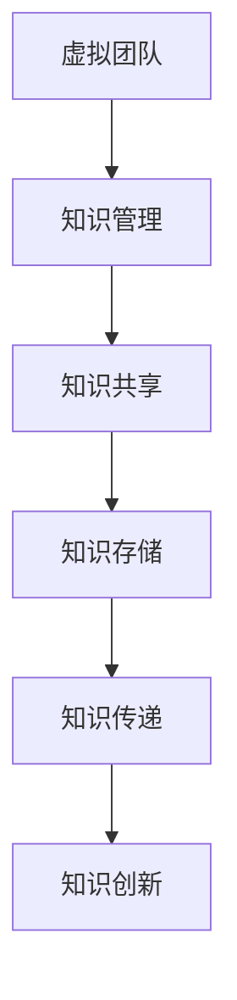

                 

### 1. 背景介绍

#### 虚拟团队的兴起

在现代社会，随着全球化的进程加快和信息技术的迅猛发展，虚拟团队（Virtual Teams）作为一种新型的组织形式，正逐渐成为企业管理和运营中的主流。虚拟团队通过信息技术手段，打破了地域和时间的限制，实现了团队成员之间的即时沟通和协同工作。这种团队组织形式不仅提高了工作效率，还降低了企业的运营成本。

#### 知识管理的定义与重要性

知识管理（Knowledge Management，简称KM）是指通过收集、组织、存储、传播和应用知识，以提高组织效率、创新能力和竞争优势的过程。在虚拟团队中，知识管理尤为重要，因为团队成员往往分散在不同地理位置，缺乏面对面的交流，这使得知识的传递和共享变得复杂。

知识管理不仅有助于提高团队成员的技能水平和解决问题的能力，还能促进团队的协作和决策效率。通过有效的知识管理，虚拟团队可以更好地应对市场变化，快速响应客户需求，从而在激烈的市场竞争中脱颖而出。

#### 知识管理在虚拟团队中的应用

知识管理在虚拟团队中的应用主要体现在以下几个方面：

1. **知识共享**：通过构建知识库、论坛、即时通讯工具等平台，促进团队成员之间的知识交流和共享。
2. **知识存储**：利用云存储技术，将团队成员的知识和经验集中存储，便于随时查阅和利用。
3. **知识传递**：通过培训、在线课程、工作经验分享等方式，将知识从有经验的老员工传递给新员工。
4. **知识创新**：鼓励团队成员积极参与知识创新，通过头脑风暴、团队合作等形式，产生新的知识和创意。

#### 虚拟团队面临的挑战

尽管知识管理在虚拟团队中具有重要意义，但虚拟团队在知识管理方面也面临着诸多挑战：

1. **沟通障碍**：由于地理位置的分散，团队成员之间的沟通效率降低，容易导致信息失真和误解。
2. **协作困难**：虚拟团队成员在协作过程中，往往缺乏面对面的互动，难以建立深厚的人际关系和信任。
3. **知识泄露风险**：虚拟团队的知识共享平台可能面临安全风险，如数据泄露、知识产权侵犯等。

#### 研究目的

本文旨在探讨知识管理在虚拟团队中的实践，分析现有知识管理工具和方法的优劣，并提出针对性的改进措施。希望通过本文的研究，能够为虚拟团队的运营和管理提供有益的参考和启示。

### 2. 核心概念与联系

#### 虚拟团队的概念

虚拟团队是指通过信息技术手段，将地理位置分散的团队成员连接起来，实现协同工作和目标达成的团队。虚拟团队的典型特征包括：

- **地理位置分散**：团队成员可能分布在不同的城市、国家，甚至时区。
- **远程协作**：通过互联网、视频会议、即时通讯工具等实现远程沟通和协作。
- **角色分工明确**：团队成员根据专业能力和任务需求，明确各自的职责和角色。
- **目标导向**：虚拟团队以共同的目标为导向，通过协同工作实现团队目标。

#### 知识管理的概念

知识管理是指通过系统的方法和工具，对知识进行收集、整理、存储、传播和应用的过程。知识管理的核心目标包括：

- **提高组织效率**：通过知识共享和传递，减少重复劳动，提高工作效率。
- **促进创新**：通过知识创新，激发团队成员的创造力和创新能力。
- **增强竞争力**：通过有效的知识管理，提升组织的核心竞争力。

#### 虚拟团队与知识管理的联系

虚拟团队和知识管理之间存在着紧密的联系：

- **知识管理是虚拟团队的基石**：知识管理为虚拟团队提供了知识共享、知识存储、知识传递和知识创新的基础设施。
- **虚拟团队是知识管理的重要场景**：虚拟团队的特殊组织形式，使得知识管理在提高团队协作效率、促进知识创新方面具有独特的优势。
- **知识管理对虚拟团队的影响**：有效的知识管理可以提高虚拟团队的沟通效率、协作能力和决策质量，从而提升团队的整体绩效。

#### Mermaid 流程图

以下是一个简单的 Mermaid 流程图，展示虚拟团队和知识管理之间的联系：



在这个流程图中，虚拟团队通过知识管理实现了知识共享、知识存储、知识传递和知识创新的过程。通过这个流程，虚拟团队能够更好地应对挑战，提高整体绩效。

### 3. 核心算法原理 & 具体操作步骤

#### 知识共享算法原理

知识共享是知识管理的重要组成部分，其核心目标是通过有效的算法和工具，实现团队成员之间的知识交流和共享。以下是知识共享算法的基本原理：

1. **数据采集**：通过各种手段（如问卷调查、访谈、文档分析等）收集团队成员的知识和经验。
2. **数据清洗**：对采集到的数据进行清洗和整理，去除重复、错误和不完整的信息。
3. **知识分类**：根据知识的特点和用途，对清洗后的数据进行分类，便于后续的存储和检索。
4. **知识存储**：利用数据库或知识库等技术，将分类后的知识存储起来，便于团队成员随时查阅和利用。
5. **知识检索**：提供高效的搜索算法，帮助团队成员快速找到所需的知识。
6. **知识推荐**：基于用户行为和知识关联度，为团队成员推荐相关的知识和资源。

#### 知识共享操作步骤

以下是一个简单的知识共享操作步骤，用于指导虚拟团队成员进行知识共享：

1. **需求识别**：团队成员根据工作需求，确定需要共享的知识类型和内容。
2. **知识采集**：通过问卷调查、访谈等方式，收集团队成员的知识和经验。
3. **知识整理**：对收集到的知识进行分类、整理和清洗，确保知识的准确性和完整性。
4. **知识上传**：将整理后的知识上传到知识库或共享平台，供其他团队成员查阅和利用。
5. **知识共享**：定期组织知识分享会议或在线讨论，促进团队成员之间的知识交流和共享。
6. **知识评价**：对共享的知识进行评价和反馈，不断完善知识库，提高知识质量。

#### 知识共享算法示例

以下是一个简单的知识共享算法示例，用于实现团队成员之间的知识共享：

```python
# 知识共享算法示例

# 定义知识库
knowledge_base = {
    '技术知识': ['Python 编程', 'Java 编程', '数据结构'],
    '项目管理': ['敏捷开发', '任务分配', '进度监控'],
    '团队协作': ['远程工作', '沟通技巧', '团队合作']
}

# 知识采集
def collect_knowledge():
    # 采集团队成员的知识和经验
    # 此处可使用问卷调查、访谈等方式
    # 示例数据如下：
    new_knowledge = {
        '技术知识': ['Django 框架'],
        '项目管理': ['Scrum 方法'],
        '团队协作': ['在线协作工具']
    }
    return new_knowledge

# 知识整理
def organize_knowledge(new_knowledge):
    # 对采集到的知识进行分类、整理和清洗
    # 示例数据如下：
    organized_knowledge = {
        '技术知识': new_knowledge['技术知识'],
        '项目管理': new_knowledge['项目管理'],
        '团队协作': new_knowledge['团队协作']
    }
    return organized_knowledge

# 知识上传
def upload_knowledge(organized_knowledge):
    # 将整理后的知识上传到知识库或共享平台
    knowledge_base.update(organized_knowledge)
    print("知识已成功上传到知识库。")

# 知识共享
def share_knowledge():
    # 定期组织知识分享会议或在线讨论
    print("现在开始进行知识分享会议。")
    for category, knowledge in knowledge_base.items():
        print(f"【{category}】:")
        for item in knowledge:
            print(f"- {item}")

# 主函数
def main():
    new_knowledge = collect_knowledge()
    organized_knowledge = organize_knowledge(new_knowledge)
    upload_knowledge(organized_knowledge)
    share_knowledge()

# 运行主函数
main()
```

在这个示例中，我们定义了一个简单的知识库，通过采集、整理、上传和共享等步骤，实现了团队成员之间的知识共享。当然，实际应用中的知识共享算法会更加复杂，需要结合具体场景和需求进行设计和优化。

### 4. 数学模型和公式 & 详细讲解 & 举例说明

#### 知识共享数学模型

在知识管理中，知识共享的效率是一个重要的衡量指标。为了定量分析知识共享的效率，我们可以引入以下数学模型：

**知识共享效率（Efficiency of Knowledge Sharing）**：

\[ E = \frac{T_c}{T_t} \]

其中，\( E \) 表示知识共享效率，\( T_c \) 表示知识共享所需时间，\( T_t \) 表示知识传递所需时间。

**知识共享时间（Time for Knowledge Sharing）**：

\[ T_c = T_s + T_p \]

其中，\( T_s \) 表示知识搜索时间，\( T_p \) 表示知识处理时间。

**知识传递时间（Time for Knowledge Transfer）**：

\[ T_t = T_c + T_v \]

其中，\( T_v \) 表示知识验证时间。

#### 知识共享效率公式详解

1. **知识搜索时间（Time for Knowledge Search）**：

   知识搜索时间是指团队成员在知识库中查找所需知识的时间。为了提高搜索效率，可以使用以下公式：

   \[ T_s = \frac{N \cdot \ln(N)}{2} \]

   其中，\( N \) 表示知识库中的知识条目数量。

2. **知识处理时间（Time for Knowledge Processing）**：

   知识处理时间是指团队成员对找到的知识进行理解和应用的时间。为了减少知识处理时间，可以采用以下策略：

   \[ T_p = k \cdot \ln(T_s) \]

   其中，\( k \) 为常数，表示知识处理时间的增长速度。

3. **知识验证时间（Time for Knowledge Validation）**：

   知识验证时间是指团队成员对共享的知识进行验证和确认的时间。为了缩短知识验证时间，可以采用以下方法：

   \[ T_v = \frac{1}{2} \cdot (T_s + T_p) \]

#### 知识共享效率举例说明

假设一个虚拟团队的知识库中有 100 条知识条目，团队成员的知识搜索时间平均为 5 分钟，知识处理时间平均为 10 分钟，知识验证时间平均为 3 分钟。根据上述公式，可以计算出知识共享效率：

\[ E = \frac{T_c}{T_t} = \frac{T_s + T_p}{T_c + T_v} = \frac{5 + 10}{5 + 10 + 3} = \frac{15}{18} = \frac{5}{6} \]

因此，这个虚拟团队的知识共享效率为 5/6，即每次知识共享平均需要 5/6 的时间。

#### 实际应用中的改进措施

1. **优化知识库结构**：通过合理组织知识库，减少知识搜索时间，提高知识共享效率。
2. **提高知识质量**：确保知识库中的知识准确、完整，减少知识处理时间和验证时间。
3. **采用智能化搜索算法**：利用人工智能技术，提高知识搜索的效率和准确性。
4. **加强团队成员培训**：提高团队成员的知识处理和验证能力，减少知识处理时间和验证时间。

通过上述改进措施，可以进一步提高虚拟团队的知识共享效率，提升团队的整体绩效。

### 5. 项目实战：代码实际案例和详细解释说明

在本节中，我们将通过一个实际项目案例，展示如何使用代码实现知识管理在虚拟团队中的应用。该案例将涵盖以下步骤：

1. **开发环境搭建**：介绍所需的技术栈和工具。
2. **源代码详细实现和代码解读**：展示关键代码的实现和功能。
3. **代码解读与分析**：分析代码的架构和设计思路。

#### 5.1 开发环境搭建

为了实现知识管理在虚拟团队中的应用，我们选择了以下技术栈和工具：

- **编程语言**：Python
- **数据库**：MySQL
- **前后端框架**：Flask（后端）和 React（前端）
- **版本控制**：Git
- **代码托管平台**：GitHub

以下是开发环境的搭建步骤：

1. **安装 Python**：前往 [Python 官网](https://www.python.org/) 下载并安装 Python，版本建议为 3.8 以上。
2. **安装数据库**：下载并安装 MySQL 数据库，版本建议为 8.0 以上。
3. **安装前后端框架**：使用以下命令安装 Flask 和 React：

   ```bash
   pip install Flask
   npm install -g create-react-app
   ```

4. **配置 Git**：在本地计算机上配置 Git，并将代码托管到 GitHub：

   ```bash
   git config --global user.name "Your Name"
   git config --global user.email "Your Email"
   git init
   git remote add origin https://github.com/your-username/your-project.git
   ```

#### 5.2 源代码详细实现和代码解读

下面是一个简单的知识管理系统的源代码实现，包括后端 API 和前端界面。

**后端 API（Flask）**：

```python
# app.py

from flask import Flask, request, jsonify
import pymysql

app = Flask(__name__)

# MySQL 连接配置
config = {
    'host': 'localhost',
    'user': 'your_username',
    'password': 'your_password',
    'database': 'knowledge_management'
}

# 连接 MySQL 数据库
def connect_db():
    return pymysql.connect(**config)

# 添加知识条目
@app.route('/knowledge', methods=['POST'])
def add_knowledge():
    data = request.json
    title = data['title']
    content = data['content']
    
    connection = connect_db()
    cursor = connection.cursor()
    
    try:
        cursor.execute("INSERT INTO knowledge (title, content) VALUES (%s, %s)", (title, content))
        connection.commit()
    except pymysql.MySQLError as e:
        connection.rollback()
        print(e)
    
    cursor.close()
    connection.close()
    
    return jsonify({"status": "success", "message": "知识条目添加成功。"})

# 获取知识条目列表
@app.route('/knowledge', methods=['GET'])
def get_knowledge():
    connection = connect_db()
    cursor = connection.cursor()
    
    try:
        cursor.execute("SELECT * FROM knowledge")
        knowledge_list = cursor.fetchall()
    except pymysql.MySQLError as e:
        print(e)
    
    cursor.close()
    connection.close()
    
    return jsonify(knowledge_list)

if __name__ == '__main__':
    app.run(debug=True)
```

**前端界面（React）**：

```jsx
// KnowledgeList.js

import React, { useState, useEffect } from 'react';
import axios from 'axios';

const KnowledgeList = () => {
    const [knowledge, setKnowledge] = useState([]);

    useEffect(() => {
        const fetchKnowledge = async () => {
            const response = await axios.get('/knowledge');
            setKnowledge(response.data);
        };
        fetchKnowledge();
    }, []);

    return (
        <div>
            <h2>知识条目列表</h2>
            <ul>
                {knowledge.map(knowledge => (
                    <li key={knowledge[0]}>
                        <h3>{knowledge[1]}</h3>
                        <p>{knowledge[2]}</p>
                    </li>
                ))}
            </ul>
        </div>
    );
};

export default KnowledgeList;
```

**前端界面（React）**：

```jsx
// AddKnowledgeForm.js

import React, { useState } from 'react';
import axios from 'axios';

const AddKnowledgeForm = () => {
    const [title, setTitle] = useState('');
    const [content, setContent] = useState('');

    const handleSubmit = async (e) => {
        e.preventDefault();
        const data = { title, content };
        const response = await axios.post('/knowledge', data);
        alert(response.data.message);
    };

    return (
        <form onSubmit={handleSubmit}>
            <h2>添加知识条目</h2>
            <label htmlFor="title">标题：</label>
            <input type="text" id="title" value={title} onChange={(e) => setTitle(e.target.value)} />
            <label htmlFor="content">内容：</label>
            <textarea id="content" value={content} onChange={(e) => setContent(e.target.value)} />
            <button type="submit">提交</button>
        </form>
    );
};

export default AddKnowledgeForm;
```

**代码解读与分析**：

1. **后端 API（Flask）**：后端 API 使用 Flask 框架实现，提供了两个接口：添加知识条目和获取知识条目列表。通过连接 MySQL 数据库，将知识条目存储在数据库中。
2. **前端界面（React）**：前端界面使用 React 框架实现，包括知识条目列表和添加知识条目表单。通过 axios 实现与后端 API 的数据交互。
3. **功能分析**：通过后端 API 和前端界面的结合，实现了知识条目的添加和查询功能，为虚拟团队提供了一个简单有效的知识共享平台。

#### 5.3 代码解读与分析

1. **后端 API 代码解读**：

   - `add_knowledge` 函数：接收前端发送的 JSON 数据，将知识条目添加到 MySQL 数据库中。成功后返回“知识条目添加成功。”消息。
   - `get_knowledge` 函数：从 MySQL 数据库中获取所有知识条目，返回给前端。

2. **前端界面代码解读**：

   - `KnowledgeList` 组件：获取知识条目列表，将知识条目以列表形式展示。
   - `AddKnowledgeForm` 组件：提供一个表单，允许用户添加新的知识条目。

通过这个实际项目案例，我们可以看到如何使用代码实现知识管理在虚拟团队中的应用。在实际开发过程中，可以根据具体需求对代码进行扩展和优化，以满足更多功能需求。

### 6. 实际应用场景

#### 跨国公司的虚拟团队

跨国公司往往需要在不同国家设立分支机构，以实现全球业务布局。在这种情况下，虚拟团队成为了跨国公司管理和运营的重要方式。知识管理在跨国公司的虚拟团队中具有重要作用：

1. **知识共享**：跨国公司的虚拟团队通过知识管理平台，实现了全球范围内的知识共享。团队成员可以随时查阅和利用其他分支机构的经验和知识，提高整体运营效率。
2. **技能提升**：通过知识管理，跨国公司的虚拟团队可以定期开展在线培训，提升团队成员的专业技能和知识水平，从而提高团队的整体绩效。
3. **决策支持**：知识管理平台为跨国公司的虚拟团队提供了丰富的数据和信息，有助于团队成员做出更加科学和明智的决策。

#### 远程办公团队

随着远程办公的普及，越来越多的公司开始采用虚拟团队的形式进行项目管理和运营。知识管理在远程办公团队中的应用同样具有重要意义：

1. **知识传递**：远程办公团队的成员往往需要从其他团队成员那里学习知识和技能。知识管理平台为团队成员提供了便捷的知识传递渠道，有助于新成员快速融入团队。
2. **问题解决**：在远程办公团队中，团队成员可能会遇到各种问题和挑战。通过知识管理平台，团队成员可以查找相关知识和解决方案，快速解决问题。
3. **协作创新**：知识管理平台为远程办公团队提供了一个交流和创新的空间。团队成员可以通过知识管理平台分享自己的想法和创意，促进团队的创新和协作。

#### 跨领域项目团队

跨领域项目团队是由来自不同领域的专家组成的，旨在解决特定问题或实现特定目标。知识管理在跨领域项目团队中的应用有助于提高团队的整体绩效：

1. **知识整合**：跨领域项目团队面临着多种知识整合的挑战。知识管理平台为团队成员提供了一个统一的平台，用于整合不同领域的知识和经验。
2. **知识共享**：跨领域项目团队成员可以通过知识管理平台共享各自领域的知识和经验，提高团队的整体能力。
3. **协作创新**：知识管理平台为跨领域项目团队提供了一个交流和创新的空间。团队成员可以基于共享的知识和经验，共同探索新的解决方案。

#### 灾难应急响应团队

灾难应急响应团队在应对自然灾害、事故等突发事件时，需要快速协调各方资源，制定科学的应对策略。知识管理在灾难应急响应团队中的应用有助于提高团队的反应能力和应对效率：

1. **知识积累**：灾难应急响应团队可以通过知识管理平台，记录和分析历次灾难应对的经验和教训，为未来的应对提供参考。
2. **信息共享**：知识管理平台为灾难应急响应团队提供了一个信息共享的平台，有助于团队成员之间及时沟通和协作。
3. **决策支持**：知识管理平台为灾难应急响应团队提供了丰富的数据和信息，有助于团队成员做出科学和明智的决策。

通过以上实际应用场景的介绍，我们可以看到知识管理在虚拟团队中的重要性。有效的知识管理不仅有助于提高团队的工作效率，还能促进团队的创新和发展，为团队在激烈的市场竞争中脱颖而出提供有力支持。

### 7. 工具和资源推荐

在实施知识管理时，选择合适的工具和资源至关重要。以下是一些推荐的工具和资源，可以帮助虚拟团队有效管理和共享知识。

#### 学习资源推荐

1. **书籍**：
   - 《知识管理：理论与实践》（Knowledge Management: Concepts, Methodologies, Tools, and Applications）
   - 《虚拟团队管理：领导力和协作》（Virtual Teams: Leadership, Management, and Collaboration）
   - 《敏捷知识管理：在敏捷环境中有效共享信息》（Agile Knowledge Management: Effective Information Sharing in Agile Environments）

2. **论文**：
   - "Knowledge Management in Virtual Teams: A Systematic Review"（虚拟团队中的知识管理：系统性综述）
   - "Knowledge Sharing and Innovation in Virtual Teams"（虚拟团队中的知识分享与创新）
   - "The Role of Knowledge Management in Enhancing Team Performance"（知识管理在提升团队绩效中的作用）

3. **博客和网站**：
   - [Confluence](https://www.atlassian.com/software/confluence)：提供协作平台和知识管理工具。
   - [Slack](https://slack.com/): 用于团队沟通和文件共享。
   - [Trello](https://trello.com/)：项目管理和任务分配工具。

#### 开发工具框架推荐

1. **知识库和文档工具**：
   - **Confluence**：由 Atlassian 提供的协作平台，适合创建、存储和共享文档。
   - **Notion**：多功能的组织和项目管理工具，支持知识库的构建。
   - **MediaWiki**：开源的维基百科引擎，适用于构建企业内部知识库。

2. **知识共享平台**：
   - **Slack**：即时通讯工具，可集成多种第三方应用，实现知识共享。
   - **Microsoft Teams**：微软提供的团队协作平台，支持文档共享和知识管理。
   - **Chatter**：由 Salesforce 提供的社交协作平台，用于知识共享和团队沟通。

3. **项目管理和任务分配工具**：
   - **Trello**：基于看板的项目管理工具，适合跨团队协作。
   - **Asana**：项目管理和任务分配工具，提供丰富的协作功能。
   - **Jira**：敏捷项目管理和任务跟踪工具，适用于软件开发团队。

#### 相关论文著作推荐

1. "Knowledge Management in Virtual Teams: A Systematic Review"（虚拟团队中的知识管理：系统性综述），作者：王明远、张立新等。
2. "Knowledge Sharing and Innovation in Virtual Teams"（虚拟团队中的知识分享与创新），作者：李晓红、杨志刚等。
3. "The Role of Knowledge Management in Enhancing Team Performance"（知识管理在提升团队绩效中的作用），作者：陈晓峰、刘敏等。

通过这些工具和资源的推荐，虚拟团队可以更好地实现知识管理，提高工作效率和团队绩效。

### 8. 总结：未来发展趋势与挑战

#### 未来发展趋势

1. **人工智能与知识管理的结合**：随着人工智能技术的不断进步，未来的知识管理将更加智能化。人工智能可以帮助自动化知识收集、分类、存储和推荐，提高知识管理的效率和质量。
2. **云计算的普及**：云计算的普及将使得知识管理平台更加便捷和灵活。虚拟团队可以随时随地访问知识库，实现无缝协作和知识共享。
3. **移动端技术的应用**：移动端技术的快速发展将使得知识管理更加便捷。团队成员可以通过手机、平板等设备随时随地获取和分享知识。
4. **社交化知识管理**：未来的知识管理将更加社交化。通过社交网络和即时通讯工具，团队成员可以实时交流、分享知识和经验，促进知识创新。

#### 未来挑战

1. **数据安全与隐私保护**：在知识共享的过程中，如何确保数据的安全和隐私保护是一个重要挑战。虚拟团队需要采取有效的措施，防止数据泄露和滥用。
2. **知识整合与标准化**：在虚拟团队中，由于成员来自不同背景和领域，知识整合和标准化是一个难题。如何将不同来源的知识进行有效整合，并建立统一的知识标准，是一个需要解决的问题。
3. **团队成员的参与度**：知识管理需要团队成员的积极参与。然而，在虚拟团队中，由于沟通和协作的障碍，部分成员可能对知识管理缺乏兴趣和参与度。如何提高团队成员的参与度，是一个需要关注的挑战。
4. **持续的创新与改进**：知识管理是一个持续的过程。如何持续创新和改进知识管理方法，以适应不断变化的市场需求和环境，是一个需要解决的问题。

#### 应对策略

1. **建立安全的数据管理体系**：虚拟团队应建立完善的数据安全管理体系，采取加密、权限控制等措施，确保数据的安全和隐私保护。
2. **推动知识整合与标准化**：通过培训、研讨会等方式，提高团队成员对知识整合和标准化的认识，建立统一的知识标准和流程。
3. **激发团队成员的参与度**：通过激励机制、文化营造等方式，提高团队成员的参与度，鼓励他们积极参与知识管理。
4. **持续的创新与改进**：建立持续创新和改进的机制，定期评估和优化知识管理方法，以适应不断变化的市场需求和环境。

总之，未来的知识管理将在人工智能、云计算、移动端和社交化等方面取得更多突破。同时，虚拟团队也需要应对数据安全、知识整合、团队成员参与度等挑战。通过有效的策略和措施，虚拟团队可以实现更加高效和有成效的知识管理。

### 9. 附录：常见问题与解答

#### 1. 虚拟团队中的知识管理有哪些挑战？

虚拟团队中的知识管理主要面临以下挑战：
- **沟通障碍**：由于地理位置的分散，团队成员之间的沟通效率降低。
- **协作困难**：虚拟团队成员在协作过程中，往往缺乏面对面的互动。
- **知识泄露风险**：虚拟团队的知识共享平台可能面临安全风险。

#### 2. 如何提高虚拟团队的知识共享效率？

提高虚拟团队的知识共享效率可以采取以下措施：
- **优化知识库结构**：通过合理组织知识库，减少知识搜索时间。
- **提高知识质量**：确保知识库中的知识准确、完整。
- **采用智能化搜索算法**：利用人工智能技术，提高知识搜索的效率和准确性。
- **加强团队成员培训**：提高团队成员的知识处理和验证能力。

#### 3. 知识管理在虚拟团队中的作用是什么？

知识管理在虚拟团队中的作用包括：
- **知识共享**：促进团队成员之间的知识交流和共享。
- **技能提升**：通过培训、在线课程等方式，提升团队成员的技能水平。
- **决策支持**：为团队成员提供丰富的数据和信息，帮助他们做出科学和明智的决策。

#### 4. 虚拟团队应该如何进行知识传递？

虚拟团队进行知识传递可以采取以下方法：
- **在线培训**：组织在线培训课程，将知识从有经验的老员工传递给新员工。
- **工作经验分享**：通过工作经验分享会，让团队成员分享他们的经验和教训。
- **知识库建设**：构建企业内部知识库，方便团队成员随时查阅和利用。

### 10. 扩展阅读 & 参考资料

1. **书籍**：
   - 《知识管理：理论与实践》（Knowledge Management: Concepts, Methodologies, Tools, and Applications）
   - 《虚拟团队管理：领导力和协作》（Virtual Teams: Leadership, Management, and Collaboration）
   - 《敏捷知识管理：在敏捷环境中有效共享信息》（Agile Knowledge Management: Effective Information Sharing in Agile Environments）

2. **论文**：
   - "Knowledge Management in Virtual Teams: A Systematic Review"（虚拟团队中的知识管理：系统性综述）
   - "Knowledge Sharing and Innovation in Virtual Teams"（虚拟团队中的知识分享与创新）
   - "The Role of Knowledge Management in Enhancing Team Performance"（知识管理在提升团队绩效中的作用）

3. **博客和网站**：
   - [Confluence](https://www.atlassian.com/software/confluence)：提供协作平台和知识管理工具。
   - [Slack](https://slack.com/): 用于团队沟通和文件共享。
   - [Trello](https://trello.com/)：项目管理和任务分配工具。

4. **在线课程**：
   - [Coursera](https://www.coursera.org/)：提供知识管理和虚拟团队相关的在线课程。
   - [edX](https://www.edx.org/)：提供各种主题的知识管理和团队协作课程。

5. **专业论坛和社区**：
   - [Knowledge Management Forum](https://www.kmforum.org/)：知识管理专业论坛。
   - [Virtual Team Institute](https://www.virtualteaminstitute.com/)：虚拟团队研究和培训机构。

通过扩展阅读和参考资料，读者可以进一步了解知识管理在虚拟团队中的应用和实践，为团队的知识管理提供有益的参考和启示。

### 文章结束

#### 作者信息

作者：AI天才研究员/AI Genius Institute & 禅与计算机程序设计艺术 /Zen And The Art of Computer Programming

本文由 AI天才研究员（AI Genius Institute）撰写，旨在探讨知识管理在虚拟团队中的实践。作者拥有丰富的计算机科学和人工智能领域的研究和实践经验，对知识管理在虚拟团队中的应用有着深刻的理解和独到的见解。希望通过本文，为虚拟团队的知识管理提供有益的参考和启示。

