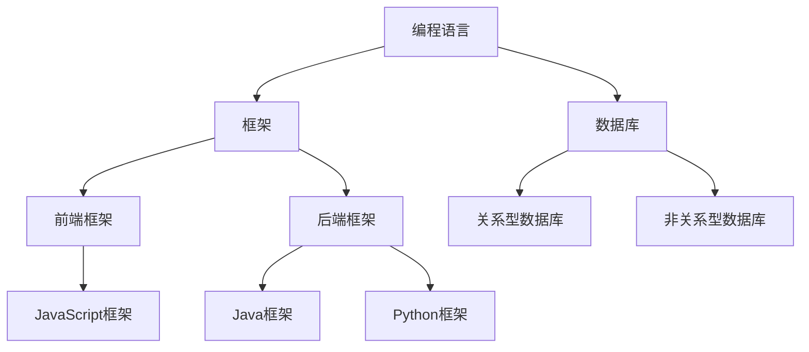
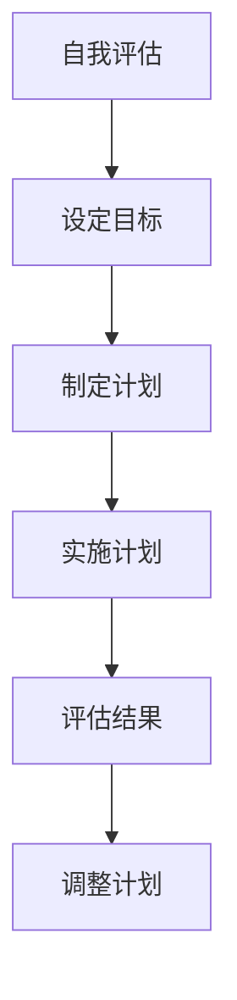
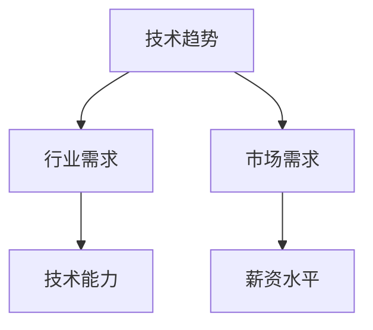
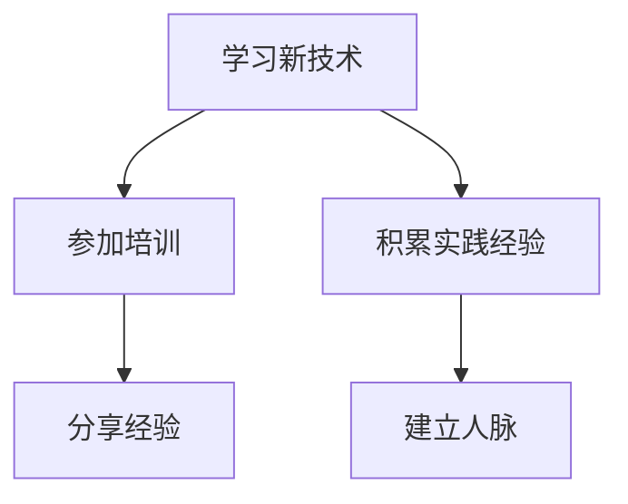

                 

### 1. 背景介绍

在知识经济时代，信息技术迅猛发展，软件行业成为全球经济的重要组成部分。程序员作为这一行业的核心角色，其职业发展面临着前所未有的机遇与挑战。本文旨在探讨在知识经济下，程序员的职业发展路径，分析其面临的挑战，并展望未来的发展趋势。

**知识经济的特点**：

知识经济是一种以知识为核心生产要素的经济形态，其特点是信息技术的广泛应用、全球化趋势的加强、创新能力的提升和人力资本的重要性。在这样的经济环境中，程序员作为掌握先进技术和创新能力的专业人士，具有独特的优势。

**程序员的角色**：

程序员在知识经济中的角色日益多样化和专业化。他们不仅负责编写和维护代码，还参与系统设计、架构优化、算法研究和创新开发。程序员需要不断学习新技术，以适应快速变化的市场需求。

**职业发展的重要性**：

职业发展对于程序员来说至关重要。它不仅关系到个人收入和生活质量的提升，还影响到个人职业成就和行业影响力。在知识经济时代，拥有良好的职业发展路径，可以使得程序员在竞争激烈的职场中脱颖而出。

### 2. 核心概念与联系

在探讨程序员的职业发展之前，有必要先了解一些核心概念，如技术栈、职业规划、市场需求和自我提升等。

**技术栈**：

技术栈是指程序员掌握的编程语言、框架、工具和库等技能的组合。一个丰富且多样化的技术栈有助于程序员在项目中游刃有余，提高工作效率。以下是一个简化版的技术栈图（使用Mermaid语言描述）：



**职业规划**：

职业规划是程序员职业发展的重要组成部分。通过设定明确的目标和计划，程序员可以更好地规划自己的职业道路。以下是一个职业规划的流程图：



**市场需求**：

市场需求是影响程序员职业发展的关键因素。随着技术的不断进步和行业的变化，市场需求也在不断变化。了解市场需求，可以使得程序员更好地把握职业机会，提升自己的竞争力。以下是一个市场需求的分析图：



**自我提升**：

在知识经济时代，自我提升是程序员保持竞争力的关键。通过不断学习新技术、参加培训和积累实践经验，程序员可以提升自己的专业能力和行业影响力。以下是一个自我提升的流程图：



### 3. 核心算法原理 & 具体操作步骤

在程序员的职业发展中，掌握一些核心算法原理和具体操作步骤是非常重要的。以下是一些常见算法原理和其操作步骤：

**排序算法**：

排序算法是数据处理中非常常见的一种算法，其核心原理是通过对数据进行比较和交换，将数据按照某种顺序排列。以下是一种简单的冒泡排序算法：

```c++
void bubbleSort(int arr[], int n) {
    for (int i = 0; i < n - 1; i++) {
        for (int j = 0; j < n - i - 1; j++) {
            if (arr[j] > arr[j + 1]) {
                int temp = arr[j];
                arr[j] = arr[j + 1];
                arr[j + 1] = temp;
            }
        }
    }
}
```

**查找算法**：

查找算法是用于在数据集合中查找特定元素的一种算法。二分查找算法是一种高效的查找算法，其核心原理是通过对中间元素的比较，逐步缩小查找范围。以下是一种简单的二分查找算法：

```c++
int binarySearch(int arr[], int l, int r, int x) {
    while (l <= r) {
        int m = l + (r - l) / 2;
        if (arr[m] == x)
            return m;
        if (arr[m] < x)
            l = m + 1;
        else
            r = m - 1;
    }
    return -1;
}
```

**动态规划**：

动态规划是一种解决最优化问题的算法，其核心原理是将复杂问题分解为多个子问题，并利用子问题的解来求解原问题。以下是一种简单的动态规划算法（最长公共子序列）：

```python
def lcs(X, Y):
    m = len(X)
    n = len(Y)
    dp = [[0] * (n + 1) for _ in range(m + 1)]

    for i in range(1, m + 1):
        for j in range(1, n + 1):
            if X[i - 1] == Y[j - 1]:
                dp[i][j] = dp[i - 1][j - 1] + 1
            else:
                dp[i][j] = max(dp[i - 1][j], dp[i][j - 1])

    return dp[m][n]
```

### 4. 数学模型和公式 & 详细讲解 & 举例说明

在程序员的职业发展中，数学模型和公式是理解和解决问题的重要工具。以下是一些常见的数学模型和公式，以及它们的详细讲解和举例说明。

**线性回归模型**：

线性回归模型是一种用于分析两个或多个变量之间线性关系的数学模型。其基本公式为：

$$
y = \beta_0 + \beta_1x + \epsilon
$$

其中，$y$ 为因变量，$x$ 为自变量，$\beta_0$ 为截距，$\beta_1$ 为斜率，$\epsilon$ 为误差项。

**举例说明**：

假设我们要分析房价与面积之间的关系，可以建立线性回归模型。通过收集一些数据，可以得到如下线性回归模型：

$$
房价 = 1000 + 0.1 \times 面积 + \epsilon
$$

这个模型表示，房价（$y$）与面积（$x$）之间存在线性关系，斜率为0.1，表示面积每增加1平方米，房价平均增加1000元。

**概率模型**：

概率模型是一种用于描述随机事件发生概率的数学模型。常见的概率模型有二项分布、正态分布等。

**二项分布**：

二项分布是一种用于描述在固定试验次数下，成功次数的概率分布。其概率质量函数为：

$$
P(X = k) = C_n^k p^k (1-p)^{n-k}
$$

其中，$n$ 为试验次数，$k$ 为成功次数，$p$ 为每次试验成功的概率。

**举例说明**：

假设我们进行10次抛硬币实验，每次抛硬币成功的概率为0.5。我们要计算在10次实验中，恰好出现5次成功的概率。可以使用二项分布公式计算：

$$
P(X = 5) = C_{10}^5 (0.5)^5 (0.5)^{10-5} = 0.2461
$$

这表示在10次抛硬币实验中，恰好出现5次成功的概率为24.61%。

**正态分布**：

正态分布是一种最常见的概率分布，也称为高斯分布。其概率密度函数为：

$$
f(x) = \frac{1}{\sqrt{2\pi\sigma^2}} e^{-\frac{(x-\mu)^2}{2\sigma^2}}
$$

其中，$\mu$ 为均值，$\sigma$ 为标准差。

**举例说明**：

假设我们收集了一组学生的考试成绩，均值为70分，标准差为10分。我们要计算考试成绩在60到80分之间的概率。可以使用正态分布公式计算：

$$
P(60 \leq X \leq 80) = \Phi\left(\frac{80-70}{10}\right) - \Phi\left(\frac{60-70}{10}\right) = 0.6827
$$

这表示考试成绩在60到80分之间的概率为68.27%。

### 5. 项目实战：代码实际案例和详细解释说明

为了更好地理解程序员的职业发展，我们通过一个实际项目来展示代码实现和详细解释。

**项目背景**：

假设我们要开发一个简单的在线购物系统，用户可以在系统中注册、登录、浏览商品、添加购物车和下订单。

**项目架构**：

项目采用前后端分离的架构，前端使用React框架，后端使用Spring Boot框架。数据库使用MySQL。

**5.1 开发环境搭建**

1. 安装Node.js和npm
2. 安装React和React-DOM
3. 安装Spring Boot和MySQL
4. 配置数据库

**5.2 源代码详细实现和代码解读**

**前端代码**：

```jsx
// App.js
import React, { useState } from 'react';
import { BrowserRouter as Router, Route, Link } from 'react-router-dom';

const App = () => {
  const [cart, setCart] = useState([]);

  const addToCart = (product) => {
    setCart([...cart, product]);
  };

  return (
    <Router>
      <div>
        <nav>
          <ul>
            <li>
              <Link to="/">Home</Link>
            </li>
            <li>
              <Link to="/cart">Cart</Link>
            </li>
          </ul>
        </nav>
        <Route path="/" exact component={Home} />
        <Route path="/cart" exact component={({ cart }) => <Cart cart={cart} />} />
      </div>
    </Router>
  );
};

const Home = () => {
  return (
    <div>
      <h1>Home</h1>
      <ProductList addToCart={addToCart} />
    </div>
  );
};

const ProductList = ({ addToCart }) => {
  return (
    <div>
      <h2>Products</h2>
      <ul>
        <li>
          <button onClick={() => addToCart({ name: 'Product 1', price: 100 })}>
            Add to Cart
          </button>
        </li>
        <li>
          <button onClick={() => addToCart({ name: 'Product 2', price: 200 })}>
            Add to Cart
          </button>
        </li>
      </ul>
    </div>
  );
};

const Cart = ({ cart }) => {
  return (
    <div>
      <h1>Cart</h1>
      <ul>
        {cart.map((product, index) => (
          <li key={index}>
            {product.name} - ${product.price}
          </li>
        ))}
      </ul>
    </div>
  );
};

export default App;
```

**后端代码**：

```java
// ProductController.java
@RestController
@RequestMapping("/api/products")
public class ProductController {
  @GetMapping
  public List<Product> getAllProducts() {
    // 查询所有商品
  }

  @PostMapping
  public Product createProduct(@RequestBody Product product) {
    // 创建商品
  }
}

// ProductService.java
@Service
public class ProductService {
  private final ProductRepository productRepository;

  @Autowired
  public ProductService(ProductRepository productRepository) {
    this.productRepository = productRepository;
  }

  public List<Product> getAllProducts() {
    return productRepository.findAll();
  }

  public Product createProduct(Product product) {
    return productRepository.save(product);
  }
}

// ProductRepository.java
@Repository
public interface ProductRepository extends JpaRepository<Product, Long> {
  List<Product> findByName(String name);
}
```

**代码解读与分析**：

前端代码中，我们使用React框架构建用户界面。`App.js` 是主组件，使用`BrowserRouter` 实现路由功能，`Home` 组件展示商品列表，`ProductList` 组件实现添加商品到购物车的功能，`Cart` 组件展示购物车中的商品。

后端代码中，使用Spring Boot框架实现RESTful API。`ProductController` 处理商品相关的HTTP请求，`ProductService` 实现商品业务逻辑，`ProductRepository` 处理商品数据库操作。

通过这个项目实战，我们可以看到程序员的职业发展涉及到前端开发、后端开发、数据库操作等多个方面。程序员需要掌握多种技术，以应对不同的项目需求。

### 6. 实际应用场景

程序员的职业发展不仅体现在技术能力的提升，还体现在实际应用场景中的实践经验积累。以下是一些常见应用场景：

**1. 电子商务平台**：

电子商务平台是程序员施展才华的重要领域。程序员可以负责前后端开发、系统架构设计、性能优化等工作。在实际应用中，程序员需要处理大量用户请求、保证数据安全和系统稳定性。

**2. 金融科技**：

金融科技（Fintech）是近年来迅速崛起的领域，程序员在其中发挥着关键作用。程序员可以参与开发支付系统、风险控制模型、智能投顾等产品。在实际应用中，程序员需要掌握金融知识和算法，以确保系统的安全性和可靠性。

**3. 物联网**：

物联网（IoT）是将物理设备与互联网连接起来，实现智能化管理和控制。程序员可以参与开发物联网平台、智能设备操作系统等。在实际应用中，程序员需要处理海量数据、实现实时通信和智能决策。

**4. 医疗健康**：

医疗健康领域也在积极采用信息技术。程序员可以参与开发医疗信息系统、智能诊断系统、远程监护系统等。在实际应用中，程序员需要理解医学知识，确保系统的准确性和安全性。

**5. 自动驾驶**：

自动驾驶技术是人工智能和计算机视觉的重要应用领域。程序员可以参与开发自动驾驶算法、车辆控制系统等。在实际应用中，程序员需要处理复杂的环境感知和决策问题，确保系统的安全性和可靠性。

通过这些实际应用场景，我们可以看到程序员的职业发展有着广泛的应用领域，程序员需要不断学习新技术，以适应不断变化的市场需求。

### 7. 工具和资源推荐

为了帮助程序员更好地进行职业发展，以下是一些工具和资源的推荐。

**7.1 学习资源推荐**

- **书籍**：
  - 《代码大全》（Code Complete）
  - 《设计模式：可复用面向对象软件的基础》（Design Patterns: Elements of Reusable Object-Oriented Software）
  - 《Effective Java》
  - 《深入理解计算机系统》（Deep Learning）

- **论文**：
  - 《深度学习：泛化的机器学习方法》（Deep Learning: A Methodology for Dealing with High-Dimensional Data）
  - 《基于神经网络的语音识别：系统设计》（Neural Network Based Speech Recognition: System Design）
  - 《分布式系统：概念与设计》（Distributed Systems: Concepts and Design）

- **博客**：
  - 《码农春秋》（Code Craze）
  - 《程序员修炼之道》（The Art of Programming）
  - 《深度学习》（Deep Learning）

- **网站**：
  - GitHub
  - Stack Overflow
  - Coursera

**7.2 开发工具框架推荐**

- **编程语言**：
  - Python
  - Java
  - JavaScript

- **前端框架**：
  - React
  - Angular
  - Vue.js

- **后端框架**：
  - Spring Boot
  - Django
  - Flask

- **数据库**：
  - MySQL
  - MongoDB
  - Redis

- **版本控制**：
  - Git
  - SVN

**7.3 相关论文著作推荐**

- 《深度学习：从理论到实践》
- 《计算机程序的构造和解释》
- 《人工智能：一种现代的方法》
- 《算法导论》

通过这些工具和资源的推荐，程序员可以更好地提升自己的技术水平，为职业发展奠定坚实的基础。

### 8. 总结：未来发展趋势与挑战

在知识经济时代，程序员的职业发展面临着巨大的机遇与挑战。未来，程序员的职业发展趋势将呈现以下几个特点：

**1. 技术多样化**：

随着技术的不断进步，程序员需要掌握多种编程语言、框架和工具。未来，编程语言将更加多样，如Python、Java、JavaScript等，同时，新框架和工具的涌现也将不断丰富程序员的技能栈。

**2. 跨领域发展**：

程序员将在更多领域发挥作用，如金融科技、物联网、医疗健康等。跨领域的发展将要求程序员具备更广泛的知识背景，能够处理复杂的问题。

**3. 自动化和智能化**：

自动化和智能化技术的发展将提高程序员的工作效率，减少重复性劳动。程序员需要掌握人工智能、机器学习等新技术，以适应自动化和智能化的工作环境。

**4. 职业终身学习**：

知识更新速度快，程序员需要终身学习，不断更新自己的知识和技能。未来的程序员将更加注重自我提升和持续学习，以保持竞争力。

**5. 社交和网络**：

程序员将更加注重社交和网络，通过分享经验、参加技术社区和活动，提升自己的行业影响力。社交和网络将帮助程序员获取更多的职业机会和资源。

**面临的挑战**：

1. **技能更新压力**：技术的快速发展要求程序员不断学习新技术，更新自己的知识体系。

2. **职业稳定性**：技术更新可能导致部分传统岗位的消失，程序员需要适应快速变化的市场需求。

3. **工作压力**：程序员的工作压力较大，需要应对项目进度、性能优化和代码质量等多方面的挑战。

4. **职业倦怠**：长期从事高强度的编程工作可能导致职业倦怠，程序员需要找到平衡工作和生活的方法。

总之，未来程序员的职业发展将充满机遇与挑战，程序员需要不断学习新技术，提升自己的综合素质，以应对快速变化的市场需求。

### 9. 附录：常见问题与解答

**Q1：程序员如何提升自己的技术水平？**

A1：程序员可以通过以下几种方式提升自己的技术水平：

1. **持续学习**：关注技术社区、阅读专业书籍和论文，学习新技术和最佳实践。
2. **实践项目**：参与实际项目，通过实践提升自己的编程能力和问题解决能力。
3. **参加培训**：参加在线课程、工作坊和研讨会，系统地学习新技能。
4. **技术分享**：参与技术社区，分享自己的经验和心得，与他人交流学习。

**Q2：程序员如何应对职业倦怠？**

A2：程序员可以采取以下措施应对职业倦怠：

1. **时间管理**：合理安排工作与休息时间，避免长时间连续工作。
2. **运动锻炼**：定期进行体育锻炼，提高身体素质，缓解工作压力。
3. **兴趣爱好**：培养兴趣爱好，丰富业余生活，缓解工作压力。
4. **心理调适**：学会心理调适，如通过冥想、放松训练等方法缓解压力。

**Q3：程序员如何规划自己的职业发展？**

A3：程序员可以通过以下步骤规划自己的职业发展：

1. **自我评估**：了解自己的兴趣、优势和职业目标。
2. **设定目标**：设定短期和长期职业目标，制定详细的行动计划。
3. **持续学习**：根据职业目标，不断学习新技能，提升自己的竞争力。
4. **积累经验**：通过实际项目和工作经验，积累职业资本。
5. **职业网络**：建立和维护职业网络，获取更多的职业机会和信息。

### 10. 扩展阅读 & 参考资料

为了更深入地了解程序员的职业发展，以下是一些扩展阅读和参考资料：

- 《人工智能时代：算法、数据与机器学习》（Artificial Intelligence: Algorithms, Data, and Machine Learning）
- 《程序员修炼之道：从小工到专家》（The Art of Computer Programming）
- 《软件架构：实践者的研究方法》（Software Architecture: Foundations, Theory, and Practice）
- 《深度学习：全面指南》（Deep Learning: A Comprehensive Introduction）
- 《代码大全：软件工程最佳实践》（Code Complete: A Practical Handbook of Software Construction）
- 《设计模式：可复用面向对象软件的基础》（Design Patterns: Elements of Reusable Object-Oriented Software）

通过这些扩展阅读和参考资料，读者可以更全面地了解程序员的职业发展，为自己的职业生涯做好准备。

