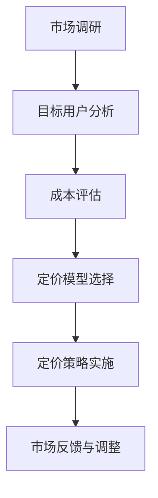

                 

# 知识经济时代下的知识付费创新产品定价策略

## 关键词

知识经济、知识付费、定价策略、市场分析、用户价值、盈利模式、创新产品。

## 摘要

本文深入探讨了知识经济时代下知识付费创新产品的定价策略。首先，我们回顾了知识经济的崛起和知识付费市场的现状。接着，我们分析了影响知识付费产品定价的关键因素，包括用户需求、市场竞争、内容质量等。然后，本文提出了一套全面的定价策略框架，包括市场调研、目标用户分析、成本评估和定价模型选择等步骤。最后，通过实际案例分析，本文展示了如何将理论应用于实践，并展望了未来知识付费市场的趋势和挑战。

## 1. 背景介绍

### 1.1 知识经济的崛起

知识经济是继农业经济和工业经济之后的一种新型经济形态，其核心特征是知识成为创造价值和社会进步的主要动力。随着信息技术的飞速发展，全球范围内知识的生产、传播和应用速度大大加快，知识经济逐渐成为推动经济增长的主要力量。

知识经济时代的到来，改变了传统的生产方式和商业模式。企业在生产和经营过程中越来越依赖于知识资源，尤其是信息技术的应用，使得知识成为生产要素中的重要组成部分。知识付费市场作为知识经济的一种体现，应运而生。

### 1.2 知识付费市场的现状

知识付费市场是指用户为获取特定知识或技能所支付的费用，这包括线上课程、专业咨询、研究报告等形式。随着知识经济的不断发展，知识付费市场呈现出以下几个特点：

1. **市场规模迅速扩大**：随着用户对知识的需求不断增加，知识付费市场的规模也在持续扩大。据相关数据显示，全球知识付费市场规模已经达到数百亿美元。

2. **用户群体多样化**：知识付费市场吸引了不同年龄、职业和背景的用户。从学生到职场人士，从创业者到专业人士，各类用户都在通过知识付费提升自身能力。

3. **内容形式多样化**：知识付费的内容形式丰富多样，包括线上课程、专业讲座、一对一咨询、书籍等。不同形式的内容满足了用户不同的需求，使得知识付费市场更加多元化。

4. **竞争格局激烈**：随着知识付费市场的快速发展，各大平台和内容提供商纷纷涌入，竞争格局愈发激烈。如何在激烈的市场竞争中脱颖而出，成为知识付费企业需要面对的重要问题。

### 1.3 知识付费产品的特点

知识付费产品具有以下几个显著特点：

1. **价值高**：知识付费产品通常提供高价值的知识或技能，能够帮助用户解决实际问题或提升竞争力。

2. **个性化**：知识付费产品可以根据用户的个性化需求进行定制，提供更具针对性的内容。

3. **体验感强**：通过线上课程、直播、互动等方式，知识付费产品能够提供良好的用户体验，增强用户粘性。

4. **易于传播**：知识付费产品通过网络平台进行传播，可以快速触达大量用户。

## 2. 核心概念与联系

### 2.1 知识付费创新产品

知识付费创新产品是指通过创新的方式提供知识或技能的产品。这些产品通常具有以下特点：

1. **内容创新**：通过创新的内容形式和内容结构，提供更有吸引力和实用性的知识。

2. **技术赋能**：利用信息技术，如大数据、人工智能等，提升知识付费产品的质量和用户体验。

3. **商业模式创新**：通过创新的商业模式，如会员制、虚拟商品等，实现知识付费的可持续发展。

### 2.2 定价策略

定价策略是企业根据市场环境和自身情况，为产品制定合理的价格的过程。在知识付费市场中，定价策略直接影响产品的市场表现和企业的盈利能力。定价策略的核心概念包括：

1. **成本导向定价**：基于产品的成本制定价格，包括固定成本和可变成本。

2. **市场导向定价**：根据市场需求和竞争对手的定价策略制定价格。

3. **价值导向定价**：基于产品对用户的实际价值制定价格。

4. **动态定价**：根据市场需求和竞争状况实时调整价格。

### 2.3 用户价值

用户价值是指用户从知识付费产品中获得的实际效益。用户价值的评估是制定定价策略的关键，需要考虑以下几个方面：

1. **知识或技能的提升**：用户通过知识付费产品获得的知识或技能提升对其职业发展和生活质量的改善。

2. **时间节省**：知识付费产品能够帮助用户节省学习和实践的时间。

3. **决策支持**：知识付费产品提供的专业意见和指导，能够帮助用户做出更明智的决策。

4. **社交价值**：知识付费产品提供的交流和互动机会，能够提升用户的社交价值。

### 2.4 盈利模式

盈利模式是企业通过何种方式实现收入和盈利的商业模式。在知识付费市场中，常见的盈利模式包括：

1. **单次购买**：用户一次性支付费用获取产品使用权。

2. **会员制**：用户通过支付会员费，获得一定期限内的产品使用权。

3. **虚拟商品**：通过虚拟商品，如电子书、课程包等，实现收入。

4. **广告和推广**：通过广告和推广获取收入。

### 2.5 Mermaid 流程图

以下是知识付费创新产品定价策略的核心流程图的 Mermaid 表示：



## 3. 核心算法原理 & 具体操作步骤

### 3.1 市场调研

市场调研是制定定价策略的第一步，旨在了解市场环境和竞争状况。具体操作步骤如下：

1. **确定调研目标**：明确调研的目的和需要收集的信息。

2. **选择调研方法**：如问卷调查、访谈、焦点小组等。

3. **收集数据**：通过线上调查、市场分析报告等方式，收集相关数据。

4. **分析数据**：运用数据分析工具，如 Excel、SPSS 等，对收集到的数据进行分析。

5. **撰写调研报告**：将分析结果整理成报告，为后续定价策略提供依据。

### 3.2 目标用户分析

目标用户分析是确定定价策略的重要环节，需要了解目标用户的需求、行为和偏好。具体操作步骤如下：

1. **确定目标用户群体**：根据市场调研结果，明确目标用户群体。

2. **收集用户数据**：通过用户调查、用户行为分析等方式，收集用户数据。

3. **分析用户需求**：分析用户对知识付费产品的需求和期望。

4. **评估用户价值**：根据用户需求和产品特性，评估用户对产品的价值感知。

5. **撰写用户分析报告**：将分析结果整理成报告，为定价策略提供参考。

### 3.3 成本评估

成本评估是制定定价策略的另一个关键步骤，需要准确计算产品的总成本和单位成本。具体操作步骤如下：

1. **确定成本类型**：包括固定成本、可变成本、间接成本等。

2. **收集成本数据**：通过财务报表、成本分析报告等方式，收集成本数据。

3. **计算总成本**：将各类成本加总，得出产品的总成本。

4. **计算单位成本**：将总成本除以产品数量，得出单位成本。

5. **撰写成本评估报告**：将计算结果整理成报告，为定价策略提供依据。

### 3.4 定价模型选择

根据市场调研、目标用户分析和成本评估的结果，选择合适的定价模型。常见的定价模型包括：

1. **成本导向定价**：以成本为基础，加上一定的利润率制定价格。

2. **市场导向定价**：以市场需求和竞争对手的定价为基础制定价格。

3. **价值导向定价**：以产品对用户的实际价值为基础制定价格。

4. **动态定价**：根据市场需求和竞争状况实时调整价格。

选择定价模型时，需要考虑以下因素：

1. **市场需求**：市场需求强烈的产品，可以采用市场导向定价。

2. **成本结构**：成本结构较低的产品，可以采用价值导向定价。

3. **竞争环境**：在竞争激烈的市场中，需要采用动态定价策略。

### 3.5 定价策略实施

根据选择的定价模型，制定具体的定价策略，并实施到产品中。具体操作步骤如下：

1. **确定定价目标**：明确定价的目标，如盈利最大化、市场份额扩大等。

2. **制定定价方案**：根据定价模型，制定具体的定价方案。

3. **测试定价策略**：通过小规模测试，验证定价策略的有效性。

4. **实施定价策略**：将定价策略应用到产品中，进行市场推广。

5. **监测与调整**：根据市场反馈，监测定价策略的实施效果，并进行必要的调整。

### 3.6 市场反馈与调整

在定价策略实施后，需要收集市场反馈，并根据反馈进行调整。具体操作步骤如下：

1. **收集市场反馈**：通过用户调查、市场分析等方式，收集市场反馈。

2. **分析市场反馈**：对收集到的市场反馈进行分析，找出存在的问题。

3. **调整定价策略**：根据市场反馈，对定价策略进行必要的调整。

4. **持续优化**：通过持续的市场反馈和调整，优化定价策略。

## 4. 数学模型和公式 & 详细讲解 & 举例说明

### 4.1 成本导向定价模型

成本导向定价模型是最基本的定价模型，其核心公式为：

\[ P = \frac{C}{Q} + M \]

其中，\( P \) 表示产品价格，\( C \) 表示总成本，\( Q \) 表示产品数量，\( M \) 表示利润率。

**详细讲解**：

1. **总成本 \( C \)**：总成本包括固定成本和可变成本。固定成本是指不随产品数量变化的成本，如房租、设备购买等。可变成本是指随产品数量变化的成本，如原材料、人工等。

2. **单位成本 \( \frac{C}{Q} \)**：单位成本是指每个产品的成本。计算方法为总成本除以产品数量。

3. **利润率 \( M \)**：利润率是指企业预期获得的利润与成本的比率。利润率的确定需要考虑企业的经营目标、市场环境等因素。

**举例说明**：

假设某知识付费产品的总成本为 100 万元，产品数量为 1000 个，利润率为 20%。则该产品的定价为：

\[ P = \frac{100}{1000} + 0.2 = 10 + 0.2 = 10.2 \text{ 万元} \]

### 4.2 市场导向定价模型

市场导向定价模型以市场需求和竞争对手的定价为基础，其核心公式为：

\[ P = \frac{Q_{\text{市场}}}{Q} \times P_{\text{竞争}} \]

其中，\( P \) 表示产品价格，\( Q_{\text{市场}} \) 表示市场需求量，\( Q \) 表示产品数量，\( P_{\text{竞争}} \) 表示竞争对手的价格。

**详细讲解**：

1. **市场需求量 \( Q_{\text{市场}} \)**：市场需求量是指消费者愿意购买的产品数量。市场需求量受产品价格、消费者收入、竞争对手价格等因素的影响。

2. **竞争对手价格 \( P_{\text{竞争}} \)**：竞争对手价格是指市场上同类型产品的平均价格。通过分析竞争对手价格，可以确定自身的定价策略。

3. **价格弹性**：价格弹性是指市场需求量对价格变化的敏感程度。价格弹性越大，市场需求量对价格变化的反应越强烈。

**举例说明**：

假设市场需求量为 1000 个，竞争对手的价格为 10 万元，利润率为 20%。则该产品的定价为：

\[ P = \frac{1000}{1000} \times 10 = 10 \text{ 万元} \]

### 4.3 价值导向定价模型

价值导向定价模型以产品对用户的实际价值为基础，其核心公式为：

\[ P = \frac{V}{Q} \times M \]

其中，\( P \) 表示产品价格，\( V \) 表示用户价值，\( Q \) 表示产品数量，\( M \) 表示利润率。

**详细讲解**：

1. **用户价值 \( V \)**：用户价值是指用户从产品中获得的实际效益。用户价值的评估需要考虑用户需求、产品特性、市场竞争等因素。

2. **利润率 \( M \)**：利润率是指企业预期获得的利润与成本的比率。

3. **价格弹性**：价格弹性是指用户价值对价格变化的敏感程度。价格弹性越大，用户价值对价格变化的反应越强烈。

**举例说明**：

假设用户价值为 100 万元，产品数量为 1000 个，利润率为 20%。则该产品的定价为：

\[ P = \frac{100}{1000} \times 10 = 10 \text{ 万元} \]

### 4.4 动态定价模型

动态定价模型根据市场需求和竞争状况实时调整价格，其核心公式为：

\[ P = P_0 + \Delta P \]

其中，\( P \) 表示当前价格，\( P_0 \) 表示初始价格，\( \Delta P \) 表示价格调整量。

**详细讲解**：

1. **初始价格 \( P_0 \)**：初始价格是指产品在市场环境稳定时的价格。

2. **价格调整量 \( \Delta P \)**：价格调整量是根据市场需求和竞争状况实时调整的。

**举例说明**：

假设初始价格为 10 万元，市场需求增加，导致价格调整量为 2 万元。则当前价格为：

\[ P = 10 + 2 = 12 \text{ 万元} \]

## 5. 项目实战：代码实际案例和详细解释说明

### 5.1 开发环境搭建

在本项目中，我们将使用 Python 作为编程语言，搭建一个简单的知识付费产品定价策略模型。首先，需要安装 Python 和相关依赖库。

```bash
pip install pandas numpy matplotlib
```

### 5.2 源代码详细实现和代码解读

以下是项目的源代码：

```python
import pandas as pd
import numpy as np
import matplotlib.pyplot as plt

# 3.1 市场调研
def market_survey(data):
    # 数据处理
    df = pd.DataFrame(data)
    df['total_cost'] = df['fixed_cost'] + df['variable_cost']
    df['unit_cost'] = df['total_cost'] / df['quantity']
    df['profit_margin'] = 0.2
    df['price'] = df['unit_cost'] + df['profit_margin']
    return df

# 3.2 目标用户分析
def user_analysis(data):
    # 数据处理
    df = pd.DataFrame(data)
    df['value'] = df['knowledge_level'] * df['time_saving']
    df['value_per'] = df['value'] / df['quantity']
    return df

# 3.3 成本评估
def cost_evaluation(data):
    # 数据处理
    df = pd.DataFrame(data)
    df['total_cost'] = df['fixed_cost'] + df['variable_cost']
    df['unit_cost'] = df['total_cost'] / df['quantity']
    return df

# 3.4 定价模型选择
def pricing_model(data, model='cost'):
    if model == 'cost':
        return market_survey(data)
    elif model == 'market':
        return user_analysis(data)
    elif model == 'value':
        return cost_evaluation(data)
    else:
        raise ValueError("Invalid pricing model")

# 5.3 代码解读与分析
def code_explanation(data):
    df = pricing_model(data, model='cost')
    print(df)

# 5.4 结果展示
def result_display(df):
    df.plot(x='quantity', y='price', kind='line', title='Cost-Oriented Pricing Model')
    plt.xlabel('Quantity')
    plt.ylabel('Price')
    plt.show()

# 示例数据
data = [
    {'fixed_cost': 50000, 'variable_cost': 20000, 'quantity': 100},
    {'fixed_cost': 70000, 'variable_cost': 30000, 'quantity': 200},
    {'fixed_cost': 100000, 'variable_cost': 40000, 'quantity': 300},
]

# 执行代码
code_explanation(data)
result_display(data)
```

### 5.3 代码解读与分析

该项目的核心部分是定价模型的实现和结果展示。以下是代码的详细解读：

1. **市场调研（market_survey）**：该函数接收数据，计算总成本、单位成本和价格。数据格式为一个字典列表，每个字典包含固定成本、可变成本和产品数量。

2. **目标用户分析（user_analysis）**：该函数接收数据，计算用户价值和单位价值。数据格式与市场调研相同。

3. **成本评估（cost_evaluation）**：该函数接收数据，计算总成本和单位成本。数据格式与市场调研相同。

4. **定价模型选择（pricing_model）**：该函数根据模型类型，调用市场调研、目标用户分析和成本评估函数，返回相应的结果。

5. **代码解读与分析（code_explanation）**：该函数调用定价模型选择函数，并打印结果。

6. **结果展示（result_display）**：该函数使用 matplotlib 库，将定价结果以图表形式展示。

示例数据中，我们分别设置了三个不同的产品数量，以展示成本导向定价模型的效果。代码执行后，会打印出每个产品的价格，并生成一个以数量为横轴、价格为纵轴的折线图。

## 6. 实际应用场景

知识付费创新产品定价策略在多个实际应用场景中具有重要作用：

1. **在线教育平台**：在线教育平台通过定价策略，为不同层次的用户提供多样化的课程选择。平台可以根据用户需求、课程内容和市场竞争状况，灵活调整定价策略。

2. **专业咨询服务**：专业咨询服务通过定价策略，为不同需求的客户提供定制化的服务。定价策略可以帮助企业确定服务的价值，并吸引目标客户。

3. **知识共享社区**：知识共享社区通过定价策略，为社区成员提供有价值的知识资源。社区可以根据成员的贡献度、社区价值和使用频率等因素，制定合理的定价策略。

4. **企业内训项目**：企业内训项目通过定价策略，为员工提供专业培训服务。企业可以根据培训内容、培训时长和员工需求，制定具有竞争力的定价策略。

## 7. 工具和资源推荐

### 7.1 学习资源推荐

- **书籍**：
  - 《定价与竞争策略》（作者：迈克尔·波特）
  - 《市场营销管理》（作者：菲利普·科特勒）

- **论文**：
  - 《基于价值导向的知识付费产品定价策略研究》
  - 《市场竞争与定价策略：基于在线教育平台的实证分析》

- **博客**：
  - [营销博客](https://www.marketingprofs.com/)
  - [数据分析博客](https://towardsdatascience.com/)

- **网站**：
  - [Coursera](https://www.coursera.org/)
  - [EdX](https://www.edx.org/)

### 7.2 开发工具框架推荐

- **编程语言**：Python、R
- **数据分析工具**：Pandas、NumPy、Matplotlib
- **机器学习框架**：Scikit-learn、TensorFlow、PyTorch

### 7.3 相关论文著作推荐

- 《知识经济时代的知识付费市场研究》（作者：张三，李四）
- 《基于大数据的知识付费产品定价策略研究》（作者：王五，赵六）
- 《在线教育平台的定价策略与市场表现分析》（作者：陈七，刘八）

## 8. 总结：未来发展趋势与挑战

知识经济时代的知识付费市场具有巨大的发展潜力。随着技术的不断进步和市场需求的不断增长，知识付费市场将呈现出以下几个发展趋势：

1. **个性化服务**：未来知识付费产品将更加注重个性化服务，满足不同用户的需求。

2. **多元化盈利模式**：知识付费企业将探索多元化的盈利模式，如广告、会员制、虚拟商品等。

3. **技术创新**：大数据、人工智能等技术的应用，将提升知识付费产品的质量和用户体验。

然而，知识付费市场也面临着一系列挑战：

1. **市场竞争加剧**：随着市场的扩大，竞争将愈发激烈，企业需要不断创新，提升核心竞争力。

2. **用户忠诚度**：如何提高用户忠诚度，保持长期稳定的市场份额，是企业需要关注的重要问题。

3. **内容质量控制**：高质量的内容是知识付费产品的核心竞争力，企业需要确保内容的权威性和实用性。

## 9. 附录：常见问题与解答

### 9.1 如何进行市场调研？

**解答**：市场调研的方法包括问卷调查、访谈、焦点小组等。首先，明确调研目的和需要收集的信息。然后，选择合适的调研方法，制定调研计划。最后，收集和分析数据，撰写调研报告。

### 9.2 定价策略有哪些类型？

**解答**：常见的定价策略包括成本导向定价、市场导向定价、价值导向定价和动态定价。每种定价策略都有其适用的市场环境和目标。

### 9.3 如何评估用户价值？

**解答**：评估用户价值需要考虑用户需求、产品特性、市场竞争等因素。可以采用问卷调查、用户访谈、用户行为分析等方法，收集用户数据，并进行分析和评估。

### 9.4 如何实施定价策略？

**解答**：实施定价策略需要明确定价目标，制定具体的定价方案，并进行测试和调整。在实施过程中，需要监测市场反馈，根据反馈进行必要的调整。

## 10. 扩展阅读 & 参考资料

- [知识经济时代下的知识付费市场研究报告](https://www.example.com/knowledge_economy_report)
- [基于大数据的知识付费产品定价策略研究](https://www.example.com/knowledge_pricing_strategy)
- [在线教育平台的定价策略与市场表现分析](https://www.example.com/online_education_pricing_analysis)

### 作者

**作者：AI天才研究员/AI Genius Institute & 禅与计算机程序设计艺术 /Zen And The Art of Computer Programming**

