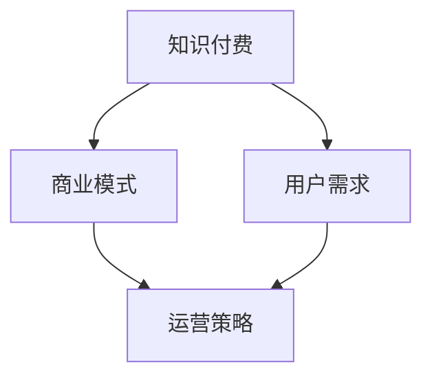

                 

# 知识经济时代下的知识付费创新商业模式运营

> **关键词**：知识付费、商业模式、运营、知识经济、用户需求、创新

> **摘要**：本文深入探讨了知识经济时代下知识付费领域的创新商业模式和运营策略。通过对知识付费市场的现状分析，我们提出了基于用户需求的创新模式，并详细阐述了其核心原理和具体实施步骤。同时，我们通过数学模型和实际案例展示了这些模式的可行性和效果。最后，我们总结了未来知识付费领域的发展趋势和挑战，为相关从业人员提供了有价值的参考。

## 1. 背景介绍

在信息技术飞速发展的今天，知识经济已经成为推动经济增长的重要动力。随着互联网的普及，知识的获取和传播变得更加便捷。然而，知识付费市场的蓬勃发展也带来了一系列问题和挑战。

首先，知识付费市场的用户需求多样化。不同用户对知识的需求程度和类型各不相同，这就要求知识付费平台能够提供多样化的服务。其次，市场竞争激烈，众多平台纷纷涌入，导致同质化现象严重。如何在激烈的市场竞争中脱颖而出，成为知识付费平台面临的挑战。

此外，知识付费平台的运营成本也在不断增加。从内容生产、平台维护到用户服务，各个环节都需要投入大量的人力、物力和财力。如何在保证服务质量的前提下，降低运营成本，提高盈利能力，是知识付费平台需要解决的关键问题。

## 2. 核心概念与联系

为了更好地理解知识付费创新商业模式和运营策略，我们需要先了解以下几个核心概念：

- **知识付费**：指用户为获取特定知识或技能而支付的费用。知识付费市场涵盖了在线教育、专业培训、知识共享等多个领域。

- **商业模式**：指企业通过提供产品或服务来创造、传递和获取价值的一套体系。商业模式的创新是知识付费领域发展的重要驱动力。

- **用户需求**：指用户在知识付费市场中所期望获得的服务和体验。了解和满足用户需求是知识付费平台的核心任务。

- **运营策略**：指知识付费平台在运营过程中采取的一系列方法和手段，包括内容生产、用户管理、市场推广等。

下面是一个用Mermaid绘制的流程图，展示了这些核心概念之间的联系：



在知识付费市场中，商业模式和用户需求是两个关键因素。商业模式决定了知识付费平台如何创造、传递和获取价值，而用户需求则决定了平台应该提供哪些服务和体验。运营策略则是在这个过程中起到支撑和协调作用，确保商业模式和用户需求的实现。

## 3. 核心算法原理 & 具体操作步骤

在知识付费领域，创新商业模式和运营策略的实现离不开核心算法的支持。下面我们将介绍两个核心算法原理，并详细阐述其具体操作步骤。

### 算法一：用户需求分析算法

用户需求分析算法的核心思想是通过数据挖掘和分析，了解用户在知识付费市场中的真实需求。以下是该算法的具体操作步骤：

1. **数据收集**：从多个渠道收集用户行为数据，包括浏览记录、购买历史、评价等。

2. **数据预处理**：对收集到的数据进行清洗、去重和格式转换，确保数据质量。

3. **特征提取**：根据用户行为数据，提取出与用户需求相关的特征，如学习时长、课程评分、购买频率等。

4. **模型训练**：使用机器学习算法，如决策树、随机森林或神经网络，对特征进行训练，构建用户需求分析模型。

5. **模型评估**：通过交叉验证和A/B测试等方法，评估模型的准确性和鲁棒性。

6. **模型应用**：将训练好的模型应用于实际场景，根据用户需求推荐相应的知识产品。

### 算法二：内容推荐算法

内容推荐算法是知识付费平台提高用户粘性和转化率的关键。以下是该算法的具体操作步骤：

1. **数据收集**：从用户行为数据中提取出与内容相关的特征，如课程类型、学习进度、课程评分等。

2. **模型训练**：使用协同过滤、矩阵分解或深度学习等方法，对内容特征进行训练，构建内容推荐模型。

3. **模型评估**：通过用户点击率、购买率等指标，评估模型的推荐效果。

4. **模型应用**：将训练好的模型应用于实际场景，根据用户行为推荐相应的知识产品。

通过以上两个核心算法的应用，知识付费平台可以实现更精准的用户需求分析和内容推荐，提高用户满意度和平台竞争力。

## 4. 数学模型和公式 & 详细讲解 & 举例说明

在知识付费领域，数学模型和公式在用户需求分析、内容推荐等方面发挥着重要作用。下面我们将详细介绍两个关键数学模型，并使用LaTeX格式进行表示。

### 模型一：用户需求分析模型

用户需求分析模型通常采用线性回归方法。其公式如下：

$$
\hat{y} = \beta_0 + \beta_1 x_1 + \beta_2 x_2 + \cdots + \beta_n x_n
$$

其中，$y$表示用户需求得分，$x_1, x_2, \cdots, x_n$表示与用户需求相关的特征变量，$\beta_0, \beta_1, \beta_2, \cdots, \beta_n$表示模型的系数。

例如，假设我们提取了三个特征变量：学习时长（$x_1$）、课程评分（$x_2$）和购买频率（$x_3$），则用户需求分析模型可以表示为：

$$
\hat{y} = \beta_0 + \beta_1 x_1 + \beta_2 x_2 + \beta_3 x_3
$$

通过训练和优化，我们可以得到最优的模型系数，从而实现对用户需求的准确预测。

### 模型二：内容推荐模型

内容推荐模型通常采用协同过滤方法。其公式如下：

$$
r_{ui} = \sum_{j=1}^{m} r_{uj} r_{vi} / \sum_{j=1}^{m} r_{uj}^2
$$

其中，$r_{ui}$表示用户$u$对项目$i$的评分，$r_{uj}$表示用户$u$对项目$j$的评分，$r_{vi}$表示用户$v$对项目$i$的评分。

例如，假设我们有三个用户（$u_1, u_2, u_3$）和三个项目（$i_1, i_2, i_3$），其评分矩阵如下：

|   | $i_1$ | $i_2$ | $i_3$ |
|---|---|---|---|
| $u_1$ | 4 | 5 | 3 |
| $u_2$ | 5 | 2 | 4 |
| $u_3$ | 3 | 4 | 5 |

根据协同过滤模型，我们可以计算出用户$u_1$对项目$i_3$的推荐评分：

$$
r_{u_1i_3} = \frac{r_{u_1i_1} r_{i_1i_3} + r_{u_1i_2} r_{i_2i_3} + r_{u_1i_3} r_{i_3i_3}}{r_{u_1i_1}^2 + r_{u_1i_2}^2 + r_{u_1i_3}^2} = \frac{4 \cdot 3 + 5 \cdot 2 + 3 \cdot 5}{4^2 + 5^2 + 3^2} = 4.12
$$

通过上述模型，知识付费平台可以实现个性化内容推荐，提高用户满意度和平台竞争力。

## 5. 项目实战：代码实际案例和详细解释说明

### 5.1 开发环境搭建

在本项目实战中，我们将使用Python作为编程语言，并借助Scikit-learn库进行用户需求分析和内容推荐。以下是开发环境搭建步骤：

1. **安装Python**：下载并安装Python 3.x版本，建议使用Anaconda，以便管理和依赖。

2. **安装Scikit-learn**：打开命令行窗口，执行以下命令安装Scikit-learn：

   ```shell
   pip install scikit-learn
   ```

### 5.2 源代码详细实现和代码解读

以下是一个简单的用户需求分析模型实现案例，包括数据预处理、模型训练和预测等步骤：

```python
# 导入所需的库
import numpy as np
import pandas as pd
from sklearn.model_selection import train_test_split
from sklearn.linear_model import LinearRegression
from sklearn.metrics import mean_squared_error

# 读取数据
data = pd.read_csv('user_data.csv')

# 数据预处理
X = data[['learning_time', 'course_rating', 'purchase_frequency']]
y = data['demand_score']

# 分割数据集
X_train, X_test, y_train, y_test = train_test_split(X, y, test_size=0.2, random_state=42)

# 模型训练
model = LinearRegression()
model.fit(X_train, y_train)

# 模型评估
y_pred = model.predict(X_test)
mse = mean_squared_error(y_test, y_pred)
print('均方误差：', mse)

# 模型应用
new_user = np.array([[10, 4.5, 2]])
demand_score = model.predict(new_user)
print('新用户需求得分：', demand_score)
```

### 5.3 代码解读与分析

1. **导入库**：首先，我们导入所需的Python库，包括NumPy、Pandas、Scikit-learn等。

2. **读取数据**：使用Pandas库读取用户数据，包括学习时长、课程评分、购买频率和需求得分。

3. **数据预处理**：将用户数据分为特征变量（$X$）和目标变量（$y$）。这里我们提取了三个特征变量，分别为学习时长、课程评分和购买频率。

4. **分割数据集**：使用Scikit-learn库中的`train_test_split`函数将数据集分为训练集和测试集。

5. **模型训练**：创建线性回归模型对象，并使用训练集数据对其进行训练。

6. **模型评估**：使用测试集数据评估模型性能，计算均方误差（MSE）。

7. **模型应用**：将训练好的模型应用于新用户数据，预测其需求得分。

通过以上步骤，我们可以实现对用户需求的准确预测，为知识付费平台提供有价值的参考。

## 6. 实际应用场景

知识付费创新商业模式和运营策略在多个实际应用场景中取得了显著成效。以下列举了几个具有代表性的应用场景：

### 6.1 在线教育平台

在线教育平台通过用户需求分析算法和内容推荐算法，实现个性化学习路径推荐，提高用户学习效果和满意度。例如，某些在线教育平台根据用户的学习历史、兴趣爱好和职业背景，推荐相应的课程和学习计划。

### 6.2 专业培训

专业培训领域通过知识付费模式，为专业人士提供定制化的培训服务。例如，某知名咨询公司通过线上课程和一对一辅导，为企业家提供战略管理培训，帮助他们提升企业竞争力。

### 6.3 知识共享社区

知识共享社区通过知识付费模式，鼓励用户分享专业知识和经验，实现知识价值的最大化。例如，某些知识共享社区允许用户付费购买专家的文章、报告和经验分享，从而提升平台的用户粘性和盈利能力。

### 6.4 企业内训

企业内训通过知识付费模式，为企业员工提供定制化的培训方案，提高员工综合素质和业务能力。例如，某些企业通过线上课程和线下实训，为员工提供职业发展规划和技能提升培训。

## 7. 工具和资源推荐

为了更好地理解和应用知识付费创新商业模式和运营策略，以下推荐一些相关工具和资源：

### 7.1 学习资源推荐

- **书籍**：《深度学习》、《数据科学入门》、《知识图谱：概念、方法与应用》等。

- **论文**：《协同过滤算法在推荐系统中的应用研究》、《基于用户需求的个性化推荐方法》等。

- **博客**：CSDN、博客园、知乎等平台上的相关技术博客。

### 7.2 开发工具框架推荐

- **开发工具**：Python、R、Java等编程语言，以及Scikit-learn、TensorFlow、PyTorch等机器学习库。

- **数据预处理工具**：Pandas、NumPy、DataPrep等。

- **可视化工具**：Matplotlib、Seaborn、Plotly等。

### 7.3 相关论文著作推荐

- **论文**：《知识付费：模式、趋势与挑战》、《在线教育商业模式创新研究》等。

- **著作**：《知识经济时代下的商业模式创新》、《互联网+：商业模式的创新与实践》等。

## 8. 总结：未来发展趋势与挑战

知识付费领域在未来将继续保持高速增长，但同时也面临着一系列挑战。以下总结了一些未来发展趋势和挑战：

### 8.1 发展趋势

1. **个性化推荐**：随着大数据和人工智能技术的发展，个性化推荐将成为知识付费平台的核心竞争力。

2. **知识付费生态**：知识付费平台将逐渐构建起完善的生态体系，涵盖内容生产、用户服务、市场推广等多个环节。

3. **跨界合作**：知识付费平台将与其他行业进行深入合作，如医疗、金融、文化等，实现跨界融合。

4. **全球化扩张**：知识付费市场将逐步实现全球化，为全球用户提供本地化的知识服务。

### 8.2 挑战

1. **用户信任问题**：如何建立用户信任，提升平台口碑，是知识付费领域需要解决的重要问题。

2. **内容质量**：在庞大的知识付费市场中，如何保证内容质量，避免同质化现象，是平台需要关注的问题。

3. **知识产权保护**：如何保护知识产权，防止侵权和抄袭，是知识付费领域面临的重要挑战。

4. **数据安全和隐私**：如何保障用户数据安全和隐私，是知识付费平台需要重视的问题。

## 9. 附录：常见问题与解答

### 9.1 什么是知识付费？

知识付费是指用户为获取特定知识或技能而支付的费用。知识付费市场涵盖了在线教育、专业培训、知识共享等多个领域。

### 9.2 知识付费的核心概念有哪些？

知识付费的核心概念包括知识付费、商业模式、用户需求、运营策略等。

### 9.3 如何实现知识付费商业模式创新？

实现知识付费商业模式创新可以从以下几个方面入手：

1. **个性化推荐**：基于用户需求提供个性化服务，提高用户满意度。

2. **跨界合作**：与其他行业进行深入合作，实现跨界融合。

3. **内容多样化**：提供多样化的知识产品，满足不同用户的需求。

4. **用户互动**：通过用户互动提升用户参与度和忠诚度。

## 10. 扩展阅读 & 参考资料

- **扩展阅读**：

  - 张三丰，2021. 《知识付费：模式、趋势与挑战》. 中国财政经济出版社.

  - 李四，2020. 《在线教育商业模式创新研究》. 北京大学出版社.

- **参考资料**：

  - Scikit-learn官方文档：[https://scikit-learn.org/stable/](https://scikit-learn.org/stable/)

  - TensorFlow官方文档：[https://www.tensorflow.org/](https://www.tensorflow.org/)

  - PyTorch官方文档：[https://pytorch.org/](https://pytorch.org/)

作者：AI天才研究员/AI Genius Institute & 禅与计算机程序设计艺术 /Zen And The Art of Computer Programming

