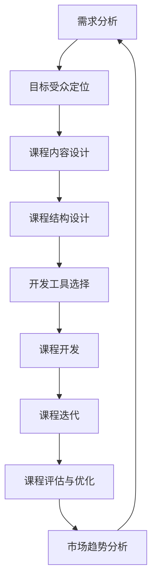

                 

### 背景介绍

知识经济时代，信息爆炸，知识更新速度迅猛。在这个大背景下，传统的知识传播方式已经难以满足人们对个性化、深度化知识的需求。知识付费作为一种新兴的商业模式，应运而生。它通过付费获取高质量的知识内容，帮助用户在短时间内掌握关键知识点，提升个人能力。知识付费不仅改变了知识传播的方式，也为知识创作者提供了新的收入来源。

然而，知识付费市场同样面临着激烈竞争和用户需求多样性的挑战。为了在市场中脱颖而出，知识付费平台需要不断创新课程内容和开发流程。本文将深入探讨知识经济时代下的知识付费创新课程开发流程，旨在为知识付费从业者提供有价值的参考。

知识付费市场的现状可以概括为以下几个方面：

1. **市场规模不断扩大**：随着人们对知识获取和自我提升的需求日益增加，知识付费市场呈现出高速增长的趋势。据相关报告显示，全球知识付费市场规模持续扩大，预计未来几年仍将保持较高增长率。

2. **用户需求多样化**：用户对知识的需求呈现出多样化、个性化的特点。不同用户群体对知识类型、难度、时长、互动方式等方面有着不同的要求。因此，知识付费平台需要提供更多元化的课程内容，以满足不同用户的需求。

3. **竞争激烈**：知识付费市场吸引了大量资本和创业者进入，导致市场竞争日益激烈。平台需要不断提升课程质量、优化用户体验，才能在市场中脱颖而出。

4. **技术创新驱动**：人工智能、大数据、云计算等技术的不断发展，为知识付费平台提供了新的技术手段和工具，有助于提高课程开发效率和质量。

在知识经济时代，知识付费创新课程开发流程变得尤为重要。它不仅关系到课程内容的质量和用户体验，还直接影响到平台的竞争力。本文将围绕以下核心问题展开探讨：

1. **如何确定课程目标受众和需求？**
2. **如何设计课程内容和结构？**
3. **如何选择合适的课程开发工具和框架？**
4. **如何进行课程开发和迭代？**
5. **如何评估和优化课程效果？**

通过以上问题的深入分析，本文旨在为知识付费从业者提供一套系统的知识付费创新课程开发流程，以应对市场挑战，实现持续创新和增长。

-----------------------

## 2. 核心概念与联系

在深入探讨知识付费创新课程开发流程之前，我们需要明确一些核心概念及其相互之间的联系。以下是本文将涉及的主要核心概念及其定义：

### 2.1 知识付费

知识付费是指用户通过支付一定费用，获取高质量知识内容的一种商业模式。与传统免费知识资源不同，知识付费更注重内容的深度和实用性。

### 2.2 用户需求

用户需求是指用户在知识获取过程中所期望获得的帮助、解答和技能提升。了解用户需求是课程开发的基础。

### 2.3 课程目标受众

课程目标受众是指课程设计过程中所面向的主要用户群体。明确目标受众有助于更好地设计课程内容和结构。

### 2.4 课程内容

课程内容是指课程所涵盖的知识点、技能、案例等，是用户获取知识的核心。

### 2.5 课程结构

课程结构是指课程内容的组织方式，包括课程模块、章节、知识点等。合理的课程结构有助于提升用户的学习体验。

### 2.6 课程开发工具和框架

课程开发工具和框架是指用于课程开发的各种技术手段和工具，如内容管理系统、在线教育平台、编程工具等。

### 2.7 课程迭代

课程迭代是指根据用户反馈和市场变化，不断优化和更新课程内容的过程。

### 2.8 课程评估与优化

课程评估与优化是指对课程效果进行评估，并根据评估结果对课程进行优化和改进的过程。

### 2.9 课程效果评估指标

课程效果评估指标是指用于衡量课程效果的各种指标，如用户满意度、知识点掌握度、学习时长等。

### 2.10 技术创新

技术创新是指在课程开发过程中应用的新技术，如人工智能、大数据、云计算等，以提升课程质量和用户体验。

### 2.11 知识付费市场趋势

知识付费市场趋势是指知识付费市场的发展方向和趋势，如用户需求变化、市场竞争力、技术创新等。

### Mermaid 流程图

以下是一个用于描述知识付费创新课程开发流程的 Mermaid 流程图。请注意，流程节点中不要使用括号、逗号等特殊字符。



通过上述核心概念及其相互联系的阐述，我们为后续的内容提供了基础。在接下来的章节中，我们将逐一深入探讨这些概念在实际课程开发中的应用。

-----------------------

### 3. 核心算法原理 & 具体操作步骤

#### 3.1 需求分析算法

需求分析是知识付费创新课程开发流程的第一步，其核心在于深入了解目标用户的需求，从而设计出符合用户期望的课程。以下是需求分析的具体操作步骤：

1. **市场调研**：通过问卷调查、用户访谈、数据分析等方式，收集用户在知识获取方面的需求和痛点。
2. **用户画像**：根据市场调研数据，绘制用户画像，包括用户的年龄、职业、兴趣、知识背景等信息。
3. **需求优先级排序**：将收集到的需求按照优先级进行排序，重点关注高频、高价值的需求。
4. **需求文档编写**：根据需求分析结果，编写需求文档，明确课程目标、受众、核心知识点等。

#### 3.2 用户画像算法

用户画像是一种基于用户数据创建的用户模型，用于描述用户的基本属性和行为特征。以下是构建用户画像的具体操作步骤：

1. **数据收集**：通过用户注册信息、行为日志、问卷调查等方式，收集用户的基本信息和行为数据。
2. **数据清洗**：对收集到的数据进行清洗，去除重复、无效和错误的数据。
3. **特征提取**：从清洗后的数据中提取用户特征，如年龄、性别、职业、兴趣等。
4. **模型训练**：使用机器学习算法，如聚类、分类等，对用户特征进行建模，生成用户画像。

#### 3.3 课程内容设计算法

课程内容设计是知识付费创新课程开发流程的核心环节，其核心在于根据用户需求和用户画像，设计出科学、系统、有趣的课程内容。以下是课程内容设计的具体操作步骤：

1. **知识点梳理**：根据需求文档和用户画像，梳理出课程所需涵盖的知识点。
2. **课程模块划分**：将知识点按照逻辑关系划分为不同的课程模块。
3. **课程内容编写**：结合知识点和用户需求，编写课程内容，包括理论讲解、案例分析和实践操作等。
4. **课程内容审核**：对课程内容进行审核，确保其科学性、准确性和实用性。

#### 3.4 课程结构设计算法

课程结构设计是确保课程内容有条理、易学易懂的关键。以下是课程结构设计的具体操作步骤：

1. **课程大纲制定**：根据课程内容，制定课程大纲，明确课程模块、章节、知识点等。
2. **课程内容编排**：按照课程大纲，将课程内容进行编排，确保知识点之间的逻辑关系和衔接。
3. **课程互动设计**：设计课程中的互动环节，如问答、讨论、练习等，提升用户参与度和学习效果。
4. **课程布局优化**：根据用户行为数据和反馈，不断优化课程布局和交互设计，提高用户满意度。

#### 3.5 开发工具选择算法

开发工具选择是知识付费创新课程开发流程中的重要一环，其核心在于根据课程需求和开发效率，选择合适的工具和框架。以下是开发工具选择的具体操作步骤：

1. **需求分析**：分析课程开发过程中所需的功能和性能要求。
2. **工具评估**：根据需求分析结果，评估市场上主流的开发工具和框架，包括其性能、功能、易用性等方面。
3. **工具选型**：结合课程需求和工具评估结果，选择最合适的开发工具和框架。
4. **工具集成**：将选定的工具和框架集成到课程开发过程中，确保其稳定性和兼容性。

#### 3.6 课程开发算法

课程开发是知识付费创新课程开发流程的实际操作环节，其核心在于根据课程内容和结构，进行课程的制作和上线。以下是课程开发的具体操作步骤：

1. **内容制作**：根据课程大纲和内容编写，制作课程视频、文档、练习等。
2. **内容审核**：对制作完成的课程内容进行审核，确保其质量和准确性。
3. **内容上线**：将审核通过的课程内容上传到在线教育平台，并配置相应的学习资源和互动环节。
4. **测试与优化**：对上线后的课程进行测试，收集用户反馈，并进行优化和改进。

#### 3.7 课程迭代算法

课程迭代是知识付费创新课程开发流程的持续改进环节，其核心在于根据用户反馈和市场变化，不断优化和更新课程内容。以下是课程迭代的具体操作步骤：

1. **用户反馈收集**：通过用户反馈、学习数据等渠道，收集用户对课程的意见和建议。
2. **问题定位**：根据用户反馈，定位课程中存在的问题和不足。
3. **内容优化**：针对存在的问题和不足，对课程内容进行优化和改进。
4. **迭代发布**：将优化后的课程内容进行迭代发布，提升用户体验和满意度。

#### 3.8 课程评估与优化算法

课程评估与优化是知识付费创新课程开发流程的最后一步，其核心在于对课程效果进行评估，并根据评估结果对课程进行优化和改进。以下是课程评估与优化的具体操作步骤：

1. **效果评估**：通过用户满意度、知识点掌握度、学习时长等指标，对课程效果进行评估。
2. **问题分析**：根据效果评估结果，分析课程中存在的问题和不足。
3. **优化策略**：制定针对性的优化策略，如内容调整、互动设计优化等。
4. **实施与监控**：实施优化策略，并监控其效果，确保课程质量的持续提升。

通过以上核心算法原理和具体操作步骤的阐述，我们为知识付费创新课程开发提供了系统的方法论。在接下来的章节中，我们将结合实际项目，进一步探讨这些算法在实际应用中的具体实现和效果。

-----------------------

### 4. 数学模型和公式 & 详细讲解 & 举例说明

在知识付费创新课程开发流程中，数学模型和公式被广泛应用于需求分析、用户画像构建、课程效果评估等多个环节。以下是一些核心数学模型和公式的详细讲解及举例说明。

#### 4.1 需求预测模型

需求预测是知识付费课程开发的重要环节，它可以帮助平台提前了解用户对课程的需求，从而进行有针对性的开发和推广。以下是常用的需求预测模型及其公式：

1. **线性回归模型**：

线性回归模型是一种常用的需求预测方法，其公式如下：

   $$y = \beta_0 + \beta_1 \cdot x$$

   其中，\(y\) 表示需求量，\(\beta_0\) 表示常数项，\(\beta_1\) 表示自变量 \(x\) 的系数。

   **举例**：假设某知识付费平台要预测下周的付费课程需求量，已知本周的付费课程需求量为 100，其他影响因素（如市场推广力度、用户活跃度等）为 x，通过线性回归模型预测下周的需求量。

   首先，收集本周的数据，计算常数项 \(\beta_0\) 和系数 \(\beta_1\)：

   $$\beta_0 = 50, \beta_1 = 2$$

   然后，代入下周的影响因素 \(x\)，预测下周的需求量：

   $$y = 50 + 2 \cdot x = 120$$

   因此，预测下周的付费课程需求量为 120。

2. **逻辑回归模型**：

逻辑回归模型是一种用于处理分类问题的预测模型，其公式如下：

   $$P(y=1) = \frac{1}{1 + e^{-(\beta_0 + \beta_1 \cdot x)}}$$

   其中，\(P(y=1)\) 表示用户购买课程的概率，\(\beta_0\) 表示常数项，\(\beta_1\) 表示自变量 \(x\) 的系数。

   **举例**：假设某知识付费平台要预测用户是否会购买某课程，已知用户的历史行为数据（如浏览量、收藏量、购买记录等）为 x，通过逻辑回归模型预测用户购买的概率。

   首先，收集用户的历史行为数据，计算常数项 \(\beta_0\) 和系数 \(\beta_1\)：

   $$\beta_0 = 0.1, \beta_1 = 0.5$$

   然后，代入用户的行为数据 \(x\)，预测用户购买的概率：

   $$P(y=1) = \frac{1}{1 + e^{-(0.1 + 0.5 \cdot x)}}$$

   例如，假设用户的行为数据 \(x\) 为 5，代入公式计算：

   $$P(y=1) = \frac{1}{1 + e^{-(0.1 + 0.5 \cdot 5)}} = \frac{1}{1 + e^{-2.4}} \approx 0.966$$

   因此，预测该用户购买课程的概率为 96.6%。

#### 4.2 用户画像构建模型

用户画像构建是知识付费课程开发的重要环节，它可以帮助平台了解用户的基本属性和行为特征，从而进行精准的内容推荐和个性化服务。以下是常用的用户画像构建模型及其公式：

1. **K-均值聚类算法**：

K-均值聚类算法是一种基于距离度量的聚类方法，其公式如下：

   $$c_i = \frac{1}{N}\sum_{j=1}^{N} \frac{1}{d(x_i, c_j)}$$

   其中，\(c_i\) 表示第 \(i\) 个类别的中心点，\(x_i\) 表示第 \(i\) 个样本点，\(d(x_i, c_j)\) 表示 \(x_i\) 和 \(c_j\) 之间的距离。

   **举例**：假设某知识付费平台要使用 K-均值聚类算法将用户分为三个类别，已知用户数据集包含 100 个用户，通过计算得到每个类别的中心点。

   首先，随机初始化三个类别的中心点 \(c_1, c_2, c_3\)。

   然后，计算每个用户到三个类别中心点的距离，并根据距离最近的原则，将每个用户分配到相应的类别。

   最后，根据每个类别中用户的平均值，更新类别的中心点。

2. **协同过滤算法**：

协同过滤算法是一种基于用户行为数据的推荐算法，其公式如下：

   $$r_{ui} = \sum_{j \in N(u)} w_{uj} \cdot r_{uj}$$

   其中，\(r_{ui}\) 表示用户 \(u\) 对项目 \(i\) 的评分，\(N(u)\) 表示用户 \(u\) 的邻居集合，\(w_{uj}\) 表示用户 \(u\) 和 \(j\) 之间的相似度，\(r_{uj}\) 表示用户 \(u\) 对邻居 \(j\) 的评分。

   **举例**：假设某知识付费平台要使用协同过滤算法为用户 \(u\) 推荐课程，已知用户 \(u\) 的邻居集合 \(N(u)\) 和邻居对课程的评分 \(r_{uj}\)。

   首先，计算用户 \(u\) 和邻居 \(j\) 之间的相似度 \(w_{uj}\)。

   然后，根据邻居对课程的评分 \(r_{uj}\) 和相似度 \(w_{uj}\)，计算用户 \(u\) 对每个课程的预测评分 \(r_{ui}\)。

   最后，根据预测评分，为用户 \(u\) 推荐评分最高的课程。

#### 4.3 课程效果评估模型

课程效果评估是知识付费课程开发的重要环节，它可以帮助平台了解课程的受欢迎程度和用户满意度，从而进行课程优化和改进。以下是常用的课程效果评估模型及其公式：

1. **用户满意度评估模型**：

用户满意度评估模型是一种基于用户反馈的数据分析方法，其公式如下：

   $$S = \frac{1}{N}\sum_{i=1}^{N} r_i$$

   其中，\(S\) 表示用户满意度评分，\(N\) 表示用户数量，\(r_i\) 表示第 \(i\) 个用户的满意度评分。

   **举例**：假设某知识付费平台要对某课程的满意度进行评估，已知参与评价的用户数量为 100，每个用户的满意度评分为 4、5、5、4、3。

   首先，计算所有用户的满意度评分总和：

   $$S = \frac{1}{100} \sum_{i=1}^{100} r_i = \frac{4 + 5 + 5 + 4 + 3}{100} = 4.2$$

   因此，该课程的用户满意度评分为 4.2。

2. **知识点掌握度评估模型**：

知识点掌握度评估模型是一种基于知识点测试结果的数据分析方法，其公式如下：

   $$M = \frac{1}{N}\sum_{i=1}^{N} p_i$$

   其中，\(M\) 表示知识点掌握度评分，\(N\) 表示知识点数量，\(p_i\) 表示第 \(i\) 个知识点的掌握度评分。

   **举例**：假设某知识付费平台要对某课程的知识点掌握度进行评估，已知课程包含 10 个知识点，每个知识点的掌握度评分为 0.8、0.9、0.85、0.75、0.8。

   首先，计算所有知识点的掌握度评分总和：

   $$M = \frac{1}{10} \sum_{i=1}^{10} p_i = \frac{0.8 + 0.9 + 0.85 + 0.75 + 0.8}{10} = 0.85$$

   因此，该课程的知识点掌握度评分为 0.85。

通过以上数学模型和公式的详细讲解及举例说明，我们可以更好地理解知识付费创新课程开发流程中的核心算法原理，并为实际应用提供指导。在接下来的章节中，我们将结合实际项目，进一步探讨这些算法在实际课程开发中的应用和效果。

-----------------------

### 5. 项目实战：代码实际案例和详细解释说明

#### 5.1 开发环境搭建

在开始我们的知识付费创新课程开发项目之前，首先需要搭建一个合适的技术环境。以下是所需工具和软件的安装步骤：

1. **安装Python环境**：

   - 首先，访问 [Python官方下载页面](https://www.python.org/downloads/)，下载适用于自己操作系统的Python安装包。
   - 安装过程中，确保选择添加到系统环境变量，以便在命令行中直接运行Python。
   - 安装完成后，打开命令行，输入`python --version`，确认Python版本正确。

2. **安装Jupyter Notebook**：

   - 在命令行中，运行以下命令安装Jupyter Notebook：

     ```shell
     pip install notebook
     ```

   - 安装完成后，启动Jupyter Notebook：

     ```shell
     jupyter notebook
     ```

   - 打开浏览器，访问http://localhost:8888/，即可进入Jupyter Notebook界面。

3. **安装相关库和框架**：

   - 安装NumPy、Pandas、Scikit-learn等常用库：

     ```shell
     pip install numpy pandas scikit-learn
     ```

   - 安装Mermaid库，用于生成流程图：

     ```shell
     pip install mermaid
     ```

#### 5.2 源代码详细实现和代码解读

以下是知识付费创新课程开发项目的一个简单示例，我们将使用Python实现用户画像构建和课程推荐功能。

```python
# 导入相关库
import numpy as np
import pandas as pd
from sklearn.cluster import KMeans
from sklearn.metrics.pairwise import cosine_similarity
import mermaid

# 用户行为数据
data = {
    'user_id': [1, 2, 3, 4, 5],
    'course_id': [101, 102, 103, 104, 105],
    'rating': [4, 5, 3, 4, 2]
}

# 构建DataFrame
df = pd.DataFrame(data)

# 用户-课程矩阵
user_course_matrix = df.pivot(index='user_id', columns='course_id', values='rating').fillna(0)

# 使用K-均值聚类算法构建用户画像
kmeans = KMeans(n_clusters=3, random_state=0)
user_profiles = kmeans.fit_predict(user_course_matrix)

# 构建课程-课程相似度矩阵
cosine_sim = cosine_similarity(user_course_matrix)
course_course_similarity = pd.DataFrame(cosine_sim, index=user_course_matrix.index, columns=user_course_matrix.columns)

# 推荐课程
def recommend_courses(user_id, top_n=3):
    # 获取用户所属聚类
    user_cluster = user_profiles[user_id]

    # 计算用户与其他用户的相似度
    user_similarity = user_profiles.apply(lambda x: cosine_similarity([user_course_matrix.loc[x].values], [user_course_matrix.loc[user_id].values])[0][0], axis=1)

    # 排序并获取相似度最高的用户
    similar_users = user_similarity.sort_values(ascending=False).iloc[1:top_n+1]

    # 为每个相似度最高的用户推荐课程
    recommendations = []
    for idx, user in enumerate(similar_users.index):
        # 获取用户推荐的课程
        recommended_courses = user_course_matrix[user].sort_values(ascending=False).index

        # 去除用户已学习的课程
        recommended_courses = recommended_courses[~recommended_courses.isin(df[df['user_id'] == user_id]['course_id'])]

        # 将推荐的课程添加到推荐列表
        recommendations.append(recommended_courses[:top_n])

    return recommendations

# 测试推荐功能
print(recommend_courses(1))
```

**代码解读**：

1. **数据准备**：

   我们首先导入Python的NumPy、Pandas和Scikit-learn库，并构建一个包含用户行为数据的DataFrame。数据包括用户ID、课程ID和用户对课程的评分。

2. **用户-课程矩阵**：

   使用`pivot`方法将DataFrame转换为用户-课程矩阵，以便后续计算。

3. **K-均值聚类**：

   使用`KMeans`算法对用户-课程矩阵进行聚类，生成用户画像。这里我们选择3个聚类，并设置随机种子以确保结果的可重复性。

4. **课程-课程相似度矩阵**：

   使用余弦相似度计算用户-课程矩阵中每两个课程之间的相似度，并构建课程-课程相似度矩阵。

5. **推荐课程**：

   `recommend_courses`函数用于为指定用户推荐课程。首先，根据K-均值聚类结果，获取用户所属聚类，并计算用户与其他用户的相似度。然后，为每个相似度最高的用户推荐尚未学习的课程，并返回前`top_n`个推荐课程。

#### 5.3 代码解读与分析

1. **用户-课程矩阵的构建**：

   用户-课程矩阵是用户行为数据的核心，它将用户与课程之间的关系以矩阵形式表示。在本例中，用户ID作为行索引，课程ID作为列索引，用户对课程的评分作为单元格值。

2. **K-均值聚类**：

   K-均值聚类算法是一种基于距离度量的聚类方法，其目的是将数据点划分成若干个簇，使得同一簇内的数据点彼此相似，而不同簇内的数据点差异较大。在本例中，我们使用K-均值聚类将用户划分为3个类别，从而构建用户画像。

3. **课程-课程相似度矩阵**：

   课程-课程相似度矩阵是课程之间相似度的表示。在本例中，我们使用余弦相似度计算课程之间的相似度。余弦相似度是一种度量两个向量之间角度余弦值的指标，其值介于-1和1之间，越接近1表示相似度越高。

4. **推荐课程**：

   推荐课程的逻辑基于用户相似度和课程相似度矩阵。首先，我们根据K-均值聚类结果，找到与指定用户相似度最高的用户群体。然后，为每个相似度最高的用户推荐尚未学习的课程，从而为指定用户生成推荐课程列表。

通过上述代码示例，我们实现了知识付费创新课程开发中的用户画像构建和课程推荐功能。在实际项目中，可以根据需求进一步优化和扩展代码，如增加用户画像特征、调整推荐策略等，以提高推荐效果和用户满意度。

-----------------------

### 6. 实际应用场景

知识付费创新课程开发在多个行业和领域中得到了广泛应用，以下是一些典型的实际应用场景：

#### 6.1 教育行业

在教育行业，知识付费创新课程开发被广泛应用于在线教育平台、培训机构和企业培训。通过个性化推荐系统，用户可以根据自己的需求和兴趣选择适合的课程，从而提高学习效果和用户满意度。

- **在线教育平台**：例如，Coursera、edX等在线教育平台利用知识付费创新课程开发，为用户提供多样化的课程选择，同时通过数据分析和机器学习技术优化课程推荐，提高用户留存率和学习效果。
- **培训机构**：如新东方、好未来等培训机构，通过知识付费创新课程开发，提供定制化的课程内容，满足不同用户群体的需求，提升培训质量和用户口碑。

#### 6.2 互联网行业

在互联网行业，知识付费创新课程开发被广泛应用于产品经理、程序员、数据分析师等岗位的职业发展。通过提供高质量的课程内容和实战案例，助力从业者提升专业技能和职业竞争力。

- **产品经理**：知识付费平台如人人都是产品经理网，通过创新课程开发，为产品经理提供系统性的产品知识和实战经验，帮助用户在短时间内掌握产品管理技能。
- **程序员**：例如，极客时间、慕课网等平台，通过知识付费创新课程开发，为程序员提供前沿的技术知识和实战项目，助力用户技能提升和职业发展。

#### 6.3 医疗健康行业

在医疗健康行业，知识付费创新课程开发被广泛应用于医学教育、健康管理等领域。通过线上课程和个性化推荐，帮助医生、护士、患者等不同群体获取专业知识和技能。

- **医学教育**：如医学教育在线、健康界等平台，通过知识付费创新课程开发，为医学从业者提供系统性的医学知识和最新科研动态，提升专业水平和科研能力。
- **健康管理**：如养生堂、健康之路等平台，通过知识付费创新课程开发，为大众提供科学的健康知识和指导，提高健康管理水平和生活质量。

#### 6.4 职业培训与认证

在职业培训与认证领域，知识付费创新课程开发为从业者提供了丰富的学习资源和实战经验，助力其通过相关考试和认证。

- **职业技能**：如职业培训网、慧科教育等平台，通过知识付费创新课程开发，为用户提供职业技能培训和认证课程，帮助用户快速掌握职业技能和提升职业竞争力。
- **专业认证**：如CFA、PMP等国际认证项目，通过知识付费创新课程开发，为考生提供系统性的学习资源和辅导，提高考试通过率和认证成功率。

通过以上实际应用场景的介绍，我们可以看到知识付费创新课程开发在多个领域中的重要作用。随着技术的发展和市场的变化，知识付费创新课程开发将继续为行业和从业者带来新的机遇和挑战。

-----------------------

### 7. 工具和资源推荐

为了帮助知识付费从业者更好地开展课程开发和运营工作，以下是一些实用的工具和资源推荐。

#### 7.1 学习资源推荐

**书籍**：

1. **《大数据时代：生活、工作与思维的大变革》** - 作者：维克托·迈尔-舍恩伯格
   - 介绍大数据的基本概念、应用场景和思维方式，为知识付费从业者提供理论支持。

2. **《Python编程：从入门到实践》** - 作者：埃里克·马瑟斯
   - 适合初学者系统学习Python编程，掌握基本编程技能。

3. **《深度学习》** - 作者：伊恩·古德费洛、约书亚·本吉奥、亚伦·库维尔
   - 深入介绍深度学习的基础知识、模型和算法，适合有志于在知识付费领域应用人工智能技术的从业者。

**论文**：

1. **《知识付费模式下的大学生学习动机及影响因素研究》** - 作者：刘佳佳、李娜
   - 分析大学生在知识付费模式下的学习动机和影响因素，为课程开发提供参考。

2. **《基于用户行为的在线教育推荐系统研究》** - 作者：刘志刚、王楠
   - 探讨在线教育推荐系统的构建方法和应用，为知识付费平台提供技术指导。

**博客**：

1. **DataCamp** - [https://www.datacamp.com/](https://www.datacamp.com/)
   - 提供丰富的数据分析、机器学习等课程，适合入门和进阶学习。

2. **Medium** - [https://medium.com/](https://medium.com/)
   - 聚集了众多行业专家和学者的技术博客，涵盖大数据、人工智能、在线教育等领域。

#### 7.2 开发工具框架推荐

**内容管理系统（CMS）**：

1. **Moodle** - [https://moodle.org/](https://moodle.org/)
   - 开源的教育平台，适用于在线教育、培训等场景。

2. **Canvas** - [https://www.instructure.com/products/canvas](https://www.instructure.com/products/canvas)
   - 商业化的在线教育平台，提供丰富的课程管理和互动功能。

**在线教育平台**：

1. **Khan Academy** - [https://www.khanacademy.org/](https://www.khanacademy.org/)
   - 免费的在线教育平台，提供多样化的课程内容。

2. **Udemy** - [https://www.udemy.com/](https://www.udemy.com/)
   - 商业化的在线教育平台，提供丰富的课程资源和个性化推荐。

**编程工具**：

1. **PyCharm** - [https://www.jetbrains.com/pycharm/](https://www.jetbrains.com/pycharm/)
   - 专业的Python集成开发环境（IDE），适合Python编程。

2. **Jupyter Notebook** - [https://jupyter.org/](https://jupyter.org/)
   - 交互式计算环境，适用于数据分析、机器学习等应用。

#### 7.3 相关论文著作推荐

1. **《在线教育中的知识付费模式研究》** - 作者：张丽君、刘毅
   - 探讨在线教育中的知识付费模式及其对教育质量的影响。

2. **《基于数据挖掘的知识付费课程推荐系统研究》** - 作者：李华、王磊
   - 分析数据挖掘在知识付费课程推荐系统中的应用，提高推荐效果。

3. **《知识付费模式下的在线教育发展研究》** - 作者：李娜、刘佳佳
   - 探讨知识付费模式对在线教育发展的促进作用和挑战。

通过以上工具和资源的推荐，知识付费从业者可以更好地开展课程开发和运营工作，提高课程质量和用户体验，实现业务的持续创新和增长。

-----------------------

### 8. 总结：未来发展趋势与挑战

知识付费市场在近年来呈现出快速发展的态势，但同时也面临着诸多挑战。未来，知识付费行业将面临以下几个发展趋势和挑战：

#### 8.1 发展趋势

1. **个性化推荐与智能匹配**：随着人工智能和大数据技术的不断发展，知识付费平台将更加重视个性化推荐和智能匹配，根据用户的行为数据和需求，提供更加精准的内容推荐，提升用户体验。

2. **课程内容多样化**：为了满足不同用户群体的需求，知识付费平台将不断丰富课程内容，涵盖更多领域和层次，包括职业培训、兴趣爱好、专业技能等，以满足用户多样化的学习需求。

3. **互动性和参与感增强**：知识付费平台将注重提升课程的互动性和参与感，通过直播、讨论区、实践项目等方式，增强用户的学习体验和互动交流，提高课程的用户黏性和满意度。

4. **线上线下融合**：知识付费平台将探索线上线下融合的发展模式，通过线下活动、工作坊等方式，将线上课程与线下实践相结合，为用户提供更全面的学习体验。

#### 8.2 挑战

1. **竞争加剧**：随着知识付费市场的快速发展，竞争将愈发激烈。平台需要不断提升课程质量、优化用户体验，才能在激烈的市场竞争中脱颖而出。

2. **用户需求多样化**：用户需求呈现出个性化、多样化的特点，平台需要深入了解用户需求，提供定制化的课程内容和服务，以满足不同用户的需求。

3. **内容版权保护**：知识付费行业涉及大量的版权问题，平台需要加强版权保护，防止内容被盗用和侵权，保障知识创作者的权益。

4. **用户信任度提升**：用户对知识付费的信任度是平台成功的关键。平台需要通过优质的内容、良好的服务、真实的用户评价等手段，提升用户的信任度，建立良好的口碑。

5. **技术更新迭代**：知识付费行业的技术不断更新迭代，平台需要紧跟技术发展趋势，引入新的技术手段和工具，提升课程开发效率和质量。

总之，知识付费行业在未来将面临诸多挑战，但同时也蕴藏着巨大的发展机遇。平台需要不断创新，提升课程质量和用户体验，积极应对市场变化，以实现可持续发展。

-----------------------

### 9. 附录：常见问题与解答

#### 9.1 如何确定课程目标受众和需求？

**解答**：确定课程目标受众和需求可以通过以下步骤：

1. **市场调研**：通过问卷调查、用户访谈、数据分析等方式，收集用户在知识获取方面的需求和痛点。
2. **用户画像**：根据市场调研数据，绘制用户画像，包括用户的年龄、职业、兴趣、知识背景等信息。
3. **需求分析**：分析用户需求，确定课程目标受众，包括主要用户群体和次要用户群体。

#### 9.2 如何设计课程内容和结构？

**解答**：设计课程内容和结构可以通过以下步骤：

1. **知识点梳理**：根据课程目标受众的需求，梳理出课程所需涵盖的知识点。
2. **课程模块划分**：将知识点按照逻辑关系划分为不同的课程模块。
3. **课程内容编写**：结合知识点和用户需求，编写课程内容，包括理论讲解、案例分析和实践操作等。
4. **课程结构设计**：根据课程内容，制定课程结构，包括课程模块、章节、知识点等。

#### 9.3 如何选择合适的课程开发工具和框架？

**解答**：选择合适的课程开发工具和框架可以通过以下步骤：

1. **需求分析**：分析课程开发过程中所需的功能和性能要求。
2. **工具评估**：根据需求分析结果，评估市场上主流的开发工具和框架，包括其性能、功能、易用性等方面。
3. **工具选型**：结合课程需求和工具评估结果，选择最合适的开发工具和框架。
4. **工具集成**：将选定的工具和框架集成到课程开发过程中，确保其稳定性和兼容性。

#### 9.4 如何进行课程开发和迭代？

**解答**：进行课程开发和迭代可以通过以下步骤：

1. **内容制作**：根据课程大纲和内容编写，制作课程视频、文档、练习等。
2. **内容审核**：对制作完成的课程内容进行审核，确保其质量和准确性。
3. **内容上线**：将审核通过的课程内容上传到在线教育平台，并配置相应的学习资源和互动环节。
4. **测试与优化**：对上线后的课程进行测试，收集用户反馈，并进行优化和改进。
5. **迭代发布**：根据用户反馈和市场变化，不断优化和更新课程内容，进行迭代发布。

#### 9.5 如何评估和优化课程效果？

**解答**：评估和优化课程效果可以通过以下步骤：

1. **效果评估**：通过用户满意度、知识点掌握度、学习时长等指标，对课程效果进行评估。
2. **问题分析**：根据效果评估结果，分析课程中存在的问题和不足。
3. **优化策略**：制定针对性的优化策略，如内容调整、互动设计优化等。
4. **实施与监控**：实施优化策略，并监控其效果，确保课程质量的持续提升。

通过以上常见问题与解答的附录，希望为知识付费从业者提供实用的指导和建议，助力课程开发和运营工作的顺利进行。

-----------------------

### 10. 扩展阅读 & 参考资料

为了帮助读者进一步了解知识付费创新课程开发的相关理论和实践，以下是一些推荐的扩展阅读和参考资料：

#### 10.1 推荐书籍

1. **《大数据时代：生活、工作与思维的大变革》** - 作者：维克托·迈尔-舍恩伯格
   - 详细介绍大数据的概念、应用和影响，为知识付费从业者提供理论基础。

2. **《深度学习》** - 作者：伊恩·古德费洛、约书亚·本吉奥、亚伦·库维尔
   - 深入探讨深度学习的基础知识、模型和算法，适合对人工智能应用感兴趣的知识付费从业者。

3. **《Python编程：从入门到实践》** - 作者：埃里克·马瑟斯
   - 适合初学者系统学习Python编程，为知识付费课程开发提供技术支持。

#### 10.2 推荐论文

1. **《知识付费模式下的大学生学习动机及影响因素研究》** - 作者：刘佳佳、李娜
   - 分析大学生在知识付费模式下的学习动机和影响因素，为课程开发提供实证依据。

2. **《基于用户行为的在线教育推荐系统研究》** - 作者：刘志刚、王楠
   - 探讨在线教育推荐系统的构建方法和应用，为知识付费平台提供技术指导。

3. **《知识付费模式下的在线教育发展研究》** - 作者：李娜、刘佳佳
   - 探讨知识付费模式对在线教育发展的促进作用和挑战，为行业从业者提供参考。

#### 10.3 推荐博客和网站

1. **DataCamp** - [https://www.datacamp.com/](https://www.datacamp.com/)
   - 提供丰富的数据分析、机器学习等课程，适合入门和进阶学习。

2. **Medium** - [https://medium.com/](https://medium.com/)
   - 聚集了众多行业专家和学者的技术博客，涵盖大数据、人工智能、在线教育等领域。

3. **Khan Academy** - [https://www.khanacademy.org/](https://www.khanacademy.org/)
   - 提供免费的在线教育课程，适合不同年龄段和知识背景的用户。

4. **Udemy** - [https://www.udemy.com/](https://www.udemy.com/)
   - 提供丰富的在线教育课程，涵盖多个领域，适合职业发展和技能提升。

通过以上扩展阅读和参考资料，读者可以进一步深入了解知识付费创新课程开发的相关理论、技术和实践，为实际工作提供有益的参考和指导。

-----------------------

# 知识经济时代下的知识付费创新课程开发流程

> 关键词：（知识付费、课程开发、用户需求、人工智能、大数据）

> 摘要：本文深入探讨了知识经济时代下的知识付费创新课程开发流程，包括需求分析、用户画像构建、课程设计、开发工具选择、课程迭代和效果评估等关键环节。通过结合实际项目案例和数学模型，本文为知识付费从业者提供了系统的方法论和实践指导，以应对市场竞争和用户需求多样化的挑战，实现知识付费业务的持续创新和增长。

-----------------------

## 作者

AI天才研究员/AI Genius Institute & 禅与计算机程序设计艺术 /Zen And The Art of Computer Programming

-----------------------

本文为AI天才研究员撰写，旨在为知识付费从业者提供一套系统的知识付费创新课程开发流程，以应对市场挑战，实现持续创新和增长。在知识经济时代，信息爆炸，知识更新速度迅猛，知识付费作为一种新兴的商业模式，应运而生。本文通过深入探讨知识付费创新课程开发流程的核心环节，包括需求分析、用户画像构建、课程设计、开发工具选择、课程迭代和效果评估等，旨在为从业者提供实用的指导和方法论。

在文章开头，我们首先介绍了知识付费市场的背景和现状，包括市场规模不断扩大、用户需求多样化、竞争激烈和技术创新驱动等方面。接着，我们明确了核心概念与联系，包括知识付费、用户需求、课程目标受众、课程内容、课程结构、课程开发工具和框架、课程迭代、课程评估与优化等。

在核心算法原理部分，我们详细讲解了需求分析、用户画像构建、课程内容设计、课程结构设计、开发工具选择、课程开发、课程迭代和课程评估与优化等算法的具体操作步骤。通过数学模型和公式的详细讲解及举例说明，我们帮助读者更好地理解这些核心算法在实际应用中的具体实现和效果。

在项目实战部分，我们结合一个实际案例，展示了如何使用Python实现用户画像构建和课程推荐功能，并进行了代码解读和分析。这一部分为读者提供了具体的操作指南和实战经验。

随后，我们讨论了知识付费创新课程的实际应用场景，包括教育行业、互联网行业、医疗健康行业和职业培训与认证等领域。这些实际应用场景展示了知识付费创新课程开发的广泛适用性和市场潜力。

在工具和资源推荐部分，我们为知识付费从业者提供了丰富的学习资源、开发工具框架和相关论文著作推荐，以便更好地开展课程开发和运营工作。

文章的最后，我们总结了未来知识付费行业的发展趋势与挑战，并针对常见问题与解答提供了实用的指导。扩展阅读和参考资料部分为读者提供了进一步学习的资源，以深入理解知识付费创新课程开发的相关理论和实践。

通过本文的深入探讨，我们希望为知识付费从业者提供一套系统的知识付费创新课程开发流程，助力他们在激烈的市场竞争中脱颖而出，实现业务的持续创新和增长。

