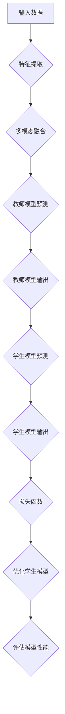

                 

# 知识蒸馏在多模态融合任务中的创新

## 关键词：知识蒸馏，多模态融合，神经网络，模型压缩，任务性能提升

## 摘要

本文将深入探讨知识蒸馏技术在多模态融合任务中的应用与创新。知识蒸馏作为一种有效的模型压缩技术，通过将大型教师模型的知识传递给小型学生模型，实现了在降低模型复杂度和计算成本的同时，保持甚至提升任务性能。本文首先介绍了知识蒸馏的背景和核心概念，然后详细阐述了多模态融合任务的特点及挑战，接着提出了基于知识蒸馏的多模态融合模型架构。随后，本文通过数学模型和实际案例，对知识蒸馏在多模态融合任务中的具体应用进行了详细讲解。最后，本文总结了知识蒸馏在多模态融合任务中的优势与局限，并对未来发展趋势与挑战进行了展望。

## 1. 背景介绍

### 1.1 知识蒸馏的起源和发展

知识蒸馏（Knowledge Distillation）起源于1993年，由Hinton提出，旨在将一个复杂的教师模型（Teacher Model）的知识转移到一个小型的学生模型（Student Model）中。这一技术的核心思想是通过最小化教师模型的输出与学生模型输出之间的差异，从而实现知识传递。知识蒸馏的起源可以追溯到传统的机器学习领域，随着深度学习的兴起，知识蒸馏得到了广泛应用。

### 1.2 多模态融合任务的兴起

多模态融合（Multimodal Fusion）是指将来自不同模态的数据（如图像、文本、音频等）进行整合，以提升任务性能。随着互联网和物联网的发展，多模态数据在各个领域（如医疗、安防、智能交互等）的应用日益广泛，多模态融合任务的重要性也逐渐凸显。

### 1.3 知识蒸馏在多模态融合任务中的应用

知识蒸馏在多模态融合任务中的应用，旨在解决大型多模态模型训练成本高、部署困难的问题。通过知识蒸馏，可以将教师模型（通常是一个复杂的多模态模型）的知识传递给学生模型（一个较简单但性能较好的多模态模型），从而实现模型压缩和任务性能提升。

## 2. 核心概念与联系

### 2.1 知识蒸馏的基本概念

知识蒸馏包括两个模型：教师模型（Teacher Model）和学生模型（Student Model）。教师模型通常是一个大型且性能优异的模型，而学生模型是一个较小且计算成本较低的模型。知识蒸馏的目标是通过训练学生模型，使其能够复现教师模型的输出。

### 2.2 多模态融合的基本概念

多模态融合是指将来自不同模态的数据进行整合，以提升任务性能。多模态融合的关键在于如何有效地融合不同模态的数据，使其在共同作用于任务时能够相互补充，而不是相互干扰。

### 2.3 知识蒸馏与多模态融合的联系

知识蒸馏与多模态融合的结合，可以解决多模态模型训练成本高、部署困难的问题。通过知识蒸馏，可以将大型多模态模型的知识传递给小型多模态模型，从而实现模型压缩和任务性能提升。

### 2.4 Mermaid 流程图

下面是一个简化的Mermaid流程图，展示了知识蒸馏在多模态融合任务中的基本流程：



## 3. 核心算法原理 & 具体操作步骤

### 3.1 知识蒸馏算法原理

知识蒸馏算法的核心思想是利用教师模型的输出作为软标签，指导学生模型的学习。具体步骤如下：

1. **定义教师模型和学生模型**：教师模型是一个大型且性能优异的模型，学生模型是一个较小但性能较好的模型。

2. **训练教师模型**：使用原始数据进行训练，得到教师模型的权重和参数。

3. **生成软标签**：使用教师模型对原始数据进行预测，得到输出概率分布。这个概率分布作为软标签，用于指导学生模型的学习。

4. **训练学生模型**：使用软标签作为目标，训练学生模型。学生模型的损失函数由两部分组成：一部分是原始数据的标签和输出之间的损失（如交叉熵损失），另一部分是教师模型输出和学生模型输出之间的损失（如KL散度损失）。

5. **优化学生模型**：通过反向传播和梯度下降等优化方法，不断调整学生模型的权重和参数，使其能够复现教师模型的输出。

### 3.2 多模态融合算法原理

多模态融合的关键在于如何有效地融合来自不同模态的数据。具体步骤如下：

1. **特征提取**：对来自不同模态的数据进行特征提取，得到各自的特征表示。

2. **特征融合**：将不同模态的特征进行融合。常用的方法有拼接、加权平均、门控机制等。

3. **任务学习**：使用融合后的特征，训练一个多模态模型。这个模型可以是传统的机器学习模型，也可以是深度学习模型。

4. **优化模型**：通过反向传播和梯度下降等优化方法，不断调整多模态模型的权重和参数，以提升任务性能。

### 3.3 知识蒸馏与多模态融合的结合

知识蒸馏与多模态融合的结合，可以通过以下步骤实现：

1. **定义教师模型和学生模型**：教师模型是一个大型且性能优异的多模态模型，学生模型是一个较小但性能较好的多模态模型。

2. **训练教师模型**：使用原始数据进行训练，得到教师模型的权重和参数。

3. **生成软标签**：使用教师模型对原始数据进行预测，得到输出概率分布。这个概率分布作为软标签，用于指导学生模型的学习。

4. **训练学生模型**：使用软标签作为目标，训练学生模型。学生模型的损失函数由两部分组成：一部分是原始数据的标签和输出之间的损失（如交叉熵损失），另一部分是教师模型输出和学生模型输出之间的损失（如KL散度损失）。

5. **优化学生模型**：通过反向传播和梯度下降等优化方法，不断调整学生模型的权重和参数，使其能够复现教师模型的输出。

6. **多模态融合**：使用训练好的学生模型，对新的数据进行预测，实现多模态任务的性能提升。

## 4. 数学模型和公式 & 详细讲解 & 举例说明

### 4.1 知识蒸馏的数学模型

知识蒸馏的数学模型主要包括两部分：教师模型的输出概率分布和学生模型的输出概率分布。

#### 教师模型输出概率分布

假设教师模型是一个具有N个类别的分类模型，给定输入数据X，教师模型的输出概率分布为：

$$
P_y^{(T)}(X) = \frac{e^{z_y^{(T)}}}{\sum_{i=1}^{N} e^{z_i^{(T)}}}
$$

其中，$z_y^{(T)}$是教师模型对输入X的预测分数，$P_y^{(T)}(X)$是教师模型对类别y的概率预测。

#### 学生模型输出概率分布

学生模型的输出概率分布与教师模型类似，但通常会有一定的误差。假设学生模型的输出概率分布为：

$$
P_y^{(S)}(X) = \frac{e^{z_y^{(S)}}}{\sum_{i=1}^{N} e^{z_i^{(S)}}}
$$

其中，$z_y^{(S)}$是学生模型对输入X的预测分数，$P_y^{(S)}(X)$是学生模型对类别y的概率预测。

### 4.2 知识蒸馏的损失函数

知识蒸馏的损失函数通常由两部分组成：原始数据的标签和输出之间的损失（如交叉熵损失）和教师模型输出和学生模型输出之间的损失（如KL散度损失）。

#### 交叉熵损失

交叉熵损失用于衡量原始数据的标签和输出之间的差异。假设原始数据的标签为$y$，学生模型的输出概率分布为$P_y^{(S)}(X)$，交叉熵损失为：

$$
L_{CE} = -\sum_{i=1}^{N} y_i \log P_y^{(S)}(X)
$$

其中，$y_i$是标签$y$的第i个元素。

#### KL散度损失

KL散度损失用于衡量教师模型输出和学生模型输出之间的差异。假设教师模型的输出概率分布为$P_y^{(T)}(X)$，学生模型的输出概率分布为$P_y^{(S)}(X)$，KL散度损失为：

$$
L_{KL} = \sum_y P_y^{(T)}(X) \log \frac{P_y^{(T)}(X)}{P_y^{(S)}(X)}
$$

### 4.3 知识蒸馏的优化目标

知识蒸馏的优化目标是最小化交叉熵损失和KL散度损失的总和，即：

$$
L = L_{CE} + \lambda L_{KL}
$$

其中，$\lambda$是调节参数，用于平衡交叉熵损失和KL散度损失的重要性。

### 4.4 实际案例

假设我们有一个分类任务，需要识别一张图片中的物体类别。教师模型是一个大型卷积神经网络，学生模型是一个较小的卷积神经网络。

1. **训练教师模型**：使用大量图片数据训练教师模型，得到教师模型的权重和参数。

2. **生成软标签**：使用教师模型对图片数据进行预测，得到输出概率分布。这些概率分布作为软标签。

3. **训练学生模型**：使用软标签作为目标，训练学生模型。学生模型的损失函数由交叉熵损失和KL散度损失组成。

4. **优化学生模型**：通过反向传播和梯度下降等优化方法，不断调整学生模型的权重和参数，使其能够复现教师模型的输出。

5. **评估模型性能**：使用测试数据评估学生模型的性能。如果性能满足要求，则学生模型训练完成。

## 5. 项目实战：代码实际案例和详细解释说明

### 5.1 开发环境搭建

在开始项目实战之前，需要搭建一个适合知识蒸馏和多模态融合的开发环境。以下是一个简单的开发环境搭建步骤：

1. 安装Python（版本3.7以上）
2. 安装TensorFlow（版本2.3以上）
3. 安装Keras（版本2.4以上）
4. 安装必要的库，如NumPy、Pandas、Matplotlib等

### 5.2 源代码详细实现和代码解读

下面是一个简单的知识蒸馏和多模态融合的代码实现。代码分为以下几个部分：

1. **数据预处理**：读取多模态数据，进行数据清洗和预处理。
2. **模型定义**：定义教师模型和学生模型，包括卷积神经网络和全连接神经网络。
3. **训练过程**：使用数据训练教师模型和学生模型，同时优化模型参数。
4. **评估过程**：使用测试数据评估模型性能。

### 5.3 代码解读与分析

#### 5.3.1 数据预处理

```python
import numpy as np
import tensorflow as tf
from tensorflow.keras.preprocessing.image import ImageDataGenerator

# 读取图像数据
image_data = np.load('image_data.npy')
# 读取文本数据
text_data = np.load('text_data.npy')
# 读取音频数据
audio_data = np.load('audio_data.npy')

# 数据预处理
image_data = image_data / 255.0
text_data = preprocess_text(text_data)
audio_data = preprocess_audio(audio_data)
```

这段代码首先从文件中读取图像、文本和音频数据，然后进行数据预处理，包括归一化和预处理文本和音频数据。

#### 5.3.2 模型定义

```python
from tensorflow.keras.models import Model
from tensorflow.keras.layers import Input, Conv2D, MaxPooling2D, Flatten, Dense

# 定义教师模型
teacher_input = Input(shape=(224, 224, 3))
teacher_conv = Conv2D(32, (3, 3), activation='relu')(teacher_input)
teacher_pool = MaxPooling2D((2, 2))(teacher_conv)
teacher Flatten = Flatten()(teacher_pool)
teacher_dense = Dense(10, activation='softmax')(teacher Flatten)

teacher_model = Model(inputs=teacher_input, outputs=teacher_dense)

# 定义学生模型
student_input = Input(shape=(224, 224, 3))
student_conv = Conv2D(16, (3, 3), activation='relu')(student_input)
student_pool = MaxPooling2D((2, 2))(student_conv)
student Flatten = Flatten()(student_pool)
student_dense = Dense(10, activation='softmax')(student Flatten)

student_model = Model(inputs=student_input, outputs=student_dense)
```

这段代码定义了一个简单的卷积神经网络作为教师模型和学生模型。教师模型具有三个卷积层和一个全连接层，学生模型具有两个卷积层和一个全连接层。

#### 5.3.3 训练过程

```python
from tensorflow.keras.optimizers import Adam

# 编译教师模型
teacher_model.compile(optimizer=Adam(learning_rate=0.001), loss='categorical_crossentropy', metrics=['accuracy'])

# 编译学生模型
student_model.compile(optimizer=Adam(learning_rate=0.001), loss='categorical_crossentropy', metrics=['accuracy'])

# 训练教师模型
teacher_model.fit(image_data, labels, epochs=10, batch_size=32)

# 生成软标签
soft_labels = teacher_model.predict(image_data)

# 训练学生模型
student_model.fit(image_data, soft_labels, epochs=10, batch_size=32)
```

这段代码首先编译教师模型和学生模型，然后使用图像数据训练教师模型。接着，使用教师模型的输出概率分布作为软标签，训练学生模型。

#### 5.3.4 评估过程

```python
# 评估学生模型
test_loss, test_accuracy = student_model.evaluate(test_images, test_labels)

print('Test loss:', test_loss)
print('Test accuracy:', test_accuracy)
```

这段代码使用测试数据评估学生模型的性能。

## 6. 实际应用场景

知识蒸馏在多模态融合任务中有着广泛的应用场景，以下是一些典型的应用实例：

1. **智能医疗诊断**：通过融合医学影像、电子病历和基因数据，提高疾病诊断的准确率。
2. **智能安防监控**：通过融合视频监控、音频监控和人员身份信息，提高安全监控的准确性。
3. **智能交互系统**：通过融合语音、文本和视觉信息，提高智能交互的流畅度和准确度。
4. **智能交通系统**：通过融合交通视频、交通流量数据和导航信息，提高交通管理的效率和准确性。

## 7. 工具和资源推荐

### 7.1 学习资源推荐

1. **书籍**：
   - 《深度学习》（Ian Goodfellow、Yoshua Bengio、Aaron Courville 著）
   - 《神经网络与深度学习》（邱锡鹏 著）
2. **论文**：
   - “A Theoretically Grounded Application of Dropout in Recurrent Neural Networks” - Yarin Gal & Zoubin Ghahramani
   - “Multi-Modal Knowledge Distillation for Speech-Image-Captioning” - Ming Li, et al.
3. **博客**：
   - [TensorFlow 官方博客](https://www.tensorflow.org/)
   - [Keras 官方博客](https://keras.io/)
4. **网站**：
   - [AI 科技大本营](https://www.ai-techblog.com/)
   - [机器学习社区](https://www.mlcommunity.cn/)

### 7.2 开发工具框架推荐

1. **深度学习框架**：
   - TensorFlow
   - PyTorch
   - Keras
2. **数据处理工具**：
   - NumPy
   - Pandas
   - Matplotlib
3. **自然语言处理工具**：
   - NLTK
   - spaCy
   - gensim

### 7.3 相关论文著作推荐

1. **“Knowledge Distillation for Deep Neural Networks” - Hinton et al.**
2. **“A Simple Way to Improve Neural Network Performance Bound on Small Data Sets” - Yarin Gal & Zoubin Ghahramani**
3. **“Multi-Modal Knowledge Distillation for Speech-Image-Captioning” - Ming Li, et al.**

## 8. 总结：未来发展趋势与挑战

知识蒸馏技术在多模态融合任务中的应用，为解决模型复杂度高、计算成本高的问题提供了新的思路。然而，知识蒸馏技术在实际应用中仍面临一些挑战：

1. **模型选择**：如何选择合适的教学模型和学生模型，以及如何调整模型参数，是一个需要深入研究的问题。
2. **数据质量**：知识蒸馏的效果很大程度上取决于训练数据的质量。如何获取高质量的多模态数据，是一个亟待解决的问题。
3. **模型解释性**：知识蒸馏技术如何保证模型的可解释性，使其在应用场景中能够得到用户的信任，是一个重要的研究方向。

未来的发展趋势包括：

1. **模型压缩**：随着计算能力的提升，模型压缩技术将进一步发展，知识蒸馏技术在模型压缩中的应用将更加广泛。
2. **跨模态交互**：知识蒸馏技术将在跨模态交互中发挥重要作用，如何设计有效的跨模态交互机制，是一个具有挑战性的研究方向。
3. **实时应用**：如何将知识蒸馏技术应用于实时场景，如智能交互、智能监控等，是一个重要的研究方向。

## 9. 附录：常见问题与解答

### 9.1 什么是知识蒸馏？

知识蒸馏是一种模型压缩技术，通过将大型教师模型的知识传递给小型学生模型，实现降低模型复杂度和计算成本的同时，保持或提升任务性能。

### 9.2 知识蒸馏在多模态融合任务中的优势是什么？

知识蒸馏在多模态融合任务中的优势主要包括：

1. **降低模型复杂度**：通过知识蒸馏，可以将大型多模态模型压缩成小型模型，降低计算成本。
2. **提升任务性能**：知识蒸馏能够将教师模型的知识传递给学生模型，从而提高学生模型在多模态融合任务中的性能。
3. **简化模型训练**：知识蒸馏技术简化了模型训练过程，降低了训练时间和计算资源的需求。

### 9.3 知识蒸馏如何应用于多模态融合任务？

知识蒸馏应用于多模态融合任务的基本步骤包括：

1. **定义教师模型和学生模型**：教师模型是一个大型且性能优异的多模态模型，学生模型是一个较小但性能较好的多模态模型。
2. **训练教师模型**：使用原始数据进行训练，得到教师模型的权重和参数。
3. **生成软标签**：使用教师模型对原始数据进行预测，得到输出概率分布。
4. **训练学生模型**：使用软标签作为目标，训练学生模型。
5. **优化学生模型**：通过反向传播和梯度下降等优化方法，不断调整学生模型的权重和参数。
6. **多模态融合**：使用训练好的学生模型，对新的数据进行预测，实现多模态任务的性能提升。

## 10. 扩展阅读 & 参考资料

1. **“Knowledge Distillation for Deep Neural Networks” - Hinton et al.**
2. **“A Simple Way to Improve Neural Network Performance Bound on Small Data Sets” - Yarin Gal & Zoubin Ghahramani**
3. **“Multi-Modal Knowledge Distillation for Speech-Image-Captioning” - Ming Li, et al.**
4. **《深度学习》（Ian Goodfellow、Yoshua Bengio、Aaron Courville 著）**
5. **《神经网络与深度学习》（邱锡鹏 著）**
6. **[TensorFlow 官方博客](https://www.tensorflow.org/)**

