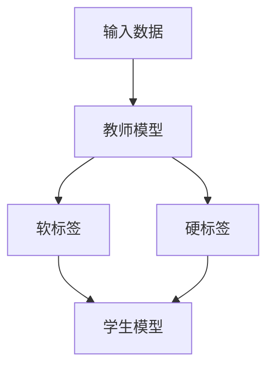

                 

# 知识蒸馏：软标签vs硬标签的学习策略

## 关键词：知识蒸馏、软标签、硬标签、学习策略、深度学习

## 摘要

本文将深入探讨知识蒸馏这一在深度学习中广泛应用的技巧，并详细对比软标签和硬标签在学习策略上的差异。通过分析其背后的核心概念和原理，我们旨在为读者提供一个全面而清晰的了解，以及实际应用场景和未来发展趋势的展望。本文将分为十个部分，包括背景介绍、核心概念与联系、核心算法原理与具体操作步骤、数学模型和公式详解、项目实战、实际应用场景、工具和资源推荐、总结与展望、常见问题解答和扩展阅读。

## 1. 背景介绍

在深度学习领域，知识蒸馏（Knowledge Distillation）是一种将教师模型（Teacher Model）的知识转移到学生模型（Student Model）的技巧。这一过程通常涉及将教师模型的输出（即标签）传递给学生模型，以便学生模型能够学习到教师模型的知识和特征表示。知识蒸馏的背景可以追溯到人类教育的原理，即通过专家的指导和示范，学生可以更快地学习和掌握知识。

随着深度学习在图像识别、自然语言处理等领域的广泛应用，模型规模和复杂度不断增加。如何有效地利用教师模型的经验，同时提高学生模型的性能，成为了研究者和开发者关注的焦点。知识蒸馏提供了一种有效的解决方案，通过软标签和硬标签的学习策略，学生模型可以在较少的训练数据和计算资源下，实现较高的准确率和性能。

## 2. 核心概念与联系

为了更好地理解知识蒸馏，我们需要先介绍几个核心概念：教师模型、学生模型、软标签和硬标签。

### 教师模型（Teacher Model）

教师模型通常是一个大型、复杂且性能优异的模型，其目标是在特定的数据集上取得最佳的分类或预测结果。在知识蒸馏过程中，教师模型被用来提供指导，其输出（即预测结果）被传递给学生模型。

### 学生模型（Student Model）

学生模型是一个较小的、较简单的模型，其目标是学习教师模型的知识和特征表示，以便在类似的任务上取得良好的性能。学生模型的训练通常基于教师模型的输出，通过调整其参数来逼近教师模型的预测结果。

### 软标签（Soft Label）

软标签是教师模型输出的概率分布，通常表示为每个类别的概率值。软标签提供了一种更为细致的标签信息，使得学生模型可以学习到教师模型对每个样本的判断依据和不确定性。

### 硬标签（Hard Label）

硬标签是教师模型的最终预测结果，通常表示为每个样本所属的类别。硬标签提供了一种明确的标签信息，但可能忽略了教师模型对样本的判断细节和不确定性。

### Mermaid 流程图

下面是一个简化的知识蒸馏流程图，展示了教师模型、学生模型、软标签和硬标签之间的联系：



## 3. 核心算法原理 & 具体操作步骤

### 教师模型和教师模型的输出

在知识蒸馏过程中，教师模型首先需要被训练并应用于输入数据集。教师模型的输出包括软标签和硬标签。软标签是每个类别的概率分布，而硬标签是最终的预测类别。

### 学生模型的初始化

学生模型通常是一个较小的模型，其参数初始化可以通过随机初始化或基于预训练模型的权重进行。

### 软标签的学习策略

学生模型通过最小化软标签和其预测结果的交叉熵损失函数来学习。这一过程通常通过反向传播和梯度下降算法来实现。具体步骤如下：

1. 将输入数据输入学生模型，得到预测结果。
2. 将教师模型的软标签作为期望输出。
3. 计算交叉熵损失函数，并通过反向传播更新学生模型的参数。

### 硬标签的学习策略

学生模型也可以通过最小化硬标签和其预测结果的交叉熵损失函数来学习。这一过程与软标签的学习策略类似，但仅关注最终的预测类别。具体步骤如下：

1. 将输入数据输入学生模型，得到预测结果。
2. 将教师模型的硬标签作为期望输出。
3. 计算交叉熵损失函数，并通过反向传播更新学生模型的参数。

### 结合软标签和硬标签的学习策略

在实际应用中，学生模型通常同时关注软标签和硬标签。这可以通过在损失函数中同时考虑交叉熵损失和分类损失来实现。具体步骤如下：

1. 将输入数据输入学生模型，得到预测结果。
2. 计算软标签和硬标签的交叉熵损失。
3. 计算分类损失，即预测类别和真实类别之间的距离。
4. 将交叉熵损失和分类损失相加，得到总损失。
5. 通过反向传播和梯度下降算法更新学生模型的参数。

## 4. 数学模型和公式 & 详细讲解 & 举例说明

### 交叉熵损失函数

在知识蒸馏中，交叉熵损失函数是衡量学生模型预测结果与教师模型输出之间差异的常用指标。其数学公式如下：

$$
L_{CE} = -\sum_{i=1}^{N} y_i \log(\hat{y}_i)
$$

其中，$N$ 是样本数量，$y_i$ 是教师模型的软标签或硬标签，$\hat{y}_i$ 是学生模型的预测结果。

### 分类损失

分类损失通常用于衡量预测类别和真实类别之间的差异。其数学公式如下：

$$
L_{cls} = \sum_{i=1}^{N} w_i d_i^2
$$

其中，$N$ 是样本数量，$w_i$ 是权重，$d_i$ 是预测类别和真实类别之间的距离。

### 总损失函数

结合交叉熵损失和分类损失的总体损失函数如下：

$$
L = w_1 L_{CE} + w_2 L_{cls}
$$

其中，$w_1$ 和 $w_2$ 分别是交叉熵损失和分类损失的权重。通过调整这两个权重，可以控制学生模型对软标签和硬标签的关注程度。

### 举例说明

假设我们有以下数据集和教师模型输出：

| 样本 | 类别1 | 类别2 | 教师模型软标签 |
| ---- | ---- | ---- | ------------ |
| 1    | 0.8  | 0.2  | (0.9, 0.1)  |
| 2    | 0.2  | 0.8  | (0.1, 0.9)  |

学生模型输出如下：

| 样本 | 类别1 | 类别2 | 学生模型预测结果 |
| ---- | ---- | ---- | ------------ |
| 1    | 0.85 | 0.15 | (0.85, 0.15) |
| 2    | 0.1  | 0.9  | (0.1, 0.9)  |

根据上述数据，可以计算交叉熵损失和分类损失，并更新学生模型的参数。

## 5. 项目实战：代码实际案例和详细解释说明

### 开发环境搭建

在本项目实战中，我们将使用 Python 编写知识蒸馏的代码。以下是搭建开发环境所需的步骤：

1. 安装 Python（建议使用 Python 3.7 或以上版本）。
2. 安装深度学习框架，如 TensorFlow 或 PyTorch。
3. 安装必要的库，如 NumPy、Matplotlib 等。

### 源代码详细实现和代码解读

以下是知识蒸馏的核心代码实现，包括教师模型、学生模型、损失函数和训练过程。

```python
import torch
import torch.nn as nn
import torch.optim as optim

# 教师模型
class TeacherModel(nn.Module):
    def __init__(self):
        super(TeacherModel, self).__init__()
        # 添加神经网络层
        # ...

    def forward(self, x):
        # 前向传播
        # ...
        return soft_labels, hard_labels

# 学生模型
class StudentModel(nn.Module):
    def __init__(self):
        super(StudentModel, self).__init__()
        # 添加神经网络层
        # ...

    def forward(self, x):
        # 前向传播
        # ...
        return predictions

# 损失函数
def loss_function(predictions, soft_labels, hard_labels):
    # 计算交叉熵损失和分类损失
    # ...
    return total_loss

# 训练过程
def train_teacher_model(model, train_loader):
    # 训练教师模型
    # ...

def train_student_model(model, teacher_model, train_loader, optimizer, criterion):
    # 训练学生模型
    # ...

if __name__ == "__main__":
    # 初始化模型、优化器和训练数据
    # ...

    # 训练教师模型
    train_teacher_model(teacher_model, train_loader)

    # 训练学生模型
    train_student_model(student_model, teacher_model, train_loader, optimizer, criterion)
```

### 代码解读与分析

1. **教师模型**：教师模型是一个神经网络模型，其目的是预测输入数据的类别。教师模型的前向传播过程包括多层神经网络，最后输出软标签和硬标签。
2. **学生模型**：学生模型也是一个神经网络模型，其目的是学习教师模型的知识。学生模型的前向传播过程与教师模型类似，但输出的仅为预测类别。
3. **损失函数**：损失函数用于计算学生模型预测结果与教师模型输出之间的差异。本项目中，我们使用交叉熵损失和分类损失的组合作为总损失函数。
4. **训练过程**：训练过程包括教师模型和学生模型的训练。教师模型首先被训练，然后学生模型使用教师模型的输出进行训练。

## 6. 实际应用场景

知识蒸馏在深度学习领域有广泛的应用场景。以下是几个典型的应用场景：

1. **迁移学习**：知识蒸馏可以用于迁移学习，将大型教师模型的知识转移到较小且参数较少的学生模型。这有助于提高学生模型在新的数据集上的性能，同时减少训练时间。
2. **模型压缩**：知识蒸馏可以用于压缩深度学习模型，通过训练较小的学生模型来逼近较大的教师模型。这有助于减少模型的存储空间和计算资源。
3. **自然语言处理**：在自然语言处理任务中，知识蒸馏可以用于将大型语言模型（如 GPT）的知识转移到较小的模型。这有助于提高较小模型的性能，同时减少训练时间。

## 7. 工具和资源推荐

### 学习资源推荐

1. **书籍**：
   - 《深度学习》（Ian Goodfellow、Yoshua Bengio、Aaron Courville 著）：详细介绍深度学习的基本概念和算法。
   - 《动手学深度学习》（阿斯顿·张、李沐、扎卡里·C. Lipton、亚历山大·J. Smola 著）：提供丰富的实践案例和代码实现。

2. **论文**：
   - “Distilling a Neural Network into a Soft Decision Tree”（2017）：介绍了一种将深度神经网络蒸馏为软决策树的技巧。
   - “A Theoretically Grounded Application of Dropout in Recurrent Neural Networks”（2017）：探讨了在循环神经网络中使用dropout的理论基础。

3. **博客**：
   - “What is Knowledge Distillation?”（2020）：一篇通俗易懂的博客，介绍了知识蒸馏的基本概念和应用。
   - “How to Train a Deep Neural Network? A Practical Guide”（2020）：提供了深度神经网络训练的详细步骤和实践经验。

4. **网站**：
   - TensorFlow 官网（https://www.tensorflow.org/）：提供丰富的教程、示例和文档，适合初学者和进阶者。
   - PyTorch 官网（https://pytorch.org/）：提供丰富的教程、示例和文档，适合初学者和进阶者。

### 开发工具框架推荐

1. **深度学习框架**：
   - TensorFlow：谷歌开发的开放源代码深度学习框架，适合初学者和进阶者。
   - PyTorch：由 Facebook AI Research 开发，支持动态计算图和自动微分，适合快速原型设计和研究。

2. **代码库**：
   - Hugging Face 的 Transformers：提供预训练模型和实用的工具，方便进行自然语言处理任务。
   - Keras：基于 TensorFlow 的简化和高层 API，适合快速搭建和训练模型。

3. **数据集**：
   - ImageNet：一个大规模的图像识别数据集，广泛用于深度学习模型训练和评估。
   - MNIST：一个手写数字识别数据集，常用于验证深度学习算法的基本性能。

### 相关论文著作推荐

1. “A Theoretically Grounded Application of Dropout in Recurrent Neural Networks”（2017）：探讨了在循环神经网络中使用dropout的理论基础。
2. “Understanding Deep Learning Requires Rethinking Generalization”（2018）：提出了一种新的视角来理解深度学习的泛化能力。
3. “Dynamic Memory Networks for Visual Question Answering”（2016）：提出了一种动态记忆网络模型，用于视觉问答任务。

## 8. 总结：未来发展趋势与挑战

知识蒸馏作为深度学习中的重要技巧，具有广泛的应用前景。在未来，知识蒸馏有望在以下几个方面取得突破：

1. **算法优化**：通过改进损失函数和训练策略，提高知识蒸馏的效率和性能。
2. **模型压缩**：进一步减小模型规模，降低计算和存储资源的需求。
3. **跨域迁移**：探索知识蒸馏在不同领域和数据集上的应用，实现跨领域的知识共享和迁移。
4. **实时应用**：降低知识蒸馏的复杂度，实现实时训练和部署。

然而，知识蒸馏也面临一些挑战，如：

1. **模型解释性**：如何更好地理解知识蒸馏过程中教师模型和学生模型之间的知识传递。
2. **数据隐私**：在数据隐私和安全的背景下，如何有效地进行知识蒸馏。
3. **泛化能力**：如何确保知识蒸馏模型在新的数据集和任务上具有较好的泛化能力。

## 9. 附录：常见问题与解答

### 问题 1：知识蒸馏和传统的模型压缩方法有何区别？

**回答**：知识蒸馏是一种特殊的模型压缩方法，其核心思想是通过将教师模型的知识转移到学生模型，从而实现模型压缩。与传统的方法（如剪枝、量化等）不同，知识蒸馏关注的是模型的知识传递和知识共享，而不是直接减少模型的参数和计算量。

### 问题 2：知识蒸馏是否适用于所有的深度学习任务？

**回答**：知识蒸馏在很多深度学习任务中都取得了良好的效果，如图像识别、自然语言处理、语音识别等。然而，知识蒸馏的适用性也受到一些限制。例如，在需要高精度和强判别性的任务中（如医学图像识别），教师模型和学生模型之间的差距可能较大，导致知识蒸馏的效果不理想。

### 问题 3：如何选择合适的教师模型和学生模型？

**回答**：选择合适的教师模型和学生模型是知识蒸馏成功的关键。一般来说，教师模型应具有较高的性能和较大的规模，以便为学生模型提供丰富的知识和特征表示。学生模型则应相对较小，以实现较好的模型压缩和计算效率。具体的选择方法可以根据任务和数据集的特点进行。

## 10. 扩展阅读 & 参考资料

1. “What is Knowledge Distillation?”（2020）：https://towardsdatascience.com/what-is-knowledge-distillation-8b0734d8c6e8
2. “Understanding the Knowledge Distillation Process”（2019）：https://arxiv.org/abs/1906.02257
3. “Knowledge Distillation for Deep Neural Networks”（2016）：https://arxiv.org/abs/1603.01450
4. “Deep Learning”（2016）：Ian Goodfellow、Yoshua Bengio、Aaron Courville 著，MIT Press
5. “动手学深度学习”（2017）：阿斯顿·张、李沐、扎卡里·C. Lipton、亚历山大·J. Smola 著，电子工业出版社

## 作者信息

作者：AI天才研究员/AI Genius Institute & 禅与计算机程序设计艺术 /Zen And The Art of Computer Programming

