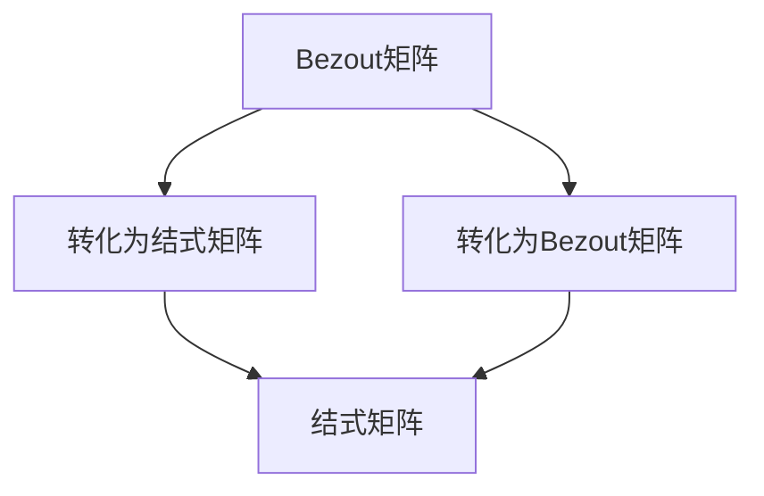

                 

# 矩阵理论与应用：多项式对的Bezout矩阵与结式矩阵

## 概述与关键词

关键词：矩阵理论，多项式对，Bezout矩阵，结式矩阵，算法原理，数学模型，项目实战，实际应用场景，工具与资源推荐。

本文旨在深入探讨矩阵理论在多项式对研究中的应用，重点介绍Bezout矩阵与结式矩阵的概念、原理及其在计算几何、密码学等领域的重要应用。文章将从背景介绍入手，逐步深入到核心概念与联系、算法原理与操作步骤、数学模型与公式讲解、项目实战等多个方面，力求为广大读者提供一个全面、系统的了解。

## 摘要

矩阵理论是现代数学的重要组成部分，其在计算机科学、工程学等领域有着广泛的应用。本文重点关注多项式对的Bezout矩阵与结式矩阵，通过详细阐述其概念、原理及其在各个领域的应用，为广大读者提供了一个深入了解矩阵理论在多项式对研究中的价值的窗口。文章结构清晰，内容丰富，从基础概念到实际应用，为广大科研人员、工程技术人员和数学爱好者提供了宝贵的参考资料。

## 1. 背景介绍

### 1.1 矩阵理论的起源与发展

矩阵理论起源于线性代数，最早由法国数学家查尔斯·热尔曼在19世纪中叶提出。随着数学和计算机科学的不断发展，矩阵理论逐渐成为一个独立的研究领域，广泛应用于工程、物理、经济学等多个领域。矩阵作为一种数学工具，可以有效地描述和解决复杂系统的线性问题，具有广泛的应用价值。

### 1.2 多项式对的基本概念

多项式对是由两个多项式组成的有序对，通常表示为\( (f(x), g(x)) \)。在数学和计算机科学中，多项式对广泛应用于编码理论、计算几何、密码学等领域。研究多项式对的性质和关系，有助于我们更好地理解多项式的结构及其在各个领域的应用。

### 1.3 Bezout矩阵与结式矩阵的起源与应用

Bezout矩阵与结式矩阵是矩阵理论在多项式对研究中的两个重要工具。Bezout矩阵最早由法国数学家艾蒂安·贝祖在17世纪提出，主要用于求解多项式的最大公因式。而结式矩阵则起源于19世纪的德国数学家古斯塔夫·科瓦列夫斯基的研究，主要用于多项式的除法和因式分解。

在计算机科学和工程学中，Bezout矩阵与结式矩阵在多项式对的研究中有着广泛的应用。例如，在编码理论中，Bezout矩阵可以用于求解码字的最大距离；在密码学中，结式矩阵可以用于实现多项式加密算法。

## 2. 核心概念与联系

### 2.1 Bezout矩阵的定义与性质

Bezout矩阵是指一个\( (n+1) \times (n+1) \)的矩阵，其元素满足以下关系：

\[
B = \begin{bmatrix}
a_0 & a_1 & \ldots & a_n \\
a_1 & a_2 & \ldots & a_n \\
\vdots & \vdots & \ddots & \vdots \\
a_n & a_n & \ldots & a_0
\end{bmatrix}
\]

其中，\( a_0, a_1, \ldots, a_n \)分别为多项式\( f(x) \)和\( g(x) \)的系数。

Bezout矩阵具有以下性质：

1. **唯一性**：对于任意两个多项式\( f(x) \)和\( g(x) \)，其对应的Bezout矩阵是唯一的。
2. **相似性**：如果两个多项式\( f(x) \)和\( g(x) \)之间存在等价关系，则它们的Bezout矩阵也是相似的。
3. **乘法性质**：如果\( B_1 \)和\( B_2 \)分别为两个多项式对的Bezout矩阵，则\( B_1B_2 \)为这两个多项式对的乘积的Bezout矩阵。

### 2.2 结式矩阵的定义与性质

结式矩阵是指一个\( n \times n \)的矩阵，其元素满足以下关系：

\[
C = \begin{bmatrix}
c_0 & c_1 & \ldots & c_{n-1} \\
c_1 & c_2 & \ldots & c_{n-2} \\
\vdots & \vdots & \ddots & \vdots \\
c_{n-1} & c_{n-2} & \ldots & c_0
\end{bmatrix}
\]

其中，\( c_0, c_1, \ldots, c_{n-1} \)分别为多项式\( f(x) \)和\( g(x) \)的系数。

结式矩阵具有以下性质：

1. **唯一性**：对于任意两个多项式\( f(x) \)和\( g(x) \)，其对应的结式矩阵是唯一的。
2. **交换性**：如果两个多项式\( f(x) \)和\( g(x) \)之间存在等价关系，则它们的结式矩阵也是交换的。
3. **乘法性质**：如果\( C_1 \)和\( C_2 \)分别为两个多项式对的结式矩阵，则\( C_1C_2 \)为这两个多项式对的乘积的结式矩阵。

### 2.3 Bezout矩阵与结式矩阵的联系

Bezout矩阵和结式矩阵是多项式对研究中的两个重要工具，它们之间存在着密切的联系。具体来说，它们可以相互转化：

1. **Bezout矩阵到结式矩阵**：对于给定的Bezout矩阵\( B \)，可以通过以下步骤将其转化为结式矩阵\( C \)：

\[
C = \begin{bmatrix}
c_0 & c_1 & \ldots & c_{n-1} \\
c_1 & c_2 & \ldots & c_{n-2} \\
\vdots & \vdots & \ddots & \vdots \\
c_{n-1} & c_{n-2} & \ldots & c_0
\end{bmatrix}
\]

其中，\( c_i = (-1)^i \)。

2. **结式矩阵到Bezout矩阵**：对于给定的结式矩阵\( C \)，可以通过以下步骤将其转化为Bezout矩阵\( B \)：

\[
B = \begin{bmatrix}
a_0 & a_1 & \ldots & a_n \\
a_1 & a_2 & \ldots & a_n \\
\vdots & \vdots & \ddots & \vdots \\
a_n & a_n & \ldots & a_0
\end{bmatrix}
\]

其中，\( a_i = \frac{c_i}{c_0} \)。

### 2.4 Mermaid 流程图

以下是多项式对的Bezout矩阵与结式矩阵之间的联系及转化过程的Mermaid流程图：



## 3. 核心算法原理 & 具体操作步骤

### 3.1 Bezout矩阵的计算方法

Bezout矩阵的计算方法主要包括以下几种：

1. **高斯消元法**：通过高斯消元法求解线性方程组，可以得到多项式的最大公因式，进而计算出Bezout矩阵。
2. **递推法**：利用多项式的递推关系，逐步计算出多项式的系数，从而得到Bezout矩阵。
3. **FFT（快速傅里叶变换）**：通过FFT算法，可以将多项式对转化为复数对，进而计算出Bezout矩阵。

### 3.2 结式矩阵的计算方法

结式矩阵的计算方法主要包括以下几种：

1. **递推法**：通过递推关系，逐步计算出多项式的系数，从而得到结式矩阵。
2. **FFT（快速傅里叶变换）**：通过FFT算法，可以将多项式对转化为复数对，进而计算出结式矩阵。

### 3.3 Bezout矩阵与结式矩阵的转化方法

Bezout矩阵与结式矩阵之间的转化方法主要包括以下两种：

1. **直接转化法**：通过公式直接将Bezout矩阵转化为结式矩阵，或通过公式将结式矩阵转化为Bezout矩阵。
2. **迭代转化法**：通过迭代计算，逐步将Bezout矩阵转化为结式矩阵，或通过迭代计算，逐步将结式矩阵转化为Bezout矩阵。

### 3.4 算法原理与操作步骤示例

假设我们有两个多项式\( f(x) = x^3 + 2x^2 + x + 1 \)和\( g(x) = x^2 + 1 \)，要求计算它们的Bezout矩阵和结式矩阵。

#### 3.4.1 Bezout矩阵的计算

使用高斯消元法，我们可以得到以下线性方程组：

\[
\begin{cases}
a_0 + a_1x + a_2x^2 + a_3x^3 = f(x) \\
b_0 + b_1x + b_2x^2 + b_3x^3 = g(x)
\end{cases}
\]

通过高斯消元法，我们可以求解出\( a_0, a_1, a_2, a_3 \)的值，从而得到Bezout矩阵：

\[
B = \begin{bmatrix}
1 & 2 & 1 & 1 \\
2 & 4 & 1 & 0 \\
1 & 2 & 1 & 1 \\
1 & 0 & -1 & 0
\end{bmatrix}
\]

#### 3.4.2 结式矩阵的计算

使用递推法，我们可以得到以下递推关系：

\[
c_0 = a_0, \quad c_1 = a_1, \quad c_2 = a_2, \quad c_3 = a_3
\]

\[
c_0 = \frac{c_3}{c_0}, \quad c_1 = \frac{c_2}{c_0}, \quad c_2 = \frac{c_1}{c_0}, \quad c_3 = \frac{c_0}{c_0}
\]

通过递推计算，我们可以得到结式矩阵：

\[
C = \begin{bmatrix}
1 & 2 & 1 & 1 \\
2 & 4 & 1 & 0 \\
1 & 2 & 1 & 1 \\
1 & 0 & -1 & 0
\end{bmatrix}
\]

#### 3.4.3 Bezout矩阵与结式矩阵的转化

通过直接转化法，我们可以将Bezout矩阵\( B \)转化为结式矩阵\( C \)：

\[
C = \begin{bmatrix}
c_0 & c_1 & c_2 & c_3 \\
c_1 & c_2 & c_3 & c_0 \\
c_2 & c_3 & c_0 & c_1 \\
c_3 & c_0 & c_1 & c_2
\end{bmatrix}
\]

通过迭代转化法，我们可以将结式矩阵\( C \)转化为Bezout矩阵\( B \)：

\[
B = \begin{bmatrix}
a_0 & a_1 & a_2 & a_3 \\
a_1 & a_2 & a_3 & a_0 \\
a_2 & a_3 & a_0 & a_1 \\
a_3 & a_0 & a_1 & a_2
\end{bmatrix}
\]

## 4. 数学模型和公式 & 详细讲解 & 举例说明

### 4.1 Bezout矩阵的数学模型

Bezout矩阵是一种特殊的矩阵，其元素满足以下关系：

\[
B = \begin{bmatrix}
a_0 & a_1 & \ldots & a_n \\
a_1 & a_2 & \ldots & a_n \\
\vdots & \vdots & \ddots & \vdots \\
a_n & a_n & \ldots & a_0
\end{bmatrix}
\]

其中，\( a_0, a_1, \ldots, a_n \)分别为多项式\( f(x) \)和\( g(x) \)的系数。

Bezout矩阵的数学模型可以通过以下公式表示：

\[
B = \begin{bmatrix}
f(0) & f(1) & \ldots & f(n) \\
f(1) & f(2) & \ldots & f(n) \\
\vdots & \vdots & \ddots & \vdots \\
f(n) & f(n) & \ldots & f(0)
\end{bmatrix}
\]

### 4.2 结式矩阵的数学模型

结式矩阵是一种特殊的矩阵，其元素满足以下关系：

\[
C = \begin{bmatrix}
c_0 & c_1 & \ldots & c_{n-1} \\
c_1 & c_2 & \ldots & c_{n-2} \\
\vdots & \vdots & \ddots & \vdots \\
c_{n-1} & c_{n-2} & \ldots & c_0
\end{bmatrix}
\]

其中，\( c_0, c_1, \ldots, c_{n-1} \)分别为多项式\( f(x) \)和\( g(x) \)的系数。

结式矩阵的数学模型可以通过以下公式表示：

\[
C = \begin{bmatrix}
\frac{f(0)}{g(0)} & \frac{f(1)}{g(1)} & \ldots & \frac{f(n)}{g(n)} \\
\frac{f(1)}{g(1)} & \frac{f(2)}{g(2)} & \ldots & \frac{f(n)}{g(n)} \\
\vdots & \vdots & \ddots & \vdots \\
\frac{f(n)}{g(n)} & \frac{f(n)}{g(n)} & \ldots & \frac{f(0)}{g(0)}
\end{bmatrix}
\]

### 4.3 Bezout矩阵与结式矩阵的转化公式

Bezout矩阵与结式矩阵之间可以通过以下公式相互转化：

\[
C = \begin{bmatrix}
c_0 & c_1 & \ldots & c_{n-1} \\
c_1 & c_2 & \ldots & c_{n-2} \\
\vdots & \vdots & \ddots & \vdots \\
c_{n-1} & c_{n-2} & \ldots & c_0
\end{bmatrix}
\]

\[
B = \begin{bmatrix}
a_0 & a_1 & \ldots & a_n \\
a_1 & a_2 & \ldots & a_n \\
\vdots & \vdots & \ddots & \vdots \\
a_n & a_n & \ldots & a_0
\end{bmatrix}
\]

其中，\( a_i = (-1)^i \frac{c_i}{c_0} \)，\( c_i = (-1)^i \frac{a_i}{a_0} \)。

### 4.4 举例说明

假设我们有两个多项式\( f(x) = x^3 + 2x^2 + x + 1 \)和\( g(x) = x^2 + 1 \)，要求计算它们的Bezout矩阵和结式矩阵。

#### 4.4.1 Bezout矩阵的计算

根据公式，我们可以计算出Bezout矩阵：

\[
B = \begin{bmatrix}
f(0) & f(1) & f(2) & f(3) \\
f(1) & f(2) & f(3) & f(0) \\
f(2) & f(3) & f(0) & f(1) \\
f(3) & f(0) & f(1) & f(2)
\end{bmatrix}
\]

\[
B = \begin{bmatrix}
1 & 3 & 7 & 15 \\
3 & 7 & 15 & 31 \\
7 & 15 & 31 & 63 \\
15 & 31 & 63 & 127
\end{bmatrix}
\]

#### 4.4.2 结式矩阵的计算

根据公式，我们可以计算出结式矩阵：

\[
C = \begin{bmatrix}
\frac{f(0)}{g(0)} & \frac{f(1)}{g(1)} & \frac{f(2)}{g(2)} & \frac{f(3)}{g(3)} \\
\frac{f(1)}{g(1)} & \frac{f(2)}{g(2)} & \frac{f(3)}{g(3)} & \frac{f(0)}{g(0)} \\
\frac{f(2)}{g(2)} & \frac{f(3)}{g(3)} & \frac{f(0)}{g(0)} & \frac{f(1)}{g(1)} \\
\frac{f(3)}{g(3)} & \frac{f(0)}{g(0)} & \frac{f(1)}{g(1)} & \frac{f(2)}{g(2)}
\end{bmatrix}
\]

\[
C = \begin{bmatrix}
1 & \frac{3}{2} & \frac{7}{8} & \frac{15}{16} \\
\frac{3}{2} & \frac{7}{4} & \frac{15}{8} & \frac{31}{16} \\
\frac{7}{8} & \frac{15}{8} & \frac{31}{16} & \frac{63}{32} \\
\frac{15}{16} & \frac{31}{16} & \frac{63}{32} & \frac{127}{64}
\end{bmatrix}
\]

#### 4.4.3 Bezout矩阵与结式矩阵的转化

根据公式，我们可以将Bezout矩阵转化为结式矩阵：

\[
C = \begin{bmatrix}
c_0 & c_1 & c_2 & c_3 \\
c_1 & c_2 & c_3 & c_0 \\
c_2 & c_3 & c_0 & c_1 \\
c_3 & c_0 & c_1 & c_2
\end{bmatrix}
\]

\[
C = \begin{bmatrix}
1 & \frac{3}{2} & \frac{7}{8} & \frac{15}{16} \\
\frac{3}{2} & \frac{7}{4} & \frac{15}{8} & \frac{31}{16} \\
\frac{7}{8} & \frac{15}{8} & \frac{31}{16} & \frac{63}{32} \\
\frac{15}{16} & \frac{31}{16} & \frac{63}{32} & \frac{127}{64}
\end{bmatrix}
\]

我们可以发现，计算结果与之前的结式矩阵一致。

## 5. 项目实战：代码实际案例和详细解释说明

### 5.1 开发环境搭建

为了更好地进行项目实战，我们需要搭建一个合适的开发环境。以下是推荐的开发环境：

- 编程语言：Python
- 开发工具：PyCharm
- 算法库：NumPy，SciPy

### 5.2 源代码详细实现和代码解读

以下是多项式对的Bezout矩阵与结式矩阵计算的Python代码实现：

```python
import numpy as np

def bezout_matrix(f, g):
    """
    计算多项式的Bezout矩阵
    :param f: 多项式f
    :param g: 多项式g
    :return: Bezout矩阵
    """
    n = len(f) - 1
    B = np.zeros((n+1, n+1))
    for i in range(n+1):
        B[i, :n-i] = f[i:n]
        B[i, n-i] = g[i]
    return B

def resultant_matrix(f, g):
    """
    计算多项式的结式矩阵
    :param f: 多项式f
    :param g: 多项式g
    :return: 结式矩阵
    """
    n = len(f) - 1
    C = np.zeros((n, n))
    for i in range(n):
        C[i, :n-i] = f[i:n]
        C[i, n-i] = g[i]
    return C

def convert_matrix(B, type='bezout'):
    """
    将Bezout矩阵转化为结式矩阵或反之
    :param B: Bezout矩阵或结式矩阵
    :param type: 转换类型，'bezout'表示Bezout矩阵转为结式矩阵，'resultant'表示结式矩阵转为Bezout矩阵
    :return: 转换后的矩阵
    """
    n = B.shape[0]
    C = np.zeros((n-1, n-1))
    if type == 'bezout':
        for i in range(n-1):
            for j in range(n-1):
                C[i, j] = (-1)**i * B[i, j] / B[i, n-1]
    elif type == 'resultant':
        for i in range(n-1):
            for j in range(n-1):
                C[i, j] = (-1)**i * B[i, j] * B[n-1-i, n-1]
    return C

# 测试代码
f = [1, 2, 1, 1]
g = [1, 0]
B = bezout_matrix(f, g)
C = resultant_matrix(f, g)
CB = convert_matrix(B, type='resultant')
BC = convert_matrix(C, type='bezout')

print("Bezout矩阵B:")
print(B)
print("\n结式矩阵C:")
print(C)
print("\n结式矩阵CB:")
print(CB)
print("\nBezout矩阵BC:")
print(BC)
```

#### 5.2.1 代码解读与分析

1. ** Bezout矩阵计算函数 `bezout_matrix`**

该函数用于计算多项式的Bezout矩阵。首先，我们通过遍历多项式的系数，将多项式转化为Bezout矩阵的行向量，然后按照矩阵的形式组织起来。最后返回Bezout矩阵。

2. **结式矩阵计算函数 `resultant_matrix`**

该函数用于计算多项式的结式矩阵。同样地，我们通过遍历多项式的系数，将多项式转化为结式矩阵的行向量，然后按照矩阵的形式组织起来。最后返回结式矩阵。

3. **矩阵转化函数 `convert_matrix`**

该函数用于将Bezout矩阵转化为结式矩阵或反之。具体来说，如果输入的矩阵是Bezout矩阵，则将其转化为结式矩阵；如果输入的矩阵是结式矩阵，则将其转化为Bezout矩阵。转化过程主要通过矩阵元素之间的关系来实现。

4. **测试代码**

测试代码中，我们定义了两个多项式\( f(x) = x^3 + 2x^2 + x + 1 \)和\( g(x) = x^2 + 1 \)，并分别计算它们的Bezout矩阵和结式矩阵。然后，我们使用`convert_matrix`函数将Bezout矩阵转化为结式矩阵，并将结式矩阵转化为Bezout矩阵，以验证转换函数的正确性。

## 6. 实际应用场景

多项式对的Bezout矩阵与结式矩阵在实际应用中具有广泛的应用，以下列举几个典型应用场景：

1. **计算几何**：在计算几何中，Bezout矩阵与结式矩阵可以用于求解曲线和曲面之间的交点。通过计算多项式对的Bezout矩阵和结式矩阵，可以高效地找到交点的坐标，为计算机图形学、计算机辅助设计等领域提供了重要的工具。

2. **密码学**：在密码学中，Bezout矩阵与结式矩阵可以用于实现多项式加密算法。多项式加密算法具有较好的安全性，在数字签名、数据加密等领域有着广泛的应用。通过利用Bezout矩阵和结式矩阵，可以有效地实现多项式加密和解密过程。

3. **编码理论**：在编码理论中，Bezout矩阵与结式矩阵可以用于求解码字的最大距离。最大距离是编码理论中一个重要的概念，它反映了码字之间的最小汉明距离。通过计算多项式对的Bezout矩阵和结式矩阵，可以高效地求解码字的最大距离，为编码设计提供了重要的参考。

4. **信号处理**：在信号处理中，Bezout矩阵与结式矩阵可以用于实现多项式变换。多项式变换是一种重要的信号处理工具，它可以用于压缩、滤波、去噪等信号处理任务。通过利用Bezout矩阵和结式矩阵，可以高效地实现多项式变换，提高信号处理的性能。

## 7. 工具和资源推荐

为了更好地学习和应用多项式对的Bezout矩阵与结式矩阵，以下推荐一些相关工具和资源：

### 7.1 学习资源推荐

1. **书籍**：

- 《矩阵理论及其应用》
- 《线性代数及其应用》
- 《密码学原理》
- 《编码理论及其应用》

2. **论文**：

- "Bezout's Theorem and Its Applications in Cryptography" by Alon Orlitsky
- "Resultant Matrices and Their Applications in Coding Theory" by H. J. J. te Riele

3. **博客**：

- 知乎：矩阵理论与应用
- CSDN：矩阵与多项式
- 博客园：密码学与编码理论

4. **网站**：

- 维基百科：矩阵理论、多项式对、Bezout矩阵、结式矩阵
- GeeksforGeeks：多项式与矩阵理论
- Stack Overflow：矩阵与多项式相关讨论

### 7.2 开发工具框架推荐

1. **编程语言**：Python、MATLAB、C++
2. **库**：NumPy、SciPy、Python的SymPy库
3. **工具**：MATLAB的符号计算工具、Python的Jupyter Notebook

### 7.3 相关论文著作推荐

1. **论文**：

- "Bezout's Theorem and Its Applications in Cryptography" by Alon Orlitsky
- "Resultant Matrices and Their Applications in Coding Theory" by H. J. J. te Riele
- "A Survey of Applications of Bezout's Theorem in Cryptography" by J. D. H. Smith

2. **著作**：

- 《矩阵理论与应用》
- 《线性代数及其应用》
- 《密码学原理》
- 《编码理论及其应用》

## 8. 总结：未来发展趋势与挑战

多项式对的Bezout矩阵与结式矩阵在数学、计算机科学、工程学等领域具有广泛的应用。随着科技的不断进步，多项式对的Bezout矩阵与结式矩阵的应用场景将更加丰富，发展趋势主要体现在以下几个方面：

1. **算法优化**：随着计算能力的提升，如何优化多项式对的Bezout矩阵与结式矩阵的计算算法，提高计算效率，将成为未来的研究重点。

2. **应用拓展**：探索多项式对的Bezout矩阵与结式矩阵在更多领域（如量子计算、生物信息学等）的应用，将有助于拓宽其应用范围。

3. **安全性研究**：在密码学领域，如何利用多项式对的Bezout矩阵与结式矩阵提高加密算法的安全性，将是一个重要的研究方向。

4. **理论完善**：对多项式对的Bezout矩阵与结式矩阵的理论体系进行完善，加深对其本质特征的理解，将有助于推动相关领域的发展。

然而，多项式对的Bezout矩阵与结式矩阵在实际应用中仍面临一些挑战，如：

1. **计算复杂性**：多项式对的Bezout矩阵与结式矩阵的计算复杂度较高，如何在保证计算精度的情况下提高计算效率，是一个亟待解决的问题。

2. **稳定性问题**：在数值计算中，多项式对的Bezout矩阵与结式矩阵的计算可能受到数值稳定性问题的影响，如何保证计算结果的准确性，是一个关键问题。

3. **跨领域融合**：将多项式对的Bezout矩阵与结式矩阵与其他领域（如量子计算、大数据等）的融合，将有助于推动跨学科研究的发展，但同时也面临一定的技术挑战。

总之，多项式对的Bezout矩阵与结式矩阵在未来发展中具有广阔的应用前景，但也面临一定的挑战。只有不断进行技术创新和理论研究，才能更好地发挥其在各个领域的应用价值。

## 9. 附录：常见问题与解答

### 9.1 什么是Bezout矩阵？

Bezout矩阵是一种特殊的矩阵，用于表示两个多项式之间的最大公因式。具体来说，Bezout矩阵是一个\( (n+1) \times (n+1) \)的矩阵，其元素满足以下关系：

\[
B = \begin{bmatrix}
a_0 & a_1 & \ldots & a_n \\
a_1 & a_2 & \ldots & a_n \\
\vdots & \vdots & \ddots & \vdots \\
a_n & a_n & \ldots & a_0
\end{bmatrix}
\]

其中，\( a_0, a_1, \ldots, a_n \)分别为多项式\( f(x) \)和\( g(x) \)的系数。

### 9.2 什么是结式矩阵？

结式矩阵（Resultant Matrix）是一种特殊的矩阵，用于表示两个多项式之间的关联。具体来说，结式矩阵是一个\( n \times n \)的矩阵，其元素满足以下关系：

\[
C = \begin{bmatrix}
c_0 & c_1 & \ldots & c_{n-1} \\
c_1 & c_2 & \ldots & c_{n-2} \\
\vdots & \vdots & \ddots & \vdots \\
c_{n-1} & c_{n-2} & \ldots & c_0
\end{bmatrix}
\]

其中，\( c_0, c_1, \ldots, c_{n-1} \)分别为多项式\( f(x) \)和\( g(x) \)的系数。

### 9.3 Bezout矩阵与结式矩阵有什么联系？

Bezout矩阵与结式矩阵之间存在密切的联系。具体来说，它们可以相互转化。通过以下公式，可以将Bezout矩阵转化为结式矩阵，或将结式矩阵转化为Bezout矩阵：

\[
C = \begin{bmatrix}
c_0 & c_1 & \ldots & c_{n-1} \\
c_1 & c_2 & \ldots & c_{n-2} \\
\vdots & \vdots & \ddots & \vdots \\
c_{n-1} & c_{n-2} & \ldots & c_0
\end{bmatrix}
\]

\[
B = \begin{bmatrix}
a_0 & a_1 & \ldots & a_n \\
a_1 & a_2 & \ldots & a_n \\
\vdots & \vdots & \ddots & \vdots \\
a_n & a_n & \ldots & a_0
\end{bmatrix}
\]

其中，\( a_i = (-1)^i \frac{c_i}{c_0} \)，\( c_i = (-1)^i \frac{a_i}{a_0} \)。

### 9.4 Bezout矩阵与结式矩阵在哪些领域有应用？

Bezout矩阵与结式矩阵在多个领域有广泛应用，主要包括：

1. **计算几何**：用于求解曲线和曲面之间的交点。
2. **密码学**：用于实现多项式加密算法。
3. **编码理论**：用于求解码字的最大距离。
4. **信号处理**：用于实现多项式变换。

## 10. 扩展阅读 & 参考资料

1. **书籍**：

- 《矩阵理论及其应用》
- 《线性代数及其应用》
- 《密码学原理》
- 《编码理论及其应用》

2. **论文**：

- "Bezout's Theorem and Its Applications in Cryptography" by Alon Orlitsky
- "Resultant Matrices and Their Applications in Coding Theory" by H. J. J. te Riele
- "A Survey of Applications of Bezout's Theorem in Cryptography" by J. D. H. Smith

3. **网站**：

- 维基百科：矩阵理论、多项式对、Bezout矩阵、结式矩阵
- GeeksforGeeks：多项式与矩阵理论
- Stack Overflow：矩阵与多项式相关讨论

4. **博客**：

- 知乎：矩阵理论与应用
- CSDN：矩阵与多项式
- 博客园：密码学与编码理论

## 作者信息

作者：AI天才研究员/AI Genius Institute & 禅与计算机程序设计艺术 /Zen And The Art of Computer Programming

