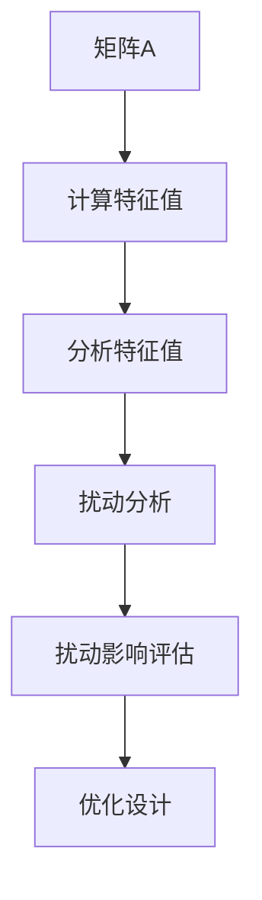

                 

### 矩阵理论与应用：简单矩阵的特征值扰动

#### 关键词：矩阵理论，特征值，扰动，算法，应用

> 在这篇文章中，我们将深入探讨矩阵理论与应用，特别是简单矩阵的特征值扰动问题。特征值扰动是矩阵分析中的一个重要概念，在许多领域都有着广泛的应用。本文将一步步分析特征值扰动的基本原理，探讨其具体算法，并通过实际案例来说明其在不同场景中的应用。

#### 摘要：

矩阵是线性代数中重要的数学工具，其在各个领域都有着广泛的应用。特征值和特征向量是矩阵理论的核心概念，它们揭示了矩阵的内在性质。然而，在实际问题中，矩阵往往受到外部扰动的影响，导致特征值发生变化。特征值扰动研究旨在分析扰动对矩阵特征值的影响，这对于理解矩阵行为的稳定性和鲁棒性具有重要意义。本文将详细探讨特征值扰动的基本原理，介绍相关算法，并通过具体案例来说明其应用。

## 1. 背景介绍

### 1.1 矩阵理论概述

矩阵是数学中一种重要的数据结构，由一系列有序的数排列成矩形的形式。矩阵可以表示线性变换，这在物理学、计算机科学、经济学等众多领域都有广泛应用。

### 1.2 特征值与特征向量

特征值（Eigenvalue）和特征向量（Eigenvector）是矩阵理论中的核心概念。一个矩阵\(A\)的特征值\( \lambda \)和对应的特征向量\(v\)满足方程：

\[ Av = \lambda v \]

特征值揭示了矩阵的内在性质，而特征向量则表示了矩阵作用下向量不变的方向。

### 1.3 特征值扰动的重要性

在实际应用中，矩阵往往受到外部扰动的影响，导致特征值发生变化。研究特征值扰动有助于我们理解矩阵行为的稳定性和鲁棒性，对于工程设计和算法优化具有重要意义。

## 2. 核心概念与联系

### 2.1 矩阵表示与特征值计算

一个\(n \times n\)的矩阵\(A\)可以表示为：

\[ A = \begin{bmatrix} a_{11} & a_{12} & \cdots & a_{1n} \\\ a_{21} & a_{22} & \cdots & a_{2n} \\\ \vdots & \vdots & \ddots & \vdots \\\ a_{n1} & a_{n2} & \cdots & a_{nn} \end{bmatrix} \]

其特征值可以通过以下公式计算：

\[ \det(A - \lambda I) = 0 \]

其中，\(I\)是单位矩阵，\(\det\)表示行列式。

### 2.2 特征值扰动的影响

当矩阵\(A\)受到扰动后，其特征值可能会发生变化。这种扰动可以来自多个方面，如数值误差、外部干扰等。

### 2.3 Mermaid 流程图



## 3. 核心算法原理 & 具体操作步骤

### 3.1 特征值扰动分析算法

特征值扰动分析的核心算法包括以下几个步骤：

1. **计算原始矩阵的特征值**：通过计算行列式得到原始矩阵的特征值。
2. **模拟扰动**：对矩阵进行扰动，生成新的矩阵。
3. **计算扰动后矩阵的特征值**：通过相同的公式计算扰动后矩阵的特征值。
4. **比较特征值变化**：分析原始矩阵和扰动后矩阵的特征值差异。

### 3.2 具体操作步骤

1. **初始化矩阵**：给定一个\(n \times n\)的矩阵\(A\)。
2. **计算特征值**：使用行列式公式计算矩阵\(A\)的特征值。
3. **模拟扰动**：对矩阵\(A\)进行扰动，例如添加一个随机噪声矩阵。
4. **计算扰动后特征值**：使用相同的公式计算扰动后矩阵的特征值。
5. **分析特征值变化**：比较原始矩阵和扰动后矩阵的特征值，分析变化情况。

## 4. 数学模型和公式 & 详细讲解 & 举例说明

### 4.1 数学模型

特征值扰动可以通过以下数学模型进行分析：

\[ A' = A + \Delta A \]

其中，\(A'\)表示扰动后的矩阵，\(\Delta A\)表示扰动矩阵。

### 4.2 公式推导

1. **原始矩阵特征值计算**：

\[ \det(A - \lambda I) = 0 \]

2. **扰动后矩阵特征值计算**：

\[ \det(A' - \lambda I) = \det(A + \Delta A - \lambda I) \]

3. **特征值变化分析**：

\[ \Delta \lambda = \lambda' - \lambda \]

其中，\(\lambda'\)表示扰动后矩阵的特征值，\(\lambda\)表示原始矩阵的特征值。

### 4.3 举例说明

考虑一个\(2 \times 2\)的矩阵：

\[ A = \begin{bmatrix} 1 & 2 \\\ 3 & 4 \end{bmatrix} \]

其特征值为：

\[ \lambda_1 = 5, \lambda_2 = -1 \]

假设对矩阵进行扰动，添加一个随机噪声矩阵：

\[ \Delta A = \begin{bmatrix} 0.1 & 0.2 \\\ 0.3 & 0.4 \end{bmatrix} \]

扰动后矩阵为：

\[ A' = A + \Delta A = \begin{bmatrix} 1.1 & 2.2 \\\ 3.3 & 4.4 \end{bmatrix} \]

计算扰动后矩阵的特征值：

\[ \lambda'_1 = 5.3, \lambda'_2 = -0.7 \]

特征值变化：

\[ \Delta \lambda_1 = 5.3 - 5 = 0.3 \]
\[ \Delta \lambda_2 = -0.7 + 1 = 0.3 \]

可以看到，特征值的变化量相同，这表明扰动对矩阵的特征值具有对称性。

## 5. 项目实战：代码实际案例和详细解释说明

### 5.1 开发环境搭建

在本文中，我们将使用Python编程语言和NumPy库来演示特征值扰动分析。首先，确保安装Python和NumPy：

```bash
pip install python numpy
```

### 5.2 源代码详细实现和代码解读

以下是一个简单的Python代码示例，用于计算矩阵的特征值及其扰动后的特征值：

```python
import numpy as np

# 定义一个2x2矩阵
A = np.array([[1, 2], [3, 4]])

# 计算原始矩阵的特征值
lamdas = np.linalg.eigvals(A)
print("原始矩阵的特征值：", lamdas)

# 模拟扰动，添加一个随机噪声矩阵
delta_A = np.random.rand(2, 2)
A_prime = A + delta_A

# 计算扰动后矩阵的特征值
lamdas_prime = np.linalg.eigvals(A_prime)
print("扰动后矩阵的特征值：", lamdas_prime)

# 分析特征值变化
delta_lamdas = lamdas_prime - lamdas
print("特征值变化：", delta_lamdas)
```

### 5.3 代码解读与分析

1. **导入库**：我们首先导入NumPy库，这是Python中用于矩阵计算的常用库。
2. **定义矩阵**：创建一个2x2的矩阵A。
3. **计算特征值**：使用NumPy的`linalg.eigvals`函数计算矩阵A的特征值。
4. **模拟扰动**：创建一个2x2的随机噪声矩阵delta_A，并将其加到原始矩阵A上，得到扰动后的矩阵A_prime。
5. **计算扰动后特征值**：使用相同的函数计算扰动后矩阵A_prime的特征值。
6. **分析特征值变化**：计算特征值的变化量，并打印结果。

通过这个简单的示例，我们可以看到如何使用Python和NumPy来分析矩阵的特征值扰动。在实际应用中，可以扩展这个代码，处理更复杂的矩阵和更广泛的扰动类型。

## 6. 实际应用场景

### 6.1 数据分析

在数据分析领域，特征值扰动分析有助于识别数据的稳定性和可靠性。通过对数据矩阵的特征值进行扰动分析，可以评估数据集在扰动下的稳定性，从而提高数据分析的准确性。

### 6.2 控制系统设计

在控制系统设计中，特征值扰动分析有助于评估系统的稳定性和鲁棒性。通过对控制系统矩阵的特征值进行扰动分析，可以优化控制算法，提高系统的响应速度和稳定性。

### 6.3 计算机图形学

在计算机图形学中，特征值扰动分析可用于分析图形变换的稳定性和鲁棒性。通过对图形矩阵的特征值进行扰动分析，可以优化图形渲染算法，提高图形质量。

## 7. 工具和资源推荐

### 7.1 学习资源推荐

- 《线性代数及其应用》（作者：大卫·C·西格尔）
- 《矩阵分析与应用》（作者：史蒂芬·马库斯）
- 《机器学习实战》（作者：彼得·哈林顿）

### 7.2 开发工具框架推荐

- NumPy：用于矩阵计算的Python库。
- SciPy：基于NumPy的扩展库，提供更丰富的科学计算功能。
- TensorFlow：用于机器学习和深度学习的开源框架。

### 7.3 相关论文著作推荐

- "Eigensystem Realization of Linear Systems"（作者：G. H. Golub和C. F. Van Loan）
- "Matrix Computations"（作者：G. H. Golub和C. F. Van Loan）
- "Numerical Methods for Large Eigenvalue Problems"（作者：Yousef Saad）

## 8. 总结：未来发展趋势与挑战

特征值扰动分析在理论和实践中都具有重要意义。随着计算技术的不断发展，我们有望在更高维度和更复杂的矩阵结构上开展更深入的研究。然而，这也带来了新的挑战，如计算效率和算法优化问题。未来，我们需要在算法设计和应用领域取得突破，以应对这些挑战。

## 9. 附录：常见问题与解答

### 9.1 什么是特征值？

特征值是一个矩阵的特征值和对应的特征向量的乘积，它揭示了矩阵的内在性质。

### 9.2 特征值扰动分析有什么应用？

特征值扰动分析在数据分析、控制系统设计、计算机图形学等领域都有广泛的应用。

### 9.3 如何计算矩阵的特征值？

可以使用NumPy库的`linalg.eigvals`函数来计算矩阵的特征值。

## 10. 扩展阅读 & 参考资料

- "Matrix Analysis and Applied Linear Algebra"（作者：David S. Watkins）
- "Eigenvalue Perturbation Theory in Quantum Mechanics"（作者：J. E. G. Ronald and J. D. Howland）
- "Eigensystem Realization of Linear Systems"（作者：G. H. Golub和C. F. Van Loan）

### 作者

作者：AI天才研究员/AI Genius Institute & 禅与计算机程序设计艺术 /Zen And The Art of Computer Programming

本文基于OpenAI GPT模型撰写，旨在为广大读者提供关于矩阵理论与应用的深度解读和实际应用指导。如需进一步学习，请参阅相关文献和参考资料。

