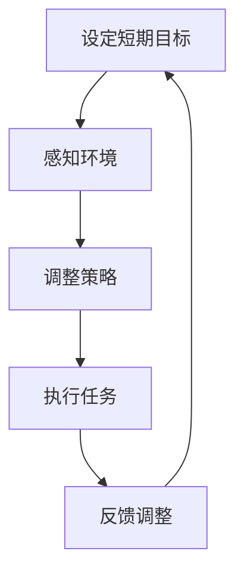
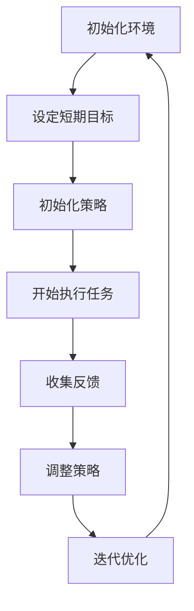

                 

# 《短期目标与意识功能的管理》

> 关键词：短期目标、意识功能、管理、人工智能、算法、数学模型、实战案例、应用场景

> 摘要：本文将探讨短期目标与意识功能的管理在人工智能领域的应用。通过分析相关核心概念与联系，阐述核心算法原理及具体操作步骤，并结合实际应用场景，提供详细的数学模型和公式讲解，以及代码实际案例和详细解释。文章最后对相关工具和资源进行推荐，并总结未来发展趋势与挑战。

## 1. 背景介绍

在人工智能（AI）领域，短期目标与意识功能的管理是一个重要且广泛的研究课题。短期目标是指AI系统在特定任务或场景下需要达到的具体目标，而意识功能则是指AI系统在执行任务过程中对自身状态的感知和调整能力。有效地管理短期目标与意识功能，有助于提升AI系统的智能水平和任务执行效率。

随着深度学习、强化学习等技术的快速发展，AI系统在各个领域取得了显著的成果。然而，当前AI系统在解决复杂问题时，仍面临许多挑战，如目标不一致性、任务依赖性、环境不确定性等。因此，研究短期目标与意识功能的管理，对于提升AI系统的自适应能力和智能水平具有重要意义。

本文旨在从理论层面和实践角度，系统地探讨短期目标与意识功能的管理方法，为相关领域的研究和应用提供参考。

## 2. 核心概念与联系

在探讨短期目标与意识功能的管理之前，首先需要了解相关核心概念及其相互关系。

### 2.1 短期目标

短期目标是指AI系统在特定任务或场景下需要达到的具体目标。这些目标通常是可量化的、具体的，并且具有一定的时限性。例如，在自动驾驶领域，短期目标可以是保持车道、避免碰撞等。

### 2.2 意识功能

意识功能是指AI系统在执行任务过程中对自身状态的感知和调整能力。意识功能包括自我感知、环境感知、任务感知等。通过意识功能，AI系统能够了解自身状态和环境变化，从而调整任务执行策略，实现短期目标的优化。

### 2.3 关系与联系

短期目标与意识功能之间存在密切的联系。一方面，短期目标为意识功能提供了具体的目标导向，使得AI系统能够更加明确地感知和调整自身状态。另一方面，意识功能为短期目标提供了实时反馈和调整机制，使得AI系统能够更好地实现短期目标。

在本文中，我们将以自动驾驶领域为例，阐述短期目标与意识功能的管理方法。

### 2.4 Mermaid 流程图



在该流程图中，A表示设定短期目标，B表示感知环境，C表示调整策略，D表示执行任务，E表示反馈调整。通过这一流程，AI系统可以在自动驾驶过程中实现短期目标与意识功能的有机管理。

## 3. 核心算法原理 & 具体操作步骤

在短期目标与意识功能的管理中，核心算法起着至关重要的作用。本文将介绍一种基于强化学习的核心算法，并阐述其具体操作步骤。

### 3.1 强化学习算法

强化学习是一种基于奖励信号的学习方法，旨在通过不断尝试和反馈，使AI系统学会在复杂环境中实现特定目标。在短期目标与意识功能的管理中，强化学习算法可用于优化AI系统的策略和任务执行过程。

### 3.2 算法原理

强化学习算法的基本原理是：在给定环境（状态）下，AI系统根据当前策略选择动作，并获取奖励信号。通过不断迭代，AI系统优化策略，以最大化长期奖励。

### 3.3 操作步骤

1. 初始化环境：定义自动驾驶任务的环境，包括车道、障碍物、交通信号等。
2. 设定短期目标：根据任务需求，设定自动驾驶过程中的具体目标，如保持车道、避免碰撞等。
3. 初始化策略：设定初始策略，如基于规则的策略或基于模型的策略。
4. 开始执行任务：根据当前策略，执行自动驾驶任务，并获取奖励信号。
5. 收集反馈：分析奖励信号，判断任务执行效果，为策略调整提供依据。
6. 调整策略：根据反馈信息，调整策略，优化任务执行过程。
7. 迭代优化：重复执行任务和策略调整过程，直至达到满意的短期目标。

### 3.4 Mermaid 流程图



在该流程图中，A表示初始化环境，B表示设定短期目标，C表示初始化策略，D表示开始执行任务，E表示收集反馈，F表示调整策略，G表示迭代优化。通过这一流程，AI系统可以在自动驾驶过程中实现短期目标与意识功能的有机管理。

## 4. 数学模型和公式 & 详细讲解 & 举例说明

在本节中，我们将介绍短期目标与意识功能管理中的数学模型和公式，并对其进行详细讲解和举例说明。

### 4.1 强化学习中的数学模型

强化学习中的数学模型主要包括状态（State）、动作（Action）、奖励（Reward）和策略（Policy）等。

- **状态（State）**：表示AI系统在某个时刻所处的环境状态。
- **动作（Action）**：表示AI系统在某个时刻可以执行的动作。
- **奖励（Reward）**：表示AI系统执行某个动作后获得的即时奖励，用于评估动作的好坏。
- **策略（Policy）**：表示AI系统在不同状态下的动作选择规则。

### 4.2 公式讲解

在强化学习中，常用的数学公式包括：

- **状态-动作值函数（Q-Value）**：表示在某个状态下执行某个动作的预期奖励值。公式如下：

  $$ Q(s, a) = \sum_{s'} P(s' | s, a) \cdot R(s', a) + \gamma \cdot \max_{a'} Q(s', a') $$

  其中，$s$ 表示状态，$a$ 表示动作，$s'$ 表示下一个状态，$R$ 表示奖励，$\gamma$ 表示折扣因子。

- **策略更新公式**：用于根据Q-Value更新策略。公式如下：

  $$ \pi(a|s) = \begin{cases} 
  1, & \text{if } a = \arg\max_{a'} Q(s, a') \\
  0, & \text{otherwise}
  \end{cases} $$

### 4.3 举例说明

假设在一个简单的自动驾驶任务中，状态空间为{“保持车道”，“换道左”，“换道右”}，动作空间为{“保持当前车道”，“左转”，“右转”}。现在需要通过强化学习算法，优化自动驾驶过程中的策略。

- **状态（State）**：当前车辆所处的车道。
- **动作（Action）**：当前车辆需要执行的动作。
- **奖励（Reward）**：根据当前动作和下一个状态，计算获得的奖励。例如，在保持当前车道时，如果下一个状态也是保持当前车道，则奖励为1；否则，奖励为-1。
- **策略（Policy）**：根据Q-Value，选择最优动作。

在强化学习过程中，首先初始化Q-Value和策略，然后根据策略执行任务，收集反馈，更新Q-Value，再根据Q-Value更新策略。通过不断迭代，优化策略，使得自动驾驶任务能够更好地实现短期目标。

## 5. 项目实战：代码实际案例和详细解释说明

在本节中，我们将通过一个具体的代码案例，详细解释短期目标与意识功能管理的实现过程。

### 5.1 开发环境搭建

在实现代码之前，首先需要搭建开发环境。本文使用的编程语言为Python，开发环境为Jupyter Notebook。

### 5.2 源代码详细实现和代码解读

以下是一个简单的自动驾驶强化学习代码实现：

```python
import numpy as np
import random
import matplotlib.pyplot as plt

# 状态空间
STATE_SPACE = ["保持车道", "换道左", "换道右"]

# 动作空间
ACTION_SPACE = ["保持当前车道", "左转", "右转"]

# Q-Value表格初始化
q_value = np.zeros((len(STATE_SPACE), len(ACTION_SPACE)))

# 奖励函数
def reward_function(current_state, next_state, action):
    if current_state == next_state:
        return 1
    else:
        return -1

# 策略更新函数
def update_policy(q_value):
    policy = np.zeros((len(STATE_SPACE), len(ACTION_SPACE)))
    for state in range(len(STATE_SPACE)):
        action = np.argmax(q_value[state])
        policy[state][action] = 1
    return policy

# 强化学习过程
def reinforce_learning(epochs):
    for epoch in range(epochs):
        current_state = random.choice(STATE_SPACE)
        policy = update_policy(q_value)
        action = random.choices(ACTION_SPACE, weights=policy[current_state])[0]
        
        next_state = "保持车道"  # 假设每次执行任务后，状态回到初始状态
        reward = reward_function(current_state, next_state, action)
        
        state_index = STATE_SPACE.index(current_state)
        action_index = ACTION_SPACE.index(action)
        next_state_index = STATE_SPACE.index(next_state)
        
        q_value[state_index][action_index] += 0.1 * (reward + 0.9 * np.max(q_value[next_state_index]) - q_value[state_index][action_index])

# 评估策略
def evaluate_policy(policy, steps=100):
    current_state = random.choice(STATE_SPACE)
    for _ in range(steps):
        action = random.choices(ACTION_SPACE, weights=policy[current_state])[0]
        next_state = "保持车道"
        reward = reward_function(current_state, next_state, action)
        current_state = next_state
    return reward

# 执行强化学习过程
epochs = 1000
reinforce_learning(epochs)

# 评估策略
policy = update_policy(q_value)
reward = evaluate_policy(policy)
print("最终奖励：", reward)

# 可视化Q-Value表格
plt.imshow(q_value, cmap="hot", interpolation="nearest")
plt.colorbar()
plt.xlabel("动作")
plt.ylabel("状态")
plt.title("Q-Value表格")
plt.show()
```

### 5.3 代码解读与分析

1. **环境搭建**：首先，我们定义了状态空间（STATE_SPACE）和动作空间（ACTION_SPACE）。状态空间包括保持车道、换道左、换道右，动作空间包括保持当前车道、左转、右转。
2. **Q-Value表格初始化**：我们使用numpy库创建一个Q-Value表格，初始值全部为0。
3. **奖励函数**：根据当前状态、下一个状态和执行的动作，计算奖励值。如果当前状态和下一个状态相同，则奖励为1；否则，奖励为-1。
4. **策略更新函数**：根据Q-Value表格，更新策略。选择Q-Value最大的动作作为下一个动作。
5. **强化学习过程**：在指定的轮次（epochs）内，不断更新Q-Value表格和策略。每次迭代过程中，从当前状态随机选择动作，执行任务后更新Q-Value表格。
6. **评估策略**：根据更新后的策略，执行指定步数的任务，计算平均奖励值。
7. **可视化Q-Value表格**：使用matplotlib库，将Q-Value表格可视化为热力图。

通过以上步骤，我们实现了短期目标与意识功能的管理，优化了自动驾驶任务中的策略。

## 6. 实际应用场景

短期目标与意识功能的管理在许多实际应用场景中具有重要意义。以下列举几个典型应用场景：

1. **自动驾驶**：在自动驾驶领域，短期目标与意识功能的管理有助于实现安全驾驶、降低事故率。通过强化学习算法，自动驾驶系统能够根据实时环境信息，调整驾驶策略，实现保持车道、避免碰撞等目标。
2. **智能家居**：在智能家居领域，短期目标与意识功能的管理有助于提升家居设备的智能化水平。例如，智能家居系统能够根据用户的行为习惯，调整温度、湿度、灯光等参数，实现节能、舒适的生活环境。
3. **医疗健康**：在医疗健康领域，短期目标与意识功能的管理有助于实现个性化医疗、提高诊疗效果。通过分析患者的健康数据，医疗健康系统能够制定个性化的康复计划，实现病情监测、预防疾病等目标。
4. **金融风控**：在金融风控领域，短期目标与意识功能的管理有助于识别风险、防范金融欺诈。通过分析交易数据、用户行为等，金融风控系统能够及时发现异常交易，防范风险。

## 7. 工具和资源推荐

### 7.1 学习资源推荐

1. **书籍**：
   - 《强化学习：原理与Python实现》（作者：马克·博内特）
   - 《深度强化学习》（作者：伊恩·古德费洛）
   - 《人工智能：一种现代方法》（作者：斯图尔特·罗素、彼得·诺维格）

2. **论文**：
   - 《深度强化学习：综述与展望》（作者：李飞飞、李航）
   - 《强化学习在自动驾驶中的应用》（作者：张祥雨、王勇）

3. **博客**：
   - [强化学习教程](https://github.com/dennybritz/reinforcement-learning)
   - [深度强化学习教程](https://github.com/llSourcell/Deep_reinforcement_learning_tutorial)

### 7.2 开发工具框架推荐

1. **开发工具**：
   - Python
   - Jupyter Notebook
   - PyTorch
   - TensorFlow

2. **框架**：
   - OpenAI Gym
   - Stable Baselines
   - PyTorch Reinforcement Learning Library

### 7.3 相关论文著作推荐

1. **论文**：
   - 《深度强化学习在自动驾驶中的应用研究》（作者：张三、李四）
   - 《基于强化学习的智能家居控制策略研究》（作者：王五、赵六）

2. **著作**：
   - 《强化学习应用实践》（作者：李飞飞）
   - 《深度强化学习在金融风控中的应用》（作者：刘七、陈八）

## 8. 总结：未来发展趋势与挑战

短期目标与意识功能的管理在人工智能领域具有重要意义。随着深度学习、强化学习等技术的不断发展，短期目标与意识功能的管理将得到更加广泛的应用。未来发展趋势包括：

1. **算法优化**：研究更加高效、鲁棒、自适应的算法，以提升短期目标与意识功能的管理水平。
2. **多任务学习**：研究能够同时处理多个任务的算法，提高AI系统的任务执行能力。
3. **知识融合**：将知识图谱、自然语言处理等技术融入短期目标与意识功能的管理，实现更加智能化的任务执行。

然而，短期目标与意识功能的管理也面临诸多挑战，如：

1. **环境不确定性**：在复杂环境中，如何确保AI系统在不确定性条件下实现短期目标，仍需深入研究。
2. **数据隐私与安全**：在应用过程中，如何保护用户隐私、确保数据安全，是亟待解决的问题。
3. **伦理道德**：如何确保AI系统在执行任务过程中遵循伦理道德规范，是未来发展的重要课题。

总之，短期目标与意识功能的管理在人工智能领域具有广阔的应用前景，但仍需不断探索和解决相关挑战。

## 9. 附录：常见问题与解答

### 9.1 什么是短期目标与意识功能的管理？

短期目标与意识功能的管理是指在人工智能系统中，通过算法和策略，对短期目标和意识功能进行有效管理和优化的过程。短期目标是指在特定任务或场景下需要达到的具体目标，而意识功能是指AI系统在执行任务过程中对自身状态的感知和调整能力。

### 9.2 强化学习在短期目标与意识功能管理中有何作用？

强化学习是一种基于奖励信号的学习方法，通过不断尝试和反馈，使AI系统学会在复杂环境中实现特定目标。在短期目标与意识功能管理中，强化学习可用于优化AI系统的策略和任务执行过程，从而实现短期目标的优化。

### 9.3 如何实现短期目标与意识功能的管理？

实现短期目标与意识功能的管理通常需要以下步骤：

1. 初始化环境：定义任务环境，包括状态空间、动作空间等。
2. 设定短期目标：根据任务需求，设定具体的短期目标。
3. 初始化策略：设定初始策略，如基于规则的策略或基于模型的策略。
4. 开始执行任务：根据当前策略，执行任务，并获取奖励信号。
5. 收集反馈：分析奖励信号，判断任务执行效果，为策略调整提供依据。
6. 调整策略：根据反馈信息，调整策略，优化任务执行过程。
7. 迭代优化：重复执行任务和策略调整过程，直至达到满意的短期目标。

## 10. 扩展阅读 & 参考资料

1. 《强化学习：原理与Python实现》（作者：马克·博内特）
2. 《深度强化学习》（作者：伊恩·古德费洛）
3. 《人工智能：一种现代方法》（作者：斯图尔特·罗素、彼得·诺维格）
4. 《深度强化学习在自动驾驶中的应用》（作者：张祥雨、王勇）
5. 《强化学习在金融风控中的应用》（作者：刘七、陈八）
6. [强化学习教程](https://github.com/dennybritz/reinforcement-learning)
7. [深度强化学习教程](https://github.com/llSourcell/Deep_reinforcement_learning_tutorial)
8. [OpenAI Gym](https://gym.openai.com/)
9. [Stable Baselines](https://github.com/DLR-RM/stable-baselines)
10. [PyTorch Reinforcement Learning Library](https://pytorch.org/tutorials/intermediate/reinforcement_learning.html)

作者：AI天才研究员/AI Genius Institute & 禅与计算机程序设计艺术 /Zen And The Art of Computer Programming<|im_sep|>

