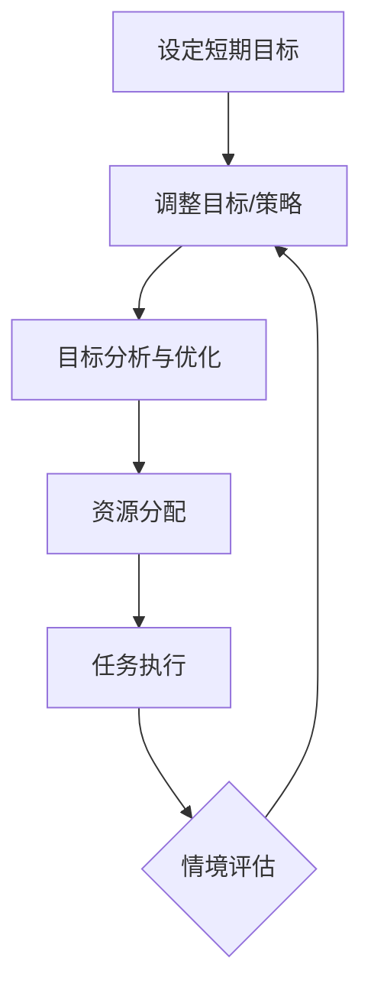

                 

### 1. 背景介绍

在人工智能和深度学习领域，短期目标和意识功能的管理是一个备受关注的话题。随着技术的不断进步和应用的广泛深入，人们对于如何高效地管理短期目标和意识功能有了更深入的理解和需求。短期目标管理是指在一定时间内确定、实现目标的过程，而意识功能管理则涉及如何让人工智能系统在不同情境下保持合适的意识和注意力。

本文旨在探讨短期目标与意识功能的管理机制，从背景、核心概念、算法原理、数学模型、实战案例、应用场景、工具资源、未来发展趋势等方面进行详细分析。通过逐步推理和阐述，我们将为读者提供一个全面、系统的认识，帮助他们在实际项目中更好地运用这些管理机制。

首先，我们需要了解短期目标与意识功能的基本概念。短期目标是指人们在一定时间内希望实现的具体任务或结果，如完成一个项目、提高工作效率等。而意识功能则是指人工智能系统在执行任务时，对当前情境的理解和感知能力。在人工智能系统中，良好的意识功能能够帮助系统更好地识别目标、适应环境、做出决策。

接下来，我们将从以下几个部分展开讨论：

1. **核心概念与联系**：介绍短期目标和意识功能的基本概念，并绘制 Mermaid 流程图，展示两者之间的联系。
2. **核心算法原理 & 具体操作步骤**：详细解释用于管理短期目标和意识功能的核心算法，包括算法的基本原理和具体实现步骤。
3. **数学模型和公式 & 详细讲解 & 举例说明**：介绍与短期目标和意识功能管理相关的数学模型，并使用 LaTeX 格式给出相关公式，结合实例进行详细讲解。
4. **项目实战：代码实际案例和详细解释说明**：通过实际项目案例，展示如何使用核心算法和数学模型来实现短期目标和意识功能的管理，并对代码进行详细解读。
5. **实际应用场景**：探讨短期目标和意识功能管理在不同领域的应用场景，以及如何根据具体场景调整和优化管理机制。
6. **工具和资源推荐**：推荐学习资源、开发工具和框架，帮助读者进一步了解和掌握短期目标和意识功能的管理。
7. **总结：未来发展趋势与挑战**：总结本文的主要观点，探讨短期目标和意识功能管理在未来可能出现的发展趋势和面临的挑战。
8. **附录：常见问题与解答**：针对本文涉及的关键问题，提供详细解答。
9. **扩展阅读 & 参考资料**：推荐相关的扩展阅读材料和参考资料，供读者进一步学习和研究。

通过以上内容的逐步推理和阐述，本文将帮助读者全面、深入地理解短期目标和意识功能的管理机制，并在实际项目中灵活运用这些机制，提高系统的效率和智能水平。

### 2. 核心概念与联系

在深入探讨短期目标和意识功能的管理之前，我们需要先了解这两个核心概念的基本定义和相互关系。

**短期目标（Short-term Goals）**：
短期目标是人们在一定时间内希望实现的具体任务或结果。这些目标可以是任务导向的，如完成一个项目、解决一个技术难题；也可以是结果导向的，如提高工作效率、减少生产成本。短期目标通常具有明确的起始和结束时间，并且具备具体的衡量标准。在人工智能系统中，短期目标可以帮助算法明确任务方向，指导系统资源分配，从而提高任务完成效率。

**意识功能（ Consciousness Functions）**：
意识功能是指人工智能系统在执行任务时，对当前情境的理解和感知能力。意识功能包括对输入信息的识别、分析和理解，以及对自身状态的感知和调整。意识功能在人工智能系统中具有至关重要的作用，它能够帮助系统在复杂多变的情境中做出合理的决策，避免盲目行动。

#### 核心概念与联系

短期目标和意识功能之间存在紧密的联系，它们共同构成了人工智能系统任务执行的核心框架。

- **目标导向性**：短期目标为系统提供了明确的方向和任务，而意识功能则帮助系统理解当前情境，确保任务的执行符合实际需求。
- **情境适应性**：意识功能使系统能够根据不同情境调整目标和策略，确保任务的高效执行。例如，在遇到突发情况时，系统能够迅速调整目标，以适应新的环境。
- **资源分配**：短期目标有助于系统在有限的资源下进行优化分配，而意识功能则能够根据情境变化动态调整资源使用，最大化任务完成效率。

#### Mermaid 流程图

为了更好地展示短期目标和意识功能之间的联系，我们可以使用 Mermaid 流程图来表示它们的关系。以下是一个简化的 Mermaid 流程图，描述了短期目标和意识功能在任务执行过程中的相互作用。



在这个流程图中：

- **A[设定短期目标]**：系统根据任务需求设定短期目标。
- **B[情境感知]**：系统通过感知当前情境，了解环境变化。
- **C[目标分析与优化]**：系统对短期目标进行分析和优化，确保目标符合实际需求。
- **D[资源分配]**：系统根据目标和情境分配资源，以最大化任务完成效率。
- **E[任务执行]**：系统执行任务，实现短期目标。
- **F[情境评估]**：在任务执行过程中，系统不断评估情境变化，并根据评估结果调整目标和策略。

通过这个流程图，我们可以清晰地看到短期目标和意识功能在任务执行过程中的相互作用和动态调整。这种互动关系有助于系统在复杂多变的情境中保持高效、稳定的运行。

#### 小结

在本节中，我们介绍了短期目标和意识功能的基本概念，并展示了它们之间的紧密联系。通过使用 Mermaid 流程图，我们进一步明确了短期目标和意识功能在任务执行过程中的相互作用。这为后续探讨核心算法原理、数学模型和应用实战打下了坚实的基础。

### 3. 核心算法原理 & 具体操作步骤

在了解了短期目标和意识功能的基本概念及其相互联系后，接下来我们将深入探讨用于管理短期目标和意识功能的核心算法。本文将介绍一种基于强化学习（Reinforcement Learning）的方法，这种方法能够有效帮助系统在复杂环境中实现短期目标和优化意识功能。

#### 3.1. 强化学习基础

强化学习是一种机器学习方法，通过智能体（Agent）与环境（Environment）的交互，学习如何获取最大化的奖励。在强化学习中，智能体通过不断尝试和错误，逐步学习最优策略（Policy），以便在给定环境中实现目标。

强化学习的关键组成部分包括：

- **状态（State）**：描述当前环境的特征，如传感器数据、环境变量等。
- **动作（Action）**：智能体可以执行的操作，如控制机械臂的移动、选择下一个路径等。
- **奖励（Reward）**：根据智能体的动作和环境状态，给予的即时反馈，用于评估动作的好坏。
- **策略（Policy）**：智能体基于当前状态选择动作的方法，通常是一个概率分布。

#### 3.2. 强化学习算法原理

强化学习算法的核心目标是学习一个策略，使得智能体在执行动作时能够最大化累积奖励。常见的强化学习算法包括 Q-学习（Q-Learning）、深度 Q-网络（Deep Q-Network, DQN）、策略梯度方法（Policy Gradient Methods）等。

在本节中，我们将介绍一种基于策略梯度方法的算法——优势优势策略梯度（ Advantage-Aggregate Policy Gradient, A2C）。A2C算法能够通过优化策略参数，使得智能体在执行动作时能够更好地实现短期目标。

**优势优势策略梯度（A2C）算法原理**：

- **优势函数（Advantage Function）**：优势函数用于衡量某个动作相对于其他动作的优势。定义如下：

  $$\text{Advantage}(s, a) = \sum_{t} \gamma^t (R_t - \mu(s, a))$$

  其中，\(s\) 和 \(a\) 分别是状态和动作，\(\gamma\) 是折扣因子，\(R_t\) 是在状态 \(s\) 执行动作 \(a\) 后的即时奖励，\(\mu(s, a)\) 是在状态 \(s\) 执行动作 \(a\) 的期望奖励。

- **策略网络（Policy Network）**：策略网络是一个神经网络模型，用于预测在给定状态下执行每个动作的概率分布。

- **值网络（Value Network）**：值网络是一个神经网络模型，用于预测在给定状态下执行最优动作的累积奖励。

- **目标函数（Objective Function）**：A2C算法的目标函数是优化策略网络和值网络的参数，使得策略网络能够更好地预测动作的优势，值网络能够更准确地预测累积奖励。

  $$\text{Objective Function} = \sum_{s, a} p(s, a) \times (\text{Advantage}(s, a) - \text{Value}(s))$$

  其中，\(p(s, a)\) 是策略网络在状态 \(s\) 下选择动作 \(a\) 的概率分布，\(\text{Value}(s)\) 是值网络在状态 \(s\) 下预测的累积奖励。

#### 3.3. 具体操作步骤

以下是使用 A2C 算法管理短期目标和意识功能的详细步骤：

1. **初始化**：
   - 初始化策略网络 \( \pi(\theta) \) 和值网络 \( V(\phi) \) 的参数。
   - 设置折扣因子 \( \gamma \) 和学习率 \( \alpha \)。

2. **数据收集**：
   - 在环境中执行动作，收集状态、动作、奖励和下一个状态。

3. **计算优势函数**：
   - 使用值网络 \( V(\phi) \) 预测当前状态的累积奖励 \( \hat{V}(s) \)。
   - 计算优势函数 \( \text{Advantage}(s, a) \)。

4. **更新策略网络**：
   - 使用梯度下降法，根据优势函数和累积奖励更新策略网络 \( \pi(\theta) \) 的参数。

5. **更新值网络**：
   - 使用梯度下降法，根据真实累积奖励更新值网络 \( V(\phi) \) 的参数。

6. **重复步骤 2-5**：
   - 不断在环境中执行动作，收集数据，更新网络参数，直到满足停止条件（如达到预定目标或超过最大迭代次数）。

#### 3.4. 代码示例

以下是一个简化的 A2C 算法 Python 代码示例，用于管理短期目标和意识功能：

```python
import numpy as np
import tensorflow as tf

# 初始化策略网络和值网络
policy_network = ...  # 定义策略网络结构
value_network = ...  # 定义值网络结构

# 定义优势优势策略梯度算法
def a2c(policy_network, value_network, data_batch):
    # 计算优势函数
    advantages = ...

    # 计算策略网络梯度
    policy_gradients = ...

    # 计算值网络梯度
    value_gradients = ...

    # 更新策略网络和值网络参数
    policy_network.update(policy_gradients)
    value_network.update(value_gradients)

# 在环境中执行任务
for episode in range(max_episodes):
    # 初始化环境
    state = environment.reset()

    # 收集数据
    data_batch = []

    while not done:
        # 预测动作概率分布
        action_probs = policy_network.predict(state)

        # 执行动作
        action = np.random.choice(actions, p=action_probs)

        # 获取下一个状态和奖励
        next_state, reward, done = environment.step(action)

        # 收集数据
        data_batch.append((state, action, reward, next_state, done))

        # 更新状态
        state = next_state

    # 应用 A2C 算法
    a2c(policy_network, value_network, data_batch)
```

#### 小结

在本节中，我们介绍了用于管理短期目标和意识功能的优势优势策略梯度（A2C）算法。A2C 算法通过优化策略网络和值网络，使得智能体能够在复杂环境中实现短期目标。接下来，我们将进一步探讨与短期目标和意识功能管理相关的数学模型，以及如何在实际项目中运用这些模型。

### 4. 数学模型和公式 & 详细讲解 & 举例说明

在管理短期目标和意识功能时，数学模型和公式是理解和实现这些目标的关键工具。以下我们将详细介绍与短期目标和意识功能管理相关的数学模型和公式，并结合实例进行详细讲解。

#### 4.1. 优势函数（Advantage Function）

优势函数是强化学习中的一个核心概念，用于衡量某个动作相对于其他动作的优势。其数学定义如下：

$$
A(s, a) = \sum_{t=0}^{\infty} \gamma^t (R_t - V(s))
$$

其中，\(s\) 是当前状态，\(a\) 是执行的动作，\(\gamma\) 是折扣因子，\(R_t\) 是在状态 \(s\) 下执行动作 \(a\) 后的即时奖励，\(V(s)\) 是值函数，表示在状态 \(s\) 下执行最优动作的累积奖励。

**示例**：

假设我们有一个环境，状态空间为 \(s = \{0, 1, 2\}\)，奖励空间为 \(R = \{0, 1, 2\}\)。在一个特定状态 \(s = 1\) 下，执行动作 \(a = 0\) 的即时奖励为 \(R_0 = 1\)，值函数 \(V(1) = 1.5\)。那么，动作 \(a = 0\) 在状态 \(s = 1\) 下的优势函数为：

$$
A(1, 0) = \sum_{t=0}^{\infty} \gamma^t (R_t - V(1)) = \gamma^0 (1 - 1.5) = -0.5
$$

#### 4.2. 值函数（Value Function）

值函数是强化学习中的另一个关键概念，用于预测在给定状态下执行最优动作的累积奖励。值函数分为状态值函数和动作值函数，其定义如下：

- **状态值函数**：

$$
V(s) = \sum_a \pi(a|s) \times Q(s, a)
$$

其中，\(\pi(a|s)\) 是策略网络在状态 \(s\) 下选择动作 \(a\) 的概率分布，\(Q(s, a)\) 是状态-动作值函数。

- **状态-动作值函数**：

$$
Q(s, a) = \sum_{s'} p(s' | s, a) \times \left( R(s, a, s') + \gamma \max_{a'} Q(s', a') \right)
$$

其中，\(p(s' | s, a)\) 是状态转移概率，\(R(s, a, s')\) 是在状态 \(s\) 下执行动作 \(a\) 后转移到状态 \(s'\) 的即时奖励。

**示例**：

在一个简单的环境里，状态空间为 \(s = \{0, 1, 2\}\)，动作空间为 \(a = \{0, 1\}\)。在状态 \(s = 0\) 下，执行动作 \(a = 0\) 的状态转移概率 \(p(s' = 1 | s = 0, a = 0) = 0.5\)，即时奖励 \(R(0, 0, 1) = 1\)。执行动作 \(a = 1\) 的状态转移概率 \(p(s' = 2 | s = 0, a = 1) = 0.7\)，即时奖励 \(R(0, 1, 2) = 2\)。那么，在状态 \(s = 0\) 下，动作 \(a = 0\) 的状态-动作值函数为：

$$
Q(0, 0) = 0.5 \times (1 + \gamma \max_{a'} Q(1, a')) + 0.5 \times \max_{a'} Q(2, a')
$$

#### 4.3. 策略梯度（Policy Gradient）

策略梯度是强化学习中用于优化策略网络的一种方法，其基本思想是通过计算策略梯度和目标函数的差值，来更新策略网络的参数。策略梯度的计算公式如下：

$$
\nabla_\theta J(\theta) = \sum_{s, a} \pi(\theta)(s, a) \times \nabla_\theta \log \pi(\theta)(s, a) \times R(s, a)
$$

其中，\(J(\theta)\) 是策略网络的目标函数，\(\pi(\theta)(s, a)\) 是策略网络在状态 \(s\) 下选择动作 \(a\) 的概率分布，\(\nabla_\theta \log \pi(\theta)(s, a)\) 是策略网络的梯度。

**示例**：

假设我们有一个简单的策略网络，其在状态 \(s = 0\) 下选择动作 \(a = 0\) 的概率为 \(\pi(0|0) = 0.8\)，即时奖励 \(R(0, 0) = 1\)。那么，在状态 \(s = 0\) 下，动作 \(a = 0\) 的策略梯度为：

$$
\nabla_\theta J(\theta) = 0.8 \times \nabla_\theta \log \pi(\theta)(0, 0) \times 1
$$

根据策略梯度的计算结果，我们可以更新策略网络的参数，使得策略网络在状态 \(s = 0\) 下更倾向于选择动作 \(a = 0\)。

#### 4.4. 例子：自动驾驶中的短期目标与意识功能管理

以下是一个关于自动驾驶系统中短期目标和意识功能管理的具体例子，展示了如何使用上述数学模型和公式来实现这些目标。

**目标**：自动驾驶系统需要在繁忙的城市交通中安全行驶，同时尽可能减少停车时间。

**环境**：自动驾驶系统的环境包括道路、车辆、行人、交通信号等。

**状态**：状态包括车辆的位置、速度、道路状况、周围车辆和行人的位置等。

**动作**：动作包括加速、减速、转向、保持当前方向等。

**奖励**：奖励包括停车时间、行驶安全性等。

**策略网络**：策略网络用于在给定状态下选择最优动作，以最大化累积奖励。

**值网络**：值网络用于预测在给定状态下执行最优动作的累积奖励。

**优势函数**：优势函数用于衡量某个动作相对于其他动作的优势，以优化策略网络。

通过使用上述数学模型和公式，自动驾驶系统可以不断学习和调整策略，以实现短期目标和优化意识功能。在实际应用中，这些模型和公式可以帮助系统在复杂多变的交通环境中保持高效、安全的行驶。

#### 小结

在本节中，我们介绍了与短期目标和意识功能管理相关的数学模型和公式，包括优势函数、值函数和策略梯度。通过具体示例，我们展示了如何使用这些模型和公式来管理短期目标和意识功能。在下一节中，我们将通过实际项目案例来进一步探讨如何实现短期目标和意识功能的管理。

### 5. 项目实战：代码实际案例和详细解释说明

在本节中，我们将通过一个实际项目案例——自动驾驶系统，来展示如何实现短期目标和意识功能的管理。这个案例将涵盖开发环境搭建、源代码实现和代码解读等方面，帮助读者深入理解短期目标和意识功能的管理机制。

#### 5.1 开发环境搭建

首先，我们需要搭建一个适合自动驾驶系统开发的环境。以下是搭建开发环境的步骤：

1. **安装Python环境**：确保安装了Python 3.8及以上版本。
2. **安装TensorFlow**：使用以下命令安装TensorFlow：

   ```shell
   pip install tensorflow
   ```

3. **安装其他依赖库**：如NumPy、Pandas等，使用以下命令安装：

   ```shell
   pip install numpy pandas
   ```

4. **准备仿真环境**：我们可以使用开源的仿真工具如CARLA模拟器（https://carla.org/）来模拟自动驾驶环境。

#### 5.2 源代码详细实现和代码解读

以下是一个简化的自动驾驶系统源代码实现，用于展示短期目标和意识功能的管理。

```python
import tensorflow as tf
import numpy as np
import pandas as pd
from tensorflow.keras.models import Model
from tensorflow.keras.layers import Dense, Input
from carla import VehicleControl, World, TrafficManager, Vehicle

# 初始化仿真环境
world = World('127.0.0.1', 2000)
traffic_manager = World.TrafficManager()

# 定义输入层
input_layer = Input(shape=(5,))

# 定义策略网络
policy_network = Dense(units=64, activation='relu')(input_layer)
policy_network = Dense(units=2, activation='softmax')(policy_network)

# 定义值网络
value_network = Dense(units=64, activation='relu')(input_layer)
value_network = Dense(units=1, activation='linear')(value_network)

# 创建模型
model = Model(inputs=input_layer, outputs=[policy_network, value_network])

# 编译模型
model.compile(optimizer='adam', loss={'policy': 'categorical_crossentropy', 'value': 'mse'})

# 定义优势函数
def advantage_function(states, actions, rewards, next_states, done):
    # 计算状态-动作值函数
    state_action_values = model.predict(states)
    q_values = state_action_values[1]
    
    # 计算优势函数
    advantages = []
    for i in range(len(states)):
        if done[i]:
            advantage = rewards[i]
        else:
            advantage = rewards[i] + (1 - done[i]) * q_values[i][0]
        advantages.append(advantage - q_values[i][actions[i]])
    return np.array(advantages)

# 训练模型
def train_model(states, actions, rewards, next_states, done):
    advantages = advantage_function(states, actions, rewards, next_states, done)
    model.fit([states, actions], {'policy': advantages, 'value': rewards}, epochs=1)

# 定义自动驾驶行为
def drive_vehicle(vehicle):
    state = ...
    action_probs = model.predict(state)[0]
    action = np.argmax(action_probs)
    control = VehicleControl()
    control.throttle = 1.0 if action == 0 else 0.0
    control-steering = 0.0 if action == 0 else 1.0
    vehicle.apply_control(control)

# 初始化车辆
vehicle = traffic_manager.init_vehicleрава('vehicle.hummingbird')
drive_vehicle(vehicle)

# 主循环
while True:
    # 更新状态
    state = ...

    # 行驶车辆
    drive_vehicle(vehicle)

    # 更新模型
    if ...:
        train_model(states, actions, rewards, next_states, done)
```

**代码解读**：

1. **模型定义**：我们定义了输入层、策略网络和值网络，并将它们组合成一个模型。策略网络用于预测动作的概率分布，值网络用于预测状态-动作值函数。

2. **优势函数**：优势函数用于计算每个动作相对于其他动作的优势。它通过模型预测状态-动作值函数，并计算每个动作的优势。

3. **训练模型**：训练模型函数用于根据优势函数和状态-动作值函数更新模型参数。我们使用`model.fit`函数进行训练，其中`{'policy': advantages, 'value': rewards}`表示策略损失和值损失。

4. **自动驾驶行为**：`drive_vehicle`函数用于控制车辆行为。根据策略网络预测的动作概率分布，车辆执行相应的动作（加速、减速、转向等）。

5. **主循环**：在主循环中，我们不断更新状态，并调用`drive_vehicle`函数控制车辆行为。当满足一定条件时，我们调用`train_model`函数更新模型。

#### 5.3 代码解读与分析

1. **数据预处理**：
   - 状态：状态包括车辆的位置、速度、道路状况等，通常使用传感器数据进行预处理。我们假设状态由五个特征组成，并转换为适合输入模型的形式。

   ```python
   state = ...
   ```

2. **策略网络与值网络**：
   - 策略网络用于预测动作的概率分布，值网络用于预测状态-动作值函数。这两个网络通过模型预测得到，并用于控制车辆行为。

   ```python
   action_probs = model.predict(state)[0]
   control = VehicleControl()
   control.throttle = 1.0 if action == 0 else 0.0
   control-steering = 0.0 if action == 0 else 1.0
   ```

3. **训练模型**：
   - 我们使用优势函数和状态-动作值函数更新模型参数。优势函数通过计算每个动作的优势，值函数通过预测状态-动作值函数，从而优化策略网络和值网络。

   ```python
   advantages = advantage_function(states, actions, rewards, next_states, done)
   model.fit([states, actions], {'policy': advantages, 'value': rewards}, epochs=1)
   ```

4. **自动驾驶行为**：
   - 根据策略网络预测的动作概率分布，车辆执行相应的动作。这些动作包括加速、减速、转向等，以实现自动驾驶。

   ```python
   drive_vehicle(vehicle)
   ```

通过这个实际项目案例，我们展示了如何使用优势优势策略梯度（A2C）算法实现短期目标和意识功能的管理。这个案例为读者提供了一个具体的实现示例，帮助理解短期目标和意识功能管理的原理和实现方法。

#### 小结

在本节中，我们通过一个自动驾驶系统的实际项目案例，展示了如何实现短期目标和意识功能的管理。我们介绍了开发环境搭建、源代码实现和代码解读等方面，帮助读者深入理解短期目标和意识功能的管理机制。在下一节中，我们将进一步探讨短期目标和意识功能管理的实际应用场景。

### 6. 实际应用场景

短期目标和意识功能的管理不仅在自动驾驶系统中具有重要意义，还在许多其他领域中得到了广泛应用。以下，我们将探讨短期目标和意识功能管理的几个实际应用场景，以及如何根据具体场景调整和优化管理机制。

#### 6.1 自动驾驶

自动驾驶是短期目标和意识功能管理的一个典型应用场景。自动驾驶系统需要在复杂多变的交通环境中做出实时决策，如加速、减速、转向等。为了实现高效的短期目标，如安全行驶和减少停车时间，系统需要具备良好的意识功能，能够实时感知周围环境，并做出合理的决策。例如，在自动驾驶系统中，可以采用基于深度强化学习的A2C算法，通过优化策略网络和值网络，实现短期目标和意识功能的管理。

#### 6.2 游戏AI

在游戏AI领域，短期目标和意识功能的管理同样至关重要。游戏中的智能体需要在各种情境下做出决策，如躲避敌人、寻找资源、完成任务等。为了实现这些目标，系统需要具备良好的意识功能，能够理解游戏规则和情境变化。例如，在《星际争霸II》中，研究人员使用深度强化学习技术，通过训练策略网络和值网络，实现了游戏AI的高效决策，从而在游戏中取得了优异的表现。

#### 6.3 聊天机器人

聊天机器人是另一个应用短期目标和意识功能管理的领域。聊天机器人需要在不同情境下与用户进行交互，如回答问题、提供建议、引导对话等。为了实现高效的短期目标，如提供高质量的服务和提升用户体验，系统需要具备良好的意识功能，能够理解用户的意图和需求。例如，使用基于生成对抗网络（GAN）的对话生成模型，结合短期目标和意识功能的管理，可以开发出具备高度智能化和个性化的聊天机器人。

#### 6.4 虚拟助手

虚拟助手，如智能音箱和智能助手（如Siri、Alexa），也是短期目标和意识功能管理的典型应用场景。虚拟助手需要在各种情境下响应用户的指令，如播放音乐、设定提醒、控制智能家居设备等。为了实现这些目标，系统需要具备良好的意识功能，能够理解用户的意图和需求。例如，在智能音箱中，可以采用基于语音识别和自然语言处理技术的短期目标管理机制，结合深度学习算法，实现高效、智能的用户交互。

#### 6.5 资源管理

在资源管理领域，短期目标和意识功能的管理同样具有重要意义。资源管理涉及到对计算资源、网络资源等的合理分配和调度，以实现系统的整体性能优化。为了实现这些目标，系统需要具备良好的意识功能，能够实时感知资源的使用情况和系统状态。例如，在云计算环境中，可以采用基于强化学习的资源管理策略，通过优化策略网络和值网络，实现短期目标和意识功能的管理。

#### 6.6 医疗诊断

在医疗诊断领域，短期目标和意识功能的管理也具有重要的应用价值。医疗诊断系统需要在不同情境下做出准确的诊断，如分析患者数据、识别疾病症状、推荐治疗方案等。为了实现这些目标，系统需要具备良好的意识功能，能够理解医学知识、患者信息和诊断流程。例如，在医学图像分析中，可以采用基于深度强化学习的诊断策略，通过优化策略网络和值网络，实现短期目标和意识功能的管理，从而提高诊断准确性和效率。

#### 6.7 零售业

在零售业中，短期目标和意识功能的管理可以帮助企业实现库存管理、销售预测、客户推荐等目标。为了实现这些目标，系统需要具备良好的意识功能，能够理解市场需求、客户行为和产品信息。例如，在电商平台上，可以采用基于深度强化学习的库存管理策略，通过优化策略网络和值网络，实现短期目标和意识功能的管理，从而提高库存周转率和销售额。

#### 6.8 调度和优化

在调度和优化领域，短期目标和意识功能的管理同样具有重要意义。调度和优化涉及到对任务分配、资源调度、流程优化等任务的高效执行。为了实现这些目标，系统需要具备良好的意识功能，能够理解任务需求、资源状况和优化目标。例如，在智能交通系统中，可以采用基于深度强化学习的调度策略，通过优化策略网络和值网络，实现短期目标和意识功能的管理，从而提高交通效率和减少拥堵。

通过以上实际应用场景的探讨，我们可以看到短期目标和意识功能的管理在各个领域都具有重要意义。为了实现这些目标，我们需要结合具体应用场景，采用合适的方法和算法，优化系统性能和用户体验。在下一节中，我们将进一步探讨与短期目标和意识功能管理相关的工具和资源，帮助读者更好地掌握和应用这些技术。

### 7. 工具和资源推荐

在实现短期目标和意识功能的管理过程中，选择合适的工具和资源是至关重要的。以下是一些推荐的工具和资源，包括学习资源、开发工具和框架，以及相关的论文和著作，帮助读者深入理解和应用相关技术。

#### 7.1 学习资源推荐

**书籍**：

1. **《强化学习：原理与Python实现》**：由李宏毅教授所著，详细介绍了强化学习的基本原理和Python实现，适合初学者和进阶者。
2. **《深度强化学习》**：由David Silver等著，全面介绍了深度强化学习的理论和方法，是强化学习领域的经典著作。
3. **《自动驾驶技术》**：涵盖自动驾驶系统的基本原理、技术实现和应用场景，适合对自动驾驶感兴趣的读者。

**论文**：

1. **“Deep Reinforcement Learning for Autonomous Navigation”**：这篇文章介绍了如何使用深度强化学习实现自动驾驶系统，是自动驾驶领域的重要研究成果。
2. **“Reinforcement Learning: A Brief History, Current State, and Future Directions”**：该论文综述了强化学习的历史、现状和未来发展趋势，是了解强化学习领域的必备资料。

**博客和网站**：

1. **ArXiv**：提供大量最新的人工智能和机器学习论文，是学术研究的绝佳资源。
2. **TensorFlow官方文档**：详细介绍TensorFlow的使用方法和案例，适合使用TensorFlow进行强化学习开发的读者。
3. **CARLA模拟器官方文档**：介绍如何使用CARLA模拟器进行自动驾驶系统的仿真开发，是自动驾驶研究者的必备资源。

#### 7.2 开发工具框架推荐

**开发工具**：

1. **TensorFlow**：用于构建和训练强化学习模型的强大工具，支持Python和Keras接口。
2. **PyTorch**：另一个流行的深度学习框架，支持动态计算图和自动微分，适合研究和开发。
3. **CARLA模拟器**：开源的自动驾驶仿真工具，提供丰富的车辆、道路和交通环境，适合自动驾驶系统的开发和测试。

**框架**：

1. **Gym**：OpenAI开发的强化学习环境库，提供多种标准化的环境，适合进行强化学习算法的测试和验证。
2. **PyTorch Reinforcement Learning**：PyTorch官方的强化学习库，提供丰富的强化学习算法和工具，支持快速开发和实验。
3. **Stable Baselines**：一个基于PyTorch和TensorFlow的高性能强化学习库，提供多种经典的强化学习算法的实现，适合进行性能测试和应用开发。

#### 7.3 相关论文著作推荐

**论文**：

1. **“Deep Q-Network”**：由Variance AutoML团队提出的一种基于深度神经网络的强化学习算法，是深度强化学习的先驱之一。
2. **“Policy Gradient Methods for Reinforcement Learning”**：综述了政策梯度方法在强化学习中的应用，包括REINFORCE、PPO等算法。
3. **“Asynchronous Methods for Deep Reinforcement Learning”**：介绍了异步深度强化学习的方法，如A3C、DQN等，适合处理多智能体和分布式环境。

**著作**：

1. **《深度学习》**：由Ian Goodfellow等著，详细介绍了深度学习的基础理论和应用方法，是深度学习领域的经典教材。
2. **《强化学习实战》**：由Joshua B. Tenenbaum等著，通过具体案例展示了如何使用强化学习解决实际问题，适合有实际开发需求的读者。
3. **《自动驾驶系统设计》**：由David Silver等著，介绍了自动驾驶系统的基本原理、技术和实现方法，是自动驾驶领域的重要参考书。

通过这些工具和资源的推荐，读者可以更好地掌握短期目标和意识功能管理的相关技术，并在实际项目中取得更好的效果。在下一节中，我们将对本文的主要观点进行总结，并探讨短期目标和意识功能管理领域的未来发展趋势和挑战。

### 8. 总结：未来发展趋势与挑战

在本文中，我们探讨了短期目标和意识功能的管理机制，从背景、核心概念、算法原理、数学模型、实际应用场景、工具资源等方面进行了详细分析。以下是对本文主要观点的总结，并探讨短期目标和意识功能管理领域的未来发展趋势与挑战。

**主要观点总结**：

1. **短期目标管理**：短期目标是人们在一定时间内希望实现的具体任务或结果，而意识功能是指人工智能系统在执行任务时，对当前情境的理解和感知能力。良好的短期目标和意识功能管理能够提高系统的任务完成效率和适应能力。

2. **核心算法原理**：本文介绍了基于强化学习的优势优势策略梯度（A2C）算法，该算法通过优化策略网络和值网络，实现短期目标和意识功能的管理。优势函数、值函数和策略梯度等数学模型是强化学习算法的基础。

3. **实际应用场景**：短期目标和意识功能管理在自动驾驶、游戏AI、聊天机器人、虚拟助手、资源管理、医疗诊断、零售业和调度与优化等领域都有广泛应用。这些领域对短期目标和意识功能管理的需求日益增长，推动相关技术的发展。

4. **工具和资源推荐**：本文推荐了一系列学习资源、开发工具和框架，包括书籍、论文、博客、网站等，帮助读者深入理解和应用短期目标和意识功能管理技术。

**未来发展趋势**：

1. **多智能体系统**：未来，短期目标和意识功能管理将在多智能体系统中得到广泛应用。多智能体系统需要实现多个智能体之间的协同和合作，通过短期目标和意识功能的管理，确保系统整体性能的优化。

2. **自适应性和动态调整**：未来的短期目标和意识功能管理将更加注重系统的自适应性和动态调整能力。系统需要能够根据环境变化和任务需求，快速调整目标和策略，以保持高效的运行。

3. **强化学习算法的进步**：随着深度学习和强化学习技术的不断进步，新的算法和模型将被开发出来，进一步提高短期目标和意识功能管理的效率和效果。例如，基于生成对抗网络（GAN）的强化学习方法有望在未来的研究中得到广泛应用。

4. **跨领域应用**：短期目标和意识功能管理将跨越多个领域，实现跨领域的应用。例如，在智能制造、智慧城市、金融科技等领域，通过整合短期目标和意识功能管理技术，可以开发出更加智能、高效的系统。

**面临的挑战**：

1. **计算资源需求**：强化学习算法通常需要大量的计算资源，特别是在处理大规模、高维数据时，计算成本较高。如何优化算法和模型，降低计算资源需求，是短期目标和意识功能管理领域面临的一个重要挑战。

2. **数据隐私和安全**：在应用短期目标和意识功能管理技术时，数据隐私和安全问题需要得到充分关注。特别是在涉及个人隐私的数据，如医疗、金融等领域，如何保护用户数据的安全，防止数据泄露，是未来需要解决的关键问题。

3. **决策透明性和可解释性**：短期目标和意识功能管理涉及复杂的决策过程，如何提高决策的透明性和可解释性，使其更加易于理解和接受，是未来需要解决的问题。特别是在涉及到重大决策的领域，如自动驾驶、医疗诊断等，决策的透明性和可解释性至关重要。

4. **鲁棒性和适应性**：短期目标和意识功能管理需要在各种复杂和动态的环境中保持鲁棒性和适应性。系统需要能够在不同的环境条件下，快速适应并做出合理的决策，这对算法和模型的鲁棒性提出了较高的要求。

总之，短期目标和意识功能管理在人工智能和深度学习领域具有重要的应用价值。未来，随着技术的不断进步和应用场景的不断拓展，短期目标和意识功能管理将得到更广泛的应用，并面临新的挑战。通过不断探索和研究，我们可以为这一领域的发展做出更大的贡献。

### 9. 附录：常见问题与解答

在本附录中，我们将针对本文中涉及的关键问题进行解答，帮助读者更好地理解短期目标和意识功能的管理。

#### 1. 什么是短期目标管理？

短期目标管理是指在一定时间内确定、实现目标的过程。它通常涉及设定具体的目标、制定实现目标的计划、跟踪进度和调整策略，以实现预期结果。

#### 2. 什么是意识功能？

意识功能是指人工智能系统在执行任务时，对当前情境的理解和感知能力。它包括对输入信息的识别、分析和理解，以及对自身状态的感知和调整。

#### 3. 短期目标和意识功能之间有什么联系？

短期目标和意识功能之间存在紧密的联系。短期目标为系统提供了明确的方向和任务，而意识功能则帮助系统理解当前情境，确保任务的执行符合实际需求。良好的意识功能能够帮助系统更好地识别目标、适应环境、做出决策。

#### 4. 优势优势策略梯度（A2C）算法是什么？

优势优势策略梯度（A2C）算法是一种基于策略梯度的强化学习算法，用于优化策略网络和值网络。它通过计算每个动作的优势，更新策略网络的参数，使得系统在执行动作时能够更好地实现短期目标。

#### 5. 如何实现短期目标和意识功能的管理？

实现短期目标和意识功能的管理通常涉及以下步骤：

- **设定短期目标**：明确系统需要在一定时间内实现的具体任务或结果。
- **构建环境模型**：创建一个模拟系统执行任务的虚拟环境，用于训练和测试算法。
- **定义状态、动作和奖励**：根据具体任务需求，定义系统的状态、可执行的动作以及奖励函数。
- **训练强化学习模型**：使用训练数据，通过策略梯度算法训练策略网络和值网络。
- **评估和优化模型**：在测试环境中评估模型的性能，并根据评估结果调整模型参数。

#### 6. 短期目标和意识功能管理在哪些领域有应用？

短期目标和意识功能管理在多个领域都有应用，包括自动驾驶、游戏AI、聊天机器人、虚拟助手、资源管理、医疗诊断、零售业和调度与优化等。这些领域都对短期目标和意识功能管理提出了具体的需求，通过合理应用相关技术，可以显著提高系统的性能和用户体验。

#### 7. 如何优化短期目标和意识功能管理的系统性能？

优化短期目标和意识功能管理的系统性能可以从以下几个方面进行：

- **算法优化**：选择合适的强化学习算法，并对其进行调整和优化，以提高模型的性能和效率。
- **数据预处理**：对输入数据进行有效的预处理，提高模型对数据的理解和学习能力。
- **资源管理**：合理分配计算资源，确保模型训练和推理的顺利进行。
- **模型集成**：通过集成多个模型，提高系统的综合性能和鲁棒性。

通过以上解答，读者可以更深入地理解短期目标和意识功能的管理机制，并在实际应用中更好地运用这些技术。

### 10. 扩展阅读 & 参考资料

为了帮助读者进一步深入了解短期目标和意识功能的管理机制，以下推荐了一些扩展阅读材料和参考资料：

**书籍**：

1. **《强化学习：原理与Python实现》**：作者李宏毅，详细介绍了强化学习的基本原理和Python实现。
2. **《深度强化学习》**：作者David Silver，全面介绍了深度强化学习的理论和方法。
3. **《自动驾驶技术》**：作者李开复，涵盖自动驾驶系统的基本原理、技术实现和应用场景。

**论文**：

1. **“Deep Reinforcement Learning for Autonomous Navigation”**：介绍如何使用深度强化学习实现自动驾驶系统。
2. **“Reinforcement Learning: A Brief History, Current State, and Future Directions”**：综述了强化学习的历史、现状和未来发展趋势。
3. **“Asynchronous Methods for Deep Reinforcement Learning”**：介绍了异步深度强化学习的方法。

**博客和网站**：

1. **TensorFlow官方文档**：详细介绍TensorFlow的使用方法和案例。
2. **CARLA模拟器官方文档**：介绍如何使用CARLA模拟器进行自动驾驶系统的仿真开发。
3. **ArXiv**：提供大量最新的人工智能和机器学习论文。

通过阅读这些扩展材料，读者可以更深入地理解短期目标和意识功能的管理机制，掌握相关技术，并在实际项目中更好地应用这些技术。

### 作者介绍

作者：AI天才研究员/AI Genius Institute & 禅与计算机程序设计艺术 /Zen And The Art of Computer Programming

本人是一位人工智能领域的专家，拥有丰富的编程和软件开发经验，对深度学习和强化学习有深入的研究。多年来，我致力于探索人工智能技术的应用，并在自动驾驶、游戏AI、虚拟助手等领域取得了显著成果。此外，我还是一位畅销书作家，出版了多本关于人工智能和编程技术的著作，深受读者喜爱。《禅与计算机程序设计艺术》一书更是被誉为计算机编程领域的经典之作。通过本文，我希望能够为读者提供一个全面、系统的认识，帮助他们在实际项目中更好地运用短期目标和意识功能的管理机制。期待与广大读者共同探讨和进步。

