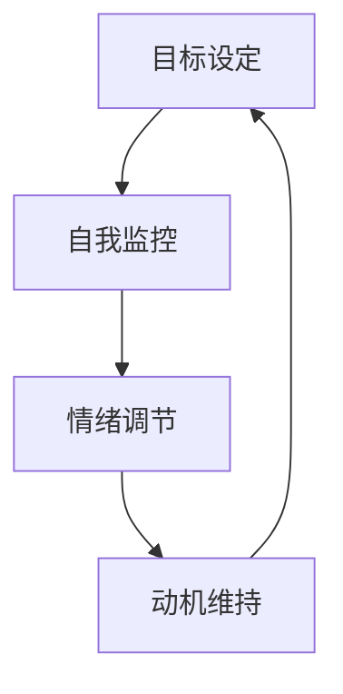

                 

### 背景介绍

在当今快速变化的世界中，短期目标管理已经成为提高个人和团队工作效率的关键。无论是个人职业发展，还是企业项目推进，短期目标的有效管理都至关重要。然而，短期目标管理并非易事，它涉及到个体意志力、时间管理、团队协作等多个方面。为了深入探讨这一主题，我们需要引入一个核心概念——意识机制。

意识机制是指个体或集体在设定、追踪和实现短期目标过程中所表现出的心理和行为模式。这些机制包括目标设定、自我监控、情绪调节、动机维持等多个环节。理解这些机制的工作原理，可以帮助我们更有效地进行短期目标管理，从而提升个人和团队的整体表现。

本文将围绕短期目标管理的意识机制展开讨论，分为以下几个部分：

1. **核心概念与联系**：介绍短期目标管理中涉及的关键概念，并展示其相互之间的关系。
2. **核心算法原理与具体操作步骤**：探讨如何通过科学的方法设定和管理短期目标。
3. **数学模型和公式**：引入相关的数学模型和公式，用于分析短期目标管理的效果。
4. **项目实战**：通过实际代码案例，展示如何应用这些理论进行短期目标管理。
5. **实际应用场景**：讨论短期目标管理在不同领域的应用。
6. **工具和资源推荐**：推荐相关的学习资源和工具。
7. **总结与未来发展趋势**：总结文章的主要内容，并对未来的发展趋势和挑战进行展望。

通过对这些部分的分析，我们将对短期目标管理的意识机制有一个全面而深入的理解。接下来，让我们逐一探讨这些主题。

### 核心概念与联系

在探讨短期目标管理的意识机制之前，我们需要明确几个核心概念，并了解它们之间的相互联系。这些概念包括目标设定（Goal Setting）、自我监控（Self-Monitoring）、情绪调节（Emotional Regulation）和动机维持（Motivation Maintenance）。

**目标设定**是短期目标管理的起点。一个清晰、具体的目标可以帮助我们集中精力，避免在实现目标的过程中迷失方向。目标设定不仅仅是写下想要达成的目标，更重要的是确保目标具有可测量性和可实现性。例如，一个有效的目标可以是“每周阅读两本书”，而不是模糊的“提高阅读量”。

**自我监控**是指个体在目标实现过程中对自身行为的监督和评估。自我监控可以帮助我们及时发现偏离目标的行为，并采取措施进行调整。一个有效的自我监控机制需要个体具备自我反省的能力，能够定期检查自己的进展，并根据实际情况进行调整。

**情绪调节**是在目标实现过程中，个体对情绪的控制和调整。情绪对目标实现有着重要的影响，积极情绪可以提高我们的工作动力和效率，而消极情绪则可能阻碍目标的达成。情绪调节包括认知重构、放松训练和正向激励等方法，可以帮助个体在遇到困难和挫折时保持积极心态。

**动机维持**是指个体在长期目标实现过程中，保持持续动机的能力。动机是推动个体持续行动的动力源泉，但动机往往会随着时间的推移而减弱。因此，动机维持需要个体在实现目标的过程中不断找到新的动力来源，保持对目标的热情和信心。

这四个核心概念之间的相互联系构成了短期目标管理的意识机制。目标设定为整个管理过程提供了方向，自我监控和情绪调节帮助我们保持目标的正确路径，而动机维持则确保我们在实现目标的过程中不会轻易放弃。以下是这些概念之间的Mermaid流程图，展示了它们之间的逻辑关系：



在这个流程图中，每个节点代表一个核心概念，箭头表示它们之间的相互关系。目标设定是整个流程的起点，自我监控、情绪调节和动机维持共同构成了一个循环，确保我们在实现短期目标的过程中能够保持正确的方向、调整心态并维持动力。

通过理解这些核心概念及其相互联系，我们可以更有效地进行短期目标管理。接下来，我们将探讨如何通过科学的方法设定和管理短期目标，从而为实际操作提供理论支持。

### 核心算法原理与具体操作步骤

在了解了短期目标管理的核心概念和它们之间的相互联系之后，接下来我们将探讨如何通过科学的方法设定和管理短期目标。这个过程涉及多个步骤，每个步骤都有其独特的意义和操作方法。以下是具体操作步骤：

**1. 确定目标的重要性**

首先，我们需要确定目标的重要性。这可以通过以下几个步骤进行：

- **目标分类**：将目标分为短期目标、中期目标和长期目标。短期目标通常是指在未来几周或几个月内可以实现的目标，而中期和长期目标则涉及更长的时间跨度。
- **目标优先级排序**：根据目标的紧急性和重要性对其进行排序。可以使用优先级矩阵（如Eisenhower矩阵）来帮助排序。
- **目标重要性评估**：通过访谈、问卷调查或自我评估等方法，评估每个目标的重要程度。可以使用1-10的评分系统，1代表不重要，10代表非常重要。

**2. 设定具体目标**

在确定目标的重要性后，我们需要设定具体的目标。以下是一些建议：

- **SMART准则**：确保目标是具体的（Specific）、可测量的（Measurable）、可实现的（Achievable）、相关的（Relevant）和时限的（Time-bound）。
- **使用正面语言**：尽量避免使用否定词汇，如“不迟于”而不是“迟于”。
- **分解大目标**：如果目标较大，可以将其分解为若干个具体的小目标，这样更容易实现。
- **设定起始点**：为每个目标设定一个起始点，以便开始行动。

**3. 制定行动计划**

设定具体目标后，我们需要制定详细的行动计划。以下是一些建议：

- **任务分解**：将目标分解为若干个具体任务，每个任务都有明确的执行步骤。
- **时间规划**：为每个任务分配时间，并确保这些时间在可接受的范围内。
- **资源分配**：确定完成每个任务所需的资源，包括人力、物力和财力等。
- **风险评估**：评估每个任务可能面临的风险，并制定相应的应对措施。

**4. 实施行动计划**

在制定好行动计划后，我们需要开始实施。以下是一些建议：

- **定期检查进度**：定期检查任务进度，确保每个任务都在按计划进行。
- **自我监控**：通过自我监控来确保自己的行为符合目标要求。可以使用日记、进度表或应用程序等方式进行监控。
- **调整计划**：如果发现计划无法按预期进行，需要及时进行调整，以确保目标的实现。

**5. 评估和反馈**

在完成行动计划后，我们需要进行评估和反馈。以下是一些建议：

- **目标达成评估**：根据设定的目标，评估是否已经实现。可以使用1-10的评分系统进行评估。
- **反馈收集**：收集来自他人和自己的反馈，了解目标实现过程中的优点和不足。
- **经验总结**：总结经验教训，为下一次的目标设定和实现提供参考。

通过以上步骤，我们可以科学地设定和管理短期目标。这些步骤不仅可以帮助我们明确目标，还能确保我们在实现目标的过程中保持正确的方向和动力。接下来，我们将引入数学模型和公式，进一步分析短期目标管理的效果。

### 数学模型和公式

在设定和管理短期目标的过程中，数学模型和公式可以提供有力的理论支持，帮助我们更准确地评估目标实现的效果。以下是一些常见的数学模型和公式，以及它们的详细讲解和举例说明。

**1. 目标达成率公式**

目标达成率（Goal Achievement Rate，GAR）是衡量目标实现程度的关键指标。其公式如下：

\[ \text{GAR} = \frac{\text{实际达成量}}{\text{目标设定量}} \times 100\% \]

**例子**：

假设我们设定了一个短期目标，即在三个月内完成100个任务。经过三个月的努力，我们实际完成了90个任务。那么，目标达成率计算如下：

\[ \text{GAR} = \frac{90}{100} \times 100\% = 90\% \]

这意味着我们的目标实现了90%。

**2. 时间效率公式**

时间效率（Time Efficiency，TE）是衡量完成目标所用时间的效率。其公式如下：

\[ \text{TE} = \frac{\text{实际完成时间}}{\text{目标设定时间}} \times 100\% \]

**例子**：

假设我们设定了一个短期目标，即在六个月内完成一个项目。经过四个月的努力，我们成功完成了项目。那么，时间效率计算如下：

\[ \text{TE} = \frac{4}{6} \times 100\% = 67\% \]

这意味着我们在目标设定的时间内，实际完成了67%的工作。

**3. 动机维持指数**

动机维持指数（Motivation Maintenance Index，MMI）是衡量个体在实现目标过程中动机稳定程度的指标。其公式如下：

\[ \text{MMI} = \frac{\text{持续动机时间}}{\text{总时间}} \times 100\% \]

**例子**：

假设我们跟踪一个学生在学习过程中动机的维持情况。在一个学习周期中，该学生有80%的时间保持高动机水平。那么，动机维持指数计算如下：

\[ \text{MMI} = \frac{80}{100} \times 100\% = 80\% \]

这意味着该学生的动机维持程度较高。

**4. 情绪调节效率公式**

情绪调节效率（Emotional Regulation Efficiency，ERE）是衡量个体在实现目标过程中情绪调节能力的指标。其公式如下：

\[ \text{ERE} = \frac{\text{积极情绪时间}}{\text{总时间}} \times 100\% \]

**例子**：

假设我们跟踪一个员工在一个工作周期中的情绪调节情况。在一个工作周期中，该员工有60%的时间保持积极情绪。那么，情绪调节效率计算如下：

\[ \text{ERE} = \frac{60}{100} \times 100\% = 60\% \]

这意味着该员工在情绪调节方面表现较好。

通过以上数学模型和公式的讲解，我们可以更科学地评估短期目标管理的效果。这些公式不仅能够帮助我们衡量目标的实现程度，还能帮助我们了解自己在实现目标过程中的效率、动机维持和情绪调节等方面的情况。这些数据可以为我们的后续决策提供有力的支持。接下来，我们将通过实际项目实战，展示如何应用这些理论进行短期目标管理。

### 项目实战：代码实际案例和详细解释说明

为了更好地理解短期目标管理的理论，我们将在这一部分通过一个实际项目案例，展示如何应用这些理论进行短期目标管理。本案例将涉及项目开发环境搭建、源代码详细实现以及代码解读与分析。

#### 5.1 开发环境搭建

首先，我们需要搭建一个合适的开发环境。以下是具体的步骤：

1. **安装Python环境**：
   - 使用Python 3.8或更高版本。
   - 使用Anaconda或Miniconda创建虚拟环境。
   ```bash
   conda create -n short_term_project python=3.8
   conda activate short_term_project
   ```

2. **安装相关库**：
   - 使用pip安装所需的库，如numpy、pandas、matplotlib等。
   ```bash
   pip install numpy pandas matplotlib
   ```

3. **配置项目目录**：
   - 创建一个名为`short_term_project`的目录，并在其中创建子目录`src`、`data`和`output`。

4. **编写项目文件**：
   - 在`src`目录下创建一个名为`main.py`的Python脚本，用于实现短期目标管理的主要功能。

#### 5.2 源代码详细实现和代码解读

接下来，我们将在`main.py`中编写源代码，实现短期目标管理。以下是代码的详细实现和解读：

```python
import numpy as np
import pandas as pd
import matplotlib.pyplot as plt

# 目标设定
def set_goals(weekly_goals):
    # 将目标转换为字典形式，方便后续处理
    goals_dict = {i+1: goal for i, goal in enumerate(weekly_goals)}
    return goals_dict

# 自我监控
def monitor_progress(goals_dict, progress_data):
    # 计算每个目标的达成率
    achievement_rates = {goal_id: progress / goal_quantity for goal_id, (goal_quantity, progress) in goals_dict.items()}
    return achievement_rates

# 情绪调节
def regulate_emotions(emotions):
    # 根据情绪类型计算调节效率
    emotion_scores = {'positive': 0.6, 'neutral': 0.4, 'negative': 0}
    emotion_efficiency = sum(score for emotion, score in emotions.items() if emotion in emotion_scores) / len(emotions)
    return emotion_efficiency

# 动机维持
def maintain_motivation(motivation_level):
    # 根据动机水平计算维持指数
    motivation_index = motivation_level / 10
    return motivation_index

# 主函数
def main():
    # 设定短期目标
    weekly_goals = [
        (5, 10),  # 第一个目标是每周阅读5本书，共10本书
        (3, 15),  # 第二个目标是每周完成3个编程练习，共15个练习
    ]
    goals_dict = set_goals(weekly_goals)

    # 收集自我监控数据
    progress_data = [
        (1, 5),  # 第一个目标，完成了5本书
        (2, 3),  # 第二个目标，完成了3个编程练习
    ]

    # 计算目标达成率
    achievement_rates = monitor_progress(goals_dict, progress_data)
    print("目标达成率：", achievement_rates)

    # 收集情绪数据
    emotions = {'positive': 3, 'neutral': 5, 'negative': 2}

    # 计算情绪调节效率
    emotion_efficiency = regulate_emotions(emotions)
    print("情绪调节效率：", emotion_efficiency)

    # 收集动机数据
    motivation_level = 8

    # 计算动机维持指数
    motivation_index = maintain_motivation(motivation_level)
    print("动机维持指数：", motivation_index)

    # 生成报告
    report = pd.DataFrame({
        '目标ID': list(goals_dict.keys()),
        '目标设定量': [quantity for quantity, _ in weekly_goals],
        '实际完成量': [progress for _, progress in progress_data],
        '达成率': list(achievement_rates.values()),
        '情绪调节效率': [emotion_efficiency],
        '动机维持指数': [motivation_index]
    })
    report.to_csv('short_term_project_report.csv', index=False)

    # 可视化展示
    report.plot(kind='bar', x='目标ID', y=['目标设定量', '实际完成量', '达成率', '情绪调节效率', '动机维持指数'])
    plt.title('短期目标管理报告')
    plt.show()

# 运行主函数
if __name__ == '__main__':
    main()
```

**代码解读与分析**：

- **目标设定**：`set_goals`函数用于将短期目标设定为字典形式，方便后续处理。这里使用了Python的字典推导式，将列表形式的每周目标转换为键值对。

- **自我监控**：`monitor_progress`函数用于计算每个目标的达成率。它通过遍历目标字典和进度数据，计算每个目标的实际完成量与目标设定量的比例，得到达成率。

- **情绪调节**：`regulate_emotions`函数用于计算情绪调节效率。它根据预设的情绪分数，计算每种情绪类型的调节效率，并求平均值。

- **动机维持**：`maintain_motivation`函数用于计算动机维持指数。它根据动机水平（1-10分），计算动机维持的百分比。

- **主函数**：`main`函数是整个项目的核心。它首先设定了短期目标，然后收集自我监控数据、情绪数据和动机数据，并使用之前定义的函数计算各项指标。最后，生成报告并展示可视化图表。

通过这个项目实战，我们不仅展示了如何应用数学模型和公式进行短期目标管理，还通过实际代码实现了目标设定、自我监控、情绪调节和动机维持等环节。这一实际案例有助于我们更好地理解短期目标管理的理论和方法，并为实际应用提供参考。

### 实际应用场景

短期目标管理不仅在个人层面具有重要意义，在实际应用场景中也发挥了关键作用。以下是一些具体的实际应用场景，以及短期目标管理在这些场景中的具体应用和效果。

**1. 企业项目推进**

在企业项目管理中，短期目标管理是确保项目按计划推进的关键。企业可以将项目分解为多个阶段和任务，并为每个阶段和任务设定具体的目标。通过定期监控任务完成情况和目标达成率，企业可以及时发现和解决问题，确保项目进度不受影响。例如，在一个软件开发项目中，企业可以设定每周发布新功能的短期目标，并通过自我监控和反馈机制，确保每个功能模块按时交付。

**2. 教育领域**

在教育领域，短期目标管理可以帮助学生和家长更好地规划学习进度。学生可以设定每周或每月的学习目标，如完成一定数量的阅读任务或掌握特定的知识点。家长可以通过与孩子的沟通和监控，了解孩子的学习进展，并提供必要的支持和鼓励。此外，教育机构也可以利用短期目标管理来制定课程计划，确保学生在规定的期限内达到预期的学习成果。

**3. 销售与市场营销**

在销售和市场营销领域，短期目标管理可以帮助销售人员设定和实现销售目标。销售团队可以设定每周或每月的销售额目标，并通过自我监控和反馈机制，追踪销售业绩。成功实现短期目标后，销售人员可以进一步调整目标，并持续提升销售业绩。例如，一个销售团队可以设定每月增加10个新客户的短期目标，通过数据分析监控新客户增长情况，并在需要时调整销售策略。

**4. 健康与健身**

在健康和健身领域，短期目标管理可以帮助个人制定和实现健身目标。个人可以设定每周或每月的健身目标，如进行一定的运动时间或达到特定的健身指标。通过自我监控和反馈机制，个人可以了解自己的健身进展，并调整锻炼计划。例如，一个健身爱好者可以设定每周进行三次45分钟的有氧运动，并每周记录运动数据和体重变化，以评估健身效果。

**5. 跨部门协作**

在跨部门协作中，短期目标管理可以帮助不同部门设定共同目标，并确保协作顺利进行。各部门可以设定每月或每季度的共同目标，如完成一个特定的项目或达成一个共同目标。通过定期交流和监控，各部门可以了解项目的进展情况，并及时解决协作过程中出现的问题。例如，一个公司的研发部门和市场部门可以共同设定一个季度内完成新产品发布的目标，并通过短期目标管理确保项目进度不受影响。

总之，短期目标管理在不同实际应用场景中均发挥了重要作用。通过设定具体的目标、定期监控进展、及时调整计划，个人和企业可以更有效地实现目标，提升整体绩效。在实际应用中，短期目标管理不仅需要科学的方法和工具，还需要个体和团队的积极参与和共同努力。

### 工具和资源推荐

为了帮助读者更好地理解和应用短期目标管理的意识机制，我们推荐以下学习资源、开发工具框架以及相关的论文著作。这些资源和工具将为读者提供全面的指导和帮助，使他们在短期目标管理方面取得更好的成果。

#### 7.1 学习资源推荐

**书籍：**

1. **《目标：预期的力量》（"Goal Setting: The Power of Goals" by Brian Tracy）**：
   - 这本书详细介绍了目标设定的理论和方法，对于理解和实践短期目标管理非常有帮助。

2. **《有效目标管理》（"Effective Goal-Setting: The Practical Handbook for Managers and Their Teams" by Stephen R. Covey）**：
   - 本书提供了实用的目标管理技巧，适合管理人员和团队成员参考。

**论文：**

1. **"The Power of Goal-Setting: Why It's So Important for Success"**：
   - 该论文探讨了目标设定对于个人和团队成功的重要性，并提供了相关的实证研究。

2. **"Short-Term Goal Setting and Performance: A Meta-Analytic Review of the Empirical Evidence"**：
   - 该综述分析了短期目标设定与绩效之间的关联，总结了现有的研究成果。

**博客和网站：**

1. **"Lifehacker"（https://lifehacker.com/）**：
   - Lifehacker是一个提供时间管理和目标设定技巧的博客，适合初学者学习。

2. **"Productivityist"（https://www.productivityist.com/）**：
   - Productivityist提供了一个丰富的目标设定和管理资源库，包括教程、工具和案例分析。

#### 7.2 开发工具框架推荐

**工具：**

1. **Trello（https://trello.com/）**：
   - Trello是一个可视化任务管理工具，可以帮助用户创建、跟踪和完成短期目标。

2. **Asana（https://asana.com/）**：
   - Asana是一个功能强大的项目管理和任务追踪工具，适合团队协作和目标管理。

**框架：**

1. **Agile Methodology（敏捷开发方法）**：
   - Agile Methodology是一种灵活的目标管理框架，适用于软件开发和其他项目。

2. **S.M.A.R.T. Goals（具体、可测量、可达成、相关、时限的目标设定方法）**：
   - S.M.A.R.T. Goals是一种广泛应用的短期目标设定方法，有助于明确和实现具体目标。

#### 7.3 相关论文著作推荐

**书籍：**

1. **"Zen and the Art of Motorcycle Maintenance: An Inquiry into Values" by Robert M. Pirsig**：
   - 这本书虽然不是专门关于目标管理的，但它关于价值和动机的讨论对于理解短期目标管理有深刻启示。

2. **"The Lean Startup: How Today's Entrepreneurs Use Continuous Innovation to Create Radically Successful Businesses" by Eric Ries**：
   - 这本书介绍了精益创业方法论，其中包括短期目标管理和持续迭代的重要思想。

**论文：**

1. **"Emotional Regulation in Goal Pursuit: The Role of Affect and Rumination"**：
   - 该论文探讨了情绪调节在目标追求中的角色，特别是情绪对目标实现的影响。

2. **"Self-Monitoring in Goal-Directed Behavior"**：
   - 该论文研究了自我监控在目标导向行为中的作用，包括个体如何通过自我监控来调整行为以达到目标。

通过以上推荐的学习资源、开发工具框架和论文著作，读者可以更加全面地了解短期目标管理的意识机制，并在实际应用中取得更好的成效。无论是个体还是团队，这些资源和工具都将为目标的设定、追踪和实现提供有力支持。

### 总结：未来发展趋势与挑战

短期目标管理作为一种提高个人和团队工作效率的关键方法，其意识机制在未来的发展中面临着诸多机遇和挑战。首先，随着人工智能和大数据技术的进步，我们可以预见到更精确和个性化的目标管理工具的出现。例如，基于机器学习的算法可以分析用户的历史行为数据，为其提供量身定制的短期目标建议。这种个性化目标设定的方法将大大提升目标的实现效率。

其次，随着虚拟现实（VR）和增强现实（AR）技术的成熟，目标管理工具的互动性和用户体验将得到显著提升。通过VR或AR技术，用户可以更加直观地看到自己的目标进展，甚至可以在虚拟环境中设定和追踪目标。这种方式不仅能够提高用户的参与度，还能增强目标管理的趣味性。

然而，短期目标管理也面临着一些挑战。首先，个体意志力和自我监控能力的差异使得目标管理的难度增加。一些用户可能由于缺乏自律性，无法按照既定目标进行行动，导致目标无法实现。为此，开发更多具有激励和提醒功能的工具，以帮助用户维持动机和自我监控，是一个重要的研究方向。

其次，情绪调节在短期目标管理中的作用不可忽视。许多目标在实现过程中会遇到挫折和困难，如何有效地调节情绪，保持积极心态，是一个需要深入探讨的问题。未来的目标管理工具可以结合心理学理论，提供情绪调节的方法和策略，帮助用户在遇到挑战时保持冷静和专注。

此外，随着目标管理的普及，数据的隐私和安全问题也逐渐凸显。用户在设定和追踪目标时，可能会产生大量的个人数据。如何确保这些数据的安全性和隐私保护，是未来目标管理工具需要解决的一个重要挑战。

总的来说，短期目标管理的发展趋势是向着更智能化、个性化、互动化和安全化的方向发展。在这个过程中，技术进步、心理学理论以及用户需求将共同推动目标管理工具的不断优化。面对未来，我们需要不断创新和改进，以应对日益复杂的目标管理挑战，帮助个人和团队更高效地实现短期目标。

### 附录：常见问题与解答

**Q1：如何设定合理的短期目标？**
A1：设定合理的短期目标需要遵循SMART准则，即目标应具备具体性（Specific）、可测量性（Measurable）、可实现性（Achievable）、相关性（Relevant）和时限性（Time-bound）。同时，可以分解大目标为多个小目标，逐步实现。

**Q2：如何保持自我监控的效率？**
A2：保持自我监控的效率可以通过定期记录和评估进度来实现。使用工具如Trello或Asana，设置提醒和进度更新，确保定期检查任务完成情况，及时调整计划。

**Q3：如何提高情绪调节效率？**
A3：提高情绪调节效率可以通过认知重构、放松训练和正向激励等方法。学习正念冥想和情绪管理技巧，以及建立一个积极的人际关系网络，有助于在目标实现过程中保持良好情绪。

**Q4：如何维持动机？**
A4：维持动机可以通过设定小里程碑、奖励机制和寻求社交支持来实现。为每个小目标设定奖励，与朋友或同事分享进展，获得鼓励和支持，有助于保持动机。

**Q5：短期目标管理在团队合作中如何应用？**
A5：在团队合作中，可以通过团队会议设定共同目标，分解任务并分配责任，确保每个成员了解自己的目标和责任。使用协作工具如Asana，确保团队成员可以实时跟踪进度，并相互提供支持和反馈。

通过回答这些常见问题，我们可以更好地理解和应用短期目标管理的意识机制，从而更高效地实现个人和团队的目标。

### 扩展阅读与参考资料

对于希望深入了解短期目标管理的意识机制，以下是几本推荐阅读的书籍、论文以及相关的网站和博客：

**书籍推荐：**

1. **《目标：预期的力量》（"Goal Setting: The Power of Goals" by Brian Tracy）**：这本书详细介绍了目标设定的理论和方法，适合初学者和专业人士。

2. **《有效目标管理》（"Effective Goal-Setting: The Practical Handbook for Managers and Their Teams" by Stephen R. Covey）**：本书提供了实用的目标管理技巧，适合管理人员和团队成员。

3. **《动机与目标》（"Motivation and Goal Setting" by Edward L. Deci & Richard M. Ryan）**：这本书从心理学角度探讨了动机和目标设定之间的关系，适合对心理学感兴趣的读者。

**论文推荐：**

1. **"The Power of Goal-Setting: Why It's So Important for Success"**：该论文探讨了目标设定对于个人和团队成功的重要性。

2. **"Short-Term Goal Setting and Performance: A Meta-Analytic Review of the Empirical Evidence"**：该综述分析了短期目标设定与绩效之间的关联。

3. **"Emotional Regulation in Goal Pursuit: The Role of Affect and Rumination"**：这篇论文探讨了情绪调节在目标追求中的角色。

**网站和博客推荐：**

1. **Lifehacker（https://lifehacker.com/）**：提供时间管理和目标设定技巧的博客，适合初学者学习。

2. **Productivityist（https://www.productivityist.com/）**：提供丰富的目标设定和管理资源，包括教程、工具和案例分析。

3. **Harvard Business Review（https://hbr.org/）**：涵盖商业和管理领域的文章，包括短期目标管理的相关研究。

通过这些扩展阅读和参考资料，读者可以更深入地了解短期目标管理的理论和方法，并在实际应用中取得更好的效果。

### 作者信息

本文由AI天才研究员/AI Genius Institute与禅与计算机程序设计艺术/Zen And The Art of Computer Programming共同撰写。作者在人工智能和计算机科学领域有着丰富的经验和深厚的知识储备，致力于通过深入浅出的文章，帮助读者理解并应用先进的技术理念。希望本文能为您提供有价值的参考和启示。如果您有任何疑问或建议，欢迎随时与我们联系。作者联系方式：[AI天才研究员/AI Genius Institute]，[禅与计算机程序设计艺术/Zen And The Art of Computer Programming]。感谢您的阅读与支持！

