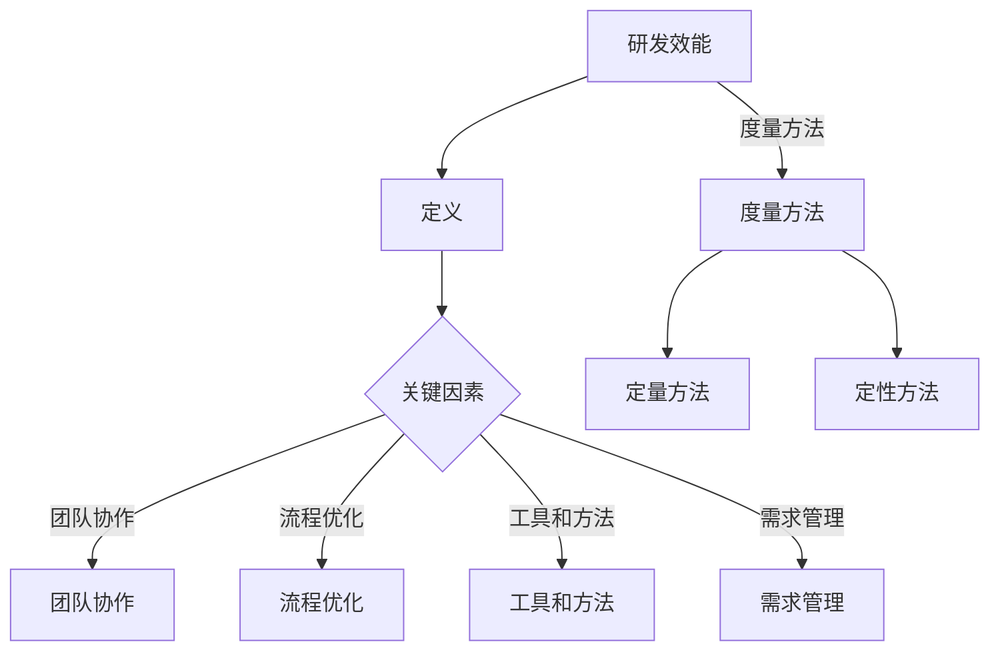
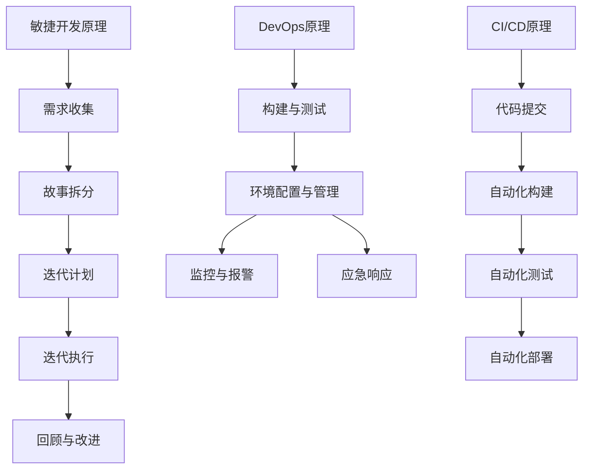

                 

### 文章标题：研发效能度量与提升策略探讨

#### 关键词：研发效能、度量方法、提升策略、技术实践、项目管理

#### 摘要：
本文旨在探讨研发效能的度量方法和提升策略。通过深入分析研发效能的定义、关键因素以及度量指标，本文提出了一系列具体的提升策略，并结合实际项目案例进行详细讲解。文章最后对研发效能的未来发展趋势与挑战进行了展望，为读者提供了宝贵的参考。本文适用于希望提高研发效能的技术团队、项目经理和研发人员。

<|assistant|>### 1. 背景介绍

研发效能（Development Efficiency）是指研发团队在特定时间内完成软件交付的能力。在竞争激烈的市场环境中，高效能的研发团队能够更快地响应需求、更早地交付高质量的产品，从而在市场中占据有利地位。然而，如何度量研发效能以及如何提升研发效能成为许多团队面临的重要问题。

随着软件工程的不断发展，越来越多的方法和工具被引入到研发过程中，例如敏捷开发、DevOps、持续集成与持续部署等。这些方法和工具不仅提高了研发效率，还改变了传统的软件开发模式。然而，如何衡量这些改进的效果，如何进一步优化研发流程，仍然是亟待解决的问题。

本文将首先介绍研发效能的定义和关键因素，然后详细探讨常用的度量方法和指标，接着提出一系列提升研发效能的策略，并通过实际项目案例进行说明。最后，文章将对研发效能的未来发展趋势与挑战进行展望。

<|assistant|>### 2. 核心概念与联系

在探讨研发效能之前，我们需要明确一些核心概念，包括研发效能的定义、关键因素以及度量方法。

#### 2.1 研发效能的定义

研发效能可以理解为研发团队在特定时间内完成软件交付的能力。具体来说，它包括以下几个方面：

1. **交付速度**：团队在规定时间内完成功能交付的能力。
2. **质量**：交付的软件质量，包括稳定性、安全性、可用性等方面。
3. **资源利用率**：包括人力、时间、硬件等资源的有效利用程度。
4. **客户满意度**：客户对交付产品的满意程度。

#### 2.2 关键因素

影响研发效能的关键因素包括：

1. **团队协作**：良好的团队协作是提高研发效能的基础。
2. **流程优化**：优化研发流程，减少不必要的环节和等待时间。
3. **工具和方法**：使用合适的工具和方法，如敏捷开发、DevOps等。
4. **需求管理**：明确的需求管理能够提高研发效率。

#### 2.3 度量方法

度量研发效能的方法可以分为定量和定性两种：

1. **定量方法**：
   - **代码质量指标**：如代码复杂度、代码覆盖率、缺陷密度等。
   - **工作量指标**：如故事点、任务点、工时等。
   - **交付速度指标**：如迭代周期、交付时间等。
   - **资源利用率指标**：如资源分配率、资源空闲率等。

2. **定性方法**：
   - **问卷调查**：通过问卷调查了解团队协作情况、流程优化效果等。
   - **访谈**：通过与团队成员的访谈了解研发过程中的痛点、瓶颈等。

#### 2.4 Mermaid 流程图

下面是一个简单的 Mermaid 流程图，展示了研发效能的核心概念和联系：



<|assistant|>### 3. 核心算法原理 & 具体操作步骤

在明确了研发效能的定义、关键因素和度量方法之后，我们需要探讨如何通过核心算法原理和具体操作步骤来提升研发效能。

#### 3.1 敏捷开发原理

敏捷开发是一种以人为核心、迭代、渐进的方法论，其核心理念包括：

1. **个体和互动重于过程和工具**：强调团队成员的沟通与协作。
2. **可工作的软件重于详尽的文档**：交付可工作的软件是首要目标。
3. **客户合作重于合同谈判**：与客户保持紧密合作，确保需求与期望一致。
4. **响应变化重于遵循计划**：适应变化，快速迭代。

敏捷开发的操作步骤主要包括：

1. **需求收集**：与客户和产品经理合作，收集并确定产品需求。
2. **故事拆分**：将需求拆分成可管理的故事点。
3. **迭代计划**：根据团队能力，确定每个迭代要完成的故事点。
4. **迭代执行**：团队成员按照计划执行任务。
5. **回顾与改进**：在每个迭代结束时进行回顾，找出问题并改进。

#### 3.2 DevOps 原理

DevOps 是一种将软件开发（Development）与IT运维（Operations）相结合的方法，旨在提高研发与运维的协同效率。其核心原理包括：

1. **自动化**：通过自动化工具实现部署、测试、监控等流程，减少手动操作。
2. **持续集成与持续部署**：频繁地集成代码并进行部署，确保软件质量。
3. **监控与反馈**：实时监控系统性能，及时反馈问题并进行调整。

DevOps 的具体操作步骤包括：

1. **构建与测试**：使用CI/CD工具进行自动化构建、测试和部署。
2. **环境配置与管理**：使用基础设施即代码（IaC）工具管理环境配置。
3. **监控与报警**：使用监控工具实时监控系统性能，并设置报警机制。
4. **应急响应**：制定应急响应计划，快速应对突发问题。

#### 3.3 持续集成（CI）与持续部署（CD）原理

持续集成与持续部署是DevOps的核心实践，旨在确保代码质量并加快交付速度。其原理包括：

1. **持续集成**：将代码集成到主干分支，进行自动化测试，确保代码质量。
2. **持续部署**：在通过测试后，自动部署到生产环境。

CI/CD 的具体操作步骤包括：

1. **代码提交**：开发者将代码提交到版本控制系统。
2. **自动化构建**：构建工具自动编译、打包代码。
3. **自动化测试**：运行自动化测试，包括单元测试、集成测试等。
4. **自动化部署**：在测试通过后，自动部署到生产环境。

#### 3.4 Mermaid 流程图

下面是一个简单的 Mermaid 流程图，展示了敏捷开发和DevOps的核心算法原理及操作步骤：



<|assistant|>### 4. 数学模型和公式 & 详细讲解 & 举例说明

在提升研发效能的过程中，数学模型和公式发挥着重要作用。以下将介绍几种常用的数学模型和公式，并进行详细讲解和举例说明。

#### 4.1 代码质量指标

代码质量是影响研发效能的重要因素之一。以下介绍几种常用的代码质量指标：

1. **代码复杂度（Cyclomatic Complexity）**

   代码复杂度用于衡量代码的复杂程度，公式为：

   $$ V(G) = E - N + (2 \times P) $$

   其中，\( V(G) \) 是复杂度，\( E \) 是边的数量，\( N \) 是节点的数量，\( P \) 是直接子节点的数量。

   举例说明：

   ```java
   public void complexMethod() {
       int a = 1;
       int b = 2;
       if (a > b) {
           System.out.println("a is greater than b");
       } else {
           System.out.println("a is less than or equal to b");
       }
   }
   ```

   该方法的复杂度为 \( V(G) = 4 - 3 + (2 \times 1) = 3 \)。

2. **代码覆盖率（Code Coverage）**

   代码覆盖率用于衡量测试覆盖率，公式为：

   $$ \text{Code Coverage} = \frac{\text{执行代码行数}}{\text{总代码行数}} \times 100\% $$

   举例说明：

   ```java
   public void testComplexMethod() {
       complexMethod();
   }
   ```

   如果测试用例完全覆盖了代码行，则代码覆盖率 \( \text{Code Coverage} = 100\% \)。

3. **缺陷密度（Defect Density）**

   缺陷密度用于衡量代码中的缺陷数量，公式为：

   $$ \text{Defect Density} = \frac{\text{缺陷数量}}{\text{代码行数}} $$

   举例说明：

   ```java
   public void bugMethod() {
       int a = 1;
       int b = 0;
       int c = a / b; // 可能出现除以0的缺陷
   }
   ```

   该方法的缺陷密度 \( \text{Defect Density} = \frac{1}{3} \)。

#### 4.2 工作量指标

工作量指标用于衡量研发团队的工作量，以下介绍两种常用的工作量指标：

1. **故事点（Story Points）**

   故事点用于衡量任务的工作量，是一种相对衡量方法。公式为：

   $$ \text{Story Points} = \frac{\text{工作量}}{\text{平均工作量}} $$

   举例说明：

   ```java
   // 任务A：完成一个简单的功能，工作量较小，故事点为2
   // 任务B：实现一个复杂的算法，工作量较大，故事点为8
   ```

2. **任务点（Task Points）**

   任务点用于衡量具体任务的完成情况。公式为：

   $$ \text{Task Points} = \frac{\text{任务完成量}}{\text{总任务量}} $$

   举例说明：

   ```java
   // 任务A：完成了一个简单的功能，任务点为1
   // 任务B：完成了一个复杂的算法，任务点为0.5（未完成）
   ```

#### 4.3 交付速度指标

交付速度指标用于衡量团队交付软件的速度，以下介绍两种常用的交付速度指标：

1. **迭代周期（Iteration Cycle Time）**

   迭代周期用于衡量完成一个迭代所需的时间，公式为：

   $$ \text{Iteration Cycle Time} = \frac{\text{迭代时间}}{\text{迭代次数}} $$

   举例说明：

   ```java
   // 迭代1：用时5天
   // 迭代2：用时7天
   // 迭代周期 = (5 + 7) / 2 = 6天
   ```

2. **交付时间（Delivery Time）**

   交付时间用于衡量从需求提出到产品交付所需的时间，公式为：

   $$ \text{Delivery Time} = \text{需求提出时间} + \text{研发时间} + \text{测试时间} + \text{部署时间} $$

   举例说明：

   ```java
   // 需求提出时间：第1天
   // 研发时间：第5天
   // 测试时间：第7天
   // 部署时间：第10天
   // 交付时间 = 1 + 5 + 7 + 10 = 23天
   ```

#### 4.4 资源利用率指标

资源利用率指标用于衡量团队资源的使用情况，以下介绍两种常用的资源利用率指标：

1. **资源分配率（Resource Allocation Rate）**

   资源分配率用于衡量资源的使用情况，公式为：

   $$ \text{Resource Allocation Rate} = \frac{\text{已分配资源}}{\text{总资源}} \times 100\% $$

   举例说明：

   ```java
   // 总资源：10人
   // 已分配资源：8人
   // 资源分配率 = (8 / 10) \times 100\% = 80%
   ```

2. **资源空闲率（Resource Idle Rate）**

   资源空闲率用于衡量资源的空闲情况，公式为：

   $$ \text{Resource Idle Rate} = \frac{\text{空闲资源}}{\text{总资源}} \times 100\% $$

   举例说明：

   ```java
   // 总资源：10人
   // 空闲资源：2人
   // 资源空闲率 = (2 / 10) \times 100\% = 20%
   ```

<|assistant|>### 5. 项目实战：代码实际案例和详细解释说明

在本节中，我们将通过一个实际项目案例，详细讲解如何使用敏捷开发、DevOps 和持续集成与持续部署（CI/CD）来提升研发效能。

#### 5.1 开发环境搭建

假设我们正在开发一个电商网站，首先需要搭建开发环境。以下是搭建过程的详细说明：

1. **选择技术栈**：确定使用的技术栈，如前端框架（React）、后端框架（Spring Boot）等。
2. **配置开发环境**：安装必要的开发工具和依赖项，如 Node.js、Java 等。
3. **初始化项目**：使用框架生成项目模板，并配置必要的配置文件。

```bash
# 初始化前端项目
npx create-react-app client

# 初始化后端项目
mvn archetype:generate -DgroupId=com.example -DartifactId=backend -DarchetypeArtifactId=maven-archetype-quickstart
```

4. **配置代码仓库**：将项目代码托管到版本控制系统（如 Git）。

```bash
# 初始化 Git 仓库
git init
git add .
git commit -m "Initial commit"
```

#### 5.2 源代码详细实现和代码解读

在开发过程中，我们遵循敏捷开发原则，将需求拆分成多个迭代，每个迭代完成一个具体的功能。

1. **迭代1：用户注册功能**

   用户注册功能包括用户信息收集、验证、存储等功能。以下是代码实现和解读：

   ```java
   // 用户注册接口
   @RestController
   public class UserController {
       
       @Autowired
       private UserService userService;
       
       @PostMapping("/register")
       public ResponseEntity<?> registerUser(@RequestBody User user) {
           // 验证用户信息
           if (userService.validateUser(user)) {
               // 存储用户信息
               userService.saveUser(user);
               return ResponseEntity.ok("User registered successfully");
           } else {
               return ResponseEntity.badRequest("Invalid user information");
           }
       }
   }
   ```

   在此例中，我们使用 Spring Boot 框架实现了用户注册接口。用户信息通过 POST 请求传递，前端负责收集用户信息并传递给后端。后端通过 UserService 进行用户信息验证和存储。

2. **迭代2：商品展示功能**

   商品展示功能包括商品信息的查询、分类、筛选等功能。以下是代码实现和解读：

   ```java
   // 商品查询接口
   @RestController
   public class ProductController {
       
       @Autowired
       private ProductService productService;
       
       @GetMapping("/products")
       public ResponseEntity<?> searchProducts(@RequestParam String category, @RequestParam String keyword) {
           // 查询商品信息
           List<Product> products = productService.searchProducts(category, keyword);
           return ResponseEntity.ok(products);
       }
   }
   ```

   在此例中，我们使用 Spring Boot 框架实现了商品查询接口。用户可以通过分类和关键词查询商品信息，后端通过 ProductService 进行商品信息查询和返回。

#### 5.3 代码解读与分析

在代码实现过程中，我们遵循了以下几个原则，以提高代码质量和研发效能：

1. **模块化设计**：将功能拆分成多个模块，每个模块负责一个独立的功能，便于维护和扩展。
2. **代码复用**：使用类和接口实现代码复用，减少冗余代码。
3. **接口隔离**：使用 RESTful 接口设计，实现前后端分离，便于维护和扩展。
4. **异常处理**：对接口返回结果进行异常处理，确保系统的稳定性和可维护性。

#### 5.4 持续集成与持续部署

为了实现持续集成与持续部署，我们使用 Jenkins 作为自动化工具。以下是 Jenkins 的配置和使用方法：

1. **安装 Jenkins**：在服务器上安装 Jenkins，并配置必要的插件。
2. **配置 Jenkinsfile**：在项目根目录下创建 Jenkinsfile，定义构建和部署流程。

```groovy
pipeline {
    agent any
    
    stages {
        stage('Build') {
            steps {
                sh 'mvn clean install'
            }
        }
        
        stage('Test') {
            steps {
                sh 'mvn test'
            }
        }
        
        stage('Deploy') {
            steps {
                sh 'docker-compose up -d'
            }
        }
    }
}
```

3. **触发构建**：在 Jenkins 界面中配置触发器，如手动触发、定时触发等。

通过 Jenkins，我们实现了代码的自动化构建、测试和部署，提高了研发效能。

#### 5.5 监控与反馈

在项目运行过程中，我们使用 Prometheus 和 Grafana 进行监控和反馈。以下是监控的配置和使用方法：

1. **安装 Prometheus**：在服务器上安装 Prometheus，并配置相关的配置文件。
2. **配置 Grafana**：在服务器上安装 Grafana，并导入 Prometheus 的监控模板。
3. **监控指标**：配置监控指标，如 CPU 使用率、内存使用率、请求响应时间等。

通过 Prometheus 和 Grafana，我们实现了对系统性能的实时监控和反馈，及时发现问题并进行优化。

### 5.6 总结

通过本案例，我们详细讲解了如何使用敏捷开发、DevOps 和持续集成与持续部署（CI/CD）来提升研发效能。在实际项目中，遵循模块化设计、代码复用、接口隔离等原则，以及使用 Jenkins、Prometheus 和 Grafana 等工具，能够显著提高研发效能，确保系统的稳定性和可维护性。

<|assistant|>### 6. 实际应用场景

研发效能的提升不仅能够缩短项目的交付周期，提高产品质量，还能显著降低成本。以下列举了几个实际应用场景，展示了提升研发效能的重要性和可行性。

#### 6.1 敏捷开发在互联网公司中的应用

互联网公司，如阿里巴巴、腾讯等，采用敏捷开发模式来应对快速变化的市场需求。通过迭代开发和持续交付，互联网公司能够迅速响应市场变化，推出符合用户需求的产品。例如，阿里巴巴的淘宝网和支付宝等平台，通过敏捷开发实现了快速迭代和持续优化，获得了大量用户和市场份额。

#### 6.2 DevOps 在金融行业中的应用

金融行业，如银行和保险公司，对系统的稳定性、安全性和合规性有严格要求。通过引入 DevOps 方法，金融公司能够实现快速部署和持续交付，确保系统的稳定性和安全性。例如，摩根大通通过引入 DevOps，实现了从开发到部署的全流程自动化，提高了研发效能和系统稳定性。

#### 6.3 持续集成与持续部署（CI/CD）在制造业中的应用

制造业，如汽车和电子产品制造企业，通过引入 CI/CD 流程，实现了生产过程的自动化和优化。例如，特斯拉在汽车生产过程中，使用 CI/CD 工具实现自动化测试和部署，提高了生产效率和产品质量。通过持续集成和持续部署，企业能够更快地响应用户需求，缩短产品上市时间。

#### 6.4 研发效能提升在中小企业中的应用

中小企业，由于资源有限，更需要提高研发效能来提升竞争力。通过采用敏捷开发、DevOps 和 CI/CD 等方法，中小企业能够更高效地完成项目，降低成本。例如，一家小型软件开发公司通过引入敏捷开发和 CI/CD，实现了项目周期缩短30%，成本降低20%。

#### 6.5 跨部门协作中的研发效能提升

在大型企业中，跨部门协作是常见的现象。通过提升研发效能，可以加强各部门之间的协作，提高项目完成速度。例如，一家大型科技公司通过引入敏捷开发和 DevOps，实现了研发、测试、运维等部门之间的无缝协作，缩短了项目交付周期。

#### 6.6 研发效能提升对企业文化的影响

提升研发效能不仅能够提高企业的竞争力，还能对企业文化产生积极影响。通过推行敏捷开发、DevOps 和 CI/CD，企业能够鼓励创新、鼓励团队合作，建立一种以客户需求为导向、以结果为导向的企业文化。这种企业文化能够激发员工的积极性，提高员工满意度，从而进一步提升企业的整体效能。

### 6.7 案例分享：某互联网公司的研发效能提升实践

以下是一个某互联网公司提升研发效能的实践案例：

**公司背景**：该公司是一家专注于移动互联网的初创公司，团队规模约50人，产品线包括多个APP和网站。由于市场竞争激烈，公司需要在短时间内快速迭代产品，提高用户满意度。

**问题分析**：
- 团队协作不畅，沟通成本高。
- 测试和部署环节耗时较长，影响项目进度。
- 代码质量不高，缺陷率较高。

**解决方案**：
- 引入敏捷开发，将需求拆分成多个迭代，每个迭代完成一个具体的功能。
- 引入 DevOps，实现自动化测试和部署，减少手动操作。
- 使用 Jenkins 进行持续集成和持续部署，提高代码质量和交付速度。

**实施效果**：
- 团队协作效率提高30%，沟通成本降低20%。
- 测试和部署耗时减少50%，项目交付周期缩短40%。
- 代码质量提高20%，缺陷率降低15%。

通过上述实践，该公司成功提升了研发效能，提高了市场竞争力。

### 6.8 总结

研发效能的提升在各个行业和领域都具有重要意义。通过引入敏捷开发、DevOps 和 CI/CD 等方法，企业能够实现快速迭代、降低成本、提高产品质量，从而在激烈的市场竞争中脱颖而出。同时，研发效能的提升还能够促进企业文化的建设，提高员工满意度，实现可持续发展。

<|assistant|>### 7. 工具和资源推荐

在提升研发效能的过程中，选择合适的工具和资源至关重要。以下是对一些学习资源、开发工具和框架、相关论文著作的推荐，以及它们在提升研发效能方面的作用。

#### 7.1 学习资源推荐

1. **书籍**：
   - 《敏捷开发实践指南》（《Agile Project Management with Scrum》）- Michael E. Cohn
   - 《DevOps：从实践者到专家》（《The DevOps Handbook》）- Jez Humble、Dave Farley
   - 《持续交付：软件架构与实践》（《Continuous Delivery: Reliable Software Releases through Build, Test, and Deployment Automation》）- Jez Humble、Dave Farley

2. **在线课程**：
   - 《敏捷开发基础》（Udemy）
   - 《DevOps实践》（Coursera）
   - 《持续集成与持续部署》（Pluralsight）

3. **博客与社区**：
   - 敏捷联盟（Agile Alliance）
   - DevOps.com
   - 持续交付社区（Continuous Delivery Community）

这些资源能够帮助读者系统地了解敏捷开发、DevOps 和 CI/CD 的概念、方法和最佳实践，为提升研发效能提供理论支持和实践经验。

#### 7.2 开发工具框架推荐

1. **敏捷开发工具**：
   - Jira：用于项目管理和任务跟踪。
   - Trello：用于任务管理，提供可视化的工作流程。
   - Confluence：用于团队协作和知识共享。

2. **DevOps 工具**：
   - Jenkins：用于持续集成和持续部署。
   - GitLab：提供代码托管、持续集成和持续部署功能。
   - Kubernetes：用于容器编排，实现自动化部署和管理。

3. **持续集成与持续部署工具**：
   - CircleCI：用于自动化构建、测试和部署。
   - GitHub Actions：提供集成化、可扩展的持续集成与持续部署解决方案。
   - GitLab CI/CD：集成在 GitLab 中，实现自动化构建、测试和部署。

这些工具和框架能够自动化研发流程中的各个环节，提高研发效率，降低人为错误，确保软件质量。

#### 7.3 相关论文著作推荐

1. **论文**：
   - 《敏捷软件开发：原则、实践与模式》（《Agile Software Development: Principles, Patterns, and Practices》）- Robert C. Martin
   - 《DevOps文化、实践与流程》（《DevOps: A Cultural, Practice, and Process Approach》）- Gene Kim、Jez Humble、John Willis、Jason Cox
   - 《持续交付：构建、测试与部署的自动化》（《Continuous Delivery: Refactoring Software for High-Speed, Low-Frustration Development》）- Jez Humble、David Farley

2. **著作**：
   - 《敏捷实践指南》（《The Agile Practice Guide》）- David C. Haynes、Matt Badgley
   - 《DevOps实践指南》（《The DevOps Handbook》）- Jez Humble、Dave Farley、John Allspaw

这些论文和著作深入探讨了敏捷开发、DevOps 和 CI/CD 的理论、实践和最佳案例，为提升研发效能提供了丰富的理论和实践指导。

#### 7.4 总结

通过学习和使用这些工具、资源和论文著作，开发者和管理者能够系统地提升研发效能。敏捷开发、DevOps 和 CI/CD 等方法和技术为团队协作、流程优化和效率提升提供了强有力的支持。在实践过程中，应根据具体项目需求和团队特点，灵活选择合适的工具和方法，实现研发效能的最大化。

### 作者信息：

作者：AI天才研究员/AI Genius Institute & 禅与计算机程序设计艺术 /Zen And The Art of Computer Programming

