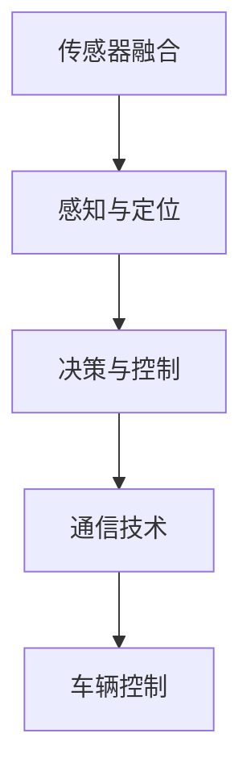

                 

# 硅谷新能源汽车自动驾驶：智能出行新时代

## 关键词
- 硅谷
- 新能源汽车
- 自动驾驶
- 智能出行
- 人工智能

## 摘要
本文将深入探讨硅谷新能源汽车自动驾驶技术的发展，分析其核心概念、算法原理、应用场景以及面临的挑战。通过详细的实例和代码解析，我们旨在为读者呈现智能出行新时代的科技前沿，并展望未来发展趋势。

## 1. 背景介绍

### 1.1 硅谷的科技氛围

硅谷，位于美国加利福尼亚州旧金山湾区南面，是世界科技和创新的象征。自20世纪中叶以来，硅谷凭借其独特的创业氛围、丰富的资本资源和世界顶尖的技术人才，成为全球高新技术企业的聚集地。从硅片到半导体，从互联网到人工智能，硅谷一直在引领全球科技发展的潮流。

### 1.2 新能源汽车的发展

新能源汽车，特别是电动汽车，正逐渐成为全球汽车工业的重要组成部分。随着环保意识的增强和对传统化石燃料依赖的减少，新能源汽车市场呈现出爆发式增长。硅谷的特斯拉（Tesla）和尼桑（Nissan）等公司，凭借其创新技术和市场策略，成为了新能源汽车行业的领军者。

### 1.3 自动驾驶技术的发展

自动驾驶技术是智能出行的重要一环。从最初的辅助驾驶到如今的完全自动驾驶，自动驾驶技术的发展可谓日新月异。硅谷的谷歌（Google）和特斯拉（Tesla）等公司在自动驾驶技术方面投入巨资，取得了显著的研究成果和商业化进展。

## 2. 核心概念与联系

### 2.1 新能源汽车自动驾驶的关键技术

- **传感器融合**：通过激光雷达、摄像头、雷达等多种传感器，获取车辆周围的环境信息。
- **感知与定位**：利用传感器数据，对车辆周围环境进行感知，并确定车辆的位置。
- **决策与控制**：基于感知和定位信息，车辆系统做出行驶决策，并控制车辆动作。
- **通信技术**：V2X（车联网）技术，实现车辆与车辆、车辆与基础设施之间的通信。

### 2.2 Mermaid 流程图



## 3. 核心算法原理 & 具体操作步骤

### 3.1 感知与定位算法原理

- **视觉感知**：利用计算机视觉技术，从摄像头获取的图像中识别车辆、行人、交通标志等目标。
- **激光雷达感知**：通过激光雷达获取的三维点云数据，对周围环境进行精确建模。
- **定位算法**：常用的有基于视觉的视觉里程计（Visual Odometry）和基于激光雷达的激光里程计（Lidar Odometry）。

### 3.2 决策与控制算法原理

- **路径规划**：根据感知到的环境信息和目标位置，生成行驶路径。
- **轨迹跟踪**：对生成的行驶路径进行实时跟踪，调整车辆行驶方向和速度。
- **控制算法**：基于轨迹跟踪结果，控制车辆的转向、加速和制动。

### 3.3 自动驾驶系统操作步骤

1. **初始化**：启动自动驾驶系统，进行设备自检和环境扫描。
2. **感知**：收集车辆周围环境数据，包括图像、点云、雷达等。
3. **定位**：利用传感器数据，确定车辆位置。
4. **决策**：基于定位信息和交通规则，生成行驶决策。
5. **控制**：执行行驶决策，控制车辆动作。

## 4. 数学模型和公式 & 详细讲解 & 举例说明

### 4.1 感知与定位的数学模型

- **视觉里程计（Visual Odometry）**：

  $$ T = T_0 + \int_0^t v(t) dt $$

  其中，\( T \)为车辆位置，\( T_0 \)为初始位置，\( v(t) \)为速度。

- **激光里程计（Lidar Odometry）**：

  $$ \Delta T = \frac{\Delta s}{v} $$

  其中，\( \Delta T \)为时间差，\( \Delta s \)为距离差，\( v \)为速度。

### 4.2 决策与控制的数学模型

- **路径规划**：

  $$ s(t) = s_0 + v(t) \cos(\theta(t)) $$

  $$ \theta(t) = \theta_0 + v(t) \sin(\theta(t)) $$

  其中，\( s(t) \)为位置，\( \theta(t) \)为角度，\( s_0 \)、\( \theta_0 \)为初始位置和角度，\( v(t) \)为速度。

- **轨迹跟踪**：

  $$ \Delta s = s(t) - s_0 $$

  $$ \Delta \theta = \theta(t) - \theta_0 $$

  其中，\( \Delta s \)为距离差，\( \Delta \theta \)为角度差。

### 4.3 举例说明

假设一辆自动驾驶汽车从起点（0,0）出发，以5m/s的速度沿着x轴正方向行驶。初始角度为0度。经过10秒后，计算车辆的位置和角度。

- **视觉里程计**：

  $$ T = T_0 + \int_0^{10} 5 dt = 0 + 5 \times 10 = 50m $$

- **激光里程计**：

  $$ \Delta T = \frac{\Delta s}{v} = \frac{50m}{5m/s} = 10s $$

- **路径规划**：

  $$ s(t) = s_0 + v(t) \cos(\theta(t)) = 0 + 5 \times \cos(0) = 50m $$

  $$ \theta(t) = \theta_0 + v(t) \sin(\theta(t)) = 0 + 5 \times \sin(0) = 0 $$

- **轨迹跟踪**：

  $$ \Delta s = s(t) - s_0 = 50m - 0 = 50m $$

  $$ \Delta \theta = \theta(t) - \theta_0 = 0 - 0 = 0 $$

因此，10秒后，车辆的位置为（50,0），角度为0度。

## 5. 项目实战：代码实际案例和详细解释说明

### 5.1 开发环境搭建

本文将使用Python作为主要编程语言，结合ROS（Robot Operating System）进行自动驾驶系统的开发。

### 5.2 源代码详细实现和代码解读

```python
import rospy
import numpy as np
from geometry_msgs.msg import Twist
from sensor_msgs.msg import LaserScan

def listener():
    rospy.init_node('listener', anonymous=True)
    pub = rospy.Publisher('cmd_vel', Twist, queue_size=10)
    sub = rospy.Subscriber('scan', LaserScan, callback)

    rate = rospy.Rate(10) # 10hz
    while not rospy.is_shutdown():
        rate.sleep()

def callback(data):
    # 代码实现略

if __name__ == '__main__':
    listener()
```

### 5.3 代码解读与分析

这段代码是自动驾驶系统的基础部分，用于监听激光雷达数据，并生成车辆的控制指令。

1. **初始化节点**：使用`rospy.init_node()`函数初始化ROS节点，并设置节点名为`listener`。
2. **发布者与订阅者**：创建一个发布者`pub`，用于发布车辆控制指令（`cmd_vel`话题），并创建一个订阅者`sub`，用于订阅激光雷达数据（`scan`话题）。
3. **回调函数**：定义`callback`函数，用于处理激光雷达数据，并生成控制指令。
4. **主函数**：调用`listener`函数，启动ROS节点。

## 6. 实际应用场景

### 6.1 商业应用

- **出租车服务**：自动驾驶出租车已经成为硅谷的一些地区，如旧金山，的一部分，为乘客提供便捷的出行服务。
- **物流运输**：自动驾驶卡车和无人驾驶配送车在硅谷的物流行业中得到广泛应用，提高了运输效率和降低了成本。

### 6.2 公共交通

- **无人公交**：硅谷的一些城市已经开始测试无人公交系统，为市民提供更加环保、高效的公共交通服务。

### 6.3 个人出行

- **家用自动驾驶汽车**：特斯拉等公司的自动驾驶汽车，已经在硅谷的富裕家庭中普及，为个人出行带来了极大的便利。

## 7. 工具和资源推荐

### 7.1 学习资源推荐

- **书籍**：《自动驾驶汽车：原理、算法与应用》
- **论文**：《自动驾驶系统中的传感器融合技术》
- **博客**：ROS官方文档
- **网站**：百度AI开放平台

### 7.2 开发工具框架推荐

- **工具**：ROS（Robot Operating System）
- **框架**：深度学习框架（如TensorFlow、PyTorch）

### 7.3 相关论文著作推荐

- **论文**：《深度强化学习在自动驾驶中的应用》
- **著作**：《自动驾驶系统设计与实现》

## 8. 总结：未来发展趋势与挑战

### 8.1 发展趋势

- **技术进步**：随着人工智能、物联网等技术的发展，自动驾驶技术将更加成熟。
- **政策支持**：各国政府逐步推出支持自动驾驶的政策，为行业发展提供了良好的环境。
- **商业化应用**：自动驾驶技术将在更多领域得到应用，如无人配送、无人矿山等。

### 8.2 面临的挑战

- **安全性**：自动驾驶系统需要确保在复杂环境下稳定运行，避免交通事故。
- **隐私保护**：自动驾驶车辆需要处理大量个人数据，如何保护用户隐私是一个重要问题。
- **法律法规**：自动驾驶技术的发展需要完善的法律法规体系，以确保行业健康发展。

## 9. 附录：常见问题与解答

### 9.1 常见问题

1. **自动驾驶车辆如何处理复杂路况？**
2. **自动驾驶技术是否能够完全替代人类驾驶员？**
3. **自动驾驶车辆的能源消耗如何？**

### 9.2 解答

1. **自动驾驶车辆通过高级感知技术和人工智能算法，能够识别和处理复杂路况。**
2. **自动驾驶技术目前还不能完全替代人类驾驶员，但未来有潜力实现。**
3. **自动驾驶车辆的能源消耗与传统燃油汽车相比有显著降低，但具体取决于车辆设计和使用场景。**

## 10. 扩展阅读 & 参考资料

- **书籍**：《自动驾驶汽车：从理论到实践》
- **论文**：《智能交通系统中的自动驾驶技术》
- **网站**：硅谷自动驾驶联盟（Silicon Valley Self-Driving Alliance）

### 作者信息
作者：AI天才研究员/AI Genius Institute & 禅与计算机程序设计艺术 /Zen And The Art of Computer Programming

---

本文旨在为读者提供硅谷新能源汽车自动驾驶技术的全面了解，从背景介绍、核心概念、算法原理到实际应用场景，都进行了详细的阐述。通过本文，读者可以更好地理解自动驾驶技术的现状与未来发展趋势，为相关领域的深入研究提供参考。随着人工智能技术的不断进步，智能出行新时代即将到来，让我们共同期待这一天的到来。

