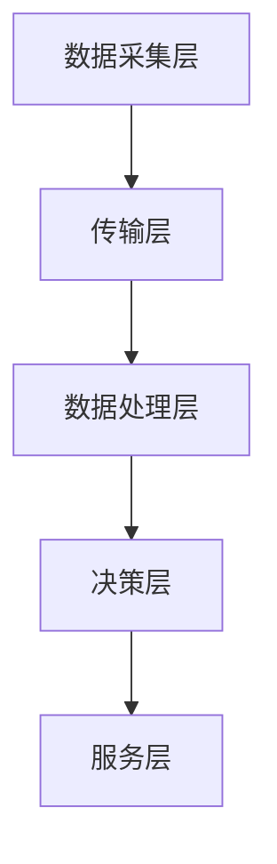

                 

# 硅谷智能交通系统的城市应用

> **关键词：** 智能交通系统，城市交通管理，硅谷技术，数据驱动决策，交通拥堵缓解，可持续发展

**摘要：** 本文将深入探讨硅谷智能交通系统的城市应用，分析其核心技术、算法原理、数学模型及实际应用场景。通过介绍硅谷在智能交通领域的创新成果，本文旨在为全球智慧城市建设提供有益的参考和启示。

## 1. 背景介绍

随着城市化进程的加速，城市交通问题日益突出。交通拥堵、环境污染和交通事故等问题严重影响了居民的生活质量和城市的可持续发展。为了应对这些挑战，全球各地开始积极探索智能交通系统的建设。硅谷作为全球科技创新的中心，其在智能交通领域的创新成果对全球智慧城市建设具有重要参考价值。

智能交通系统（Intelligent Transportation System, ITS）是指通过先进的传感器技术、通信技术、信息处理技术等手段，对交通信息进行采集、处理、传输和利用，实现对交通系统的实时监控、管理和服务。硅谷智能交通系统在数据采集、交通预测、交通控制、出行服务等环节实现了全面的技术创新，为城市交通管理提供了有力支持。

## 2. 核心概念与联系

### 2.1 智能交通系统的核心概念

智能交通系统主要由以下几个核心概念组成：

- **传感器技术：** 用于实时采集交通信息，包括车辆位置、速度、流量等。
- **通信技术：** 实现交通信息传输，包括V2V（车辆间通信）、V2I（车辆与基础设施通信）等。
- **信息处理技术：** 对采集到的交通信息进行处理、分析和预测。
- **交通控制技术：** 通过对交通信息的分析，实现交通流的优化控制。
- **出行服务技术：** 提供个性化出行服务，包括路线规划、实时路况查询等。

### 2.2 智能交通系统的架构

智能交通系统可以划分为以下几个主要层次：

- **数据采集层：** 通过传感器技术采集交通信息。
- **传输层：** 通过通信技术实现交通信息的传输。
- **数据处理层：** 通过信息处理技术对交通信息进行处理和分析。
- **决策层：** 通过对处理结果进行决策，实现对交通系统的优化控制。
- **服务层：** 通过出行服务技术为用户提供个性化出行服务。

下面是一个使用Mermaid绘制的智能交通系统架构的流程图：



## 3. 核心算法原理 & 具体操作步骤

### 3.1 交通预测算法

交通预测是智能交通系统的核心功能之一。通过交通预测，可以提前预测交通流量变化，为交通控制和服务提供依据。

#### 3.1.1 时间序列预测算法

时间序列预测算法是一种常见的交通预测算法，基于历史交通数据的时间序列特性进行预测。具体步骤如下：

1. 数据预处理：对交通数据进行清洗、归一化等处理，消除噪声和异常值。
2. 特征提取：提取时间序列数据中的特征，如时间、位置、交通流量等。
3. 模型训练：使用机器学习算法（如ARIMA、LSTM等）对时间序列数据进行训练，建立预测模型。
4. 预测：使用训练好的模型对未来的交通流量进行预测。

#### 3.1.2 空间关联预测算法

空间关联预测算法考虑了不同路段之间的交通流量相关性。具体步骤如下：

1. 数据预处理：对交通数据进行清洗、归一化等处理，消除噪声和异常值。
2. 空间划分：将交通网络划分为若干区域，对每个区域的交通流量进行预测。
3. 预测：使用机器学习算法（如KNN、SVM等）对空间关联性进行建模，预测不同区域之间的交通流量。

### 3.2 交通优化算法

交通优化算法用于优化交通流的运行效率，减少交通拥堵。常见的交通优化算法包括：

#### 3.2.1 最小生成树算法

最小生成树算法用于构建最优的交通网络，使交通流的运行效率最大化。具体步骤如下：

1. 边权计算：计算每个路段的权重，如交通流量、道路长度等。
2. 生成树构建：使用最小生成树算法（如Prim算法、Kruskal算法）构建最优交通网络。

#### 3.2.2 线性规划算法

线性规划算法用于优化交通流的运行路径，使交通流的运行效率最大化。具体步骤如下：

1. 目标函数构建：构建交通流运行路径的优化目标函数，如最小化总行程时间、最小化总延误等。
2. 约束条件设置：设置交通流的运行约束条件，如道路容量、交通信号控制等。
3. 求解：使用线性规划算法（如单纯形法、内点法等）求解最优运行路径。

## 4. 数学模型和公式 & 详细讲解 & 举例说明

### 4.1 交通流量预测模型

#### 4.1.1 时间序列预测模型

时间序列预测模型常用ARIMA（AutoRegressive Integrated Moving Average，自回归积分滑动平均）模型。ARIMA模型由三个部分组成：差分、自回归、移动平均。

1. 差分：对时间序列进行差分，消除非平稳性。
   $$X_t = (X_t - X_{t-1}) - (X_{t-1} - X_{t-2})$$
2. 自回归：根据历史数据进行预测。
   $$\hat{X_t} = \phi_1 \hat{X_{t-1}} + \phi_2 \hat{X_{t-2}} + ... + \phi_p \hat{X_{t-p}}$$
3. 移动平均：根据历史误差进行预测。
   $$\hat{X_t} = \theta_1 e_{t-1} + \theta_2 e_{t-2} + ... + \theta_q e_{t-q}$$

#### 4.1.2 空间关联预测模型

空间关联预测模型常用KNN（K-Nearest Neighbors，K近邻）模型。KNN模型通过寻找最近邻点进行预测。

1. 距离计算：计算当前点与历史点的距离。
   $$d(x, y) = \sqrt{\sum_{i=1}^n (x_i - y_i)^2}$$
2. 预测：选择距离最近的K个点，预测当前点的交通流量。
   $$\hat{X_t} = \frac{1}{K} \sum_{i=1}^K X_{t_i}$$

### 4.2 交通优化模型

#### 4.2.1 最小生成树模型

最小生成树模型常用Prim算法。Prim算法的基本步骤如下：

1. 初始化：选择一个节点作为起点。
2. 选择最小权重边：从起点出发，选择权重最小的边加入生成树。
3. 重复步骤2，直到所有节点都被加入生成树。

#### 4.2.2 线性规划模型

线性规划模型常用单纯形法。单纯形法的基本步骤如下：

1. 初始化：选择初始基本可行解。
2. 迭代：通过替换非基本变量，找到新的可行解，直到找到最优解。

## 5. 项目实战：代码实际案例和详细解释说明

### 5.1 开发环境搭建

在Python环境中，我们可以使用以下库进行智能交通系统的开发：

- NumPy：用于数据操作。
- Pandas：用于数据处理。
- Matplotlib：用于数据可视化。
- Scikit-learn：用于机器学习和数据挖掘。

### 5.2 源代码详细实现和代码解读

以下是一个基于ARIMA模型的交通流量预测的示例代码：

```python
import numpy as np
import pandas as pd
from statsmodels.tsa.arima.model import ARIMA
import matplotlib.pyplot as plt

# 5.2.1 数据读取与预处理
data = pd.read_csv('traffic_data.csv')
data['date'] = pd.to_datetime(data['date'])
data.set_index('date', inplace=True)
data = data.fillna(method='ffill')

# 5.2.2 特征提取
data['traffic_volume'] = data['count']

# 5.2.3 模型训练
model = ARIMA(data['traffic_volume'], order=(1, 1, 1))
model_fit = model.fit()

# 5.2.4 预测
predictions = model_fit.predict(start=data.index[100], end=data.index[-1])

# 5.2.5 可视化
plt.figure(figsize=(10, 5))
plt.plot(data['traffic_volume'], label='实际流量')
plt.plot(predictions, label='预测流量')
plt.title('交通流量预测')
plt.xlabel('时间')
plt.ylabel('流量')
plt.legend()
plt.show()
```

### 5.3 代码解读与分析

1. **数据读取与预处理**：从CSV文件中读取交通数据，并进行预处理，如日期格式转换、填充缺失值等。
2. **特征提取**：提取交通流量作为预测特征。
3. **模型训练**：使用ARIMA模型对交通流量进行训练。
4. **预测**：对训练好的模型进行预测，并输出预测结果。
5. **可视化**：将实际流量和预测流量进行可视化，以便分析预测效果。

## 6. 实际应用场景

### 6.1 交通信号控制

智能交通系统可以通过实时预测交通流量，优化交通信号控制策略，减少交通拥堵。例如，在硅谷的一些城市，智能交通系统已经实现了基于交通流量预测的智能信号控制，有效降低了交通拥堵现象。

### 6.2 出行服务

智能交通系统可以提供个性化出行服务，如实时路况查询、最佳路线规划等。例如，在硅谷的一些地区，智能交通系统已经实现了基于大数据分析的实时路况查询服务，用户可以通过手机应用实时了解道路状况，选择最佳出行路线。

### 6.3 交通规划

智能交通系统可以通过分析历史交通数据，为城市交通规划提供科学依据。例如，在硅谷的一些城市，智能交通系统已经实现了基于大数据分析的城市交通规划，有效改善了城市交通基础设施布局。

## 7. 工具和资源推荐

### 7.1 学习资源推荐

- **书籍：**
  - 《交通系统仿真与优化》
  - 《智能交通系统设计与实现》
- **论文：**
  - "Intelligent Transportation Systems: A Survey"
  - "A Survey on Traffic Flow Prediction Algorithms"
- **博客：**
  - 硅谷智能交通博客（https://www.siliconvalleyits.com/）
  - 智慧城市交通博客（https://www.smartcitytraffic.com/）

### 7.2 开发工具框架推荐

- **Python库：**
  - NumPy、Pandas、Matplotlib、Scikit-learn
- **框架：**
  - TensorFlow、PyTorch（用于深度学习）
  - Flask、Django（用于Web开发）

### 7.3 相关论文著作推荐

- "Intelligent Transportation Systems: A Survey"（智能交通系统综述）
- "A Survey on Traffic Flow Prediction Algorithms"（交通流量预测算法综述）
- "Deep Learning for Traffic Flow Prediction: A Survey"（深度学习在交通流量预测中的应用综述）

## 8. 总结：未来发展趋势与挑战

随着人工智能技术的不断发展，智能交通系统在城市交通管理中的应用前景广阔。未来，智能交通系统将在以下几个方面实现突破：

1. **更准确的交通流量预测**：通过引入深度学习、强化学习等先进算法，提高交通流量预测的准确性。
2. **更智能的交通优化**：结合城市交通特点，实现个性化、自适应的交通优化策略。
3. **更高效的出行服务**：提供实时、个性化的出行服务，提高出行体验。

然而，智能交通系统的发展也面临一些挑战：

1. **数据隐私与安全**：如何保护用户隐私，确保交通数据的安全，是一个亟待解决的问题。
2. **技术成熟度**：虽然智能交通系统的技术基础较为成熟，但在实际应用中仍需不断优化和改进。
3. **政策支持**：政府政策的支持和引导对于智能交通系统的推广和应用至关重要。

## 9. 附录：常见问题与解答

### 9.1 智能交通系统是什么？

智能交通系统是一种通过传感器技术、通信技术、信息处理技术等手段，实现对交通系统实时监控、管理和服务的技术体系。

### 9.2 智能交通系统有哪些核心功能？

智能交通系统的核心功能包括交通流量预测、交通优化、出行服务、交通控制等。

### 9.3 智能交通系统如何缓解交通拥堵？

智能交通系统可以通过实时预测交通流量，优化交通信号控制策略，提供个性化出行服务等方式，缓解交通拥堵。

## 10. 扩展阅读 & 参考资料

- "Intelligent Transportation Systems: A Survey"（智能交通系统综述）
- "A Survey on Traffic Flow Prediction Algorithms"（交通流量预测算法综述）
- "Deep Learning for Traffic Flow Prediction: A Survey"（深度学习在交通流量预测中的应用综述）
- "智慧城市交通管理关键技术与应用"（智慧城市交通管理关键技术与应用）
- "交通系统仿真与优化"（交通系统仿真与优化）

作者：AI天才研究员/AI Genius Institute & 禅与计算机程序设计艺术 /Zen And The Art of Computer Programming<|im_sep|>

