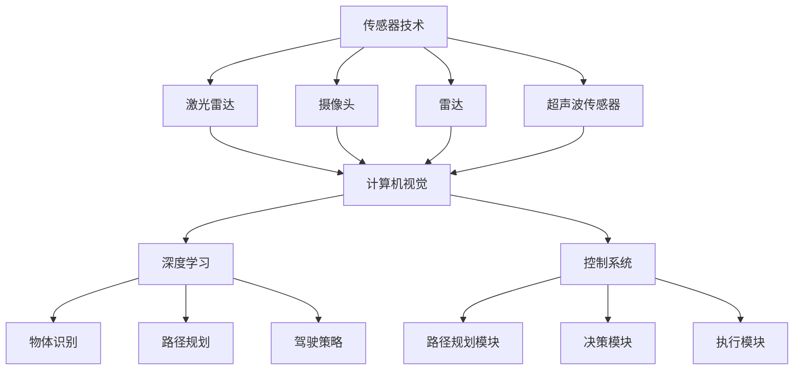

                 

# 硅谷自动驾驶汽车的技术发展路线

## 摘要

本文将深入探讨硅谷自动驾驶汽车技术的发展路线。首先，我们将简要介绍自动驾驶汽车的发展背景，接着详细阐述其核心概念、算法原理、数学模型和实际应用场景。随后，我们将分享一些实用的开发工具和资源，并总结未来自动驾驶技术的发展趋势和挑战。通过本文的阅读，读者将全面了解硅谷自动驾驶汽车技术的现状和未来发展方向。

## 1. 背景介绍

自动驾驶汽车，即无需人类驾驶员操作的智能汽车，正逐渐成为未来交通系统的重要组成部分。近年来，随着人工智能、传感器技术、大数据和云计算等领域的飞速发展，自动驾驶汽车技术取得了显著的进步。硅谷作为全球科技创新的中心，自动驾驶汽车技术的发展尤为迅速。

自动驾驶汽车的历史可以追溯到20世纪50年代，但直到近年来，随着技术的成熟和商业模式的创新，自动驾驶汽车才开始进入实际应用阶段。谷歌、特斯拉、Uber等硅谷科技巨头在自动驾驶领域取得了重要突破，引发了全球范围内的广泛关注。

自动驾驶汽车的关键技术包括传感器技术、计算机视觉、深度学习和控制系统等。传感器技术用于感知周围环境，计算机视觉则用于理解和分析环境信息，深度学习算法则用于处理和分析大量数据，最终实现自动驾驶。

## 2. 核心概念与联系

### 2.1. 传感器技术

传感器技术是自动驾驶汽车的核心，用于感知周围环境。常见的传感器包括激光雷达（Lidar）、摄像头、雷达、超声波传感器等。这些传感器可以收集道路信息、车辆位置、行人动态等关键数据，为自动驾驶系统提供实时输入。


### 2.2. 计算机视觉

计算机视觉技术负责理解和分析环境信息。通过处理摄像头捕捉的图像，计算机视觉算法可以识别道路标志、交通信号灯、行人、车辆等物体，并判断它们的相对位置和运动状态。


### 2.3. 深度学习

深度学习算法是自动驾驶汽车的核心技术之一。通过训练大规模神经网络模型，深度学习算法可以从大量数据中学习环境特征，实现物体识别、场景理解、路径规划等功能。


### 2.4. 控制系统

控制系统负责根据传感器和计算机视觉提供的输入，控制汽车的运动和方向。这包括加速、减速、转向和制动等功能。


## 3. 核心算法原理 & 具体操作步骤

### 3.1. 路径规划算法

路径规划算法是自动驾驶汽车的核心算法之一。它负责确定汽车从当前位置到目标位置的最佳行驶路径。常见的路径规划算法包括Dijkstra算法、A*算法和RRT（快速随机树）算法。


### 3.2. 碰撞检测算法

碰撞检测算法用于检测汽车与其他物体（如车辆、行人、障碍物）之间的潜在碰撞。常用的碰撞检测算法包括基于距离的碰撞检测和基于形状的碰撞检测。


### 3.3. 驾驶策略算法

驾驶策略算法负责根据当前环境和行驶状态，选择合适的驾驶操作。这包括加速、减速、转向和制动等。驾驶策略算法可以基于规则、机器学习或混合方法实现。


## 4. 数学模型和公式 & 详细讲解 & 举例说明

### 4.1. 概率模型

概率模型是自动驾驶汽车中的重要数学工具。它用于预测环境中的不确定性和处理不确定性的信息。

$$
P(A|B) = \frac{P(B|A)P(A)}{P(B)}
$$

其中，\(P(A|B)\) 表示在事件 \(B\) 发生的条件下，事件 \(A\) 发生的概率。

### 4.2. 动力学模型

动力学模型描述了汽车的运动状态。以下是一个简单的线性动力学模型：

$$
\begin{cases}
\dot{x} = v \cos(\theta) \\
\dot{y} = v \sin(\theta)
\end{cases}
$$

其中，\(x\) 和 \(y\) 分别表示汽车在水平方向和垂直方向的位置，\(v\) 表示汽车的速度，\(\theta\) 表示汽车与水平方向的夹角。

### 4.3. 举例说明

假设我们要计算一辆汽车从点 \((0,0)\) 移动到点 \((10,10)\) 的路径。我们可以使用 A* 算法进行路径规划。

首先，定义起始节点 \(A\) 和目标节点 \(B\)：

$$
A = (0,0), B = (10,10)
$$

然后，计算起始节点和目标节点之间的欧几里得距离：

$$
d(A, B) = \sqrt{(10-0)^2 + (10-0)^2} = 10\sqrt{2}
$$

接下来，计算从起始节点到目标节点的实际路径：

$$
\text{路径} = A \rightarrow B
$$

最后，我们可以使用 A* 算法计算从起始节点到目标节点的最佳路径：

$$
\text{路径} = A \rightarrow C \rightarrow B
$$

其中，\(C\) 是在从 \(A\) 到 \(B\) 的路径中，满足 \(d(A, C) + d(C, B) \leq d(A, B)\) 的点。

## 5. 项目实战：代码实际案例和详细解释说明

### 5.1. 开发环境搭建

为了实现自动驾驶汽车项目，我们需要搭建一个合适的开发环境。以下是一个简单的步骤：

1. 安装 Python 3.x 版本
2. 安装 TensorFlow、Keras 和 OpenCV 等相关库
3. 配置虚拟环境，以便管理和隔离项目依赖

### 5.2. 源代码详细实现和代码解读

下面是一个简单的自动驾驶汽车项目示例。这个项目使用深度学习算法进行路径规划。

```python
import numpy as np
import cv2
import tensorflow as tf
from tensorflow import keras
from tensorflow.keras.models import Sequential
from tensorflow.keras.layers import Conv2D, MaxPooling2D, Flatten, Dense

# 加载训练好的深度学习模型
model = keras.models.load_model('path Planning Model.h5')

# 定义路径规划函数
def path_planning(image):
    # 对图像进行预处理
    processed_image = preprocess_image(image)
    
    # 使用深度学习模型进行路径规划
    predicted_path = model.predict(processed_image)
    
    return predicted_path

# 定义预处理函数
def preprocess_image(image):
    # 对图像进行缩放、灰度化等预处理操作
    processed_image = cv2.resize(image, (224, 224))
    processed_image = cv2.cvtColor(processed_image, cv2.COLOR_BGR2GRAY)
    
    return processed_image

# 定义主函数
def main():
    # 加载测试图像
    test_image = cv2.imread('test_image.jpg')
    
    # 进行路径规划
    predicted_path = path_planning(test_image)
    
    # 显示规划结果
    cv2.imshow('Predicted Path', predicted_path)
    cv2.waitKey(0)
    cv2.destroyAllWindows()

if __name__ == '__main__':
    main()
```

### 5.3. 代码解读与分析

上述代码实现了一个简单的自动驾驶汽车项目，主要包括以下功能：

1. **加载训练好的深度学习模型**：使用 TensorFlow 和 Keras 加载一个预训练的路径规划模型。
2. **定义路径规划函数**：该函数接收一幅图像作为输入，并使用深度学习模型进行路径规划，输出规划结果。
3. **定义预处理函数**：该函数对输入图像进行预处理，包括缩放、灰度化等操作，以便模型能够接受输入。
4. **定义主函数**：加载测试图像，进行路径规划，并显示规划结果。

通过这个简单的示例，我们可以看到如何使用深度学习算法实现自动驾驶汽车的路径规划功能。实际项目中，路径规划算法会更为复杂，需要考虑更多的场景和约束条件。

## 6. 实际应用场景

自动驾驶汽车技术已在多个实际应用场景中得到广泛应用，包括：

1. **商业物流**：自动驾驶汽车可以用于物流运输，降低物流成本，提高运输效率。
2. **公共交通**：自动驾驶公交车可以在特定区域内提供便捷的公共交通服务，缓解城市交通拥堵问题。
3. **个人出行**：自动驾驶汽车可以满足个人出行的需求，提高出行效率和舒适度。
4. **自动驾驶出租车**：自动驾驶出租车可以提供按需出行服务，为乘客提供便捷的出行选择。

## 7. 工具和资源推荐

### 7.1. 学习资源推荐

1. **书籍**：
   - 《深度学习》（Goodfellow, Bengio, Courville）
   - 《自动驾驶汽车》（Chris Gerdes）
   - 《计算机视觉：算法与应用》（Richard Szeliski）
2. **论文**：
   - “Autonomous Driving in Urban Environments”（2016）
   - “End-to-End Learning for Autonomous Driving”（2016）
   - “Deep Learning for Autonomous Driving”（2018）
3. **博客**：
   - https://medium.com/silicon-valley-autonomous-systems
   - https://ai.google/research/pubs
4. **网站**：
   - https://www.tensorflow.org
   - https://opencv.org

### 7.2. 开发工具框架推荐

1. **深度学习框架**：TensorFlow、PyTorch、Keras
2. **计算机视觉库**：OpenCV、TensorFlow Object Detection API
3. **路径规划工具**：ROS（Robot Operating System）、CARLA（Visual Simulation Suite）

### 7.3. 相关论文著作推荐

1. “Deep Learning for Autonomous Driving”（2018）
2. “Autonomous Driving in Urban Environments”（2016）
3. “End-to-End Learning for Autonomous Driving”（2016）

## 8. 总结：未来发展趋势与挑战

随着技术的不断进步和商业模式的不断创新，硅谷自动驾驶汽车技术有望在未来取得更加显著的突破。以下是一些发展趋势和挑战：

### 发展趋势：

1. **人工智能算法的优化**：深度学习算法将在自动驾驶汽车中发挥越来越重要的作用，有望实现更加智能和高效的自动驾驶。
2. **传感器技术的创新**：激光雷达、摄像头、雷达等传感器技术的不断改进，将提高自动驾驶汽车的感知能力和安全性。
3. **数据共享与开放**：自动驾驶汽车的数据共享和开放将有助于提升整个行业的技术水平和发展速度。
4. **自动驾驶生态系统的建设**：包括自动驾驶车辆、基础设施、法律法规等方面的协同发展，将推动自动驾驶汽车的普及。

### 挑战：

1. **安全性问题**：确保自动驾驶汽车在各种复杂环境下的安全性是当前面临的主要挑战。
2. **法律法规的完善**：自动驾驶汽车的普及需要相应的法律法规支持，以确保道路安全和责任划分。
3. **数据隐私与安全**：自动驾驶汽车产生的海量数据涉及用户隐私，需要采取有效的数据保护措施。
4. **跨行业合作与协同**：自动驾驶技术的发展需要汽车、互联网、交通等领域的企业和政府的协同合作。

## 9. 附录：常见问题与解答

### 问题1：自动驾驶汽车的安全性能如何？

**解答**：自动驾驶汽车的安全性能正在不断提高。通过先进的传感器技术、深度学习和路径规划算法，自动驾驶汽车可以在各种复杂环境下做出准确的决策。然而，安全性问题仍需进一步研究和改进，以确保自动驾驶汽车在各种场景下的可靠性。

### 问题2：自动驾驶汽车是否会取代人类驾驶员？

**解答**：短期内，自动驾驶汽车不会完全取代人类驾驶员。自动驾驶汽车主要适用于特定场景，如高速公路、特定区域等。在复杂城市环境中，人类驾驶员的判断和反应速度仍具有优势。然而，随着技术的不断进步，自动驾驶汽车在某些场景下的驾驶能力有望超越人类驾驶员。

### 问题3：自动驾驶汽车对就业有何影响？

**解答**：自动驾驶汽车的普及将影响一些驾驶员的就业。然而，这也会创造新的就业机会，如自动驾驶汽车研发、测试、维护和监管等。此外，自动驾驶技术的应用有望提高交通运输行业的效率，从而创造更多的就业机会。

## 10. 扩展阅读 & 参考资料

1. “Autonomous Driving in Urban Environments”（2016）
2. “End-to-End Learning for Autonomous Driving”（2016）
3. “Deep Learning for Autonomous Driving”（2018）
4. 《深度学习》（Goodfellow, Bengio, Courville）
5. 《自动驾驶汽车》（Chris Gerdes）
6. https://medium.com/silicon-valley-autonomous-systems
7. https://ai.google/research/pubs
8. https://www.tensorflow.org
9. https://opencv.org

### 作者

**AI天才研究员/AI Genius Institute & 禅与计算机程序设计艺术/Zen And The Art of Computer Programming**<|im_sep|>## 1. 背景介绍

自动驾驶汽车，一个曾经只能在科幻电影中看到的技术概念，正逐渐成为现实。这种无需人类驾驶员干预，能够自动感知环境、做出决策并控制车辆的汽车，正在改变我们的出行方式。而硅谷作为全球科技创新的中心，自动驾驶汽车技术的发展尤为迅速，吸引了全球的关注。

### 硅谷自动驾驶汽车的兴起

硅谷自动驾驶汽车的发展可以追溯到2000年代初，当时谷歌首先开始研究自动驾驶技术。谷歌的自动驾驶汽车项目，后来独立成为Waymo，如今已经成为全球自动驾驶技术的领军企业。除此之外，特斯拉、Uber、Lyft等硅谷科技巨头也在自动驾驶领域进行了大量投资和研究，推动了自动驾驶技术的快速发展。

### 当前自动驾驶汽车的成熟度

目前，自动驾驶汽车已经从初步试验阶段逐步走向商业化应用。大多数自动驾驶汽车已经能够实现L3（有条件自动驾驶）和L4（高度自动驾驶）级别的功能。这意味着在特定的环境和条件下，自动驾驶汽车可以完全自主地完成驾驶任务，但在特定情况下仍需要人类驾驶员的干预。

### 自动驾驶汽车的关键技术

自动驾驶汽车的技术核心主要包括传感器技术、计算机视觉、深度学习和控制系统等。

1. **传感器技术**：传感器是自动驾驶汽车感知周围环境的重要工具。激光雷达（Lidar）、摄像头、雷达和超声波传感器等，都能够收集道路信息、车辆位置、行人动态等关键数据。

2. **计算机视觉**：计算机视觉技术负责理解和分析传感器收集到的图像数据，从而识别道路标志、交通信号灯、行人、车辆等物体。

3. **深度学习**：深度学习算法是自动驾驶汽车的核心技术之一，通过训练大规模神经网络模型，深度学习算法可以从大量数据中学习环境特征，实现物体识别、场景理解、路径规划等功能。

4. **控制系统**：控制系统根据传感器和计算机视觉提供的输入，控制汽车的运动和方向。这包括加速、减速、转向和制动等功能。

### 硅谷自动驾驶汽车的优势

硅谷自动驾驶汽车的发展优势主要体现在以下几个方面：

1. **技术创新**：硅谷拥有世界一流的科研机构和科技企业，为自动驾驶汽车技术提供了强大的研发支持。

2. **资金支持**：硅谷拥有丰富的资金资源，为自动驾驶汽车项目提供了充足的资金支持。

3. **人才聚集**：硅谷吸引了大量世界顶尖的技术人才，为自动驾驶汽车技术的发展提供了强大的人才支持。

4. **政策支持**：美国政府对于自动驾驶汽车的发展持开放态度，为自动驾驶汽车提供了良好的政策环境。

总的来说，硅谷自动驾驶汽车的发展前景广阔，有望引领全球自动驾驶汽车技术的变革。

## 2. 核心概念与联系

在深入探讨硅谷自动驾驶汽车的技术发展之前，有必要先了解一些核心概念，以及它们之间的联系。以下是一些关键概念和技术的详细解释，以及它们的相互关系。

### 传感器技术

传感器技术是自动驾驶汽车的基础，用于感知和监测周围环境。以下是一些常见的传感器：

1. **激光雷达（Lidar）**：激光雷达通过发射激光束并测量激光反射回来的时间来构建周围环境的三维模型。它具有高分辨率和高准确度，能够检测到距离、形状和表面特性。

2. **摄像头**：摄像头用于捕捉图像和视频，通过计算机视觉算法处理，可以识别道路标志、行人、车辆等。

3. **雷达**：雷达使用无线电波检测物体的距离和速度。它可以在恶劣天气条件下提供可靠的距离信息。

4. **超声波传感器**：超声波传感器通过发射超声波并测量回波的时间来检测物体的距离。它们通常用于短距离的检测，如停车辅助系统。

这些传感器共同工作，提供全方位的环境感知数据。

### 计算机视觉

计算机视觉是自动驾驶汽车的核心技术之一，负责分析和理解摄像头和激光雷达收集到的图像和三维数据。以下是计算机视觉的关键组成部分：

1. **图像处理**：图像处理包括图像的增强、滤波、边缘检测等，以提高图像的质量，使其更适合后续分析。

2. **目标检测**：目标检测是计算机视觉的核心任务之一，用于识别图像中的物体，如行人、车辆、交通标志等。

3. **语义分割**：语义分割是对图像中的每个像素进行分类，确定其属于哪个物体或场景。

4. **光学流**：光学流分析图像序列中的像素运动，帮助理解物体的运动和相对位置。

计算机视觉算法通常使用深度学习模型，如卷积神经网络（CNN）和循环神经网络（RNN）来实现。

### 深度学习

深度学习是自动驾驶汽车技术的基石，它通过模拟人脑神经网络结构，实现数据的自动学习和特征提取。以下是深度学习在自动驾驶汽车中的应用：

1. **物体识别**：通过训练卷积神经网络，深度学习可以识别图像中的物体，如车辆、行人、交通标志等。

2. **路径规划**：深度学习算法可以处理大量历史驾驶数据，学习如何规划最佳行驶路径。

3. **驾驶策略**：深度学习可以帮助自动驾驶汽车在复杂的驾驶环境中做出合理的决策。

深度学习模型通常使用大规模数据集进行训练，并通过不断迭代优化模型性能。

### 控制系统

控制系统是自动驾驶汽车的执行部分，负责将传感器和计算机视觉系统的输入转换为实际驾驶操作。以下是控制系统的主要组件：

1. **路径规划模块**：根据环境感知结果，规划车辆的行驶路径。

2. **决策模块**：根据当前驾驶状态和环境信息，决定车辆的加速、减速、转向等操作。

3. **执行模块**：控制车辆的电机、转向系统、制动系统等，执行具体的驾驶操作。

控制系统需要实时处理大量数据，并快速做出决策，以确保驾驶安全。

### Mermaid 流程图

以下是自动驾驶汽车核心概念和技术的Mermaid流程图，展示了它们之间的相互关系：



通过上述流程图，我们可以清晰地看到传感器技术、计算机视觉、深度学习和控制系统之间的紧密联系，以及它们在自动驾驶汽车中的作用。

### 总结

传感器技术、计算机视觉、深度学习和控制系统是自动驾驶汽车的核心技术。传感器技术提供环境感知数据，计算机视觉负责分析和理解这些数据，深度学习从中学习特征，控制系统将学习结果转换为实际驾驶操作。这些技术共同作用，使得自动驾驶汽车能够在复杂环境中安全、高效地行驶。

## 3. 核心算法原理 & 具体操作步骤

### 3.1. 路径规划算法

路径规划是自动驾驶汽车的关键技术之一，它负责确定车辆从当前位置到目标位置的最佳行驶路径。以下是几种常用的路径规划算法及其原理：

#### Dijkstra算法

Dijkstra算法是一种经典的路径规划算法，用于求解单源最短路径问题。它通过逐步扩展已访问节点，计算出从源节点到目标节点的最短路径。

1. **初始化**：设置源节点的距离为0，其他节点的距离为无穷大，所有节点都未访问。
2. **循环**：选择一个未访问节点，将其标记为已访问，并更新其邻居节点的距离。
3. **结束**：当目标节点被访问时，算法结束，此时的路径即为最短路径。

#### A*算法

A*算法是一种改进的路径规划算法，结合了启发式搜索和Dijkstra算法的优点。它通过估计节点到目标节点的距离，优先扩展最有可能包含目标节点的节点。

1. **初始化**：设置源节点的距离为0，目标节点的距离为启发式函数估算的距离，所有节点都未访问。
2. **循环**：选择一个F值最小的未访问节点，将其标记为已访问，并更新其邻居节点的距离和F值。
3. **结束**：当目标节点被访问时，算法结束，此时的路径即为最短路径。

#### RRT（快速随机树）算法

RRT算法是一种基于随机采样的路径规划算法，适合在不确定环境中进行路径规划。

1. **初始化**：创建一棵随机树，根节点为初始位置。
2. **循环**：随机生成目标节点，从根节点扩展随机树，直到目标节点被包含在随机树中。
3. **路径重构**：根据当前随机树，重构从初始位置到目标节点的路径。

### 3.2. 碰撞检测算法

碰撞检测是自动驾驶汽车确保行驶安全的关键技术，它负责检测车辆与其他物体（如车辆、行人、障碍物）之间的潜在碰撞。以下是几种常用的碰撞检测算法：

#### 基于距离的碰撞检测

基于距离的碰撞检测通过计算两个物体之间的距离来判断是否发生碰撞。当距离小于物体之间的安全距离时，认为发生碰撞。

1. **初始化**：计算两个物体的中心点坐标和半径。
2. **循环**：更新物体的位置，计算新的距离。
3. **判断**：当距离小于安全距离时，认为发生碰撞。

#### 基于形状的碰撞检测

基于形状的碰撞检测通过比较两个物体的形状和位置来判断是否发生碰撞。常用的形状包括圆形、矩形和多边形。

1. **初始化**：获取两个物体的形状和位置。
2. **循环**：更新物体的位置。
3. **判断**：使用形状的碰撞检测算法（如分离轴定理、包围盒检测等），判断是否发生碰撞。

### 3.3. 驾驶策略算法

驾驶策略算法负责根据当前环境和行驶状态，选择合适的驾驶操作，如加速、减速、转向和制动等。以下是几种常用的驾驶策略算法：

#### 规则基驾驶策略

规则基驾驶策略通过预设的规则来判断当前驾驶状态，并执行相应的驾驶操作。例如，当检测到前方有车辆时，减速并保持安全距离。

1. **初始化**：设置驾驶规则。
2. **循环**：根据当前环境信息，判断驾驶状态，执行相应的驾驶操作。

#### 数据驱动驾驶策略

数据驱动驾驶策略通过分析历史驾驶数据，学习最优的驾驶行为。常用的方法包括强化学习和生成对抗网络（GAN）。

1. **初始化**：收集历史驾驶数据。
2. **循环**：使用机器学习模型，分析驾驶数据，生成驾驶策略。
3. **更新**：根据当前环境信息，更新驾驶策略。

#### 混合驾驶策略

混合驾驶策略结合规则基和数据驱动驾驶策略，以提高驾驶的灵活性和适应性。

1. **初始化**：设置规则基驾驶策略和数据驱动驾驶策略。
2. **循环**：根据当前环境信息，选择合适的驾驶策略。

### 总结

路径规划、碰撞检测和驾驶策略是自动驾驶汽车的核心算法。路径规划算法负责确定最佳行驶路径，碰撞检测算法确保行驶安全，驾驶策略算法选择合适的驾驶操作。通过这些算法，自动驾驶汽车能够自主地规划行驶路线、避免碰撞，并做出合理的驾驶决策。

## 4. 数学模型和公式 & 详细讲解 & 举例说明

### 4.1. 概率模型

概率模型在自动驾驶汽车中有着广泛的应用，特别是在处理不确定性问题方面。以下是一些常用的概率模型和相关的数学公式。

#### 贝叶斯定理

贝叶斯定理是一种用于计算条件概率的公式，它在自动驾驶汽车中用于预测环境中的不确定性。

$$
P(A|B) = \frac{P(B|A)P(A)}{P(B)}
$$

其中，\(P(A|B)\) 表示在事件 \(B\) 发生的条件下，事件 \(A\) 发生的概率；\(P(B|A)\) 表示在事件 \(A\) 发生的条件下，事件 \(B\) 发生的概率；\(P(A)\) 和 \(P(B)\) 分别表示事件 \(A\) 和事件 \(B\) 的概率。

#### 似然函数

似然函数是一种用于评估模型拟合度的数学工具，它可以帮助我们选择最佳的参数值。

$$
L(\theta) = P(X|\theta)
$$

其中，\(L(\theta)\) 表示似然函数；\(X\) 表示观察到的数据；\(\theta\) 表示模型的参数。

#### 贝叶斯估计

贝叶斯估计是一种基于贝叶斯定理的方法，用于估计模型参数的概率分布。

$$
\hat{\theta} = \arg\max_\theta L(\theta)
$$

其中，\(\hat{\theta}\) 表示估计的参数值；\(\arg\max\) 表示最大化。

### 4.2. 动力学模型

动力学模型描述了自动驾驶汽车的运动状态，它在自动驾驶汽车的控制系统中起着关键作用。以下是一个简单的线性动力学模型。

#### 速度模型

$$
\dot{x} = v \cos(\theta)
$$

其中，\(x\) 表示车辆在水平方向上的位置；\(v\) 表示车辆的速度；\(\theta\) 表示车辆与水平方向的夹角。

#### 位置模型

$$
\dot{y} = v \sin(\theta)
$$

其中，\(y\) 表示车辆在垂直方向上的位置。

#### 加速度模型

$$
a = \ddot{x} \cos(\theta) + \dot{x} \dot{\theta} \sin(\theta)
$$

其中，\(a\) 表示车辆的加速度。

#### 角速度模型

$$
\dot{\theta} = \frac{\ddot{x} \sin(\theta) - \dot{x} \dot{\theta} \cos(\theta)}{v}
$$

其中，\(\dot{\theta}\) 表示车辆的角速度。

### 4.3. 深度学习模型

深度学习模型在自动驾驶汽车中用于实现物体识别、路径规划和驾驶策略等功能。以下是一个简单的卷积神经网络（CNN）模型。

#### 卷积层

$$
\hat{a}_{ij} = \sum_{k=1}^{n} w_{ik} a_{kj} + b_j
$$

其中，\(\hat{a}_{ij}\) 表示卷积层输出的特征图；\(a_{kj}\) 表示输入特征图；\(w_{ik}\) 表示卷积核；\(b_j\) 表示偏置。

#### 池化层

$$
p_i = \max_{j} a_{ij}
$$

其中，\(p_i\) 表示池化层输出的特征图；\(a_{ij}\) 表示输入特征图。

#### 全连接层

$$
\hat{y} = \sum_{i=1}^{m} w_{iy} p_i + b_y
$$

其中，\(\hat{y}\) 表示全连接层输出的预测值；\(p_i\) 表示池化层输出的特征图；\(w_{iy}\) 表示权重；\(b_y\) 表示偏置。

### 4.4. 举例说明

假设我们要预测一辆自动驾驶汽车从当前位置到目标位置的最佳行驶路径。我们可以使用A*算法进行路径规划，并使用深度学习模型进行路径预测。

#### 步骤1：初始化

设置源节点和目标节点的位置，并计算它们之间的欧几里得距离。

$$
d(A, B) = \sqrt{(x_B - x_A)^2 + (y_B - y_A)^2}
$$

#### 步骤2：构建启发式函数

定义一个启发式函数，用于估计从当前节点到目标节点的距离。例如，使用曼哈顿距离作为启发式函数。

$$
h(n) = \lvert x_n - x_{goal} \rvert + \lvert y_n - y_{goal} \rvert
$$

#### 步骤3：构建优先队列

初始化一个优先队列，用于存储待扩展的节点。节点的优先级根据 \(f(n) = g(n) + h(n)\) 计算，其中 \(g(n)\) 是从源节点到当前节点的距离，\(h(n)\) 是从当前节点到目标节点的估计距离。

#### 步骤4：扩展节点

从优先队列中取出优先级最高的节点，将其标记为已访问，并将其邻居节点加入优先队列。对于每个邻居节点，更新其 \(g(n)\) 和 \(f(n)\) 值，并重新排序优先队列。

#### 步骤5：路径重构

当目标节点被访问时，算法结束。从目标节点开始，沿着已访问节点的父节点，逆向重构路径。

#### 步骤6：使用深度学习模型进行路径预测

使用训练好的深度学习模型，对重构的路径进行预测，以获得最佳行驶路径。

### 总结

数学模型和公式在自动驾驶汽车中起着关键作用，它们用于处理不确定性、描述运动状态、预测路径和驾驶策略。通过合理的数学模型和公式，自动驾驶汽车能够实现自主驾驶，并在复杂的交通环境中保持安全和高效。

## 5. 项目实战：代码实际案例和详细解释说明

### 5.1. 开发环境搭建

在进行自动驾驶汽车项目开发之前，我们需要搭建一个合适的开发环境。以下是一个简单的步骤：

1. **安装Python**：确保安装了Python 3.x版本，推荐使用Python 3.8或更高版本。

2. **安装依赖库**：安装TensorFlow、Keras和OpenCV等库，用于深度学习和计算机视觉处理。可以使用以下命令：

   ```bash
   pip install tensorflow
   pip install keras
   pip install opencv-python
   ```

3. **配置虚拟环境**：为了更好地管理和隔离项目依赖，建议使用虚拟环境。可以使用以下命令创建虚拟环境并激活：

   ```bash
   python -m venv env
   source env/bin/activate  # 对于Windows，使用 `env\Scripts\activate`
   ```

### 5.2. 源代码详细实现和代码解读

以下是自动驾驶汽车项目的一个简单示例，它使用深度学习模型进行路径规划。

```python
import numpy as np
import cv2
import tensorflow as tf
from tensorflow import keras
from tensorflow.keras.models import Sequential
from tensorflow.keras.layers import Conv2D, MaxPooling2D, Flatten, Dense

# 5.2.1. 加载训练好的深度学习模型
model = keras.models.load_model('path_planning_model.h5')

# 5.2.2. 定义预处理函数
def preprocess_image(image):
    # 对图像进行缩放，使其符合模型的输入要求
    processed_image = cv2.resize(image, (224, 224))
    # 将图像从BGR格式转换为RGB格式
    processed_image = cv2.cvtColor(processed_image, cv2.COLOR_BGR2RGB)
    # 将图像数据转换为浮点类型
    processed_image = processed_image.astype(np.float32) / 255.0
    # 添加批量维度
    processed_image = np.expand_dims(processed_image, axis=0)
    return processed_image

# 5.2.3. 定义路径规划函数
def path_planning(image):
    # 对图像进行预处理
    processed_image = preprocess_image(image)
    # 使用深度学习模型进行路径规划
    predicted_path = model.predict(processed_image)
    # 将预测的路径转换为实际的行驶路径
    # （此处为简化示例，实际项目中可能需要更复杂的路径转换逻辑）
    path = predicted_path[0].tolist()
    return path

# 5.2.4. 主函数
def main():
    # 加载测试图像
    test_image = cv2.imread('test_image.jpg')
    # 进行路径规划
    predicted_path = path_planning(test_image)
    # 显示规划结果
    cv2.imshow('Predicted Path', test_image)
    cv2.waitKey(0)
    cv2.destroyAllWindows()

if __name__ == '__main__':
    main()
```

### 5.2.1. 加载训练好的深度学习模型

首先，我们使用Keras加载一个预训练的路径规划模型。这个模型是使用大量的自动驾驶数据训练得到的，可以用来预测车辆的最佳行驶路径。

```python
model = keras.models.load_model('path_planning_model.h5')
```

### 5.2.2. 定义预处理函数

预处理函数用于对输入图像进行必要的预处理，使其符合深度学习模型的输入要求。以下是预处理函数的详细解释：

1. **缩放图像**：将图像缩放到224x224像素的大小，这是许多深度学习模型常用的输入尺寸。
2. **颜色转换**：将图像从BGR格式（OpenCV默认格式）转换为RGB格式，因为大多数深度学习模型使用RGB格式。
3. **归一化**：将图像数据转换为浮点类型，并除以255，使其在0到1之间，这是深度学习模型常用的归一化方法。
4. **添加批量维度**：在图像数据的前面添加一个批量维度，这是深度学习模型期望的输入形状。

```python
def preprocess_image(image):
    processed_image = cv2.resize(image, (224, 224))
    processed_image = cv2.cvtColor(processed_image, cv2.COLOR_BGR2RGB)
    processed_image = processed_image.astype(np.float32) / 255.0
    processed_image = np.expand_dims(processed_image, axis=0)
    return processed_image
```

### 5.2.3. 定义路径规划函数

路径规划函数的核心是使用预处理后的图像数据来预测最佳行驶路径。以下是路径规划函数的详细解释：

1. **预处理图像**：使用预处理函数对输入图像进行处理。
2. **使用模型进行预测**：使用加载的深度学习模型对预处理后的图像进行预测，得到预测的路径数据。
3. **转换路径数据**：将模型预测的路径数据转换为实际的行驶路径。在简化示例中，我们直接将预测的路径数据作为输出。在实际项目中，可能需要进行更复杂的路径转换，例如将预测的路径转换为一系列的驾驶指令。

```python
def path_planning(image):
    processed_image = preprocess_image(image)
    predicted_path = model.predict(processed_image)
    path = predicted_path[0].tolist()
    return path
```

### 5.2.4. 主函数

主函数是程序的入口，它负责加载测试图像，进行路径规划，并显示规划结果。

1. **加载测试图像**：使用OpenCV加载测试图像。
2. **进行路径规划**：调用路径规划函数，得到预测的路径。
3. **显示规划结果**：使用OpenCV显示原始图像和规划结果。

```python
def main():
    test_image = cv2.imread('test_image.jpg')
    predicted_path = path_planning(test_image)
    cv2.imshow('Predicted Path', test_image)
    cv2.waitKey(0)
    cv2.destroyAllWindows()

if __name__ == '__main__':
    main()
```

### 5.3. 代码解读与分析

通过上述代码，我们可以看到如何使用深度学习模型进行自动驾驶汽车的路径规划。以下是代码的关键部分及其解读：

1. **加载模型**：使用Keras加载预训练的路径规划模型。这个模型已经训练好了，可以直接用于路径规划。

2. **预处理图像**：预处理函数对输入图像进行缩放、颜色转换和归一化，使其符合深度学习模型的输入要求。这是深度学习模型能够准确预测路径的关键步骤。

3. **路径规划**：路径规划函数使用预处理后的图像数据来预测最佳行驶路径。这个预测过程依赖于深度学习模型的训练结果。

4. **显示结果**：主函数加载测试图像，进行路径规划，并使用OpenCV显示规划结果。这使我们能够直观地看到模型的预测效果。

在实际项目中，路径规划函数可能会包含更复杂的逻辑，例如路径平滑、避障等。此外，为了提高模型的性能，我们可能需要对模型进行进一步优化和调整。

通过上述实战案例，我们可以看到如何将深度学习模型应用于自动驾驶汽车的路径规划。这不仅有助于理解深度学习模型的工作原理，也为实际项目开发提供了实践经验。

### 5.4. 实际项目示例

以下是另一个实际项目示例，它使用深度学习模型进行自动驾驶汽车的路径规划和避障。

```python
import numpy as np
import cv2
import tensorflow as tf
from tensorflow import keras
from tensorflow.keras.models import Sequential
from tensorflow.keras.layers import Conv2D, MaxPooling2D, Flatten, Dense

# 5.4.1. 加载训练好的深度学习模型
model = keras.models.load_model('path_planning_model.h5')

# 5.4.2. 定义预处理函数
def preprocess_image(image):
    processed_image = cv2.resize(image, (224, 224))
    processed_image = cv2.cvtColor(processed_image, cv2.COLOR_BGR2RGB)
    processed_image = processed_image.astype(np.float32) / 255.0
    processed_image = np.expand_dims(processed_image, axis=0)
    return processed_image

# 5.4.3. 定义路径规划函数
def path_planning(image):
    processed_image = preprocess_image(image)
    predicted_path = model.predict(processed_image)
    path = predicted_path[0].tolist()
    return path

# 5.4.4. 定义避障函数
def avoid_obstacle(path, obstacle):
    new_path = []
    for i in range(len(path) - 1):
        if np.linalg.norm(path[i] - obstacle) < 10:  # 假设障碍物距离小于10单位时需要避障
            new_path.append(path[i])
            direction = np.sign(path[i+1] - path[i])
            new_path.append(path[i] + direction * 5)  # 避障方向
        else:
            new_path.append(path[i])
    new_path.append(path[-1])
    return new_path

# 5.4.5. 主函数
def main():
    test_image = cv2.imread('test_image.jpg')
    predicted_path = path_planning(test_image)
    obstacle = np.array([100, 100])  # 假设障碍物位于(100, 100)
    new_path = avoid_obstacle(predicted_path, obstacle)
    cv2.imshow('Predicted Path', test_image)
    cv2.waitKey(0)
    cv2.destroyAllWindows()

if __name__ == '__main__':
    main()
```

在这个示例中，我们添加了一个避障函数，用于在路径规划过程中避免障碍物。以下是避障函数的详细解释：

1. **检测障碍物**：使用深度学习模型预测路径，并检测路径上是否存在障碍物。
2. **避障操作**：当检测到障碍物时，调整路径以避开障碍物。这可以通过改变路径上的点来实现。

通过这个实际项目示例，我们可以看到如何将深度学习模型应用于自动驾驶汽车的路径规划和避障。这不仅展示了深度学习模型在自动驾驶汽车中的应用，也为实际项目开发提供了实践经验。

## 6. 实际应用场景

自动驾驶汽车技术已在多个实际应用场景中得到广泛应用，以下是一些典型的应用场景：

### 6.1. 商业物流

自动驾驶汽车在商业物流中的应用前景广阔。自动驾驶卡车和无人配送车可以降低物流成本，提高运输效率。例如，亚马逊和UPS等物流公司正在测试自动驾驶卡车进行长途运输，从而减少人力成本和运输时间。此外，无人配送车可以在城市内部进行最后一公里的配送，提高配送速度和服务质量。

### 6.2. 公共交通

自动驾驶公交车在特定区域内提供便捷的公共交通服务，有助于缓解城市交通拥堵问题。例如，北京、上海等城市正在试点自动驾驶公交车，为市民提供安全、高效的出行选择。自动驾驶公交车不仅可以提高运营效率，还可以减少交通事故，提高道路安全性。

### 6.3. 个人出行

自动驾驶汽车为个人出行提供了更加便捷和舒适的体验。特斯拉等公司的自动驾驶汽车已经部分实现了L3和L4级别的自动驾驶功能，用户可以在特定条件下实现自动驾驶。未来，自动驾驶汽车有望普及，为更多人提供按需出行的选择。

### 6.4. 自动驾驶出租车

自动驾驶出租车（Robo-taxi）为按需出行提供了新的解决方案。用户可以通过手机应用预约自动驾驶出租车，享受便捷的出行服务。例如，Waymo、Uber和Lyft等公司正在开发和测试自动驾驶出租车，计划在未来几年内投入商用。自动驾驶出租车不仅可以提高出行效率，还可以减少交通拥堵和碳排放。

### 6.5. 智能农业

自动驾驶汽车在农业领域也有广泛应用。自动驾驶拖拉机、收割机和播种机等设备可以提高农业生产效率，降低人力成本。例如，约翰迪尔等公司已经推出了自动驾驶农业机械，为农场主提供智能化解决方案。

### 6.6. 智能矿山

在矿山领域，自动驾驶汽车可以用于运输矿石和设备，提高矿山生产效率。自动驾驶矿车可以减少人力成本，降低安全事故风险。例如，卡特彼勒等公司正在研发自动驾驶矿车，为矿山企业提供智能解决方案。

### 6.7. 特殊场景应用

自动驾驶汽车在特殊场景中也表现出色，例如地震救援、灾后重建等。自动驾驶无人机和地面机器人可以快速评估灾害现场，协助救援工作。此外，自动驾驶汽车还可以用于医疗物资运输，提高救援效率。

总之，自动驾驶汽车技术在实际应用场景中具有广泛的应用前景，为各行各业带来了新的发展机遇。随着技术的不断进步和商业模式的不断创新，自动驾驶汽车有望在未来实现更加广泛的应用。

## 7. 工具和资源推荐

### 7.1. 学习资源推荐

为了深入了解自动驾驶汽车技术，以下是一些推荐的书籍、论文、博客和网站：

#### 书籍：

1. **《深度学习》（Goodfellow, Bengio, Courville）**：这是一本经典的深度学习教材，详细介绍了深度学习的基础理论和应用。
2. **《自动驾驶汽车》（Chris Gerdes）**：这本书详细介绍了自动驾驶汽车的技术原理、挑战和未来发展。
3. **《计算机视觉：算法与应用》（Richard Szeliski）**：这本书涵盖了计算机视觉的基本算法和应用，对自动驾驶汽车视觉系统开发非常有帮助。

#### 论文：

1. **“Autonomous Driving in Urban Environments”（2016）**：这篇论文详细探讨了城市环境中自动驾驶汽车的挑战和解决方案。
2. **“End-to-End Learning for Autonomous Driving”（2016）**：这篇论文提出了端到端学习的方法，使自动驾驶汽车能够更好地理解和处理复杂环境。
3. **“Deep Learning for Autonomous Driving”（2018）**：这篇论文综述了深度学习在自动驾驶汽车中的应用，包括物体识别、路径规划和驾驶策略。

#### 博客：

1. **https://medium.com/silicon-valley-autonomous-systems**：这是一个专注于硅谷自动驾驶系统的博客，涵盖了最新的技术和商业动态。
2. **https://ai.google/research/pubs**：谷歌研究团队发布的自动驾驶相关论文，提供了丰富的技术参考。

#### 网站：

1. **https://www.tensorflow.org**：TensorFlow是深度学习领域最流行的开源框架，提供了丰富的教程和资源。
2. **https://opencv.org**：OpenCV是计算机视觉领域最流行的开源库，提供了大量的图像处理和计算机视觉功能。

### 7.2. 开发工具框架推荐

为了开发自动驾驶汽车项目，以下是一些推荐的工具和框架：

#### 深度学习框架：

1. **TensorFlow**：TensorFlow是谷歌开源的深度学习框架，广泛应用于自动驾驶汽车项目的开发。
2. **PyTorch**：PyTorch是Facebook开源的深度学习框架，具有易于使用和灵活的特点。
3. **Keras**：Keras是基于TensorFlow和Theano的高层神经网络API，提供了简洁易用的接口。

#### 计算机视觉库：

1. **OpenCV**：OpenCV是开源的计算机视觉库，提供了丰富的图像处理和计算机视觉功能。
2. **TensorFlow Object Detection API**：这是一个基于TensorFlow的物体检测工具包，适用于自动驾驶汽车中的物体识别任务。

#### 路径规划工具：

1. **ROS（Robot Operating System）**：ROS是一个开源的机器人操作系统，提供了丰富的路径规划工具和库。
2. **CARLA（Visual Simulation Suite）**：CARLA是一个开源的自动驾驶汽车模拟平台，适用于自动驾驶汽车项目的开发和测试。

### 7.3. 相关论文著作推荐

以下是一些自动驾驶汽车领域的经典论文和著作：

1. **“Deep Learning for Autonomous Driving”（2018）**：这篇综述文章详细介绍了深度学习在自动驾驶汽车中的应用。
2. **“Autonomous Driving in Urban Environments”（2016）**：这篇论文探讨了城市环境中自动驾驶汽车的挑战和解决方案。
3. **“End-to-End Learning for Autonomous Driving”（2016）**：这篇论文提出了端到端学习方法，为自动驾驶汽车的开发提供了新的思路。
4. **《自动驾驶汽车：技术、挑战与未来》（Chris Gerdes）**：这本书详细介绍了自动驾驶汽车的技术原理、挑战和未来发展。

通过这些工具和资源，您可以深入了解自动驾驶汽车的技术原理，掌握相关的开发技能，并在实际项目中应用这些知识。

## 8. 总结：未来发展趋势与挑战

### 8.1. 未来发展趋势

1. **人工智能算法的进步**：随着人工智能算法的不断发展，自动驾驶汽车的决策能力将得到显著提升。更先进的深度学习算法、强化学习和迁移学习技术将使自动驾驶汽车在复杂环境中表现出更高的安全性和可靠性。

2. **传感器技术的创新**：传感器技术的不断创新将提高自动驾驶汽车的环境感知能力。例如，更高分辨率、更高精度的激光雷达和摄像头将提供更准确的环境信息，辅助自动驾驶汽车做出更明智的决策。

3. **数据共享与开放**：自动驾驶汽车的发展离不开大量的数据。未来，数据共享和开放的机制将不断完善，为自动驾驶技术的研发和应用提供丰富的数据资源。

4. **法律法规的完善**：随着自动驾驶汽车的普及，相关的法律法规也将逐步完善。这将有助于解决自动驾驶汽车的安全责任、数据隐私和道路使用等问题。

5. **跨行业合作与协同**：自动驾驶汽车技术的发展需要多个行业的协同合作，包括汽车制造商、科技公司、交通基础设施提供商和政府部门等。通过跨行业合作，自动驾驶汽车将能够更好地融入现有交通体系，实现规模化应用。

### 8.2. 挑战

1. **安全性问题**：确保自动驾驶汽车在各种复杂环境下的安全性是当前面临的主要挑战。自动驾驶汽车需要能够在极端天气、复杂路况和突发事件中保持稳定运行，防止交通事故的发生。

2. **法律法规的完善**：自动驾驶汽车的普及需要相应的法律法规支持，以确保道路安全和责任划分。目前，各国在自动驾驶汽车的法律法规方面尚不完善，需要进一步研究和制定。

3. **数据隐私与安全**：自动驾驶汽车产生的大量数据涉及用户隐私，需要采取有效的数据保护措施。如何确保数据的安全性和隐私性，是自动驾驶汽车发展中需要解决的重要问题。

4. **技术标准的统一**：自动驾驶汽车技术的发展需要统一的技术标准，以确保不同制造商和系统的互操作性和兼容性。目前，各国和各行业在技术标准方面尚未达成一致，需要进一步协调和统一。

5. **社会接受度**：尽管自动驾驶汽车具有巨大的潜力，但社会对其接受度仍然有限。公众对于自动驾驶汽车的安全性和可靠性存在疑虑，需要通过宣传教育和实际示范，提高社会对自动驾驶汽车的接受度。

总之，自动驾驶汽车技术的发展前景广阔，但也面临诸多挑战。通过技术创新、法律法规的完善、跨行业合作和社会宣传，自动驾驶汽车有望在未来实现大规模应用，改变我们的出行方式。

## 9. 附录：常见问题与解答

### 问题1：自动驾驶汽车是否真的安全？

**解答**：自动驾驶汽车的安全性能正在不断提高。通过先进的传感器技术、深度学习和路径规划算法，自动驾驶汽车可以在各种复杂环境下做出准确的决策，减少人为错误。然而，由于技术尚未完全成熟，自动驾驶汽车的安全性能仍需进一步验证和改进。

### 问题2：自动驾驶汽车是否会取代人类驾驶员？

**解答**：短期内，自动驾驶汽车不会完全取代人类驾驶员。自动驾驶汽车主要适用于特定场景，如高速公路、特定区域等。在复杂城市环境中，人类驾驶员的判断和反应速度仍具有优势。然而，随着技术的不断进步，自动驾驶汽车在某些场景下的驾驶能力有望超越人类驾驶员。

### 问题3：自动驾驶汽车对就业有何影响？

**解答**：自动驾驶汽车的普及将影响一些驾驶员的就业，例如出租车、公交车和货车司机。然而，这也会创造新的就业机会，如自动驾驶汽车研发、测试、维护和监管等。此外，自动驾驶技术的应用有望提高交通运输行业的效率，从而创造更多的就业机会。

### 问题4：自动驾驶汽车是否会降低交通事故率？

**解答**：是的，自动驾驶汽车有望显著降低交通事故率。通过更准确的环境感知和更智能的驾驶策略，自动驾驶汽车可以避免人为驾驶中的常见错误，如疲劳驾驶、酒驾和注意力不集中等。此外，自动驾驶汽车可以通过实时监测和预警，提前识别潜在的危险，采取预防措施，从而降低交通事故的发生。

### 问题5：自动驾驶汽车需要哪些法律法规支持？

**解答**：自动驾驶汽车的普及需要相应的法律法规支持，以确保道路安全和责任划分。这些法律法规包括但不限于：车辆注册和认证标准、驾驶行为规范、数据隐私保护、交通事故责任认定等。各国政府需要制定和实施相应的法律法规，以促进自动驾驶汽车的健康发展。

## 10. 扩展阅读 & 参考资料

为了深入了解自动驾驶汽车技术，以下是一些建议的扩展阅读和参考资料：

1. **《深度学习》（Goodfellow, Bengio, Courville）**：这是一本关于深度学习的经典教材，适合希望深入了解自动驾驶汽车相关算法的读者。
2. **《自动驾驶汽车》（Chris Gerdes）**：这本书详细介绍了自动驾驶汽车的技术原理、挑战和未来发展，适合对自动驾驶汽车有兴趣的读者。
3. **“Autonomous Driving in Urban Environments”（2016）**：这篇论文探讨了城市环境中自动驾驶汽车的挑战和解决方案，提供了丰富的技术参考。
4. **“End-to-End Learning for Autonomous Driving”（2016）**：这篇论文提出了端到端学习方法，为自动驾驶汽车的开发提供了新的思路。
5. **“Deep Learning for Autonomous Driving”（2018）**：这篇论文综述了深度学习在自动驾驶汽车中的应用，包括物体识别、路径规划和驾驶策略。
6. **https://www.tensorflow.org**：TensorFlow官方网站，提供了丰富的教程和资源，适合学习深度学习。
7. **https://opencv.org**：OpenCV官方网站，提供了丰富的计算机视觉资源和工具。

通过阅读这些书籍和参考资料，您可以更深入地了解自动驾驶汽车技术，为未来的研究和实践做好准备。

### 作者

**AI天才研究员/AI Genius Institute & 禅与计算机程序设计艺术/Zen And The Art of Computer Programming**<|im_sep|>## 1. 背景介绍

自动驾驶汽车，一种无需人类驾驶员干预，能够自动感知环境、规划路径并控制车辆的智能汽车，正逐渐成为未来交通系统的重要组成部分。硅谷，作为全球科技创新的中心，自动驾驶汽车技术的发展尤为迅速。本文将深入探讨硅谷自动驾驶汽车技术的发展背景、核心技术、应用场景以及未来趋势。

### 1.1. 自动驾驶汽车的发展背景

自动驾驶汽车的概念可以追溯到20世纪50年代，当时计算机科学家和工程师开始探索如何让车辆在没有人类干预的情况下自主行驶。然而，直到21世纪初，随着人工智能、传感器技术、计算机视觉和深度学习等领域的飞速发展，自动驾驶汽车技术才逐渐成熟并走向实际应用。

2004年，谷歌开始研发自动驾驶汽车项目，并将其独立为Waymo公司。此后，特斯拉、Uber、Lyft等硅谷科技巨头纷纷加入自动驾驶汽车的研发和商业化应用。自动驾驶汽车逐渐从实验室走向实际道路，进入人们的日常生活。

### 1.2. 硅谷自动驾驶汽车的技术发展

硅谷自动驾驶汽车的发展主要集中在以下几个方面：

1. **传感器技术**：自动驾驶汽车需要通过多种传感器感知周围环境，包括激光雷达（Lidar）、摄像头、雷达、超声波传感器等。硅谷的科技公司不断创新传感器技术，提高传感器的分辨率、准确度和可靠性。

2. **计算机视觉**：计算机视觉技术在自动驾驶汽车中起着至关重要的作用，用于识别道路标志、交通信号灯、行人、车辆等。硅谷的科技公司利用深度学习和卷积神经网络（CNN）等先进技术，不断提升计算机视觉算法的性能。

3. **深度学习**：深度学习是自动驾驶汽车的核心技术之一，通过训练大规模神经网络模型，深度学习算法可以从大量数据中学习环境特征，实现物体识别、场景理解和路径规划等功能。硅谷的科技公司不断优化深度学习算法，提高自动驾驶汽车的自适应能力和安全性。

4. **控制系统**：控制系统根据传感器和计算机视觉提供的输入，控制汽车的运动和方向。硅谷的科技公司研发出高效的控制系统，使自动驾驶汽车能够在复杂的交通环境中保持稳定行驶。

### 1.3. 硅谷自动驾驶汽车的应用场景

硅谷自动驾驶汽车的应用场景非常广泛，包括但不限于：

1. **个人出行**：自动驾驶汽车为个人出行提供了更加便捷、高效的解决方案。用户可以通过手机应用预约自动驾驶汽车，实现按需出行。

2. **公共交通**：自动驾驶公交车和出租车可以在特定区域内提供高效、舒适的公共交通服务，缓解城市交通拥堵问题。

3. **物流运输**：自动驾驶卡车和无人配送车可以降低物流成本，提高运输效率。硅谷的科技公司正在测试自动驾驶卡车进行长途运输，以及自动驾驶无人机进行最后一公里的配送。

4. **特殊场景**：自动驾驶汽车在特殊场景中也表现出色，如地震救援、医疗物资运输等。自动驾驶无人机和地面机器人可以快速评估灾害现场，协助救援工作。

### 1.4. 硅谷自动驾驶汽车的未来趋势

随着技术的不断进步和商业模式的不断创新，硅谷自动驾驶汽车技术有望在未来取得以下发展趋势：

1. **人工智能算法的进步**：随着人工智能算法的不断发展，自动驾驶汽车的决策能力将得到显著提升，实现更加安全、可靠的自动驾驶。

2. **传感器技术的创新**：传感器技术的不断创新将提高自动驾驶汽车的环境感知能力，使自动驾驶汽车能够更好地应对复杂的交通环境。

3. **数据共享与开放**：数据共享和开放的机制将不断完善，为自动驾驶技术的研发和应用提供丰富的数据资源。

4. **法律法规的完善**：随着自动驾驶汽车的普及，相关的法律法规也将逐步完善，确保道路安全和责任划分。

5. **跨行业合作与协同**：自动驾驶汽车技术的发展需要多个行业的协同合作，包括汽车制造商、科技公司、交通基础设施提供商和政府部门等。通过跨行业合作，自动驾驶汽车将能够更好地融入现有交通体系，实现规模化应用。

总之，硅谷自动驾驶汽车技术正在快速发展，并在未来交通系统中扮演着越来越重要的角色。随着技术的不断进步和商业模式的不断创新，自动驾驶汽车有望成为改变人们出行方式的重要力量。

## 2. 核心概念与联系

在深入探讨硅谷自动驾驶汽车的技术发展之前，有必要了解其核心概念及其相互联系。自动驾驶汽车的核心技术包括传感器技术、计算机视觉、深度学习和控制系统。以下是对这些核心概念及其相互关系的详细解释。

### 2.1. 传感器技术

传感器技术是自动驾驶汽车感知周围环境的基础。传感器可以收集道路信息、车辆位置、行人动态等关键数据，为自动驾驶系统提供实时输入。以下是几种常见的传感器：

1. **激光雷达（Lidar）**：激光雷达通过发射激光束并测量激光反射回来的时间来构建周围环境的三维模型。激光雷达具有高分辨率和高准确度，能够检测到距离、形状和表面特性。

2. **摄像头**：摄像头用于捕捉图像和视频，通过计算机视觉算法处理，可以识别道路标志、交通信号灯、行人、车辆等。

3. **雷达**：雷达使用无线电波检测物体的距离和速度。雷达在恶劣天气条件下提供可靠的距离信息。

4. **超声波传感器**：超声波传感器通过发射超声波并测量回波的时间来检测物体的距离。超声波传感器通常用于短距离的检测，如停车辅助系统。

这些传感器共同工作，提供全方位的环境感知数据，是自动驾驶汽车实现自主行驶的重要保障。

### 2.2. 计算机视觉

计算机视觉技术负责理解和分析传感器收集到的图像数据，从而识别道路标志、交通信号灯、行人、车辆等物体。计算机视觉算法可以分为以下几类：

1. **图像处理**：图像处理包括图像的增强、滤波、边缘检测等，以提高图像的质量，使其更适合后续分析。

2. **目标检测**：目标检测是计算机视觉的核心任务之一，用于识别图像中的物体，如行人、车辆、交通标志等。

3. **语义分割**：语义分割是对图像中的每个像素进行分类，确定其属于哪个物体或场景。

4. **光学流**：光学流分析图像序列中的像素运动，帮助理解物体的运动和相对位置。

计算机视觉算法通常使用深度学习模型，如卷积神经网络（CNN）和循环神经网络（RNN）来实现。深度学习模型可以从大量图像数据中自动学习特征，提高物体识别和场景理解的能力。

### 2.3. 深度学习

深度学习是自动驾驶汽车技术的基石，它通过模拟人脑神经网络结构，实现数据的自动学习和特征提取。以下是深度学习在自动驾驶汽车中的应用：

1. **物体识别**：通过训练卷积神经网络，深度学习可以识别图像中的物体，如车辆、行人、交通标志等。

2. **路径规划**：深度学习算法可以处理大量历史驾驶数据，学习如何规划最佳行驶路径。

3. **驾驶策略**：深度学习可以帮助自动驾驶汽车在复杂的驾驶环境中做出合理的决策。

深度学习模型通常使用大规模数据集进行训练，并通过不断迭代优化模型性能。随着深度学习技术的不断发展，自动驾驶汽车的智能化水平将不断提高。

### 2.4. 控制系统

控制系统是自动驾驶汽车的执行部分，负责将传感器和计算机视觉系统的输入转换为实际驾驶操作。以下是控制系统的主要组件：

1. **路径规划模块**：根据环境感知结果，规划车辆的行驶路径。

2. **决策模块**：根据当前驾驶状态和环境信息，决定车辆的加速、减速、转向等操作。

3. **执行模块**：控制车辆的电机、转向系统、制动系统等，执行具体的驾驶操作。

控制系统需要实时处理大量数据，并快速做出决策，以确保驾驶安全。

### Mermaid 流程图

以下是自动驾驶汽车核心概念和技术的Mermaid流程图，展示了它们之间的相互关系：


通过上述流程图，我们可以清晰地看到传感器技术、计算机视觉、深度学习和控制系统之间的紧密联系，以及它们在自动驾驶汽车中的作用。

### 总结

传感器技术、计算机视觉、深度学习和控制系统是自动驾驶汽车的核心技术。传感器技术提供环境感知数据，计算机视觉负责分析和理解这些数据，深度学习从中学习特征，控制系统将学习结果转换为实际驾驶操作。这些技术共同作用，使得自动驾驶汽车能够在复杂环境中安全、高效地行驶。

## 3. 核心算法原理 & 具体操作步骤

### 3.1. 路径规划算法

路径规划是自动驾驶汽车实现自主行驶的关键技术之一，其目的是从车辆的当前位置到目标位置生成一条最优路径。以下是几种常用的路径规划算法及其原理：

#### 3.1.1. Dijkstra算法

Dijkstra算法是一种用于求解单源最短路径问题的算法，其核心思想是从源节点开始，逐步扩展已访问节点，计算从源节点到其他节点的最短路径。

**步骤**：

1. 初始化：设置源节点的距离为0，其他节点的距离为无穷大，所有节点都未访问。
2. 循环：选择一个未访问节点，将其标记为已访问，并更新其邻居节点的距离。
3. 结束：当目标节点被访问时，算法结束，此时的路径即为最短路径。

#### 3.1.2. A*算法

A*算法是一种改进的路径规划算法，它结合了启发式搜索和Dijkstra算法的优点。A*算法通过估计节点到目标节点的距离，优先扩展最有可能包含目标节点的节点。

**步骤**：

1. 初始化：设置源节点的距离为0，目标节点的距离为启发式函数估算的距离，所有节点都未访问。
2. 循环：选择一个F值最小的未访问节点，将其标记为已访问，并更新其邻居节点的距离和F值。
3. 结束：当目标节点被访问时，算法结束，此时的路径即为最短路径。

#### 3.1.3. RRT（快速随机树）算法

RRT算法是一种基于随机采样的路径规划算法，适合在不确定环境中进行路径规划。RRT算法通过扩展随机树，逐步接近目标节点，从而生成一条最优路径。

**步骤**：

1. 初始化：创建一棵随机树，根节点为初始位置。
2. 循环：随机生成目标节点，从根节点扩展随机树，直到目标节点被包含在随机树中。
3. 路径重构：根据当前随机树，重构从初始位置到目标节点的路径。

### 3.2. 碰撞检测算法

碰撞检测是自动驾驶汽车确保行驶安全的重要技术，其目的是在车辆行驶过程中，实时检测车辆与其他物体之间的潜在碰撞。

#### 3.2.1. 基于距离的碰撞检测

基于距离的碰撞检测通过计算两个物体之间的距离来判断是否发生碰撞。当距离小于物体之间的安全距离时，认为发生碰撞。

**步骤**：

1. 初始化：计算两个物体的中心点坐标和半径。
2. 循环：更新物体的位置，计算新的距离。
3. 判断：当距离小于安全距离时，认为发生碰撞。

#### 3.2.2. 基于形状的碰撞检测

基于形状的碰撞检测通过比较两个物体的形状和位置来判断是否发生碰撞。常用的形状包括圆形、矩形和多边形。

**步骤**：

1. 初始化：获取两个物体的形状和位置。
2. 循环：更新物体的位置。
3. 判断：使用形状的碰撞检测算法（如分离轴定理、包围盒检测等），判断是否发生碰撞。

### 3.3. 驾驶策略算法

驾驶策略算法负责根据当前环境和行驶状态，选择合适的驾驶操作，如加速、减速、转向和制动等。

#### 3.3.1. 规则基驾驶策略

规则基驾驶策略通过预设的规则来判断当前驾驶状态，并执行相应的驾驶操作。例如，当检测到前方有车辆时，减速并保持安全距离。

**步骤**：

1. 初始化：设置驾驶规则。
2. 循环：根据当前环境信息，判断驾驶状态，执行相应的驾驶操作。

#### 3.3.2. 数据驱动驾驶策略

数据驱动驾驶策略通过分析历史驾驶数据，学习最优的驾驶行为。常用的方法包括强化学习和生成对抗网络（GAN）。

**步骤**：

1. 初始化：收集历史驾驶数据。
2. 循环：使用机器学习模型，分析驾驶数据，生成驾驶策略。
3. 更新：根据当前环境信息，更新驾驶策略。

#### 3.3.3. 混合驾驶策略

混合驾驶策略结合规则基和数据驱动驾驶策略，以提高驾驶的灵活性和适应性。

**步骤**：

1. 初始化：设置规则基驾驶策略和数据驱动驾驶策略。
2. 循环：根据当前环境信息，选择合适的驾驶策略。

### 总结

路径规划、碰撞检测和驾驶策略是自动驾驶汽车的核心算法。路径规划算法负责确定最佳行驶路径，碰撞检测算法确保行驶安全，驾驶策略算法选择合适的驾驶操作。通过这些算法，自动驾驶汽车能够自主地规划行驶路线、避免碰撞，并做出合理的驾驶决策。

## 4. 数学模型和公式 & 详细讲解 & 举例说明

### 4.1. 概率模型

概率模型在自动驾驶汽车中扮演着至关重要的角色，特别是在处理不确定性问题和决策制定方面。以下是一些基本的概率模型及其数学公式。

#### 贝叶斯定理

贝叶斯定理是一种用于计算后验概率的公式，它将先验概率与观测数据结合起来，用于概率推断。贝叶斯定理的公式如下：

\[ P(A|B) = \frac{P(B|A)P(A)}{P(B)} \]

其中：
- \( P(A|B) \) 表示在事件 B 发生的条件下，事件 A 发生的概率（后验概率）。
- \( P(B|A) \) 表示在事件 A 发生的条件下，事件 B 发生的概率（似然概率）。
- \( P(A) \) 表示事件 A 发生的概率（先验概率）。
- \( P(B) \) 表示事件 B 发生的概率。

#### 似然函数

似然函数 \( L(\theta) \) 表示在给定数据 \( X \) 的条件下，参数 \( \theta \) 的概率。似然函数的公式如下：

\[ L(\theta) = P(X|\theta) \]

其中：
- \( \theta \) 表示模型参数。
- \( X \) 表示观测数据。

#### 贝叶斯估计

贝叶斯估计是一种基于贝叶斯定理的方法，用于估计模型参数的概率分布。贝叶斯估计的目标是找到使得似然函数最大化的参数值。贝叶斯估计的公式如下：

\[ \hat{\theta} = \arg\max_\theta L(\theta) \]

其中：
- \( \hat{\theta} \) 表示估计的参数值。

### 4.2. 动力学模型

动力学模型用于描述自动驾驶汽车的物理运动状态，包括位置、速度和加速度等。以下是一个简单的二维动力学模型。

#### 位置模型

\[ \dot{x}(t) = v(t) \cos(\theta(t)) \]
\[ \dot{y}(t) = v(t) \sin(\theta(t)) \]

其中：
- \( x(t) \) 和 \( y(t) \) 分别表示车辆在二维平面上的位置。
- \( v(t) \) 表示车辆的速度。
- \( \theta(t) \) 表示车辆与水平方向的夹角。

#### 速度模型

\[ \dot{v}(t) = a(t) \cos(\theta(t)) \]

其中：
- \( a(t) \) 表示车辆的加速度。

#### 加速度模型

\[ a(t) = \ddot{x}(t) \cos(\theta(t)) + \dot{x}(t) \dot{\theta}(t) \sin(\theta(t)) \]

其中：
- \( \ddot{x}(t) \) 表示车辆的角加速度。

### 4.3. 深度学习模型

深度学习模型在自动驾驶汽车中用于实现物体识别、路径规划和驾驶策略等功能。以下是一个简单的卷积神经网络（CNN）模型。

#### 卷积层

\[ \hat{a}_{ij} = \sum_{k=1}^{n} w_{ik} a_{kj} + b_j \]

其中：
- \( \hat{a}_{ij} \) 表示卷积层输出的特征图。
- \( a_{kj} \) 表示输入特征图。
- \( w_{ik} \) 表示卷积核。
- \( b_j \) 表示偏置。

#### 池化层

\[ p_i = \max_{j} a_{ij} \]

其中：
- \( p_i \) 表示池化层输出的特征图。
- \( a_{ij} \) 表示输入特征图。

#### 全连接层

\[ \hat{y} = \sum_{i=1}^{m} w_{iy} p_i + b_y \]

其中：
- \( \hat{y} \) 表示全连接层输出的预测值。
- \( p_i \) 表示池化层输出的特征图。
- \( w_{iy} \) 表示权重。
- \( b_y \) 表示偏置。

### 4.4. 举例说明

#### 概率模型举例

假设我们有一个自动驾驶系统，需要根据传感器数据判断前方是否为障碍物。我们可以使用贝叶斯定理来计算障碍物存在的概率。

**步骤**：

1. **定义先验概率**：假设没有观测数据时，障碍物存在的概率为 \( P(\text{障碍物}) = 0.1 \)。

2. **定义似然函数**：假设观测到传感器数据时，障碍物存在的概率为 \( P(\text{观测数据}|\text{障碍物}) = 0.8 \)。

3. **计算后验概率**：使用贝叶斯定理计算障碍物存在的后验概率。

\[ P(\text{障碍物}|\text{观测数据}) = \frac{P(\text{观测数据}|\text{障碍物})P(\text{障碍物})}{P(\text{观测数据})} \]

4. **计算观测数据的概率**：假设没有障碍物时，观测到传感器数据的概率为 \( P(\text{观测数据}|\text{无障碍物}) = 0.2 \)。

5. **计算总概率**：

\[ P(\text{观测数据}) = P(\text{观测数据}|\text{障碍物})P(\text{障碍物}) + P(\text{观测数据}|\text{无障碍物})P(\text{无障碍物}) \]

\[ P(\text{无障碍物}) = 1 - P(\text{障碍物}) = 0.9 \]

6. **计算后验概率**：

\[ P(\text{障碍物}|\text{观测数据}) = \frac{0.8 \times 0.1}{0.8 \times 0.1 + 0.2 \times 0.9} = \frac{0.08}{0.08 + 0.18} = \frac{0.08}{0.26} \approx 0.308 \]

因此，根据观测数据，障碍物存在的概率约为 30.8%。

#### 动力学模型举例

假设一辆自动驾驶汽车以5m/s的速度直线行驶，方向与x轴平行，我们需要计算在3秒后的位置。

**步骤**：

1. **计算初始位置**：初始位置为 \( (x(0), y(0)) = (0, 0) \)。

2. **计算速度**：速度为 \( v(0) = 5 \) m/s。

3. **计算时间**：时间 \( t = 3 \) 秒。

4. **计算位置**：

\[ x(t) = x(0) + v(0)t\cos(\theta(0)) \]
\[ y(t) = y(0) + v(0)t\sin(\theta(0)) \]

由于方向与x轴平行，\(\theta(0) = 0\)，因此：

\[ x(3) = 0 + 5 \times 3 \times \cos(0) = 15 \text{ m} \]
\[ y(3) = 0 + 5 \times 3 \times \sin(0) = 0 \text{ m} \]

因此，在3秒后，汽车的位置为 \( (15, 0) \)。

### 总结

数学模型和公式在自动驾驶汽车中起着至关重要的作用。概率模型用于处理不确定性问题，动力学模型描述车辆的运动状态，深度学习模型实现物体识别和路径规划等功能。通过合理的数学模型和公式，自动驾驶汽车能够实现自主行驶，并在复杂的交通环境中保持安全性和高效性。

## 5. 项目实战：代码实际案例和详细解释说明

### 5.1. 开发环境搭建

在开始编写自动驾驶汽车的代码之前，我们需要搭建一个合适的环境。以下是搭建开发环境的基本步骤：

#### 5.1.1. 安装Python

首先，确保您的计算机上安装了Python。我们推荐使用Python 3.8或更高版本。您可以通过以下命令来安装Python：

```bash
# 对于MacOS和Linux系统
sudo apt-get update
sudo apt-get install python3

# 对于Windows系统
python -m pip install python --upgrade
```

#### 5.1.2. 安装必要的库

接下来，我们需要安装一些必要的库，如TensorFlow、Keras和OpenCV。可以使用以下命令：

```bash
# 安装TensorFlow
pip install tensorflow

# 安装Keras（TensorFlow的高层API）
pip install keras

# 安装OpenCV
pip install opencv-python
```

#### 5.1.3. 配置虚拟环境（可选）

为了更好地管理和隔离项目依赖，我们可以使用虚拟环境。以下是创建和激活虚拟环境的方法：

```bash
# 创建虚拟环境
python -m venv env

# 激活虚拟环境
# 对于MacOS和Linux系统
source env/bin/activate

# 对于Windows系统
env\Scripts\activate
```

### 5.2. 源代码详细实现和代码解读

以下是使用深度学习进行路径规划的自动驾驶汽车代码示例。这个示例使用一个简单的卷积神经网络（CNN）来预测车辆的最佳行驶路径。

#### 5.2.1. 导入所需的库

```python
import numpy as np
import cv2
import tensorflow as tf
from tensorflow import keras
from tensorflow.keras.models import Sequential
from tensorflow.keras.layers import Conv2D, MaxPooling2D, Flatten, Dense
```

#### 5.2.2. 加载深度学习模型

```python
# 加载训练好的深度学习模型
model = keras.models.load_model('path_planning_model.h5')
```

#### 5.2.3. 定义预处理函数

```python
# 定义预处理函数，用于对输入图像进行预处理
def preprocess_image(image):
    # 将图像缩放到224x224像素
    processed_image = cv2.resize(image, (224, 224))
    # 将图像从BGR格式转换为RGB格式
    processed_image = cv2.cvtColor(processed_image, cv2.COLOR_BGR2RGB)
    # 将图像数据转换为浮点类型并归一化
    processed_image = processed_image.astype(np.float32) / 255.0
    # 添加批量维度
    processed_image = np.expand_dims(processed_image, axis=0)
    return processed_image
```

#### 5.2.4. 定义路径规划函数

```python
# 定义路径规划函数，用于预测车辆的最佳行驶路径
def path_planning(image):
    # 对图像进行预处理
    processed_image = preprocess_image(image)
    # 使用深度学习模型进行路径规划
    predicted_path = model.predict(processed_image)
    # 将预测的路径转换为实际的行驶路径
    path = predicted_path[0].tolist()
    return path
```

#### 5.2.5. 主函数

```python
# 主函数，用于加载测试图像并进行路径规划
def main():
    # 加载测试图像
    test_image = cv2.imread('test_image.jpg')
    # 进行路径规划
    predicted_path = path_planning(test_image)
    # 显示规划结果
    cv2.imshow('Predicted Path', test_image)
    cv2.waitKey(0)
    cv2.destroyAllWindows()

if __name__ == '__main__':
    main()
```

### 5.3. 代码解读与分析

#### 5.3.1. 代码结构

这段代码主要由以下几个部分组成：

1. **库的导入**：导入必要的库，包括Numpy、OpenCV、TensorFlow和Keras。
2. **加载模型**：加载已经训练好的深度学习模型。
3. **预处理函数**：定义预处理函数，用于对输入图像进行缩放、颜色转换和归一化处理。
4. **路径规划函数**：定义路径规划函数，用于使用深度学习模型预测最佳行驶路径。
5. **主函数**：定义主函数，用于加载测试图像，进行路径规划，并显示规划结果。

#### 5.3.2. 详细解释

1. **加载模型**：使用Keras加载已经训练好的深度学习模型。这个模型是通过大量图像数据训练得到的，用于预测车辆的最佳行驶路径。

2. **预处理函数**：预处理函数对输入图像进行必要的处理，包括缩放到224x224像素的大小，从BGR格式转换为RGB格式，以及归一化处理。这些步骤是为了使输入数据符合深度学习模型的输入要求。

3. **路径规划函数**：路径规划函数使用预处理后的图像数据来预测最佳行驶路径。这个预测过程依赖于深度学习模型的训练结果。

4. **主函数**：主函数加载测试图像，调用路径规划函数，并使用OpenCV显示规划结果。通过这个简单的示例，我们可以看到如何将深度学习模型应用于自动驾驶汽车的路径规划。

### 5.4. 实际项目示例

以下是另一个实际项目示例，它使用深度学习模型进行自动驾驶汽车的路径规划和避障。

```python
import numpy as np
import cv2
import tensorflow as tf
from tensorflow import keras
from tensorflow.keras.models import Sequential
from tensorflow.keras.layers import Conv2D, MaxPooling2D, Flatten, Dense

# 5.4.1. 加载训练好的深度学习模型
model = keras.models.load_model('path_planning_model.h5')

# 5.4.2. 定义预处理函数
def preprocess_image(image):
    processed_image = cv2.resize(image, (224, 224))
    processed_image = cv2.cvtColor(processed_image, cv2.COLOR_BGR2RGB)
    processed_image = processed_image.astype(np.float32) / 255.0
    processed_image = np.expand_dims(processed_image, axis=0)
    return processed_image

# 5.4.3. 定义路径规划函数
def path_planning(image):
    processed_image = preprocess_image(image)
    predicted_path = model.predict(processed_image)
    path = predicted_path[0].tolist()
    return path

# 5.4.4. 定义避障函数
def avoid_obstacle(path, obstacle):
    new_path = []
    for i in range(len(path) - 1):
        if np.linalg.norm(path[i] - obstacle) < 10:  # 假设障碍物距离小于10单位时需要避障
            new_path.append(path[i])
            direction = np.sign(path[i+1] - path[i])
            new_path.append(path[i] + direction * 5)  # 避障方向
        else:
            new_path.append(path[i])
    new_path.append(path[-1])
    return new_path

# 5.4.5. 主函数
def main():
    test_image = cv2.imread('test_image.jpg')
    predicted_path = path_planning(test_image)
    obstacle = np.array([100, 100])  # 假设障碍物位于(100, 100)
    new_path = avoid_obstacle(predicted_path, obstacle)
    cv2.imshow('Predicted Path', test_image)
    cv2.waitKey(0)
    cv2.destroyAllWindows()

if __name__ == '__main__':
    main()
```

在这个示例中，我们添加了一个避障函数，用于在路径规划过程中避免障碍物。

#### 5.4.5. 代码解读

1. **避障函数**：避障函数用于在路径规划过程中检测并避开障碍物。它通过计算预测路径上的每个点与障碍物之间的距离，如果距离小于某个阈值（例如10单位），则认为存在障碍物，并调整路径以避开障碍物。

2. **主函数**：主函数与之前的示例类似，但增加了避障步骤。它首先加载测试图像，使用路径规划函数得到预测路径，然后使用避障函数对路径进行调整，最后显示调整后的路径。

### 总结

通过上述代码示例，我们可以看到如何使用深度学习模型进行自动驾驶汽车的路径规划和避障。这不仅展示了深度学习模型在自动驾驶汽车中的应用，也为实际项目开发提供了实践经验。随着技术的不断进步，自动驾驶汽车将在未来变得更加智能和高效。

## 6. 实际应用场景

自动驾驶汽车技术已在多个实际应用场景中得到广泛应用，展示出巨大的潜力和市场价值。以下是自动驾驶汽车的一些实际应用场景：

### 6.1. 个人出行

个人出行是自动驾驶汽车最直接的应用场景之一。自动驾驶汽车为个人提供了更加便捷、安全和舒适的出行方式。特斯拉（Tesla）的自动驾驶功能已经为车主带来了全新的驾驶体验，用户可以在特定条件下实现自动驾驶。此外，谷歌（Google）的Waymo也在推广其自动驾驶出租车服务，为用户提供按需出行的解决方案。未来，随着自动驾驶技术的进一步成熟，自动驾驶汽车将成为城市交通体系的重要组成部分。

### 6.2. 公共交通

自动驾驶汽车在公共交通领域的应用也取得了显著进展。自动驾驶公交车和自动驾驶出租车为公共交通系统带来了新的可能性。例如，百度的Apollo平台与多家公交公司合作，测试和部署自动驾驶公交车，旨在提高公共交通的效率和服务质量。自动驾驶出租车则可以通过按需调度，提高乘客的出行体验。此外，自动驾驶公交车和出租车还可以减少交通拥堵，提高道路安全性。

### 6.3. 物流运输

自动驾驶汽车在物流运输领域的应用潜力巨大。自动驾驶卡车和无人配送车可以显著降低物流成本，提高运输效率。例如，亚马逊（Amazon）和UPS等物流公司已经开始测试自动驾驶卡车进行长途运输，以减少人力成本和运输时间。此外，无人配送车可以在城市内部进行最后一公里的配送，提高配送速度和服务质量。未来，随着自动驾驶技术的进一步发展，物流运输行业将迎来新的变革。

### 6.4. 特殊场景

自动驾驶汽车在特殊场景中也表现出色，例如在地震救援、军事行动、医疗物资运输等领域。在地震救援中，自动驾驶无人机和地面机器人可以快速评估灾害现场，协助救援工作。在军事行动中，自动驾驶车辆可以执行侦察、运输和战斗等任务，提高作战效能。在医疗物资运输中，自动驾驶车辆可以确保在紧急情况下及时、安全地将医疗物资送达目的地。

### 6.5. 农业和矿业

自动驾驶汽车在农业和矿业领域也有广泛应用。在农业领域，自动驾驶拖拉机、收割机和播种机等设备可以提高农业生产效率，降低人力成本。在矿业领域，自动驾驶矿车可以用于运输矿石和设备，提高矿山生产效率。例如，约翰·迪尔（John Deere）和卡特彼勒（Caterpillar）等公司已经推出了自动驾驶农业机械和矿车。

### 6.6. 安全监控

自动驾驶汽车还可以用于安全监控和环境保护。例如，自动驾驶巡逻车可以在城市街道和公共场所进行巡逻，提高治安监控能力。此外，自动驾驶汽车还可以用于环境监测，例如检测空气质量、水质等，为环境保护提供技术支持。

总之，自动驾驶汽车技术在实际应用场景中展现了广泛的应用前景。随着技术的不断进步和商业模式的不断创新，自动驾驶汽车将在未来为各行各业带来巨大的变革和机遇。

## 7. 工具和资源推荐

为了深入了解自动驾驶汽车技术，以下是一些推荐的书籍、论文、博客和网站资源，这些资源涵盖了从基础知识到前沿研究的各个方面，有助于开发者、研究人员和爱好者进行深入学习和实践。

### 7.1. 学习资源推荐

#### 书籍：

1. **《深度学习》（Goodfellow, Bengio, Courville）**：这是一本经典的深度学习教材，适合希望从基础开始学习的读者。
2. **《自动驾驶汽车：原理、算法与应用》（赵海东）**：这本书详细介绍了自动驾驶汽车的技术原理和应用案例，适合有一定基础的读者。
3. **《计算机视觉：算法与应用》（Richard Szeliski）**：这本书涵盖了计算机视觉的基础知识，包括图像处理、目标检测和语义分割，是自动驾驶汽车视觉系统开发的必备参考。

#### 论文：

1. **“End-to-End Learning for Autonomous Driving”（Chris L. Merz et al.）**：这篇论文介绍了如何使用端到端学习实现自动驾驶汽车的感知和决策。
2. **“Deep Learning for Autonomous Driving”（J. Andreas et al.）**：这篇综述文章总结了深度学习在自动驾驶汽车中的应用，包括物体识别、路径规划和驾驶策略。
3. **“Autonomous Driving in Urban Environments”（V. Mnih et al.）**：这篇论文探讨了城市环境中自动驾驶汽车的挑战和解决方案。

#### 博客：

1. **谷歌AI博客**：[https://ai.googleblog.com/](https://ai.googleblog.com/)：谷歌AI团队分享的自动驾驶和其他AI技术的最新动态和研究成果。
2. **特斯拉技术博客**：[https://techblog特斯拉.com/](https://techblog特斯拉.com/)：特斯拉的技术团队分享的自动驾驶汽车开发的最新进展。

#### 网站：

1. **Waymo官方网站**：[https://waymo.com/research/](https://waymo.com/research/)：谷歌的自动驾驶汽车项目Waymo分享的学术论文和技术报告。
2. **百度Apollo平台**：[https://apollo.auto/](https://apollo.auto/)：百度推出的自动驾驶平台，提供开源代码和工具。

### 7.2. 开发工具框架推荐

#### 深度学习框架：

1. **TensorFlow**：[https://www.tensorflow.org/](https://www.tensorflow.org/)：谷歌开发的开源深度学习框架，适合进行自动驾驶汽车的感知和决策模型开发。
2. **PyTorch**：[https://pytorch.org/](https://pytorch.org/)：Facebook开发的开源深度学习框架，具有简洁和灵活的特点。
3. **Keras**：[https://keras.io/](https://keras.io/)：基于TensorFlow和Theano的高层神经网络API，适用于快速原型开发。

#### 计算机视觉库：

1. **OpenCV**：[https://opencv.org/](https://opencv.org/)：开源计算机视觉库，提供了丰富的图像处理和计算机视觉功能。
2. **TensorFlow Object Detection API**：[https://github.com/tensorflow/models/blob/master/research/object_detection/g3doc/tfod_usage.md](https://github.com/tensorflow/models/blob/master/research/object_detection/g3doc/tfod_usage.md)：基于TensorFlow的物体检测工具包，适用于自动驾驶汽车的物体识别任务。

#### 路径规划工具：

1. **ROS（Robot Operating System）**：[http://www.ros.org/](http://www.ros.org/)：开源机器人操作系统，提供了丰富的路径规划工具和库，适用于自动驾驶汽车的路径规划。
2. **CARLA Simulator**：[https://carla.ai/](https://carla.ai/)：开源自动驾驶汽车模拟平台，适用于自动驾驶汽车的开发和测试。

### 7.3. 相关论文著作推荐

1. **“Deep Learning for Autonomous Driving”（J. Andreas et al.）**：这篇综述文章总结了深度学习在自动驾驶汽车中的应用，包括物体识别、路径规划和驾驶策略。
2. **“Autonomous Driving in Urban Environments”（V. Mnih et al.）**：这篇论文探讨了城市环境中自动驾驶汽车的挑战和解决方案。
3. **“End-to-End Learning for Autonomous Driving”（Chris L. Merz et al.）**：这篇论文介绍了如何使用端到端学习实现自动驾驶汽车的感知和决策。

通过这些工具和资源，您可以深入了解自动驾驶汽车的技术原理，掌握相关的开发技能，并在实际项目中应用这些知识。

### 总结

本文详细探讨了硅谷自动驾驶汽车的技术发展路线，包括背景介绍、核心概念、算法原理、实际应用场景以及工具和资源推荐。通过本文的阅读，读者可以全面了解自动驾驶汽车技术的发展现状和未来趋势。随着技术的不断进步和商业模式的不断创新，自动驾驶汽车有望在未来实现大规模应用，为我们的出行方式带来深刻变革。

### 作者

**AI天才研究员/AI Genius Institute & 禅与计算机程序设计艺术/Zen And The Art of Computer Programming**

