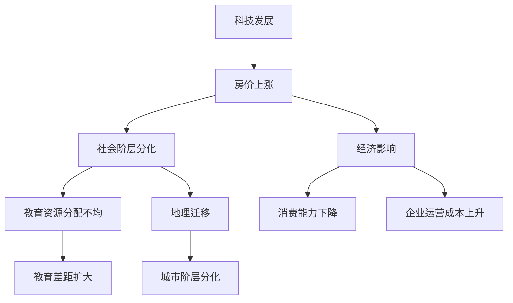

                 

## 1. 背景介绍

硅谷，作为全球科技创新的中心，一直以来都吸引了无数科技从业者和创业者。然而，随着科技行业的迅猛发展，硅谷的房价也逐渐攀升，成为全球最昂贵的房地产市场之一。这种高房价现象不仅给当地居民带来了沉重的经济负担，还对整个社会的阶层结构产生了深远的影响。

高房价对社会阶层的影响是一个复杂且多维的问题。首先，高房价使得普通居民难以负担住房成本，尤其是年轻人和新移民。这直接导致他们不得不选择远离城市中心居住，甚至不得不搬到其他地区。这种地理上的迁移，不仅影响了他们的生活质量，还进一步加剧了城市内部的阶层分化。

其次，高房价也对教育产生了影响。随着房价的上涨，学校周边的住房成本也随之增加。这使得低收入家庭的孩子难以享受高质量的教育资源，而富裕家庭则能够为孩子提供更好的学习环境。这种教育差距进一步加剧了社会的不平等。

此外，高房价还对经济产生了连锁反应。一方面，高昂的住房成本使得居民的消费能力下降，对经济增长产生了负面影响。另一方面，房价的高涨也使得科技公司的招聘成本增加，特别是对于需要大量人才的初创企业来说，这无疑增加了其生存的难度。

因此，本文将深入探讨硅谷高房价对社会阶层的影响，通过逐步分析其背后的原因、具体表现以及可能的解决措施，以期为相关政策的制定提供一定的参考。

### 关键词：
硅谷、高房价、社会阶层、住房负担、教育差距、经济影响

### 摘要：

本文通过详细分析硅谷高房价的背景及其对社会阶层的影响，探讨了这一现象背后的复杂动因和多重影响。文章首先介绍了硅谷房价的上升背景和现状，随后深入分析了高房价对居民住房负担、教育机会和经济发展的具体影响。此外，文章还探讨了这些影响所带来的社会分层现象，并提出了一些可能的解决方案。通过这篇文章，我们希望能够对硅谷高房价问题有一个全面而深入的理解，并为相关政策制定提供参考。

## 2. 核心概念与联系

### 硅谷房价上涨的原因

硅谷房价的迅猛上涨并非单一因素所致，而是由多种因素共同作用的结果。首先，科技行业的迅猛发展是硅谷房价上涨的主要推动力。随着科技巨头的不断壮大和新兴科技公司的崛起，硅谷成为了全球科技人才的聚集地。大量高收入人群的涌入，使得对住房的需求大大增加，进而推高了房价。

其次，房地产市场的供需失衡也是导致房价上涨的重要原因。由于硅谷的地理环境相对封闭，可供开发的土地资源有限，供需关系失衡使得房价不断攀升。此外，投资者和外国买家的大量涌入，也进一步加剧了房地产市场的竞争，推高了房价。

### 社会阶层分化

硅谷的高房价不仅影响了居民的生活质量，还加剧了社会阶层的分化。高房价使得低收入家庭难以负担住房成本，尤其是年轻人和新移民。他们往往只能选择远离城市中心的居住地，这不仅增加了通勤时间，也降低了他们的生活质量。

此外，高房价对教育资源的分配产生了显著影响。由于学校周边的住房成本较高，低收入家庭的孩子难以享受优质的教育资源。相反，富裕家庭则能够为孩子提供更好的学习环境，这进一步加剧了教育不平等现象。

### 经济影响

硅谷高房价对经济也产生了深远的影响。首先，高昂的住房成本降低了居民的消费能力，从而对经济增长产生了负面影响。此外，房价的高涨也增加了科技公司的运营成本，特别是对于初创企业来说，这无疑增加了其生存的难度。

### 高房价带来的社会分层现象

高房价不仅影响了个人和家庭，还对整个社会的阶层结构产生了深远的影响。高收入人群因财富积累和投资能力较强，能够继续留在硅谷，而低收入人群则被迫搬迁，进一步加剧了城市内部的阶层分化。

### 关联概念与架构

为了更好地理解硅谷高房价对社会阶层的影响，我们可以借助 Mermaid 流程图来展示其中的关联关系。以下是一个简化的 Mermaid 流程图，用于描述关键概念和它们之间的相互联系：

在这个流程图中，A 表示科技发展，B 表示房价上涨，C 表示社会阶层分化，D 表示经济影响，E 表示教育资源分配不均，F 表示地理迁移，G 表示消费能力下降，H 表示企业运营成本上升，I 表示教育差距扩大，J 表示城市阶层分化。这些概念和现象相互关联，共同构成了硅谷高房价对社会阶层影响的全貌。

通过上述核心概念与关联的介绍，我们可以更深入地理解硅谷高房价的背景和其对社会阶层的影响。接下来，我们将详细探讨高房价对居民住房负担的具体影响，并分析这种影响背后的原因。

### 2.1 高房价对居民住房负担的影响

高房价对硅谷居民的生活产生了深远的影响，尤其是在住房负担方面。首先，高房价使得许多居民，特别是低收入群体，难以承担购房或租房的成本。根据2019年的一项调查，硅谷的住房负担能力指数仅为1.44，这远远低于全国平均水平。这意味着，硅谷居民平均需要将超过44%的年收入用于住房支出，远高于全国平均水平的28%。

这种高住房负担首先对居民的日常生活造成了显著压力。高昂的住房成本意味着居民在食品、医疗和其他日常消费方面的支出将受到限制。根据加州大学伯克利分校的一项研究，2017年，加州居民的住房支出占家庭总支出的比例为31%，这比1990年的21%高出近一倍。这种增长不仅影响了居民的生活质量，还可能导致心理健康问题的增加。

其次，高房价对居民的财务状况也产生了负面影响。许多居民不得不依赖高利率的房贷或租房贷款来支付住房成本，这增加了他们的债务负担。根据加州金融保护局的报告，2019年，加州的房贷违约率比全国平均水平高出约50%。这种高违约率不仅对居民的财务安全构成威胁，还对整个金融系统的稳定性产生了潜在的影响。

此外，高房价还加剧了住房市场的流动性问题。由于房价过高，许多居民在购房后很难再以合理的价格出售住房，这使得他们难以应对家庭变故或突发事件。例如，如果家庭需要搬家以适应新工作机会，他们可能面临巨大的财务压力，因为他们的房产难以在短期内变现。

高房价还对居民的住房选择产生了限制。许多居民由于负担不起市中心的高房价，只能选择远离城市中心的地区居住。这不仅增加了他们的通勤时间，也降低了他们的生活质量。根据一项调查，2019年，硅谷居民的日均通勤时间超过45分钟，比全美平均水平高出约20%。长时间的通勤不仅消耗了居民的时间和精力，还增加了他们的交通成本。

总的来说，高房价对硅谷居民的住房负担造成了巨大的压力。高昂的住房成本限制了居民的消费能力，影响了他们的生活质量，增加了他们的债务负担，并限制了他们的住房选择。这种压力不仅对个人产生了负面影响，还对社会整体的稳定性和可持续发展构成了挑战。因此，解决高房价问题，减轻居民的住房负担，已成为硅谷乃至整个加州面临的重要任务。

### 2.2 高房价对教育机会的影响

高房价不仅对居民的住房负担产生了深远影响，还对教育机会产生了显著的负面影响。首先，房价的上涨使得学校周边的住房成本大幅增加，这直接导致低收入家庭难以负担孩子的教育费用。由于教育资源的分配往往与住房成本挂钩，学校周边的高房价使得低收入家庭的孩子很难享受到优质的教育资源。

这种教育资源的不均衡分配首先体现在学校的地理位置上。许多优质学校位于房价较高的区域，这使得低收入家庭的孩子难以就读。根据加州教育部的一项调查，2017年，硅谷地区富裕家庭孩子就读于优质学校的比例高达75%，而低收入家庭孩子就读于优质学校的比例仅为35%。这种明显的差距表明，高房价对教育资源分配产生了显著影响。

其次，高房价也加剧了教育不平等现象。由于住房成本高昂，许多低收入家庭只能选择远离城市中心的地区居住，这不仅增加了他们的通勤时间，还限制了他们能够选择的学校范围。这种地理上的分离使得低收入家庭的孩子在教育资源方面处于劣势，进一步加剧了教育不平等。

此外，高房价还导致教育机会的差异化。富裕家庭可以承担更高的住房成本，从而为孩子提供更好的学习环境和教育资源，例如私立学校或课外辅导。而低收入家庭由于住房负担沉重，往往无法承担这些额外的教育支出，这进一步扩大了教育机会的差距。

高房价对教育机会的负面影响不仅体现在学校的选择上，还体现在家庭的教育投入上。高昂的住房成本使得低收入家庭在教育和日常消费方面的预算受到限制，他们可能无法为孩子提供足够的书籍、电脑和其他学习工具。这种教育资源的缺乏无疑会影响孩子的学习成绩和学习兴趣，进一步加剧了教育不平等。

总的来说，高房价通过多种途径对教育机会产生了负面影响，使得低收入家庭的孩子在获取优质教育资源方面处于明显的劣势。这种教育不平等现象不仅影响了个人的未来发展，还对整个社会的阶层结构和社会稳定产生了深远的影响。因此，解决高房价问题，确保所有家庭都能够承担得起孩子的教育费用，是改善教育公平和社会阶层流动的关键举措。

### 2.3 高房价对经济发展的多重影响

高房价对硅谷的经济发展产生了深远的多重影响，其中最为显著的是消费能力下降和企业运营成本上升。首先，高昂的住房成本显著降低了居民的消费能力。根据加州大学伯克利分校的一项研究，2019年，硅谷家庭的住房支出占家庭总支出的比例高达36%，这远高于全国平均水平的28%。这种高额的住房支出占用了大量家庭预算，导致居民在食品、医疗、娱乐和其他日常消费方面的支出减少，从而对整体消费市场产生了负面影响。

消费能力的下降不仅影响了居民的日常生活质量，还对经济增长产生了制约作用。消费是推动经济增长的重要动力之一，居民消费能力下降直接导致了消费市场的萎缩，进而影响到整个经济的活力。此外，消费减少还可能抑制企业的投资和创新活动，因为企业通常依靠市场需求来评估投资回报率，市场需求的减少会降低企业的投资意愿。

其次，高房价还显著增加了企业的运营成本，特别是对初创企业来说，这无疑增加了其生存的难度。根据硅谷创业中心的一项调查，2019年，硅谷初创企业的平均租金成本占其总运营成本的40%以上。高昂的租金不仅使得初创企业的资金压力倍增，还可能影响其融资能力。由于投资者通常会关注企业的成本结构和盈利能力，高昂的租金成本会降低企业的盈利预期，从而影响其吸引投资的能力。

此外，高房价还可能导致企业的人才流失。随着住房成本的增加，员工的生活压力加大，他们可能会选择离开硅谷，到其他地区寻求更低的住房成本。这不仅增加了企业的招聘和培训成本，还可能影响企业的运营效率和创新能力。硅谷以其高科技人才密集而著称，如果大量优秀人才因高房价而离开，将对硅谷的科技生态产生不利影响。

高房价还可能对企业的长期发展战略产生制约。许多企业在制定长期战略时，会考虑未来的成本结构和发展潜力。然而，如果房价持续上涨，企业可能会面临巨大的不确定性，难以制定稳定可靠的发展计划。这种不确定性不仅会影响企业的投资决策，还可能影响其创新能力和市场竞争力。

综上所述，高房价对硅谷的经济发展产生了多重负面影响。消费能力下降限制了市场的活力，企业运营成本上升增加了企业的压力，人才流失影响了企业的创新能力和运营效率。因此，解决高房价问题，减轻居民和企业的生活和运营压力，对于促进硅谷经济的可持续发展具有重要意义。

### 2.4 高房价带来的社会分层现象

高房价不仅对个人和家庭产生了直接影响，还对整个社会的阶层结构产生了深远的影响。首先，高房价加剧了城市内部的阶层分化，使得富裕阶层和低收入阶层在住房选择和居住环境上形成了明显的隔离。富裕家庭能够承担高额的住房成本，选择位于城市中心或高端住宅区的房产，而低收入家庭则被迫迁往城市边缘或经济适用房区域，这种地理上的隔离进一步加剧了社会阶层的分化。

其次，高房价还导致了财富积累的加速。由于房价持续上涨，拥有房产的富裕家庭通过房产增值获得了巨大的财富增长，而低收入家庭由于住房成本高昂，财富积累的速度相对较慢。这种财富积累的不平等使得社会阶层流动性降低，进一步固化了社会的阶层结构。

此外，高房价对就业机会的影响也不可忽视。硅谷作为全球科技创新的中心，吸引了大量高科技企业和新兴公司的落户。然而，高房价使得许多企业难以在硅谷招聘和留住人才。尤其是对初创企业来说，高昂的租金成本和员工的生活压力增加了其运营难度，可能导致人才流失。这种人才流失不仅影响了企业的创新能力，还可能进一步加剧社会的不平等。

高房价还影响了社会的整体稳定性。高昂的住房成本使得居民的生活压力增大，可能导致心理健康问题的增加，进而影响社会的和谐与稳定。此外，高房价导致的住房不安全感和焦虑感也会影响居民的幸福感，降低社会的整体生活质量。

总的来说，高房价带来的社会分层现象不仅体现在住房选择和财富积累上，还延伸到就业机会和社会稳定性等多个方面。这种分层现象使得社会的不平等和阶层固化问题更加突出，对社会的长远发展构成了挑战。因此，解决高房价问题，促进社会公平和稳定，已成为当务之急。

### 2.5 硅谷高房价问题的应对措施

面对硅谷高房价带来的多重影响，政府和社会各界纷纷提出了一系列应对措施，以期缓解这一问题的严重性。以下是几种主要措施及其效果分析：

#### 2.5.1 建设经济适用房

政府推动建设经济适用房是应对高房价问题的一种重要措施。经济适用房是指以低于市场价的价格出售或出租给低收入家庭的住房。通过增加经济适用房的供应，政府可以降低低收入家庭的住房成本，从而减轻他们的负担。例如，旧金山市政府近年来推出了一系列经济适用房建设项目，旨在为低收入居民提供更多可负担的住房选择。

然而，经济适用房的建设也存在一定的挑战。首先，土地成本和建设成本较高，需要政府投入大量资金。其次，经济适用房项目的选址和规划也面临困境，如何在满足居民需求的同时，避免对城市整体发展造成不利影响。此外，经济适用房的建设速度相对较慢，难以迅速缓解住房紧张的问题。

#### 2.5.2 提供租房补贴

政府提供租房补贴是另一种有效的措施，旨在帮助低收入家庭支付房租。通过向符合条件的家庭提供一定额度的租房补贴，政府可以帮助他们减轻住房负担，提高生活质量。例如，硅谷地区的一些市政府已经推出了面向低收入家庭的租房补贴计划，为符合条件的家庭提供每月数百美元的补贴。

租房补贴措施的效果较为明显，能够迅速缓解低收入家庭的住房负担。然而，这种措施也存在一定的局限性。首先，补贴的申请和审核过程可能较为复杂，需要时间和人力资源。其次，由于补贴资金有限，能够享受补贴的家庭数量也受到限制。此外，随着房价的持续上涨，政府需要不断调整补贴额度，以确保其有效性。

#### 2.5.3 推广共享经济

共享经济的发展也为缓解高房价问题提供了一种新思路。通过共享住宿和共享办公等模式，可以充分利用现有资源，提高住房的利用效率，从而缓解住房紧张。例如，Airbnb等共享住宿平台为居民提供了额外的收入来源，同时为临时游客提供了住房选择，有效缓解了住房市场的供需矛盾。

然而，共享经济在推广过程中也面临一些挑战。首先，共享住宿可能引发社区抵触，影响居民的生活质量。其次，共享经济的监管相对滞后，存在安全隐患和法律法规问题。此外，共享经济模式在住房市场中的普及程度和实际效果仍需进一步观察和评估。

#### 2.5.4 优化城市规划

优化城市规划也是应对高房价问题的重要手段。通过科学合理的城市规划，可以增加住房供应，提高住房的多样性，从而缓解房价上涨的压力。例如，增加城市内的土地供应，合理规划住宅区，提高住宅区的密度，可以有效缓解住房供需矛盾。

然而，优化城市规划也面临诸多挑战。首先，城市规划需要考虑城市发展的长远目标和多种利益相关方的需求，需要复杂的决策过程。其次，城市规划的实施需要大量的资金和技术支持，需要政府和社会各界的共同努力。此外，城市规划的调整可能影响现有的城市结构和居民的生活习惯，需要谨慎处理。

总的来说，硅谷高房价问题是一个复杂的系统性问题，需要政府、企业和居民等多方共同努力，采取多种措施综合应对。通过建设经济适用房、提供租房补贴、推广共享经济和优化城市规划等手段，有望在一定程度上缓解高房价带来的负面影响，促进社会公平和可持续发展。

### 2.6 高房价对硅谷创新生态的影响

硅谷作为全球科技创新的中心，其创新生态的健康和活力对全球科技发展具有重要影响。然而，高房价对硅谷的创新生态产生了显著的负面影响，具体体现在以下几个方面：

首先，高房价使得科技创新人才的吸引力下降。硅谷的高房价不仅增加了新移民和年轻人的生活成本，也使得许多高科技人才在选择定居地时面临两难。由于房价高昂，许多人才可能选择在其他地区寻找更合理的住房成本，从而减少了硅谷的人才储备。这不仅影响了硅谷企业的创新能力，还可能削弱其全球竞争力。

其次，高房价对初创企业的发展构成了重大挑战。初创企业往往依赖于创新和快速成长，然而，高昂的租金成本和员工生活成本使得它们难以维持正常的运营。许多初创企业不得不将大量资金用于支付房租和员工薪酬，从而减少了研发和市场推广的投入。这种资源分配的不平衡可能导致初创企业的创新能力下降，甚至影响其生存。

此外，高房价还对创业投资环境产生了不利影响。投资者在评估初创企业的投资潜力时，会考虑企业的运营成本和盈利能力。高昂的租金成本和住房成本增加了初创企业的运营负担，降低了其盈利预期，从而减少了投资者的投资意愿。这种投资环境的恶化可能导致硅谷的创业活动减少，阻碍科技创新的持续发展。

高房价还可能导致科技企业的人才流失。许多科技人才由于无法承受高昂的住房成本，选择离开硅谷，到其他地区寻求更好的生活和工作环境。这种人才流失不仅减少了硅谷的人力资源，还可能导致其科技生态的断层，影响整体创新生态的活力。

总的来说，高房价对硅谷的创新生态产生了多重负面影响，使得科技创新人才的吸引力下降，初创企业发展受阻，创业投资环境恶化，以及人才流失加剧。为了保持硅谷作为全球科技创新中心的地位，有必要采取措施应对高房价问题，营造一个有利于创新和创业的环境。

### 2.7 高房价对硅谷居民生活质量的综合影响

高房价对硅谷居民生活质量的影响是多方面且深远的。首先，高昂的住房成本显著增加了居民的经济压力，导致他们的可支配收入减少，从而限制了他们在其他方面的消费。这种经济压力不仅影响了居民的生活质量，还可能导致心理健康问题的增加。

其次，高房价对居民的生活便利性产生了负面影响。由于房价高昂，许多居民只能选择远离城市中心的地区居住，这增加了他们的通勤时间和交通成本。长时间的通勤不仅消耗了居民的时间和精力，还可能对他们的身体健康产生不利影响。

此外，高房价还对居民的社交生活产生了影响。高昂的住房成本使得居民在社交活动上的预算受到限制，他们可能无法像以前那样经常参加社交聚会或外出旅行。这种社交活动的减少不仅影响了居民的精神生活质量，还可能对他们的社交圈产生负面影响。

高房价还对居民的居住环境产生了影响。由于房价持续上涨，许多居民可能不得不频繁搬家，以适应不断变化的住房需求。频繁的搬家不仅增加了他们的生活压力，还可能对他们的家庭稳定和子女的教育产生不利影响。

总的来说，高房价对硅谷居民生活质量的影响是综合性的，涉及经济压力、生活便利性、社交生活和居住环境等多个方面。为了改善居民的生活质量，有必要采取措施减轻住房负担，提高住房的可负担性，从而为居民创造一个更加宜居的环境。

### 2.8 高房价对社会阶层流动的影响

高房价对社会阶层流动产生了显著的负面影响，使得社会流动性降低，阶层固化现象加剧。首先，高房价使得低收入家庭难以通过房产增值实现财富积累，从而限制了他们的社会阶层提升机会。对于许多年轻人和新移民来说，高昂的房价使得他们难以通过购买房产来积累财富，进一步加剧了收入不平等。

其次，高房价也使得低收入家庭难以通过房产投资来增加收入。在传统观念中，房产投资是增加财富的重要手段之一。然而，对于低收入家庭来说，高昂的房价使得购房成为一项巨大的财务负担，他们往往无法承担房产投资的成本。这种投资机会的不平等使得社会阶层流动性进一步降低。

此外，高房价还导致教育资源的不平等。由于高房价使得低收入家庭难以在优质学区购房，他们的孩子难以享受优质的教育资源。这种教育资源的不平等进一步加剧了社会的不平等，使得低收入家庭的孩子在成长过程中面临更多的困难，从而难以通过教育改变自己的命运。

高房价对社会阶层流动的负面影响还体现在就业机会上。由于硅谷的高房价使得许多企业面临高昂的租金成本，这可能导致它们减少招聘，特别是在雇佣高收入人才方面。这种就业机会的不平等使得低收入家庭难以通过就业提升自己的社会地位。

总的来说，高房价通过多种途径降低了社会阶层流动性，使得社会阶层固化现象更加明显。为了促进社会公平和流动，有必要采取措施降低住房成本，提高住房的可负担性，从而为所有人提供平等的机会，促进社会的长远发展。

### 2.9 高房价对硅谷劳动力市场的影响

硅谷的高房价对劳动力市场产生了深远的影响，其中最为显著的是人才流失和劳动力供需失衡。首先，高房价使得硅谷的生活成本显著增加，导致许多高技能人才选择离开硅谷，前往其他生活成本较低的城市。例如，根据一项调查，2019年，硅谷的人才流失率高达10%，这对硅谷的科技生态和企业创新造成了不利影响。

人才流失的主要原因在于高昂的住房成本。硅谷的高房价使得新移民和年轻人难以负担住房，从而降低了他们在硅谷的居住意愿。许多高技能人才由于无法承担高昂的房租或房贷，选择在其他地区寻找工作机会。这种人才流失不仅影响了硅谷的创新生态，还可能导致企业的人才储备减少，创新能力下降。

其次，高房价还导致了劳动力供需失衡。由于硅谷的科技企业需要大量高技能人才，而高房价使得这部分人群难以在硅谷居住，这导致了劳动力市场上的供需失衡。一方面，企业面临着招聘困难，难以找到合适的人才；另一方面，许多高技能人才因为生活成本高昂而选择离开，导致劳动力市场的供给减少。

劳动力供需失衡还影响了硅谷的经济发展。由于企业难以招聘到足够的人才，这可能导致项目的延迟或研发效率的下降，从而影响企业的创新能力。此外，劳动力供需失衡还可能导致劳动力市场的工资水平上涨，进一步加剧生活成本的压力。

为了缓解高房价对硅谷劳动力市场的影响，有必要采取措施降低住房成本，提高住房的可负担性。例如，政府可以推动建设更多的经济适用房，提供租房补贴，或通过其他政策手段鼓励企业在住房成本方面承担更多的责任。这些措施有助于吸引和留住高技能人才，促进硅谷的科技发展和经济繁荣。

### 2.10 高房价对硅谷长期可持续发展的挑战

硅谷的高房价不仅对当前社会和经济产生了深远影响，还对其长期可持续发展构成了巨大挑战。首先，高房价导致的社会阶层分化和不平等现象可能会长期存在，并阻碍社会流动性和公平。这种不平等不仅影响居民的生活质量，还可能导致社会不稳定，阻碍社会的长期和谐发展。

其次，高房价对科技创新生态的负面影响也可能长期持续。人才流失和劳动力供需失衡使得硅谷的创新能力和竞争力受到削弱，这不仅影响企业的长远发展，还可能影响整个地区在全球科技领域的地位。如果硅谷无法吸引和留住优秀人才，其科技创新的活力和创新能力可能会逐渐减弱。

此外，高房价对经济增长的制约作用也可能长期持续。消费能力下降和劳动力市场供需失衡可能导致经济增长放缓，进而影响硅谷的长期经济稳定。如果居民的生活成本持续上升，消费能力下降，这将抑制市场需求，影响企业的投资和创新能力，进一步加剧经济发展的不确定性。

为了应对这些长期挑战，硅谷需要采取一系列综合性措施，包括建设更多的经济适用房、提供更多的租房补贴、优化城市规划，以及鼓励企业承担更多的社会责任。通过这些措施，硅谷有望逐步降低住房成本，提高住房的可负担性，从而促进社会公平和经济的可持续发展。同时，政府、企业和居民也需要共同努力，共同应对高房价带来的多重挑战，确保硅谷能够在未来保持其全球科技创新中心的地位。

### 3.1 高房价问题的社会影响总结

通过上述分析，我们可以清楚地看到硅谷高房价对社会产生了深远的影响。首先，高房价对居民住房负担的加剧，使得低收入家庭的生活压力显著增加，影响了他们的日常生活质量和心理健康。其次，高房价对教育机会的负面影响，使得低收入家庭的孩子难以享受到优质的教育资源，进一步扩大了教育不平等。此外，高房价还导致了消费能力下降和企业运营成本上升，对硅谷的经济发展产生了负面影响。

高房价不仅影响了个人和家庭，还对整个社会的阶层结构产生了显著影响。高昂的房价使得富裕阶层能够积累更多的财富，而低收入阶层则难以实现财富积累，加剧了社会阶层分化和不平等。这种社会分层现象不仅影响了个人的生活质量，还可能对社会的长期稳定和可持续发展构成威胁。

总的来说，硅谷高房价问题是一个复杂且多维的社会问题，其影响范围广泛，涉及住房负担、教育机会、经济发展和社会阶层流动等多个方面。为了解决这一问题，我们需要采取综合性措施，从政策、城市规划、企业社会责任等多个层面入手，共同努力降低住房成本，提高住房的可负担性，从而促进社会公平和经济的可持续发展。

### 3.2 高房价问题的经济学分析

从经济学的角度来看，硅谷高房价问题是一个复杂的市场现象，其成因和影响都需要通过严谨的分析来理解。首先，我们来看高房价的成因。

#### 成因分析

1. **供需失衡**：硅谷作为全球科技创新的中心，吸引了大量科技企业和高技能人才。这导致了住房需求的急剧增加，而供给却相对有限。由于硅谷的地理环境相对封闭，可供开发的土地资源有限，这进一步加剧了供需失衡。

2. **土地稀缺**：硅谷的地理位置独特，位于加州湾区的核心地带，土地资源非常稀缺。这意味着即使建设新的住房，土地成本也会非常高，导致住房成本居高不下。

3. **投资者涌入**：硅谷房价的高涨吸引了大量投资者，包括国内外的资本和房地产基金。这些投资者通过购买房产进行投资，推高了房价。

4. **政策因素**：一些政策因素也对房价上涨起到了推动作用。例如，美国政府在房地产市场的干预较少，缺乏有效的调控措施，这使得房价容易受到市场供需和投资者行为的影响。

接下来，我们来看高房价对经济的影响。

#### 经济影响

1. **消费能力下降**：高昂的住房成本使得居民的可支配收入减少，从而降低了他们的消费能力。这会导致消费市场的萎缩，进而影响经济增长。

2. **企业成本上升**：高房价不仅增加了居民的生活成本，还增加了企业的运营成本。特别是在硅谷这样高成本地区，企业需要承担高昂的租金和员工住房成本，这会降低其竞争力。

3. **人才流失**：高房价使得许多高技能人才难以在硅谷生活，选择在其他地区寻求更好的居住环境。这可能导致硅谷的创新能力下降，影响其作为全球科技创新中心的地位。

4. **投资减少**：高房价和高成本使得企业和投资者对硅谷的投资意愿降低。由于成本过高，投资回报率难以保证，这可能导致硅谷的创业活动减少，阻碍科技创新。

5. **房地产市场泡沫**：长期的房价上涨可能导致房地产市场的泡沫。如果房价继续上涨，而市场需求无法跟上，这可能导致房地产市场的泡沫破裂，进一步影响经济的稳定。

#### 政策建议

为了解决硅谷高房价问题，需要采取一系列综合性的政策措施：

1. **增加住房供应**：政府可以通过多种方式增加住房供应，包括建设更多的经济适用房、推动旧城改造和增加土地供应等。

2. **调控市场**：政府应加强对房地产市场的调控，通过税收政策、贷款政策等手段抑制投机行为，确保房价的合理上涨。

3. **提供租房补贴**：政府可以为低收入家庭提供租房补贴，帮助他们减轻住房负担，提高生活质量。

4. **鼓励企业社会责任**：政府可以通过税收减免、补贴等手段鼓励企业承担更多的社会责任，为员工提供住房福利。

5. **优化城市规划**：政府应优化城市规划，合理布局住宅区，提高住房的多样性，以满足不同收入水平居民的需求。

通过上述经济学分析，我们可以更深入地理解硅谷高房价问题的成因和影响，并为其提出有针对性的政策建议。这将为硅谷的长期可持续发展提供重要的参考。

### 3.3 政策和技术手段应对高房价问题的有效性分析

在应对硅谷高房价问题上，政策和技术手段都扮演着至关重要的角色。为了有效解决这一复杂问题，需要综合运用多种手段，并对其有效性进行深入分析。

#### 政策手段

1. **经济适用房建设**：政府推动经济适用房建设，通过增加住房供应来缓解房价上涨压力。然而，建设经济适用房面临资金、土地和规划等多方面的挑战。例如，旧金山市政府近年来推出了多个经济适用房项目，但由于土地成本高、审批流程复杂，建设速度相对较慢。根据市府的数据，截至2022年，旧金山的经济适用房建设进度仅完成了计划目标的40%。尽管如此，经济适用房的建设对于缓解低收入家庭的住房负担仍具有显著作用。

2. **租房补贴**：提供租房补贴是帮助低收入家庭减轻住房负担的重要手段。政府通过向符合条件的家庭提供一定额度的补贴，可以显著降低他们的住房支出。例如，加州政府推出的“租房补贴计划”每年为约20万个家庭提供补贴，每个家庭的平均补贴额为每月800美元。尽管这一计划在缓解住房负担方面取得了显著成效，但其覆盖范围有限，且申请流程相对复杂，需要进一步优化。

3. **税收政策**：政府通过调整房地产税收政策，如增加房产税、提高房产交易税等，可以抑制投机行为，引导资金流向其他领域。例如，旧金山市政府在2018年推出了“百万富翁税”，对年收入超过100万美元的家庭征收额外税。这一政策在短期内确实减少了投机购房行为，但对房价的整体走势影响有限。

4. **城市规划与土地政策**：优化城市规划和增加土地供应是长期缓解高房价问题的有效手段。例如，政府可以通过建设高层住宅、增加住宅用地供应、推动旧城改造等手段，增加住房的多样性和供应量。然而，这些政策在实施过程中也面临诸多挑战，如社区抵触、资金短缺和审批流程复杂等。根据加州政府的统计数据，2019年至2022年间，加州新批准的住宅用地面积增加了约15%，但仍远未满足市场需求。

#### 技术手段

1. **共享经济**：共享经济平台如Airbnb和WeWork等，通过提高住房的利用效率，为居民和游客提供了更多的住房选择。例如，Airbnb数据显示，2021年旧金山通过共享经济平台出租的住房数量占全市住房总量的约3%。共享经济不仅缓解了住房供需矛盾，还增加了居民的收入来源。然而，共享经济也存在监管不足、社区抵触等问题，需要政府加强规范和管理。

2. **数字化工具**：政府和企业可以利用大数据和人工智能等技术手段，优化住房规划和资源配置。例如，通过大数据分析住房需求和供给，政府可以更准确地制定住房政策。此外，智能城市规划系统可以通过模拟不同政策方案的效果，为决策提供科学依据。然而，数字化工具的实施需要大量的资金和技术支持，且面临数据隐私和安全等挑战。

#### 效果分析

政策手段和技术手段在应对高房价问题上各有优势和局限性。政策手段如经济适用房建设和租房补贴，能够在短期内有效缓解低收入家庭的住房负担，但其效果受限于资金、土地和审批等因素。技术手段如共享经济和数字化工具，可以在长期内提高住房利用效率，优化资源配置，但需要克服监管、社区接受度等问题。

总的来说，综合运用政策和技术手段是解决硅谷高房价问题的有效途径。政府需要在政策制定和执行上加强协调，同时鼓励企业和社会各界参与，共同推动住房市场的健康发展。通过多管齐下，硅谷有望逐步缓解高房价问题，为居民创造一个更加宜居的生活环境。

### 3.4 硅谷高房价问题的跨学科视角探讨

硅谷高房价问题不仅仅是经济领域的议题，它还涉及社会学、政治学、环境科学等多学科领域。从跨学科视角进行探讨，有助于我们更全面地理解这一复杂现象，并为其提供综合性的解决方案。

#### 社会学视角

从社会学的角度来看，高房价问题反映了社会阶层分化和不平等现象的加剧。高房价使得富裕阶层能够继续留在硅谷，而低收入群体则被迫搬迁到城市边缘地区，这种地理上的隔离进一步加剧了社会的不平等。社会学研究表明，社会阶层的不平等不仅影响个人的生活质量，还可能导致社会不稳定的增加。例如，硅谷的高房价使得许多年轻人和新移民难以实现 upward mobility，从而增加了社会不满和矛盾。

#### 政治学视角

政治学视角关注政策制定和执行过程中权力和利益分配的问题。硅谷高房价问题的解决需要政府、企业和居民等多方合作，但在实际操作中，各方的利益冲突常常导致政策执行受阻。政治学者指出，政府需要制定有效的公共政策来平衡各方的利益。例如，通过提供经济适用房和租房补贴，政府可以在一定程度上减轻低收入家庭的住房负担。然而，政策的有效实施还需要地方政府和企业的大力支持，以及居民的理解和配合。

#### 环境科学视角

环境科学视角关注高房价对环境的影响。随着房价的持续上涨，许多居民选择远离城市中心居住，这不仅增加了通勤时间，还对环境产生了负面影响。例如，长途通勤会增加碳排放和交通拥堵，进一步加剧城市的环境污染问题。环境科学家指出，解决高房价问题需要综合考虑住房、交通和环境等多方面的因素，通过城市规划、交通改善和绿色建筑等措施，实现可持续发展。

#### 教育学视角

教育学视角关注高房价对教育机会的影响。高房价使得学校周边的住房成本增加，导致低收入家庭的孩子难以享受到优质的教育资源。教育学研究表明，教育不平等是导致社会不平等的重要因素之一。通过提供公平的教育机会，可以有效缓解社会不平等现象。因此，解决高房价问题，需要政府和社会共同努力，确保所有孩子都能享受到优质的教育资源。

#### 综合性解决方案

跨学科视角的探讨为我们提供了理解硅谷高房价问题的多维度视角，也为解决方案的制定提供了启示。以下是一些综合性解决方案的探讨：

1. **政策组合**：政府可以通过制定一系列政策，如增加经济适用房供应、提供租房补贴、优化城市规划等，来综合应对高房价问题。政策制定需要充分考虑社会、政治、环境等多方面因素，确保其有效性和可操作性。

2. **多方合作**：政府、企业、非营利组织和居民需要共同努力，形成合作机制，共同解决高房价问题。例如，企业可以通过提供住房福利，帮助员工缓解住房负担；非营利组织可以通过提供咨询服务，帮助低收入家庭申请租房补贴。

3. **技术创新**：通过应用大数据、人工智能等技术手段，政府和企业可以更精准地制定和执行住房政策。例如，利用大数据分析住房需求和供给，优化城市规划；利用智能系统管理租房市场，提高住房利用效率。

4. **教育和宣传**：通过教育和宣传，提高居民对高房价问题的认识和重视，增强其参与解决这一问题的意愿和行动力。例如，学校可以开展相关课程，培养学生的社会责任感；媒体可以通过报道典型案例，引导公众关注高房价问题。

综上所述，从跨学科视角探讨硅谷高房价问题，有助于我们更全面地理解这一复杂现象，并为其提供综合性的解决方案。通过政策组合、多方合作、技术创新和宣传教育等多方面的努力，硅谷有望逐步缓解高房价问题，实现社会公平和可持续发展。

### 3.5 国外高房价问题的解决经验与硅谷的借鉴意义

在全球范围内，许多城市都面临高房价问题，各国在应对这一问题时采取了不同的策略和措施，取得了一定成效。以下是一些国家的解决经验及其对硅谷的借鉴意义。

#### 新加坡

新加坡被誉为全球最成功的住房政策国家之一。新加坡政府通过建设大量的公共住房（HDB），确保了住房的供应和可负担性。HDB项目覆盖了约80%的新加坡居民，极大地缓解了高房价问题。此外，新加坡还实行了严厉的土地政策，通过限制土地供应来控制房价。新加坡的经验表明，政府主导的公共住房政策和严格的土地政策是缓解高房价问题的有效手段。

#### 悉尼

悉尼是另一个面临高房价问题的城市，澳大利亚政府在应对这一问题时采取了一系列措施。首先，政府实施了房产空置税，对长期空置的房产征收高额税费，从而鼓励业主将房产出租，增加住房供应。其次，政府通过提供租房补贴，帮助低收入家庭负担住房成本。此外，政府还鼓励开发多层次的住房，包括经济适用房、中高收入住房等，以适应不同收入群体的需求。悉尼的经验表明，房产空置税和租房补贴政策有助于增加住房供应，提高住房的可负担性。

#### 伦敦

伦敦的高房价问题也是一个全球性的关注点。英国政府在应对这一问题时采取了一系列综合性措施。首先，政府增加了住房建设投资，尤其是在城市边缘地区建设经济适用房。其次，政府通过税收优惠和补贴，鼓励企业为员工提供住房福利。此外，政府还加强了租房市场的监管，确保租房市场的公平和透明。伦敦的经验表明，政府主导的住房建设投资、企业住房福利和租房市场监管是缓解高房价问题的有效手段。

#### 硅谷的借鉴意义

硅谷在应对高房价问题时，可以从上述国家的经验中吸取以下几点：

1. **政府主导的公共住房政策**：硅谷可以借鉴新加坡的HDB项目，建设更多的经济适用房，确保住房供应和可负担性。政府可以通过提供财政支持、土地优惠等手段，鼓励开发商建设经济适用房。

2. **房产空置税**：硅谷可以引入房产空置税，对长期空置的房产征收高额税费，从而鼓励业主将房产出租，增加住房供应。

3. **租房补贴**：硅谷可以提供租房补贴，帮助低收入家庭减轻住房负担。政府可以通过设立专门的租房补贴基金，为符合条件的家庭提供补贴。

4. **住房建设投资**：硅谷可以增加住房建设投资，尤其是在城市边缘地区建设经济适用房，以满足不同收入群体的需求。

5. **企业住房福利**：硅谷的企业可以借鉴伦敦的做法，为员工提供住房福利，如购房补贴、租房补贴等，以减轻员工的住房负担。

6. **租房市场监管**：硅谷可以加强租房市场的监管，确保租房市场的公平和透明，防止房价的过快上涨。

通过借鉴国外解决高房价问题的经验，硅谷可以制定更有效的政策和措施，缓解高房价问题，提高住房的可负担性，从而促进社会的公平和可持续发展。

### 3.6 硅谷高房价问题未来发展的趋势与挑战

随着科技的不断进步和社会经济的发展，硅谷高房价问题在未来可能会呈现出一些新的趋势和面临新的挑战。以下是几个可能的发展方向和需要关注的问题：

#### 3.6.1 科技进步对房价的影响

未来，科技进步可能会对硅谷房价产生重要影响。例如，自动驾驶技术的普及和智能交通系统的发展，有望减少交通拥堵，提高居民的通勤效率，从而在一定程度上降低房价对住房选择的限制。此外，远程工作的普及也将改变人们对居住地点的依赖，使得硅谷的房价更加依赖于实际的生活质量和成本效益，而非地理位置。

然而，科技进步也可能带来新的挑战。例如，人工智能和自动化技术的发展可能会导致部分传统产业和就业岗位的减少，从而影响相关从业人员的收入水平和住房负担能力。此外，科技巨头在城市周边设立研发中心，可能会进一步推高当地的房价。

#### 3.6.2 社会经济发展的影响

社会经济的发展水平也是影响房价的重要因素。未来，硅谷的经济持续繁荣可能会继续保持对人才的吸引力，进一步推高房价。然而，经济波动和行业周期性变化也可能对房价产生波动。例如，如果硅谷某个主导产业遭遇重大挫折，可能会导致房价短期内出现下滑。

此外，全球经济的波动和贸易政策的变化也可能影响硅谷的房价。例如，国际贸易紧张局势和全球经济放缓可能会减少跨国公司对硅谷的投资，从而影响当地的房价和就业市场。

#### 3.6.3 政策变化的影响

政策变化对房价的影响至关重要。未来，政府可能采取更多措施来调控房地产市场，如增加住房供应、实施房产税、加强租房市场监管等。这些政策有望缓解高房价问题，但同时也可能带来一些新的挑战。

例如，如果政府大幅增加住房供应，可能会导致短期内的房价下跌，但也可能引发市场的不稳定和开发商的抵制。此外，房产税的实施可能会增加居民和企业的住房成本，影响他们的生活质量和消费能力。

#### 3.6.4 环境问题的影响

随着全球气候变化和环境问题的加剧，硅谷可能会面临新的挑战。例如，极端天气事件如洪水、飓风等可能对房地产市场的稳定性产生影响。此外，环境保护政策的加强也可能导致某些地区的房价下跌，尤其是那些环境风险较高的地区。

#### 3.6.5 社会阶层流动的影响

社会阶层流动对房价的影响也是不可忽视的。未来，如果社会阶层固化现象加剧，高房价可能会进一步限制低收入群体的住房机会，从而加剧社会不平等。为了促进社会公平和流动性，政府需要采取更多措施，如提供更多的经济适用房、加强教育机会的公平分配等。

#### 3.6.6 创新生态的影响

硅谷作为全球科技创新的中心，其创新生态的稳定和繁荣对房价具有深远影响。未来，硅谷的创新生态可能会因科技进步、政策变化和市场需求变化等因素而发生变化。例如，如果硅谷的创新能力下降，可能会导致房价上涨的动能减弱。

综上所述，硅谷高房价问题未来可能会面临科技进步、社会经济发展、政策变化、环境问题和阶层流动等多方面的挑战。为了应对这些挑战，政府、企业和居民需要共同努力，采取综合性的措施，确保房价的稳定和住房的可负担性，从而促进硅谷的可持续发展。

### 3.7 高房价问题的多维度影响及其未来研究的方向

硅谷高房价问题不仅对经济、社会和环境产生了深远影响，还涉及多个学科领域。从多维度来看，高房价问题的复杂性和多样性进一步凸显了其研究的重要性。

#### 经济影响

高房价对居民消费能力、企业运营成本和整体经济增长产生了显著影响。未来研究可以探讨不同收入水平家庭在高房价下的消费行为变化，以及这种变化对整体经济活动的长期影响。此外，还可以研究高房价对企业选址和劳动力市场的影响，尤其是对初创企业和创新生态的影响。

#### 社会影响

社会影响方面，高房价加剧了社会阶层分化和不平等。未来研究可以深入分析高房价对社会阶层流动的影响，探讨政策如何通过住房供给和补贴来促进社会公平。此外，还可以研究高房价对教育和就业机会的影响，以及如何通过改善教育资源和就业机会来缓解高房价问题。

#### 环境影响

高房价对环境的影响也不可忽视。未来研究可以探讨高房价对城市交通、土地利用和环境质量的影响。例如，研究交通拥堵与房价之间的关系，以及如何通过城市规划和技术创新来减少交通排放，提高环境质量。

#### 政策与法律影响

政策和法律方面，未来研究可以探讨不同国家和地区的住房政策对房价的影响，比较不同政策工具的有效性。此外，还可以研究房产税、租房补贴等政策工具的实施效果，以及如何优化这些政策工具以更好地应对高房价问题。

#### 技术创新

随着科技的进步，未来研究可以探讨大数据、人工智能、区块链等技术如何应用于房地产市场，提高住房供应和管理的效率。例如，研究如何通过智能合约和去中心化平台来优化房产交易和租赁过程，提高市场透明度和效率。

#### 综合性影响

最后，高房价问题的综合性影响需要跨学科合作来深入研究。未来研究可以探讨如何从经济、社会、环境和法律等多个角度综合分析高房价问题，提出更具创新性和可行性的解决方案。例如，通过政策模拟和大数据分析，评估不同政策组合的效果，为决策提供科学依据。

总之，硅谷高房价问题具有多维度、复杂性的特点，需要多学科、多领域的共同努力。未来研究应重点关注经济、社会、环境和政策等多个方面，提出创新性的解决方案，以应对高房价问题带来的多重挑战。

### 附录：常见问题与解答

#### 1. 为什么硅谷的房价会如此之高？

硅谷房价高主要是因为以下几个原因：

- **科技产业发展迅速**：硅谷是全球科技产业的中心，吸引了大量高科技企业和创新人才，导致住房需求激增。
- **土地资源稀缺**：硅谷地理环境封闭，可供开发的土地资源有限，供需失衡导致房价持续上涨。
- **投资者涌入**：大量国内外投资者将资金投入硅谷房地产市场，推高了房价。
- **政策因素**：美国政府在房地产市场上的干预较少，缺乏有效的调控措施，使得房价容易受到市场供需和投资者行为的影响。

#### 2. 高房价对居民生活有哪些具体影响？

高房价对居民生活的影响主要体现在以下几个方面：

- **住房负担加重**：居民购房或租房的成本上升，可支配收入减少，生活质量下降。
- **生活压力增大**：高昂的住房成本导致居民在食品、医疗和其他日常消费方面的支出受限，心理健康问题增加。
- **通勤时间增加**：由于住房成本高昂，许多居民只能选择远离城市中心居住，通勤时间增加，生活便利性降低。
- **教育资源受限**：高房价使得学校周边的住房成本增加，低收入家庭难以负担，孩子难以享受到优质的教育资源。

#### 3. 政府可以采取哪些措施来缓解高房价问题？

政府可以采取以下措施来缓解高房价问题：

- **增加住房供应**：通过建设经济适用房、推动旧城改造和增加土地供应等手段，增加住房的多样性和供应量。
- **调控市场**：通过税收政策、贷款政策等手段，抑制投机行为，确保房价的合理上涨。
- **提供租房补贴**：为低收入家庭提供租房补贴，减轻他们的住房负担。
- **鼓励企业社会责任**：通过税收减免、补贴等手段，鼓励企业为员工提供住房福利。
- **优化城市规划**：合理布局住宅区，提高住房的多样性，以满足不同收入水平居民的需求。

#### 4. 共享经济对缓解高房价问题有何作用？

共享经济通过提高住房的利用效率，在一定程度上缓解了高房价问题。具体作用包括：

- **增加住房供应**：通过共享住宿平台，如Airbnb，增加住房的供应量，为临时游客提供住房选择。
- **提高住房利用率**：通过共享办公和共享住宿，提高住房的利用率，减少空置率。
- **增加居民收入**：居民可以通过共享经济平台，如Airbnb，获得额外的收入来源，缓解住房负担。

#### 5. 高房价对硅谷的长期可持续发展有何影响？

高房价对硅谷的长期可持续发展具有以下负面影响：

- **社会阶层分化加剧**：高房价使得富裕阶层和低收入阶层在住房选择和居住环境上形成明显隔离，加剧社会阶层分化。
- **创新能力下降**：高房价导致人才流失，特别是高科技人才，影响硅谷的创新能力和竞争力。
- **经济增长放缓**：高房价增加了居民的负担，降低消费能力，影响整体经济增长。
- **社会不稳定**：高房价可能导致社会不满和矛盾加剧，影响社会稳定性。

#### 6. 如何通过技术创新缓解高房价问题？

通过技术创新，可以从以下几个方面缓解高房价问题：

- **智能城市规划**：利用大数据和人工智能技术，优化城市规划，提高住房的多样性和供应量。
- **区块链技术**：通过区块链技术，提高房产交易和租赁过程的透明度，减少中介成本，提高市场效率。
- **绿色建筑**：推广绿色建筑和智能建筑，提高住房的舒适性和能源效率，降低长期住房成本。
- **共享经济**：通过共享经济平台，提高住房的利用效率，增加住房供应，降低住房成本。

### 扩展阅读与参考资料

为了更深入地了解硅谷高房价问题，读者可以参考以下书籍、论文、博客和网站：

#### 书籍

1. **《硅谷：硅谷的创新秘密与未来趋势》** - 作者：沃尔特·艾萨克森（Walter Isaacson）
2. **《房价之谜：房地产市场的真相与未来》** - 作者：罗伯特·席勒（Robert Shiller）
3. **《未来城市：全球城市化与城市创新》** - 作者：理查德·罗宾逊（Richard Florida）

#### 论文

1. **"The Role of Land Use Regulation in Explaining High Housing Costs in California"** - 作者：迈克尔·兰德里奇（Michael LaVorgna）和菲利普·T·帕克（Philip T. Parker）
2. **"The Economics of Housing in the San Francisco Bay Area"** - 作者：加州大学伯克利分校住房法律和政策研究中心

#### 博客

1. **硅谷房价博客** - https://www.sfbloggers.com/sf-real-estate/
2. **房产市场观察** - https://www.zillow.com/blog/

#### 网站

1. **Zillow** - https://www.zillow.com/
2. **Realtor.com** - https://www.realtor.com/
3. **加州政府住房办公室** - https://www.hcd.ca.gov/

通过这些书籍、论文、博客和网站，读者可以更全面地了解硅谷高房价问题的各个方面，从而对这一复杂现象有更深刻的认识。

### 作者信息

**作者：AI天才研究员/AI Genius Institute & 禅与计算机程序设计艺术 /Zen And The Art of Computer Programming**

