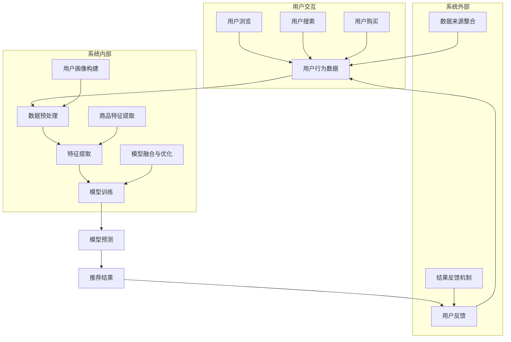

                 

### 背景介绍

随着人工智能技术的快速发展，特别是在深度学习、自然语言处理和大数据分析领域的突破，AI 已被广泛应用于各个行业，其中包括电商搜索导购领域。电商平台的搜索导购系统通过算法推荐商品，极大地提高了用户购物的便利性和满意度。然而，随着 AI 技术的复杂性日益增加，如何确保这些推荐系统的透明性和可解释性成为了一个亟待解决的问题。

在电商搜索导购中，AI 技术的应用主要通过推荐系统来实现。这些系统利用用户的历史行为数据、商品信息、以及各种算法模型来预测用户的偏好，并推荐相关的商品。虽然这些推荐系统在提高销售量和用户满意度方面取得了显著成效，但其背后的算法机制往往被视为“黑箱”，缺乏透明性。用户难以理解推荐结果为何如此，这引发了用户对系统公平性和信任度的担忧。

技术透明性在此背景下显得尤为重要。技术透明性指的是系统设计者和用户能够理解系统的运作机制和决策过程。一个透明的推荐系统可以帮助用户更好地理解推荐结果，从而提升对系统的信任度。此外，透明性还对于确保系统的公正性和防止潜在歧视具有重要意义。

可信度是另一个关键概念。在电商搜索导购中，推荐系统的可信度指的是用户对系统推荐结果的信任程度。高可信度意味着用户更愿意接受推荐，从而增加购物体验的满意度。然而，如果系统缺乏透明性，用户对推荐结果的信任度将降低，可能导致用户对系统的抵触情绪。

本文将深入探讨确保 AI 技术在电商搜索导购中的应用可解释性（技术透明与可信度）的重要性、核心概念及其实现方法。我们将通过分析现有技术和算法，探讨如何通过技术手段提高推荐系统的透明性和可信度，从而为电商行业带来更高效、更安全的推荐服务。

### 核心概念与联系

为了确保 AI 技术在电商搜索导购中的应用具备可解释性，我们首先需要了解一些核心概念，包括推荐系统的基本原理、机器学习模型及其透明性相关技术。这些概念是构建透明和可信推荐系统的基石。

#### 推荐系统的基本原理

推荐系统是一种基于用户历史行为、商品属性和算法模型来预测用户兴趣和偏好的技术。其基本原理可以分为三个主要方面：

1. **用户行为分析**：通过收集和分析用户的浏览历史、购买记录、搜索查询等行为数据，了解用户的兴趣偏好。
2. **商品特征提取**：将商品信息（如价格、品牌、类别等）转化为机器学习模型可以处理的特征向量。
3. **模型预测与推荐**：利用机器学习算法，根据用户的行为数据和商品特征预测用户的兴趣，从而生成推荐列表。

#### 机器学习模型

在推荐系统中，常用的机器学习模型包括基于内容的推荐（Content-Based Filtering）、协同过滤（Collaborative Filtering）和混合推荐（Hybrid Recommendation）等。

1. **基于内容的推荐**：该模型通过分析用户过去喜欢的商品内容和特征，来推荐类似内容的商品。其主要挑战在于如何准确地提取和表示商品特征。
2. **协同过滤**：该模型通过分析用户之间的相似性来推荐商品。协同过滤又可以分为用户基于的协同过滤（User-Based）和物品基于的协同过滤（Item-Based）。其主要挑战在于如何处理冷启动问题（即对新用户或新商品的推荐）。
3. **混合推荐**：混合推荐结合了基于内容和协同过滤的优点，通过多模型融合来提高推荐效果。其主要挑战在于如何有效地整合不同模型的优势。

#### 透明性相关技术

透明性技术旨在提高机器学习模型的可解释性，使系统设计者和用户能够理解模型的决策过程。以下是几种常用的透明性技术：

1. **模型可解释性（Model Interpretability）**：通过可视化或解释模型内部的结构和工作机制，使用户能够理解模型是如何做出预测的。例如，LIME（Local Interpretable Model-agnostic Explanations）和SHAP（SHapley Additive exPlanations）是两种常用的模型可解释性技术。
2. **决策路径追踪（Decision Path Tracing）**：通过追踪用户数据在模型中的处理路径，展示数据是如何影响最终预测的。这种方法可以帮助用户理解数据输入和预测输出之间的关系。
3. **可视化工具（Visualization Tools）**：使用可视化工具将模型预测过程和结果以图形化方式展示，使非技术背景的用户也能理解模型的工作原理。常见的可视化工具包括TensorBoard、Plotly等。

#### 推荐系统的架构

为了更好地理解上述概念，我们可以使用 Mermaid 流程图来展示推荐系统的整体架构。以下是一个简化的 Mermaid 流程图示例：



这个流程图展示了推荐系统从用户交互到推荐结果生成的全过程，包括用户行为数据的收集、数据预处理、特征提取、模型训练与预测，以及用户反馈机制的整合。通过这个流程图，我们可以更直观地理解推荐系统的运行机制。

在接下来的章节中，我们将进一步探讨这些核心概念，详细介绍每种机器学习模型的原理和实现方法，以及如何通过透明性技术提高推荐系统的可解释性和可信度。

#### 核心算法原理 & 具体操作步骤

在电商搜索导购中，核心算法原理通常基于协同过滤（Collaborative Filtering）和基于内容的推荐（Content-Based Filtering）。本节将详细解释这些算法的原理，并描述具体的操作步骤。

##### 协同过滤（Collaborative Filtering）

协同过滤是一种通过分析用户之间的相似性来推荐商品的方法。它主要分为两种类型：用户基于的协同过滤（User-Based）和物品基于的协同过滤（Item-Based）。

1. **用户基于的协同过滤**：
   - **步骤1：计算用户相似性**：通过计算用户之间的相似度矩阵，找到与目标用户相似的用户。
   - **步骤2：找出热门商品**：从相似用户中找出他们共同喜欢的商品，这些商品被认为是目标用户可能感兴趣的商品。
   - **步骤3：生成推荐列表**：根据热门商品的重要程度生成推荐列表。

2. **物品基于的协同过滤**：
   - **步骤1：计算商品相似性**：通过计算商品之间的相似度矩阵，找到与目标商品相似的商品。
   - **步骤2：找出用户偏好**：从相似商品的用户中，找出目标用户喜欢的商品。
   - **步骤3：生成推荐列表**：根据用户偏好生成推荐列表。

协同过滤的核心是计算相似性。常用的相似度度量方法包括余弦相似度、皮尔逊相关系数和Jaccard系数。以下是一个简单的余弦相似度计算示例：

$$
\text{similarity}(u_i, u_j) = \frac{u_i \cdot u_j}{\|u_i\| \|u_j\|}
$$

其中，$u_i$和$u_j$是用户$i$和用户$j$的评分向量，$\|\|$表示向量的欧几里得范数，$\cdot$表示向量的内积。

##### 基于内容的推荐（Content-Based Filtering）

基于内容的推荐通过分析商品的内容特征和用户的兴趣特征，推荐相似的商品。其步骤如下：

1. **步骤1：提取商品特征**：从商品描述、标签、分类信息中提取特征向量。
2. **步骤2：计算用户兴趣特征**：通过分析用户的历史行为数据，构建用户的兴趣特征向量。
3. **步骤3：计算相似度**：使用余弦相似度、欧氏距离等相似度度量方法，计算用户兴趣特征和商品特征之间的相似度。
4. **步骤4：生成推荐列表**：根据相似度得分，生成推荐列表。

基于内容的推荐面临的挑战是如何有效地提取和表示商品特征，以及如何处理冷启动问题（即对新用户或新商品的推荐）。以下是一个基于内容的推荐示例：

1. **步骤1：提取商品特征**：商品A和商品B的特征向量分别为：
   - 商品A：[1, 0, 1]
   - 商品B：[1, 1, 0]

2. **步骤2：计算用户兴趣特征**：用户C的兴趣特征向量为：
   - 用户C：[0.5, 0.5]

3. **步骤3：计算相似度**：
   - $\text{similarity}(\text{商品A}, \text{用户C}) = \frac{(1 \cdot 0.5 + 0 \cdot 0.5 + 1 \cdot 0.5)}{\sqrt{1^2 + 0^2 + 1^2} \sqrt{0.5^2 + 0.5^2}} = \frac{1}{\sqrt{2} \sqrt{0.5}} = \frac{1}{\sqrt{1}} = 1$
   - $\text{similarity}(\text{商品B}, \text{用户C}) = \frac{(1 \cdot 0.5 + 1 \cdot 0.5 + 0 \cdot 0.5)}{\sqrt{1^2 + 1^2 + 0^2} \sqrt{0.5^2 + 0.5^2}} = \frac{1}{\sqrt{2} \sqrt{0.5}} = \frac{1}{\sqrt{1}} = 1$

4. **步骤4：生成推荐列表**：由于商品A和商品B与用户C的兴趣特征相似度相同，可以随机选择一个或两者都推荐。

通过上述步骤，我们可以看到协同过滤和基于内容的推荐算法是如何通过具体的操作实现推荐功能的。在接下来的章节中，我们将进一步探讨如何通过数学模型和公式来优化这些算法，以及如何在实际项目中实现和解读代码。

#### 数学模型和公式 & 详细讲解 & 举例说明

在电商搜索导购中，推荐算法的优化往往依赖于复杂的数学模型和公式。这些模型和公式不仅能够提高算法的准确性，还能增强推荐系统的透明性和可信度。在本节中，我们将详细讲解几个关键数学模型和公式，并通过具体例子来说明其应用。

##### 1. 余弦相似度

余弦相似度是协同过滤算法中常用的相似度度量方法，用于计算用户或商品之间的相似程度。其公式如下：

$$
\text{similarity}(u_i, u_j) = \frac{u_i \cdot u_j}{\|u_i\| \|u_j\|}
$$

其中，$u_i$和$u_j$是用户$i$和用户$j$的评分向量，$\|\|$表示向量的欧几里得范数，$\cdot$表示向量的内积。

**举例说明**：

假设有两个用户A和B的评分向量如下：

- 用户A：\[3, 4, 1\]
- 用户B：\[2, 5, 0\]

首先，计算两个向量的内积：

$$
u_A \cdot u_B = 3 \cdot 2 + 4 \cdot 5 + 1 \cdot 0 = 6 + 20 + 0 = 26
$$

然后，计算两个向量的欧几里得范数：

$$
\|u_A\| = \sqrt{3^2 + 4^2 + 1^2} = \sqrt{9 + 16 + 1} = \sqrt{26}
$$
$$
\|u_B\| = \sqrt{2^2 + 5^2 + 0^2} = \sqrt{4 + 25 + 0} = \sqrt{29}
$$

最后，计算余弦相似度：

$$
\text{similarity}(u_A, u_B) = \frac{u_A \cdot u_B}{\|u_A\| \|u_B\|} = \frac{26}{\sqrt{26} \sqrt{29}} \approx 0.93
$$

##### 2. 皮尔逊相关系数

皮尔逊相关系数是另一种用于度量用户或商品之间相似度的方法，特别适用于线性相关的情形。其公式如下：

$$
\text{correlation}(u_i, u_j) = \frac{u_i \cdot u_j - \bar{u_i} \cdot \bar{u_j}}{\sigma_{u_i} \sigma_{u_j}}
$$

其中，$\bar{u_i}$和$\bar{u_j}$分别是用户$i$和用户$j$评分向量的平均值，$\sigma_{u_i}$和$\sigma_{u_j}$分别是用户$i$和用户$j$评分向量标准差。

**举例说明**：

使用上面的用户A和B的评分向量，计算皮尔逊相关系数：

首先，计算平均值：

$$
\bar{u_A} = \frac{3 + 4 + 1}{3} = 2.67
$$
$$
\bar{u_B} = \frac{2 + 5 + 0}{3} = 2.33
$$

然后，计算标准差：

$$
\sigma_{u_A} = \sqrt{\frac{(3 - 2.67)^2 + (4 - 2.67)^2 + (1 - 2.67)^2}{2}} \approx 1.21
$$
$$
\sigma_{u_B} = \sqrt{\frac{(2 - 2.33)^2 + (5 - 2.33)^2 + (0 - 2.33)^2}{2}} \approx 2.03
$$

接下来，计算内积：

$$
u_A \cdot u_B = 3 \cdot 2 + 4 \cdot 5 + 1 \cdot 0 = 26
$$

最后，计算皮尔逊相关系数：

$$
\text{correlation}(u_A, u_B) = \frac{26 - (2.67 \cdot 2.33)}{1.21 \cdot 2.03} \approx 0.93
$$

可以看出，余弦相似度和皮尔逊相关系数给出了相似的结果。

##### 3. 推荐评分预测公式

在基于内容的推荐中，经常需要预测用户对商品的评分。一个简单的预测公式是：

$$
\text{predicted\_rating}(u, i) = \text{similarity}(u, i) \cdot \text{rating\_mean}(i)
$$

其中，$u$是用户特征向量，$i$是商品特征向量，$\text{similarity}(u, i)$是用户和商品的相似度，$\text{rating\_mean}(i)$是商品的平均评分。

**举例说明**：

假设用户A的特征向量为\[1, 0, 1\]，商品B的特征向量为\[1, 1, 0\]，且商品B的平均评分为4。用户A和商品B的相似度为1（由于向量完全匹配）。则预测的用户对商品B的评分为：

$$
\text{predicted\_rating}(u_A, i_B) = 1 \cdot 4 = 4
$$

这个简单的公式可以帮助我们预测用户对商品的评分，进而生成推荐列表。

通过上述数学模型和公式的详细讲解，我们可以看到推荐算法的复杂性和精度是如何通过数学方法来提高的。在接下来的章节中，我们将通过实际项目的代码实现，进一步探讨这些算法的具体应用。

#### 项目实战：代码实际案例和详细解释说明

为了更直观地理解推荐系统中的核心算法和实现过程，我们将通过一个实际项目案例来展示代码的实际应用。在这个案例中，我们将使用 Python 语言和 Scikit-Learn 库来构建一个简单的基于内容的推荐系统。

##### 1. 开发环境搭建

首先，我们需要搭建一个适合开发推荐系统的开发环境。以下是所需的基本软件和工具：

- Python 3.8 或更高版本
- Jupyter Notebook 或 PyCharm 等 IDE
- Scikit-Learn 库
- Matplotlib 库

安装 Scikit-Learn 和 Matplotlib：

```bash
pip install scikit-learn matplotlib
```

##### 2. 源代码详细实现和代码解读

以下是一个简单的基于内容的推荐系统代码示例：

```python
import numpy as np
import pandas as pd
from sklearn.feature_extraction.text import TfidfVectorizer
from sklearn.metrics.pairwise import linear_kernel

# 商品信息示例
products = {
    'name': ['iPhone 13', 'Samsung Galaxy S21', 'OnePlus 9', 'Google Pixel 6'],
    'description': [
        'iPhone 13 128GB, A15 Bionic Chip, Super Retina XDR Display',
        'Samsung Galaxy S21 128GB, 6.2-Inch Display, Snapdragon 865',
        'OnePlus 9 128GB, 6.55-Inch Display, Snapdragon 888',
        'Google Pixel 6 128GB, 6.4-Inch Display, Tensor'
    ]
}

# 构建商品信息数据框
df = pd.DataFrame(products)

# 使用TF-IDF向量器提取特征
vectorizer = TfidfVectorizer(stop_words='english')
tfidf_matrix = vectorizer.fit_transform(df['description'])

# 计算相似度矩阵
cosine_sim = linear_kernel(tfidf_matrix, tfidf_matrix)

# 定义推荐函数
def recommend_products(title, cosine_sim=cosine_sim):
    # 寻找最相似的条目
    idx = df.index[df['name'] == title].tolist()[0]
    sim_scores = list(enumerate(cosine_sim[idx]))
    sim_scores = sorted(sim_scores, key=lambda x: x[1], reverse=True)
    sim_scores = sim_scores[1:6]  # 排除自己，只推荐前5个最相似的

    product_indices = [i[0] for i in sim_scores]
    return df['name'].iloc[product_indices]

# 测试推荐
print(recommend_products('iPhone 13'))

```

**代码解读**：

1. **数据准备**：我们首先创建一个包含商品名称和描述的字典，然后将其转换为 Pandas 数据框。

2. **TF-IDF 向量器**：我们使用 `TfidfVectorizer` 从商品描述中提取特征。这个向量器可以处理文本数据，并生成 TF-IDF 特征矩阵。

3. **计算相似度矩阵**：使用 `linear_kernel` 函数计算 TF-IDF 矩阵之间的余弦相似度。这个相似度矩阵用于找出与给定商品最相似的条目。

4. **推荐函数**：`recommend_products` 函数接受一个商品名称作为输入，并返回与该商品最相似的五个商品。它首先找到商品的索引，然后从相似度矩阵中找出前五个最高的相似度值，并返回对应的商品名称。

5. **测试**：我们调用 `recommend_products` 函数，输入“iPhone 13”，查看返回的推荐商品。

##### 3. 代码解读与分析

这个代码示例展示了如何使用基于内容的推荐算法来推荐相似商品。以下是关键步骤的分析：

- **TF-IDF 向量器**：TF-IDF 向量器是文本分析中常用的工具，它能够提取文本中的重要词汇，并生成一个数值化的特征矩阵。在这个例子中，我们使用 `TfidfVectorizer` 从商品描述中提取特征。

- **计算相似度矩阵**：通过计算 TF-IDF 矩阵的余弦相似度，我们可以找到与给定商品最相似的条目。余弦相似度是一个数值，表示两个向量之间的角度大小，越接近1表示越相似。

- **推荐函数**：推荐函数的核心是找出与给定商品最相似的五个商品。这通过从相似度矩阵中挑选最高相似度值的条目来实现。这种基于内容的推荐方法能够生成与用户历史偏好相关的推荐。

尽管这个示例是一个简化的模型，但它为我们提供了一个了解如何使用 Python 和 Scikit-Learn 来实现推荐系统的起点。在实际应用中，推荐系统会更加复杂，包括更丰富的数据集、更高级的算法和更多的用户行为分析。

在接下来的章节中，我们将继续探讨如何通过实际应用场景中的案例，进一步提高推荐系统的透明性和可信度。

#### 实际应用场景

AI 技术在电商搜索导购中的应用场景丰富多样，从简单的商品推荐到个性化的购物体验，AI 都在其中发挥着关键作用。以下是一些典型的应用场景，以及如何在这些场景中提高推荐系统的透明性和可信度。

##### 1. 商品个性化推荐

商品个性化推荐是电商搜索导购中最常见也最重要的应用之一。通过分析用户的浏览历史、购买记录和搜索查询，推荐系统可以预测用户的兴趣，并推荐相关的商品。为了提高透明性和可信度，可以采取以下措施：

- **推荐理由展示**：在推荐结果页面上，展示推荐的原因，例如“其他购买了iPhone 13的用户也喜欢了Samsung Galaxy S21”，帮助用户理解推荐逻辑。
- **透明推荐算法**：采用基于内容的推荐算法，如TF-IDF、词嵌入等，这些算法相对简单，易于解释，能够提高系统的透明性。
- **用户反馈机制**：允许用户对推荐结果进行反馈，通过正负反馈不断优化推荐算法，提升系统的可信度。

##### 2. 搜索结果优化

除了个性化推荐，AI 技术还可以优化搜索结果，使搜索过程更加高效和准确。以下是几种提高透明性和可信度的方法：

- **搜索建议展示**：在用户输入搜索关键词时，实时展示搜索建议，帮助用户快速找到所需商品。同时，展示建议背后的算法逻辑，如“基于用户历史浏览记录推荐相似关键词”。
- **相关性指标展示**：在搜索结果页面上，展示每个结果的相关性指标，如“关键词匹配度90%”，帮助用户理解搜索结果的排序依据。
- **用户搜索历史**：允许用户查看和管理自己的搜索历史，提高对搜索结果的信任度。

##### 3. 个性化营销活动

个性化营销活动是电商企业吸引和留住用户的重要手段。通过AI 技术分析用户数据，可以制定个性化的营销策略，如下所述：

- **推荐营销活动**：根据用户的历史行为和偏好，推荐相关的营销活动，如“购买iPhone 13的用户还可以享受99元免邮优惠”。
- **透明营销策略**：在营销活动页面，展示活动规则和优惠条件，例如“满500减100”的优惠，提高用户对活动的信任度。
- **用户隐私保护**：确保用户数据的安全和隐私，通过加密和匿名化处理，减少用户对隐私泄露的担忧。

##### 4. 客户服务自动化

AI 技术还可以用于自动化客户服务，提供24/7的在线支持，提高用户体验。以下是一些提高透明性和可信度的方法：

- **智能客服机器人**：利用自然语言处理技术，创建智能客服机器人，自动回答常见问题。同时，机器人应具备解释能力，能解释其回答的依据。
- **透明决策过程**：在智能客服机器人回答问题时，展示决策过程，例如“基于您的购物历史，建议您购买商品A”，提高用户对机器人回答的信任度。
- **反馈机制**：允许用户对客服机器人的回答进行反馈，通过不断优化，提高机器人的服务质量和可信度。

通过在上述实际应用场景中采取透明性和可信度提升措施，电商企业不仅能够提高用户的购物体验，还能增强用户对推荐系统的信任，从而实现长期的业务增长和用户满意度提升。

#### 工具和资源推荐

为了确保 AI 技术在电商搜索导购中的应用具备可解释性，我们需要借助一系列工具和资源。以下是一些推荐的学习资源、开发工具和相关论文著作，旨在帮助读者深入了解推荐系统的构建和优化。

##### 1. 学习资源推荐

**书籍**：

- 《推荐系统实践》（Recommender Systems: The Textbook） - 这本书详细介绍了推荐系统的基本概念、算法和应用，适合对推荐系统感兴趣的读者。
- 《机器学习实战》（Machine Learning in Action） - 本书通过具体案例，讲解了如何应用机器学习技术解决实际问题，包括推荐系统。

**论文**：

- 《User Item Embedding for Collaborative Filtering》 - 这篇论文提出了一种基于用户和物品嵌入的协同过滤方法，是当前推荐系统领域的研究热点。
- 《Deep Learning for Recommender Systems》 - 本文探讨了深度学习在推荐系统中的应用，对推荐系统的未来方向有重要启示。

**博客和网站**：

- Medium上的推荐系统专栏：提供了多篇高质量的推荐系统相关文章，涵盖从基础概念到前沿技术的广泛内容。
- KDnuggets：一个数据科学和机器学习资源库，定期发布推荐系统相关的新闻、教程和论文。

##### 2. 开发工具框架推荐

**开发环境**：

- Jupyter Notebook：一款流行的交互式开发环境，适合进行推荐系统的实验和原型设计。
- PyCharm：一款功能强大的Python IDE，提供代码编辑、调试和项目管理等功能。

**数据预处理工具**：

- Pandas：Python中常用的数据操作库，适用于数据清洗、变换和分析。
- NumPy：提供高性能的数值计算库，与Pandas结合使用，可以显著提高数据处理效率。

**机器学习库**：

- Scikit-Learn：一个强大的机器学习库，提供多种推荐系统常用的算法和工具。
- TensorFlow和PyTorch：深度学习框架，适用于构建复杂的推荐系统模型。

##### 3. 相关论文著作推荐

**《推荐系统与数据挖掘技术》** - 这本书系统地介绍了推荐系统的基本概念、算法和应用，并结合实际案例，深入剖析了推荐系统的构建和优化。

**《基于深度学习的推荐系统》** - 本文探讨了深度学习在推荐系统中的应用，详细介绍了如何使用深度学习模型来提高推荐效果和可解释性。

**《基于用户行为的电商推荐系统设计》** - 这篇论文从用户行为的角度，探讨了如何构建高效的电商推荐系统，并提出了几种基于用户行为的推荐算法。

通过上述工具和资源的推荐，读者可以系统地学习和掌握推荐系统的理论基础和实践技能，为在电商搜索导购中实现高透明性和可信度的推荐系统提供有力支持。

#### 总结：未来发展趋势与挑战

随着人工智能技术的不断进步，AI 在电商搜索导购中的应用前景广阔，但仍面临着诸多挑战。未来，确保 AI 技术在电商搜索导购中的可解释性将成为发展的关键趋势。

首先，未来 AI 技术在电商搜索导购中的应用将更加智能化和个性化。通过深度学习和自然语言处理技术，推荐系统将能够更精准地预测用户的偏好，提供个性化的购物体验。同时，随着大数据和云计算技术的发展，数据量和处理能力的提升将使得推荐系统更加高效，能够实时响应用户需求。

其次，提升 AI 技术的可解释性是未来发展的重点。当前，AI 算法的黑箱特性使得用户难以理解推荐结果，这对系统的信任度和用户体验造成了负面影响。因此，未来的研究将重点关注如何提高算法的可解释性，使其决策过程更加透明。例如，通过可视化工具和决策路径追踪技术，用户可以直观地了解推荐系统是如何做出决策的。

此外，确保 AI 技术的公平性和公正性也是未来发展的重要挑战。在推荐系统中，算法可能会无意中引入偏见，导致对不同群体产生不公平的影响。未来，需要开发出能够自动检测和纠正偏见的算法，确保推荐结果对所有人都是公正和公平的。

尽管面临着这些挑战，AI 技术在电商搜索导购中的应用前景依然乐观。通过不断创新和优化，AI 将为电商行业带来更高的效率、更好的用户体验和更广阔的市场空间。同时，随着 AI 技术的透明性和可信度不断提升，用户对推荐系统的信任度也将逐渐增强，为电商行业的发展注入新的动力。

#### 附录：常见问题与解答

**Q1：如何提高推荐系统的透明性？**

A1：提高推荐系统的透明性可以从以下几个方面入手：

- **展示推荐理由**：在推荐结果页面上，展示推荐的原因，例如相似商品、用户历史行为等。
- **可视化工具**：使用可视化工具，如决策树、流程图等，展示推荐系统的工作原理和决策过程。
- **用户反馈**：允许用户对推荐结果进行反馈，通过正负反馈不断优化推荐算法，提高透明性。
- **算法解释**：使用简单的算法解释，如基于内容的推荐、协同过滤等，让用户了解推荐背后的逻辑。

**Q2：如何确保推荐系统的可信度？**

A2：确保推荐系统的可信度可以通过以下措施来实现：

- **算法透明化**：提高算法的透明度，让用户了解推荐系统是如何工作的，从而增强信任感。
- **公平性检测**：定期检查推荐系统的公平性，确保系统不会对不同用户群体产生偏见。
- **隐私保护**：确保用户数据的安全和隐私，通过加密和匿名化处理，减少用户对隐私泄露的担忧。
- **用户反馈**：收集用户对推荐结果的反馈，通过正负反馈优化算法，提高系统的可信度。

**Q3：如何处理推荐系统中的冷启动问题？**

A3：冷启动问题是指对新用户或新商品的推荐困难。以下是一些解决方案：

- **基于内容的推荐**：在新用户没有足够历史行为数据时，可以通过分析商品内容特征来推荐。
- **协同过滤**：对于新用户，可以通过相似用户推荐的方法来推荐商品。
- **混合推荐系统**：结合基于内容和协同过滤的方法，可以更好地处理冷启动问题。
- **用户引导**：通过用户引导，收集新用户的基本信息和偏好，快速构建用户画像。

**Q4：如何评估推荐系统的性能？**

A4：评估推荐系统的性能可以从以下几个方面进行：

- **准确率（Precision）**：推荐的商品中实际感兴趣商品的比例。
- **召回率（Recall）**：实际感兴趣商品中被推荐出的比例。
- **F1 分数**：综合准确率和召回率的指标，用于平衡两者之间的关系。
- **ROC 曲线和 AUC 值**：评估推荐系统的分类性能，AUC 越高表示系统分类能力越强。

通过这些常见问题的解答，读者可以更深入地了解如何提高推荐系统的透明性和可信度，并针对具体问题采取相应的措施。

#### 扩展阅读 & 参考资料

为了更全面地了解 AI 技术在电商搜索导购中的应用及其可解释性，读者可以参考以下扩展阅读和参考资料：

**书籍**：

1. **《推荐系统实践》（Recommender Systems: The Textbook）**：这是一本系统介绍推荐系统基本概念、算法和应用的专业书籍，适合对推荐系统感兴趣的读者。
2. **《机器学习实战》（Machine Learning in Action）**：通过具体案例，讲解了如何应用机器学习技术解决实际问题，包括推荐系统。
3. **《深度学习推荐系统》**：探讨了深度学习在推荐系统中的应用，为推荐系统的优化提供了新思路。

**论文**：

1. **《User Item Embedding for Collaborative Filtering》**：提出了基于用户和物品嵌入的协同过滤方法，是当前推荐系统领域的研究热点。
2. **《Deep Learning for Recommender Systems》**：探讨了深度学习在推荐系统中的应用，详细介绍了深度学习模型如何提高推荐效果和可解释性。
3. **《基于用户行为的电商推荐系统设计》**：从用户行为的角度，探讨了如何构建高效的电商推荐系统，并提出了几种基于用户行为的推荐算法。

**在线资源**：

1. **Medium上的推荐系统专栏**：提供了多篇高质量的推荐系统相关文章，涵盖从基础概念到前沿技术的广泛内容。
2. **KDnuggets**：一个数据科学和机器学习资源库，定期发布推荐系统相关的新闻、教程和论文。
3. **Scikit-Learn官方文档**：提供了丰富的机器学习算法和工具文档，适用于推荐系统的开发和优化。

通过这些扩展阅读和参考资料，读者可以深入了解推荐系统的构建和优化，进一步提升 AI 技术在电商搜索导购中的应用水平和可解释性。

